# Linear Regression
## Overview
> [!overview]
> 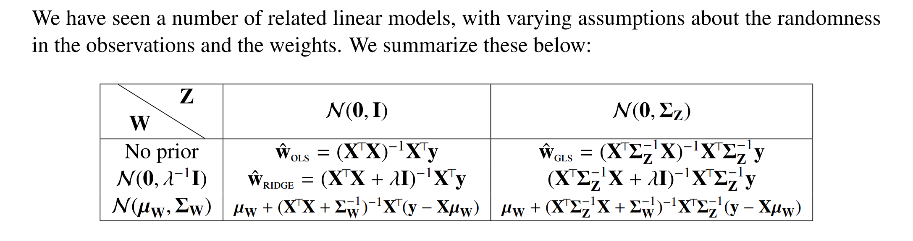
> Basically we are making assumptions about the randomness of the data and that of the weight.
> 
> And it is just the tug of war between the prior and likehood distribution that determines the posterior distribution. [Priors&Posteriors](../../../../Data_Science/Statistical_Inference/3_Bayesian_Statistics/Priors&Posteriors.md)
> 
> For all of the following discussion, we assume that the observation takes the form $$\vec{y}=X\vec{w}+\vec{z}$$ where:
> 1. $X$ is our data matrix(each row is a data point of $d$ dimension)
> 2. $\vec{y}$ is our noisy observation.
> 3. $\vec{z}$ is our noise. 
> 4. $\vec{w}$ is out parameters.
> 5. **Likelihood:** $\vec{z}$'s covariance matrix $\Sigma_Z$controls the weights we put on each data point. The bigger the eigenvalue value $\lambda_i(\Sigma_Z)$ is, the smaller variance of that data point, and the more weight will be put on the data point since it is likely match the true underlying de-noised point.
> 6. **Prior:** $\vec{w}$'s covariance matrix $\Sigma_W$ controls the weights we put on the regularization terms. When i-th eigenvalue $\lambda_i(\Sigma_W)$ is large, this means $w_i$ may take on a wide range of values. Thus we do not want to penalize that dimension as much, preferring to let the data fit sort it out and the weight(force of penalization) will be small.
> 7. The weights mentioned earlier is determined by the eigenvalues of $\Sigma_Z^{-1}$ for data points and eigenvalues of $\Sigma_W^{-1}$ for the parameters.


## Ordinary Least Square
> [!def]
> When $\vec{z}\sim \mathcal{N}(\vec{0},\sigma^2I_n)$, our MAP becomes:
> $$\begin{aligned}\hat{\mathbf{w}}&=\underset{\mathbf{w} \in \mathbb{R}^d}{\arg \max }~p(\mathbf{w}|Y_{1,\cdots,}Y_n,X_{1,\cdots,}X_n,\sigma^2)\\&=\underset{\mathbf{w} \in \mathbb{R}^d}{\arg \max }~\frac{p(Y_{1,\cdots,}Y_n|\mathbf{w},X_{1,\cdots,}X_n,\sigma^2)p(\mathbf{w})}{p(Y_{1,\cdots,}Y_n,X_{1,\cdots,}X_n,\sigma^2)}\\&=\underset{\mathbf{w} \in \mathbb{R}^d}{\arg \max }~\frac{L(\mathbf{w})p(\mathbf{w})}{P(Y_{1,\cdots,}Y_n)}\\&=\underset{\mathbf{w} \in \mathbb{R}^d}{\arg \max }~L(\mathbf{w})p(\mathbf{w})\\&=\left(\sum_{i=1}^n \left(y_i-\mathbf{x}_i^{\top} \mathbf{w}\right)^2\right)\end{aligned}$$
> 
> $$\underset{\mathbf{w} \in \mathbb{R}^d}{\arg \min }\left(\sum_{i=1}^n \left(y_i-\mathbf{x}_i^{\top} \mathbf{w}\right)^2\right)$$


## Weighted Least Square
> 


## Ridge Regression
> [!def]
> 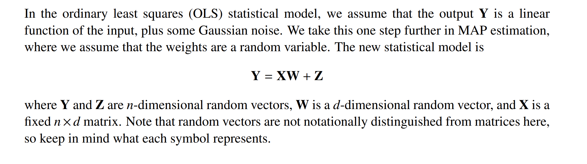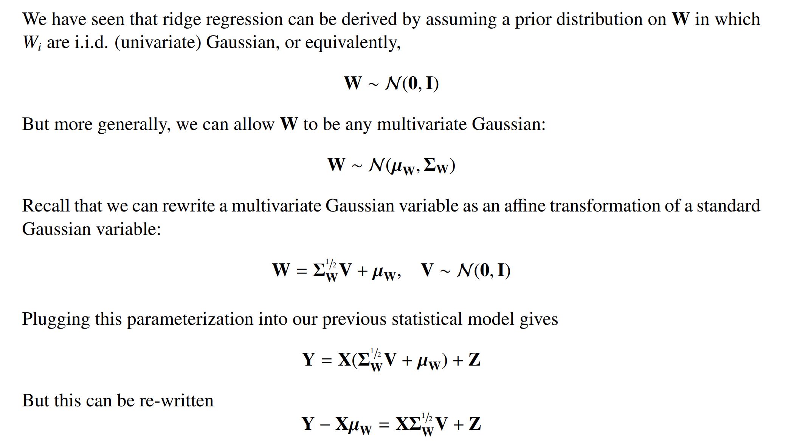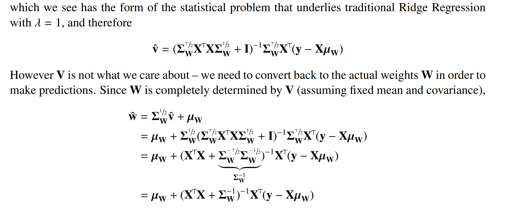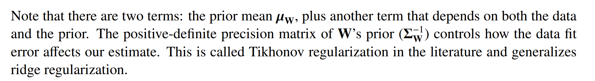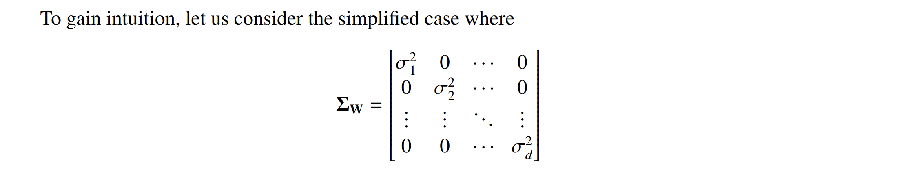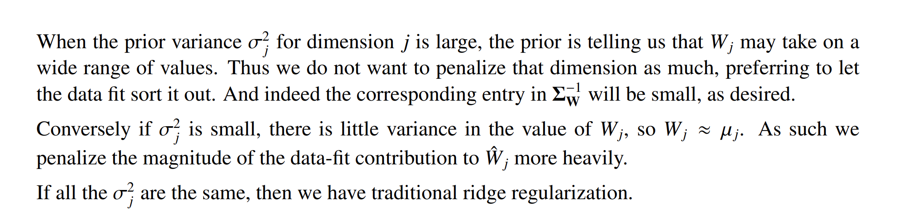

> [!example] Bayesian Linear Regression
> Suppose we have dataset $D_N=\left\{\left(\vec{x}_1, y_1\right),\left(\vec{x}_2, y_2\right), \cdots,\left(\vec{x}_N, y_N\right)\right\}$, where we assume a p-dimension model $\vec{y}=X \vec{w}+\vec{\varepsilon}$ where $\vec{\varepsilon} \sim N\left(0, \sigma^2 I_n\right), \vec{w} \sim N\left(\vec{\mu}_0, \sigma_0^2 I_n\right)$, where both the noise and prior are i.i.d., then we have:
> $$\begin{aligned}& f\left(\vec{w} \mid x, \vec{y}, \sigma^2\right)=\frac{f\left(\vec{y} \mid \vec{w}, X, \sigma^2\right) f(\vec{w})}{f\left(\vec{y} \mid x, \sigma^2\right)} \\& \propto-\left\{\frac{\sum_{i=1}^N\left(y_i-\vec{x}_i^{\top} \vec{\omega}\right)^2}{2 \sigma^2}+\frac{\sum_{i=1}^p\left(w_i-\mu_i\right)^2}{2 \sigma_0^2}\right\} \\& =-\frac{\sigma_0^2\|X \vec{w}-\vec{y}\|_2^2+\sigma^2\left\|\vec{w}-\vec{u}_0\right\|_2^2}{2 \sigma^2 \sigma_0^2} \\& \vec{w}^*=\underset{\vec{w}}{\operatorname{argmax}} f\left(\vec{w} \mid x, \vec{y}_1 \sigma^2\right) \\& =\underset{\omega}{\operatorname{argmin}} \sigma_0^2\|X \vec{w}-\vec{y}\|_2^2+\sigma^2\left\|\vec{w}-\vec{u}_0\right\|_2^2 \\& =\underset{\vec{\omega}}{\operatorname{argmin}}\left\|\left[\begin{array}{c}\sigma_0 X \\\sigma_{p}I_p\end{array}\right] \vec{\omega}-\left[\begin{array}{c}\sigma_0 \vec{y} \\\sigma_p \vec{u}_0\end{array}\right]\right\|_{=}^2 \\& =\left(X^{\top} X+I_p\right)^{-1}\left(X^{\top} \vec{y}+\vec{u}_0\right) \\&=\left(X^{\top} X+I_p\right)^{-1}X^{\top} \left(\vec{y}-X^{\top}\vec{u}_0\right)+\vec{u}_0\end{aligned}$$
> 


## Bayesian Perspective
> [!important]
> 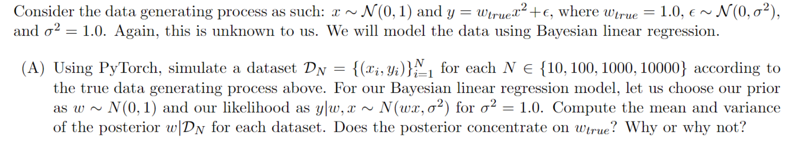
> The formula is inspired by [Weighted Average of Prior and Data](../../../../Data_Science/Statistical_Inference/3_Bayesian_Statistics/Priors&Posteriors.md#Guassian%20Priors#Weighted%20Average%20of%20Prior%20and%20Data) and derived below:
> Suppose we have dataset $D_N=\left\{\left(x_1, y_1\right),\left(x_2, y_2\right), \cdots,\left(x_N, y_N\right)\right\}$, where we assume a $1-d \operatorname{model} y_i=\omega x_i+\varepsilon_i$ where $\varepsilon_i \sim N\left(0, \sigma^2\right), \omega \sim N\left(\mu_0, \sigma_0^2\right)$
> Then the posterior distribution :$$\begin{aligned}f\left(\omega \mid D_N\right) & =f\left(\omega \mid x_1, x_2, \cdots, x_N, y_1, y_2, \cdots, y_n, \sigma^2\right) \\& =\frac{f\left(y_1, y_2, \cdots, y_N \mid \omega, x_1, x_2, \cdots, x_N, \sigma^2\right) f(\omega)}{f\left(y_1, y_2, \cdots y_N \mid x_1, x_2, \cdots x_N\right)} \\& \propto \prod_{i=1}^N \exp \left\{-\frac{1}{2 \sigma^2}\left(y_i-\omega x_i\right)^2\right\} \exp \left\{-\frac{1}{2 \sigma_0^2}\left(\omega-\mu_0\right)^2\right\} \\& \propto-\frac{\sigma_0^2 \sum_{i=1}^N\left(y_i-\omega x_i\right)^2+\sigma^2\left(\omega-\mu_0\right)^2}{2 \sigma^2 \sigma_0^2} \\& =-\frac{\left(\sum_{i=1}^N x_i^2 \cdot \omega^2-2 \sum_{i=1}^N x_i y_i \cdot \omega+\sum_{i=1}^N y_i^2\right) \sigma_0^2+\left(\omega^2-2 \mu_0 \cdot \omega+\mu_0^2\right) \cdot \sigma^2}{2 \sigma^2 \sigma_0^2} \\& =-\frac{\left(\sigma_0^2 \sum_{i=1}^N x_i^2+\sigma^2\right) \omega^2-2 \sigma_0^2 \sum_{i=1}^N x_i y_i \cdot \omega+C}{2 \sigma^2 \sigma_0^2} \\\therefore \mu_{\text {post }} & =\frac{\sigma_0^2 \sum_{i=1}^N x_i y_i+\sigma^2\mu_0}{\sigma_0^2 \sum_{i=1}^N x_i^2+\sigma^2} \quad \sigma_{\text {post }}^2=\frac{\sigma^2 \sigma_0^2}{\sigma_0^2 \sum_{i=1}^N x_i^2+\sigma^2}\end{aligned}$$
> 
> 


> [!code]
```python

```


## Generalized Least Square
> [!def]
> 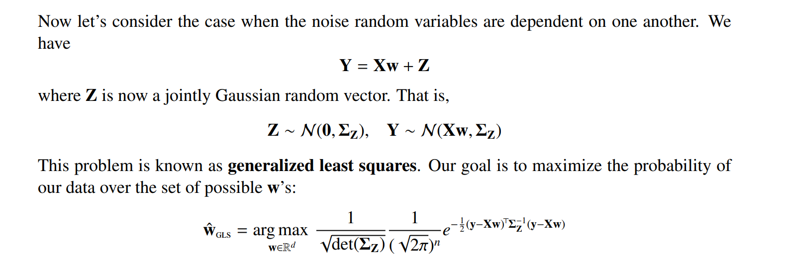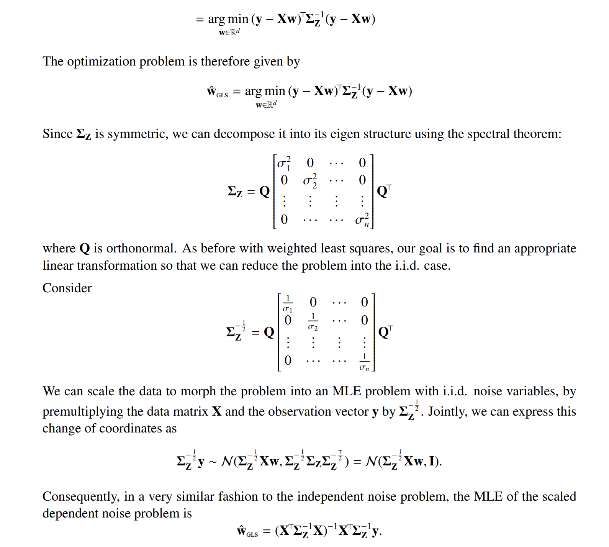


# Gausian Process Regression
Also see:
https://www.youtube.com/watch?v=4vGiHC35j9s
https://www.cs.cornell.edu/courses/cs4780/2018fa/lectures/lecturenote15.html

## Gaussian Process Definition
See [Gaussian_Process](../../EECS126/3_Random_Processes/Gaussian_Process.md)

## Noiseless GP Regression
### Centered Version
> [!important]
> 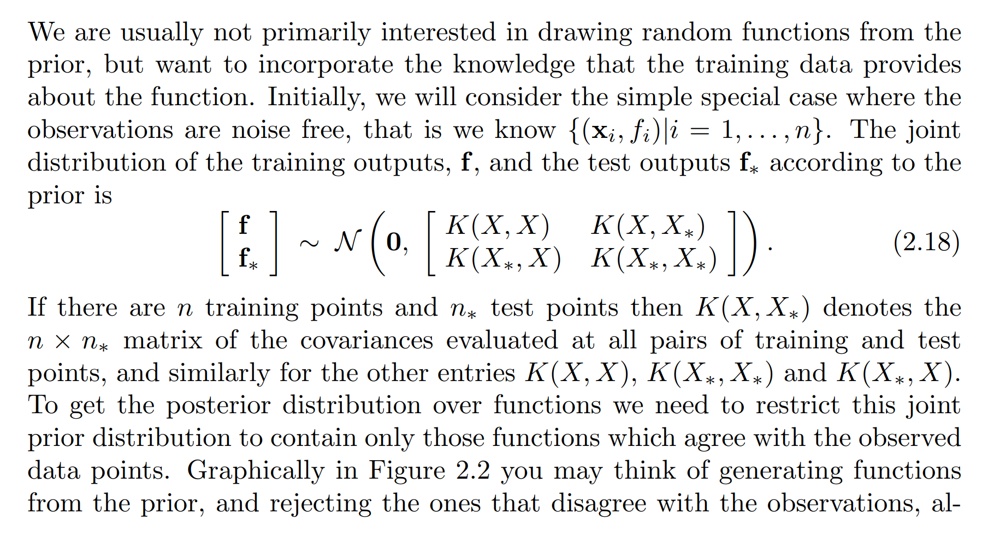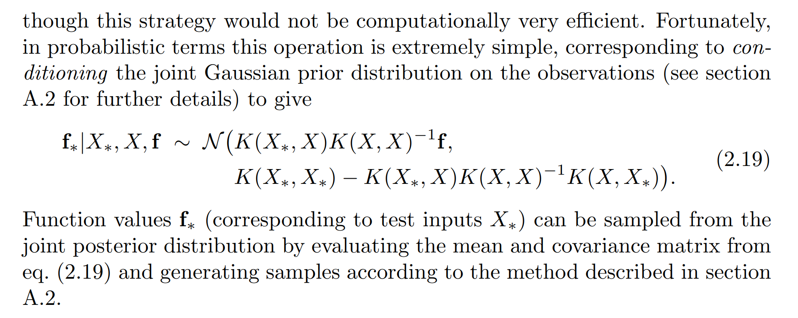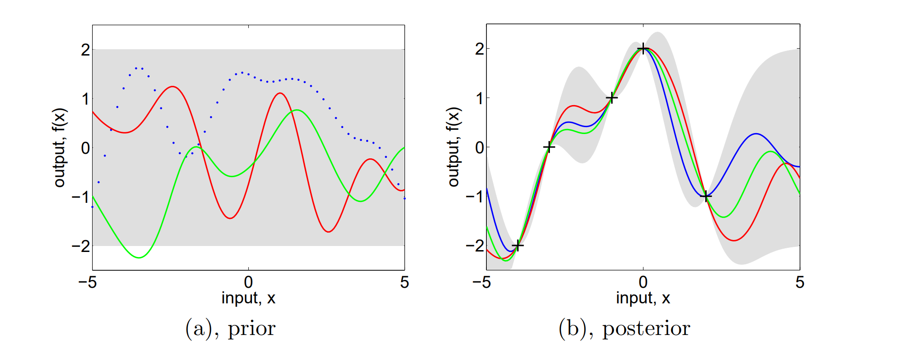


### Generalized Version
> [!algo]
> 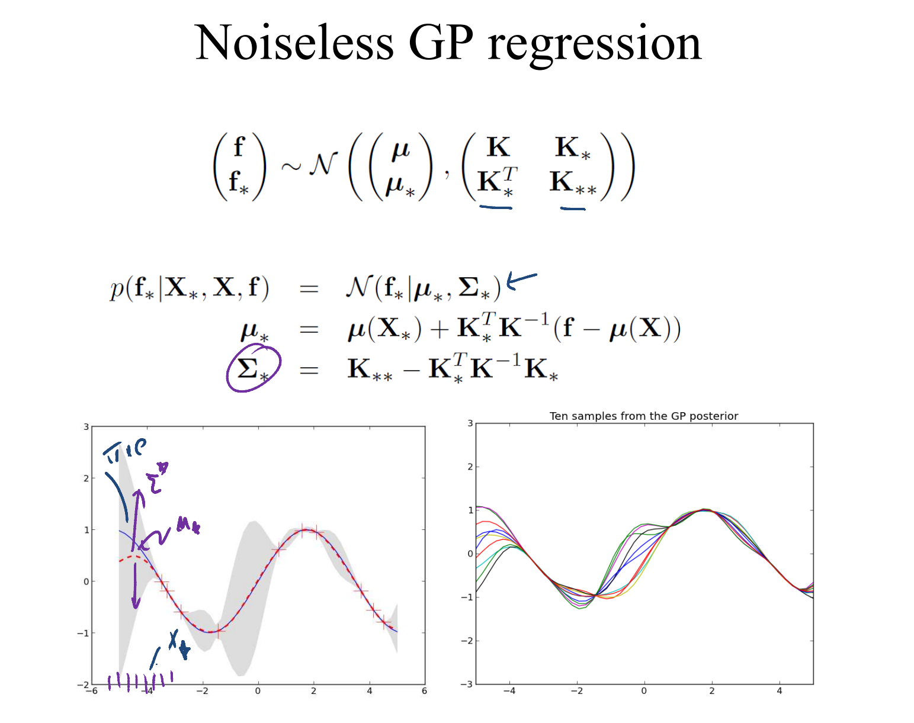


### Choice of Kernel
> [!def]
> 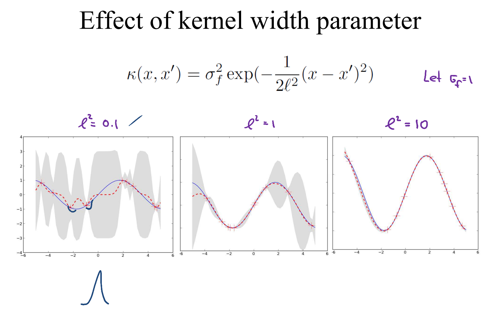
> Here the prediction function is in red while the true function is in blue.
> 
> Note that the smaller the bandwidth of the exponential kernel, the more squiggly the prediction function would be, indicating that we only consider the points near the data points.
> 
> In other words, we control the smoothing of our prediction.


## Noisy GP Regression
> [!algo]
> 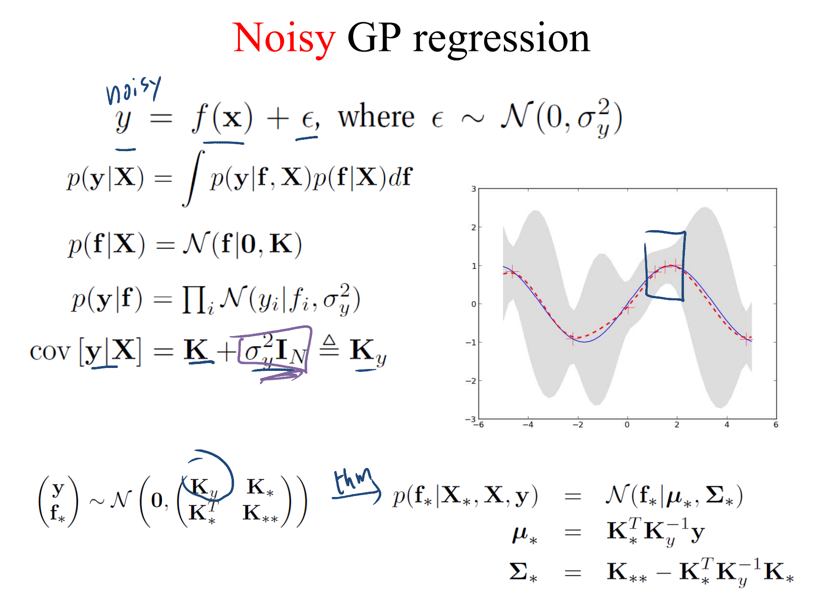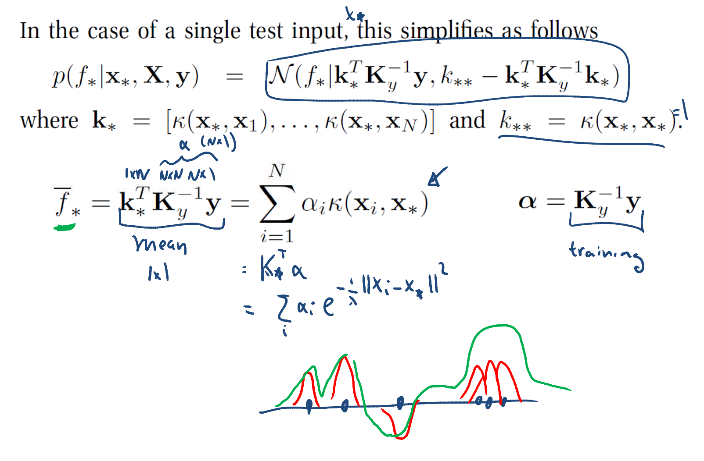


## Noise GP and Ridge
> [!algo]
> 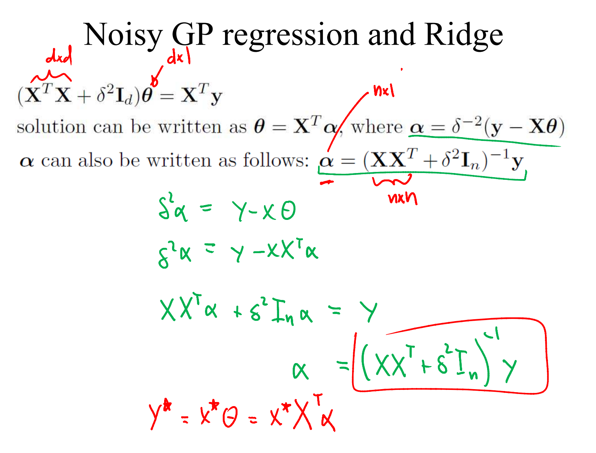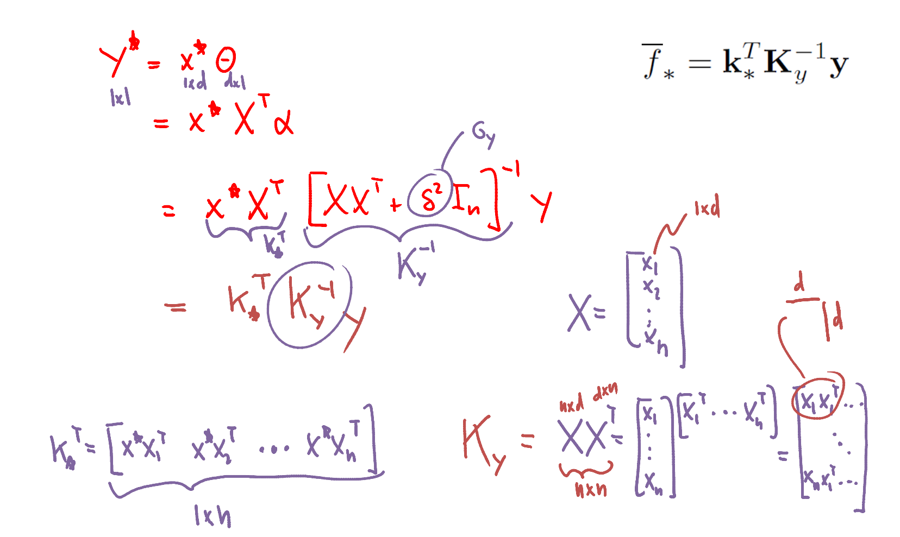


## Learning the Kernel Parameters
> [!important]
> 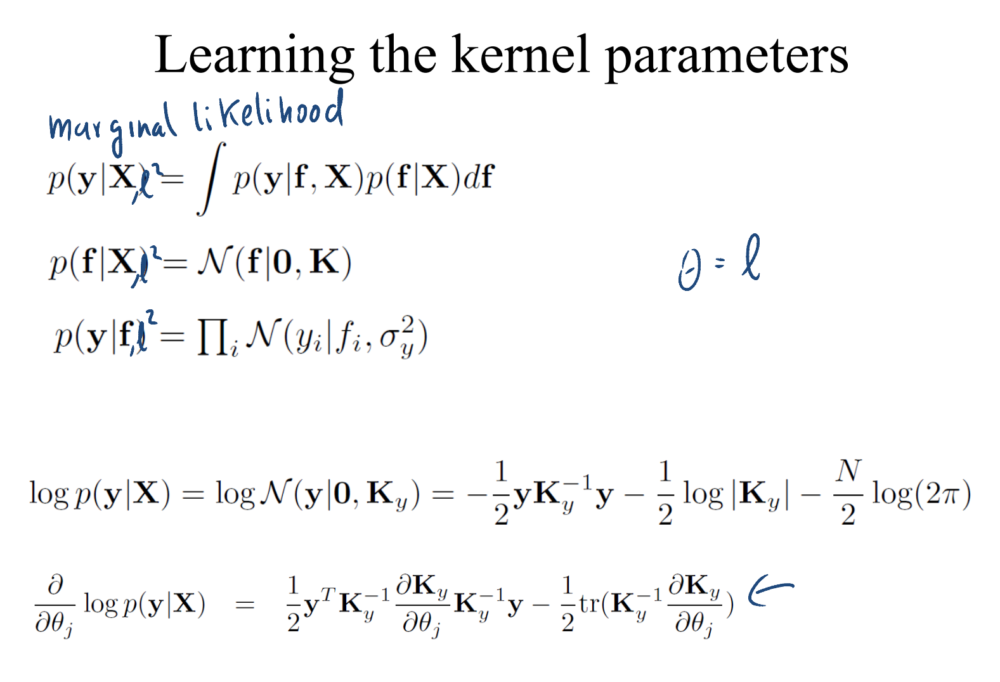


# Polynomial Regression


# Kernel Regression


# Automatic Relevancy Determination(ARD)


