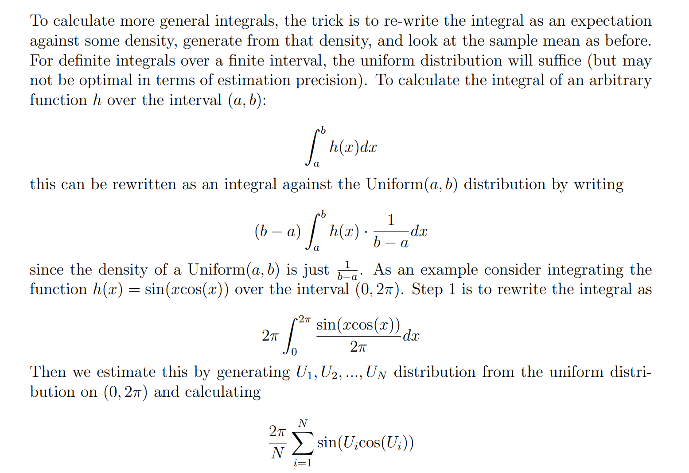
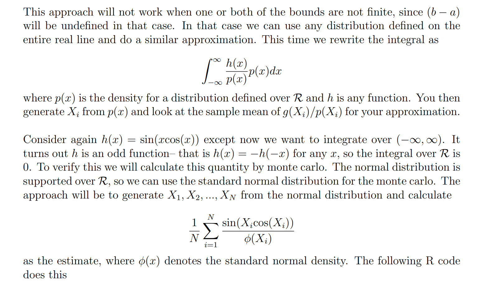
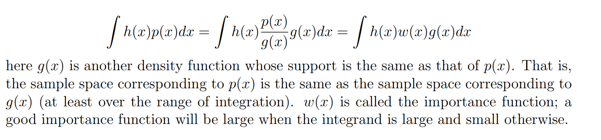
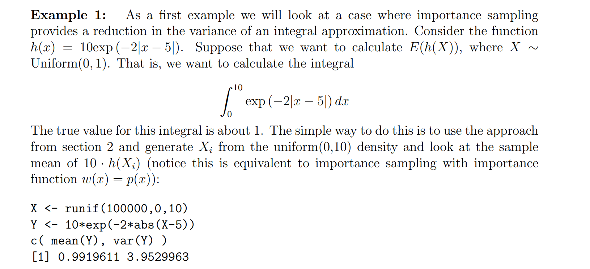
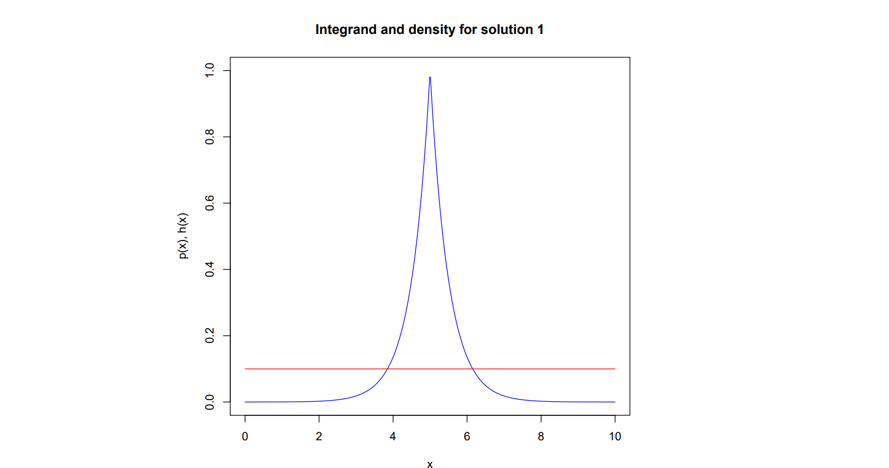
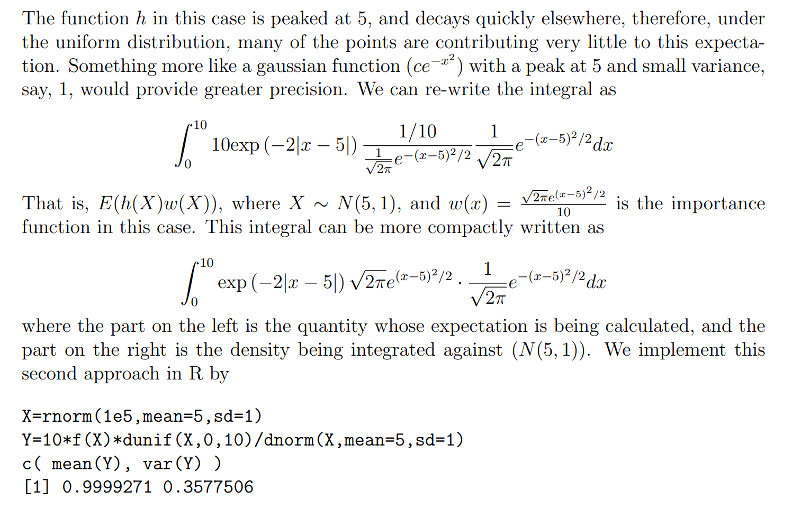
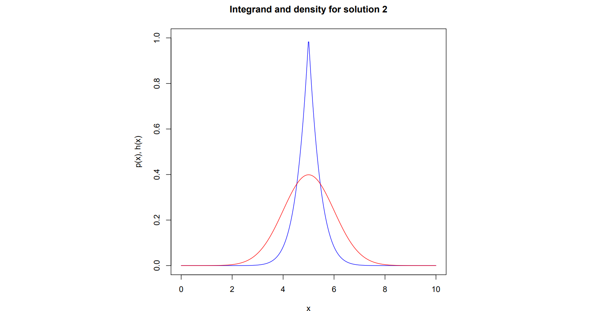
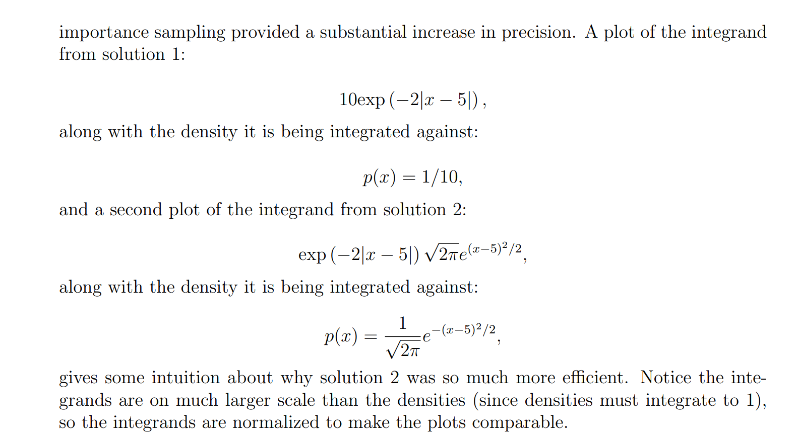
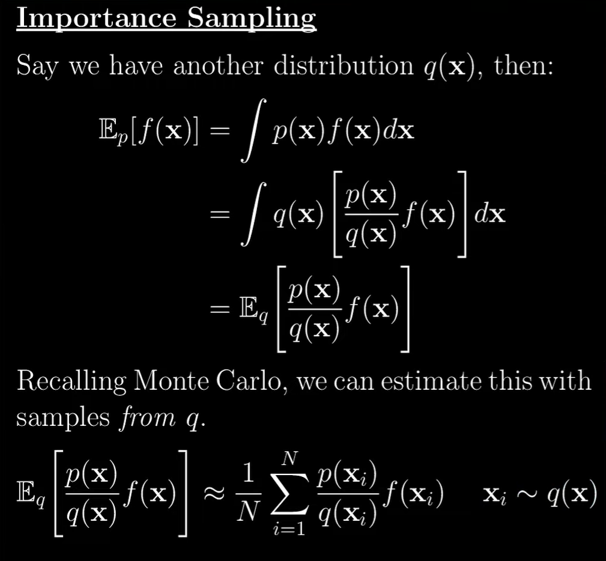

# Monte Carlo Integral
## Calculating Bounded Integrals
> [!def]
> 

> [!code]
```r
# underlying uniforms
U <- runif(100000, 0, 2*pi)

# calculate h(U)
hU <- sin(U*cos(U))

# monte carlo approximation
2*pi*mean(hU)
[1] -1.048418

# R’s numerical integration approximation
h <- function(u) sin(u*cos(u))
integrate(h, 0, 2*pi)$val
[1] -1.041727
```


## Calculating Unbounded Integrals
> [!def]
> 

> [!code]
```r
X <- rnorm(100000)
Y <- sin(X*cos(X))/dnorm(X)
mean(Y)
[1] -0.3657281

```


# Importance Sampling
## Motivations
> [!motiv] Motivation
> One of the principal reasons for wishing to sample from complicated probability distributions is to be able to evaluate expectations of the tasrget distribution.
> 
> The technique of importance sampling provides a framework for approximating **expectations** directly but **does not** itself provide a mechanism for drawing samples from distribution p(z).
> 
> The art of this method lies in the choice of a good proposed distribution $g(\cdot)$


## Examples
### Laplacian Distribution Expectation
> [!example] Solution 1: Use Monte Carlo Integration Approximation
> 

> [!example] Solution 2: Important Sampling, Gaussian as Proposed Distribution
> 


### Double Exponential Density
> [!def]
> 


 


## Algorithm Procedure
> [!algo]


> [!proof]
> 


## Advantages
> [!important]
> 


## Code Example
> [!code]


## Advantages
> [!important]
> **Importance sampling is likely to be useful when:**
> 1. _p(x)_ is difficult or impossible to sample from.
> 2. We need to be able to evaluate _p(x)_. Meaning we can plug in an _x_ and get a value. In fact, that’s a little more than we need we actually only need. The ability to compute an unnormalized density but we’d have to tweak our procedure a bit. See sources if you’re curious.
> 3. _q(x)_ needs to be easy to evaluate and sample from since our estimate will ideally be made of many samples from it.
> 4. Lastly, and the hard part, is that you need to be able to choose _q(x)_ to be high where the absolute value of _p(x)_ times _f(x_) is high which is not necessarily an easy task.


## Drawback
> [!bug] Caveats


# Monte Carlo Markov Chain


# Metropolis Hastin Algorithm


# Hybrid Monte Carlo Algorithm