# Goal of Sampling
> [!important]
> 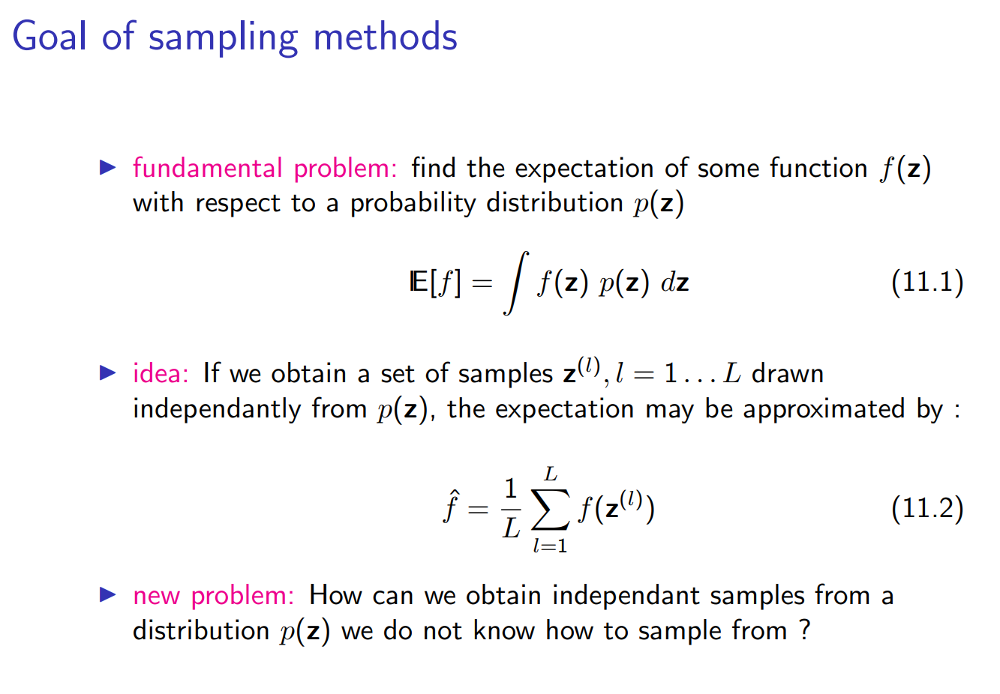


# Inverse Method
## Algorithm Procedure
> [!algo] Transformation Method
> Suppose we want to sample a data point $y$ from arbitrary distribution $f$, we follow the following algorithm:
> 1. Sample a point $z\sim U(0,1)$.
> 2. Compute the inverse of the CDF of $p$, denote it by $F$.
> 3. Compute the target sample point by $y=F^{-1}(z)$.
> 
> The algorithm works for 2d case as well: Suppose we want to sample $x, y$ from some joint distribution $f_{X,Y}$, then:
> 1. We first sample $y$ from marginal distribution of $Y$ using inverse-transform sampling of 1d case and obtain $y_{samp}$.
> 2. We sample $x$ from the conditional distribution at $Y|x_{samp}$ using inverse-transform sampling of 1d case and obtain $x_{samp}$
> 3. Pair them up we get $(x_{samp},y_{samp})$.
> 

## 1D Proof
> [!proof]
> 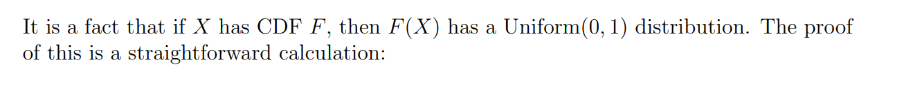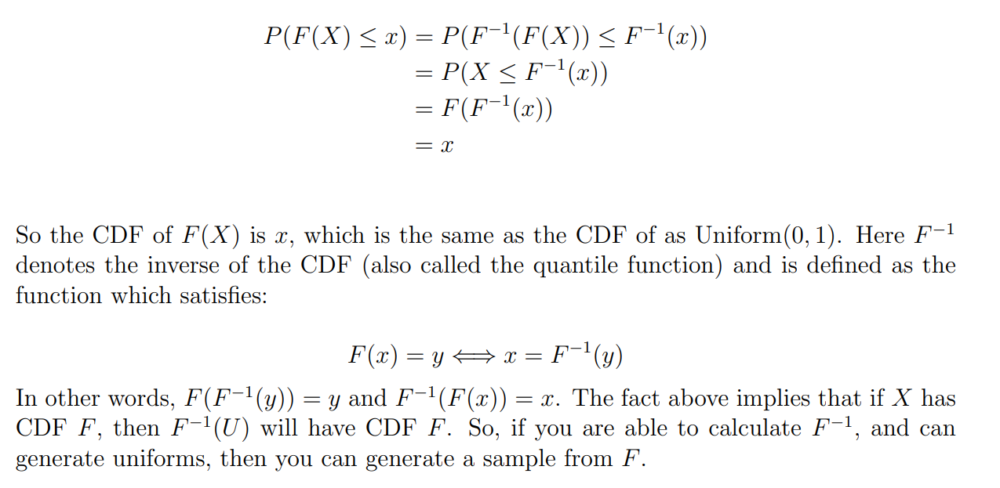

> [!example]
> 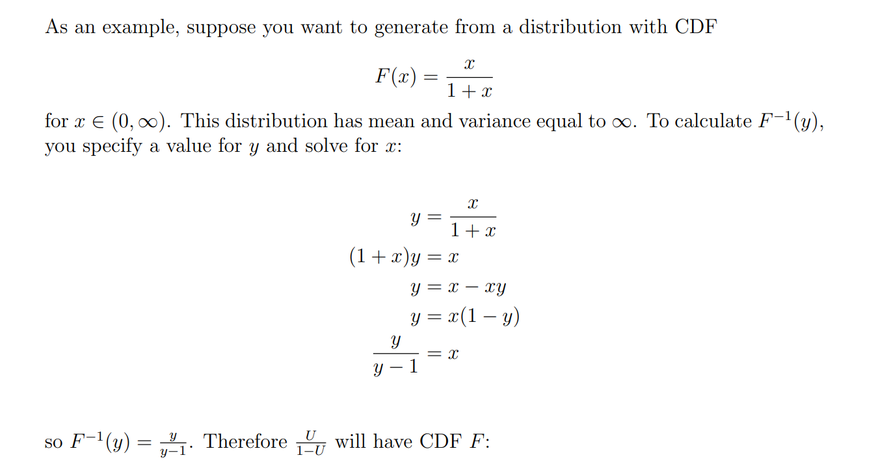


## 1D-Exponential Example
> [!important]
> Inverse Transform Sampling: One of the fundamental reasons sampling from exponential distributions is straightforward is the inverse transform sampling method. The cumulative distribution function (CDF) of an exponential distribution is simple and invertible. 
> 
> Given a random variable $U$ distributed uniformly over the interval $[0,1]$, one can obtain a sample from an exponential distribution by applying the inverse of the CDF to $U$. For an exponential distribution with rate $\lambda$, the CDF is $F(x)=1-e^{-\lambda x}$, and its inverse is $F^{-1}(u)=-\frac{\ln (1-u)}{\lambda}$, where $u$ is a sample from a uniform distribution. This method can be easily applied piecewise.


## 2D-Sampling Example
> [!example] 2D-Example
> 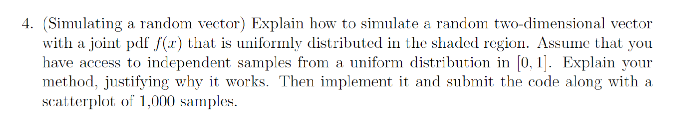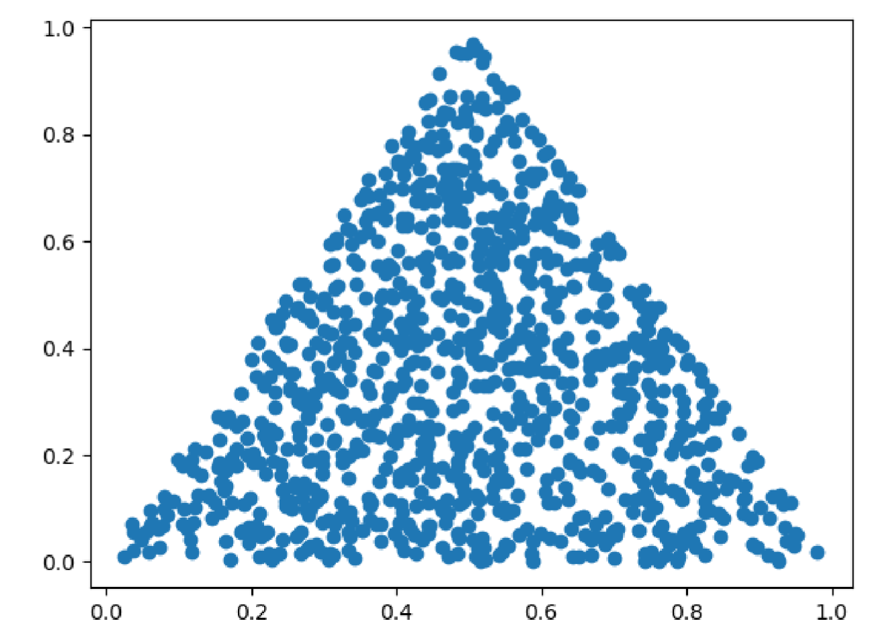

```python
# Problem 4
# Generate jointly distributed samples from independent uniform distribution
def generate_one_sample(inverse_CDF_u1, inverse_CDF_u2):
    u1 = generate_u1(inverse_CDF_u1)
    u2 = generate_u2(inverse_CDF_u2, u1) 
    return u1, u2
    
# Just for this problem
def define_inverse_CDF():
    func_u1 = lambda x: 1 - np.sqrt(1 - x)
    func_u2 = lambda x, y: (1 - y) * x + (1 / 2) * y
    
    return func_u1, func_u2

# Apply Inverse Sampling 
def generate_u1(inverse_CDF):
    u = np.random.uniform(0,1,1)
    return inverse_CDF(u)

# Applying Inverse Sampling, Conditional Probability
def generate_u2(inverse_CDF, u1):
    u = np.random.uniform(0,1,1)
    return inverse_CDF(u, u1)

def draw_scatter_plot(data):
    # Since we first generate y, then x.
    plt.scatter(data[:,1], data[:,0])
    plt.show()

def main_procedure(sample_size = 1000):
    sample_points = []
    inverse_CDF_u1, inverse_CDF_u2 = define_inverse_CDF()
    for i in range(sample_size):
        sample_points.append([*generate_one_sample(inverse_CDF_u1, inverse_CDF_u2)])
    
    data = np.array(sample_points)
    draw_scatter_plot(data)
    
main_procedure(1000)
```


## N-D Generalization
> [!def]
> 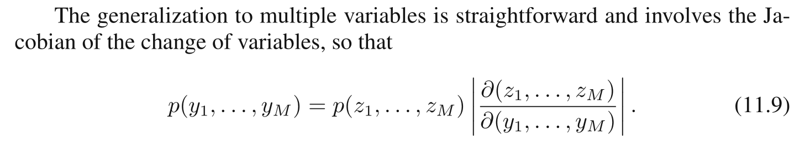
> Basically, it means to generate a random vector that follows N-D uniform distribution where $p(z_{1},z_{2},\cdots, z_{n})=1$, then use the Jacobian transformation to get the generated sample. 
> 
> Similarly, we want to find a bijection $f$ such that $y_{1},y_{2},\cdots, y_{n}=f(z_{1},z_{2},\cdots, z_{n})$ where we can construct multi-dimensional samples from uniform samples.

## Drawback
> [!bug] Caveats
> Obviously, the transformation technique depends for its success on the ability to:
> 1. Directly calculate the CDF of target distribution
> 2. Invert the CDF of the target distribution. 
> 
> Such operations will only be feasible for a limited number of simple distributions.


# Transformation Method
> [!def]
> 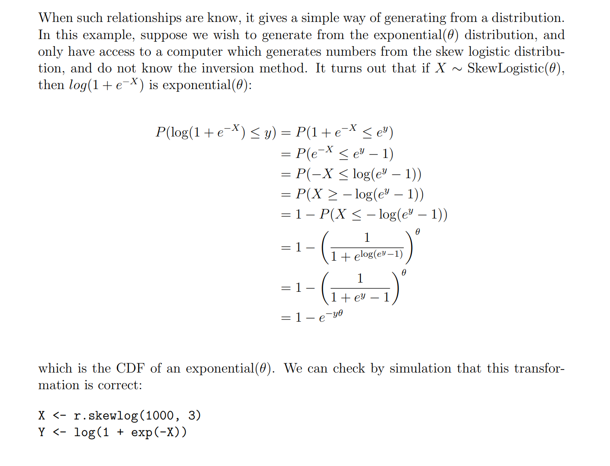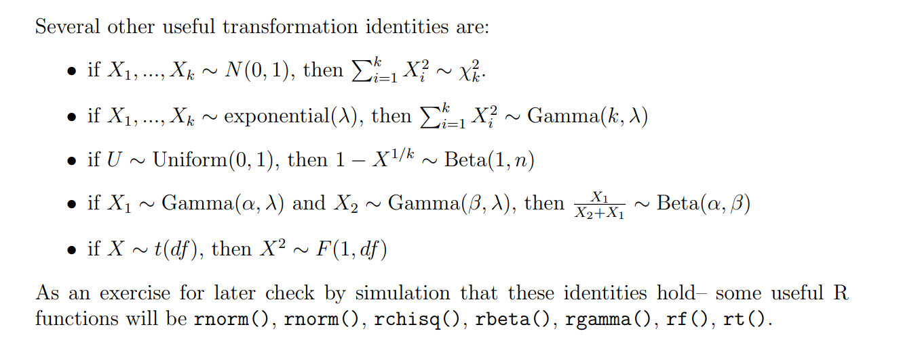


# Rejection Sampling
> [!overview]
> The rejection sampling framework allows us to sample from relatively complex distributions, subject to certain constraints. 
> 1. We don't need explicit form of CDF of target distribution.
> 2. Nor do we require the explicit form of PDF of target distribution.
> 
> Rejection sampling is the conceptually simplest way to generate samples of some arbitrary probability function without having to do any transformations. No integration, no trickery, you simply trade computational efficiency away to keep everything as simple as possible.


## Algorithm Assumptions
> [!important]
> 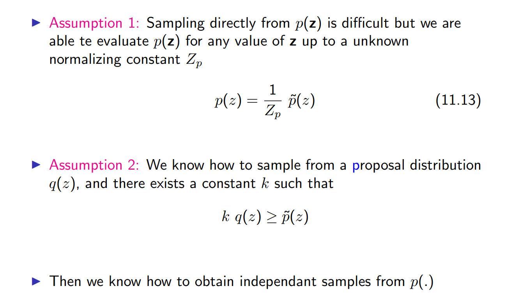
> **Important Notes:**
> 1. Proposed probability is easy to evaluate at any point $s$, lower $q(s)$ means it is very rare for this sample $s$ to be proposed. In other words, we are very unlikely to see it again for a long time. 
> 2. Accept probability is calculated by $\frac{\tilde{p}(s)}{k\cdot q(s)}$. Now ignore $k$, a large accept probabilitiy means high $\tilde{p}(s)$ and low $q(s)$.
> 	1. High $\tilde{p}(s)$ is the same wording as high $p(s)$, meaning that this sample is very likely to appear in our target distribution, we'd better accept it.
> 	2. Low $q(s)$, as explained before, is that the entropy of this sample is very high(they don't normally show up), so we'd better keep up.
> 	3. So large accept probability means we should keep the sample $s$.
> 	4. Since accept probability can get very large, we use $k$ to scale it so that it can become a valid probabilitity density function.
> 3. The choice of $k$ must ensure that $k\cdot q(s)$ is pointwisely above the graph of $\tilde{p}(s)$.


## Decision Rule
> [!motiv] Motivation
> Let's say that we have sampled some sample $s$ from the proposal distribution $q$. How do we proceed from here?
> 
> Naturally, we need to consider some rule with which to decide whether this sample should be taken or not. The intuition is that we would like to take this sample if it is highly likely under the target distribution $p$, and reject it if otherwise. On the other hand, we also want to consider whether this sample is a likely to occur again under the proposal distribution $q$. Therefore, we can consider a total of four cases:
> - $s$ is likely to occur in both $p$ and $q$
> - $s$ is likely to occur in $p$, but not $q$
> - $s$ is likely to occur in $q$, but not $p$
> - $s$ is unlikely to occur in both $p$ and $q$
> 
> I think the interesting cases are (2) and (3). In (2), the sample is likely to occur under the target distribution, but not much so under the proposal distribution. In this case, we would want to accept the sample, **since we never know when $s$ will be sampled again from the target distribution.** Conversely, in (3), we want to reject it with a high probability since we will be seeing a lot of that same sample from the proposal distribution, but not from the target distribution.

> [!thm]
> With this intuition in mind, we might have a better of idea why the decision rule for rejection sampling is the way it is. The rule might be expressed as follows:
> $$
> \mathbb{I}_{\in\{0,1\}}=\frac{p(s)}{K q(s)}>u...................(2)
> $$
> where
> $$u \sim U(0,1)$$
> 
> If the indicator variable, denoted as $\mathbb{I}$ is 1 (or true), then we accept the sample; else, we reject it.
> 
> This was my hasty attempt at formalizing, admittedly with some abuse and misuse of notation, so let's clarify what the decision rule is in plain words. First, $K$ is just a constant we use to scale up the proposal distribution such that
> 
> $$K q(s) \geq p(s) \forall s \in S...................(3)$$
> 
> Since we don't know if the target distribution $p$ has properly been scaled or not, we have to scale the proposal distribution accordingly so that $q$ is always greater or equal to $p$ across the common domain. This makes a little more sense if you think about (2). This appropriate scaling will ensure that the fraction always lies between zero and one, which is what we want: we're essentially comparing the value of this fraction with a uniform random variable sampled from the range $[0,1]$. If the value of the fraction is larger than this randomly sampled uniform variable, then we accept the sample $s$; if not, we reject it and move onto the next sampling iteration.
> 
> Note the fractional expression essentially encompassing the intuition we developed earlier. If the denominator is small and the numerator is large, that means the sample falls under case (2); the reverse of that would be (3). The larger the value of the fraction, the more likely we are to accept it, which is the desired behavior.


## Algorithm Procedures
> [!algo]
> 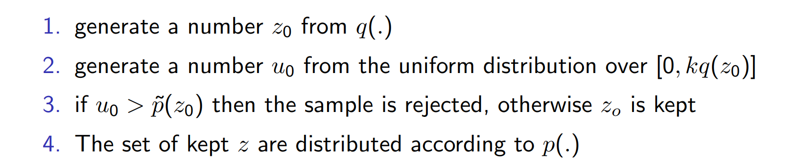
> Alternatively, for a more coding-friendly version, we have the following procedures:
> 1. Generate $U \sim \operatorname{Uniform}(0,1)$
> 2. Generate $X \sim q$
> 3. If $U \leq \frac{p(X)}{k \cdot q(X)}=\frac{\tilde{p}(X)}{ k\cdot Z_{p}\cdot q(X)}$ then accept $X$ as a realization from $p_1$, otherwise throw out $X$ and try again


## Proof Idea
> [!proof]
> We want to prove that the accepted sample point follows the target distribution. Mathematically, we want to prove that $$D(s|A)=p(s)$$ where $D(\cdot)$ is the probability density of the accepted sample $s$, $A$ is the event that the sample is accepted.
> By bayes rule we have $$\begin{aligned}D(s|A)&=\frac{p(A|s)D(s)}{p(A)}\\&=\frac{\frac{\tilde{p}(s)}{k\cdot q(s)}\cdot q(s)}{\int_{s}\frac{\tilde{p}(s)}{k\cdot q(s)}\cdot q(s)ds}\\&=\frac{\frac{p(s)\cdot Z_{p}}{k}}{\int_{s}\frac{p(s)\cdot Z_{p}}{k}ds}\\&=p(s)\end{aligned}$$ where the last equation follows since $p(s)$ is a valid probability distribution and thus $\int_{s}p(s)ds=1$.


## Code Example
> [!code]
> https://github.com/AlexMan2000/NYU-Master-Program/blob/master/DS-GA-1003/reading_codes/rejection_sampling.ipynb


## Drawback
> [!bug] Inefficiency
> When the function $\tilde{p}(s)$ has very sharp spark, and we choose our $q(s)$ to be normal distribution(no sharp spark), our $k$ needs to be very large to ensure that it is an upper bound for $\tilde{p}(s)$ at any $s$. But such choice would lead to low accept probability, as shown below:
> 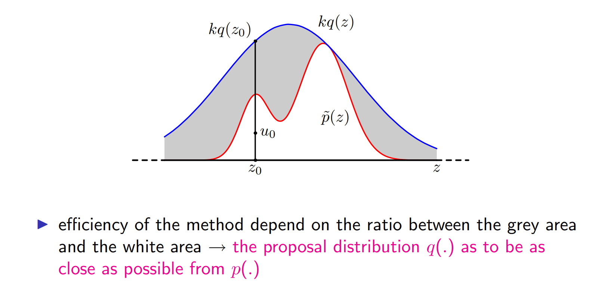
> In short, we should choose our $q(s)$ so that its shape should be close to $\tilde{p}(s)$(or $p(s))$ such that $k$ is small and thus accept probability is large and thus efficiency is high.


# Adaptive Rejection Sampling
> [!overview]
> Adaptive rejection sampling is a statistical algorithm for generating samples from a **univariate, log-concave density**. Because of the adaptive nature of the algorithm, rejection rates are often very low.
> 


## Algorithm Procedure
> [!algo]
> Reference: https://dlennon.org/page/20160926_ars
> 1. Establish a set of fixed points and evaluate the log-density, $h(\cdot)=log(p(\cdot))$, and derivative of the log-density on the fixed points.
> 2. Use these function evaluations to construct a piecewise-linear, upper bound for the log-density function, $h_{+}$, via supporting tangent lines of the log-density at the fixed points.
> 3. Let $g_{+}=exp\{h_{+}\}$. Since $h_{+}$ is piecewise linear, $g_{+}$ is piecewise exponential. Because of this property, sampling $Y\sim g_{+}$ is straightforward.
> 4. $\operatorname{Pick} U \sim \operatorname{Unif}(0,1)$. If $U \leq \exp \left(h(Y)-h_{+}(Y)\right)$, accept $Y$; else, draw another sample from $g_{+}$.
> 5. For any $Y$ rejected by the above criteria, $Y$ may be added to the initial set of fixed points and the piecewise linear upper bound, $h_{+}$, adaptively updated.


## Example with Code
> [!example]
> We apply the algorithm to the following distribution. Here we specify a log-concave density function. Note $\exp (h)$ is the density, and $h$ is the concave log-density:$$h(y)=r y-m \log (1+\exp (y))-\frac{(y-\mu)^2}{2 \sigma^2}+c$$
> where $y$ is real valued, $c$ is a constant such that the integral of $\exp (h)$ has unit area, $r=2, m=10, \mu=0$, and $\sigma^2=1$. 
> 
> Note that here we set $c = 0$ for simplicity so that $\int_{-\infty}^{\infty}exp(h(y))dy=1$


### Define the Function
> [!code]
> First, define the function, h, and its derivative, dh.
```r
params.r = 2
params.m = 10
params.mu = 0
params.sig2 = 1

## the log of a log-convex density function
ymin = -Inf
ymax = Inf
h = function(y){
    v = params.r*y - params.m * log(1+exp(y)) - (y-params.mu)^2/(2*params.sig2) # plus normalizing const
    return(v)
}

## derivative of h
dh = function(y)
{
    params.r - params.m * exp(y) / (1 + exp(y)) - (y-params.mu)/params.sig2
}
```


### Compute the Envelope
> [!overview]
> 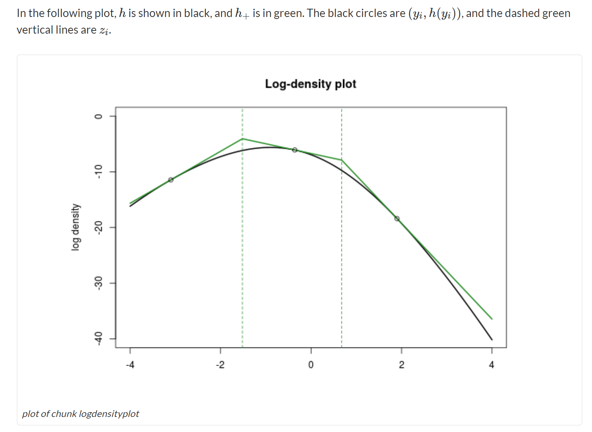

> [!code]
> 
```r
## evalutate the unnormalized, piecewise-linear upper-bound of the log-density
hplus = function(y, yfixed) 
{
    res = rep(0, length(y))
    zfixed = zfix(yfixed)

    piecewise.idx = findInterval(y, c(ymin, zfixed, ymax))
    npieces = length(zfixed) + 2
    for(pidx in 1:npieces){
        yp = y[piecewise.idx == pidx]
        xx = h(yfixed[pidx]) + (yp - yfixed[pidx])*dh(yfixed[pidx])
        res[piecewise.idx == pidx] = xx
    }
    return(res)
}
```

> [!code]
> 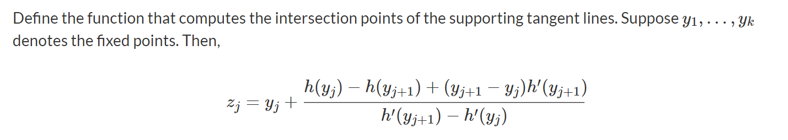
```r
## compute the intersection points of the supporting tangent lines
zfix = function(yfixed)
{
    yf0 = head(yfixed, n=-1)
    yf1 = tail(yfixed, n=-1)
    zfixed = yf0 + (h(yf0) - h(yf1) + (yf1 - yf0)*dh(yf1)) / (dh(yf1) - dh(yf0))
    return(zfixed)  
}
```


### Sample from G+
> [!code]
> 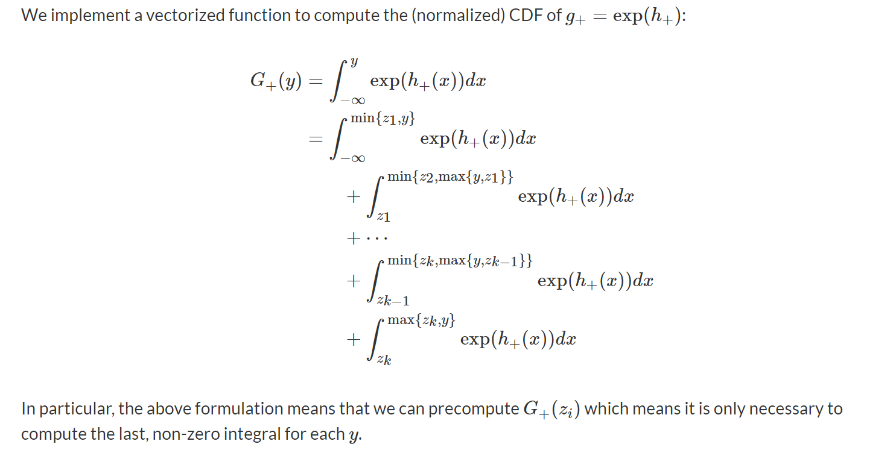
```r
gplus.cdf = function(vals, yfixed) 
{
    # equivalently:  integrate(function(z) exp(hplus(z, yfixed)), lower=-Inf, upper = vals)

    zfixed = zfix(yfixed)

    zlen = length(zfixed)
    pct = numeric(length(vals))
    norm.const = 0
    for(zi in 0:zlen) {
        if(zi == 0)
        {
            zm = -Inf
        } else {
            zm = zfixed[zi]
        }

        if(zi == zlen)
        {
            zp = Inf
        } else {
            zp = zfixed[zi+1]
        }

        yp = yfixed[zi+1]
        ds = exp(h(yp))/dh(yp) * ( exp((zp - yp)*dh(yp)) - exp((zm - yp)*dh(yp)) )

        cidx = zm < vals & vals <= zp
        hidx = vals > zp

        pct[cidx] = pct[cidx] + exp(h(yp))/dh(yp) * ( exp((vals[cidx] - yp)*dh(yp)) - exp((zm - yp)*dh(yp)) )
        pct[hidx] = pct[hidx] + ds

        norm.const = norm.const + ds
    }

    l = list( 
            pct = pct / norm.const, 
            norm.const = norm.const
        )
    return(l)
}
```
> [!code]
> 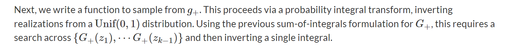
```r
## sample from the gplus density
gplus.sample = function(samp.size, yfixed)
{
    zfixed = zfix(yfixed)
    gp = gplus.cdf(zfixed, yfixed)
    zpct = gp$pct
    norm.const = gp$norm.const
    ub = c(0, zpct, 1)

    unif.samp = runif(samp.size)

    fidx = findInterval(unif.samp, ub)
    num.intervals = length(ub) - 1
    zlow = c(ymin, zfixed)
    res = rep(NaN, length(unif.samp))
    for(ii in 1:num.intervals)
    {
        ui = unif.samp[ fidx == ii ]

        if(length(ui) == 0)
        {
            next
        }

        ## Invert the gplus CDF
        yp = yfixed[ii]
        zm = zlow[ii]
        tmp = (ui - ub[ii]) * dh(yp) * norm.const / exp(h(yp)) + exp( (zm - yp)*dh(yp) )
        tmp = yp + log(tmp) / dh(yp)
        res[ fidx == ii ] = tmp
    }
    return(res)
}
```


### Results
> [!example]
> 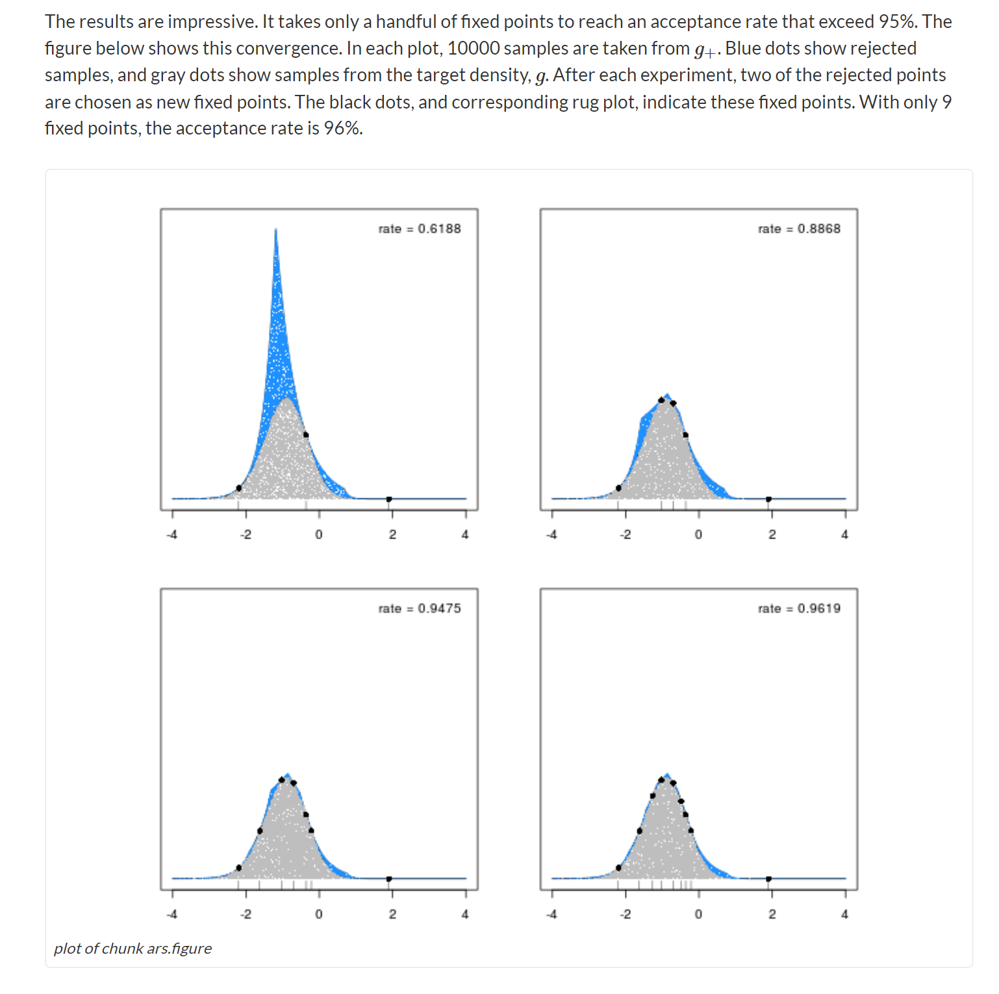


# Gibbs Sampling


# Slice Sampling