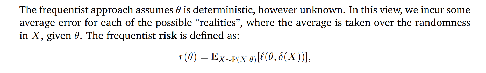
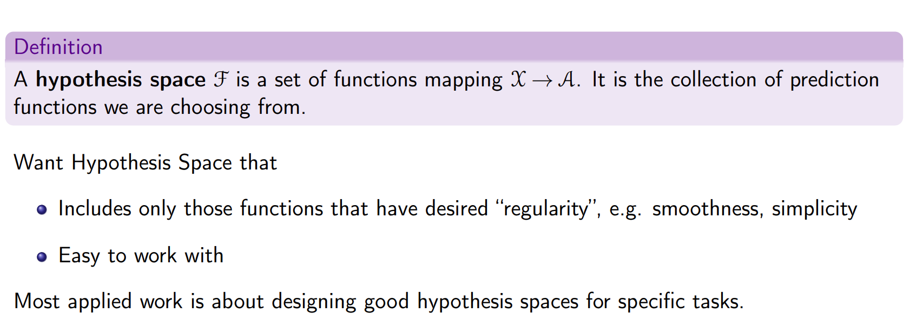

# Decision Theory Framework
## General Setup
> [!important]
> 

# Risk Minimization
## Frequentist Risk
> [!def]
> 

## Bayesian Posterior Risk
> [!def]
> 

## Bayes Risk
> [!def]
> 

## Risk Minimization Scheme
> [!def]
> 

> [!example] Square Loss
> 

> [!example] 0-1 Loss
> 

> [!example] Exponential Loss

> [!example] Logistic Loss
> 

> [!example] Hinge Loss

# Empirical Risk Minimization(ERM)
## General Setup
> [!def]
> We cannot compute $R(f)=\mathbb{E}[l(f(X),Y)]$ since we don't know $P_{\mathcal{X}\times\mathcal{Y}}$
> 

## Constrained ERM
### Overfitting Problem Using ERM
> [!example]
> 
> But under this prediction function, $\hat{f}$ has empirical risk = 0, since we correctly predict each data point. But the risk is 1 since for data point other than 0.25, 0.5, 0.75(unobserved one), the risk is 1, so the expectation should be 1.
> 
> 

### Hypothesis Spaces
> [!def]
> 

### CERM Algorithm
> [!def]
> 

## Excess Risk Decomposition
### Error Decomposition
> [!def]
> 

### Excess Risk Decomposition For ERM
> [!def]
> 
> 
> **Approximation Error:** How good is the hypothesis class relative to all function? Should be a non-random value(the difference between two expectation).
> 
> **Estimation Error:** Within hypothesis class, how good is the learned predictor? Should be a random variable, since $\hat{f}$ depends on the data and they are random.
> 
> 

## Optimization Error
> [!def]
> 

## Error Decomposition in Practice
> [!def]
> 

# Bias and Variance Decomposition

