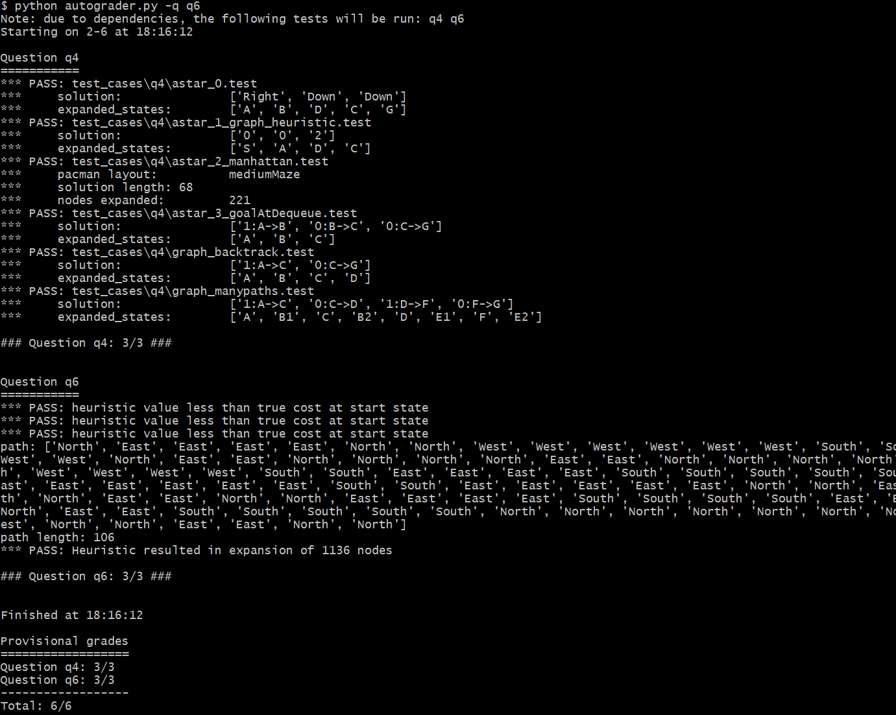
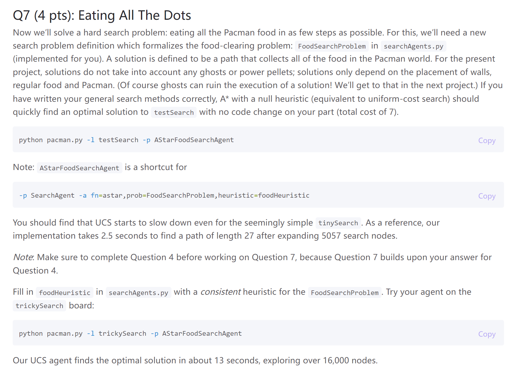

# New Syntax
 > [!important] cPython
 > 


# Part 1 Search Algorithm Implementations
## SearchNode Implementation
> [!code]
> 
```python
class SearchNode:  
  
    def __init__(self, state, action = None, parent = None, cost = None, heuristic = None, problem = None):  
        self.parent = parent  
        self.a = action  # From what action  
        self.s = state  
        self.g = cost  
        self.h = heuristic  
        self.p = problem  
        if self.h is not None:  
            if self.p is None:  
                raise AttributeError("A star is active, need problem parameter to be non-null!")  
  
    def construct_path(self):  
        res = [self]  
        curr = self  
        while curr is not None:  
            res.append(curr.get_state())  
            curr = curr.parent  
        return list(reversed(res))  
  
    def construct_action(self):  
        res = []  
        curr = self  
        while curr.parent is not None:  
            res.append(curr.a)  
            curr = curr.parent  
  
        return list(reversed(res))  
  
    def get_state(self):  
        return self.s  
  
    def get_cost(self):  
        return self.g  
  
    def get_heuristic(self):  
        return 0 if self.h is None else self.h(self.s, self.p)  
  
    def get_priority(self):  
        return self.get_heuristic() + self.get_cost()
```


## Q1 Depth First Search

> [!task]
> 

> [!code]
```python
def depthFirstSearch(problem: SearchProblem):  
    fringe = util.Stack()  
    visited = set()  
  
    s = problem.getStartState()  
    fringe.push(SearchNode(state = s, action =None, parent =None, cost = 0))  
    while not fringe.isEmpty():  
        curr_node = fringe.pop()  
        curr_state = curr_node.get_state()  
        if problem.isGoalState(curr_state):  
            return curr_node.construct_action()  
  
        # Prevent multiple path, multi-expanded problem(2nd version)  
        if curr_state not in visited:  
            visited.add(curr_state)  
            # getSuccessors() return (child_state, action, cost_of_action)  
            for child_state_tuple in problem.getSuccessors(curr_state):  
                child_state, action, cost = child_state_tuple  
                fringe.push(SearchNode(child_state, action, curr_node, curr_node.get_cost() + cost))
```

> [!test]
> 


## Q2 Breadth First Search

> [!task]
> 

> [!code]
```python
def breadthFirstSearch(problem: SearchProblem):  
    """Search the shallowest nodes in the search tree first."""  
    "*** YOUR CODE HERE ***"  
    fringe = util.Queue()  
    visited = set()  
  
    s = problem.getStartState()  
    fringe.push(SearchNode(state=s, action=None, parent=None, cost=0))  
    while not fringe.isEmpty():  
        curr_node = fringe.pop()  
        curr_state = curr_node.get_state()  
        if problem.isGoalState(curr_state):  
            return curr_node.construct_action()  
        # This if statement is important to prevent duplicate visits to the same state  
        # with different path history        if curr_state not in visited:  
            visited.add(curr_state)  
            # getSuccessors() return (child_state, action, cost_of_action)  
            for child_state_tuple in problem.getSuccessors(curr_state):  
                child_state, action, cost = child_state_tuple  
                fringe.push(SearchNode(child_state, action, curr_node, curr_node.get_cost() + cost))
```

> [!test]
> 


## Q3 Uniform Cost Search

> [!task]
> 

> [!code]
```python
def uniformCostSearch(problem: SearchProblem):  
    """Search the node of least total cost first."""  
    "*** YOUR CODE HERE ***"  
    fringe = util.PriorityQueue()  
    visited = set()  
  
    s = problem.getStartState()  
    s_node = SearchNode(state=s  
                        ,action=None  
                        ,parent=None  
                        ,cost=0)  
    fringe.push(s_node, s_node.get_priority())  
    while not fringe.isEmpty():  
        curr_node = fringe.pop()  
        curr_state = curr_node.get_state()  
        if problem.isGoalState(curr_state):  
            return curr_node.construct_action()  
        # This if statement is important to prevent duplicate visits to the same state  
        # with different path history        if curr_state not in visited:  
            visited.add(curr_state)  
            # getSuccessors() return (child_state, action, cost_of_action)  
            for child_state_tuple in problem.getSuccessors(curr_state):  
                child_state, action, cost = child_state_tuple  
                child_node = SearchNode(state = child_state  
                                        ,action = action  
                                        ,parent = curr_node  
                                        ,cost = curr_node.get_cost() + cost)  
                fringe.push(child_node, child_node.get_priority())
```

> [!test]
> 


## Q4 A\* Search

> [!task]
> 

> [!code]
```python
def aStarSearch(problem: SearchProblem, heuristic=nullHeuristic):  
    """Search the node that has the lowest combined cost and heuristic first."""  
    "*** YOUR CODE HERE ***"  
    fringe = util.PriorityQueue()  
    visited = set()  
  
    s = problem.getStartState()  
    s_node = SearchNode(state=s, action=None, parent=None, cost=0, heuristic=heuristic, problem=problem)  
    fringe.push(s_node, s_node.get_priority())  
    while not fringe.isEmpty():  
        curr_node = fringe.pop()  
        curr_state = curr_node.get_state()  
        if problem.isGoalState(curr_state):  
            return curr_node.construct_action()  
        # This if statement is important to prevent duplicate visits to the same state  
        # with different path history        if curr_state not in visited:  
            visited.add(curr_state)  
            # getSuccessors() return (child_state, action, cost_of_action)  
            for successor in problem.getSuccessors(curr_state):  
                child_state, action, cost = successor  
                child_node = SearchNode(state=child_state  
                                        ,action=action  
                                        ,parent=curr_node  
                                        ,cost=curr_node.get_cost() + cost  
                                        ,heuristic=heuristic  
                                        ,problem=problem)  
                fringe.push(child_node, child_node.get_priority())
```

> [!test]
> 


# Part 2 Search Problem Design
## Q5 Finding All the Corners
> [!task]
> 

> [!code]
```python
def getSuccessors(self, state: Any):  
    """  
    Returns successor states, the actions they require, and a cost of 1.  
     As noted in search.py:        For a given state, this should return a list of triples, (successor,        action, stepCost), where 'successor' is a successor to the current        state, 'action' is the action required to get there, and 'stepCost'        is the incremental cost of expanding to that successor    """  
    successors = []  
    for action in [Directions.NORTH, Directions.SOUTH, Directions.EAST, Directions.WEST]:  
        # Add a successor state to the successor list if the action is legal  
        # Here's a code snippet for figuring out whether a new position hits a wall:        #   x,y = currentPosition        #   dx, dy = Actions.directionToVector(action)        #   nextx, nexty = int(x + dx), int(y + dy)        #   hitsWall = self.walls[nextx][nexty]  
        "*** YOUR CODE HERE ***"  
        x, y = state[0]  
        dx, dy = Actions.directionToVector(action)  
        nextx, nexty = int(x + dx), int(y + dy)  
        hitsWall = self.walls[nextx][nexty]  
        if not hitsWall:  
            nextPosition = (nextx, nexty)  
            cost = 1  
            nextBoolean = list(state[1])  
            for i, corner in enumerate(self.corners):  
                if corner == nextPosition:  
                    nextBoolean[i] = 1  
            nextState = (nextPosition, tuple(nextBoolean))  
            successor = (nextState, action, cost)  
            successors.append(successor)  
  
    self._expanded += 1 # DO NOT CHANGE  
    return successors
```

> [!test]
> 

## Q6 Corners Problem: Heuristic Design
> [!task]
> 

> [!code]
> We present two admissible and consistent heuristic(The heuristic that finds the same solution as the UCS).
> 1. Number of unvisited corners.
> 2. Maximum manhattan distance from the current position to any unvisted corners.
```python
def cornersHeuristic(state: Any, problem: CornersProblem):  
    corners = problem.corners # These are the corner coordinates  
    walls = problem.walls # These are the walls of the maze, as a Grid (game.py)  
  
    # First Heuristic  
    def manhanttan_distance(point1, point2):  
        return abs(point1[0] - point2[0]) + abs(point1[1] - point2[1])  
  
    currentPosition = state[0]  
    currentBoolean = list(state[1])  
  
    unvisited_corners = [corners[i] for i, item in enumerate(currentBoolean) if item == 0]  
  
    # return len(unvisited_corners)  
    if len(unvisited_corners) == 0:  
        return 0  
    return max([manhanttan_distance(currentPosition, corner) for corner in unvisited_corners])
```


> [!test]
> 


# Part 3 Pacman Eats All Dots
## Q7 Eating All The Dots

> [!task]
> 

> [!code]
> We try several admissible and consistent heuristic:
> 1. Number of uneaten dots. **12517** nodes explored
> 2. Maximum distance(manhattan and euclidean) from current position to any uneaten dots. **9551** for manhattan, **10352** for euclidean
> 3. Average distance(manhattan and euclidean) from current position to any uneaten dots. **11254** for manhattan, 11896 for euclidean
> 4. Maximum maze distance(actual distance) from current position to any uneaten dots. **4137** nodes explored
```python
def foodHeuristic(state: Tuple[Tuple, List[List]], problem: FoodSearchProblem):  
    position, foodGrid = state  
    "*** YOUR CODE HERE ***"  
    # Number of uneaten food, 12517  
    def num_uneaten_food(foodGrid):  
        return len(foodGrid.asList())  
  
    def manhanttan_distance(point1, point2):  
        return abs(point1[0] - point2[0]) + abs(point1[1] - point2[1])  
  
    def euclidean_distance(point1, point2):  
        return pow(pow(point1[0] - point2[0], 2) + pow(point1[1] - point2[1], 2), 0.5)  
  
    # Max Distance of Uneaten Food(L1 Distance)  
    # 9551 for manhattan distance    # 10352 for euclidean distance    def max_dist_uneaten_food(position, foodGrid, mode="man"):  
        foodList = foodGrid.asList()  
        if len(foodList) == 0:  
            return 0  
        if mode == "man":  
            return max([manhanttan_distance(position, food) for food in foodGrid.asList()])  
        else:  
            return max([euclidean_distance(position, food) for food in foodGrid.asList()])  
  
    # Max Distance of Uneaten Food(L1 Distance)  
    # 11254 for manhattan distance    # 11896 for euclidean distance    def avg_dist_uneaten_food(position, foodGrid, mode="man"):  
        foodList = foodGrid.asList()  
        length = len(foodList)  
        if length == 0:  
            return 0  
  
        if mode == "man":  
            return sum([manhanttan_distance(position, food) for food in foodGrid.asList()]) / length  
        else:  
            return sum([euclidean_distance(position, food) for food in foodGrid.asList()]) / length  
  
    # Actual Max Distance, 4137!  
    def mazeDistance_wrapper(position, foodGrid, problem):  
        gameState = problem.startingGameState  
        uneaten_food = foodGrid.asList()  
        if len(uneaten_food) == 0:  
            return 0  
        return max([mazeDistance(position, food, gameState) for food in uneaten_food])  
  
    # return num_uneaten_food(foodGrid)  
    # return max_dist_uneaten_food(position, foodGrid, mode = "man")    # return avg_dist_uneaten_food(position, foodGrid, mode = "man")    return mazeDistance_wrapper(position, foodGrid, problem)
```


> [!test]
> 

## Q8 Suboptimal Greedy Search

> [!task]
> 

> [!code]
```python
def isGoalState(self, state: Tuple[int, int]):  
	x,y = state  
  
    "*** YOUR CODE HERE ***"  
    return self.food[x][y]
```

> [!test]
> 


> 


