# 1D Resistive Touchscreen
## Graphical Interpretation
> 抗阻屏幕本质上是由上下两个板组成的：
> 1. 上板直接和用户进行交互，可看做一块长为$L$的电阻。
> 2. 下板用于让底层操作系统监控电压的变化以到达精准判断用户触摸点。
> 
 下图中展示了其基本结构:
> 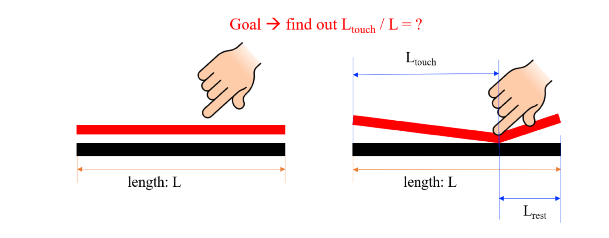

***

## Circuit Model

> **抗阻屏幕的本质可**以用`Voltage Divider`来进行建模，用户触摸的点将**上板**电阻分成左右两段，长度分别为$L_{touch}$和$L_{rest}$。
> - 根据电阻的计算公式可知$R_{touch}=\rho \frac{L_{touch}}{A}$, $R_{rest} = \rho \frac{L_{rest}}{A}$, 本质上通过计算$\frac{R_{touch}}{R_{rest}}$的比例就可以知道$L_{touch}$和$L_{rest}$的相对大小关系($\frac{L_{touch}}{L_{rest}}$)，也就可以知道触点在哪里。
> - 下面的电路图就是我们建立的模型，`umid` 就是我们要测量的`Nodal Voltage`, 一旦知道了`umid` , 就相当于知道了$\frac{R_{touch}}{R_{rest}}$(图中的$\frac{R_{2}}{R_{1}}$), 进而就可以利用$\frac{R_{touch}}{R_{\mathrm{Rest}}}=\frac{L_{touch}}{L_{\mathrm{Rest}}}$ 得到触点的具体位置。
> 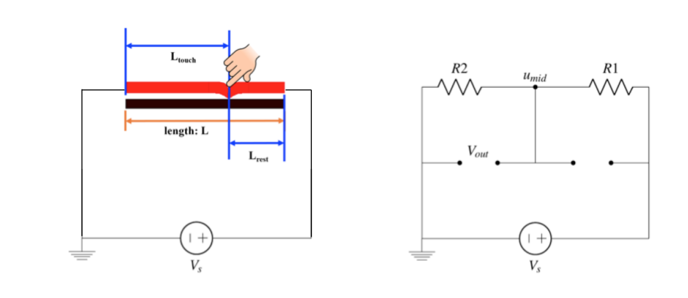

> [!abstract] 🔔Summary
> 我们的上板(屏幕)被等效成了一个`Voltage Divider` 。
> 我们的下板被等效成了一根导线。

---

## Measure U-mid

>下面就是最重要的测量`umid` 的环节，我们有如下的步骤:
>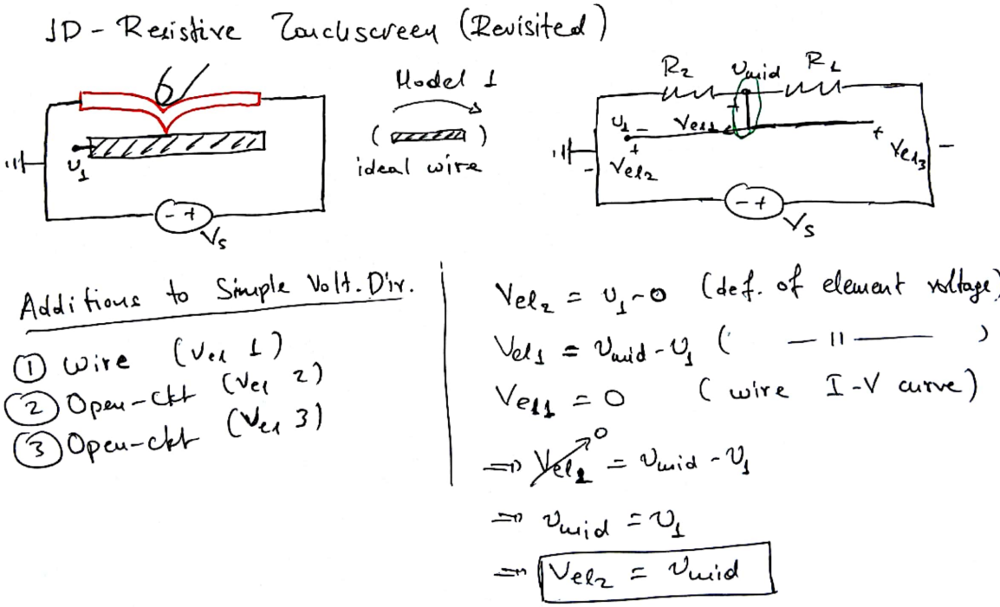
>对其进行电路分析可知，我们可以通过测量 $V_{el_{2}}$ 的电压(将`Voltmeter`的两点分别接地和接在$u_{1}$ 处)来间接测量`umid` 。

> [!faq] 为什么我们要将下板等效成一根导线❔
>   因为导线两段的电势差是零，所以$V_{el_{2}}=umid$。方便测量。

> [!faq] 非理想状况下，下板不能等效成一根导线，此时我们还能够通过测量$V_{el_{2}}$ 的电压来获得`umid` 的数值吗❔
> 我们看下面的例子:
> 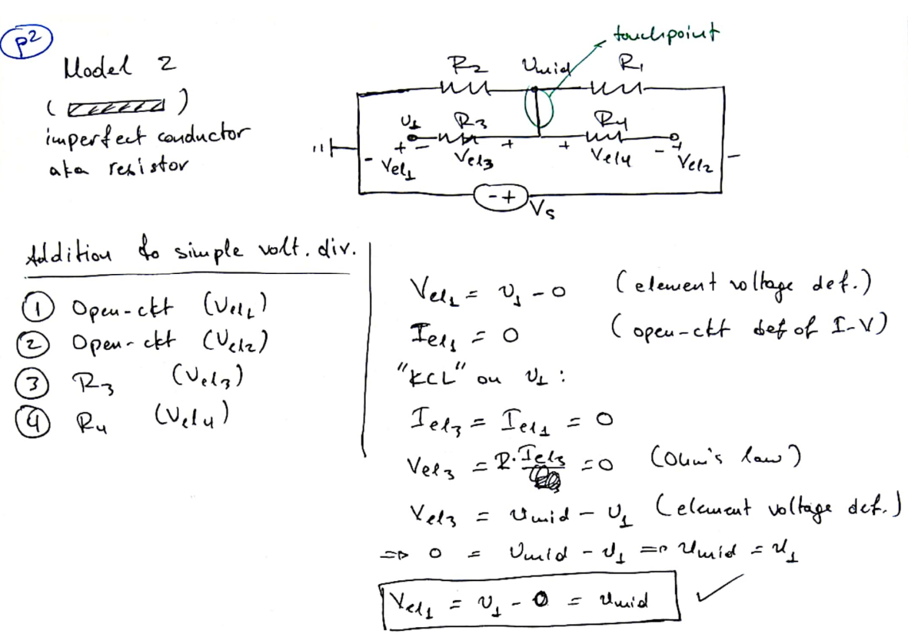
> 💡: 我们发现，即使下板不能等效为理想导线, 也不影响我们的电压测量。

🔔: 本质上如果一个`Circuit Branch`只有一端接入电路，则流过这个电子元件的电流为零。

---

# Power

## Definition

>`Power` 被定义为能量的变化速率(rate of change of energy), 即$P=\frac{dE}{dt}$。
>结合[Voltage](2_Modeling_and_Circuit_Elements.md#Voltage)的定义$dE=VdQ$，我们在两边同除以$dt$, 可以得到$\frac{dE}{dt}=V\frac{dQ}{dt}=P$ 。
>结合[Current](2_Modeling_and_Circuit_Elements.md#Current)的定义$dQ=Idt$, 我们得到$P=VI$。
> 结合[Ohm's Law](1_Circuit_Analysis_Node_Voltage.md#Ohm's%20Law%20and%20Resistors) 可知下列三组常用关系:
> 

> [!info] 
> 当$P=VI>0$, 我们称`Power is dissipated` 
>  当$P=VI<0$ ,我们称`Power is generated` 

## SI Units
>`Power` 的`SI Unit` 是瓦特，用$W$ 表示，结合$P=VI$我们有 $[W] = [V]\cdot[A]=\frac{[J]}{[S]}$, 其中$J$ 是能量单位焦耳，$S$ 是秒的单位。

---

# Circuit Measurements

## Principle
> 🔔 下面是电路测量的基本原则: 
> 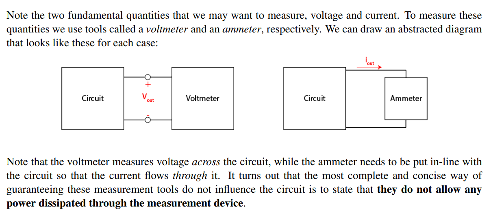
> 本质就是任何用于测量电路的仪器都不能消耗电路中的能量。

## Voltage Measurement
> 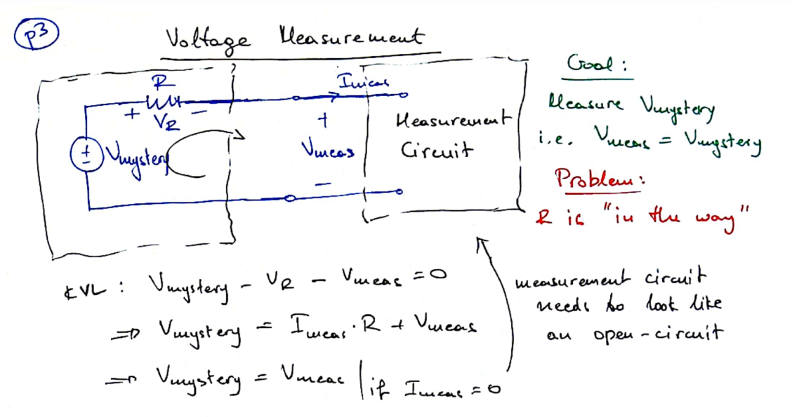
> 上述电路中，$R$ 代表导线的电阻，我们要测量的是$V_{mystery}$，我们希望电压表的读数$V_{measure}$和其一致。
> 💡: 电压测量表称为`Voltmeter`, 可以等效为`Open Circuit`，没有电流通过或者有很微小的电流通过，换句话说，电压表的电阻**无限大**。

## Current Measurement
>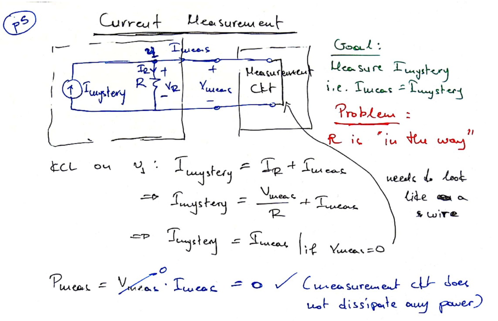
>上述电路（由一个`Current Source`和`R` 组成）中，我们要测量的是$I_{mystery}$，我们希望电流表的读数$I_{measure}$和其一致。
> 💡: 电压测量表称为`ammeter`, 可以等效为Wire，两端电压为零或者电压很小，换句话说，电流表的电阻**无限小**。

---

# Power Disspation/Generation

## Resistor
>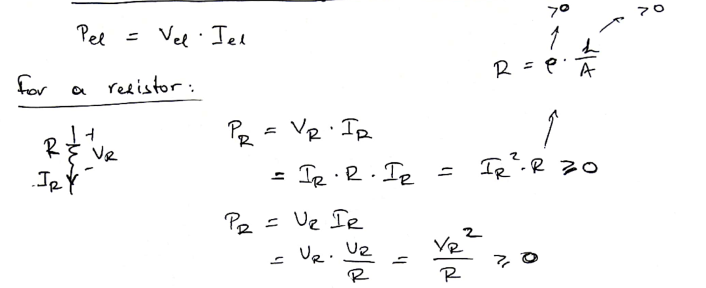
>💡: `Resistors`的Power永远是正的，于是它`always disspate energy`.

## Open Circuit&Wire
>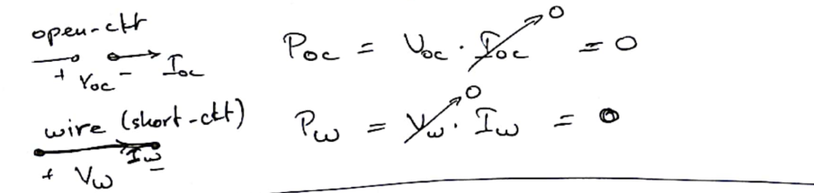
>	💡: Open Circuit 由于流经的电流为零，于是不损耗任何能量，Wire 由于其两端的电压为零，也不损耗任何能量。

---

# Examples

## Example #1
>下面的电路由一个电压源和一个电阻构成: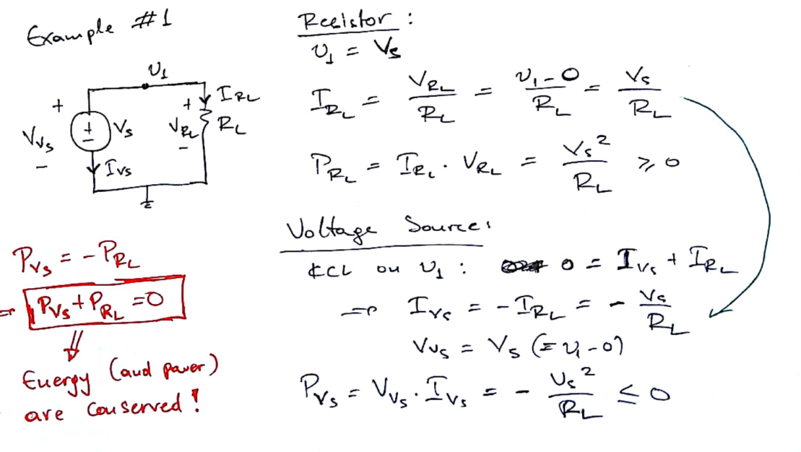
>💡电路中有两个电子元件的时候，他们的能量$P$ 互为相反数。即一个消耗能量，一个产生能量，但是电路总体不消耗能量。

## Example #2
>下面的电路由一个电压源和一个电阻构成: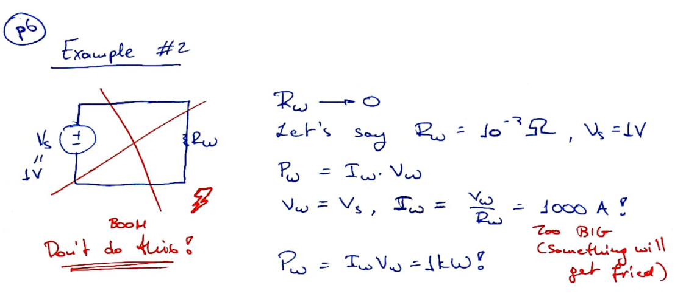
>💡: 如果$R_{w}\to 0$, 则形成短路。 

## Example #3
>下面的电路由一个电压源和一个电流源构成: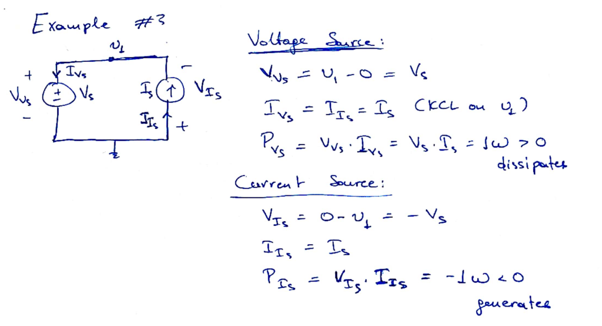
>💡: 和例一中一样，电压源和电流源的总能量为零，电压源消耗能量，电流源产生能量。 

# Resources
[Note13](Typed_notes_pdf/Note13.pdf)
[Written_Notes13](Typed_notes_pdf/Written_Notes13.pdf)
[[https://www.bilibili.com/video/BV1uK4y1M7cJ?p=14&vd_source=66aa12d38833505f6c2216f089511404]]

