# EECS16A Physics Recap

> [!info] Recap
> [Basic Circuit Elements](1_Circuit_Analysis_Node_Voltage.md#Basic%20Circuit%20Elements)
> 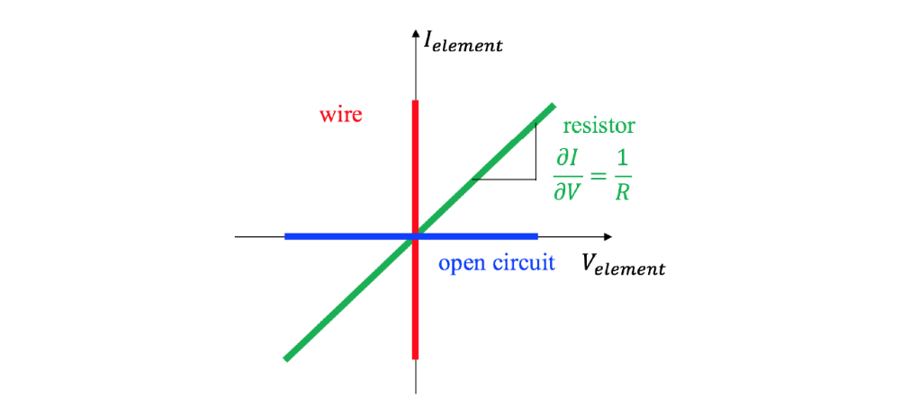
> 可以看到，即便不同的电子元件在$(0,0)$点以外的行为不尽相同，但是在$V=0, I=0$时各个电子元件的行为是一致的。

# Interesting Circuit
## Examples

> [!example]  下面我们来看一个有意思的电路:
> 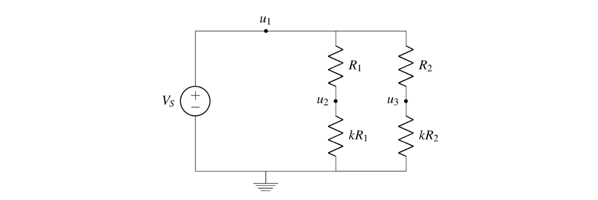
> 我们想要求解$u_{1},u_{2},u_{3}$, 我们当然可以使用[Circuit Analysis Algorithm](2_Modeling_and_Circuit_Elements.md#Circuit%20Analysis%20Algorithm)中的步骤对`Node`和`Branches`逐一进行分析，但是我们也可以另辟蹊径，将这个电路看成两个[Voltage Dividers](2_Modeling_and_Circuit_Elements.md#Voltage%20Divider)的并联组合，所以我们可以很快求出下列结果:
> 
> 
> 注意到$u_{2}=u_{3}=\frac{k}{1+k}V_{s}$，这意味着$u_{2}$和$u_{3}$两点的电势相同。

> [!Example] 如果我们在电势相同的两点之间加一个电阻，上面的电流会怎样呢?
> 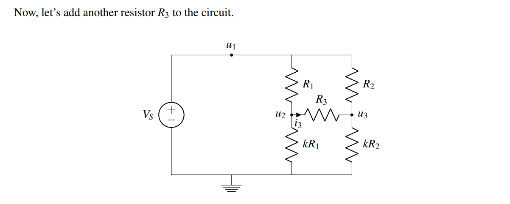
> 我们进行一些电路分析可得: $i_3R_3=u_2-u_3=0$, 因为$R_3>0$, 所以$i_3=0$, 所以其实没有电流通过。因此我们可以将电路等效为一个`Open Circuit`如下:
> 
> 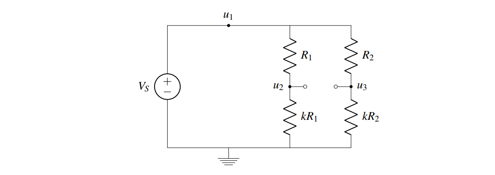

## Summary
> 总的来说，当电路中有两个`Nodes`之间的电势差为零的时候，我们可以将其等效为`Open Circuit`。

# 2D Touchscreen
## Graphical Structure
> [!info]  Definition
> 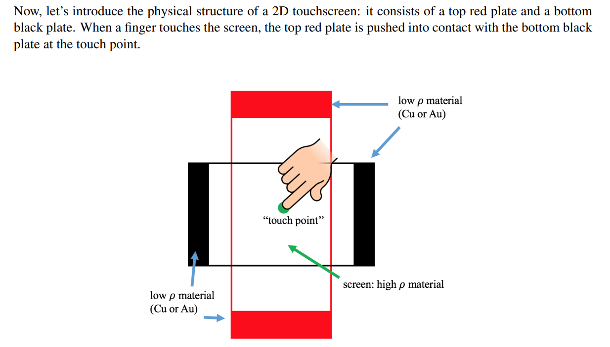
> 图中我们可以看到：
> 1. `Red Plate` 的上端和下端都是低电阻材质(可以等效为导线)，但是中间(也就是用户与之互动的部分)是高电阻材质，于是我们可以将其等效为很多竖直的电阻。
> 2. `Black Plate` 的左右两端都是低电阻材质(可以等效为导线)，但是中间(也就是用户与之互动的部分)是高电阻材质，于是我们可以将其等效为很多水平的电阻。

## Circuit Analysis
### Red Plate
> 我们需要在`Plate`的两段通上电，也就是加上一个电压源，如下图所示:
> 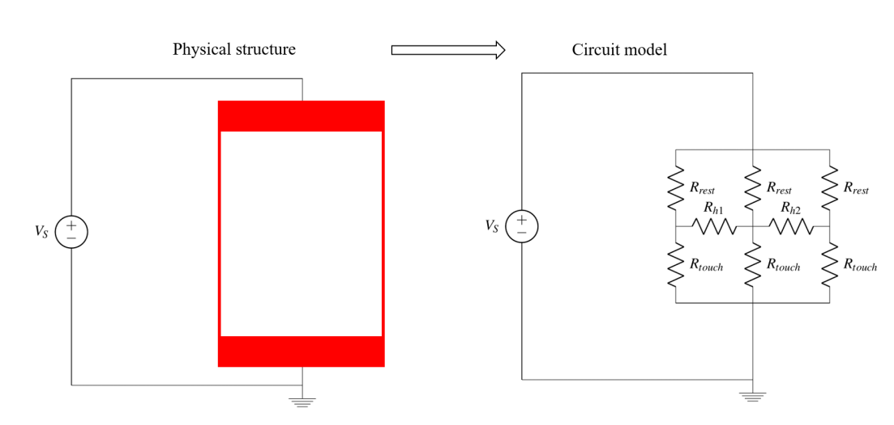
> 本质上，我们的等效电路和`Interesting Circuit`中的类似，下图中，红板的上下两段等效为导线，中间等效为竖直电阻。
> 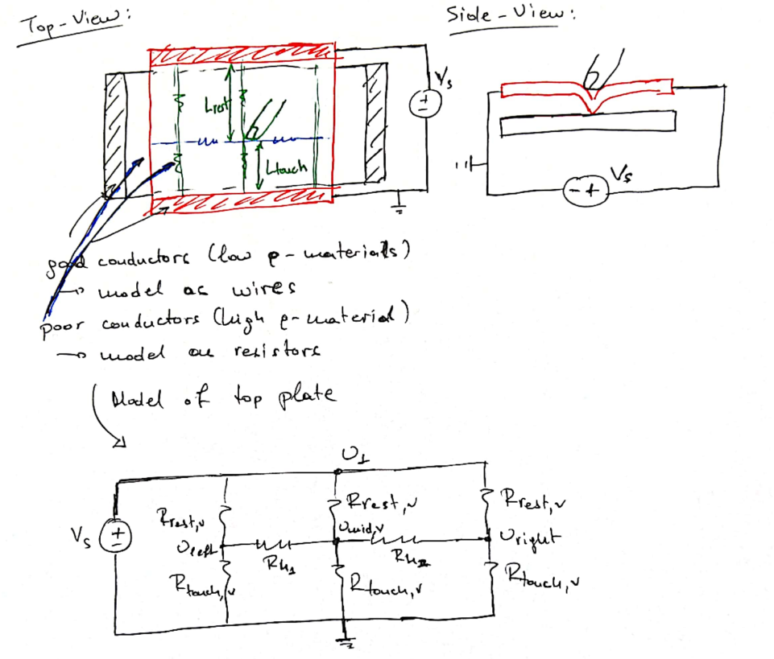
> 我们对其进行电路分析，根据之前`Interesting Circuit`中的结论，我们可以将水平的电阻等效为`Open Circuits`, 毕竟没有电流从上面通过。
> 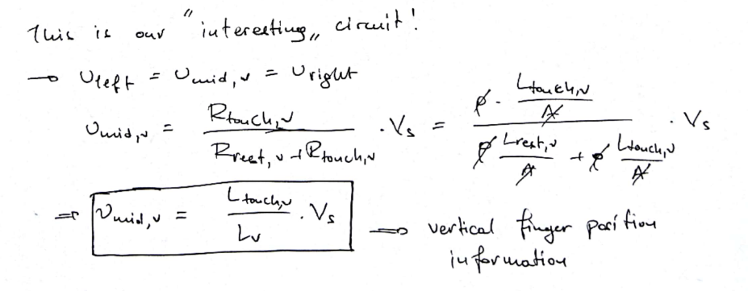
> 所以我们有如下的等效电路：
> 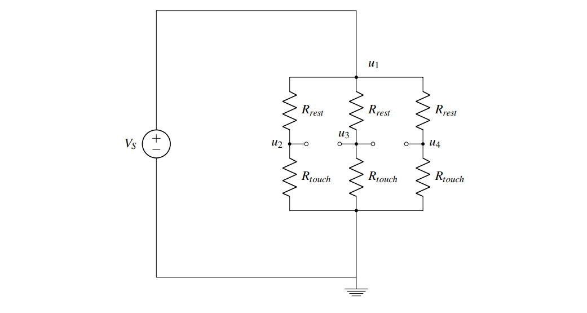

> 💡: **Do we need a more precise model?**
> 
> **为什么不用?**
> 	1. 这个模型太复杂。
> 	2. 没有很直观的理解。
> 	3. 和之前的模型结果一致。

### Black Plate
> 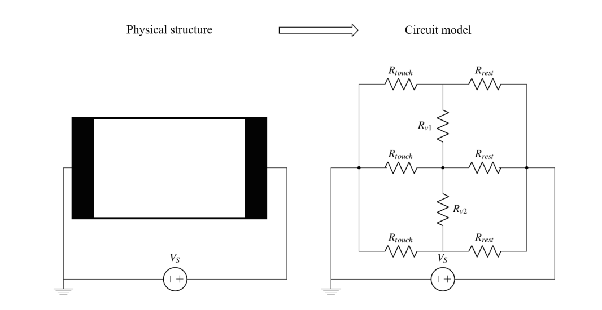
> 本质上，我们的等效电路和`Interesting Circuit`中的类似。
> 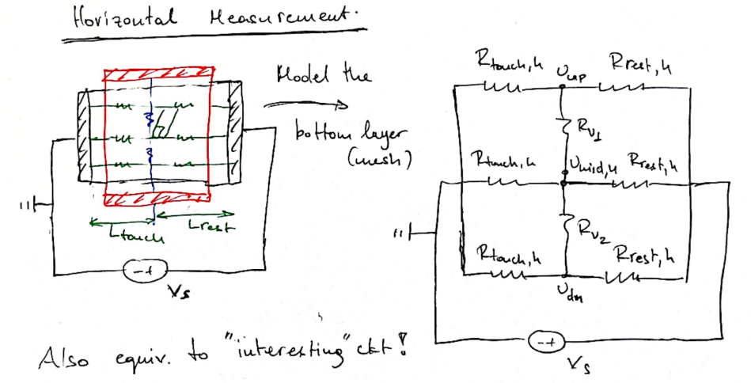
>  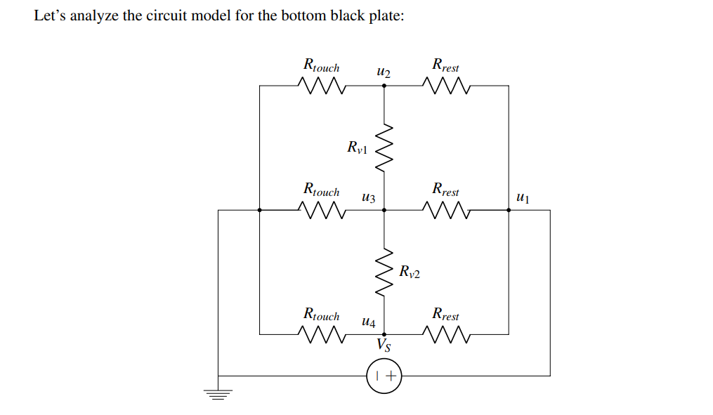

### Interactive Example
#### Initial
> https://www.falstad.com/circuit/circuitjs.html 这个网站可以对常见电路进行一些模拟。
> 下面的电路展示了一种对于`2D Touchscreen`的建模等效电路：
> 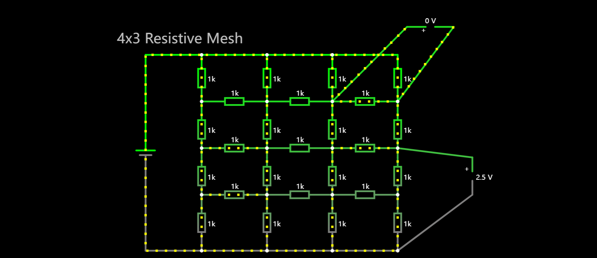
> 

#### Unbalanced
> 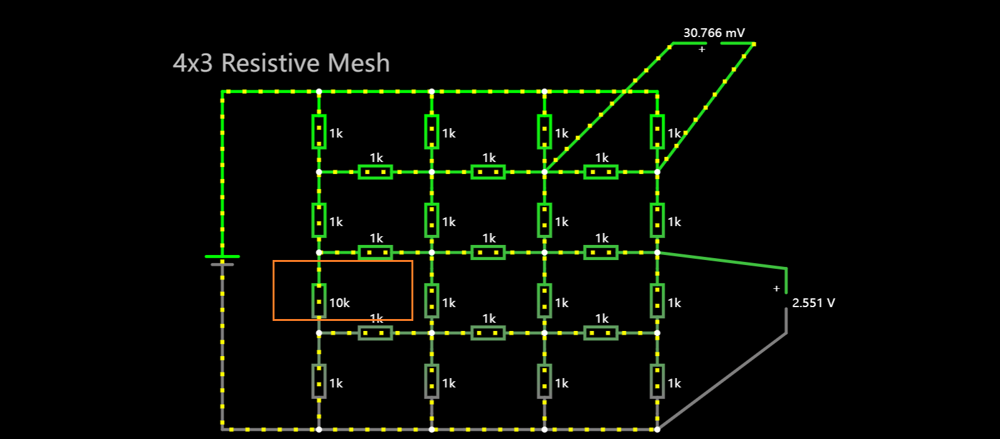

#### Balanced with bigger Resistors
> 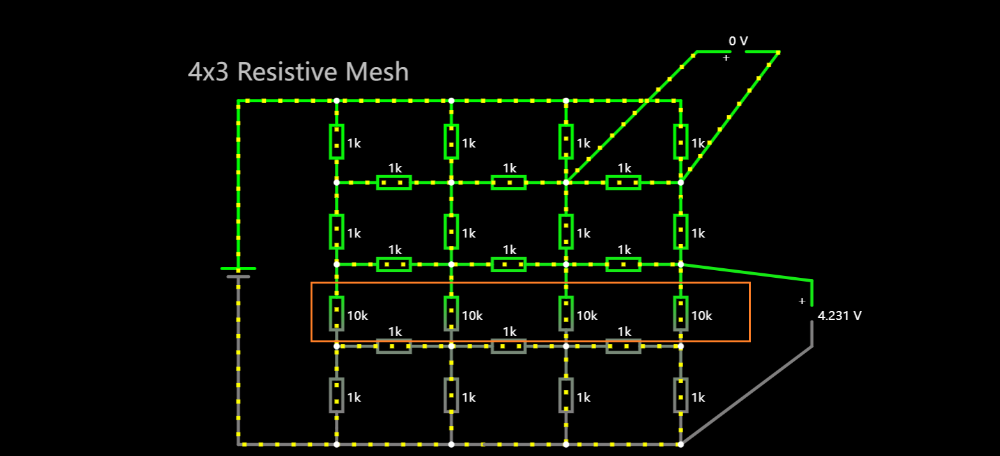

## Complete Model⭐⭐⭐⭐⭐
> 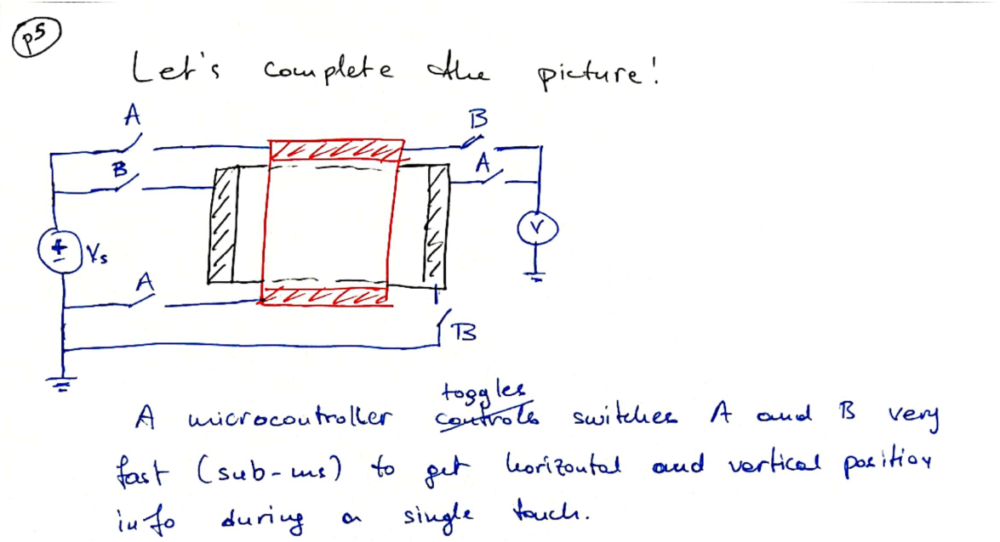
> 💡: We are always touching the top because the top is a physical thing. We need to take two measurements. 
> 1. First, we want to get the vertical position measurements. In the circuit above, we power up the top(red) and measure the bottom(black). The switches A are all closed.
> 2. Second, we want to get the horizontal position measurements. In the circuit above, we power up the bottom(black) and measure the top(red). The switches B are all closed.
> 3. The switch between A and B are very fast so that it appears to the client that we can have the vertical and horizontal measurements at the same time.
> 🔔: When we power up the top plate, the bottom plate is connected to the circuit with only one end, so no matter what configuration the bottom plate takes(The resistor layout for example), the current is always zero over the bottom plate, so we can always measure the `u_mid` as we have seen in the 1D example using a voltmeter.
> 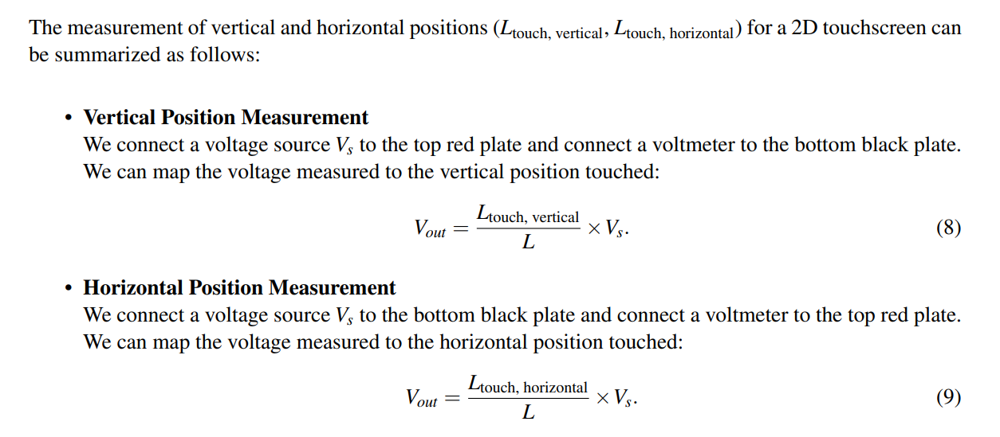
> ❗: Some problems within this simplified model:
> 
> 1. In real life device, the top plate is composed of multi-layered plates which support multi-touch. In our model, only one touch can be measured at a time.
> 2. Mechanical deterioration upon long-term use.

# Faster Circuit Analysis
> 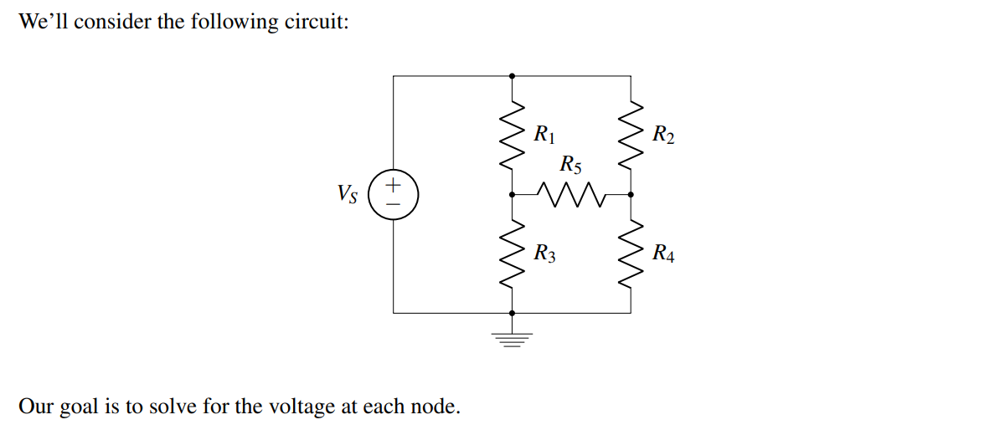

## Step 1: Lable the circuit
> 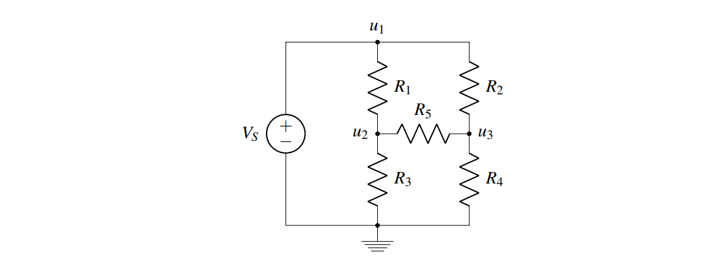

## Step 2: Writing equations with voltage sources
> 

## Step 3: Write KCL for any unknown nodes
> 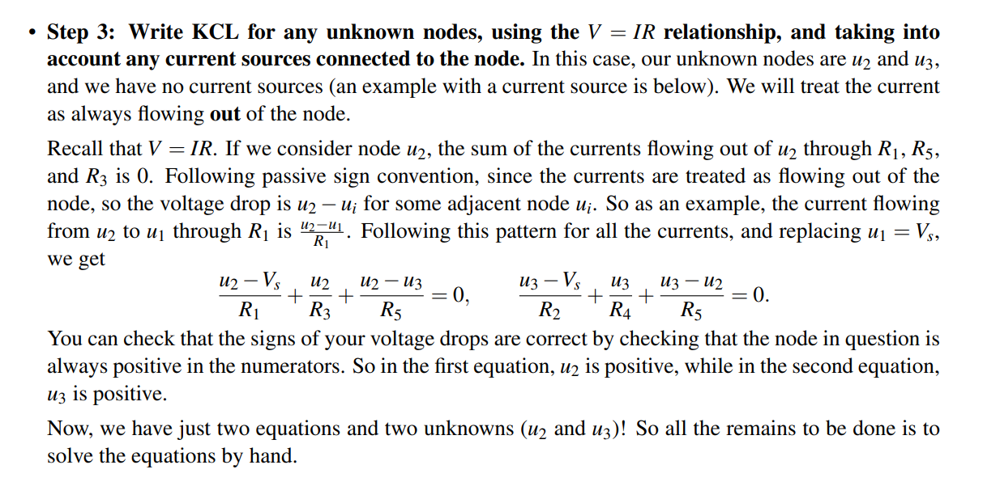
> 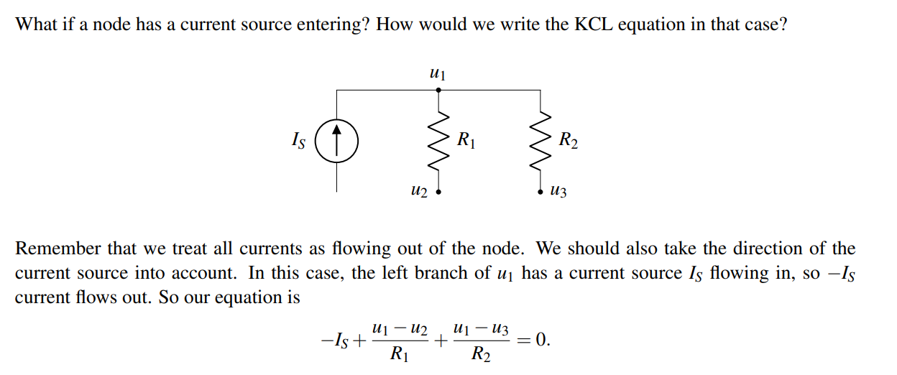

# Resources
> [Note14](Typed_notes_pdf/Note14.pdf)
> [Written_Notes14](Typed_notes_pdf/Written_Notes14.pdf)
> https://www.bilibili.com/video/BV1uK4y1M7cJ?p=15&vd_source=66aa12d38833505f6c2216f089511404

