> 本章节，主要介绍两种简化电路分析的方法：`Superposition` 和 `Equivalence` 。

# Superposition
> 本节中，我们会看到有多个`Circuit Sources`的电路出现。且会介绍一个很重要的概念`superposition`。
> Also called: Circuit Analysis Jedi Technique #1. 

## Recap: Linear Function
> **Reminder:** For linear function $f$ and two inputs $x$ and $y$, we have $f(x+y)=f(x)+f(y)$
> Image a circuit with multiple sources(voltage source or circuit source).
> **Superposition** says that we can analyze the circuit by looking at the effect of each source independently and summing up all these finally.
> 本质上，`Superposition` 的灵感来源于上述`Linear Function` 的性质，也就是`Linear Combination`的性质。
> 假设我们在一个复杂的电路中需要求某个`Node`上的电流或者电压，我们需要解一个线性方程组，可以写成$A\vec{x}=\vec{b}$, 其中$\vec{x}$是未知的一些电压或者电流，$\vec{b}$ 是已知的一些电路中的电压源和电流源。因为电路是真实存在的，所以一般而言$A$ 是可逆的，所以$\vec{x}=A^{-1}\vec{b}$唯一存在。所以本质上 $\vec{x}_i$ 是$\vec{b}$ 的一个线性组合, 如下:
> 
> `Superposition` 说的就是电路中每一个给定的电压源和电流源都会对最终的`Node`上的电压或者电流有贡献，且这些贡献可以以线性组合的形式表示出来。
> 所以我们可以独立地看待每一个电压源或者电流源对`Node` 的贡献。比如我们想要知道$V_{s1}$对$u_i$的贡献是多少，我们可以把其他的`Sources`全部设置为零。

## Application in Circuit Analysis
> 用在电路中，我们有以下算法步骤:
> 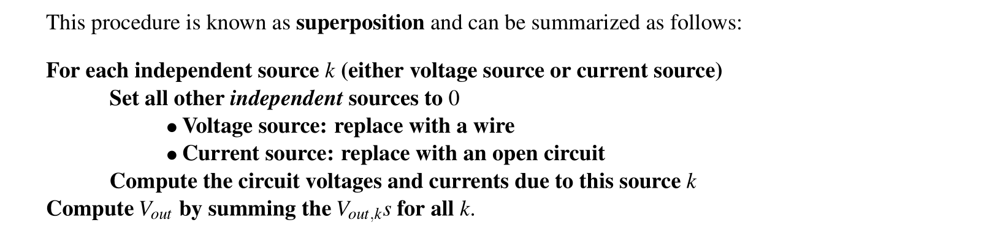
> 💡: 注意在这个算法中，不被关注的 `Voltage Source` 应被等效为导线，因为我们需要其 $V=0$, 这就需要将 `Voltage Source` 对应的 `I-V` 图平移到 $V=0$ 的地方，那么也就是导线的 `I-V` 图, 如下图中将 `I-V Line` 左移： 
>                                     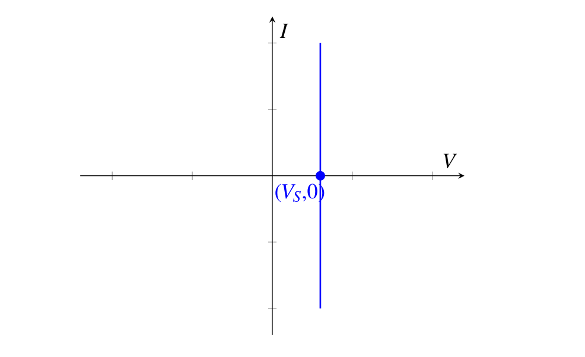 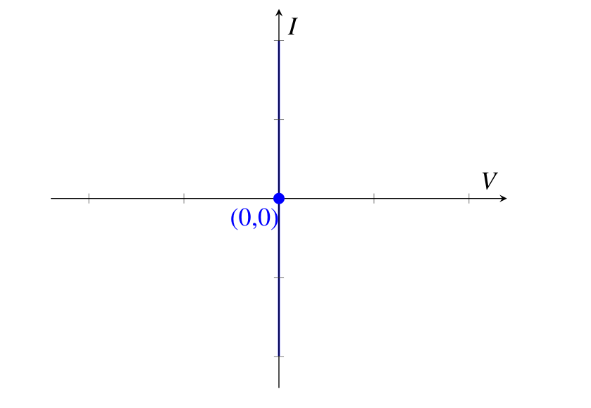
> 💡: 不被关注的 `Current Source` 应被等效为 `Open Circuit` ，因为我们需要其 $I=0$, 这就需要将 Current Source 对应的 `I-V` 图平移到 $I=0$ 的地方，那么也就是 `Open Circuit` 的 ` I-V ` 图。
>                                      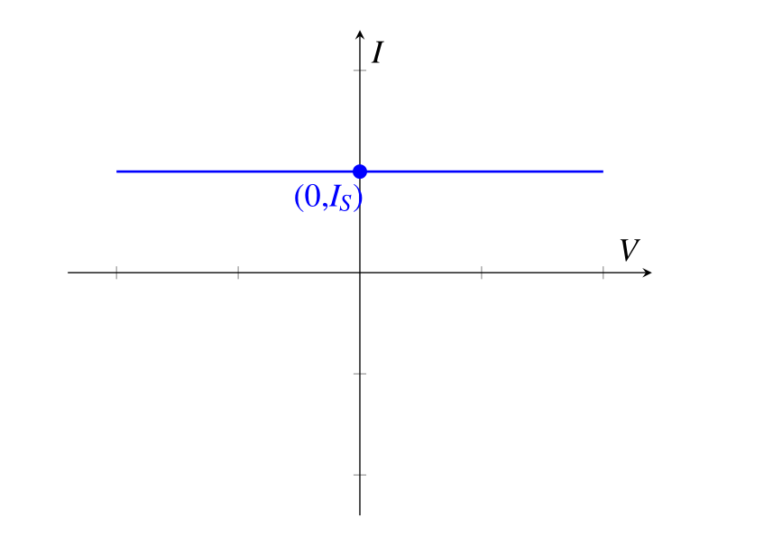 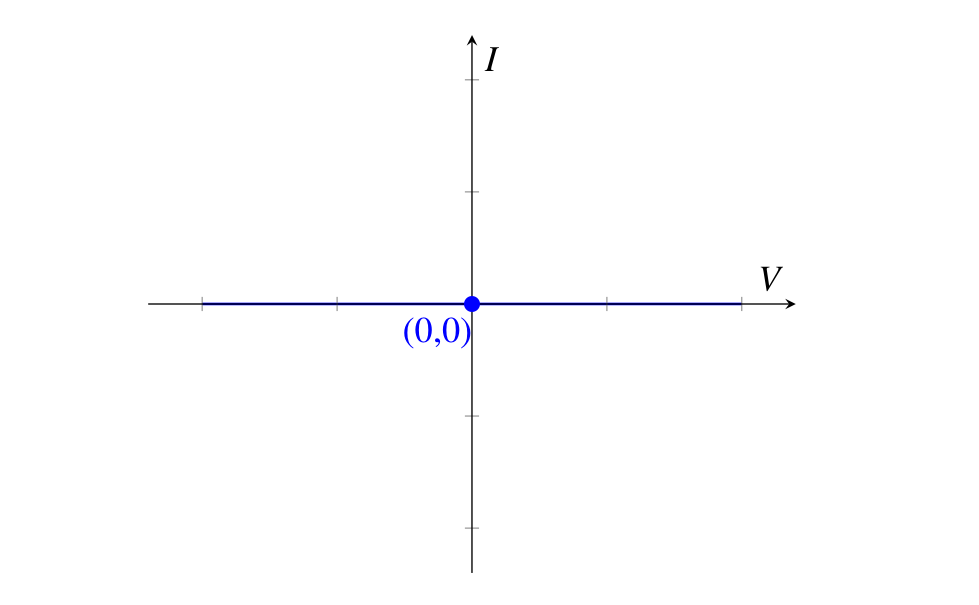
>  [Basic Circuit Elements](1_Circuit_Analysis_Node_Voltage.md#Basic%20Circuit%20Elements)

## Examples
> [Note15A](Typed_notes_pdf/Note15A.pdf)
> [Written_Notes15](Typed_notes_pdf/Written_Notes15.pdf)

# Equivalence
### Circuit Equivalence
> 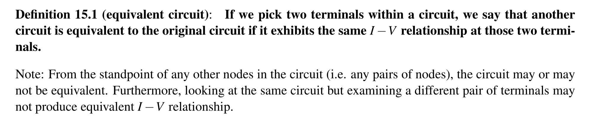

## Thevenin Equivalence 
### Definition
> 本质上就是将一个复杂电路等效为一个 `电压源` 和 `电阻` 串联。
> 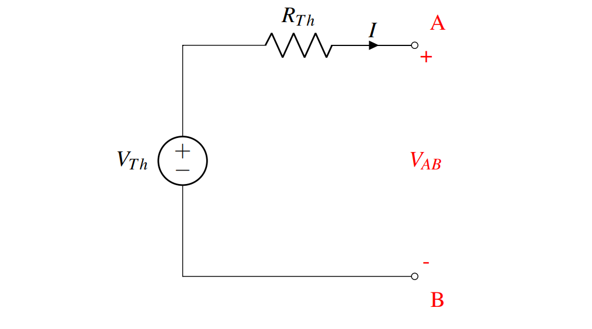
>  🔔: 如果我们在 `A,B` terminals 之间接入一根导线，则 $I_{th}=\frac{V_{th}}{R_{th}}$
>  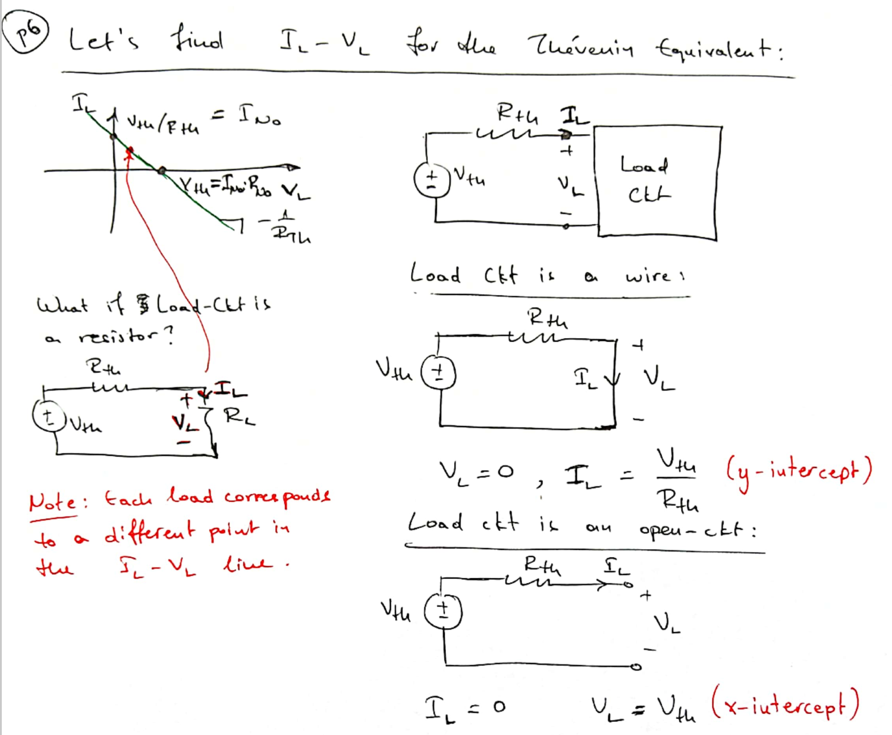

### Algorithm
>   $V_{Th}$ 和 $R_{Th}$ 可以通过以下方法求出:
>  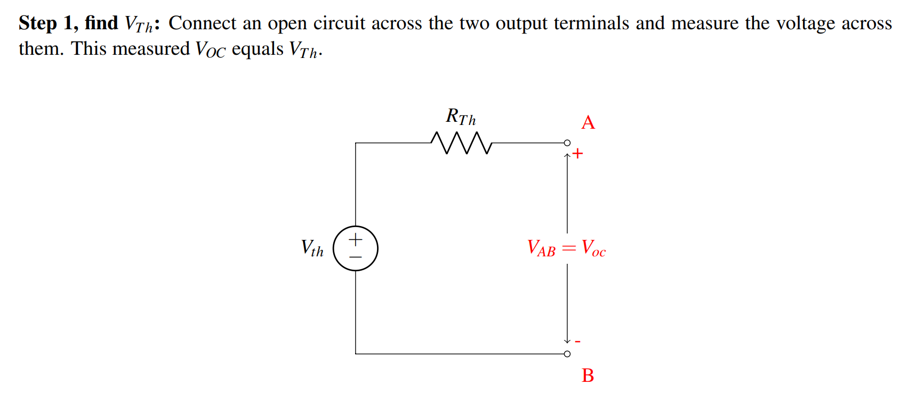 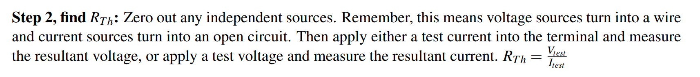

## Norton Equivalence
### Definition
> 本质上就是由一个 `电流源` 和 `电阻` 并联而成。
> 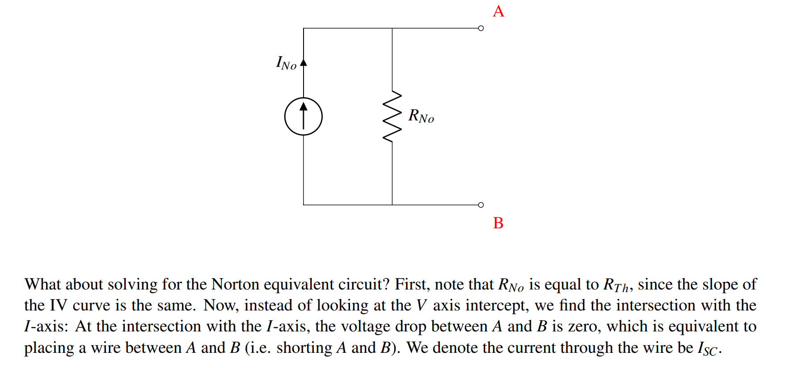

### Algorithm
> 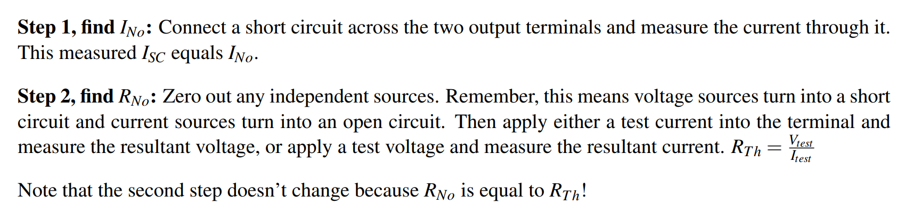

## Summary
> 求解一个 `Equivalence` 电路的本质就是找到电路的 `I-V Line`，更具体的，是要通过找到 `I-V Line` 在 `x,y` 轴上的截距来确定这条 `I-V Line`。
> 一个电路既可以看成 Thevenin Equivalence, 也可以看成 Norton Equivalence。
> - Thevenin Equivalence 可以帮助我们直接确定 $V$ 的大小 (通过外接 `Open Circuit`)，也就是 ` x ` 轴截距，此时因为 $I=0$, 所以我们相当于外接一个 `Open Circuit`。
> - Norton Equivalance 可以帮助我们直接确定 $I$ 的大小 (通过外接 `Wire`), 也就是 `y` 轴截距。此时因为 $V=0$, 所以我们相当于外接了一个 `Wire`。
> - 两种 `Equivalence` 都可以通过外接 `Open Circuit/Wire` 来求出等效电阻的大小。
>  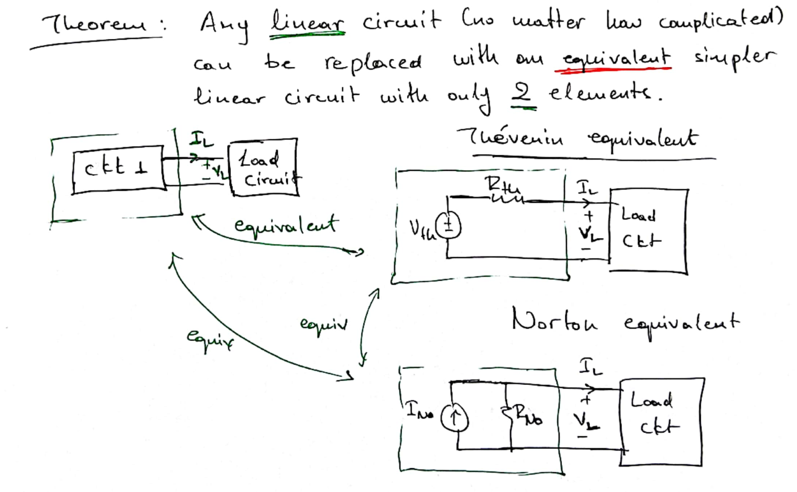

## Equivalence Examples
> [Note15B](Typed_notes_pdf/Note15B.pdf)
> [Written_Notes15](Typed_notes_pdf/Written_Notes15.pdf)

# Dependent Sources
### Definition
> 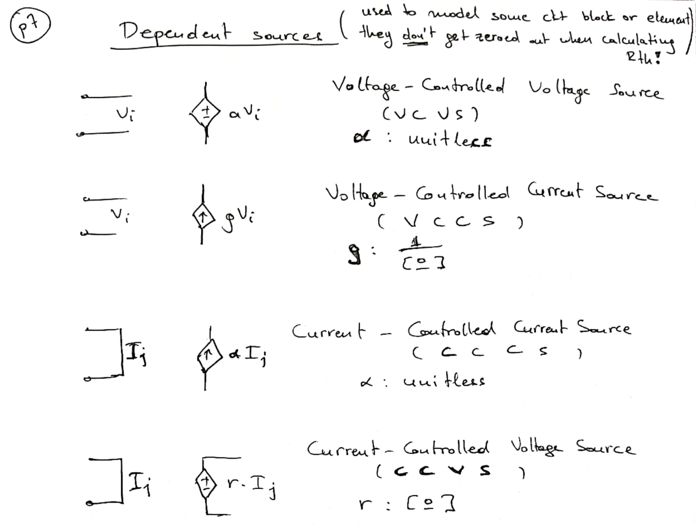
> 📗: 这里 $g$ 的单位是 $ohm^{-1}$ (用 $\frac{1}{o}$ 表示)。因为 $gV_i$ 的单位必须是安培。
> 📗: 这里 $r$ 的单位是 $ohm$，因为 $r\cdot I_j$ 的单位必须是伏特。
> 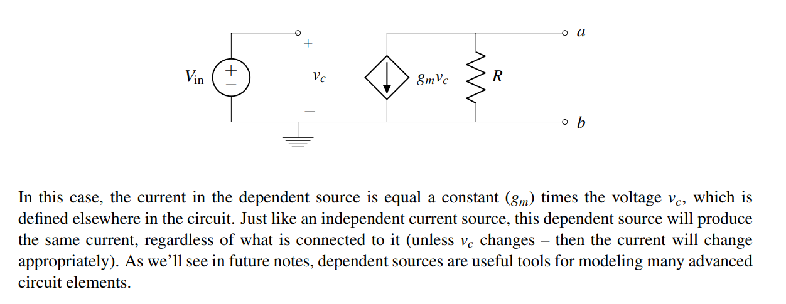
>💡: 本质上，`dependent sources` 和之前 [Basic Circuit Elements](1_Circuit_Analysis_Node_Voltage.md#Basic%20Circuit%20Elements) 中的 `independent sources` 类似，都能够在一定条件下产生稳定的电压或者电流的输出。
> 💡: 但是不同点在于，`dependent sources` 输出的稳态电压和电流会随着环境的变化而变化。
> 🔔: `dependent sources` 可以用于构建更为复杂的电路系统。

## Series Resistors (串联电阻)
### Definition
> Two resistors are connected "in series" when the `same current flows through them`.
> 下图中的电阻都不是串联的:
> 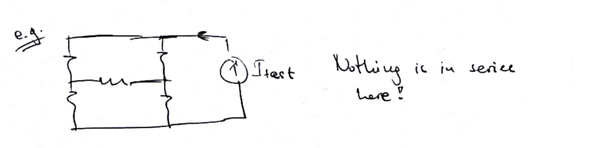

### Example
> 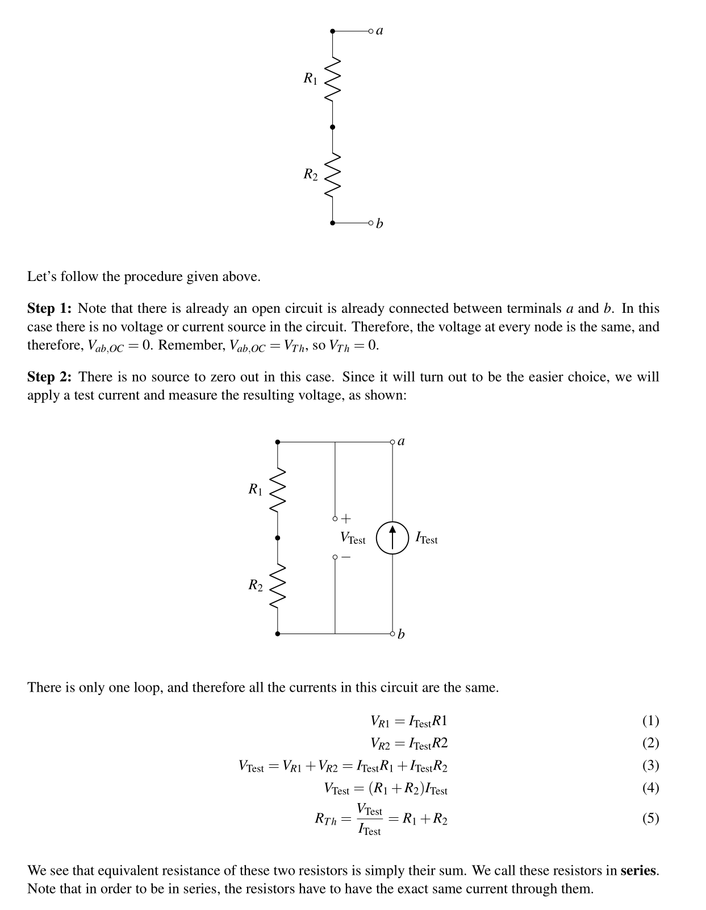

## Parallel Resistors (并联电阻)
### Definition
> Two resistors are connected "in parallel", when the `voltage drop across them is the same` .

### Example
> 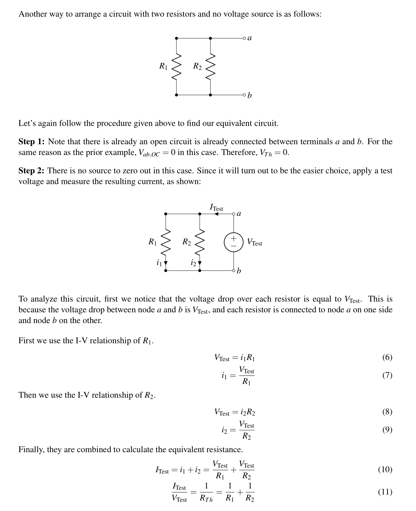 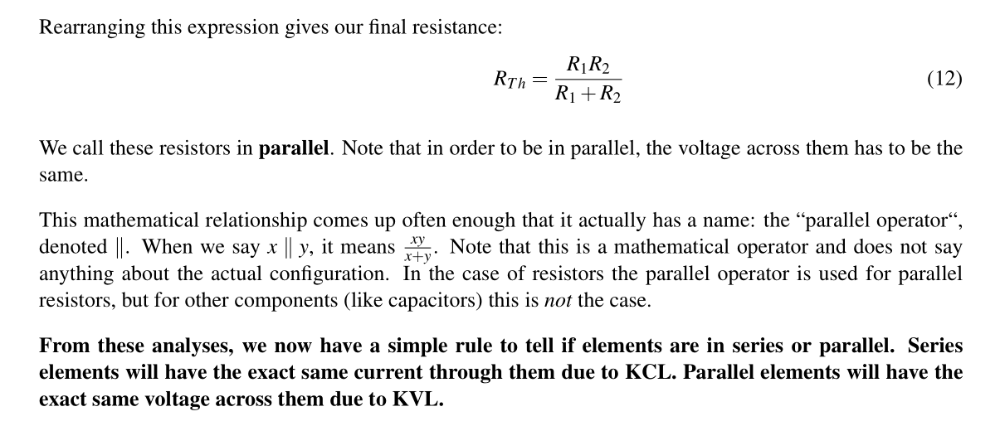

## Voltage Divider
> [Note15B](Typed_notes_pdf/Note15B.pdf)

# Resources
> [Note15A](Typed_notes_pdf/Note15A.pdf)
> [Note15B](Typed_notes_pdf/Note15B.pdf)
> [Written_Notes15](Typed_notes_pdf/Written_Notes15.pdf)
> https://www.bilibili.com/video/BV1wi4y1u7gx?p=16&vd_source=66aa12d38833505f6c2216f089511404