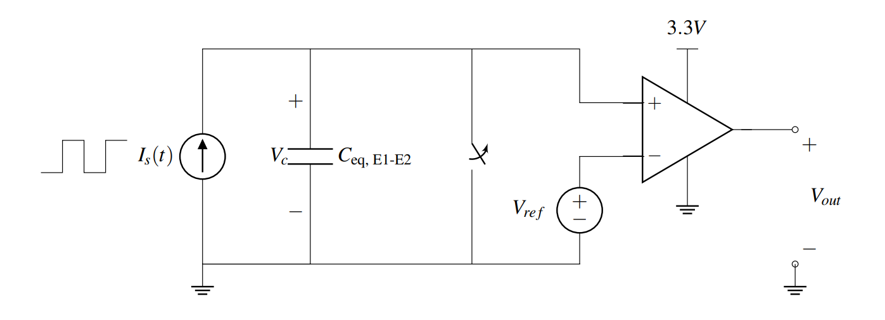

# Design Principle
> 

# Design Caveats
## Current Source
> The current source should not be in an open circuit.

## Voltage Source
> The voltage source should be kept an open circuit.

 
# Design Examples
## Example 1
> 

## Example 2
> 
> 

## Example 3 
> 
> 

# Capacitive Touchscreen Revisted
> [2_Touchscreen_Op_amp](../2_Capacitive_Touchscreen/2_Touchscreen_Op_amp.md)
> 

# Resources
> [Note20](Typed_Notes/Note20.pdf)

