# Capacitor Analysis⭐⭐⭐⭐⭐
> **HW01 Sp23 P2~P6**
> **计算一个电容的两端的：**
> 1. 电压随时间变化的曲线: $V_C(t) = V_C(0)+\int_0^t\frac{I(t')}{C}dt'$。
> 2. `Power`随时间变化的曲线: 如果我们有$I(t)$和$V_C(t)$的图像，则$P_C(t)$的图像也就呼之欲出了，就只需要把$I(t)$和$V_C(t)$的图像`Pointwise`相乘即可。
> 3. `Stored Energy`: 
>    1. 对于**某一时刻电容**储存的能量，我们可以永远相信$E_C(t)=\frac{1}{2}C(V_C(t))^2$。
>    2. 一般而言对于**稳定状态下的电子元件**储存的能量我们可以使用$E(t)=\int_0^{\infty} V(t)I(t)dt$进行积分求解。

## Charging Process  
> 对于一个电容来说，我们有$Q=CV$关系成立，其中$Q$和$V$是对时间而变化的函数，$Q(t)$和$V(t)$, 于是我们有以下定义:
> $Q(t)=C V(t)$
> 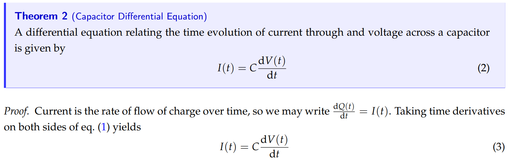
> 电流源恒定时，$V_C(t)-V_C(0)=\frac{I_St}{C}$

## Capacitor I
> 

**Voltage**
首先注意这里的$\int_{0}^t i(t')dt'$的单位是$mA\cdot ms$, 所以在将$100$和$-100$带入求积分之后我们需要对得到的值乘以$10^{-3}\times 10^{-3}=10^{-6}$, 所以图像的斜率应该是$\frac{1}{3}\times 10^6\times 100\times 10^{-3}\times 10^{-3}=33.3$。
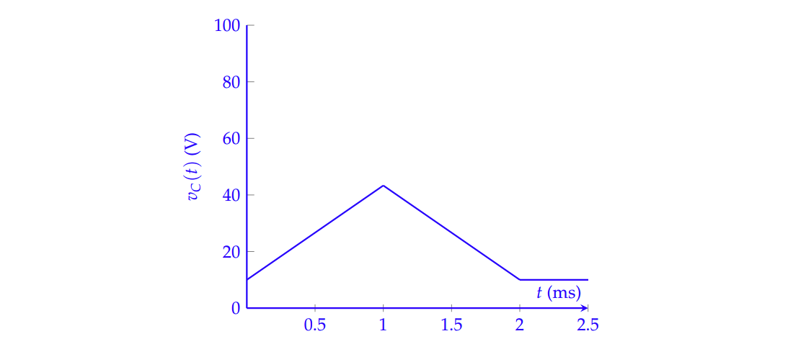
**Power**$V_C(t)=10+33.3t$, $I_C(t)=\begin{cases} 0.1A&0~s<t<0.001~s\\-0.1A&0.001s<t<0.002s\end{cases}$
所以$W_C(t)=V_C(t)I_C(t)=(10+33.3t)I_C(t)=\begin{cases} 1+3.33t&0~s<t<0.001~s\\-1-3.33t&0.001s<t<0.002s\end{cases}$
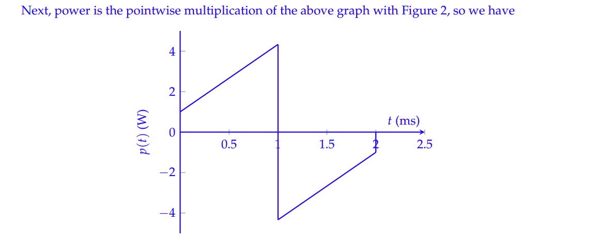
**Stored Energy**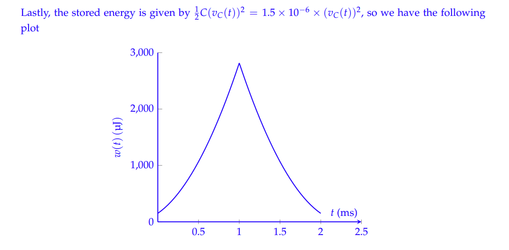

## Capacitor II: Circuit Equivalence
> 

**Solution (a)**$\begin{aligned}100V-\frac{dV_C(t)}{dt}\cdot CR&=V_C(t)\\\frac{dV_C(t)}{dt}&=-\frac{1}{CR}V_C(t)+\frac{100}{CR}\end{aligned}$
所以$V_C(t)=100(1-e^{-\frac{t}{10^{-3}}})$
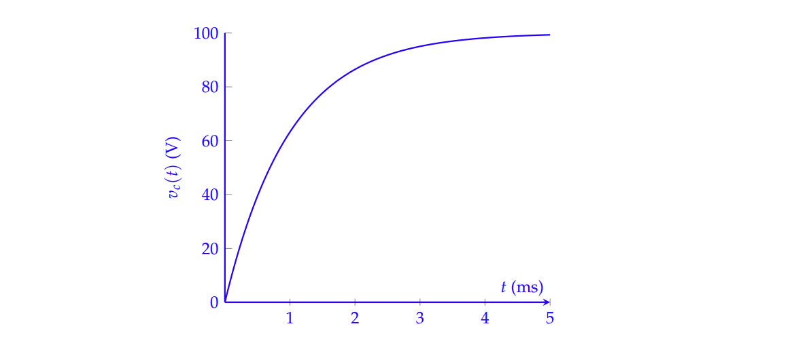
> 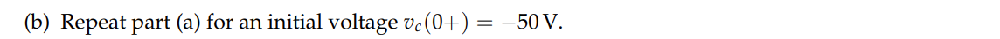

**Solution (b)**

## Capacitor III
> 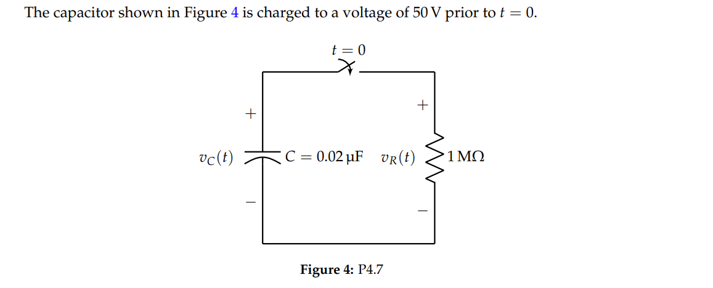

**Solution**根据`KVL`定律我们有$V_C(t)-V_R(t)=0$
电流方向是从电容的正极流向负极，所以$V_R(t)=-I_C(t)R$
因为$I_C(t)=\frac{dV_C(t)}{dt}\cdot C$, 所以$V_C(t)+\frac{dV_C(t)}{dt}\cdot CR=0$。
所以$\frac{dV_C(t)}{dt}=-\frac{1}{CR}V_C(t)$, 这里$CR=0.02\times 10^{-6}\cdot 1\times 10^6=0.02$。
所以$\frac{dV_C(t)}{dt}=-\frac{1}{0.02}V_C(t)$, 得到$V_C(t)=V_C(0)e^{-\frac{1}{0.02}t}=50e^{-\frac{t}{0.02}}$
综合来看，我们有: $V_C(t)=\begin{cases} 50&t\leq0\\ 50e^{-\frac{t}{0.02}}&t>0\end{cases}$, $V_R(t)=\begin{cases} 50&t\leq0\\ 50e^{-\frac{t}{0.02}}&t>0\end{cases}$
> 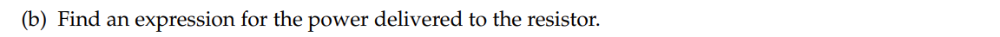

**Solution**$I_C(t)=\frac{dV_C(t)}{dt}\cdot C=\begin{cases}0&t\leq 0\\-2500e^{-50t}&t>0 \end{cases}\times 0.02\times 10^{-6}=\begin{cases} 0&t\leq 0\\-50e^{-50t}\times 10^{-6}&t>0\end{cases}$
$\begin{aligned}W_R(t)&=V_{R}(t)I_R(t)=V_R(t)\cdot (-I_C(t))\\&=\begin{cases} 50&t\leq0\\ 50e^{-\frac{t}{0.02}}&t>0\end{cases}\times (-\begin{cases} 0&t\leq 0\\-5e^{-50t}\times 10^{-6}&t>0\end{cases})\\&=\begin{cases}0&t\leq 0\\2500e^{-100t}\times 10^{-6}&t>0 \end{cases}=\begin{cases}0&t\leq 0\\2.5e^{-100t}\times 10^{-3}&t>0 \end{cases}\end{aligned}$
> 

**Solution**本题主要运用公式即可$\int_0^{\infty}V_R(t)I_R(t)dt$:
$\begin{aligned}\int_0^{\infty}V_R(t)I_R(t)dt&=\int_0^{\infty}50e^{-50t}\times -2500e^{-50t}\times 0.02\times 10^{-6}dt\\&=2.5\times 10^{-3}\times (-\frac{1}{100}e^{-100t}\big|_0^{\infty})\\&=25\times 10^{-6}\\&=25uJ\end{aligned}$
> 

**Solution**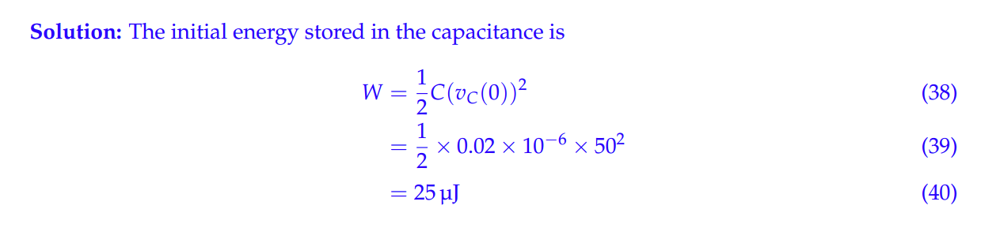
可以发现，电容中储存的能量最终都流向了电阻。

## Capacitor IV
> **EECS16B sp23 HW1 P4**
> 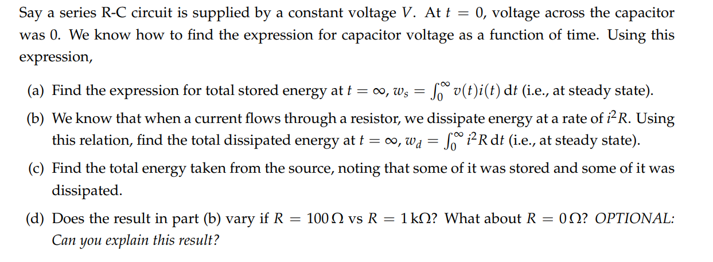

**Solution (a)**假设$v(t)$是电容两端的电压，$V$是电压源的电压则我们根据`RC`电路微分方程可知，$\frac{dv(t)}{dt}+\frac{v(t)}{RC}=\frac{V}{RC}$, 其解为$v(t)=V(1-e^{-\frac{t}{RC}}),t\geq 0$, 所以$\frac{dv(t)}{dt}=(-\frac{1}{RC})\cdot (-e^{-\frac{t}{RC}})=\frac{1}{RC}e^{-\frac{t}{RC}}$
于是根据能量公式: 
$\begin{aligned}w_s&=\int_0^{\infty}v(t)i(t)dt\\&=\int_0^{\infty}v(t)\cdot\frac{dv(t)}{dt}Cdt\\&=C\int_0^{\infty}V(1-e^{-\frac{t}{RC}})\frac{d(V(1-e^{-\frac{t}{RC}}))}{dt}dt\\&=C\int_0^{\infty}V(1-e^{-\frac{t}{RC}})\frac{V}{RC}e^{-\frac{t}{RC}}dt\\&=\frac{CV^2}{RC}\int_0^{\infty}(1-e^{-\frac{t}{RC}})e^{-\frac{t}{RC}}dt\\&=\frac{CV^2}{RC}(-RC)(-1+\frac{1}{2})\\&=\frac{1}{2}CV^2\end{aligned}$
**Solution (b)**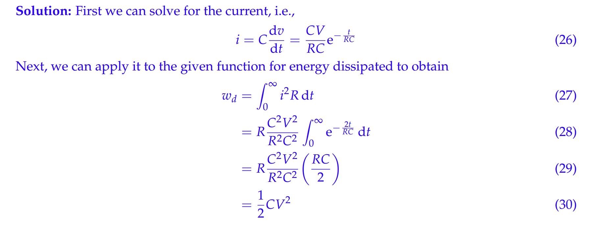
**Solution (c)**
**Solution (d)**

# Inductors
## Definition
> 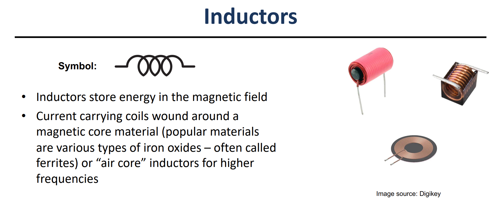
> 🔔: 这里要注意$I_{L}$不会突变，因为如果$I_L$突变，也就是说$\frac{dI_L(t)}{dt}\to \infty$, 那么$V_L(t)\to \infty$, 这也是不符合实际的。

## Physics Behind
> 电容因为电荷的正负极会产生电场$\vec{E}$, 电场能够储存电容的能量。
> 电导因为有电流流经会产生电磁场$\vec{B}$，磁场能够储存电导的能量。
> 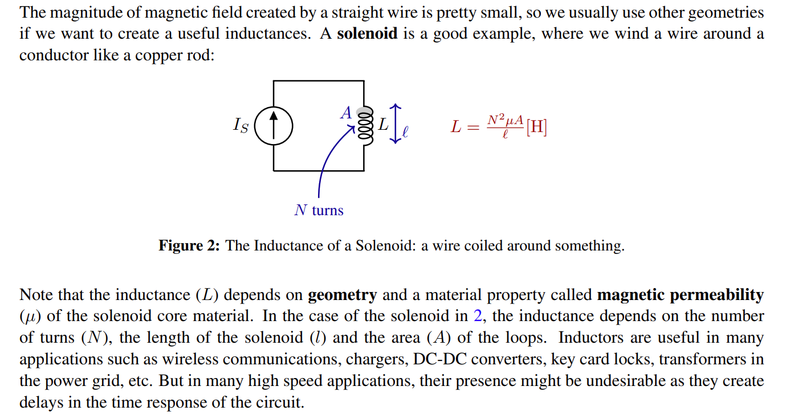

## Magnetic Flux
> 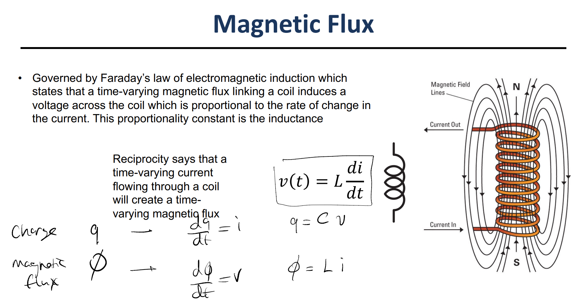

## Stored Energy
> 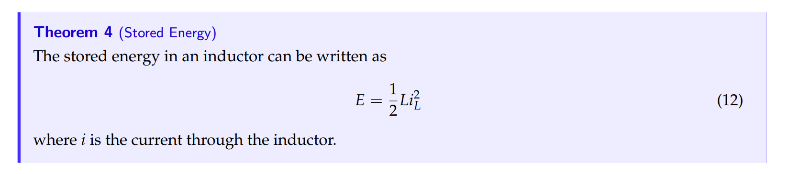

**Proof**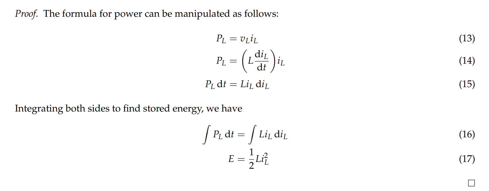

# Mutual Inductance
> 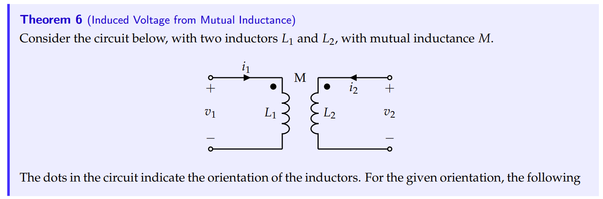
> **总的来说，我们有:**
> $\begin{aligned}& v_1(t)=L_1 \frac{\mathrm{d} i_1}{\mathrm{~d} t} \pm M \frac{\mathrm{d} i_2}{\mathrm{~d} t} \\& v_2(t)= \pm M \frac{\mathrm{d} i_1}{\mathrm{~d} t}+L_2 \frac{\mathrm{d} i_2}{\mathrm{~d} t}\end{aligned}$

**Proof**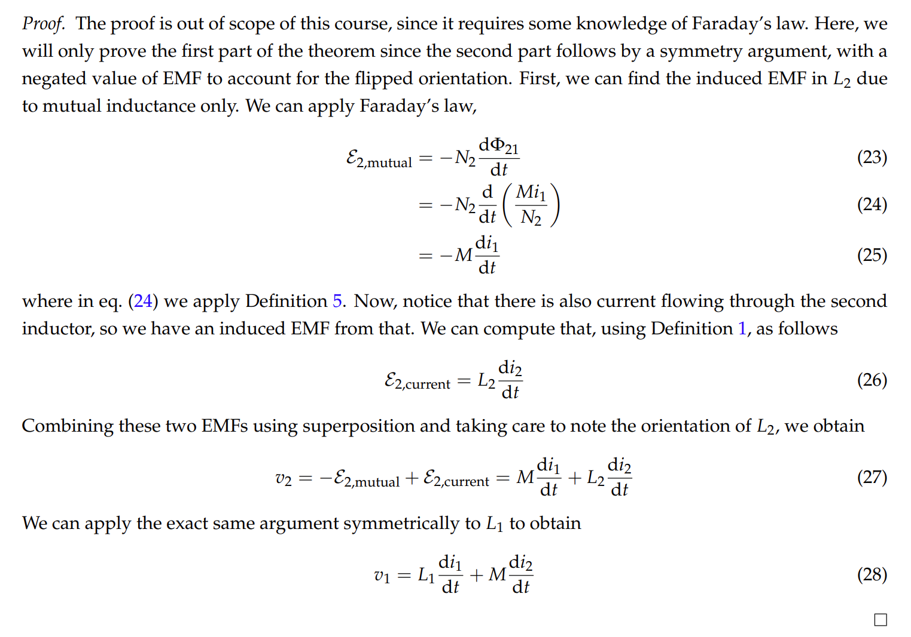

# Inductor Equivalence
## Series Equivalence
> 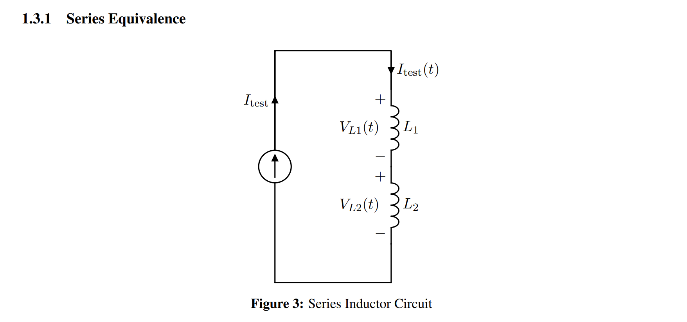

## Parallel Equivalence
> 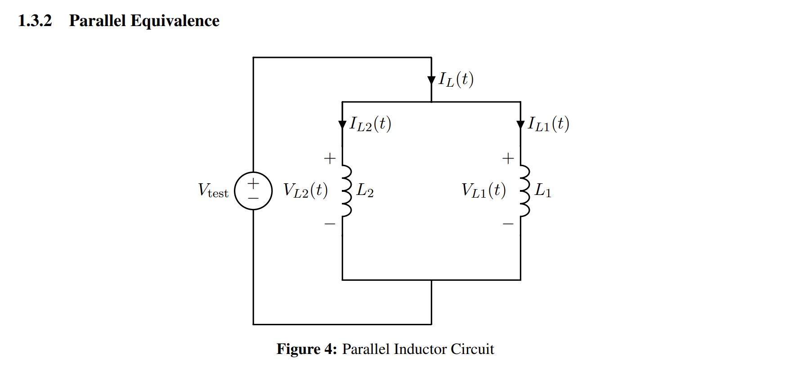

## RL Circuit
> 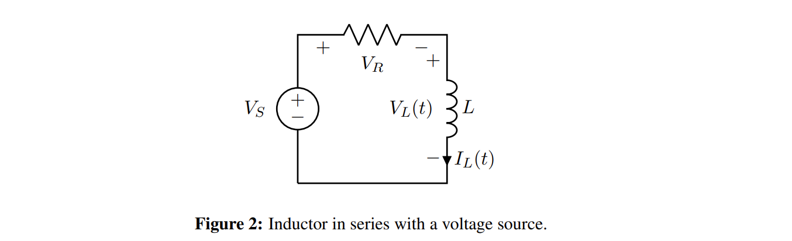
> $\begin{aligned}V_R(t) & =V_S-V_L(t) \\R I_L(t) & =V_S-L \frac{\mathrm{d}}{\mathrm{d} t} I_L(t)\\\frac{\mathrm{d}}{\mathrm{d} t} I_L(t)&=-\frac{R}{L} I_L(t)+\frac{V_S}{L}\\
I_L(t) &=-\frac{V_S}{R} \mathrm{e}^{-\frac{R}{L} t}+\frac{V_S}{R} \\
&=\frac{V_S}{R}\left(1-\mathrm{e}^{-\frac{R}{L} t}\right)\\V_L(t)&=V_S \mathrm{e}^{-\frac{R}{L} t}
\end{aligned}$
> 其中$\frac{L}{R}$的单位是$s$, 决定了时间轴上的`Time Scale`。
> 假设 $R=500 \Omega, L=1 \mathrm{mH}, V_S=5 \mathrm{~V}$, 我们有$\tau=\frac{L}{R}=0.2\times 10^6s=2us$, 于是:
> 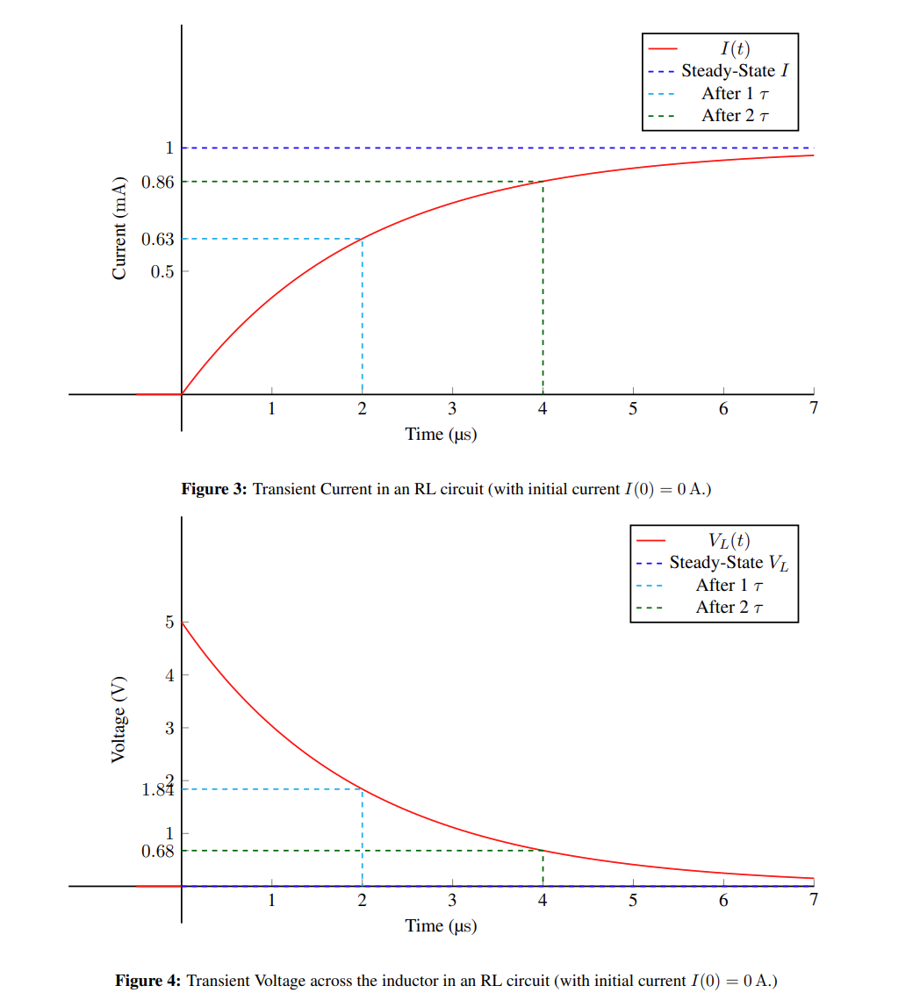

# Inductor Analysis
## Charging Process
> **Disc 02B Sp23 P1(a)**
> 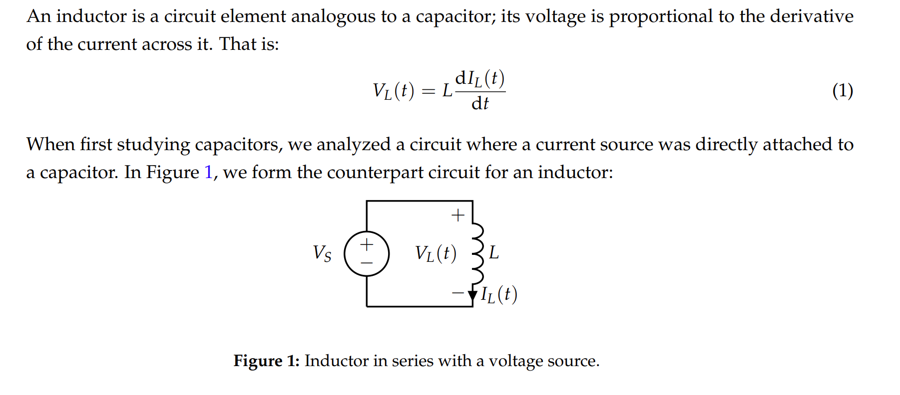
> 1. 假设$I_L(0)=0A$, 两端有一个恒定电压源$V_S$，则$\frac{dI_L(t)}{dt}\cdot L=V_S$, 两边积分得到$\int_0^{t}dI_L(t)=\int_0^{t}\frac{V_S}{L}$, 于是$I_L(t)-I_L(0)=V_S$, 所以$I_L(t)=\frac{V_S t}{L}$。

## Power Properties
> **HW03 Sp23 P2**
> 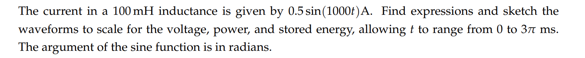

**Voltage**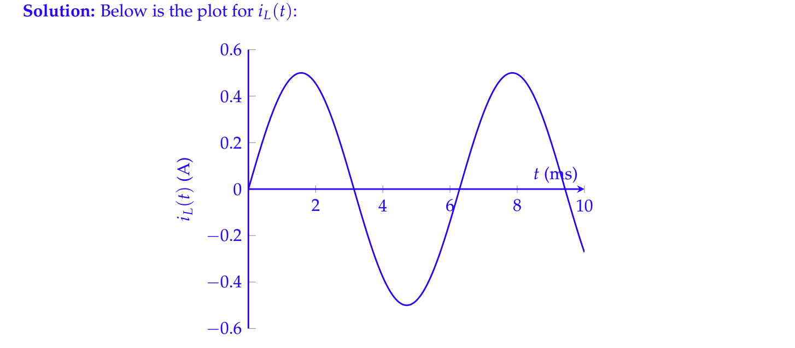
**Power**
**Stored Energy**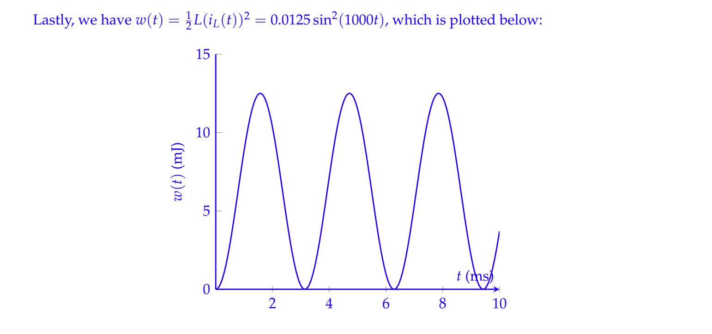

## Inductance Extremities
> **HW03 Sp23 P3**
> 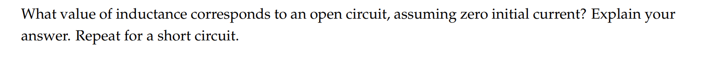
> `Open Circuit`对应的条件是$I_L(t)=0$, 因为$V_L(t)=\frac{dI_L(t)}{dt}\times L$, 所以:
> $\frac{V_L(t)}{L}=\frac{dI_L(t)}{dt}$, 两边取积分得到$I_L(t)-I_L(t_0)=\frac{1}{L}\int_{t_0}^tV_L(\tau)d\tau$, 因为$I_L(t)=I_L(t_0)=0$
> 所以$\frac{1}{L}\int_{t_0}^tV_L(\tau)d\tau=0$, 因为$\int_{t_0}^tV_L(\tau)d\tau\neq 0$, 所以$L\to \infty$。
> `Short Circuit`对应的条件是$V_L(t)=0$, 因为$\frac{dI_L(t)}{dt}\neq 0$, 所以$L=0$。

## Mutual Inductance
> **HW03 Sp23 P4**
> 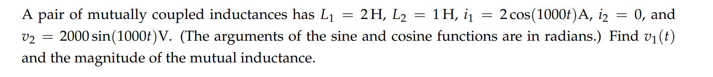

# OpAmp
## Op-Amp Stability Part 1
> **HW02 Fa21 P5**
> 

**(a) OpAmp Circuit in Detail**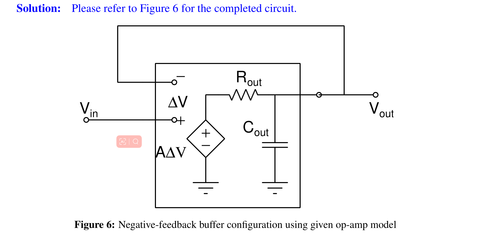
**(b) OpAmp Differential Equation - Negative Feedback Loop**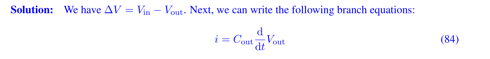
**(c) OpAmp Differential Equation - Positive Feedback Loop**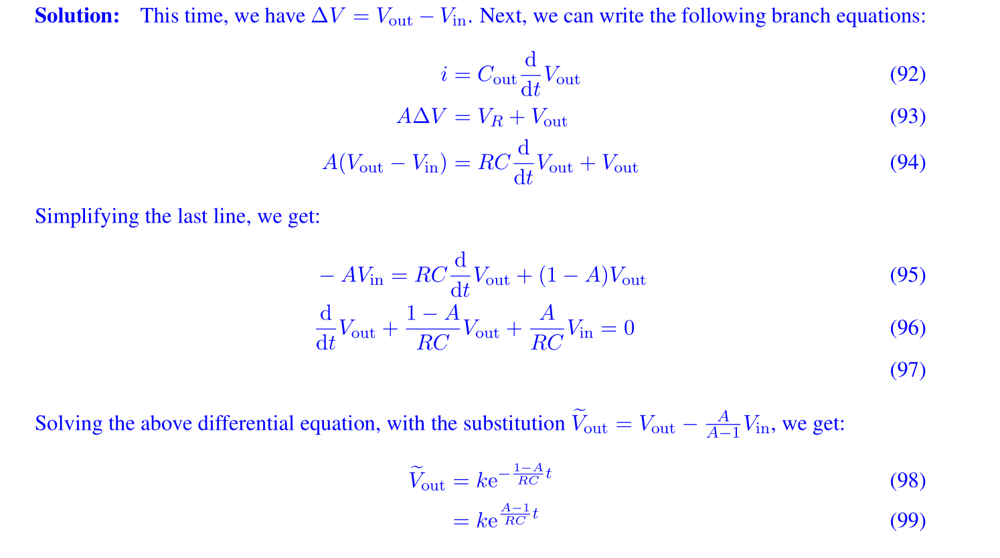
**(d) Limiting Behaviors**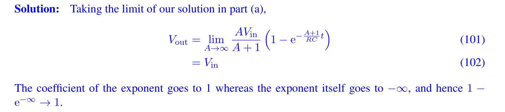
**(e) Vector Differential Equations**
> **本题要注意:**
> 在画一个`Detailed OpAmp`电路的时候，左侧的`Terminal`和`OpAmp`本体之间永远是`Open Circuit`, 无论有没有`Feedback Loop`, 左侧的$V_+$和$V_-$端都是裸露在电路之外的。如下图中的的绿色端，电流都是零，流经`Feeback Loop`的电流也是零。
> 
> 即$(a)$中的输入端是$V_{in}-V_{out}$, $(b)$中的输入端是$V_{out}-V_{in}$。

## Op-Amp Stability Part 2
> **HW03 Fa21 P6**
> 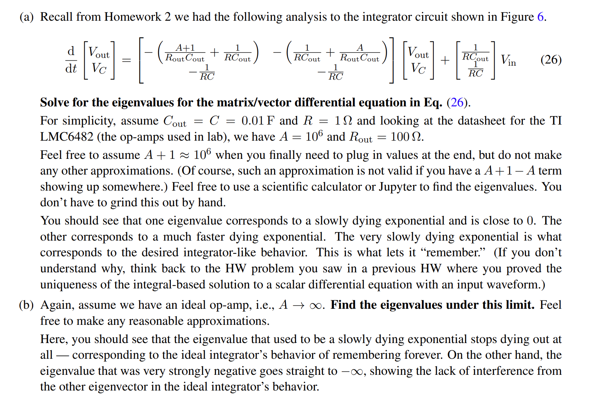

**(a) Eigenvalues**
**(b) Approximation**

# Summary
## Capacitors&Inductors
> 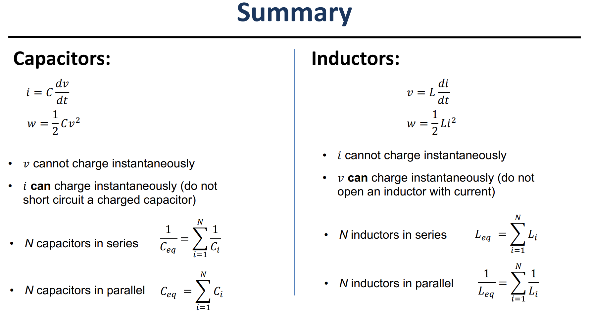

