# First Order Linear ODEs
## Scalar Constant Differential Equation
> 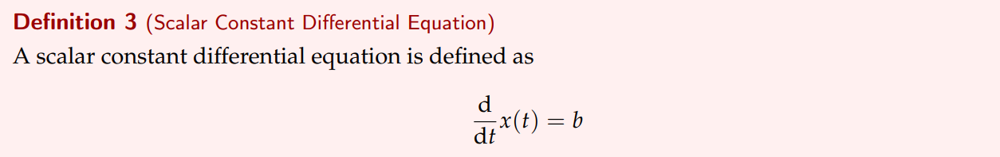

## Homogeneous Differential Equation
> 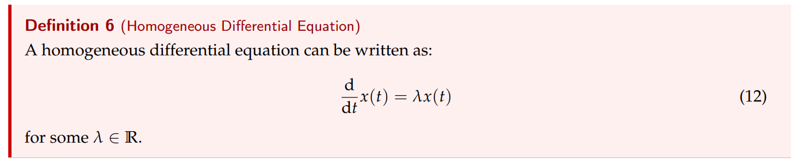
> 其中$\lambda =0$时，这个微分方程退化为常数$b=0$的常数微分方程。所以我们一般只考虑$\lambda>0$的情况。
> 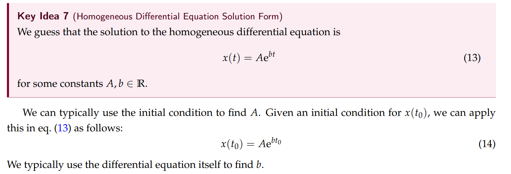

**Proof**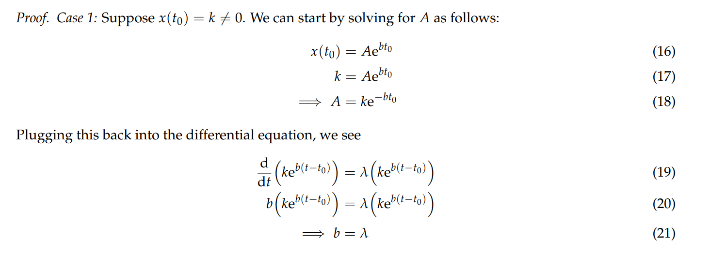

## Nonhomogeneous Differential Equation
> 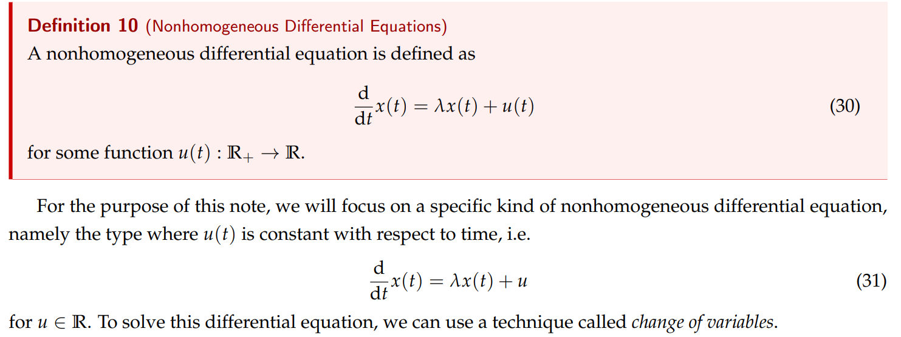
> - 如果$u=0$, 则为齐次线性微分方程。
> - 如果$\lambda =0$, 则为常数线性微分方程。

**Proof**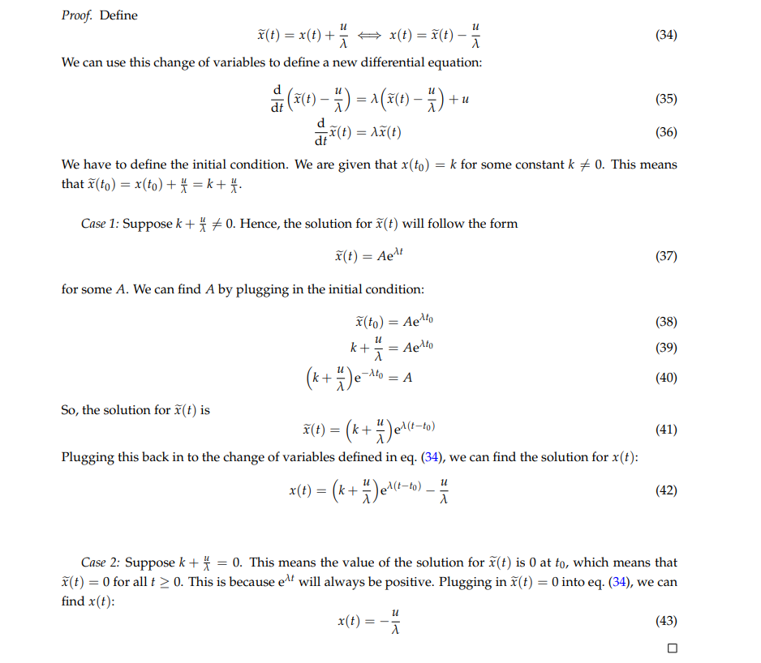

## Integrating Factor Method
### Theorems
> 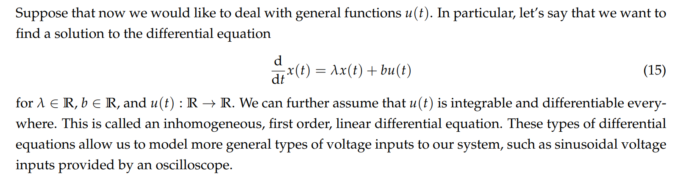
> 下面提供两种视角，但本质上是一致的。

#### Definite Integral Version
> 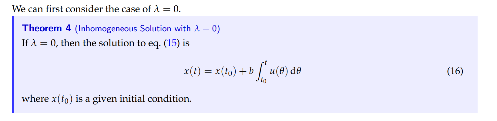

**Proof**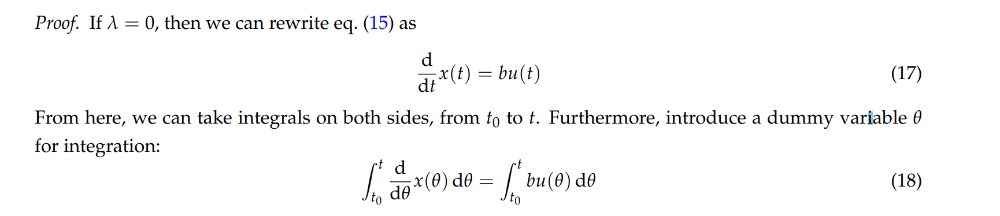
> 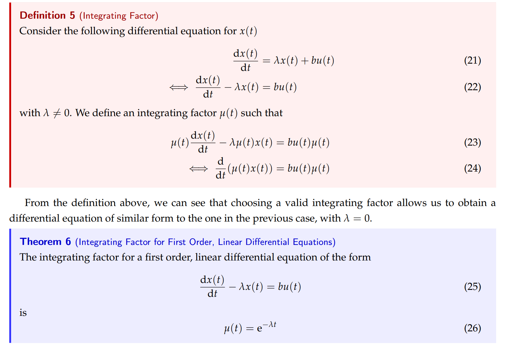

**Proof**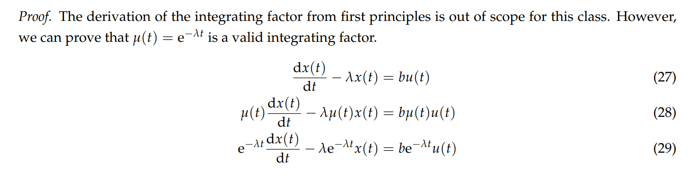
> 

#### Indefinite Integral Version
> **HW01 Sp23 P6**
> 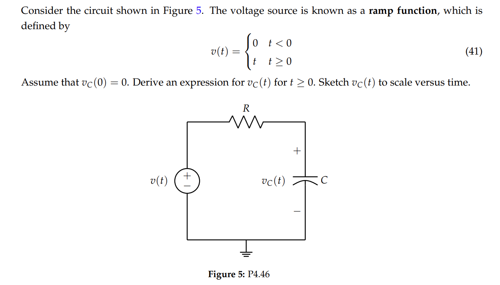
> 对于一个一阶线性常系数非齐次微分方程$\dot{x}(t)+kx(t)=p(t)$来说，我们使用`Integrating Factor`来求解，步骤为:
> 1. 求解`Integrating Factor`: $u(t)=e^{\int kdt}=e^{kt}$。
> 2. 求解$\int p(t)u(t)dt$, 本题中为求解$\int e^{\frac{t}{RC}}\frac{t}{RC}dt$, 我们使用$uv-\int udv = \int vdu$公式。
> 3. 解为$x(t)=\frac{\int p(t)u(t)dt+C}{u(t)}$, $C$由初始条件决定。

**Solution**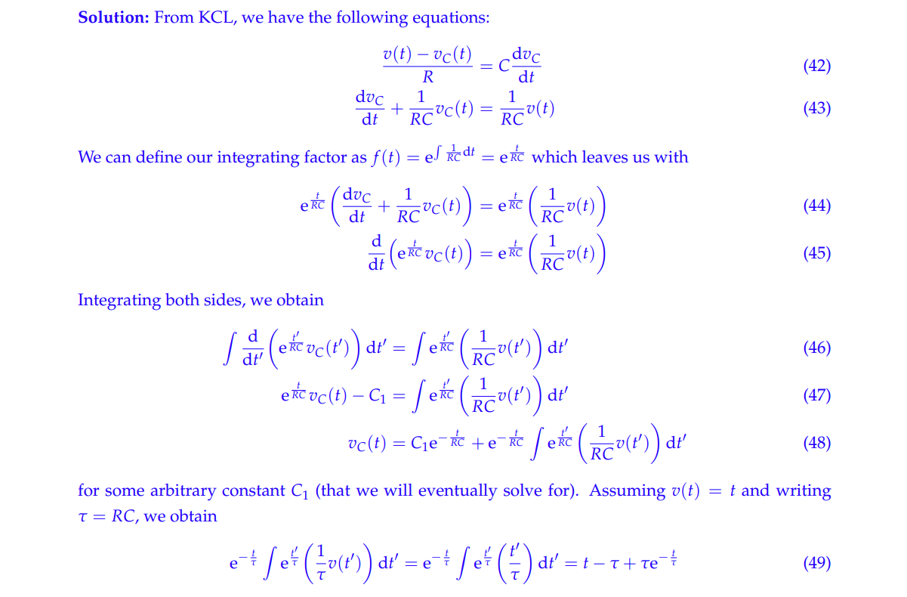

### Derivations - Definite Version
> 
> 这个微分方程的解是: $V(t)=e^{\lambda t}(\int -\lambda u(t)e^{\lambda t}dt+C)$

**Proof - Detailed**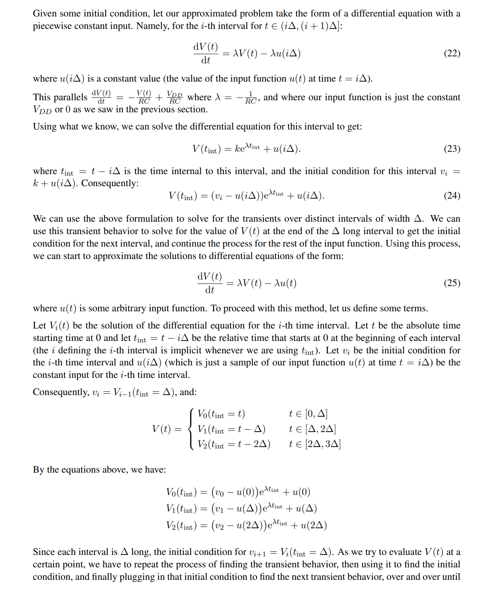

## Summary
> 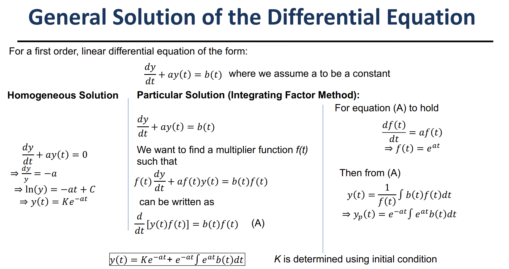

# DC Steady State
## Theory
> `DC Cicruit`的一大特征就是输入$V_{in}$是一个固定的值。
> 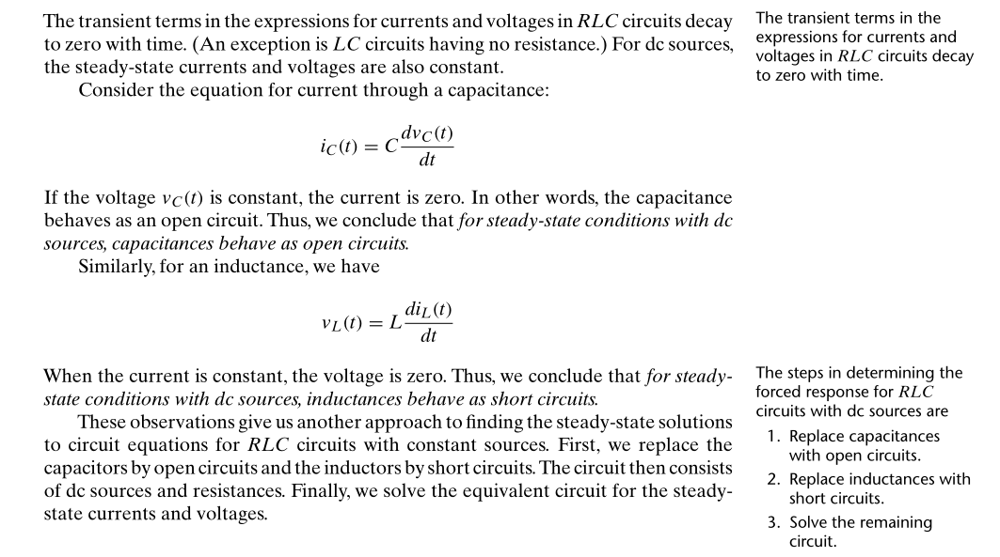
> **总的来说就是:**
> 1.  For dc sources, the steady-state currents and voltages are also constant。
> 2. 稳定状态下，将电容替换成`Open Circuit`, 将电导替换成`Wire`来分析。

## Example
> 

**Solution**

# RC Circuit DE
## RC Circuit without Input
> 没有电压源相当于输入电压$V_{in}=0V$:
> 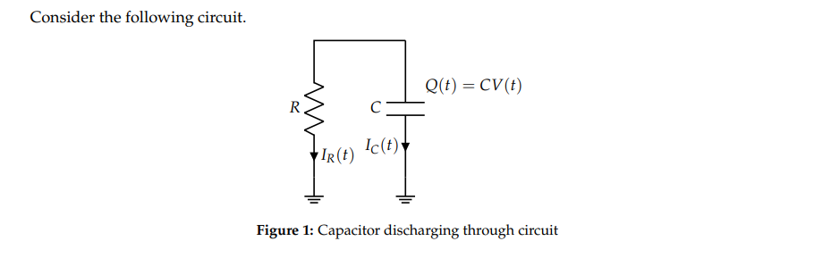

## RC Circuit with Input
### Basic Example
> 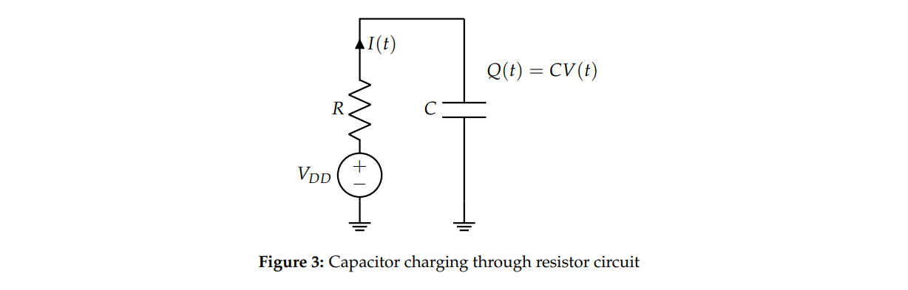
> $V_C(t)=V_{DD}-V_{DD}e^{-\frac{t}{RC}}=V_{DD}(1-e^{-\frac{t}{\tau}})$, 其中:
> 1. 第一项$V_{DD}$被称为`Steady State Response/Forced Response`, $t\to \infty$时保留下来。
> 2. 第二项$-V_{DD}e^{-\frac{t}{RC}}$被称为`Transient Response`, 在$t\to \infty$时衰减到零。

### Complicated Example
> 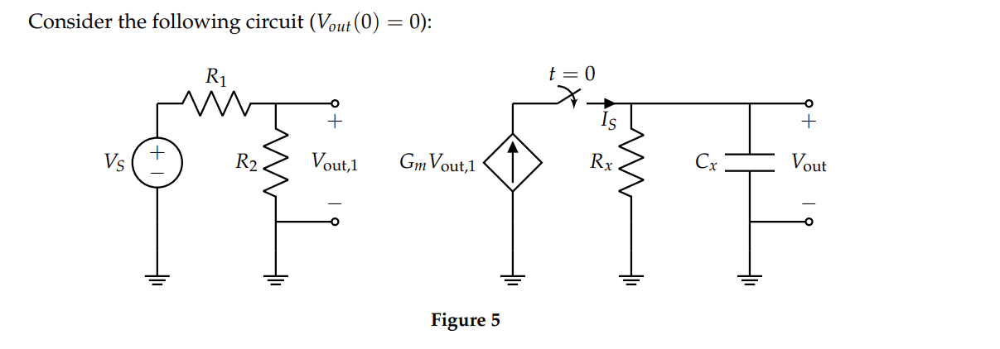
> 1. 我们首先进行`Circuit Analysis`:
> 
$V_{\text {out }, 1}=\frac{R_2}{R_1+R_2} V_S$
> $\begin{aligned}I_S & =I_R+I_C \\G_m V_{\text {out }, 1} & =\frac{V_{\text {out }}}{R_x}+C_x \frac{\mathrm{d} V_{\text {out }}}{\mathrm{d} t} \\\frac{\mathrm{d} V_{\text {out }}}{\mathrm{d} t}+\frac{V_{\text {out }}}{R_x C_x} & =\frac{G_m}{C_x} V_{\text {out }, 1} \\\frac{\mathrm{d} V_{\text {out }}}{\mathrm{d} t}+\frac{V_{\text {out }}}{R_x C_x} & =\left(\frac{G_m}{C_x}\right)\left(\frac{R_2}{R_1+R_2}\right) V_S\end{aligned}$
> 2. 我们对$V_{out}(t)$进行绘制:
> 
有两种方法，一种是直接求解，也不难，因为$V_S$是恒定的，$V_{out}(t)=\left(\frac{G_m}{C_x}\right)\left(\frac{R_2}{R_1+R_2}\right) V_S(1-e^{-\frac{t}{R_xC_x}})$
> 第二种方法是使用`Steady State Analysis`：
> 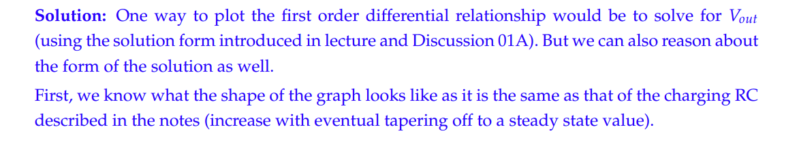

## RC Time Constant
> 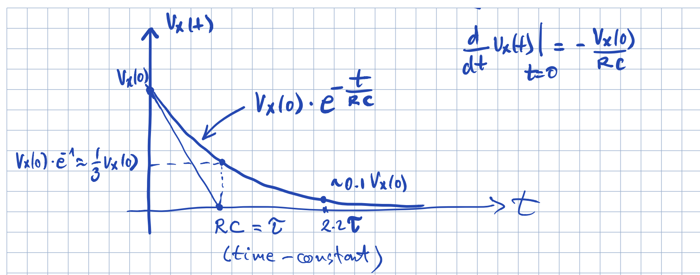
> $\tau$**一般有三种定义方式:**
> 1. $t<0$时$V_{in}=0V$且持续了很长时间，此时$V_C(0)=0V$，$t=0$时输入信号从$V_{in}=0V$变为$V_{in}=V_{DD}$，$\tau=RC$可以被定义为使得$V_C(t)=(1-e^{-1})V_{DD}$的时间，因为$V_C(t)=V_{DD}(1-e^{-\frac{t}{\tau}})$, 所以当$t=\tau$时，$1-e^{-\frac{t}{\tau}}=1-e^{-1}$。
> 2. $t<0$时$V_{in}=V_{DD}$且持续了很长时间，此时$V_C(0)=V_{DD}$，$t=0$时输入信号从$V_{in}=V_{DD}$变为$V_{in}=0V$,$\tau=RC$也可以被定义为使得$V_C(t)=V_{DD}e^{-1}$的时间，因为$V_C(t)=V_{DD}e^{-\frac{t}{\tau}}$, 所以当$t=\tau$时，$e^{-\frac{t}{\tau}}=e^{-1}$。At one time constant, the voltage across a capacitance discharging through a resistance is $e^{−1} \approx 0.368$ times its initial value. After about three to five time constants, the capacitance is almost totally discharged.
> 
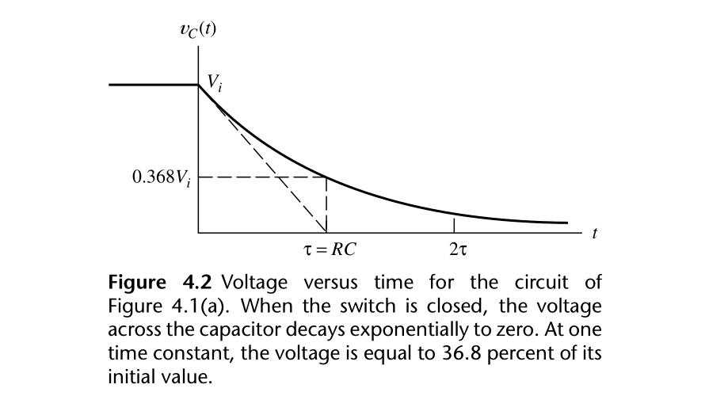
> 3. 假设我们有一阶微分方程$\frac{d}{dt}V_C(t)+bV_C(t)+c=V_{in}(t)$, 则$\tau=RC$($V_C(t)$系数的倒数)。
> 
**一般而言，如果**$\tau$**越小，即**$RC$**的值越小，则电路对外界变化的响应时间越短。**
> $RC=\tau$, 单位是$s$(秒), 这决定了我们在画图时$x$轴的的`Scale`。

## Applications of RC Circuit
> 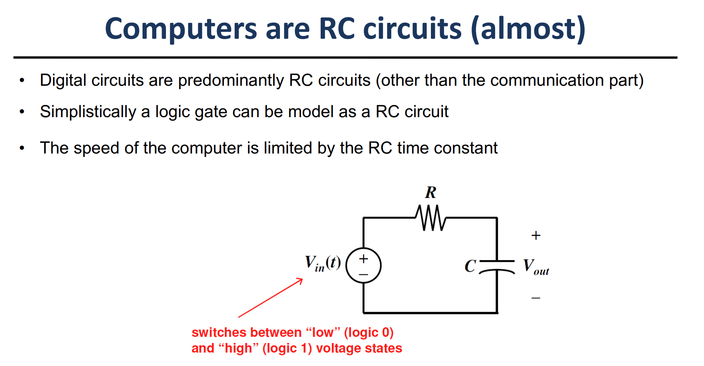

# RL Circuit DE
## RL Circuit with Input
### Basic Example
> **Disc02B Sp23 P1**
> 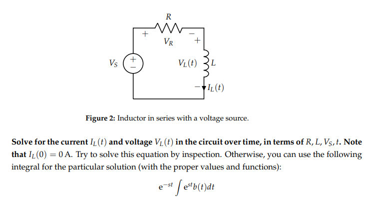
> 1. 建立微分方程
> 
$\begin{aligned}V_R(t) & =V_S-V_L(t) \\R I_L(t) & =V_S-L \frac{\mathrm{d}}{\mathrm{d} t} I_L(t) \\\frac{\mathrm{d}}{\mathrm{d} t} I_L(t)+\frac{R}{L} I_L(t) & =\frac{V_S}{L}\end{aligned}$ 
> 2. 求解微分方程，提供两种方法

#### Method 1: Inspection
> 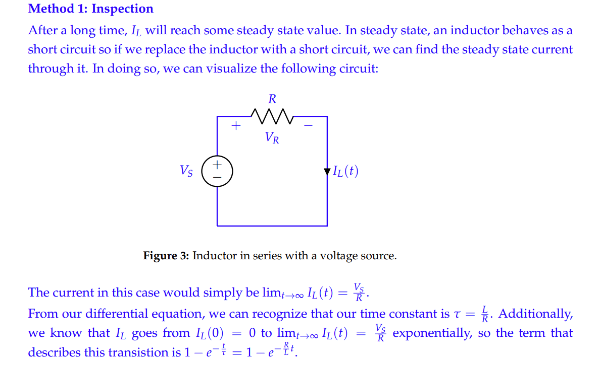

#### Method 2: Integrating Factor
> 
> 虽然本解法中采用了`Particular/Inhomogeneous`的思想，但是本质上还是在利用`Integrating Factor`公式进行推导。

#### Method 3: DC Steady State
> 对于这个`RL Circuit`来说:
> 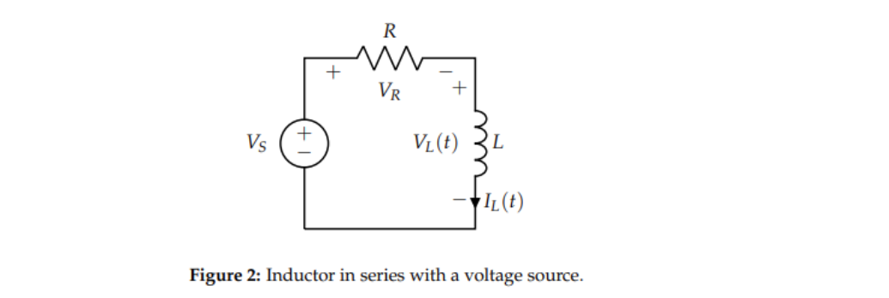
> 我们首先分析其`DC Steady State`, 将`Inductor`看作是导线，则此时$I_L(t)=\frac{V_S}{R}$, 而这其实就是我们
> 微分方程: $\frac{\mathrm{d}}{\mathrm{d} t} I_L(t)+\frac{R}{L} I_L(t)  =\frac{V_S}{L}$的一个`Particular Solution`, $I_p(t)=\frac{V_S}{R}$
> 然后我们求解`Homogeneous Solution`, 本质上是分析$\frac{\mathrm{d}}{\mathrm{d} t} I_L(t)+\frac{R}{L} I_L(t)  =0$的解的情况，这个我们可以很快求出是$I_h(t)=I_h(0)e^{-\frac{R}{L}t}=Ae^{-\frac{R}{L}t}$, 注意我们不知道$I_h(0)$的值是什么，只知道$I_L(0)=0$，故用$A$表示。
> 所以$I_L(t)=I_h(t)+I_p(t)=Ae^{-\frac{R}{L}t}+\frac{V_S}{R}$, 因为$I_L(0)=A+\frac{V_S}{R}=0$，$A=-\frac{V_S}{R}$。
> 所以$I_L(t)=-\frac{V_S}{R}e^{-\frac{R}{L}t}+\frac{V_S}{R}=\frac{V_S}{R}(1-e^{-\frac{R}{L}t})$。

 

### Complicated Example
> **Disc02B Sp23 P2**
> 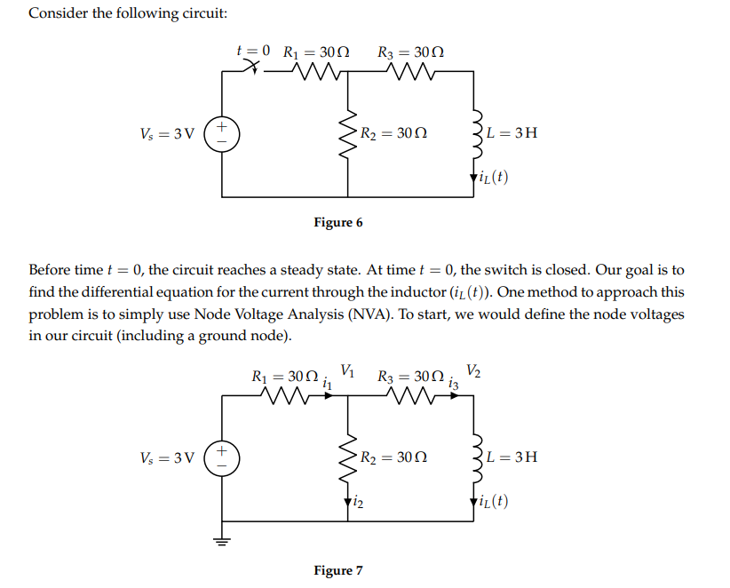

#### Finding RL Differential Equation
##### Method 1: Node Voltage Analysis
> 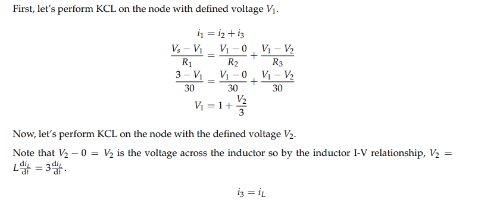

##### Method 2: Circuit Equivalence
> 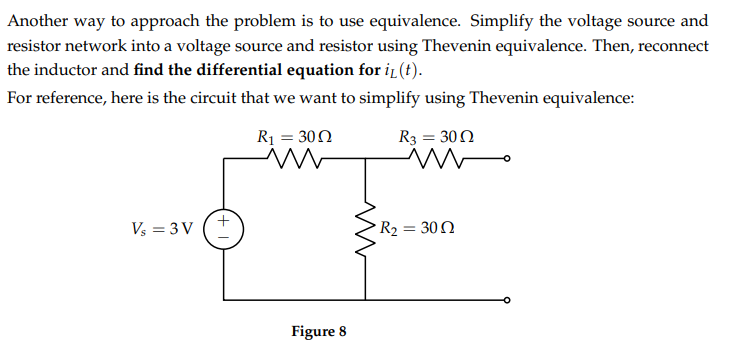
> 1. 找寻`Thevenin Equivalent Circuit`:
> 
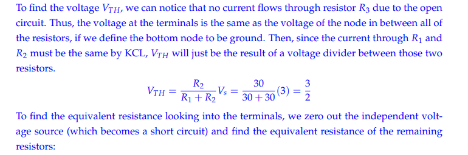
> 2. 对等效的`RL`电路进行电路分析找出微分方程:
> 
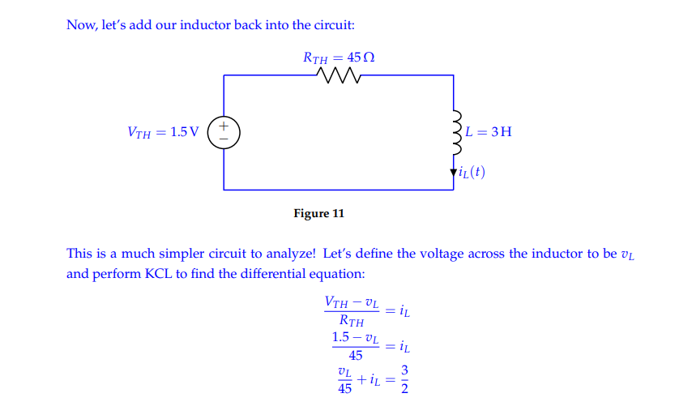

#### Solving RL DE
##### Method 1: Inspection
> 

##### Method 2: Integrating Factor
> 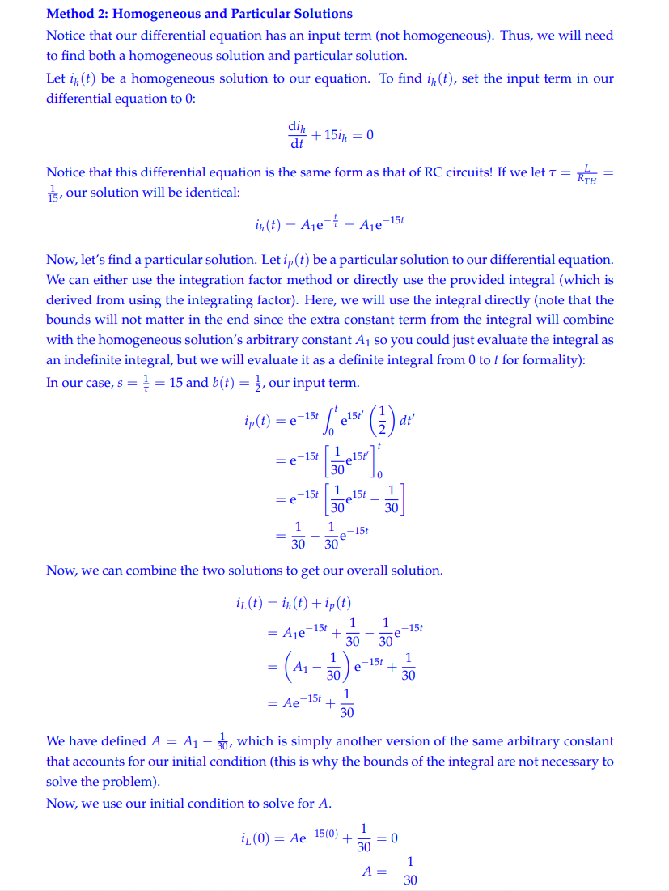

##### Method 3: DC Steady State
> 对于这个电路来说:
> 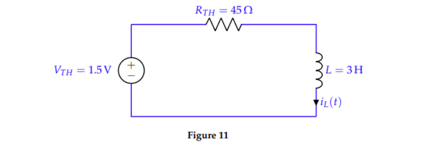
> 我们有微分方程: $\frac{dI_L(t)}{dt}+15I_L(t)=\frac{1}{2}$：
> 1. 找到`Steady State`以求出`Particular Solution`, 我们将`Inductor`看成`Wire`, 此时$I_p(t)=\frac{V_{TH}}{R_{TH}}=\frac{1}{30}$。
> 2. 找到`Homogeneous Solution`, 观察$\frac{dI_L(t)}{dt}+15I_L(t)=0$, 则$I_h(t)=Ae^{-15t}$。
> 3. 找到`General Solution`$I_L(t)=I_h(t)+I_p(t)=Ae^{-15t}+\frac{1}{30}$。因为$I_L(0)=0$, 所以$Ae^{-15\times 0}+\frac{1}{30}=0$, 即$A=-\frac{1}{30}$, 所以$I_L(t)=\frac{1}{30}(1-e^{-15t})$。

## RL Time Constant
> 和$RC$`Time Constant` 类似, 定义为$\frac{\mathrm{d}}{\mathrm{d} t} I_L(t)+\frac{R}{L} I_L(t)  =\frac{V_S}{L}$中$I_L(t)$的系数的倒数$\frac{L}{R}$。

 

# Time-Varying Inputs
> **Detailed: **Fa21 note 2
> **Compact:** Sp23 note 2

## 
## Piecewise Constant Input
> 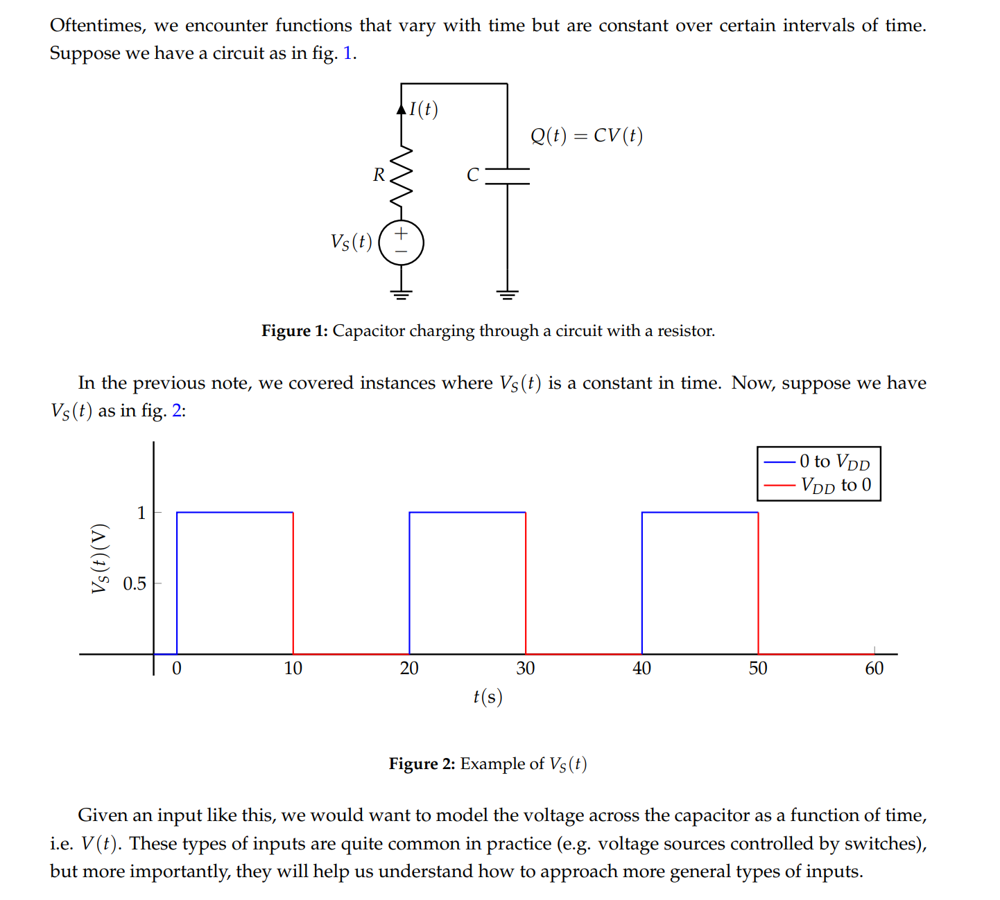

### Recurrence Equation
> 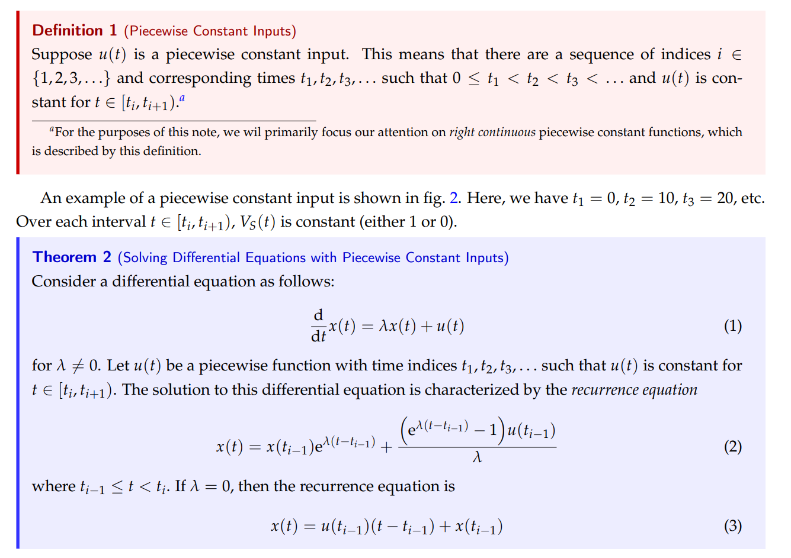

**Proof**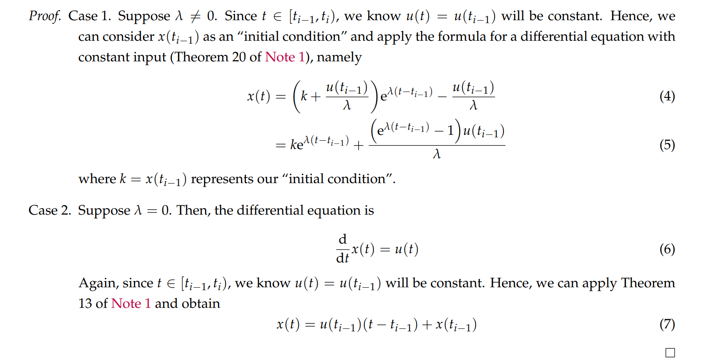
> 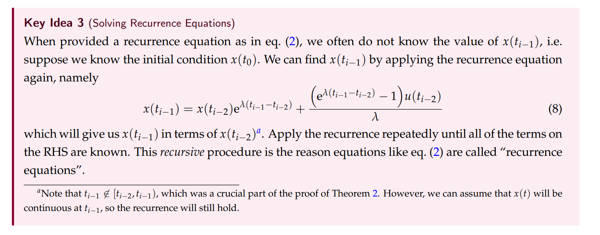

### Two Pieces Example
> **Fall 2021 Disc01B Problem 1:**
> 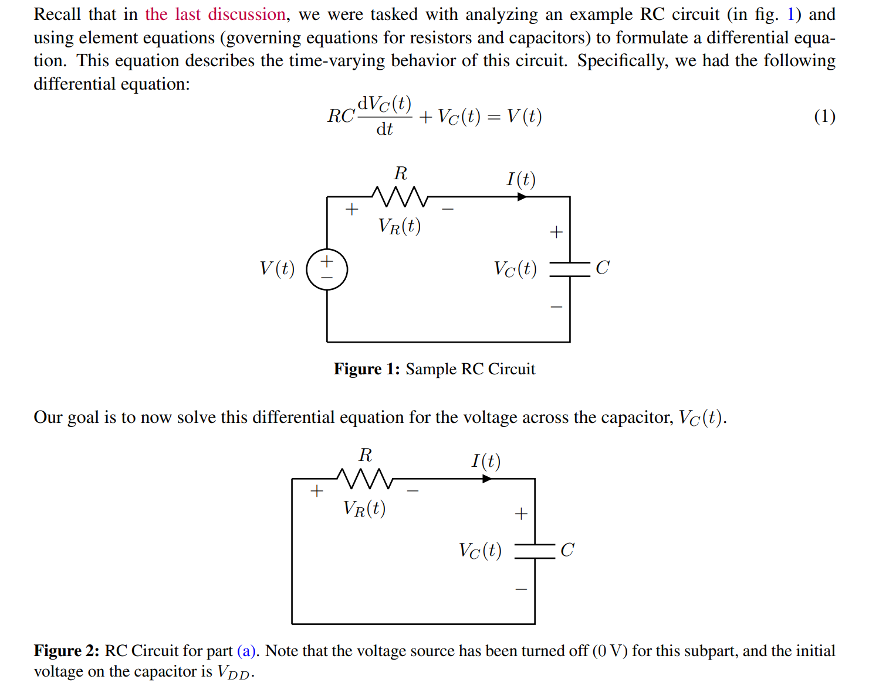

**Piece 1**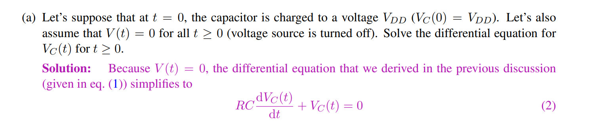
**Piece 2**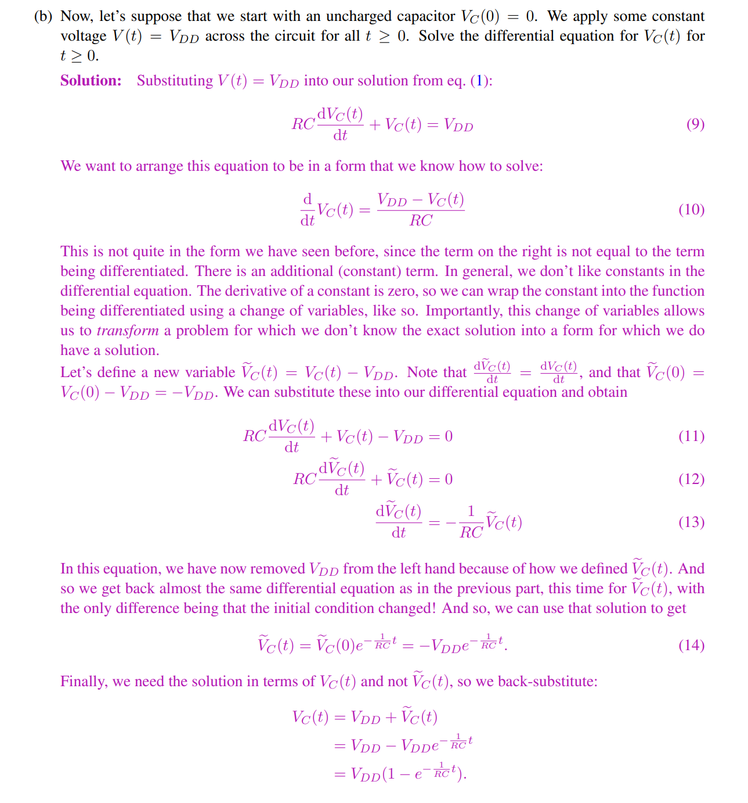
**Piece 1+ Piece 2**⭐⭐⭐⭐⭐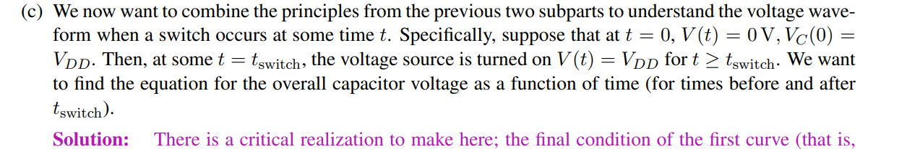
**Demo**[https://www.desmos.com/calculator/gvjm36oo6j?lang=zh-CN](https://www.desmos.com/calculator/gvjm36oo6j?lang=zh-CN)

### N Pieces Example
> **Fall 2021 Disc02B Problem 1:**
> 对于如下的微分方程: $\frac{dx(t)}{dt}=\lambda x(t)+ u(t)$来说，我们可以:
> 1. 将输入信号`Input`$u(t)$(一般是连续的)分解成很多常值函数段$u(i\Delta)$, 其中$i$表示第$i+1$段时间区间，也就是说$i=\lfloor\frac{t}{\Delta}\rfloor$。我们用$u_d[i]$表示第$i$索引的$u(t)$值。($d$是`discrete`的意思)。
> 2. 将输出信号`Response`$x(t)$也抽象成很多小段，使得每一小段上输入$u_d[i]$对应输出$x_d[i]$。注意，这里$u_d[i]$是常数输入，$x_d[i]$是连续的输出。
> 
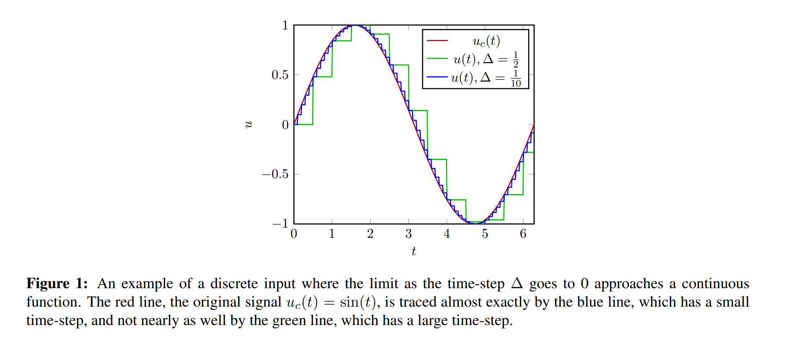
> 对于$t\in [\Delta\lfloor \frac{t}{\Delta}\rfloor ,\Delta(\lfloor \frac{t}{\Delta}\rfloor+1))$，即$t\in [i\Delta, (i+1)\Delta)$来说，我们有**一阶非齐次常系数**微分方程:
> $\frac{dx(t_{int})}{dt}=\lambda x(t_{int})+u_d[i]$, 其中$t_{int}=t-i\Delta$
> 解这种微分方程我们有两种方法:
> 1. 一种是通过通解的形式$x(t_{int})=\alpha e^{\lambda t_{int}}+\beta$, 将其代入微分方程求解。
> 2. 另一种是通过将其化为**一阶齐次常数**微分方程来求解(换元法)。
> 
我们采用第一种:
> 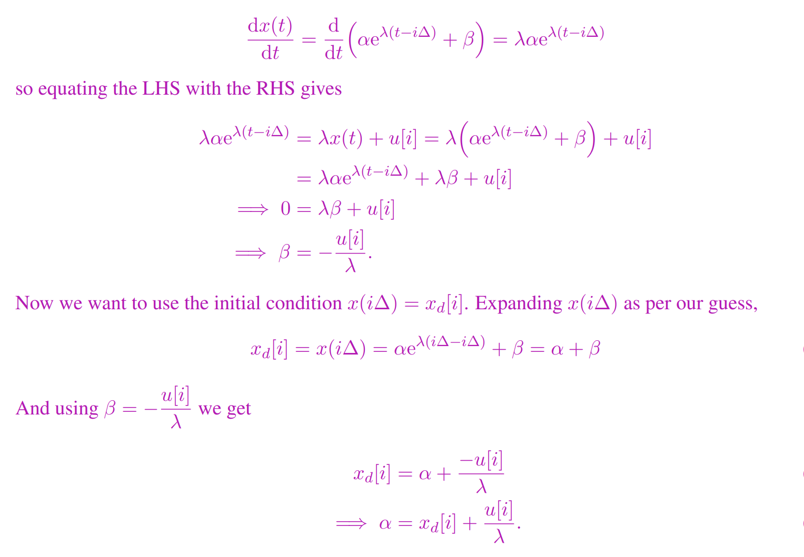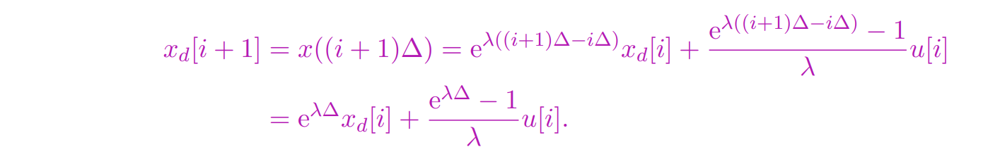有了$x_d[i+1]=e^{\lambda \Delta}x_d[i]+\frac{e^{\lambda \Delta}-1}{\lambda}u[i]$这个`Recurrence Equation`:
> $a=e^{\lambda \Delta}$, $b=\frac{e^{\lambda \Delta}-1}{\lambda} \tag{17}$
> 假设我们知道$x_d[0]$的值，我们就可以将$x_d[i+1]$表示成$a^{i+1} x_d[0]+b\sum_{j=0}^{i}a^{i-j}u[j]$，证明过程也比较简单，只需要观察迭代形式即可:
> 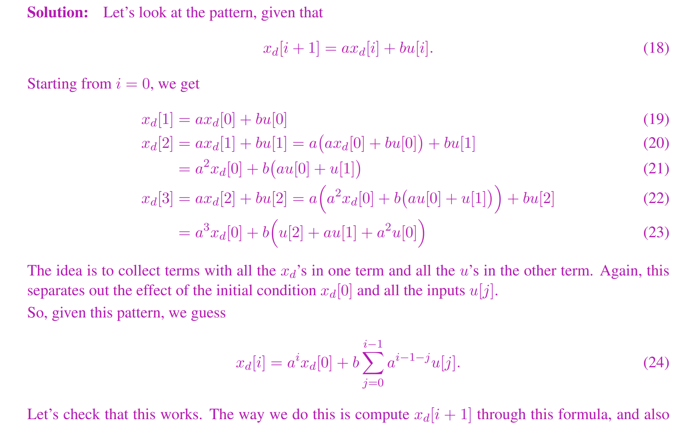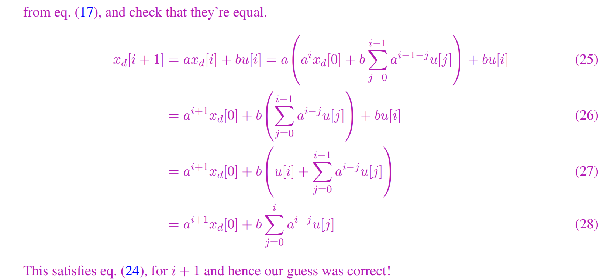因为$\Delta$很小，所以我们有$x(t)\approx x(\Delta \lfloor \frac{t}{\Delta}\rfloor)=x_d[\lfloor \frac{t}{\Delta}\rfloor]$
> 最后我们可以把$a$和$b$代入，得到:
> 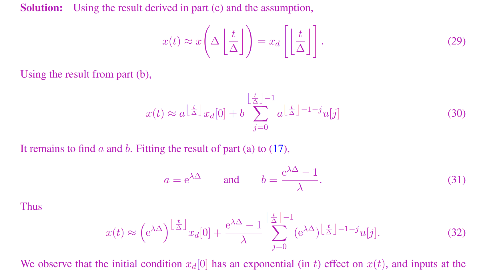

## Continuous Input
### Taking to the Limit - Approximation
> **Fall 2021 HW03 P2**
> 1. $u(t)$是一个`Piecewise Constant Function`,$u[i]$表示的是第$i+1$个长度为$\Delta$的区间上的$u(t)$的值，即$u[i]=u(\lfloor \frac{t}{\Delta}\rfloor\cdot \Delta)=u(i\Delta)$, 其中$i=\lfloor\frac{t}{\Delta}\rfloor$。
> 2. $u_c(t)$是一个连续函数, $c$表示的就是`Continuous`的意思，我们想要的就是让$\Delta \to 0$的时候$u(t)=u_c(t)$。
> 
$x(t) \approx\left(\mathrm{e}^{\lambda \Delta}\right)^{\left\lfloor\frac{t}{\Delta}\right\rfloor} x_d[0]+\frac{\mathrm{e}^{\lambda \Delta}-1}{\lambda} \sum_{j=0}^{\left\lfloor\frac{t}{\Delta}\right\rfloor-1}\left(\mathrm{e}^{\lambda \Delta}\right)^{\left\lfloor\frac{t}{\Delta}\right\rfloor-1-j} u[j]\tag{1}$
> 首先我们知道$u[j]=u_c(j\Delta)$, 所以$(1)$式变成:
> $x(t) \approx\left(\mathrm{e}^{\lambda \Delta}\right)^{\left\lfloor\frac{t}{\Delta}\right\rfloor} x_d[0]+\frac{\mathrm{e}^{\lambda \Delta}-1}{\lambda} \sum_{j=0}^{\left\lfloor\frac{t}{\Delta}\right\rfloor-1}\left(\mathrm{e}^{\lambda \Delta}\right)^{\left\lfloor\frac{t}{\Delta}\right\rfloor-1-j} u_c(j\Delta)$
> 然后就是一些在$\Delta \to 0$的时候存在的渐近关系，比如:
> 1. $n=\lfloor \frac{t}{\Delta}\rfloor\approx\frac{t}{\Delta}$, 这个估计主要是用来去掉我们的`Floor Function`。
> 2. $\lim_{\Delta \to 0}\frac{e^{\lambda \Delta}-1}{\lambda}=\frac{1+\lambda\Delta-1}{\lambda}=\Delta$, 于是我们有$\frac{e^{\lambda \Delta}-1}{\lambda}\approx \Delta$（用泰勒展开证明)。
> 
代入上面两个近似估计，$(1)$式变为:
> $\begin{aligned}x(t) &\approx\left(\mathrm{e}^{\lambda \Delta}\right)^{\frac{t}{\Delta}} x_d[0]+\frac{\mathrm{e}^{\lambda \Delta}-1}{\lambda} \sum_{j=0}^{\frac{t}{\Delta}-1}\left(\mathrm{e}^{\lambda \Delta}\right)^{\frac{t}{\Delta}-1-j} u_c(j\Delta)\\&\approx e^{\lambda t}x_d[0]+\Delta e^{\lambda t-\lambda \Delta}\sum_{j=0}^{\frac{t}{\Delta}-1}\left(\mathrm{e}^{\lambda \Delta}\right)^{-j} u_c(j\Delta)\end{aligned}$
> 最后一步就是将这个求和公式通过黎曼和近似得到一个积分表达式, 如下所示:
> 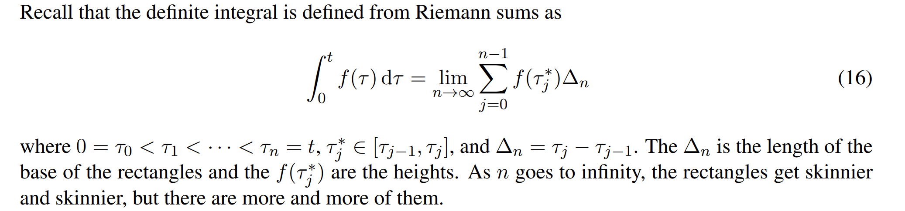
> 所以我们有如下的推导:
> $\begin{aligned}x(t) 
&\approx\left(\mathrm{e}^{\lambda \Delta}\right)^{\frac{t}{\Delta}} x_d[0]+\frac{\mathrm{e}^{\lambda \Delta}-1}{\lambda} \sum_{j=0}^{\frac{t}{\Delta}-1}\left(\mathrm{e}^{\lambda \Delta}\right)^{\frac{t}{\Delta}-1-j} u_c(j\Delta)
\\&\approx e^{\lambda t}x_d[0]+\Delta e^{\lambda t-0}\sum_{j=0}^{\frac{t}{\Delta}-1}\left(\mathrm{e}^{\lambda \Delta}\right)^{-j} u_c(j\Delta)
\\&\approx e^{\lambda t}x_d[0]+ e^{\lambda t-0}\sum_{j=0}^{\frac{t}{\Delta}-1}\left(\mathrm{e}^{-\lambda (j\Delta)}\right) u_c(j\Delta)\Delta 
\\&\approx  e^{\lambda t}x_d[0]+ e^{\lambda t-0}\int_{0}^t e^{-\lambda \tau}u_c(\tau)d\tau
\\&\approx  x_0e^{\lambda t}+ \int_{0}^t e^{\lambda (t-\ \tau)}u_c(\tau)d\tau\end{aligned}$
> 其中$e^{-\lambda (j\Delta)}$可以看成是$f(j\Delta)$，这就可以使用黎曼和的定义了。
> 所以最终我们得到了一个非常重要的结论，就是对于一个一阶线性常系数非齐次微分方程$\frac{dx(t)}{dt}=\lambda x(t)+u(t)$来说，我们有$x_c(t)=x_0e^{\lambda t}+\int_0^te^{\lambda (t-\tau)}u(\tau)d\tau$作为该方程的解，使用的是近似的方式得到的。

**Neatly Organized Solution**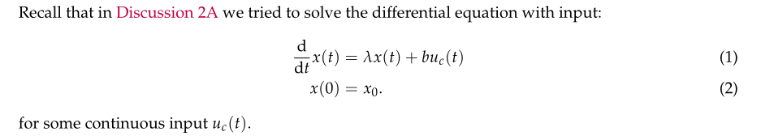

### Noise Cancellation Example
> **HW02 EECS16B P3**
> 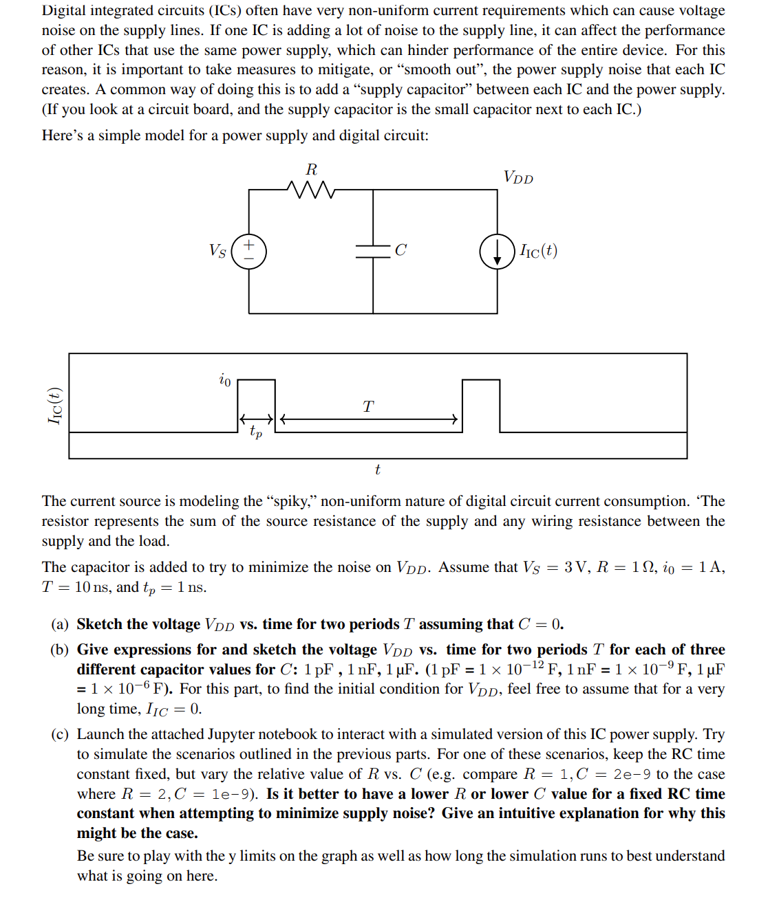

**(a) No Capacitance**因为$C=0$, 所以$I_C(t)=\frac{dV_C(t)}{dt}\times C=0A$, 所以我们可以将电容的分支电路看成是一个开路`Open Circuit`。进行简单的电路分析可知，$V_S-I_{IC}(t)\cdot R=V_{DD}$。所以:
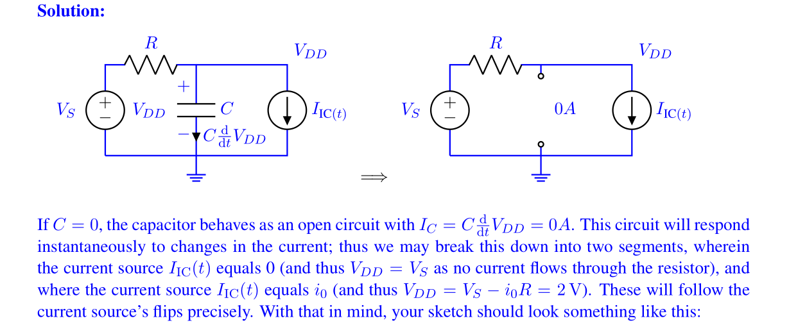
**(b) Calculation - Effect of C**首先我们进行电路分析可知：

**(b) Graphicals - Effect of RC**
**(c) Effect of R and C**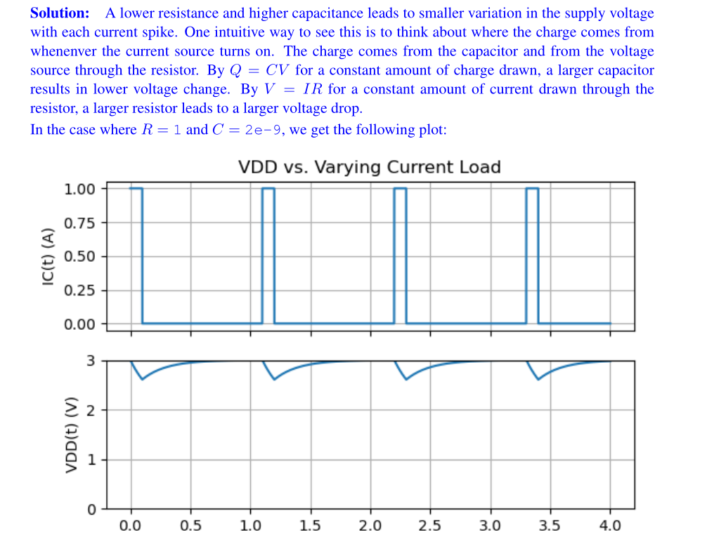
> 总的来说，本题中的电路旨在通过电容来尽可能稳定$V_{DD}$的大小。
> **有用的结论就是:**
> 1. 因为$Q=CV$，即$I(t) = \frac{dV_C(t)}{dt}\cdot C$, 所以当$I(t)$恒定时，$C$越大，则$\frac{dV_C(t)}{dt}$就越小，也就是说$V_C(t)$变化量越小，也就越能够起到消除噪声的作用。
> 2. 对于$R$来说，$V_{drop}=IR$, 如果$R$越大，则$V_{drop}$越大，也就越不能起到消除噪声的作用。
> 3. 所以在`IC`电路中，在$RC$相同的情况下，我们会倾向于选择尽可能小的$R$和尽可能大的$C$。

# Uniqueness and Existence Theorem
## 一阶齐次微分方程组
> **HW01 EECS16B P6**
> 本题涉及到一个重要的定理，就是对于一个一阶线性齐次常系数微分方程$\frac{dx(t)}{dt}=\alpha x(t)$，满足$x(0)=x_0$, 则这个微分方程的解$x(t)$存在且唯一。
> **换句话说，我们要证明**$\begin{cases} \frac{dx(t)}{dt}=\alpha x(t)\\x(0)=x_0\end{cases} \tag{1}$**的解**$x(t)$**存在且唯一。**
> 1. **存在性的证明方式:**
> 
只需要给出一个满足方程组$(1)$的$x(t)$表达式即可，我们只需要验证$x(t)=x_0e^{\alpha t}(t\geq 0)$满足即可。读者可以自行验证。
> 2. **唯一性的证明方式:**
> 
唯一性证明方式主要有两种，本题中介绍了使用`Ratio Test`的方式。`Ratio Test`的思路是，假设存在另一个解$y(t)$满足$(1)$, 则$y(t)=x(t),~~ \forall t \geq 0$，即$\frac{y(t)}{x(t)}=1,\forall t\geq 0$。注意$x(t)$的解我们知道其表达式是$x_0e^{\alpha t}$, 但是$y(t)$不是，$y(t)$虽然满足$(1)$, 但是由于它是我们假象出来的，潜在和$x(t)$相同的解，所以我们其实并不知道其表达式的具体形式。
> 下面是具体的证明步骤:
> `Ratio Test`的注意事项是，需要分类讨论，对$x(t)=0$和$x(t)\neq 0$进行分类讨论。
>    1. $x_0\neq 0$。则$\frac{d }{dt}(\frac{y(t)}{x(t)})=\frac{x(t)y'(t)-x'(t)y(t)}{x(t)^2}$, 因为$y'(t)=\alpha y(t)$, $x'(t)=\alpha x(t)$, 所以$\frac{x(t)y'(t)-x'(t)y(t)}{x(t)^2}=\frac{\alpha x(t)y(t)-\alpha x(t)y(t) }{x(t)^2}=0$，这说明$\frac{y(t)}{x(t)}=C$($C$是一个常数)，因为$\frac{y(0)}{x(0)}=\frac{x_0}{x_0}=1$, 所以$\frac{y(t)}{x(t)}=1,\forall t\geq 0$, 所以$x(t)=y(t),\forall t\geq 0$。
>    2. $x_0=0$, 即$x(t)=0$, 这种情况有些复杂，因为我们没有办法直接使用`Ratio Test`，所以为了证明$y(t)=0,\forall t\geq 0$, 我们可以采用`Proof by Contradiction`, 也就是假设$\exists t_0> 0~~s.t.~~y(t_0)\neq 0$, 然后找出矛盾。
> 
注意到$(a)$中的情况实际上已经证明了当$x_0\neq 0$时, $x(t)=y(t)=x_0e^{\alpha t}$, 所以我们试图套用这个结论。因为$y(t)$的时间线开始于$t=0$, 所以我们需要构造一个新的时间线$\tilde{y}(\tau)$使得$\tau=0$时$\tilde{y}(0)=k\neq 0$, 这样我们就可以套用结论了。但是问题是$\tau$和$t$之间有什么关系呢?
> 因为$y(t_0)=k\neq 0$, 所以我们希望$\tau=0$时$t=t_0$, 所以一种方法是令$t=t_0+\tau$, 此时因为$t\in [0,\infty)$, 所以$\tau\in [-t_0,\infty)$。我们有$\tilde{y}(\tau)=y(t_0+\tau)$, 即$\frac{d\tilde{y}(\tau)}{d\tau}=\frac{dy(t_0+\tau)}{d\tau}=\alpha y(t_0+\tau)\cdot \frac{d(t_0+\tau)}{d\tau}=\alpha y(t_0+\tau)=\alpha \tilde{y}(\tau)$, 且这个式子，满足$(a)$中的条件， 所以$\tilde{y}(\tau)=k e^{\alpha \tau}$, 于是$y(t)=y(t_0+\tau)=ke^{\alpha(t-t_0)}$($0\leq t\leq t_0$), 然后我们令$t=0$可得$y(0)=ke^{-t_0}\neq 0$, 这和我们假设的$y(0)=0$矛盾， 所以$y(t)=0~~\forall t>0$。
> 下面是完整的题目:

**Problem Setting**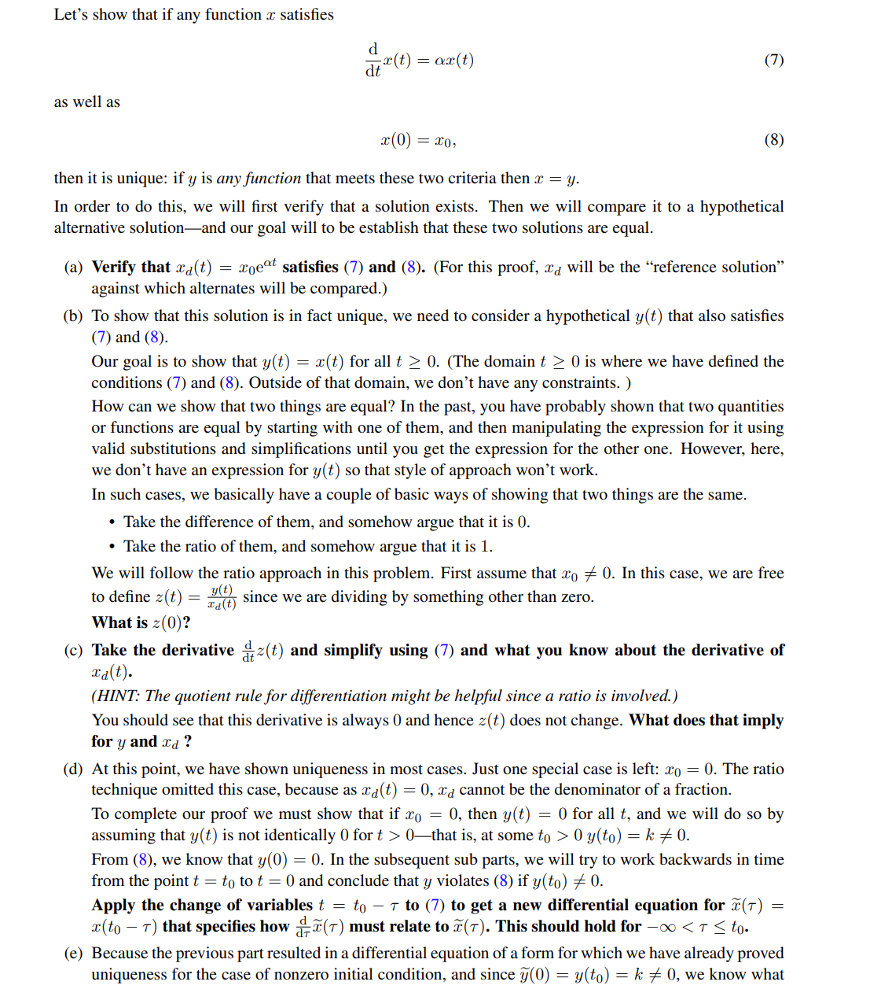
**(a)**
**(b)**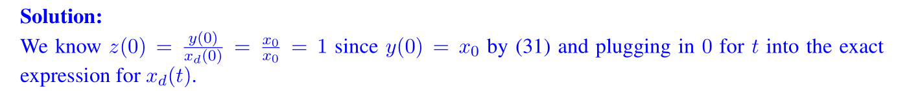
**(c)**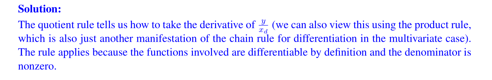
**(d) Change of Variable**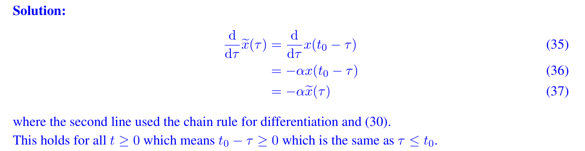
**(e) **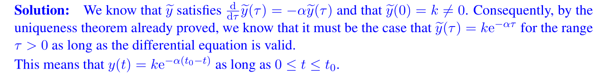
**(f) **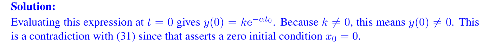
**(g) Why Uniqueness Theorem is important**
> **Neat Version from Sp23:**
> 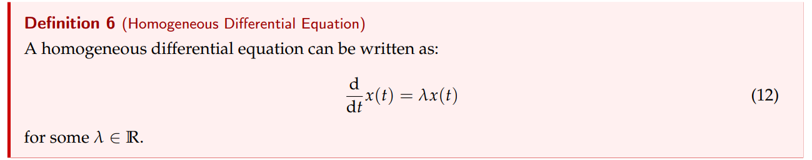
> **如何证明唯一性(使用**`**Ratio Test**`**):**
> 假设$y(t)$也满足$\begin{cases} x(0)=x_0\\ \frac{d}{dt}x(t)=\lambda\cdot x(t) \end{cases}$  则我们要证明$\frac{y(t)}{x(t)}=1$或者$y(t)-x(t)=0$
> 已知$x(t)=x_0e^{\lambda t}$, 则$\frac{d}{dt}(\frac{y(t)}{x(t)})=\frac{d}{dt}(\frac{y(t)}{x_0e^{\lambda t}})=\frac{1}{x_0}\frac{d}{dt}(y(t)e^{-\lambda t})$
> $\begin{aligned} \frac{1}{x_0}\frac{d}{dt}(y(t)e^{-\lambda t}) &=\frac{1}{x_0}(\frac{d}{dt}y(t)\cdot e^{-\lambda t}+y(t)\cdot (-\lambda)e^{-\lambda t}) \\&=\frac{1}{x_0}(\lambda y(t)\cdot e^{-\lambda t}-\lambda y(t)\cdot e^{-\lambda t}) \\&=0\end{aligned}$
> 所以$\frac{d}{dt}(\frac{y(t)}{x(t)})=0$, 得到$\frac{y(t)}{x(t)}=a$(a是一个常数)。
> 因为$y(0)=x(0)=x_0$, 所以$a=1$, 所以$\frac{y(t)}{x(t)}=1$, 证毕。

## 一阶非齐次微分方程组
> **HW02 EECS16B P1**
> 本题旨在探究对于一阶非齐次线性常系数微分方程的解的唯一性，对于:
> $\begin{cases}\frac{d}{dt}x(t)=\lambda x(t)+bu(t)\\x(0)=x_0 \end{cases} \tag{1}$
> **我们要证明解的存在性和唯一性:**
> 1. **存在性的证明**
> 
对于这种方程来说，我们最常使用的方法是上一小节中的`Integrating Factor Method`, 通解的形式是$x_c(t)=x_0e^{\lambda t}+b\int _0^t u(\tau)e^{\lambda (t-\tau)} d\tau$, 我们带入验证即可：
> $\begin{aligned}\frac{\mathrm{d}}{\mathrm{d} t} x_c(t) & =\lambda x_0 \mathrm{e}^{\lambda t}+\lambda b \mathrm{e}^{\lambda t} \int_0^t u(\tau) \mathrm{e}^{-\lambda \tau} \mathrm{d} \tau+b\mathrm{e}^{\lambda t} \frac{\mathrm{d}}{\mathrm{d} t} \int_0^t u(\tau) \mathrm{e}^{-\lambda \tau} \mathrm{d} \tau \\& =\lambda x_c(t)+b\mathrm{e}^{\lambda t} \frac{\mathrm{d}}{\mathrm{d} t} \int_0^t u(\tau) \mathrm{e}^{-\lambda \tau} \mathrm{d} \tau \\& =\lambda x_c(t)+b\mathrm{e}^{\lambda t} u(t) \mathrm{e}^{-\lambda t} \\& =\lambda x_c(t)+bu(t)\end{aligned}$
> 2. **唯一性的证明**
> 
唯一性的证明本题中我们采用`Difference Method`, 采用两步走的思路，先求初值条件，然后再求变化情况:
> $\begin{aligned}z(0) & =y(0)-x_g(0) \\& =x_0-x_0 \\& =0 .\end{aligned}$ 
> $\begin{aligned}\frac{\mathrm{d}}{\mathrm{d} t} z(t) & =\frac{\mathrm{d}}{\mathrm{d} t} y(t)-\frac{\mathrm{d}}{\mathrm{d} t} x_g(t) \\& =\lambda y(t)+u(t)-\left(\lambda x_g(t)+u(t)\right) \\& =\lambda\left(y(t)-x_g(t)\right)+(u(t)-u(t)) \\& =\lambda z(t)\end{aligned}$ 
> 如果我们使用`Difference Method`我们就不用分类讨论$x(t)=0$与否。
> 3. `**Exponential Input**`
> 
假设我们的输入是 $u(t)=\mathrm{e}^{s t}$($s\neq \lambda$). 我们面对的微分方程就是:
> $\frac{\mathrm{d}}{\mathrm{d} t} x(t)=\lambda x(t)+\mathrm{e}^{s t}$   
> 结合存在性中的公式我们有:
> $\begin{aligned}x_c(t) & =x_0 \mathrm{e}^{\lambda t}+\int_0^t \mathrm{e}^{s \tau} \mathrm{e}^{\lambda(t-\tau)} \mathrm{d} \tau \\& =x_0 \mathrm{e}^{\lambda t}+\mathrm{e}^{\lambda t} \int_0^t \mathrm{e}^{\tau(s-\lambda)} \mathrm{d} \tau \\& =x_0 \mathrm{e}^{\lambda t}+\mathrm{e}^{\lambda t}\left[\left.\frac{1}{s-\lambda} \mathrm{e}^{(s-\lambda) \tau}\right|_{\tau=0} ^{\tau=t}\right] \\& =x_0 \mathrm{e}^{\lambda t}+\mathrm{e}^{\lambda t}\left[\frac{1}{s-\lambda} \mathrm{e}^{(s-\lambda) t}-\frac{1}{s-\lambda} \mathrm{e}^{(s-\lambda) 0}\right] \\& =x_0 \mathrm{e}^{\lambda t}+\mathrm{e}^{\lambda t}\left[\frac{1}{s-\lambda} \mathrm{e}^{(s-\lambda) t}-\frac{1}{s-\lambda}\right] \\& =x_0 \mathrm{e}^{\lambda t}+\mathrm{e}^{\lambda t} \frac{1}{s-\lambda} \mathrm{e}^{(s-\lambda) t}-\mathrm{e}^{\lambda t} \frac{1}{s-\lambda} \\& =x_0 \mathrm{e}^{\lambda t}+\frac{1}{s-\lambda} \mathrm{e}^{s t}-\frac{1}{s-\lambda} \mathrm{e}^{\lambda t} \\& =\left(x_0-\frac{1}{s-\lambda}\right) \mathrm{e}^{\lambda t}+\frac{\mathrm{e}^{s t}}{s-\lambda}\end{aligned}$
> 所以 $x_c(t)=\left(x_0-\frac{1}{s-\lambda}\right) \mathrm{e}^{\lambda t}+\frac{\mathrm{e}^{s t}}{s-\lambda}$, 这是对`Fa21 Note 5`的预热。

**Problem Settings**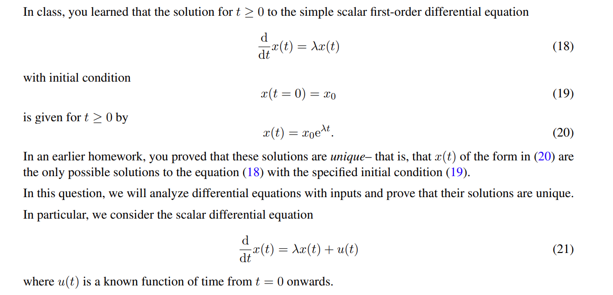
**(a) Proof of Uniqueness with Difference**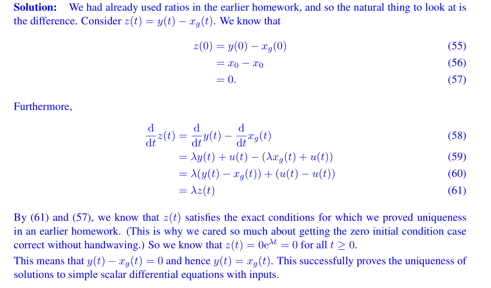
**(b) Proof of Validity of the Solution - Integrating Factors**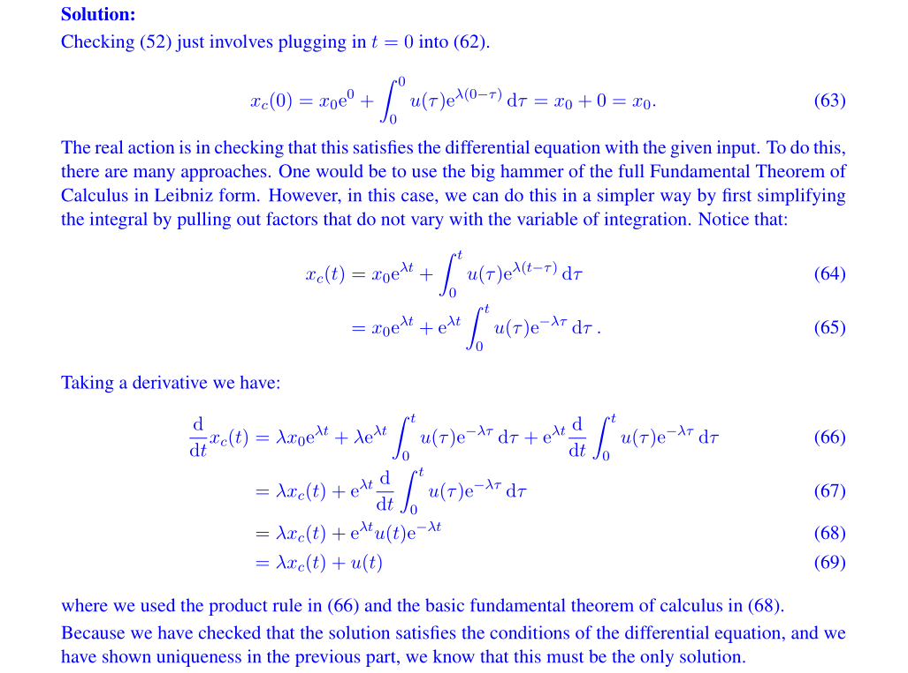
**(c) Particular Case I**
**(d) Particular Case II**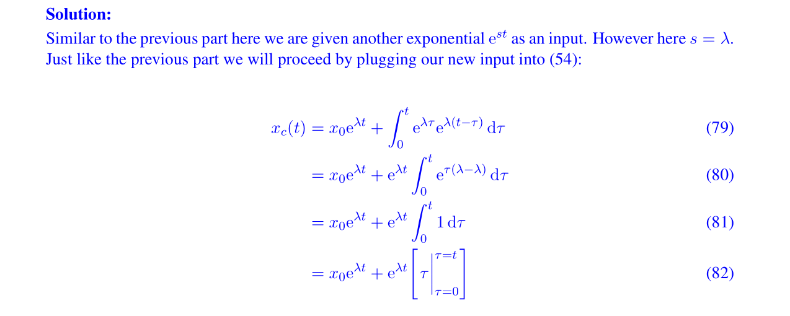

## 唯一性的充分条件 - NonLinear DE
> **HW02 EECS16B P2**
> **本题中的一个重要的定理是:**
> 对于一个`Autonomous Differential Equation`$\frac{dx(t)}{dt}=f(x(t))$来说，如果$f(x)$是`**Continuously Differentiable**`**(对于**$x$**来说)且有界**的话：
> 1. $\frac{d}{dx}f(x)$存在且在$x(t), t\in [a,b]$上**连续且有界**，则微分方程在$[a,b]$上有唯一解。
> 2. 反之不一定成立，也就是充分条件。

**Problem Settings**
**(a)**
**(b)**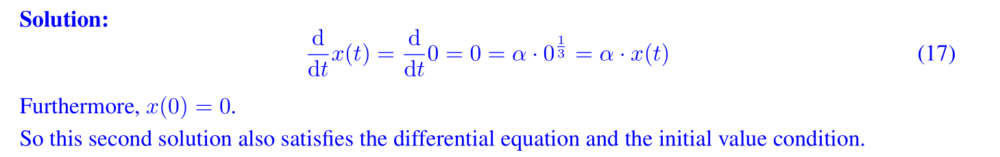
**(c)**
**(d) Sufficient Condition for Uniqueness of the Solution**
**(e)**
也就是说因为$x(0)=0$, 所以我们在除以$x$时左侧积分$\int x^{-\frac{1}{3}}dx$可能$\to \infty$, 因为$x\to0$时$x^{-\frac{1}{3}}\to \infty$。
**(f)**

