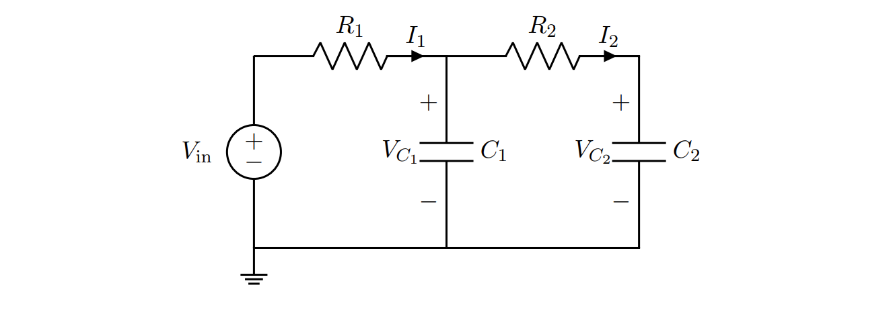
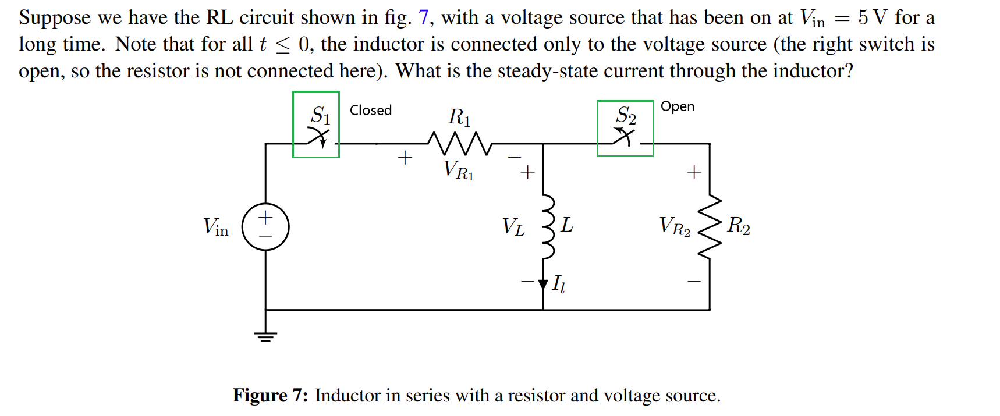
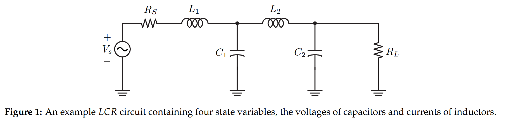
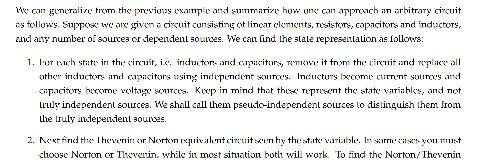
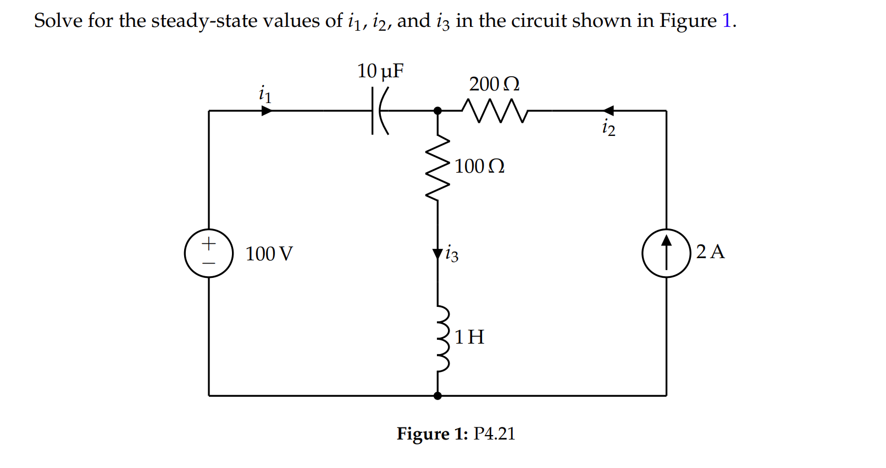
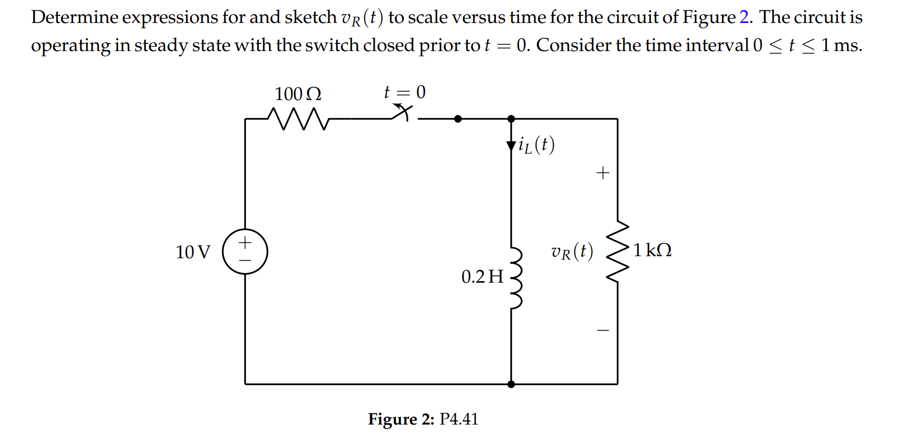
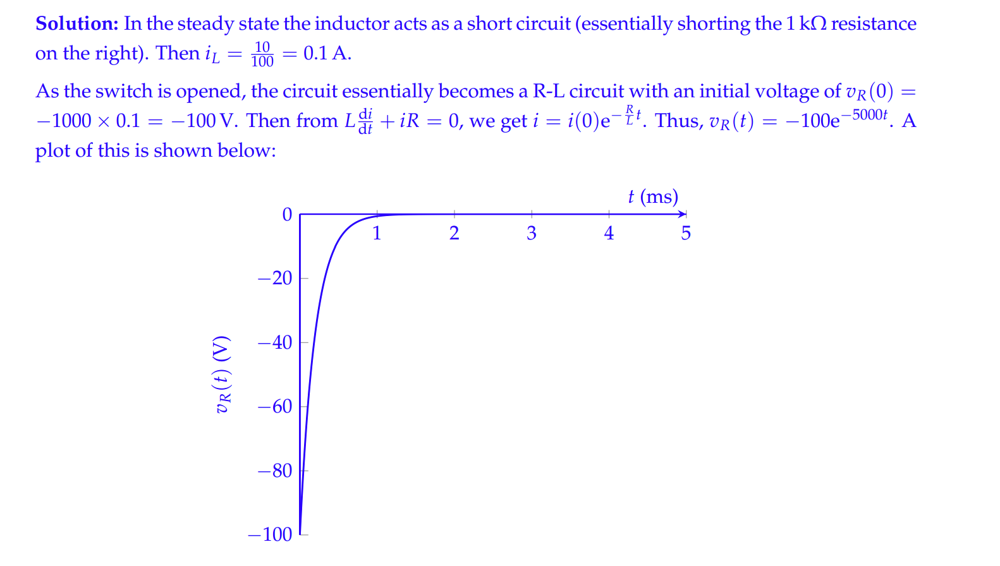

# Initial Conditions for Circuits
## RCRC Circuits
> 
> 对于这个电路来说，假设$V_{in}=C$($C$是一个常数)已经过来非常长的时间且电路已经达到了稳定的状态，则因为电路稳定，所以电容两端的电压不发生变化，根据$I_1=\frac{dV_{C_1}}{dt}\cdot C_1$, $I_2=\frac{dV_{C_2}}{dt}\cdot C_2$，此时$I_1=I_2=0$, 所以$V_{C_1}=V_{C_2}=C$。

## RL Circuit
> 
> 对于这个电路来说，假设$V_{in}=C$($C$是一个常数)已经过来非常长的时间且电路已经达到了稳定的状态，则因为电路稳定，所以电导两端的电流不发生变化，根据$V_L=\frac{dI_L(t)}{dt}\cdot L$这个公式，则$V_L=0V$且电流恒定。而电压为零电流恒定的电子原件是导线，所以此时$I_1=\frac{V_{in}}{R_1}$。
> 如果没有$R_1$，则根据$V_L=\frac{dI_L(t)}{dt}\cdot L$, 两边求积分可得$I_L(t)=\frac{V_L\cdot t}{L}$(如果$V_L$是常数的话)，此时$I_L$就会`Increase without bound`。

## 总结
> 综上所述，我们知道快速计算一个`RCRC/RL`电路的稳定状态的方法就是将任何会变化的量固定下来，然后再对电路进行分析。

# State Space Representation
## State of a Circuit
> 电路中不是所有的电子原件都是有状态的:
> 1. 所有的`Dependent Sources`和电阻都是无状态的，换句话说，他们都是无记忆性的。
> 2. 所有的`Capacitors`和`Inductors`都是有状态的，`Capacitor`在某一时刻的状态用$V_{C_i}(t)$表示，`Inductor`的状态用$I_{L_i}(t)$表示。
> 
所以如果一个电路中有$n$个电容和$m$个电导，我们的电路状态就是一个长为$m+n$的向量:
> $\vec{x}(t)=\left[\begin{array}{llllllll}V_{C_1}(t) & V_{C_2}(t) & \cdots & V_{C_n}(t) & I_{L_1}(t) & I_{L_2}(t) & \cdots & I_{L_m}(t)\end{array}\right]^{\top}$
> 对于任意一个这样的`LCR`, 我们进行`Circuit Analysis`的最终目的是为了得到一个向量微分方程组:
> $\frac{\mathrm{d}}{\mathrm{d} t} \vec{x}(t)=\mathbf{A} \vec{x}(t)+\mathbf{B} \vec{b}_s$
> 其中$\vec{b}_s$包含了所有的`Independent Sources`，这里$\mathbf{A}\in (n+m)\times (n+m)$, $\mathbf{B}\in (n+m)\times k$。

## Analyzing Procedures
> **对于下面的**`**LCR**`**电路来说，我们有四个状态量，分别是**$I_{L_1}, I_{L_2}, V_{C_1}, V_{C_2}$**:**
> 
> 对于这个电路来说，我们期望得到的是如下的一些表达式:
> $$\begin{aligned}\frac{dV_{C_1}}{dt}&=A_{11}V_{C_1}+A_{12}V_{C_2}+A_{13}I_{L_1}+A_{14}I_{L_2}+B_{11}V_s\\
\frac{dV_{C_2}}{dt}&=A_{21}V_{C_1}+A_{22}V_{C_2}+A_{23}I_{L_1}+A_{24}I_{L_2}+B_{21}V_s\\\
\frac{dI_{L_1}}{dt}&=A_{31}V_{C_1}+A_{32}V_{C_2}+A_{33}I_{L_1}+A_{34}I_{L_2}+B_{31}V_s\\\
\frac{dI_{L_2}}{dt}&=A_{41}V_{C_1}+A_{42}V_{C_2}+A_{43}I_{L_1}+A_{44}I_{L_2}+B_{41}V_s\end{aligned}$$
> **下面我们来依次求出这些系数:**
> 1. 电容$C_1$: $C_1\frac{dV_{C_1}}{dt}=I_{L_1}-I_{L_2}$, 所以$A_{11}=A_{12}=B_{11}=0$, $A_{13}=\frac{1}{C_1}$, $A_{14}=-\frac{1}{C_1}$
> 2. 电容$C_2$: $C_2\frac{dV_{C_2}}{dt}=I_{L_2}-\frac{V_{C_2}}{R_L}$, 所以$A_{21}=A_{23}=B_{21}=0$, $A_{22}=-\frac{1}{R_LC_2}$, $A_{24}=\frac{1}{C_2}$
> 3. 电导$L_1$: $L_1\frac{dI_{L_1}}{dt}+V_{C_1}+I_{L_1}R_s=V_s$, 所以$A_{32}=A_{34}=0$,$A_{31}=-\frac{1}{L_1}$, $A_{33}=-\frac{R_S}{L_1}$, $B_{31}=\frac{1}{L_1}$。
> 4. 电导$L_2$: $L_2\frac{dI_{L_2}}{dt}=V_{C_1}-V_{C_2}$, 所以$A_{41}=\frac{1}{L_2}$, $A_{42}=-\frac{1}{L_2}$, $A_{43}=A_{44}=B_{41}=0$。
> 
**所以最终我们的**`**Vector DE**`**是:**
> $A=\left[\begin{array}{cccc}0 & 0 & \frac{1}{C_1} & -\frac{1}{C_1} \\0 & -\frac{1}{R_L C_2} & 0 & \frac{1}{C_2} \\-\frac{1}{L_1} & 0 & -\frac{R_S}{L_1} & 0 \\\frac{1}{L_2} & -\frac{1}{L_2} & 0 & 0\end{array}\right]$, $B=\left[\begin{array}{llll}0 & 0 & \frac{1}{L_1} & 0\end{array}\right]^{\top} V_s$

## Summary
> 

# Steady State Analysis
## General Procedure
> 在`Steady State`时:
> 1. 可以将电容看作是`Open Circuit`, 因为$I_C(t)=\frac{dV_C(t)}{dt}\times C$, 而在`Steady State`下，$V_C(t)$不变，所以$I_C(t)=0$。
> 2. 可以将电导看作是`Wire`, 因为$V_C(t)=\frac{dI_C(t)}{dt}\times L$, 而在`Steady State`下，$I_C(t)$不变，所以$V_C(t)=0$。

## Examples
### Example 1: Steady State
> **HW02 Fa21 P5**
> 

### Example 2: Voltage⭐⭐⭐⭐⭐
> **HW02 Fa21 P6**
> 
> 本题易错，主要是关于电流方向的问题。
> 

