# RC Circuit - Energy Disspation⭐⭐⭐⭐⭐
> **HW01 Sp23 P2~P6**
> **计算一个电容的两端的：**
> 1. 电压随时间变化的曲线: $V_C(t) = V_C(0)+\int_0^t\frac{I(t')}{C}dt'$。
> 2. `Power`随时间变化的曲线: 如果我们有$I(t)$和$V_C(t)$的图像，则$C_C(t)$的图像也就呼之欲出了，就只需要把$I(t)$和$V_C(t)$的图像`Pointwise`相乘即可。
> 3. `Stored Energy`: 
>    1. 对于**某一时刻电容**储存的能量，我们可以永远相信$E_C(t)=\frac{1}{2}C(V_C(t))^2$。
>    2. 一般而言对于**稳定状态下的电子元件**储存的能量我们可以使用$E(t)=\int_0^{\infty} V(t)I(t)dt$进行积分求解。

## Capacitor I
> 

**Voltage**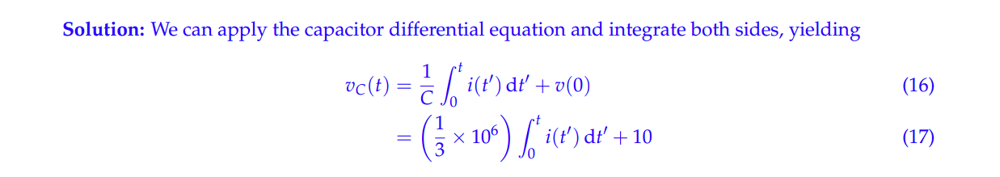
首先注意这里的$\int_{0}^t i(t')dt'$的单位是$mA\cdot ms$, 所以在将$100$和$-100$带入求积分之后我们需要对得到的值乘以$10^{-3}\times 10^{-3}=10^{-6}$, 所以图像的斜率应该是$\frac{1}{3}\times 10^6\times 100\times 10^{-3}\times 10^{-3}=33.3$。

**Power**$V_C(t)=10+33.3t$, $I_C(t)=\begin{cases} 0.1A&0~s<t<0.001~s\\-0.1A&0.001s<t<0.002s\end{cases}$
所以$W_C(t)=V_C(t)I_C(t)=(10+33.3t)I_C(t)=\begin{cases} 1+3.33t&0~s<t<0.001~s\\-1-3.33t&0.001s<t<0.002s\end{cases}$

**Stored Energy**

## Capacitor II
> 

**Solution (a)**$\begin{aligned}100V-\frac{dV_C(t)}{dt}\cdot CR&=V_C(t)\\\frac{dV_C(t)}{dt}&=-\frac{1}{CR}V_C(t)+\frac{100}{CR}\end{aligned}$
所以$V_C(t)=100(1-e^{-\frac{t}{10^{-3}}})$
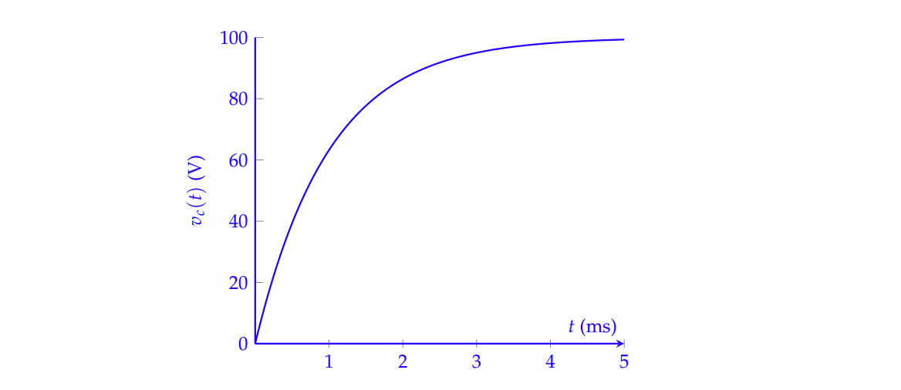
> 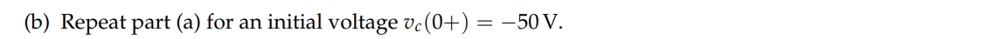

**Solution (b)**

## Capacitor III
> 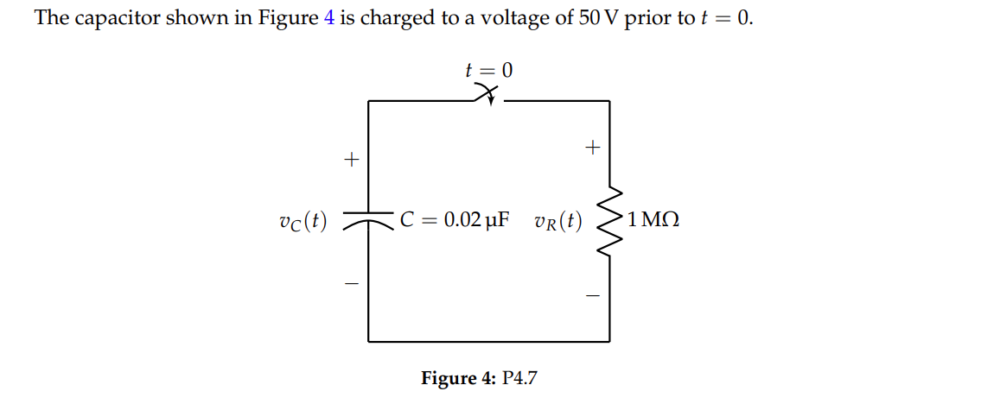

**Solution**根据`KVL`定律我们有$V_C(t)-V_R(t)=0$
电流方向是从电容的正极流向负极，所以$V_R(t)=-I_C(t)R$
因为$I_C(t)=\frac{dV_C(t)}{dt}\cdot C$, 所以$V_C(t)+\frac{dV_C(t)}{dt}\cdot CR=0$。
所以$\frac{dV_C(t)}{dt}=-\frac{1}{CR}V_C(t)$, 这里$CR=0.02\times 10^{-6}\cdot 1\times 10^6=0.02$。
所以$\frac{dV_C(t)}{dt}=-\frac{1}{0.02}V_C(t)$, 得到$V_C(t)=V_C(0)e^{-\frac{1}{0.02}t}=50e^{-\frac{t}{0.02}}$
综合来看，我们有: $V_C(t)=\begin{cases} 50&t\leq0\\ 50e^{-\frac{t}{0.02}}&t>0\end{cases}$, $V_R(t)=\begin{cases} 50&t\leq0\\ 50e^{-\frac{t}{0.02}}&t>0\end{cases}$
> 

**Solution**$I_C(t)=\frac{dV_C(t)}{dt}\cdot C=\begin{cases}0&t\leq 0\\-2500e^{-50t}&t>0 \end{cases}\times 0.02\times 10^{-6}=\begin{cases} 0&t\leq 0\\-50e^{-50t}\times 10^{-6}&t>0\end{cases}$
$\begin{aligned}W_R(t)&=V_R(t)\cdot (-I_C(t))\\&=\begin{cases} 50&t\leq0\\ 50e^{-\frac{t}{0.02}}&t>0\end{cases}\times (-\begin{cases} 0&t\leq 0\\-5e^{-50t}\times 10^{-6}&t>0\end{cases})\\&=\begin{cases}0&t\leq 0\\2500e^{-100t}\times 10^{-6}&t>0 \end{cases}=\begin{cases}0&t\leq 0\\2.5e^{-100t}\times 10^{-3}&t>0 \end{cases}\end{aligned}$
> 

**Solution**本题主要运用公式即可，因为这个电路中电容和电阻的能量总和一定是零（一个产生能量，一个消耗能量），所以我们可以求$\int_0^{\infty}V_C(t)I_C(t)dt$和$\int_0^{\infty}V_R(t)I_R(t)dt$中的任意一个都可以。
$\begin{aligned}\int_0^{\infty}V_R(t)I_R(t)dt&=\int_0^{\infty}50e^{-50t}\times -2500e^{-50t}\times 0.02\times 10^{-6}dt\\&=2.5\times 10^{-3}\times (-\frac{1}{100}e^{-100t}\big|_0^{\infty})\\&=25\times 10^{-6}\\&=25uJ\end{aligned}$
> 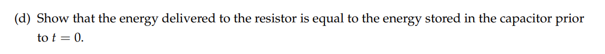

**Solution**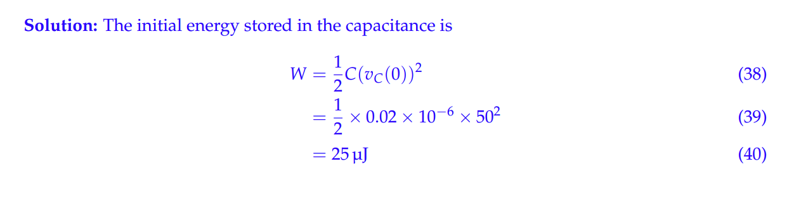
可以发现，电容中储存的能量最终都流向了电阻。

## Capacitor IV
> **EECS16B sp23 HW1 P4**
> 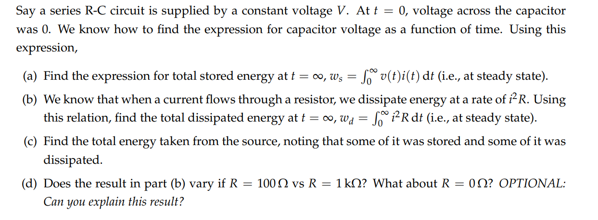

**Solution (a)**假设$v(t)$是电容两端的电压，$V$是电压源的电压则我们根据`RC`电路微分方程可知，$\frac{dv(t)}{dt}+\frac{v(t)}{RC}=\frac{V}{RC}$, 其解为$v(t)=V(1-e^{-\frac{t}{RC}}),t\geq 0$, 所以$\frac{dv(t)}{dt}=(-\frac{1}{RC})\cdot (-e^{-\frac{t}{RC}})=\frac{1}{RC}e^{-\frac{t}{RC}}$
于是根据能量公式: 
$\begin{aligned}w_s&=\int_0^{\infty}v(t)i(t)dt\\&=\int_0^{\infty}v(t)\cdot\frac{dv(t)}{dt}Cdt\\&=C\int_0^{\infty}V(1-e^{-\frac{t}{RC}})\frac{d(V(1-e^{-\frac{t}{RC}}))}{dt}dt\\&=C\int_0^{\infty}V(1-e^{-\frac{t}{RC}})\frac{V}{RC}e^{-\frac{t}{RC}}dt\\&=\frac{CV^2}{RC}\int_0^{\infty}(1-e^{-\frac{t}{RC}})e^{-\frac{t}{RC}}dt\\&=\frac{CV^2}{RC}(-RC)(-1+\frac{1}{2})\\&=\frac{1}{2}CV^2\end{aligned}$
**Solution (b)**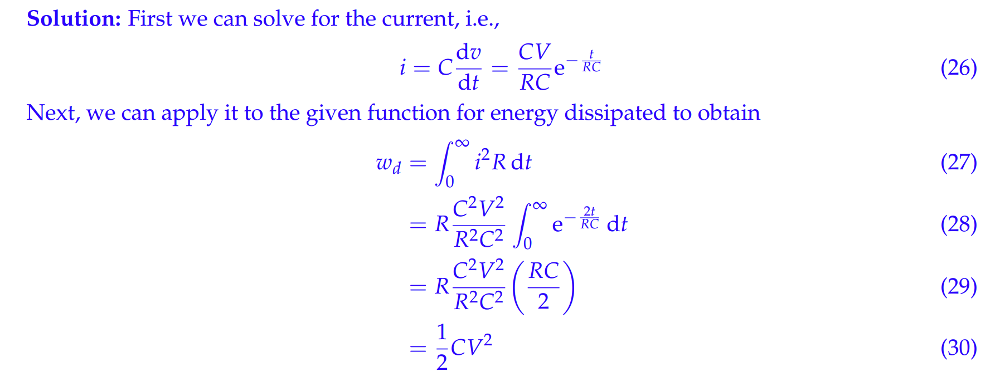
**Solution (c)**
**Solution (d)**

## Integrating Factors
> 
> 对于一个一阶线性常系数非齐次微分方程$\dot{x}(t)+kx(t)=p(t)$来说，我们使用`Integrating Factor`来求解，步骤为:
> 1. 求解`Integrating Factor`: $u(t)=e^{\int kdt}=e^{kt}$。
> 2. 求解$\int p(t)u(t)dt$, 本题中为求解$\int e^{\frac{t}{RC}}\frac{t}{RC}dt$, 我们使用$uv-\int udv = \int vdu$公式。
> 3. 解为$x(t)=\frac{\int p(t)u(t)dt}{u(t)}$。

**Solution**

# Transistor Logics
## Equivalent Circuit
> **HW02 Sp23 P4**
> 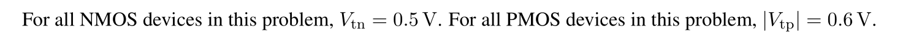

**(a) NMOS**
**(b) PMOS**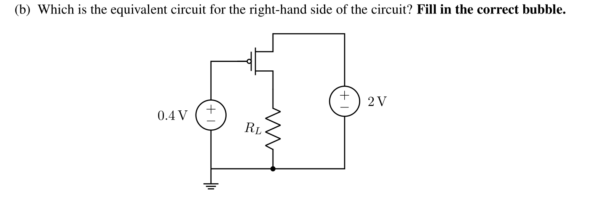
**(c) CMOS**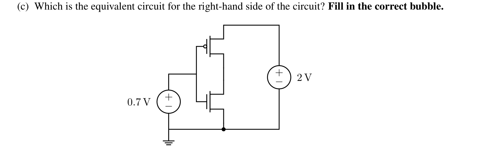

## Cascading Circuit
> **HW01 Fa21 P7**
> 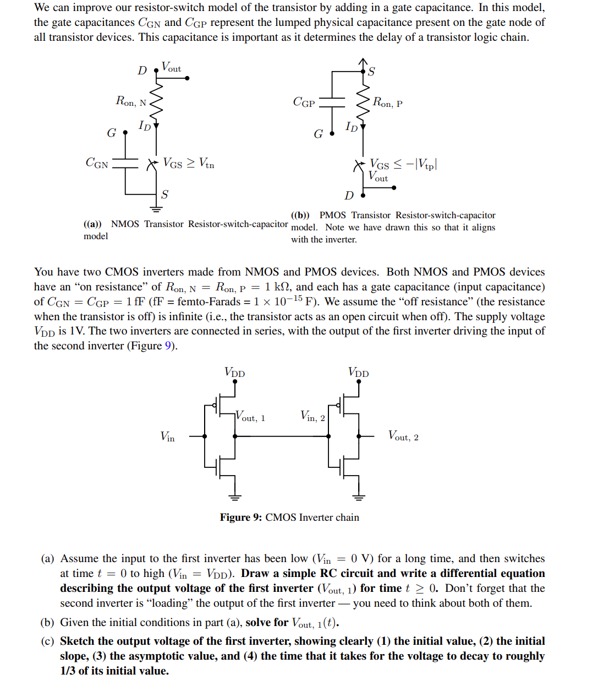

**(a)**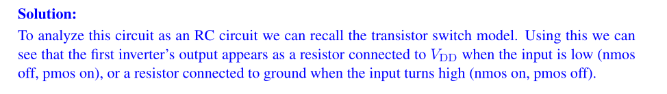
**(b)**
**(c)**
**(d)**

# Complex Number
> 

**Solution**

# Classification of Sinusoids
## Orthogonality
> **HW01 Fa21 P5**
> 

## Sinusoidal Projection
> **HW01 Fa21 P5**
> 

# 微分方程解的存在性与唯一性
## 一阶齐次微分方程组
> **HW01 EECS16B P6**
> 

**(a)**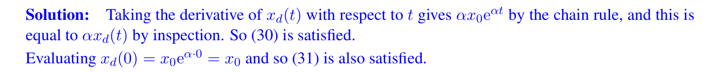
**(b)**
**(c)**
**(d) Change of Variable**
**(e) **
**(f) **
**(g) Why Uniqueness Theorem is important**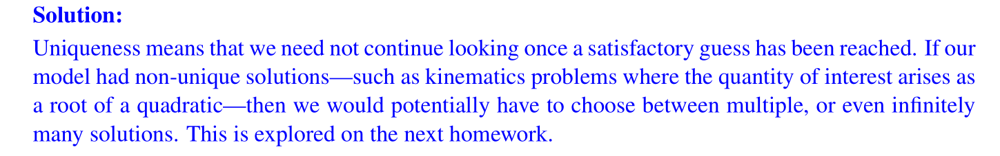

## 唯一性的充分条件 - NonLinear DE
> **HW02 EECS16B P2**
> 

**(a)**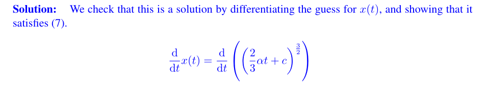
**(b)**
**(c)**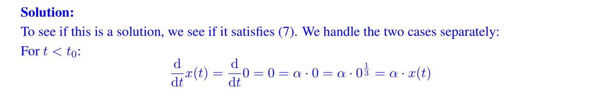
**(d) Sufficient Condition for Uniqueness of the Solution**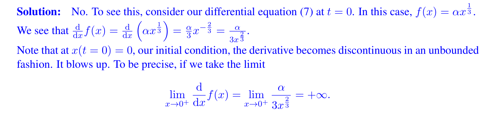
**(e)**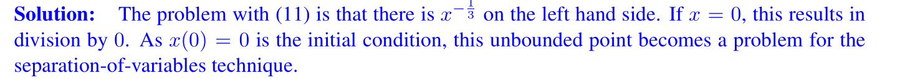
**(f)**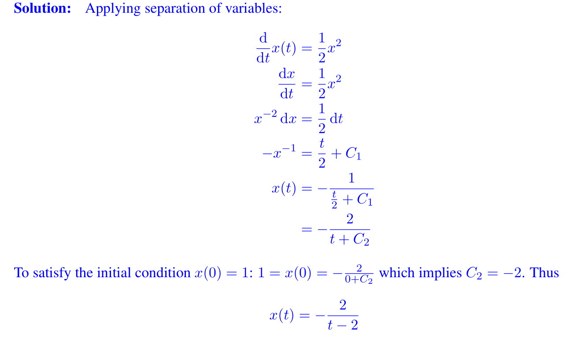
> **本题中的一个重要的定理是:**
> 对于一个`Autonomous Differential Equation`$\frac{dx(t)}{dt}=f(x(t))$来说，如果$x(t)$是`**Continuously Differentiable**`且**有界**的话，那么这个微分方程存在唯一解，反之不一定成立，也就是充分条件。

## 一阶非齐次微分方程组
> 

**(a) Proof of Uniqueness with Difference**
**(b) Proof of Validity of the Solution - Integrating Factors**
**(c) Particular Case I**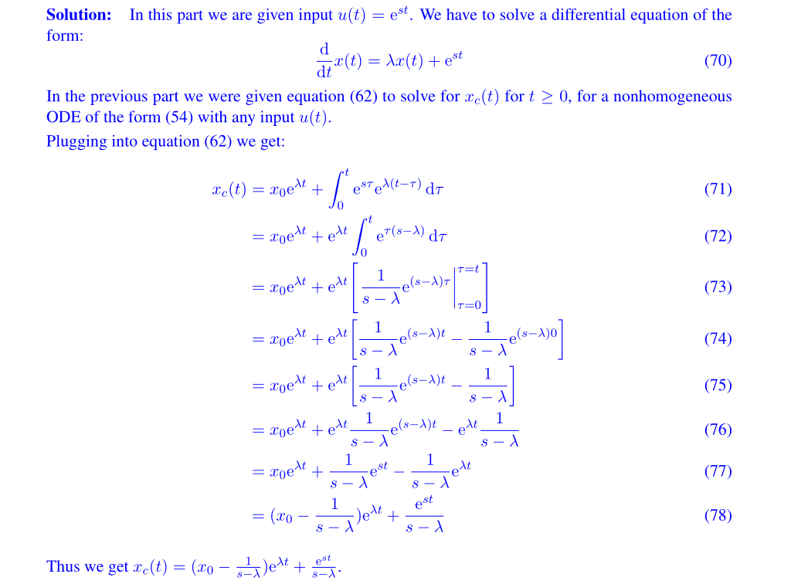
**(d) Particular Case II**

# Digital Integrated Circuits
## Noise Cancellation
> **HW02 EECS16B P3**
> 

**(a) No Capacitance**因为$C=0$, 所以$I_C(t)=\frac{dV_C(t)}{dt}\times C=0A$, 所以我们可以将电容的分支电路看成是一个开路`Open Circuit`。进行简单的电路分析可知，$V_S-I_{IC}(t)\cdot R=V_{DD}$。所以:

**(b) Calculation - Effect of C**首先我们进行电路分析可知：
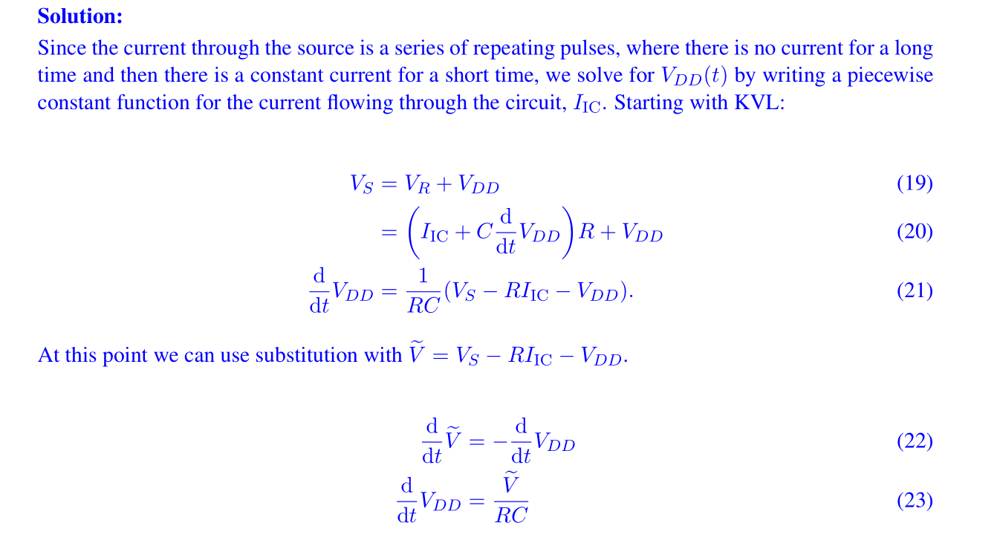
**(b) Graphicals **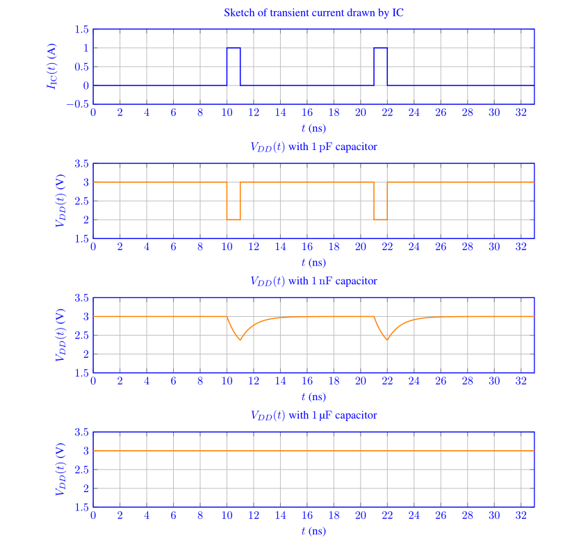
**(c) Effect of R and C**
> 总的来说，本题中的电路旨在通过电容来尽可能稳定$V_{DD}$的大小。
> **有用的结论就是:**
> 1. 因为$Q=CV$，即$I(t) = \frac{dV_C(t)}{dt}\cdot C$, 所以当$I(t)$恒定时，$C$越大，则$\frac{dV_C(t)}{dt}$就越小，也就是说$V_C(t)$变化量越小，也就越能够起到消除噪声的作用。
> 2. 对于$R$来说，$V_{drop}=IR$, 如果$R$越大，则$V_{drop}$越大，也就越不能起到消除噪声的作用。
> 3. 所以在`IC`电路中，在$RC$相同的情况下，我们会倾向于选择尽可能小的$R$和尽可能大的$C$。

## Op-Amp Stability
> 

**(a) OpAmp Circuit in Detail**
**(b) OpAmp Differential Equation - Negative Feedback Loop**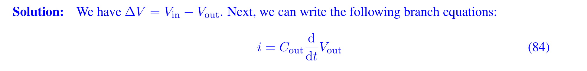
**(c) OpAmp Differential Equation - Positive Feedback Loop**
**(d) Limiting Behaviors**
**(e) Vector Differential Equations**
> **本题要注意:**
> 在画一个`Detailed OpAmp`电路的时候，左侧的`Terminal`和`OpAmp`本体之间永远是`Open Circuit`, 无论有没有`Feedback Loop`, 左侧的$V_+$和$V_-$端都是裸露在电路之外的。如下图中的的绿色端，电流都是零，流经`Feeback Loop`的电流也是零。
> 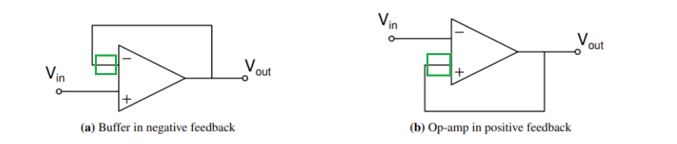
> 即$(a)$中的输入端是$V_{in}-V_{out}$, $(b)$中的输入端是$V_{out}-V_{in}$。

# ADC&DAC
## Digital-Analog Converter(DAC)
> **From EECS16A**
> 本质上说，`DAC`就是将数字转化为电压。
> 

**Solution 1 - Using Circuit Equivalence**
**Solution 2 - Using Circuit Analysis or Superposition**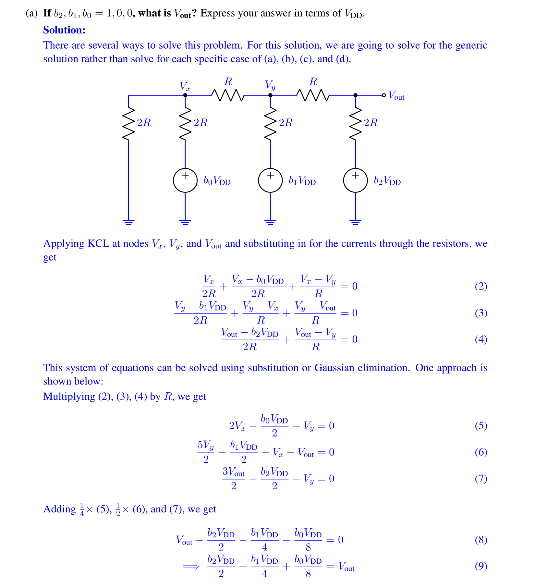
> 总的来说，使用`Superposition`可以更简单方便地得到$V_{out}$的结果和$V_s$之间的关系。
> 对于一个`DAC Circuit`来说，从左到右是`LSB`到`MSB`，令其为$b_0,b_1,b_2$, 则:
> 1. $b_0,b_1,b_2=0,0,1$时，$V_{out}=\frac{V_s}{2}$。
> 2. $b_0,b_1,b_2=0,1,0$时，$V_{out}=\frac{V_s}{4}$。
> 3. $b_0,b_1,b_2=1,0,0$时，$V_{out}=\frac{V_s}{8}$。
> 
**其余所有的情况，都是上面的线性组合，对应的就是**`**Superposition**`**的原则:**
> 1. 一个`N-bit DAC`的最大输出电压为$\frac{2^N-1}{2^N}V_{ref}$, 其中$V_{ref}$为`DAC`的源电压。
> 2. `DAC`电压的输出精度取决于`Bit`的数量， `Bit`数量越多，电压表示越精确。

## SAR ADC
> **HW02 Fa21 P6**
> `ADC`实际上是`DAC`的一个逆向操作，也就是把电压转化为二进制表示。使用的方法是二分搜索。基本逻辑如下:
> 假设我们有一个输入电压$V_{in}$和一个`3-bit DAC`(源电压为$V_{ref}$), 则我们从`MSB`开始, 设置当前的`bit`为`1`, 利用`DAC`计算$b_0,b_1,b_2=0,0,1$对应的电压$\frac{V_{ref}}{2}$, 如果$\frac{V_{ref}}{2}>V_{in}$, 则表明$b_2$不能是$1$, 于是设置$b_2$为零，否则设置$b_2$为$1$，继续下一个`bit`。
> 本质上是几个连续的二分操作，用于判断当前的`Bit`是否应该被设置成$0$或者$1$。
> 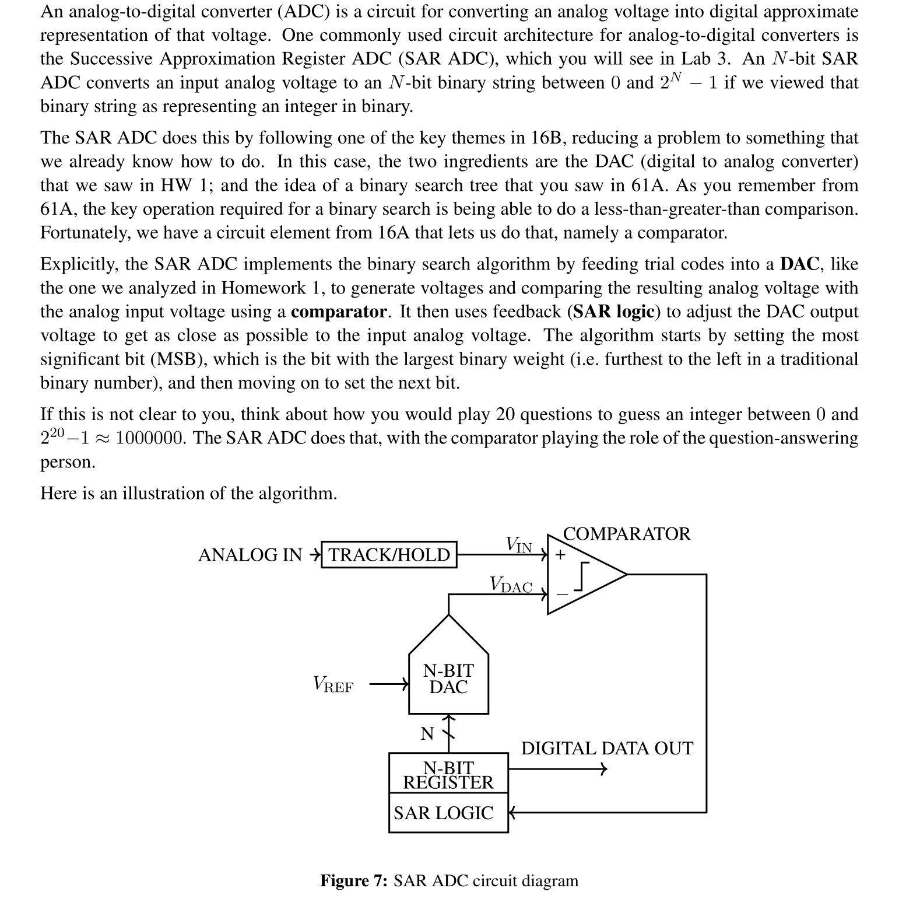

**(a) Reverse Engineering**
**(b) SAR Output**

# Resources
> **HW01/HW02 Fa21/Sp23**

