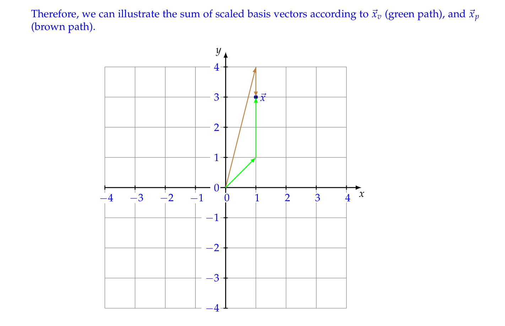

# Change of Basis
## Tracking Terry
> **HW03 Fa21 P3**
> 

**(a)**
**(b)**本质上我们要求解这样一个线性方程组: $\begin{bmatrix} x_1&x_2\\x_3&x_4\end{bmatrix}\begin{bmatrix}2\\3 \end{bmatrix} =\begin{bmatrix} 4\\2\end{bmatrix}$, 所以我们有四个未知量，但是只有两个方程，所以不存在唯一的解。
**(c)**本质上我们可以将以$V$和$P$作为`Basis`的向量转换到`Standard Basis`中，也就是说我们有: $V\vec{x}_v=P\vec{x}_p$, 所以$\vec{x}_p=P^{-1}V\vec{x}_v$, $P=\begin{bmatrix} 1&0\\4&1\end{bmatrix}$, $P^{-1}=\begin{bmatrix} 1&0\\-4&1\end{bmatrix}$, 所以$P^{-1}V=\begin{bmatrix} 1&0\\-4&1\end{bmatrix} \begin{bmatrix} 1&0\\1&2\end{bmatrix}=\begin{bmatrix}1&0\\-3&2\end{bmatrix}$, 所以$T=\begin{bmatrix}1&0\\-3&2\end{bmatrix}$。
**(d)**我们要求的是使得$P\vec{x}_p=\vec{x}$和$V\vec{x}_v=\vec{x}$的$\vec{x}_p$和$\vec{x}_v$。
所以$\vec{x}_p=P^{-1}\vec{x}=\begin{bmatrix} 1&0\\-4&1\end{bmatrix}\begin{bmatrix}1\\3 \end{bmatrix}=\begin{bmatrix} 1\\-1\end{bmatrix}$, $\vec{x}_v=V^{-1}\vec{x}=\begin{bmatrix} 1&0\\-\frac{1}{2}&\frac{1}{2}\end{bmatrix}\begin{bmatrix}1\\3 \end{bmatrix}=\begin{bmatrix} 1\\1\end{bmatrix}$

## Eigenvectors and Diagonalization
> **HW03 Fa21 P4**
> 

**(a)**根据特征向量的定义，我们有$A\vec{v_1}=\lambda \vec{v_1}\cdots,A\vec{v_n}=\lambda \vec{v_n}$, 将$\vec{v_i}$按列组成矩阵$V$我们有$AV= V\Lambda$
**(b)**因为$\vec{v_1},\cdots, \vec{v_n}$是线性无关的，所以$a_1\vec{v_1}+\cdots+a_n\vec{v_n}=\vec{0}$只有$a_1=a_2=\cdots=a_n=0$的解，也就是说如果$V=\begin{bmatrix} \vec{v_1}&\cdots&\vec{v_n}\end{bmatrix}$，则$V\vec{a}=\vec{0}$只有零解，也就是$V$的零空间只有$\{\vec{0}\}$, 所以$V$可逆。
因为$AV=V\Lambda$, 所以$A=V\Lambda V^{-1}$。
**(c)**$\Lambda=V^{-1}AV$。
**(d)**因为$A=UDU^{-1}$, 所以$U$可逆(因为能够表示成$U^{-1}$)，所以$AU=UD$, 令$U=\begin{bmatrix} \vec{u_1}&\vec{u_2}\cdots&\vec{u_n}\end{bmatrix}$ , $D=\begin{bmatrix} \lambda_1&\cdots&0\\\vdots&\ddots&\vdots\\0&\cdots&\lambda_n\end{bmatrix}$, 所以我们有$A\vec{u_i}=\lambda_i\vec{u_i}$，所以$\vec{u_i}$就是`Eigenvectors`。$D$的对角线上的元素就是`Eigenvalues`。
**(e)**因为$A\vec{v_i}=\lambda_i\vec{v_i}$, 所以$A^k\vec{v_i}=\lambda_i^k\vec{v_i}$, 于是$A^k$的特征值是$\lambda_i^k$, 特征向量是$\vec{v_i}$。
所以$A^kV=VD^k$, 即$A^k=VD^kV^{-1}$, 所以$A^k$是`Diagonalizable`的。

## Vector Differential Equations
> **HW03 Fa21 P5**
> 

**(a)**$\begin{bmatrix}\frac{dx_1(t)}{dt}\\\frac{dx_2(t)}{dt} \end{bmatrix}=\begin{bmatrix}7&-8\\4&-5 \end{bmatrix}\begin{bmatrix}x_1(t)\\x_2(t) \end{bmatrix}$
我们对$A=\begin{bmatrix} 7&-8\\4&-5\end{bmatrix}$求解特征值：
$(7-\lambda)(-5-\lambda)+32=0$, 所以$\lambda_1=-1,\lambda_2=3$
**(b)**$\lambda_1=-1$, 对应的特征向量是$\begin{bmatrix} 1\\1  \end{bmatrix}$。
$\lambda_2 = 3$，对应的特征向量是$\begin{bmatrix} 2\\1\end{bmatrix}$。
所以`Column Eigenvectors`是$\begin{bmatrix} 1&2\\1&1\end{bmatrix}$。
**(c)**我们只需使用$B=\begin{bmatrix} 1&2\\1&1\end{bmatrix}$作为我们的`New Basis`, 也就是`Eigen Basis`, 此时$D=\begin{bmatrix} -1&0\\0&3\end{bmatrix}$
$\frac{d\vec{z}(t)}{dt}=D\vec{z}(t)$。
**(d)**首先我们需要求出$\vec{z}(0)=B^{-1}\vec{x}(0)=\begin{bmatrix} -1&2\\1&-1\end{bmatrix}\begin{bmatrix} 1\\-1\end{bmatrix}=\begin{bmatrix} -3\\2\end{bmatrix}$
根据一阶线性常系数齐次微分方程，我们有$\vec{z}(t)=\begin{bmatrix} -3e^{-t}\\2e^{3t}\end{bmatrix}$
**(e)**所以$\vec{x}(t)=B\vec{z}(t)=\begin{bmatrix} 1&2\\1&1\end{bmatrix}\begin{bmatrix} -3e^{-t}\\2e^{3t}\end{bmatrix}=\begin{bmatrix}-3e^{-t}+4e^{3t}\\-3e^{-t}+2e^{3t}\end{bmatrix}$
**(f)**既然要消除二阶项，我们不妨令$x(t)=\frac{dy(t)}{dt}$, 则$\frac{dx(t)}{dt}=\frac{d^2y(t)}{dt^2}$, 所以我们有:
$\frac{dx(t)}{dt}-5x(t)+6y(t)=0$和$\frac{dy(t)}{dt}=x(t)$。
也就是: $\begin{cases} \frac{dx(t)}{dt}=5x(t)-6y(t) \\ \frac{dy(t)}{dt}=x(t)\end{cases}$。
**(g)**因为$x(t)=\frac{dy(t)}{dt}$, 所以我们知道$\begin{cases} x(0)=1\\y(0)=1\end{cases}$
我们知道$A=\begin{bmatrix} 5&-6\\1&0\end{bmatrix}$, 特征值为$\lambda_1=2, \lambda_2=3$。
根据上述公式我们有$c_0e^{\lambda_1t}+c_1e^{\lambda_2 t}=\lambda_1c_2e^{\lambda_1t}+\lambda_2c_3e^{\lambda_2t}$。令$t=0$我们有$c_0+c_1=2c_2+3c_3$
因为$\frac{dx(t)}{dt}=5x(t)-6y(t)$, 我们有$c_0\lambda_1e^{\lambda_1 t}+c_1\lambda_2 e^{\lambda_2 t}=5c_0e^{\lambda_1t}+5c_1e^{\lambda_2 t}-6c_2e^{\lambda_1 t}-6c_3e^{\lambda_2 t}$。令$t=0$我们有
$2c_0+3c_1=5c_0+5c_1-6c_2-6c_3$, 即$3c_0+2c_1=6c_2+6c_3\tag{2}$
所以根据上述公式我们有: $c_0+c_1=1$, $c_2+c_3=1$
整理之后我们有: $\begin{cases} 2c_2+3c_3=1\\c_2+c_3=1\end{cases}$, 所以$c_2=2,c_3=-1$
带入$(2)$式中我们有$\begin{cases} 3c_0+2c_1=6\\c_0+c_1=1\end{cases}$, 所以$c_0=4, c_1=-3$
所以我们可以解出$c_0,c_1,c_2,c_3$。

# OpAmp Stability
> **HW03 Fa21 P6**
> 

**(a) Eigenvalues**
**(b) Approximation**

# Solar Cell(Optional)
> **HW03 Fa21 P7**

# *Proof Practice
> **HW03 Fa21 P8**
> 

**(a)**根据题意，令$\alpha_i$代表是否选择$\sigma_i$, 即$\alpha_i\in \{0,1\}$，则$\sum_{i=1}^n\alpha_i\sigma_i$表示选择的$\sigma$'s的和。
因为我们要从$n$个里面选择$k$个，所以$\sum_{i=1}^n \alpha_i=k$, 所以本质上我们要求的是:
$\argmax_{\vec{\alpha}} \sum_{i=1}^n \alpha_i \sigma_i,~~~s.t.~~\sum_{i=1}^n\alpha_i=k$
**证明:**
现在假设$\alpha_1=\alpha_2=\cdots=\alpha_k=1, \alpha_{k+1}=\cdots=\alpha_n=0$，并证明任何其他的`Encoding`都不是最大的。
假设$\vec{\alpha}$满足$\alpha_1=\alpha_2=\cdots=\alpha_k=1, \alpha_{k+1}=\cdots=\alpha_n=0$，并假设$\vec{\beta}\neq \vec{\alpha}$, 则$\exists i\in [1,k], ~~s.t.~~a_i=0$且$\exists j\in [k+1, n], ~~s.t.~~a_j=1$。因为$\sigma_1>\sigma_2>\cdots>\sigma_n\geq 0$, 则$\sum_{i=1}^n \alpha_i\sigma_i >\sum_{i=1}^n \beta_i\sigma_i$, 这说明任何其他的选择方式$\vec{\beta}$都不是最优的，于是$\vec{\alpha}$一定是最优的。
**(b)**

# Resources
> **HW03/04 Fa21/Sp23**

