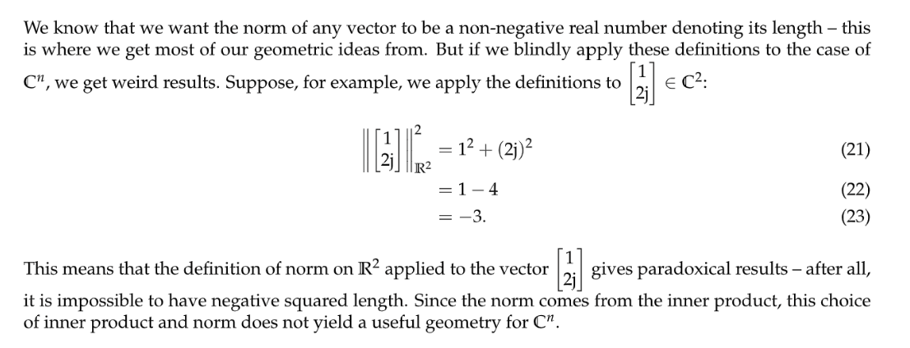
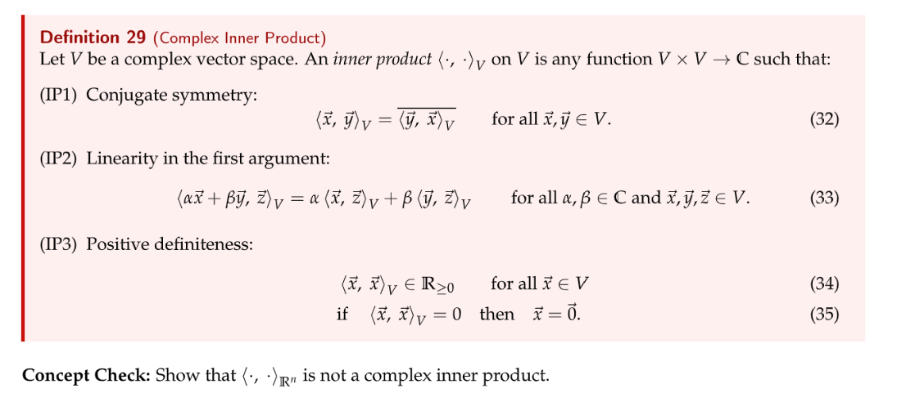
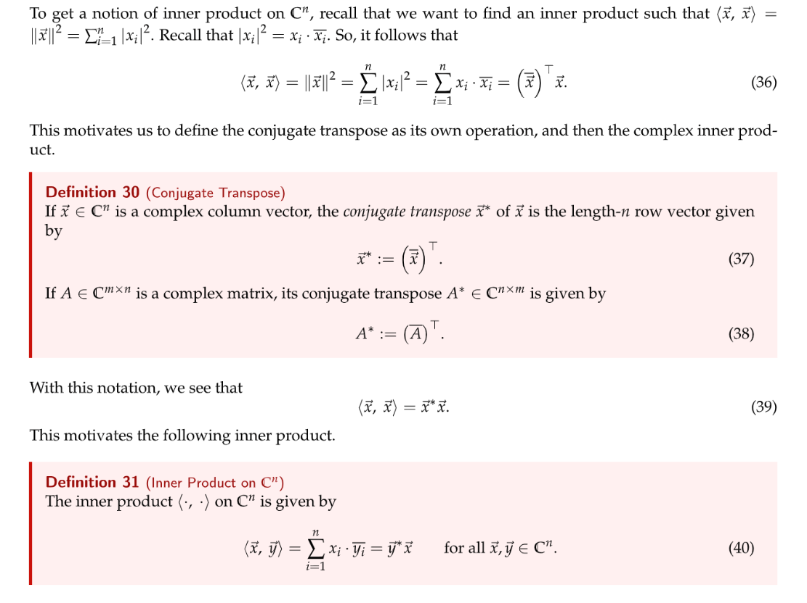
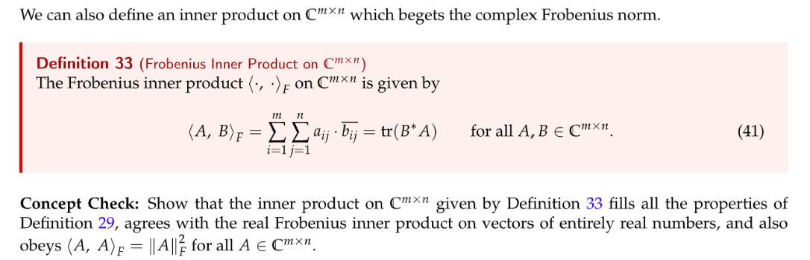
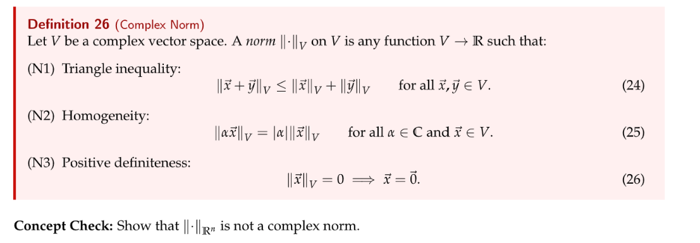
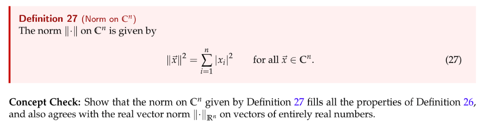
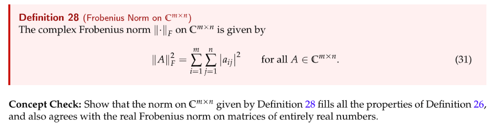

[note2j.pdf](https://www.yuque.com/attachments/yuque/0/2023/pdf/12393765/1689669868402-79b2f837-50c5-436a-8b72-ffaab3411b73.pdf)

# Recap on Real  Domain
> **在实数域中，我们定义**
> 1. `Inner Product`为$\langle \vec{x}, \vec{y}\rangle_{\mathbb{R^n}}=\sum_{i=1}^nx_iy_i$
> 2. `Norm`为$\|\vec{x}\|_{\mathbb{R}^n}^2=\langle \vec{x}, \vec{x}\rangle_{\mathbb{R^n}}=\sum_{i=1}^nx_i^2$
> 

# Recap on Complex Numbers
> See Note-j

# Complex Inner Product
## Vector Definition
> 
> $\langle \cdot,\cdot \rangle_{\mathbb{R}^n}$
> 

## Matrix Definition
> 

# Complex L2-Norm
## Vector Definition
> 任何称为`Complex Norm`的定义都必须同时满足下面三个性质:
> 
> $\|\cdot\|_{\mathbb{R}^n}$不满足$(N2)$, 因为根据定义我们有:$\|\alpha \vec{x}\|^2_{\mathbb{R}^n}=\langle \alpha\vec{x},\alpha\vec{x}\rangle=\vec{x}^{\top}\alpha^{\top}\alpha\vec{x}=\alpha^2\vec{x}^{\top}\vec{x}=\alpha^2\|\vec{x}\|^2_{\mathbb{R}^n}$
> 所以$\|\alpha \vec{x}\|_{\mathbb{R}^n}=\sqrt{\alpha^2}\|\vec{x}\|_{\mathbb{R}^n}$, 但是因为$\alpha\in \mathbb{C}$, 所以$\alpha^2\neq |\alpha|^2$, 所以等号不成立。
> 
> $(N1)$: $\begin{aligned}\|\vec{x}+\vec{y}\|^2&=\sum_{i=1}^n|x_i+y_i|^2\\&= \sum_{i=1}^n (x_i+y_i)(\overline{x_i+y_i})\\&=\sum_{i=1}^n |x_i|^2+\sum_{i}^n|y_i|^2+\sum_{i=1}^nx_i\overline{y}_i+\sum_{i=1}^ny_i\overline{x}_i\\&= \|\vec{x}\|_2^2+\|\vec{y}\|_2^2+ \sum_{i=1}^nx_i\overline{y}_i+\overline{\sum_{i=1}^ny_i\overline{x}_i}\\&=\|\vec{x}\|_2^2+\|\vec{y}\|_2^2+ 2Re(\sum_{i=1}^nx_i\overline{y}_i)\\&\leq\|\vec{x}\|_2^2+\|\vec{y}_2^2\|+2|\sum_{i=1}^nx_i\overline{y}_i|\\&\leq\|\vec{x}\|_2^2+\|\vec{y}_2\|^2_2+2\|\vec{x}\|_2\|\vec{y}\|_2\\&=(\|\vec{x}\|+\|\vec{y}\|)^2\end{aligned}$ 
> $(N2)$: $\|\alpha\vec{x}\|^2=\sum_{i=1}^n |\alpha x_i|^2=|\alpha|^2\sum_{i=1}^n|x_i|^2=|\alpha|^2\|\vec{x}\|^2$
> $(N3)$: $\|\vec{x}\|^2=\sum_{i=1}^n |x_i|^2=0\implies x_i=0,\forall i\implies \vec{x}=\vec{0}$
> 如果$x_i\in \mathbb{R}$, 则$|x_i|^2=x_i^2$，所以上述定义对$\mathbb{R}^n$也成立。

## Matrix Definition
> 
> 类比上面的证明过程即可。

# Resources
> **Note 2j Sp22**

