# First Derivative
## Definition
> 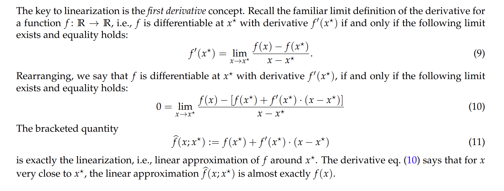

## First-Order Partial Derivative
> 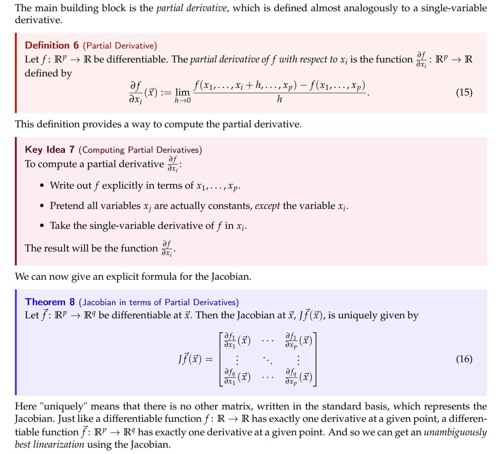

**Short Proof**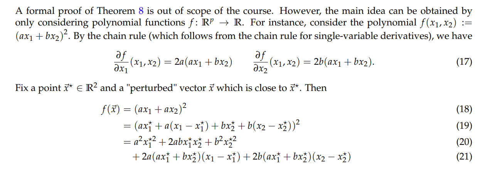

## Linear Approximation of Scalar Functions
[dis11B.pdf](https://www.yuque.com/attachments/yuque/0/2023/pdf/12393765/1692092265922-1782085e-06c6-4e27-bb5a-22b817e29b58.pdf)
[dis11B_sol.pdf](https://www.yuque.com/attachments/yuque/0/2023/pdf/12393765/1692092265934-68710721-43e4-4b38-9549-ed44b70380a5.pdf)
### Single Variable Case
> 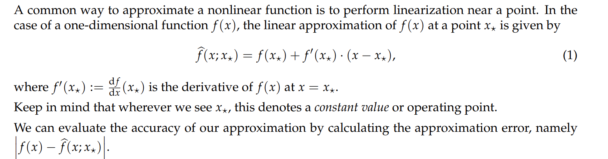

### Multivarious Case
> 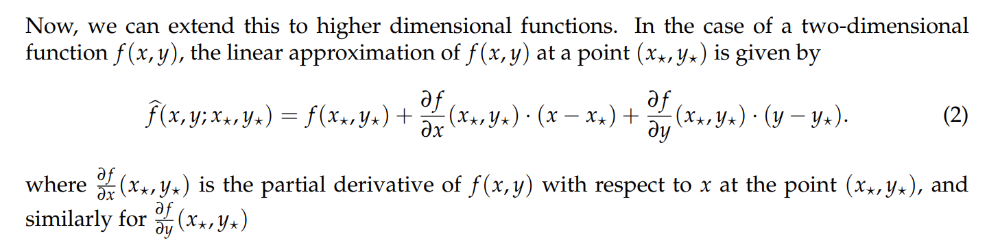

### Vectorized Case
> 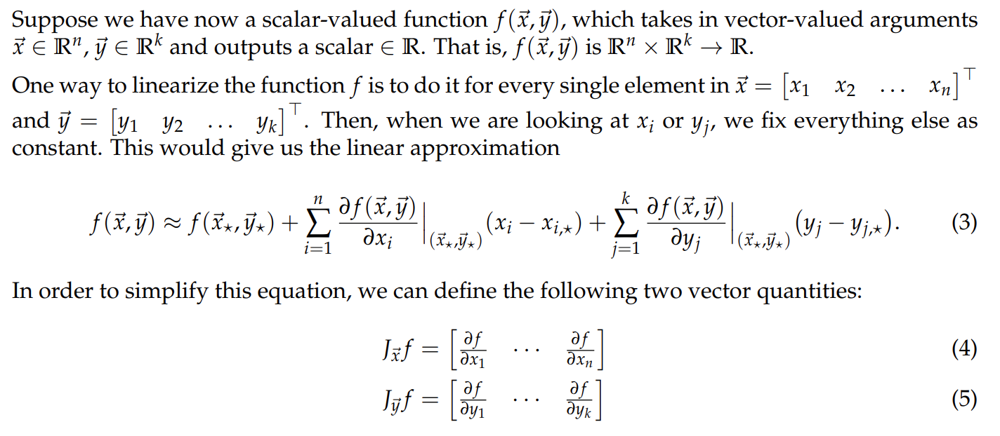

## Linear Approximaion for Vector Functions
[dis12A.pdf](https://www.yuque.com/attachments/yuque/0/2023/pdf/12393765/1692093706981-834381f1-fa33-44b0-bc9c-201fd29b6a12.pdf)
[dis12A_sol.pdf](https://www.yuque.com/attachments/yuque/0/2023/pdf/12393765/1692093706980-737f1045-d29b-41ac-95c5-82a04441ea86.pdf)
> 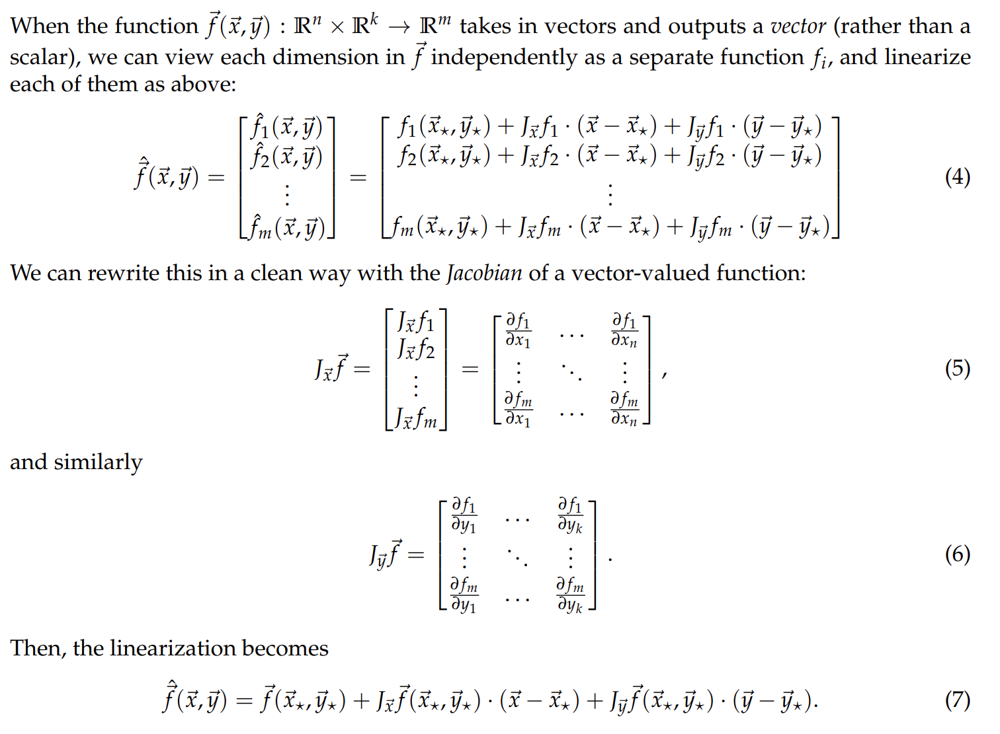

**Example**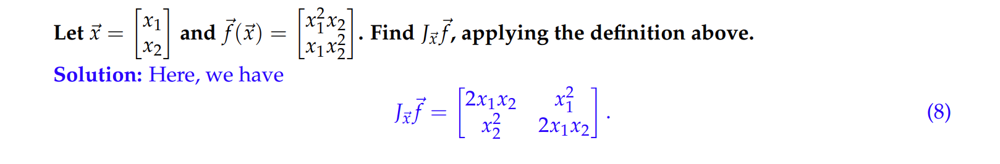

# Second Derivative
## Definition
> 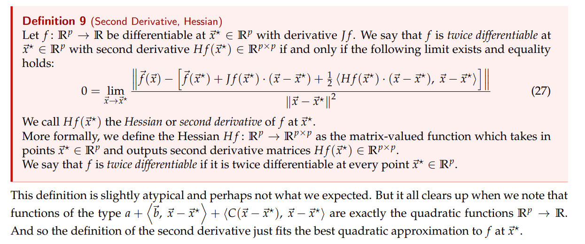

## Computing Derivative
> 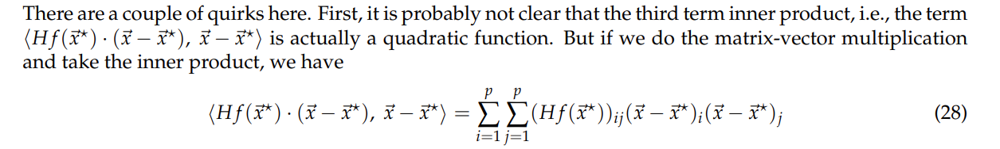

## Second-Order Partial Derivative
> 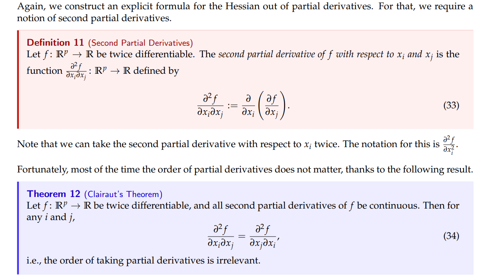

**Short Proof**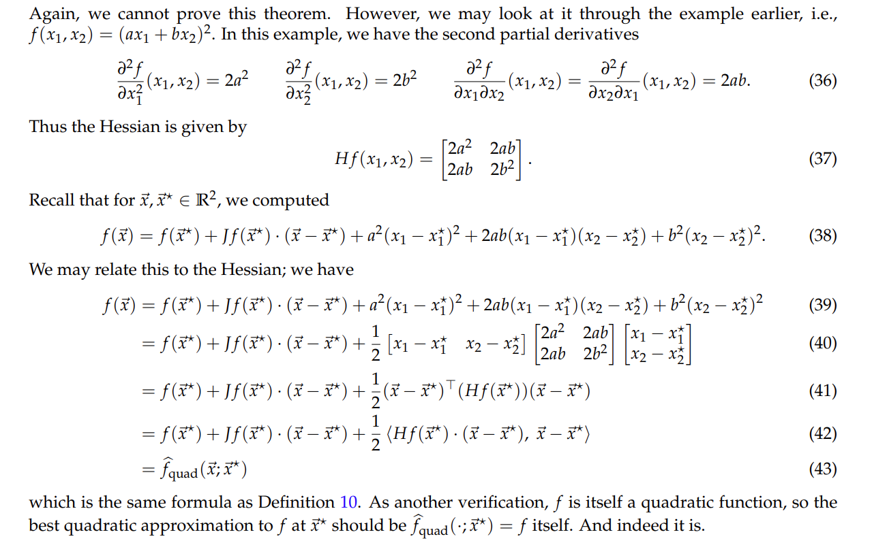

# Linearizing Control Model
> 

# Resources
> **Note 18 Sp22**
> **Disc11B Sp22**
> **Disc12A Sp22**

