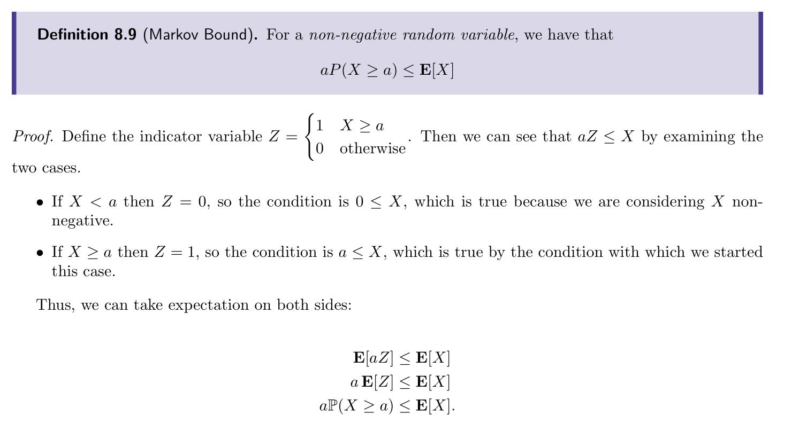
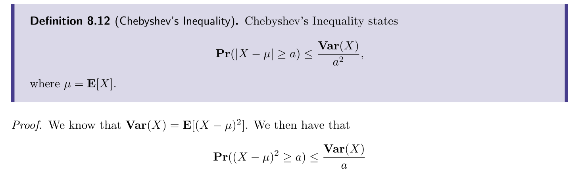
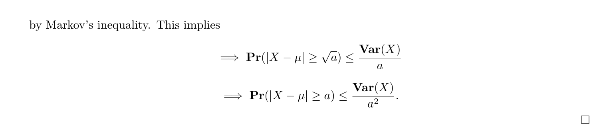
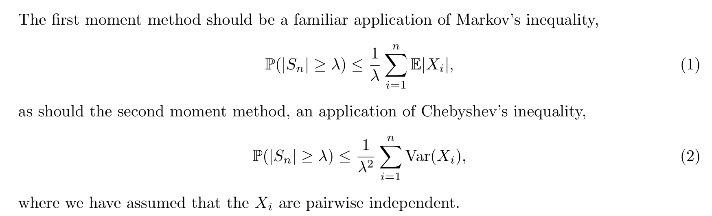
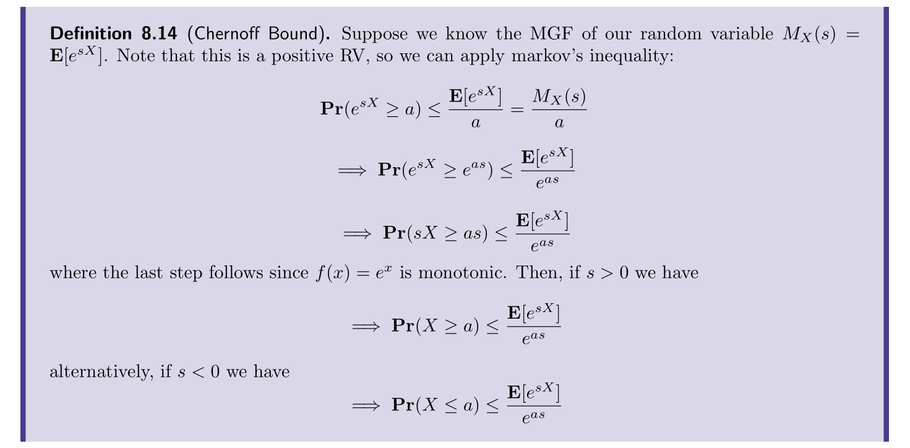
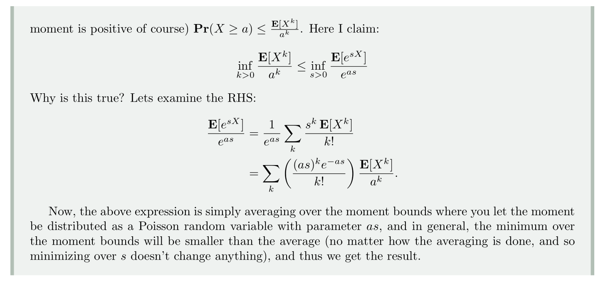
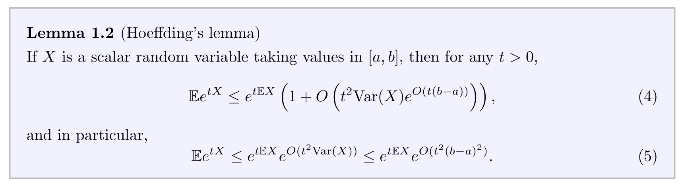
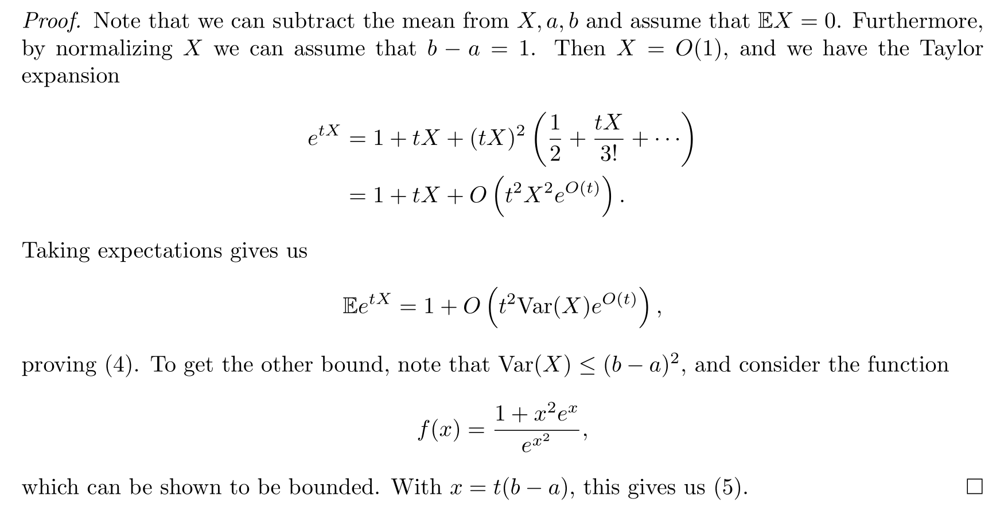

# Laplace Transformation
## Step and Delta Function

## Definition
> [!def]
> 

## Computing Examples
> [!example]
> 

# Moment Generating Function

# Basic Bounds
## Markov Bound
> [!def]
> 

## Chebyshev's Bound
> [!def]
> 

# Moment Bounds
## Moment Methods
> [!def]
> 

> [!proof] Proof: First Moment

> [!proof] Proof: Second Moment

## Chernoff Moment Bounds
> [!def]
> 

# Hoeffding Bounds
## Hoeffding's Lemma
> [!lemma]
> 

> [!proof]
> 

