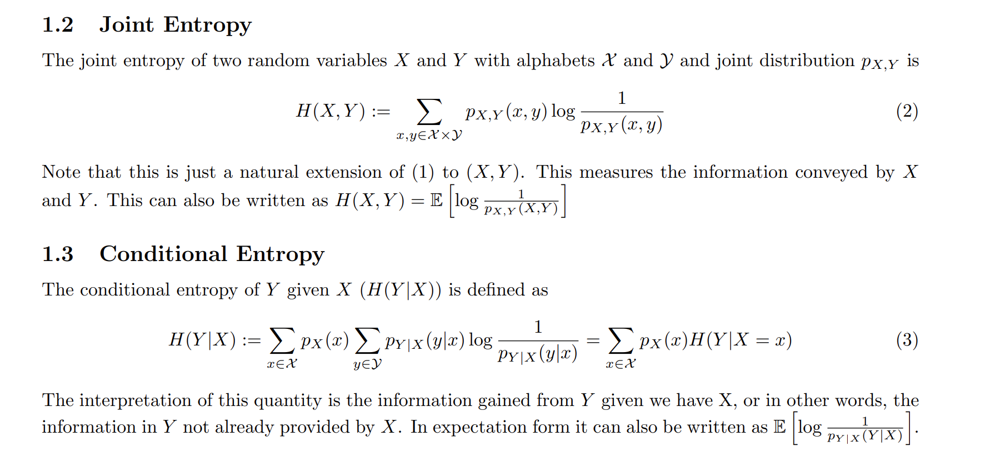
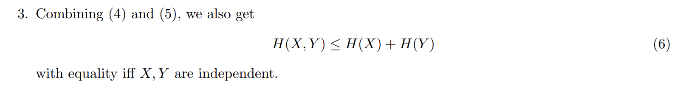

# Entropy of R.V.
## Definition
> [!def]
> 
> Generally, the base of the logarithm is 2 and the entropy has units ’bits’. The expected number of bits needed to express the information in X is a natural choice to measure its uncertainty. It turns out that the expected number of bits required to describe the random variable is roughly the entropy H(X).

> [!property]
> 
> We verify that $(xlog(x))''=\frac{1}{x}$. If we let $x=p_X(x)$, then $f(p_X(x))$ is convex in $p_X(x)$, which means that $H(X)$ is concave in $p_X(x)$ since $p_X(x)log\frac{1}{p_X(x)}=-p_X(x)logp_X(x)$.
> 
> 

# Joint/Conditional Entropy
> [!def]
> 

> [!property]
> 
> **Proof of 2:**
> If $X$ and $Y$ are independent, then$$\begin{aligned}H(Y \mid X) & =\sum_X p_X(x) \sum_y p_{Y \mid X}(y \mid x) \log \frac{1}{p_{Y \mid X}(y \mid x)} \\& =\sum_x p_X(x) \sum_y p_Y(y) \log \frac{1}{p_Y(y)} \\& =\sum_x p_X(x) H(Y) \\& =H(Y) \sum\limits_{x} p_X(x) \\& =H(Y)\end{aligned}$$
> 

# Mutual Information
> [!def]
> 

# Source Coding

