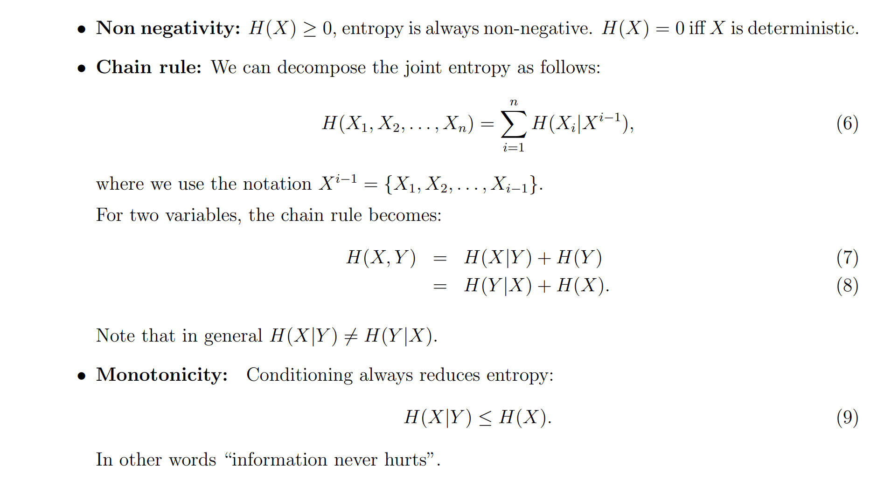
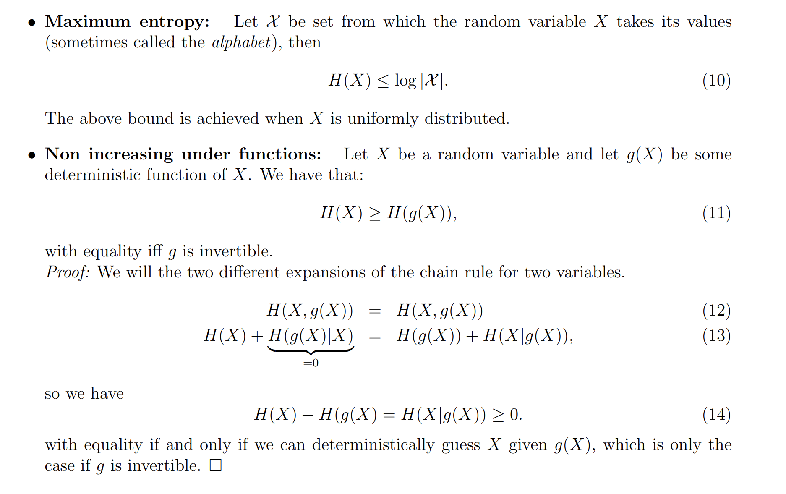
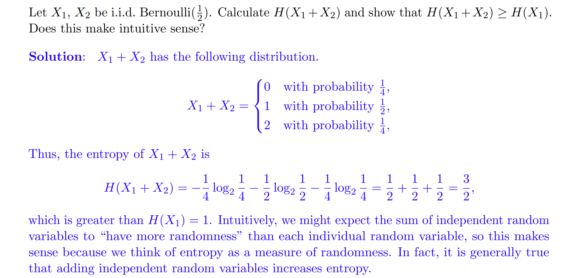
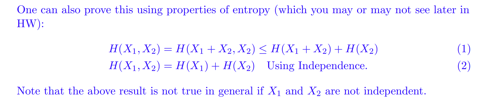

# Entropy of R.V.
## Definition
> [!def]
> 
> Generally, the base of the logarithm is 2 and the entropy has units ’bits’. The expected number of bits needed to express the information in X is a natural choice to measure its uncertainty. It turns out that the expected number of bits required to describe the random variable is roughly the entropy H(X).

> [!property]
> 
> We verify that $(xlog(x))''=\frac{1}{x}$. If we let $x=p_X(x)$, then $f(p_X(x))$ is convex in $p_X(x)$, which means that $H(X)$ is concave in $p_X(x)$ since $p_X(x)log\frac{1}{p_X(x)}=-p_X(x)logp_X(x)$.
> 
> 

## Properties
> [!property]
> 

## Entropy of a Sum
> [!example] Fa23 Disc07 P2
> 

# Joint/Conditional Entropy
## Definition
> [!def]
> 

## Arithmetic Properties
> [!property] Properties
> 
> **Proof of 2:**
> If $X$ and $Y$ are independent, then$$\begin{aligned}H(Y \mid X) & =\sum_X p_X(x) \sum_y p_{Y \mid X}(y \mid x) \log \frac{1}{p_{Y \mid X}(y \mid x)} \\& =\sum_x p_X(x) \sum_y p_Y(y) \log \frac{1}{p_Y(y)} \\& =\sum_x p_X(x) H(Y) \\& =H(Y) \sum\limits_{x} p_X(x) \\& =H(Y)\end{aligned}$$
> 
> Note that in general: $H(X|Y)\neq H(Y|X)$

## Linear Transformation
> [!important]
> Suppose we have two random variable $X_1,X_2$ on the same probability space, then we have:
> $$H(X_1+X_2,X_2)=H(X_1,X_2)$$
> 
> **Proof:** $H(X_1+X_2,X_2)=H(X_1+X_2|X_2)+H(X_2)$ by chain rule, then since we know $X_2$ if we condition on $X_2$, it is no longer random and the randomness comes from $X_1$, so $H(X_1+X_2|X_2)=H(X_1|X_2)$. Since $H(X_1|X_2)+H(X_2)=H(X_1,X_2)$, we have $H(X_1+X_2,X_2)=H(X_1)+H(X_2)$
> 
> **Intuition:** We can think of $X_1+X_2,X_2$ as a reparametrization of $X_1,X_2$, since this transformation is linear, we say that this transformation is just a reparametrization and thus don't lose any randomness in $X_1,X_2$, thus we expect the equality to hold.

# Relative Entropy - KL Divergence
## Distance Definition
> [!def]
> 
> KL Divergence measures the distance between two distributions. Above is the definition of KL Divergence for two continuous distributions.
> 
> When two distributions are the same, we expect the KL Divergence to be zero, otherwise it's bigger than zero.
> 
> The definition is similar for two discrete distributions:
> 

## Variational Definition
> [!def]
> This definition is called Donsker Varahdan variational formula:
> 

## Properties
> [!property] Nonnegativity
> 

> [!proof]

# Mutual Information
> [!def]
> 

