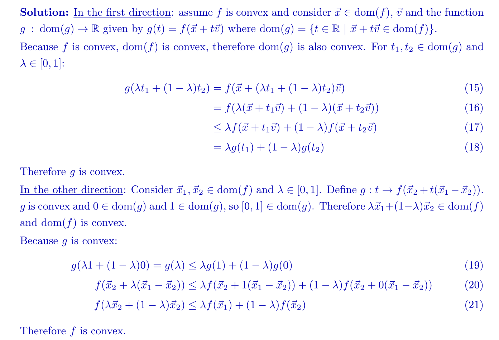
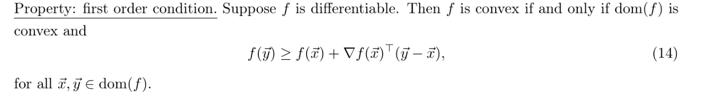
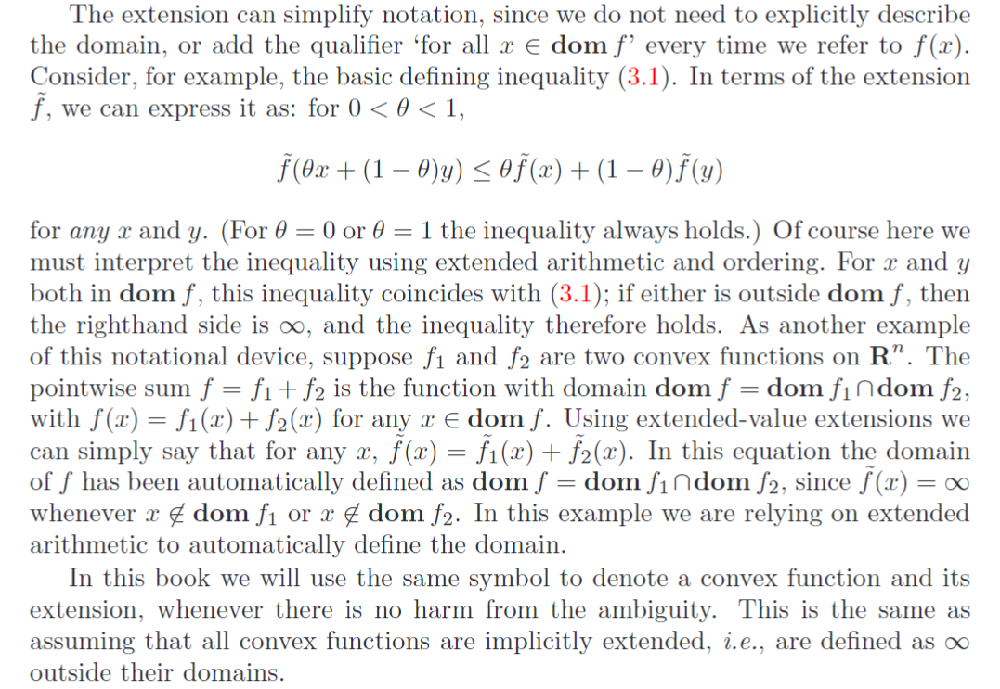
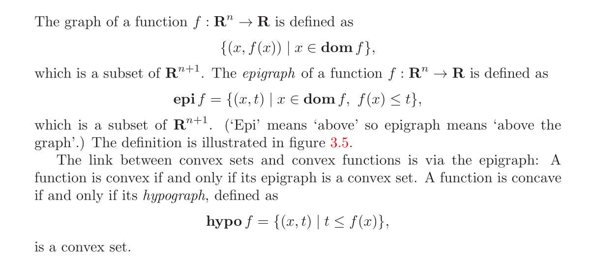
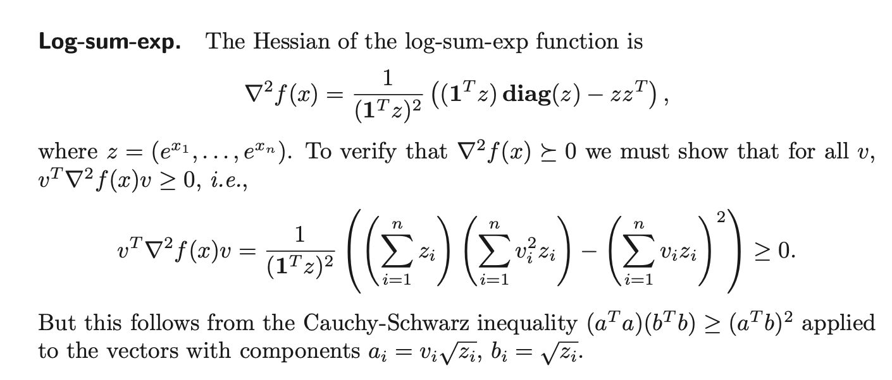
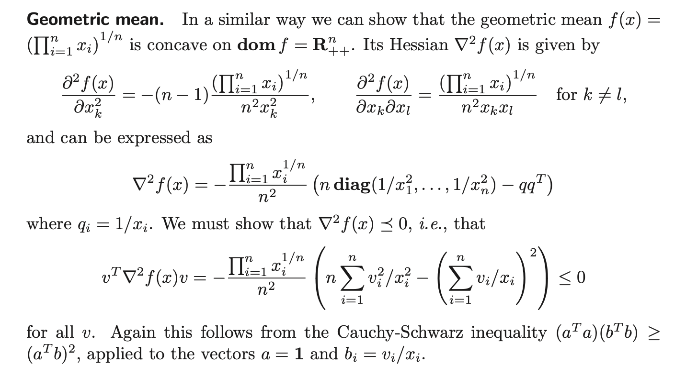
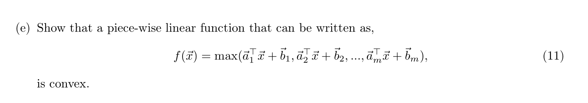
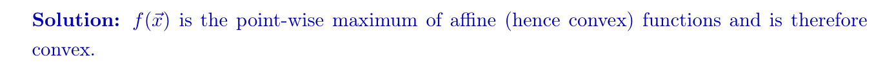
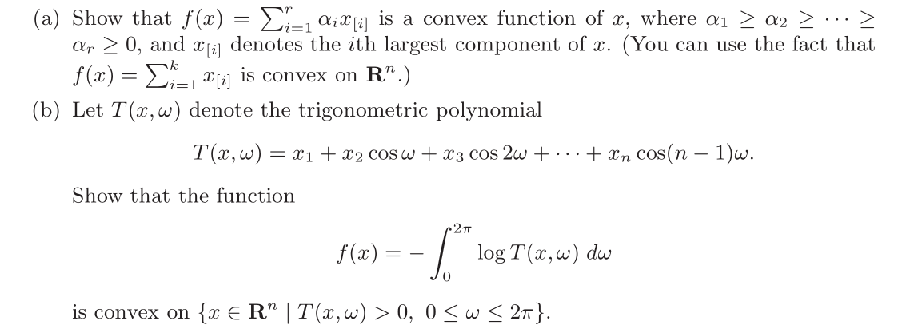
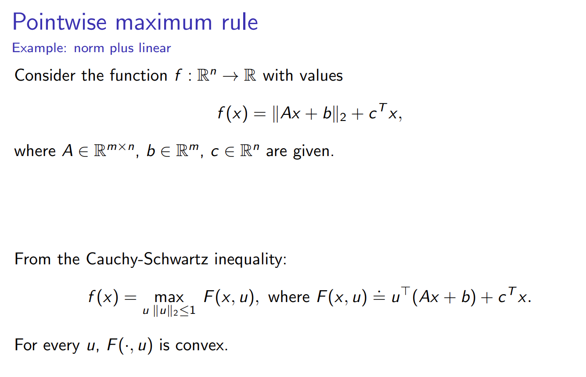

# Convexity of Functions
## Miscellaneous Definitions
### Definition 1: Jensen's Inequality
> [!def] Definition1 : Jensen's Inequality
> 

> [!proof] Prove Generalized Gensen's Inequality
> 

> [!property] Applications of Jensen's Inequality
> 1. Show geometric Inequality: $\sqrt{ab}\leq \frac{a+b}{2}$, let $f(x)=-log(x)$, which is convex and $\theta=\frac{1}{2}$, we could prove the inequality.
> 2. Show Cauchy Inequality: $n\left(\sum_{i=1}^n x_i^2\right) \geq\left(\sum_{i=1}^n x_i\right)^2$, let $f(x)=x^2$ and $\theta=\frac{1}{n}$

### Definition 2: Restricted to a line
> [!def]
   
> 
> 这个情况说的是，如果一个函数$g(t)$定义为$f$沿着$\forall \vec{v}$的方向的取值，且$g$为凸函数，则$f$为凸函数。几何上来说，如果$f$以$\vec{x}$为起点，如果其向着任意方向定义的函数$g(t)$都是凸函数的话，则$f$为凸函数。
> 

### Defintion 3: First Order Condition
> [!def] First Order Condition
> 
> 在$\mathbb{R}^3$定义域中，这个条件可以想象成函数的图像总是在其定义域中的任意一点的切平面之上。
> **Implications: If **$\nabla f(\vec{x}_*)=0$** and  **$f$**  is convex and differentiable, then **$\vec{x}_*$**  is a global minimum.**
> **Proof:** Since $f$ is convex, then $\forall \vec{y}\in dom(f)$, we have $f(\vec{y})\geq f(\vec{x}_*)+0$, which directly implies that $\vec{x}_*$is the global minimum.

> [!proof]
> 

### Defintion 4: Second Order Condition
> [!def] Second Order Condition
> 
> **注意:** 
> 1. 函数使用二阶条件必须满足函数在其定义域上处处二阶可导。
> 2. 对于Quadratic Function$f(\vec{x})=\vec{x}^{\top}H\vec{x}+\vec{b}^{\top}\vec{x}+c$来说，$\nabla f(\vec{x})\succ0$if and only if it is strictly convex, the proof is deferred to [Some common convex functions](#Some%20common%20convex%20functions)
> 

> [!proof]
> 

> [!example] Examples
> 

### Definition 5: Epigraph
> [!important]
> 

### Summary
> [!summary]
> 

## Extended Value Extensions
### Definition
> [!def]
> 
> 
> 这样的定义方法保证了，如果$f$ 是凸函数，则$\tilde{f}$ 也是凸函数，而且是扩展了定义域之后的凸函数。
> 读者可能会想，为什么我们要在$x\notin dom(f)$的时候取正无穷，本质上是因为如果不取正无穷，$\tilde{f}$ 就不一定能保持凸性了。
> 对于$f$ 是concave的情况，我们一般定义$-\infty$。
> 
> 
> 注意, 凸函数的扩展方式不唯一，取决于我们的问题类型。

> [!important]
> 
> 设想一下，如果我们定义$\tilde{f}(x)=\begin{cases} f(x)& x\in dom(f)\\300&x\notin dom(f)\end{cases}$,  我们很容易找到一个反例使得$f(\theta x+(1-\theta)y)> \theta f(x)+(1-\theta)f(y)$。所以当$x\in dom(f)$时，我们要尽可能取大一点的数，或者说是很大的数，那么正无穷就是首选，因为正无穷加上任何数都还是正无穷。

### Indicator Function 
> [!def]
> 

## Sub/Super-Level Set
### Definition
> [!def] Definition
> 
> **总结一下:**
> 1. A convex function's sublevel set is convex, and the converse is not true.
> 2. A concave function's superlevel set is convex, and the converse is not true.
> 

> [!proof]
> 

### Important Properties
> [!property]
> 若函数的Sublevel Set 都是凸集，则$f$ 不一定为凸函数。
> 比如$f(x)=-e^x$, 它的所有的$\alpha-$sublevel set都是凸集，但是 $f$ 不是凸函数，而是一个凹函数。

## Epi/Hypo-graph of Functions
> [!def]
> 
> 证明一个函数是否是凸函数的一个重要的方法是证明其`Epigraph`is convex set. 这个性质使得我们能可以在`Convex Function`和`Convex Set`之间互相转化。
> **总的来说:**
> 1. `Convex Function <=> Epigraph is Convex Set`.
> 2. `Concave Function <=>  Hypograph is Convex Set`.

> [!example] Matrix Fractional Function
> 

## Some useful convex functions
### Quadratic Functions
> [!important] 
> 
> 二次函数是为数不多的，$\nabla^{2}f(\vec{x})\succ0\iff f~is~strictly~convex$ 的例子。
> 
> 

> [!proof] Proof for if and only if for strictly convexity and P.D. Hessian Matrix.
> We want to prove that if $f(\vec{x})=(1 / 2) x^T P x+q^T x+r$ is strictly convex, then $\nabla^2f(\vec{x})\succ0$。
> First suppose that $f$ is strictly convex, then we have:
> $\forall \vec{x} \neq \vec{y} \in R^n, \lambda \in(0,1)$, we have:$$
> f(\lambda \vec{x}+(1-\lambda) \vec{y})<\lambda f(\vec{x})+(1-\lambda) f(\vec{y})$$
> Then plug the expression of $f(\vec{x})$ in and we get;
> $$\begin{aligned}&\left.\frac{1}{2}(\lambda \vec{x}+(1-\lambda) \vec{y})^{\top} P(\lambda \vec{x}+(1-\lambda) \vec{y})+\vec{q}^{\top}(\lambda \vec{x}+(1-\lambda))^y\right)+r<\lambda\left(\frac{1}{2} \vec{x}^{\top} P \vec{x}+\vec{q}^{\top} \vec{x}+r\right)+(1-\lambda)\left(\frac{1}{2} \vec{y}^{\top} P \vec{y}+\vec{q}^{\top} \vec{y}+r\right) \\& \frac{1}{2} \lambda^2 \vec{x}^{\top} P \vec{x}+\frac{1}{2}(1-\lambda)^2 \vec{y}^{\top} P \vec{y}+\lambda(1-\lambda) \vec{x}^{\top} P \vec{y}+\vec{q}^{\top}(\lambda \vec{x}+(1-\lambda) \vec{y})+r<\frac{1}{2} \lambda \vec{x}^{\top} P \vec{x}+\frac{1}{2}(1-\lambda) \vec{y}^{\top} P \vec{y}+\lambda \vec{q}^{\top} \vec{x}+(1-\lambda) \vec{q}^{\top} \vec{y}+r \\& \frac{1}{2} \lambda^2 \vec{x}^{\top} P \vec{x}+\frac{1}{2}(1-\lambda)^2 \vec{y}^{\top} P \vec{y}+\lambda(1-\lambda) \vec{x}^{\top} P \vec{y}<\frac{1}{2} \lambda \vec{x}^{\top} P \vec{x}+\frac{1}{2}(1-\lambda) \vec{y}^{\top} P \vec{y} \\&\left.\frac{1}{2}\left(\lambda-\lambda^2\right)^{\top} P \vec{x}+\frac{1}{2}(1-\lambda)-(1-\lambda)^2\right)^{\top} P \vec{y}-\lambda(1-\lambda) \vec{x}^{\top} P \vec{y}>0 \\& \frac{1}{2} \lambda(1-\lambda) \vec{x}^{\top} P \vec{x}+\frac{1}{2} \lambda(1-\lambda) \vec{y}^{\top} P \vec{y}-\lambda(1-\lambda) \vec{x}^{\top} P \vec{y}>0 \\& \frac{1}{2} \lambda(1-\lambda)(\vec{x}-\vec{y})^{\top} P(\vec{x}-\vec{y})>0 \\&(\vec{x}-\vec{y})^{\top} P(\vec{x}-\vec{y})>0 \\& \Rightarrow P>0\end{aligned}$$

### More on Absolute/Power Function Differentiability
> [!important]
> 

### Functions on R
> [!example] Examples
> 
> 1. **Exponential: **$(e^{ax})''=a^2e^{ax}\geq 0,\forall x\in dom(f)$
> 2. **Powers:** $(x^a)''=a(a-1)x^{a-2}$, 于是当$a(a-1)\leq 0$时，$(x^a)''\leq 0$-> Concave，否则$(x^a)''\geq 0$-> Convex
> 3. **Powers of absolute value:** 
>    1. 首先注意到，如果$p<0$, 则 $dom(f)$ 不是凸集，当$p=1$时，函数不可微，但是可以使用`Definition 1/2`判断其凸性。当$p=0$时，函数是常值函数，此时函数既是凸函数又是凹函数。当$0<p<1$时，函数既不是凸函数又不是凹函数, 画图即可判断。
>    2. 当$p\geq 2$时，函数处处二阶可微，所以我们可以用二阶条件判断凸性。
> 	   1. $\forall x>0, (|x|^p)''=p(p-1)x^{p-2}$, when $p> 1$, we have $p(p-1)x^{p-2}\geq 0$
> 	   2. $\forall x<0$, $(|x|^p)''=((-x)^p)^{''}=p(p-1)(-x)^{p-2}$, which is the same as above.
> 	   3. The $x=0$ case is just trivial, since the second derivative is 0.
> 	3. 当$1< p< 2$时，函数在`0`处不是二阶可微的(一阶导数在`0`处不连续)，所以我们只能用一阶条件判断凸性: 我们有$f'(x)=sign(x)|x|^{p-1}$, 这是严格单调递增的，所以$f$是凸函数。
> 
> 4. **Logarithm:** $(logx)''=-\frac{1}{x^2}<0,\forall x\in dom(f)$
> 5. **Negative Entropy:** $(xlogx)''=\frac{1}{x}>0,\forall x\in \mathbb{R}_{+}$or $\forall x\in \mathbb{R}_{++}$

### Functions on R^n
> [!example] Examples
> 
> 1. **Norm:** $\|\theta x+(1-\theta)y\|_p\leq \theta \|x\|_p+(1-\theta) \|y\|_p$ by triangle inequality and homogenity. 这里$p>0$，因为当$p=0$时$\|x\|_0$表示零范数，而零范数不是范数，因为不满足`homogenity`。
> 2. **Max Function: **
>    1. **Prove by Definition:** $\theta \vec{x_i} + (1-\theta)\vec{y_i}\leq \theta \max(\vec{x})+(1-\theta)\max(\vec{y}),\forall i=1,2,\cdots, n$, 所以$\max(\theta \vec{x}+(1-\theta)\vec{y})\leq \theta \max(\vec{x})+(1-\theta)\max(\vec{y})$
>    2. **Prove by Epigragh:  Define **$f(\vec{x})=\max\{f_1(\vec{x}),f_2(\vec{x},\cdots, f_n(\vec{x}))\}$where **$f_i(\vec{x})=x_i$**, then:
> $\begin{aligned}epi(f)&=\{(\vec{x},t)~~|~~\vec{x}\in dom(f),f(\vec{x})\leq t\}\\&=\{(\vec{x},t)~~|~~\vec{x}\in \bigcap_{i=1}^n dom(f_i),f_1(\vec{x}),\cdots, f_n(\vec{x})\leq t\}\\&=\bigcap_{i=1}^n\{(\vec{x},t)~~|~~\vec{x}\in dom(f_i),f_i(\vec{x})\leq t\}\\&=\bigcap_{i=1}^n epi(f_i)\end{aligned}$, since $f_i(\vec{x})$'s are all affine functions, which are guaranteed to be convex, thus we have $epi(f_i)$'s are convex set, and that $epi(f)$is convex.
> 3. **Quadratic Over Linear Function:** 
> 
> The last inequality comes from a very important property of dyad matrix $\vec{u}\vec{v}^{\top}$where if $\vec{u}=\vec{v}$, we have $\vec{v}\vec{v}^{\top}$is convex.
> 4. **Log-Sum-Exp: **
> 	这个函数是一个解析函数，性质较好，同时解析函数就是无穷可导的函数。
> - 当$i\neq j$时，$\frac{\partial ^2f}{\partial x_ix_j}=\frac{-e^{x_i}e^{x_j}}{(e^{x_1}+e^{x_2}+\cdots+e^{x_n})^2}$
> - 当$i= j$时，$\frac{\partial ^2f}{\partial x_i^2}=\frac{-e^{x_i}e^{x_i}+e^{x_i}(e^{x_1}+\cdots+e^{x_n})}{(e^{x_1}+e^{x_2}+\cdots+e^{x_n})^2}$
> 
> 5. **Geometric Mean:**
> 
> 其中，$\begin{aligned}\frac{\partial^2 f(x)}{\partial x_k\partial x_l}&=\frac{1}{n}(\frac{1}{n}-1)(\prod_{i=1}^n x_i)^{\frac{1}{n}-2}(\prod_{j\neq k}x_j)(\prod_{i\neq k,l}x_i)+\frac{1}{n}(\prod_{i=1}^n x_i)^{\frac{1}{n}-1}(\prod_{i\neq k,l}x_i)\\&=\frac{(\prod_{i=1}^nx_i)^{\frac{1}{n}}}{n^2x_kx_l}\end{aligned}$
> 6. **Log-Determinant:**
> 
> **推导中使用到了几个重要的性质：**
> 	1. $det(ABC)=det(A)det(B)det(C)$
> 	2. If $Z\in \mathbf{S}_{++}$, then $Z^{-\frac{1}{2}}$exists.
> 	3. **Eigenshift Rules**: If the eigenvalues for $\mathbf{A}$ are $\sigma_i(\mathbf{A})$ then the eigenvalues for $\mathbf{A}+\lambda I$are $\sigma_i(\mathbf{A})+1$。

### Sinusoidal Function
> EECS127 Disc06 P4

> [!example]
> 

### Log-Likelihood Function
> [!example]
> 总的来说，`log-likelihood function`在$\mu$和$\frac{1}{\sigma^2}$上分别是`strictly concave`的(`partial strictly concave`), 但是在$(\mu, \frac{1}{\sigma^2})$上不是`strictly convex/concave`的（不是`jointly convex/concave`的）。
> 

### PDF of Exponential Family
> [!example] Disc12 Fa22 P2
> 
> We will prove several useful properties:
> 1. The normalization factor $b(\vec{\theta})$ is convex in $\vec{\theta}$.
> 2. We model $\theta=X\vec{\beta}$ where $X\in \mathbb{R}^{n\times d}$ is the data matrix, where under this parameterization of $\vec{\theta}$, the exponential family is called a generalized linear model. Then $b(X\vec{\beta})$ is convex in $\vec{\beta}$.

> [!proof] Proof for 1
> The proof is tricky in higher dimension, but we try to provide one:
> 
> First, by the definition of integral, we have when $n=1$
> 
> So for higher dimension, we have similar arguments. But an alternative would be as follows:
> 
> 

> [!proof] Proof for 2
> 
> This can be seem by the following proof:
> If $b(\vec{\theta})$ is convex in $\theta$, then: $$b(\lambda \vec{\theta}_1+(1-\lambda)\vec{\theta}_2)\leq\lambda b(\vec{\theta_1})+(1-\lambda)b(\vec{\theta}_2)$$
> This means:
> $$\begin{aligned}b(X(\lambda \vec{\beta}_1+(1-\lambda)\vec{\beta}_2))&=b(\lambda X\vec{\beta}_1+(1-\lambda)X\vec{\beta}_2))\\&\leq\lambda b(X\vec{\beta}_1)+(1-\lambda)b(X\vec{\beta}_2)\end{aligned}$$, which implies that $b(X\vec{\beta})$ is convex in $\vec{\beta}$.

# Operations Preserving Convexity
## Affine Mapping
### Affine Function
> [!def]
> 对于$f:\mathbb{R}^n\to \mathbb{R}$来说，我们有$f(\vec{x})=A\vec{x}+\vec{b}$ is convex.
> Proof by ZOC:
> 首先$dom(f)=\mathbb{R}^n$, 这肯定是一个`Convex Set`，其次$\forall\vec{x},\vec{y}\in dom(f),\theta\in [0,1]$, 我们有$f(\theta\vec{x}+(1-\theta)\vec{y})=A(\theta\vec{x}+(1-\theta)\vec{y})=\theta (A\vec{x}+\vec{b})+(1-\theta)(A\vec{y}+\vec{b})=\theta f(\vec{x})+(1-\theta)f(\vec{y})$
> 所以$f$is convex.

### Affine Composition
> [!def]
> 
> **Proof:**
> If f is convex, then $\forall A\vec{x}+\vec{b},A\vec{y}+\vec{b}\in dom(f),\theta \in [0,1]$, we have:
> $\begin{aligned}f(\theta(A\vec{x}+\vec{b})+(1-\theta)f(A\vec{x}+\vec{b}))&\leq \theta f(A\vec{x}+\vec{b})+(1-\theta)f(A\vec{x}+\vec{b})\\f(A(\theta\vec{x}+(1-\theta )\vec{y})+\vec{b})&\leq \theta g(\vec{x})+(1-\theta)g(\vec{y})\\g(\theta\vec{x}+(1-\theta)\vec{y})&\leq \theta g(\vec{x})+(1-\theta)g(\vec{y})\end{aligned}$
> Moreover, since $f$is convex, then $dom(f)$is convex by definition, so $dom(g)$is convex by easy calculation，which together shows that $g$is convex.
> If g is convex, then $\forall \vec{x},\vec{y}\in dom(g),\theta\in [0,1]$, we have:
> $\begin{aligned}g(\theta\vec{x}+(1-\theta)\vec{y})&\leq \theta g(\vec{x})+(1-\theta)g(\vec{y})\\f(A(\theta \vec{x}+(1-\theta)\vec{y})+\vec{b})&\leq \theta f(A\vec{x}+\vec{b})+(1-\theta)f(A\vec{y}+\vec{b})\\f(\theta(A\vec{x}+\vec{b})+(1-\theta)(A\vec{y}+\vec{b}))&\leq\theta f(A\vec{x}+\vec{b})+(1-\theta)f(A\vec{y}+\vec{b})\end{aligned}$
> which shows that $f$is convex.
> Moreover, since $g$is convex, then $dom(g)$is convex by definition, so $dom(f)$is convex by easy calculation，which together shows that $g$is convex.

## Non-negative Weighted Sum
### Finite Sum
> [!important]
> 

> [!example] 
> 假设$f_i:\mathbb{R}^{n\to}\mathbb{R}, i=1,2,\cdots, m$为凸，$\vec{a}\in \mathbb{R}^{n}, \vec{b}\in\mathbb{R}$, 且$g(\vec{x})=\vec{a}^{\top}\begin{bmatrix}f_1(\vec{x})&\cdots&f_n(\vec{x}) \end{bmatrix}+\vec{b}$, 问: $g(\vec{x})$是否是凸函数。
> 由上述定义可知，由于我们不知道$\vec{a}$中元素的非负性，所以答案是否定的。

### Infinite Sum - Integral
> [!important]
> 

## Pointwise Maximum
### Theorem
> [!important]
> 
> The key logic is as follows(the pointwise maximum of a function):
> $$\begin{align}\theta f_1(\vec{x})+(1-\theta)f_1(\vec{y})&\leq\theta maxf_1(\vec{x})+(1-\theta)maxf_1(\vec{y})\\&\leq \theta max\{f_1(\vec{x}),f_2(\vec{x})\}+(1-\theta)max\{f_1(\vec{y}),f_2(\vec{y})\}\end{align}$$
> $$\begin{align}\theta f_2(\vec{x})+(1-\theta)f_2(\vec{y})&\leq\theta maxf_2(\vec{x})+(1-\theta)maxf_2(\vec{y})\\&\leq \theta max\{f_1(\vec{x}),f_2(\vec{x})\}+(1-\theta)max\{f_1(\vec{y}),f_2(\vec{y})\}\end{align}$$
> Here we use the property of maximum function:
> If $f_1(\vec{x}),f_2(\vec{x})\leq f_3(\vec{x})$, then $\max\{f_1(\vec{x}),f_2(\vec{x})\}\leq f_3(\vec{x})$
> 
> Or we could apply another logic about max: $max\{A+B,C+D\}\leq max\{A+C, B+D\}$, the proof is as follows:
> 
> 

> [!proof]
> Alternative Proof: Proof by Epigraph
> 

### Applications
#### Piecewise Linear Function
> [!example]
> As an extension to point-wise maximum
> 

#### Sum of r largest components
> [!important]
> 
> **对于**$(a)$**来说:**
> 
> 
> **对于**$(b)$**来说:**
> 
> 

#### Matrix-2-Norm
> [!example]
> 

#### Largest Eigenvalues
> [!important]
> 

#### Norms Plus Linear
> [!example]
> 

## Pointwise Supremum
### Definition of Sup and Inf(Sequence)
> [!def]
> 

### Definition of Open/Closed Set
> [!def]
> 

### Definition of Pointwise Supreme
> [!def]
> 
> 注意这里是 for each y, can be though of as a sequence of function $\{f_1(x,y_1),f(x,y_2),\cdots,f_n(x,y_n)\}$ and finding the maximum of them and supreme of them when $n\to \infty$. Since each of these functions are a function about $x$, they are pointwise supreme of functions of $x$ and thus is convex.

### Maximum Eigenvalue
> [!example]
> 
> 注意到这里对于任意$\vec{y}$, $\vec{y}^{\top}X\vec{y}$ 是一个关于 $X$ 的凸函数, 原因是根据定义:
> $\forall X,Y\in\mathbb{R}^{n\times n}$, we have $$\begin{align}f(\theta X+(1-\theta)Y)&=\vec{y}^{\top}(\theta X+(1-\theta)Y)\vec{y}\\&=\theta\vec{y}^{\top}X\vec{y}+(1-\theta)\vec{y}^{\top}Y\vec{y}\\&=\theta f(X)+(1-\theta)f(Y)\\&\leq \theta f(X)+(1-\theta)f(Y)\end{align}$$
> 所以$f(X)$是一个关于$X$的凸函数。

## Composition of functions
### Fundations - Composition
> [!important] 
> 
> 即$g$的值域在$f$的定义域中。

### Scalar Composition (k=1)
> [!proof] k=1,n=1 
> 假设$k=n=1$
>  $dom(g)=dom(h)=dom(f)=\mathbb{R}$
>  $h,g$ 均为凸函数，且均二阶可导
>  则我们可以求 $f$ 的二阶导判断其凸性:
>  

> [!proof] k=1, n>1
> 假设$k=1, n\geq 1$
> $dom(g),dom(h), dom(f)\neq \mathbb{R}^n,\mathbb{R}^k,\mathbb{R}^n$，即定义域均不一定是全空间
> $h,g$均为凸函数，但均不一定是二阶可微。
> 则，我们有以下条件判断$f$ 的凸性:
> 
> **Proof:**
> 首先因为$g$ 是凸函数，所以
> - $\forall \vec{x},\vec{y}\in dom(g),\theta\in [0,1]$, $g(\theta\vec{x}+(1-\theta)\vec{y})\leq \theta g(\vec{x})+(1-\theta)g(\vec{y})$。
> - $dom(g)$是凸集, 即$\forall \vec{x},\vec{y}\in dom(g),\theta\in [0，1]，\theta g(\vec{x})+(1-\theta)g(\vec{y})\in dom(g)$
> 
> 因为$h$是凸函数，所以$h(\theta g(\vec{x})+(1-\theta)g(\vec{y}))\leq \theta h(g(\vec{x}))+(1-\theta)h(g(\vec{y}))=\theta f(\vec{x})+(1-\theta)f(\vec{y})$
> 为了证明$f$ 是凸函数，我们需要$f(\theta \vec{x}+(1-\theta)\vec{y})\leq \theta f(\vec{x})+(1-\theta)f(\vec{y})$, 所以说我们只需要证明$f(\theta \vec{x}+(1-\theta)\vec{y})\leq h(\theta g(\vec{x})+(1-\theta)g(\vec{y}))$, 即$h(g(\theta \vec{x}+(1-\theta)\vec{y}))\leq h(\theta g(\vec{x})+(1-\theta)g(\vec{y}))$即可。
> 但是现在有个问题就是$g(\theta \vec{x}+(1-\theta)\vec{y})$不一定属于$dom(h)$, 我们需要证明$g(\theta \vec{x}+(1-\theta)\vec{y})\in dom(h)$。
> 我们使用反证法，假设$g(\theta \vec{x}+(1-\theta)\vec{y})\notin dom(h)$, 因为$\tilde{h}$是不减的，所以$\tilde{h}(g(\theta \vec{x}+(1-\theta)\vec{y}))\leq \tilde{h}(\theta g(\vec{x})+(1-\theta)g(\vec{y}))$, 但我们知道，对于任意不属于$dom(h)$但属于$dom(\tilde{h})$的输入来说，其经过函数$h$的输出都是$+\infty$, 所以等式左边是$+\infty$, 而等式右边是`finite value`, 因为$\theta g(\vec{x})+(1-\theta)g(\vec{y})\in dom(h)$，所以推出了矛盾，所以原命题成立。
> 
> 这个函数的一种扩展方式是$0$扩展，但是因为其定义域的限制，我们无法保证其凸性。

> [!example] Examples n=1 case
> 
> **Notes:**
> 1. $h(z)=e^z$, 因为$h$的定义域是$\mathbb{R}$, 所以我们不需要扩展，使用性质2。
> 2. $h(z)=log(z)$, 因为$h$的定义域是$\mathbb{R}_{++}$而不是$\mathbb{R}$, 所以我们需要做扩展，使用性质3。
> 3. $h(z)=\frac{1}{z}$, 因为$h$的定义域是$\mathbb{R}_+$, 所以需要做扩展使得$h(\mathbb{R}_{--})=\infty$, 使用性质2。
> 4. 其中第四点我们需要额外关注一下，此时$h(z)=z^p(z\geq 0)$，即$dom(h)=\mathbb{R}_+$, 于是我们需要扩展$h$:
> 	1. 如果扩展成$h(z)=\begin{cases} h(z)&z\in dom(h)\\\infty&z\notin dom(h)\end{cases}$, 则$\tilde{h}$并不是一个单调的函数，也就不能使用上面的四条规则来判断$f=h(g(x))$的凸性了。
> 	2. 如果扩展成$h(z)=\begin{cases} h(z)&z\in dom(h)\\-\infty&z\notin dom(h)\end{cases}$, 则$\tilde{h}$并不是一个凸函数，不符合函数保凸性质。
> 	3. 于是我们对于这个特殊的函数必须采用其他的扩展构造方法，其中一种是$h(z)=\begin{cases} h(z)&z\in dom(h)\\0&z\notin dom(h)\end{cases}$, this is actually the relu activation function.

### Vector Composition (k > 1)
> [!important] 
> 

### Summary
> [!important]
> 

### Exercises
> [!example] EECS127 Fa22 Disc05
> 
> 其中:
> - (b) 小问我们也可以取$f(z)=z^{\frac{1}{3}}$和$g(x)=x$
> - (c) 小问我们也可以取$f(z)=e^{-z}$和$g(x)=x^2$

## Perspective of a Function
### Definition
> [!important] 
> 函数的透视和透视函数是不一样的。
> 透视函数: $P:\mathbb{R}^{n+1}\to \mathbb{R}^{n},dom(P)=\mathbb{R}^{n}\times \mathbb{R}_{++}$
> $P(\vec{z},t)=\frac{\vec{z}}{t}$
> 而函数的透视定义如下:
> 
> 同时，这里有一个小的补充概念，就是边缘凸和联合凸的概念，对于$g(x,t)$这个函数来说:
>  - 如果我们要证明$g(x,t)$关于$x$是凸函数，则我们需要验证，对于任意的固定的$\forall t_0$, $g(x,t_0)=q(x)$是一个凸函数, 我们只需要证明$\forall t_0\in T, \forall \vec{x},\vec{y}\in dom(g), \theta\in [0,1],g(\theta x+(1-\theta)y,t_{0})\leq \theta g(x,t_0)+(1-\theta)g(y,t_0)$
> - 如果我们要证明$(x,t)$关于$(x,t)$是凸函数，则我们需要验证$\forall (\vec{x},t)\in dom(g),\theta\in [0,1]$, 有$g(\theta (\vec{x},t_1)+(1-\theta)(\vec{y},t_{2}))\leq \theta g(\vec{x},t_1)+(1-\theta) g(\vec{y},t_2)$

> [!proof]
> 假设$f$是凸函数：
> - 首先证明$dom(g)$是凸集，$\forall (x,t_1),(y,t_{2})\in dom(g),\theta\in [0,1]$, $\theta(x,t_1)+(1-\theta)(y,t_2)=(\theta x+(1-\theta)y,\theta t_1+(1-\theta)t_2)$。
> 	因为$\frac{\theta x+(1-\theta)y}{\theta t_1+(1-\theta)t_2}=\frac{\theta t_1\frac{x}{t_1}+(1-\theta)t_2\frac{y}{t_2}}{\theta t_1+(1-\theta)t_2}$。 因为$\frac{x}{t_{1}}\in dom(f),\frac{y}{t_{2}}\in dom(f)$且$dom(f)$是凸集，所以$\frac{\theta t_1\frac{x}{t_1}+(1-\theta)t_2\frac{y}{t_2}}{\theta t_1+(1-\theta)t_{2}}\in dom(f)$，即$(\theta x+(1-\theta)y,\theta t_1+(1-\theta)t_{2})\in dom(g)$。证毕。
> - 然后证明$g$是凸函数, $\forall \begin{bmatrix}\vec{x}\\t_1 \end{bmatrix},\begin{bmatrix}\vec{y}\\t_2 \end{bmatrix}\in dom(g),\theta\in [0,1]$, 我们有:
> 	$\begin{align}g(\theta \begin{bmatrix}\vec{x}\\t_1 \end{bmatrix}+(1-\theta)\begin{bmatrix}\vec{y}\\t_2 \end{bmatrix})&=g(\theta\vec{x}+(1-\theta)\vec{y},\theta t_1+(1-\theta)t_2)\\&=(\theta t_1+(1-\theta)t_2)f(\frac{\theta\vec{x}+(1-\theta)\vec{y}}{\theta t_1+(1-\theta)t_2})\\&=(\theta t_1+(1-\theta)t_2)f(\frac{\theta t_1\frac{\vec{x}}{t_1}+(1-\theta)t_2\frac{\vec{y}}{t_2}}{\theta t_1+(1-\theta)t_2})\\&\leq (\theta t_1+(1-\theta)t_2)\{\frac{\theta t_1f(\frac{\vec{x}}{t_1})+(1-\theta)t_2f(\frac{\vec{y}}{t_2})}{\theta t_1+(1-\theta)t_2}\}\\&=\theta t_1f(\frac{\vec{x}}{t_1})+(1-\theta)t_2f(\frac{\vec{y}}{t_2})\\&=\theta g(\vec{x},t_1)+(1-\theta)g(\vec{y},t_2)\end{align}$
> 	证毕。

### Important Examples
> [!example] Euclidean Norm Squared
> 

> [!example] Negative Logarithm
> 
> **Direct Proof of Convexity:**
> 
> 
> 
> 原因是我们有$\sum_{i=1}^nu_ilog(\frac{u_i}{v_i})=\sum_{i=1}^ng(u_i,v_i)$, 其中$g(u_i,v_i)=g(A_i\begin{bmatrix} \vec{u}\\\vec{v}\end{bmatrix})$, 所以$g$是一个凸函数和仿射变换的组合，对于$(\vec{u},\vec{v})$来说是凸的。

> [!example] KL Divergence
> 
> 其中$\sum\limits_{i=1}^{n}v_i-u_i=\mathbb{1}^{\top}(\vec{v}-\vec{u})$, 所以$D_{KL}(\vec{u},\vec{v})=\sum\limits_{i=1}^ng(u_i,v_i)+\mathbb{1}^{\top}(\vec{v}-\vec{u})=\sum\limits_{i=1}^ng(A_i\begin{bmatrix} \vec{u}\\\vec{v}\end{bmatrix})+[1^{\top},-1^{\top}]\begin{bmatrix} \vec{u}\\\vec{v}\end{bmatrix}$, which is a convex function w.r.t $\begin{bmatrix} \vec{u}\\\vec{v}\end{bmatrix}$.

# Conjugate Functions
## Definition
> [!def]
> 
> More rigorously we could define convex conjugate with extended value as follows:
> 
> 

## Properties
> [!property] Property 1: Maximum length point is the tagent line
> 对于上述一维的情况，我们知道，$f^*(y)$要想取到最大值，必须满足$\nabla(\vec{y}^{\top}\vec{x}-f(\vec{x}))=\vec{y}-\nabla f(\vec{x})=\vec{0}$, 放到一维的情况就是$f'(x)=y$。

> [!property] Property 2: Convexity
> 
> 在对偶性原理中，这个性质非常重要。

> [!property] Property 3: Fenchel's Inequality

## Examples
### Scalar Examples
> [!example] 
> 

### Vector Examples
> [!example]
> 
> 

# Quasiconvex Function(拟凸函数/单模态函数)
## Definition
### Definition 1: Sub-Level Set
> [!def]
> 
> **总结一下:**
> 1. Quasi-Convex: If $S_{\alpha}=\{x\in dom(f)\big|f(x)\leq \alpha\}$ is convex $\forall \alpha$
> 2. Quasi-Concave: If $S_{\alpha}'=\{x\in dom(f)\big|f(x)\geq \alpha\}$ is convex $\forall \alpha$
> 3. Quasi-Linear: If $S_{\alpha}''=\{x\in dom(f)\big|f(x)= \alpha\}$ is convex $\forall \alpha$

### Definition 2: Jensen's Inequality
> [!def] 
> 

### Definition 3: First Order Condition
>[!important] 
>
> **Proof of forward direction:**
> - 如果$f$是拟凸函数，则$f(t\vec{x}+(1-t)\vec{y})\leq \max\{f(\vec{x}),f(\vec{y})\}$, 因为$f(\vec{y})\leq f(\vec{x})$, 所以$f(t\vec{x}+(1-t)\vec{y})\leq \max\{f(\vec{x}),f(\vec{y})\}\leq f(\vec{x}y)$, 于是我们重新组织一下等式两边的项有: $\lim_{t\to 0}\frac{f(\vec{x}+t(\vec{y}-\vec{x}))-f(\vec{x})}{t}\leq 0$，即$\nabla f(\vec{x})^{\top}(\vec{y}-\vec{x})\leq 0$
> 
> **Proof of backward direction:**
> - $\forall \vec{x},\vec{y}\in dom(f)$且$\vec{x}\neq \vec{y}$, $f(\vec{y})\leq f(\vec{x})$。$\forall \theta\in (0,1)$取$z=\theta \vec{x}+(1-\theta)\vec{y}$, 则我们要证明$f(\vec{x})\geq f(\vec{z})$。
> 	- 反证法，如果$f(\vec{x})< f(\vec{z})$, 则根据假设$f(\vec{y})\leq f(\vec{z})$, 此时我们使用两次一阶条件，得到$\begin{cases}f(\vec{x})<f(\vec{z})\implies \nabla f(\vec{z})^{\top}(\vec{x}-\vec{z})\leq 0\\f(\vec{y})< f(\vec{z})\implies \nabla f(\vec{z})^{\top}(\vec{y}-\vec{z})\leq 0 \end{cases}$, 将 $\vec{z}$ 带入得到$\begin{cases}f(\vec{x})< f(\vec{z})\implies \nabla f(\vec{z})^{\top}(1-\theta)(\vec{x}-\vec{y})\leq 0\\f(\vec{y})< f(\vec{z})\implies \nabla f(\vec{z})^{\top}\theta(\vec{y}-\vec{x})\leq 0 \end{cases}$。
> 	- 因为$\theta\in (0,1)$, 所以$\begin{cases}f(\vec{x})< f(\vec{z})\implies \nabla f(\vec{z})^{\top}(\vec{x}-\vec{y})\leq 0\\f(\vec{y})< f(\vec{z})\implies \nabla f(\vec{z})^{\top}(\vec{y}-\vec{x})\leq 0 \end{cases}$, 这表明$\nabla f(z)=0$
> 	- 现在我们取$(x,f(x)),(z,f(z))$之间的一点$(z_i,f(z_i))$, 根据上面的推导，$\nabla f(z_i)=0$, 所以我们由这个步骤一直取下去我们会发现$f(\vec{x})=f(\vec{z})$, 假设不成立。
> 
> 
> **Implications:** 
> - 对于凸函数来说，如果$\nabla f(\vec{x})=0$，则$f(\vec{y})\geq f(\vec{x}),\forall\vec{y}$, 即$\vec{x}$是全局最小值点。
> - 对于拟凸函数来说，如果$\nabla f(\vec{x})=0$, 则并不会推出什么新的东西，$\vec{x}$并不一定是全局最小值点。
> 

> [!bug] Faulty Proof of Backward Direction
> - 首先我们的目标是证明$\begin{cases} f(\vec{x})\geq f(\theta \vec{x}+(1-\theta)\vec{y})\\f(\vec{y})\geq f(\theta\vec{x}+(1-\theta)\vec{y})\end{cases}$，这等价于证明$\begin{cases} f(\theta\vec{x}+(1-\theta)\vec{x})- f(\theta \vec{x}+(1-\theta)\vec{y})\geq 0\\f(\theta\vec{y}+(1-\theta)\vec{y})- f(\theta\vec{x}+(1-\theta)\vec{y})\geq 0\end{cases}$
> - 而这等价于证明:$\begin{cases} \frac{f(\theta \vec{x}+(1-\theta)\vec{y})-f(\theta\vec{x}+(1-\theta)\vec{x}) }{1-\theta}\leq 0\\\frac{f(\theta\vec{x}+(1-\theta)\vec{y})-f(\theta\vec{y}+(1-\theta)\vec{y}) }{\theta}\leq 0\end{cases}$, 这进一步等价于证明$\begin{cases} \frac{f(\vec{x}+(1-\theta)(\vec{y}-\vec{x}))-f(\vec{x}) }{1-\theta}\leq 0\\\frac{f(\vec{y}+\theta(\vec{x}-\vec{y}))-f(\vec{y}) }{\theta}\leq 0\end{cases}$。
> - 两边分别对$\theta$和$1-\theta$取极限，等价于$\begin{cases}\nabla f(\vec{x})^{\top}(\vec{y}-\vec{x})\leq 0\\\nabla f(\vec{y})^{\top}(\vec{x}-\vec{y})\leq 0\end{cases}$
> - 而这个结论我们通过已知条件$\begin{cases} f(\vec{y})\leq f(\vec{x})\implies \nabla f(\vec{x})^{\top}(\vec{y}-\vec{x})\leq 0\\f(\vec{x})\leq f(\vec{y})\implies \nabla f(\vec{y})^{\top}(\vec{x}-\vec{y})\leq 0\end{cases}$, 就可以完成证明。
> - 证明中的问题在于，一个函数拟凸，等价于$\forall \vec{x},\vec{y}\in dom(f), \forall \theta\in [0,1], f(\theta \vec{x}+(1-\theta)\vec{y})\leq \max\{f(\vec{x},\vec{y})\}$, 注意这里是对所有的$\theta\in [0,1]$都成立的。但是上面的证明中我们只考虑了$\theta\to 0$和$\theta \to 1$的情况。

### Definition 4: Second Order Condition
> [!important] 
> 
> **Remarks:**
> - 对于凸函数来说，其二阶条件表明对于所有的$\vec{x}\in dom(f)$, 在$\vec{x}$处有定义的`Hessian Matrix`都是半正定的。
> - 而对于拟凸函数来说，其二阶条件表明，对于所有的一阶导存在且为零的点，其`Hessian Matrix`是半正定的就可以了。
> - 一个典型的例子就是$f(x)=x^2$，既是凸函数又是拟凸函数。

## Properties
> [!property] Convex functions are quasi-convex functions
> 凸函数 $\implies$ 拟凸函数
> - 采用第一种定义证明: 因为Convex function 的 sub-level set 都是 convex 的, 且所有 sub-level set 都是 convex 的函数，根据定义，都是 quasi-convex functions, 证毕。
> - 采用第二种定义证明: 因为对于凸函数而言$f(\theta \vec{x}+(1-\theta)\vec{y})\leq \theta f(\vec{x})+(1-\theta)f(\vec{y}),\forall \theta\in [0,1]$。这表明$f(\theta \vec{x}+(1-\theta)\vec{y})\leq f(\vec{x})$和$f(\theta \vec{x}+(1-\theta)\vec{y})\leq f(\vec{y})$均成立(取$\theta=0,1$即可)，于是综合来看$f(\theta \vec{x}+(1-\theta)\vec{y})\leq \max\{f(\vec{x}),f(\vec{y})\}$，根据定义，$f$ 是拟凸函数。
> 
> **注意:** 逆命题不成立。

## Examples
### Length of a vector
> [!example]
> 向量的长度定义为: 向量中最后一个非零元素的位置
> 

### Linear-fractional function
> [!example]
> 

### 向量的零范数
> [!example]
> 
> - 在$n=1$时，$\|x\|_0$是拟凸函数
> - 在$n=2$时，$\|x\|_0$不是拟凸函数，试取$\alpha=1.5$, 得到的集合就是一个十字形的交集，这显然不是一个凸集。

# Log-convex and Log-concave Functions
## Definition
> [!def]
> - 对于一个函数$f:\mathbb{R}^{n}\to\mathbb{R},f(\vec{x})>0,\forall \vec{x}\in dom(f)$，它是是对数凹函数，当且仅当$\forall\vec{x},\vec{y}\in dom(f),\theta\in [0,1]$, 我们有$f(\theta \vec{x}+(1-\theta)\vec{y})\geq f(\vec{x})^{\theta}f(\vec{y})^{1-\theta}$。**另一种表述是，如果$f$是对数凹函数，则表明$log f$是凹函数。**
> - 对于一个函数$f:\mathbb{R}^{n}\to\mathbb{R},f(\vec{x})>0,\forall \vec{x}\in dom(f)$，它是是对数凸函数，当且仅当$\forall\vec{x},\vec{y}\in dom(f),\theta\in [0,1]$, 我们有$f(\theta \vec{x}+(1-\theta)\vec{y})\leq f(\vec{x})^{\theta}f(\vec{y})^{1-\theta}$。**另一种表述是，如果$f$是对数凸函数，则表明$log f$是凸函数。**
> 
> 

## Properties
> [!important] 对数凸 => 凸
> 如果 $f$ 是对数凸函数，则 $f$ 为凸函数。
> **Proof:** $f = e^{log f}$, 因为$f$ 是对数凸函数，所以$log f$是凸函数，因为$e^z$在$\mathbb{R}$上单调不降，所以这个函数组合的结果也是凸函数。
> **总结:** 对数凸是比凸更强的条件，所以上述结论的逆命题不一定成立。

> [!important] 凹 => 对数凹
> 如果 $f$ 是凹函数且$f(x)>0,\forall x\in dom(f)$，则 $log f$ 为凹函数。
> **Proof:** $g = logf$, $f$ 是凹函数，且$\tilde{log}(z)$在$\mathbb{R}$上单调不降，所以$g$是凹函数，即$f$是对数凹函数。
> 总结: 凹是比对数凹更强的条件，所以上述结论的逆命题不一定成立。

# Chapter Exercises
> **Chapter 3**: 3.1, 3.2, 3.5, 3.13, 3.18, 3.21, 3.32, 3.33, 3.36, 3.43

## 3.1 Definition of Convexity
> [!example]
> 

> [!solution]
> 
> Here for part (d), we assume that $a\leq b$.

## 3.2 Level Sets of Convex Objects

## 3.5 Integral of Convex Function
> [!example]
> 

> [!solution] Fundamental Theorem of Calculus
> 

## 3.13 KL Divergence
> [!example]
> 

> [!solution]
> 

## 3.18 Convexity of Matrix Functions
> [!example]
> 

> [!solution]
> 
> Note that in solution part (a), we utilize the following facts
> - $Z\in  \mathbb{S}_{++}^n$, which implies that $Z^{-\frac{1}{2}}$ exists.
> - $tr(ABC)=tr(CAB)$.

