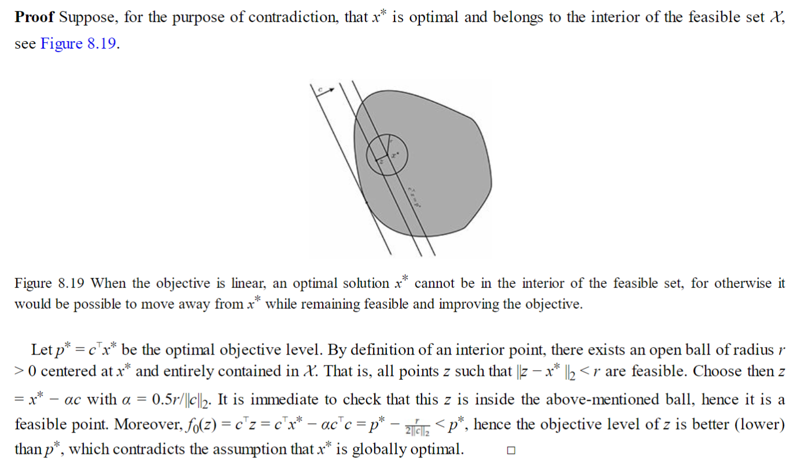

# Optimization_Problems
## Optimization Terminology
> [!def]
> 

> [!summary]
> 对于一个优化问题来说, 我们有如下几个定义:
> - **可行解集(Feasible Set)**：$X_f=\{\vec{x}\big|\vec{x}\in D,f_i(\vec{x})\leq 0,\forall i=1,2,\cdots,m,\\h_i(\vec{x})=0\forall i=1,2,\cdots, p\}$，本质上就是在定义域中且满足约束的所有的点。
> - **问题的最优值(Optimal Value)**: $p^*=\inf\{f(\vec{x})|\vec{x}\in X_f\}$。如果$X_f=\emptyset$, 则$p^*=\infty$。
> - **问题的最优解(Optimal Point/Solution)**: $\vec{x}^*\in X_f,f(\vec{x}^*)=p^*$ 
> - **问题的最优解集(Optimal Set)**: 因为很多问题不止一个最优解，所以我们如果把这些最优解放在一起就会形成一个集合，$X_{opt}=\{\vec{x}\in X_f\big|f(\vec{x})=p^*\}$
> - **问题的$\epsilon$-次优解集($\epsilon$-Optimal Set):** 对于很多的优化问题，我们的最优解并不要求函数达到最小值，或者最优解，实际问题真正的解并不要求是函数达到最小值处的解。换句话说，我们需要的是`Satisfying Solutions`，也就是次优解。即$X_{\epsilon}=\{\vec{x}|\vec{x}\in X_f,f_0(\vec{x})\leq p^*+\epsilon\}$, $\epsilon=0$时等价于最优解集，此时不等号会自动转化为等号，因为函数$f_0$的最优值一定不会小于$p^*$。
> - **问题的局部最优解(Locally Optimal):** 
> 
> - 上述的几个解集之间的包含关系:
> 

## Inequality Constraints Myth
> [!motiv]
> 为什么不等式约束都要写成$<$而不是$\leq$的形式呢?

> [!important]
> 如果$\vec{x}\in X_f$, $f_i(\vec{x})=0$, 则$f_i(\vec{x})\leq 0$为活动约束(active)。
> 反之如果$f_i(\vec{x})<0$为不活动约束(inactive)。

## Feasiblity Problems
> [!def]
> 
> 如果我们要转化成标准形式，就只需要将`find x`替换成$min~0$即可。

## Expressing Problems in Standard Form
### Box Constraints
> [!example]
> 

## Problem Transformation
> [!important]
> Details see [Problem Transformation with Examples](Methodology%20on%20Optimization.md#Problem%20Transformation%20with%20Examples) or BV 4.1.3 or C.E.G 8.3.4.4

# Convex Problem
## Standard Form
> [!def]
> 

## 狭义/广义凸优化问题
> [!important]
> 狭义凸优化问题就是满足`Standard Form`的凸优化问题，广义凸优化问题就是需要经过一些等价代数变化才能够得到`Standard Form`的凸优化问题。下面的问题就是一个广义凸优化问题:
> 

## First Order Conditions
> [!important]
> 

# Convexity of Matrix Set
> EECS127 Sp23 Homework 5 P5

> [!example]
> 

# Uniqueness of Optimal Solution
## Uniqueness of Strictly Convex Function Optimization
> [!thm]
> 

> [!proof]
> 

## Non-Constant Linear Function over Convex and Closed Set
> [!thm]
> 

> [!proof]
> 

## Non-Constant Linear Function over Strictly Convex and Closed Set
> [!thm]
> 

> [!proof]
> 

> [!example]
> 

