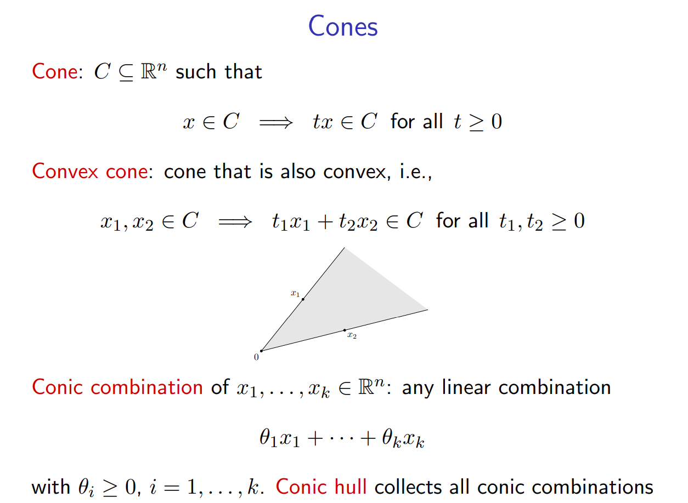
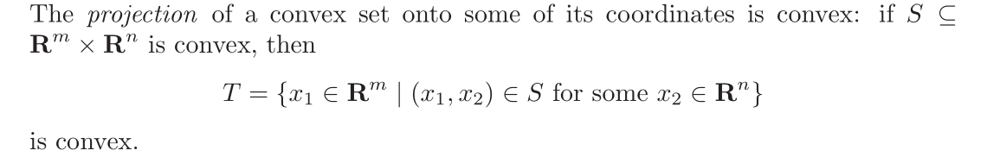
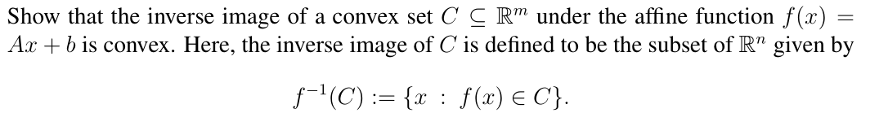
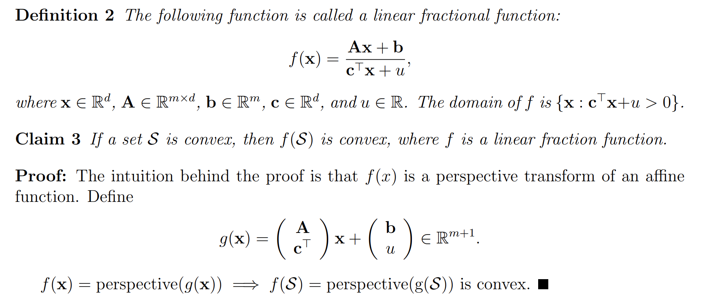
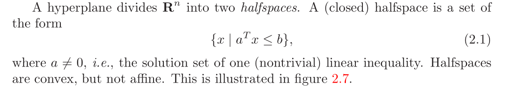
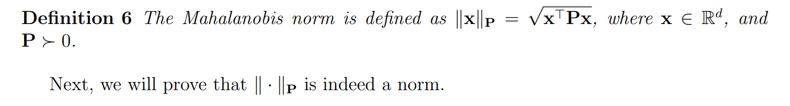
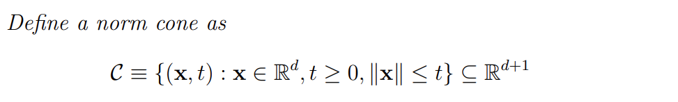
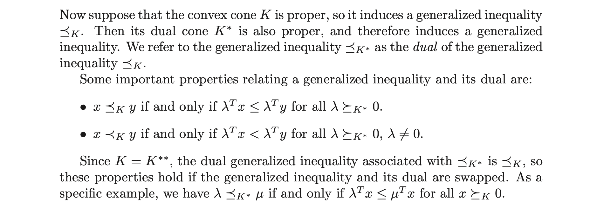
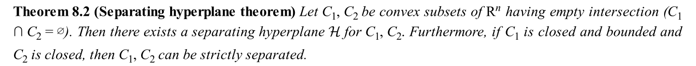
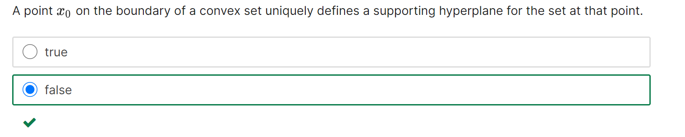

# Affine Objects
## Affine Set
### Canonical Definition
> 
> 注意这里我们没有对 $\theta$ 的取值做任何限制。

## Affine Subspaces
### Motivation
> [!motiv] Motivation
> 在给出定义之前，我们先思考这样一个问题:
> Given $\vec{v}_1,\vec{v}_{2,\cdots,}\vec{v}_k,\vec{u}\in \mathbb{R}^n$ , when is $\vec{u}\in \textbf{aff}\{\vec{v}_1,\cdots,\vec{v}_k\}$?
> 这个问题可以等价为:
> $\begin{cases} \vec{u}=\lambda_1\vec{v}_1+\cdots+\lambda_k\vec{v}_k\\1=\lambda_1+\cdots+\lambda_k\end{cases}$。
> This $Q$ is equivalent to: Is $\begin{bmatrix} \vert&\cdots&\vert&\vert\\ \vec{v_1} & \dots & \vec{v_k} & \vec{u}\\\vert&\cdots&\vert&\vert \\ 1 & \dots & 1 & 1  \end{bmatrix}$ consistent? (最后一列是增广列)。
> The solution set of $A\vec{x}=\vec{b}$是一个`affine set`$C$, `affine set`本身不是`subspace`, 因为$\vec{0}$可能不在$C$中。但是如果我们任取一个$A\vec{x}=\vec{b}$的解$\vec{x}_0$则$A(\vec{x}-\vec{x}_0)=\vec{0}$, 此时$\vec{x}-\vec{x}_{0}\in\mathcal{N}(A)$, 而$\mathcal{N}(A)$是一个`Subspace`。所以我们知道$C-x_0$是一个`subspace`。

### Subspace Definition
> [!def]
> 

## Affine Combination/Affine Hull
> **Affine Combination:**
> 
> **Affine Hull:**
> 
> **假设有三个点$x_1,x_2,x_3$, 我们分情况讨论:**
> 1. **如果 $x_1,x_2,x_3$ 线性无关**，则 $\textbf{aff}\{x_1,x_2,x_3\}$ 表示 $\mathbb{R}^2$，我们可以这样思考: 对于$\textbf{aff}\{x_1,x_2,x_3\}$来说，我们有$a_1x_1+a_2x_2+a_3x_3$ , 我们可以令$a_1+a_2=1,a_3=0$, 所以经过$x_1,x_2$的直线上的所有点都在$\textbf{aff}~C$ 中。同理，令$a_2+a_3=1,a_1=0$, 则经过$x_2,x_3$的直线上的所有点都在$\textbf{aff}~C$ 中。然后我们任取$x_1,x_2$直线上的一点$x_4$和$x_2,x_3$直线上的一点$x_5$, 然后取他们的`affine combination`, 如下图所示，我们可以得到$a_5(a_1x_1+a_2x_2)+a_6(a_3x_2+a_4x_3)=a_5a_1x_1+(a_5a_2+a_6a_3)x_2+a_6a_4x_3$, 我们可以证明这仍然是一个`affine combination`, 所以以此类推$\textbf{aff}~C=\mathbb{R}^2$。
> 
> 2. 如果$x_1,x_2,x_3$并非线性无关，即存在两个$x_i,x_{j},i\neq j$使得$x_i\parallel x_j$, 此时$\textbf{aff}~C$就是一条直线。
> 3. 如果$x_1=x_2=x_3$, 则此时$\textbf{aff}~C$就是一个点。

## Affine Dimension of a set
> [!def]
> 注意`Affine Dimension of a set`和`Dimension of an affine set`是不一样的。
> - Affine dimension of a set is the dimension of the affine hull of this set.
> - Dimension of an affine set is the dimension of the translated subspace of this affine set.
> 

# Convex Objects
## Convex Set/Convex Hull
> [!def]
> 
> 下图中展示了三个点的`Convex Combination`组成的几何图形, 是由点围成的内部的区域。
> 

## Strict Convex Set
> [!def]
> A set C is **strictly convex** if every point on the line segment connecting x and y other than the endpoints is inside the [topological interior](https://en.wikipedia.org/wiki/Interior_(topology) "Interior (topology)") of C. A closed convex subset is strictly convex if and only if every one of its [boundary points](https://en.wikipedia.org/wiki/Boundary_(topology) "Boundary (topology)") is an [extreme point](https://en.wikipedia.org/wiki/Extreme_point "Extreme point").

## Relative Interior/Boundary
> [!def]
> 

> [!example]
> 

## (Convex) Cone/Conic Hull
> [!def]
> 
> - `Being a Conex Cone`implies`Being a Convex Set`, 也就是说`Being a Convex Cone`is a stronger condition than `Being a Convex Set`。
> - `Convex Cone`has to pass the origin. 
> 	- 所以任意直线不是凸锥，直线必须过原点才是凸锥。
> 	- 所以$\mathbb{R}^n$空间的子空间一定是一个凸锥，因为首先$\mathbb{R}^n$是一个凸集，其次$\mathbb{R}^n$过原点。

> [!example] Cone over $\mathbb{R}^2$
> 

## Operations Preserving Convexity of Set
### Intersection of Convex Set
> [!def]
> 

> [!important]
> A set is convex if and only if its intersection with an arbitrary line $\{\hat{x} + tv | t \in R\}$ is convex.
> 

### Vector Space&Hyperplanes
> 

### Affine Image(仿射变换)
#### Definition
> [!def]
> 

#### Basic Examples
> [!example] Examples
> 
> $f(S)=\alpha S$可以看成$f(\vec{x})=\alpha I\vec{x}$, $f(S)=S+\alpha$可以看成$f(\vec{x})=\vec{x}+\vec{a}$本质都是`Affine Mapping`。
> 
> $f(S)$可以看成$f(\vec{x}_1,\vec{x}_2)=\begin{bmatrix} I&0\end{bmatrix}\begin{bmatrix} \vec{x}_1\\\vec{x}_2\end{bmatrix}=\vec{x}_1$, 其中$A=\begin{bmatrix} I&0\end{bmatrix}$, 且$dom(f)=S\subseteq\mathbb{R}^m\times \mathbb{R}^n$
> 
> $f(S_1\times S_2)$可以看成$f(\vec{x}_1,\vec{x}_2)=\begin{bmatrix} I&I\end{bmatrix}\begin{bmatrix} \vec{x}_1\\\vec{x}_2\end{bmatrix}=\vec{x}_1+\vec{x}_2$ 其中$A=\begin{bmatrix} I&I\end{bmatrix}$, 且$dom(f)\subseteq\mathbb{R}^m\times \mathbb{R}^n$
> 

### Inverse Affine Image
> [!def]
> 
> **Proof:**
> $\forall \vec{x},\vec{y}\in f^{-1}(C)$, we have by definition $f(\vec{x}),f(\vec{y})\in C$。Since $C$is convex, thus $\forall \theta\in[ 0,1]$, we know $\theta f(\vec{x})+(1-\theta) f(\vec{y})\in C$。Since $f$is affine, then by its property we have $\theta f(\vec{x})+(1-\theta)f(\vec{y})=f(\theta\vec{x}+(1-\theta)\vec{y})\in C$, which implies $\theta\vec{x}+(1-\theta)\vec{y}\in f^{-1}(C)$。Thus tying all these together, we have proven that $\forall \vec{x},\vec{y}\in f^{-1}(C),\theta\in [0,1]$, we have $\theta\vec{x}+(1-\theta)\vec{y}\in f^{-1}(C)$, which implies that $f^{-1}(C)$is convex.

## Functions Preserving convexity
### Perspective Function
#### Definition
> 
> 我们有如下的公式，$(-\frac{\vec{x}}{t},1)=(-P(\vec{x},t),-1)$, 也就是说我们投影后的 $x$ 轴坐标可以直接通过$-P(\vec{x},t)$给出。
> 

#### Convexity of (Inverse) Image
> 

### Linear-fractional Function
#### Definition
> 

#### Convexity
> 

#### Probability
> [!example]
> 
> 为什么$f_{ij}=\frac{p_{ij}}{\sum\limits_{i=1}^np_{kj}}$是一个`Linear-Fractional Function`呢, 我们考虑$\vec{p}=\begin{bmatrix} p_{11}&p_{12}&\cdots&p_{nm}\end{bmatrix}$, 则分子可以看成$\begin{bmatrix} 0&\cdots&1_{ij}&\cdots&0\end{bmatrix}^{\top}\vec{p}_j$, 分母就是$\begin{bmatrix} 0&\cdots&1_{1j}&1_{2j}&\cdots&1_{mj}&\cdots&0\end{bmatrix}^{\top}\vec{p}$。

## Exercises
> 
> 画图即可。
> 

# Important Convex Sets
## Hyperplane
### Definition
> 
> **Convexity:**
> $\forall \vec{x},\vec{y}\in \mathcal{H},\theta\in [0,1]$, we have $\vec{a}^{\top}(\theta \vec{x}+(1-\theta)\vec{y})=\vec{b}$, which implies that $\theta \vec{x}+(1-\theta)\vec{y}\in \mathcal{H}$.

### Properties
#### Distance between Parallel Hyperplane
> [!important]
> 
> 换句话说，我们可以在$\vec{a}^{\top}\vec{x}=\vec{b}_1$和$\vec{a}^{\top}\vec{x}=\vec{b}_2$上各自任取一点，假设为$\vec{x}_1$和$\vec{x}_2$, 并假设$(\vec{x}_2-\vec{x}_1)\parallel\vec{a}$, 即$\vec{x}_2-\vec{x}_1=\lambda \vec{a}$。同时因为$\vec{a}^{\top}\vec{x}_1=\vec{b}_1$, $\vec{a}^{\top}\vec{x}_2=\vec{b}_2$, 所以$\vec{a}^{\top}(\vec{x}_1-\vec{x}_2)=\vec{b}_1-\vec{b}_2$, 所以$\vec{a}^{\top}\lambda \vec{a}=\vec{b}_1-\vec{b}_2$, 所以$\lambda=\frac{\vec{b}_1-\vec{b}_2}{\|\vec{a}\|_2^2}$, 所以我们要求的距离就是$\|\vec{x}_2-\vec{x}_1\|=\lambda \|\vec{a}\|$, 即$\frac{\vec{b}_1-\vec{b}_2}{\|\vec{a}\|_2}$。

#### Signed Distance from a point
> [!important]
> Suppose we have a hyperplane $\mathcal{H}=\{\vec{x}:\vec{a}^{\top}\vec{x}=\vec{b}\}$ and a point $\vec{x}_1$, the signed distance from $\vec{x}_1$ to the hyperplane is $$d(\vec{x}_1,\mathcal{H})=\frac{\vec{a}^{\top}\vec{x}_1}{\|\vec{a}\|_2}$$ where:
> - If the test point is in the opposite direction of normal vector(i.e. $\vec{a}^{\top}\vec{x}_1<0$), the distance is negative.
> - If the test point is in the same direction of normal vector(i.e. $\vec{a}^{\top}\vec{x}_1>0$), the distance is positive.
> 
> Proof: Pick an arbitrary point $\vec{x}_0$ on the hyperplane that satisfy $\vec{a}^{\top}\vec{x}_0=\vec{b}$. The distance from $\vec{x}_1$ to $\mathcal{H}$ is $\|\vec{x}_1-\vec{x}_0\|$ assuming $(\vec{x}_1-\vec{x}_0)\parallel \vec{a}$.
> 
> Suppose $\vec{x}_1-\vec{x}_0=k\vec{a}$, then $$\vec{a}^{\top}(\vec{x}_1-\vec{x}_0)=\vec{a}^{\top}k\vec{a}=k\|\vec{a}\|_2^2=\vec{a}^{\top}\vec{x_1}$$
> Thus $k=\frac{\vec{a}^{\top}\vec{x}_1}{\|\vec{a}\|_2^2}$.
> Finally the signed distance is $$\|\vec{x}_1-\vec{x}_0\|_2=k\|\vec{a}\|_2=\frac{\vec{a}^{\top}\vec{x}_1}{\|\vec{a}\|_2}$$

## Halfspaces
### Definition
> 
> **Convexity:**
> $\forall \vec{x},\vec{y}\in \mathcal{H},\theta\in [0,1]$, we have $\vec{a}^{\top}(\theta \vec{x}+(1-\theta)\vec{y})\leq \geq\vec{b}$, which implies that $\theta \vec{x}+(1-\theta)\vec{y}\in \mathcal{H}$。要注意这里$\theta\geq 0$且$1-\theta\geq 0$，是因为这个性质我们才能流畅地在等式左右两边乘以$\theta$或者$1-\theta$而不改变不等号的方向。

### Voronoi Description
>  

### Properties
#### Subset Relationship
> 
> **First Condition:**
> $(\implies)$: Proof by Contradiction，有几种情况:
> 1. 假设  $\tilde{a}$和$a$不平行，则存在一个向量$v$使得$a^{\top}v=0$且$\tilde{a}^{\top}v\neq 0$(我们总是可以取沿着半平面分界线的方向的向量)。然后就是证明中非常精彩的部分了，现在我们想要找到一个点，使它$\in \mathcal{H}$但是$\notin \mathcal{\tilde{H}}$。构造的方法就是先取一个点$\hat{x}\in \mathcal{H}\cap \tilde{\mathcal{H}}$, 此时$a^{\top}\hat{x}\leq b$且$\tilde{a}^{\top}\hat{x}\leq \tilde{b}$，然后注意到$a^{\top}(\hat{x}+tv)=a^{\top}\hat{x}\leq b,\forall t$, 所以$\hat{x}+tv\in \mathcal{H},\forall t$。但是同时对于$\tilde{a}^{\top}(\hat{x}+tv)=\tilde{a}^{\top}\hat{x}+t\tilde{a}^{\top}v$, 所以总是存在一个$t$使得$\tilde{a}^{\top}\hat{x}+t\tilde{a}^{\top}v>b$, 即$\hat{x}+tv\notin \mathcal{\tilde{H}}$。所以存在一个点，因为$\tilde{a}$和$a$不平行, 所以这个点它$\in \mathcal{H}$但$\notin \mathcal{\tilde{H}}$, 这与我们的假设矛盾，所以原命题成立。附上一张图加深这个证明方法的理解。
> 

> 2. 假设$\tilde{a}$和$a$平行但是$\lambda<0$(即两个半平面的朝向相反)，则:
> 

> 3. 假设$\tilde{a}$和$a$平行且$\lambda >0$但是$\tilde{b}< \lambda b$, 则:
> 

> $(~\Longleftarrow~)$: 这个方向比较好证
> 
> **Second Condition:**
> 和上面`First Condition`类似。

## Euclidean Balls
> [!def]
> 
> **Convexity:**
> 
> 

## Ellipsoids(椭球)
### Definition
> [!def]
> 
> - 对于$(2.4)$中的定义，我们知道, 如果$A=P^{\frac{1}{2}}$，则: 
> $\begin{aligned}(x_c+P^{\frac{1}{2}}u-x_c)^{\top}(P^{\frac{1}{2}})^{-2}(x_c+P^{\frac{1}{2}}u-x_c)&=(P^{\frac{1}{2}}u)^{\top}(P^{\frac{1}{2}})^{-2}(P^{\frac{1}{2}}u)\\&=u^{\top}(P^{\frac{1}{2}})^{\top}(P^{\frac{1}{2}})^{-2}P^{\frac{1}{2}}u\\&=u^{\top}u\leq 1\end{aligned}$
> 这符合$(2.3)$的定义。
> - 同时这里的$A$不唯一，如果我们将$AQ$（$Q$是一个正交矩阵）替换$A$, 则仍然满足$(2.3)$的定义。但是如果我们假定$A$是正定矩阵，则唯一。
> - 几何上说，$Au$ 就是对单位球 “旋转-拉伸-旋转”为椭球，而$x_c+Au$ 就是再将这个椭球中心平移到 $x_c$。
> - 同时如果令$P=r^2I$则，$\mathcal{E}$是一个`Norm Ball`with radius $r$。

### Mahalanobis Norm
> 

### Convexity
> 

## Norm Balls
> **Definition: Norm Ball** with center $\vec{x}_c$and radius $r$: $\{\vec{x}:\|\vec{x}-\vec{x}_c\|\leq r\}$
> **Convexity:**
> 

## Polyhedra
> [!def]
> 
> **Convexity:**
> $\forall \vec{x},\vec{y}\in\mathcal{P},\theta\in [0,1]$, we have $A\vec{x}\leq \vec{b}$and $C\vec{x}=\vec{d}$and $A\vec{y}\leq \vec{b}$and $C\vec{y}=\vec{d}$, thus we can obtain  $A(\theta \vec{x}+(1-\theta)\vec{y})\leq \theta\vec{b}+(1-\theta)\vec{b}=\vec{b}$ and $C(\theta \vec{x}+(1-\theta)\vec{y})= \theta\vec{d}+(1-\theta)\vec{d}=\vec{d}$, which implies that $\mathcal{P}$is a convex set.

## Simplex
### Affine/Linear Independence
> [!def]
> 

> [!proposition]
> 

> [!proof] Proof for Proposition
> 

### Simplex Definition
> [!def]
> 
> 
> 

> [!example] $R^2$ 空间的例子
> 
> 在$\mathbb{R}^2$空间中，我们只能构建出$(a)$和$(b)$中的单纯型吗，分别对应线段和三角形。因为在$\mathbb{R}^2$空间中我们无法找到三组线性无关的向量（四个点构成，如$(c)$所示, $\vec{x}_2-\vec{x}_{1,}\vec{x}_3-\vec{x}_1,\vec{x}_4-\vec{x}_1$是线性相关的），所以也自然无法构建出有四条边的单纯型。

> [!example] $R^3$空间中的一个例子
> 

### Simplex is a Polyhedra
> [!important] 
> 

###  Affine Dimension of Simplex
> 假设我们有$k+1$个点$\vec{x}_0,\cdots,\vec{x}_{k}$, 他们`affinely independent`, 则我们可以构造`simplex`: $C=conv\{\vec{x}_0,\cdots,\vec{x}_{k}\}$。
> $C$ 的`Affine Dimension`是$dim(aff(C)-\vec{x}^*)$ ($aff(C)$表示$C$的`affine hull`, 且$\vec{x}^*\in aff(C))$。

## Important Solution Sets
### Linear Matrix Inequality
> [!example] 在控制理论中非常重要，后面会有详细介绍，这里不做展开。
> 
> 其中$A(x)\preceq B$等价于$A(x)-B\preceq 0$, 即$A(x)-B$是半负定的。
> 

> [!proof]
> 定义$A(X)=X_1A_1+\cdots+X_nA_n$,其中$X_{i},A_{i},B\in \mathbb{S}_+^n$。
> 我们可以定义仿射变换$f(X):= B-A(X)$, 则$f^{-1}(S_+^n)=\{X|B-A(X)\succeq 0\}$。假设$dom(f)=\mathbb{S}_+^n$，则 $f$ 实际上是一个从矩阵空间到矩阵空间的仿射映射，因为$\mathbb{S}_+^n$是一个凸集，所以$f(\mathbb{S}_+^n)$也是凸集。
> 本例中，我们可以将矩阵$A_i$当成是标量，$X_i$看成是变量，就会好理解很多。

### Quadratic Inequality
> [!example]
> 
> **Solution(a):**
> 
> 
> **Some Remarks:**
> 
> 
> **Solution (b):**
> 
> 

## Exercises
### Applying Definitions
> [!example] Exercise 1
> 
> 1. 首先$S$一定是`Convex`的，因为:
> 
$\forall \vec{x},\vec{y}\in S, \theta\in [0,1]$, $\begin{aligned}\theta x_1 + (1-\theta) y_1&+\theta x_2 e^{-t}+ (1-\theta) y_2e^{-t}+\theta x_3 e^{-2t}+ (1-\theta) y_3e^{-2t}\\&=\theta(x_1+x_2e^{-t}+x_3e^{-2t})+(1-\theta)(y_1+y_2e^{-t}+y_3e^{-2t})\\&\leq \theta\times 1.1+(1-\theta)\times 1.1\\&=1.1\end{aligned}$
> 所以$\theta\vec{x}+(1-\theta)\vec{y}\in S$。要注意上面的推导中的一个重要前提是$\theta\in [0,1]$, 这也蕴含了$\theta$和$1-\theta$都大于等于零这一条件，这就导致我们在已知$x_1+x_2e^{-t}+x_3e^{-2t}\leq 1.1$和$y_1+y_2e^{-t}+y_3e^{-2t}\leq 1.1$的情况下可以在等式两边同时乘以$\theta$或者$1-\theta$而不改变不等式的符号然后直接相加。
> 2. 而`Being Convex doesn't imply being affine`，对于`Affine Combination`我们并没有对$\theta$的取值范围做任何限制，所以如果我们取$\theta=-1$, $x_1=1.1,x_2=0,x_3=0$和$y_1=0,y_2=1.1,y_3=0$则$\theta \vec{x}+(1-\theta)\vec{y}=(-1.1,2.2,0)$此时$-1.1+2.2e^{-t}>1.1$for some $t\geq 1$。所以$S$并不是`Affine`的。
> 3. 答案有错误，这个集合应该也是`Polyhedra`，因为它可以看成一些列的`halfspace`的交集。$t=1,2,3,\cdots$每一个 $t$ 对应着一个`Halfspace`。

> [!example] Exercise 2
> 
> 

### Probability
> [!example]
> 
> **Solution:**
> 
> 
> 

# Important Convex Cones
## Norm Cones
### Definition
> 
> **Convexity:**
> $\forall (\vec{x},t_1),(\vec{y},t_2)\in \mathcal{C},\theta_1,\theta_2\geq 0$ , for $(\theta_1\vec{x}+\theta_2\vec{y},\theta_1 t_1+\theta_2t_2)$we have $\|\theta_1 \vec{x} + \theta_2\vec{y}\|\leq \theta_1\|\vec{x}\|+\theta_2\|\vec{y}\|=\theta_1 t_1+\theta_2t_2$, thus $(\theta_1\vec{x}+\theta_2\vec{y},\theta_1 t_1+\theta_2t_2)\in \mathcal{C}$, which proves that it is a convex cone.

### Second Order Cones
> 

## Normal Cones
> [!def]
> 
> 
> **Convexity:**
> 
> What this graph is saying is that if we pick a point $\vec{x}\in C$, we have to find a vector $\vec{g}$(direction) such that the angle between $\vec{y}-\vec{x}$(a vector) and the $\vec{g}$ should be bigger then 90 degrees for all $\vec{y}\in C$.
> - At the top left and middle$\vec{x}$ , there only exists one such $\vec{g}$.
> - At the bottom right $\vec{x}$, there exists some $\vec{g}$.
> 
> **Note:**
> Normal Cone is useful in subgradient analysis, which is detailed in [Subgradient_Differentials](Subgradient_Differentials.md)

## Positive Semidefinite Cones
> 

# Generalized Inequalities
## Proper Cone
> [!def]
> 
> `Pointed`指的是有方向，一个`Cone`只能按照特定方向辐射。
> 
> 

## Inequalities over R^n
> [!important]
> 

## Minimum and Minimal
> 

## Dual Norm
### Definition
> [!def] Definition
> 

### Examples
> [!example] Dual Norm of Euclidean Norm
> 

> [!example] Dual Norm of $l_{{\infty}}$ Norm
> 

> [!example] Dual Norm of $l_{2}$ Norm on Matrices
> 

## Dual Cone
### Definition
> [!def]
> 

 
### Properties
> [!thm] 
> 

> [!proof]
> 

### Self-Dual Examples
> [!example] Subspaces
> 

> [!example] Positive Semidefinite Matrices
> 

> [!example] Dual of a Norm Cone
> 

### Dual Cone Inequalities
> [!def]
> 

# Supporting and Separating Hyperplanes
## Separating Hyperplane  Theorem
### Theorem
> [!thm]
> 
> **Rephrase This:**
> Let $C,D$be convex set and $C\land D=\emptyset$, then $\exists$hyperplane $\vec{a}^{\top}\vec{x}=b$such that $\forall \vec{x}\in C$ $\vec{a}^{\top}\vec{x}\geq b$and that $\forall \vec{y}\in D$, $\vec{a}^{\top}\vec{y}\leq b$。
> 如果`C,D`不全是`Convex Sets`的话，上述定理不一定成立。
> 

### Proof by Contradiction
> [!proof]
> 假设存在$\vec{c}\in C$, $\vec{d}\in D$, $dist(C,D)=\inf\{\|\vec{c}-\vec{d}\|_2~|~\vec{c}\in C,\vec{d}\in D\}$, 即$\vec{c}$和$\vec{d}$是$C$和$D$中距离最近的两个点。
> 我们证明存在性: 
> Consider $\vec{d}-\vec{c}$as normal that passes through $\frac{\vec{d}+\vec{c}}{2}$, 我们想要套用`Hyperplane`的定义$\vec{a}^{\top}(\vec{x}-\vec{x}_0)$($\vec{x}_0$是`Hyperplane`上的一点)。于是我们考虑对$\vec{x}\in C\lor \vec{y}\in D$套用定义$(\vec{d}-\vec{c})^{\top}(\vec{x}-\frac{\vec{d}+\vec{c}}{2})$。
> 于是我们定义$f(\vec{x})=(\vec{d}-\vec{c})^{\top}(\vec{x}-\frac{\vec{d}+\vec{c}}{2})$其中$f(\vec{x})=0$是我们的`Hyperplane`的表达式。
> 于是我们有$f(\vec{c})=-\frac{1}{2}\|\vec{d}-\vec{c}\|_2^2$$f(\vec{d})=\frac{1}{2}\|\vec{d}-\vec{c}\|_2^2$，而我们想要$\forall \vec{x}\in D, f(\vec{x})\geq 0$and that $\forall \vec{x}\in C, f(\vec{x})\leq 0$。
> 我们先使用`Proof By Contradiction`证明$\forall \vec{x}\in D, f(\vec{x})\geq 0$，我们假设$\exists \vec{u}\in D,~~s.t.~~f(\vec{u})<0$, 并尝试推矛盾。
> 

### Concept Check
> 
> 只要条件得当，两个非凸集也可以被一个超平面分割。

## Supporting Hyperplane Theorem
### Theorem
> [!thm]
> 

### Proof By Applying Separating Theorem
> [!proof]
> 我们只需要对$\{x_0\}\subseteq\mathbf{bd}C$和$\mathbf{int}C$这两个`Convex Set`使用`Separating Hyperplane Theorem`就可以完成证明。

### Concept Check
> 
> 试想一个有尖点的凸集。

# Chapter Exercises
> **Chapter 2**: 2.1, 2.2, 2.5, 2.7,  2.10, 2.16, 2.18, 2.19

## 2.2 Intersection with arbitrary lines
> [!important]
> 

## 2.10 Solution Set of a quadratic inequality
> [!important]
> 

## 2.16 Operations that Preserve Convexity
> []