#  Motivation for Lagrangian
## Primal Problem
> [!def]
> 

## Indicator Form - Unconstrained Formulation
> [!important]
> 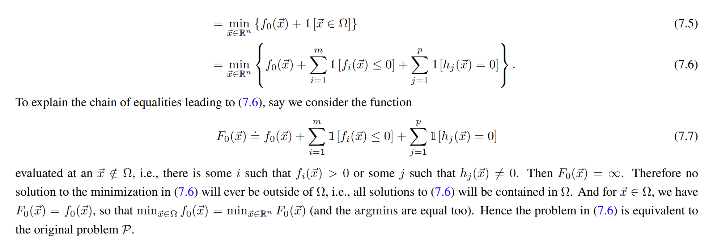
> 所以我们可以将原问题转化成等价的`Indicator-Unconstrained Formulation`, 但是这个$F_0(\vec{x})$是不可导的，所以我们的梯度下降算法不能正常工作。
> **注意: 这个问题等价于原问题!**

## Lagrangian - Differentiable Approximation
> [!important]
> 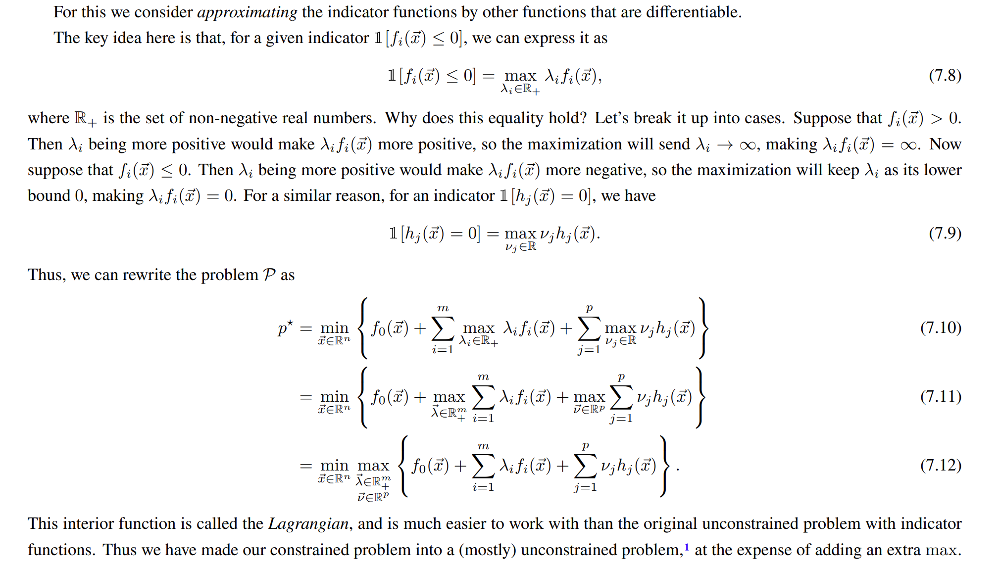
> **注意: 这个问题等价于原问题!**
> 但是如果仅仅是$min_{\vec{x}\in \mathbb{R}^n}L(\vec{x},\vec{\lambda},\vec{v})$, 则这个问题和原问题不等价。

# Lagrangian Form
## Definition
> [!def]
> 

## Properties
> [!property]
> 

## Practical Examples
### Quadratic Inequality
> [!example] Quadratic Inequality
> 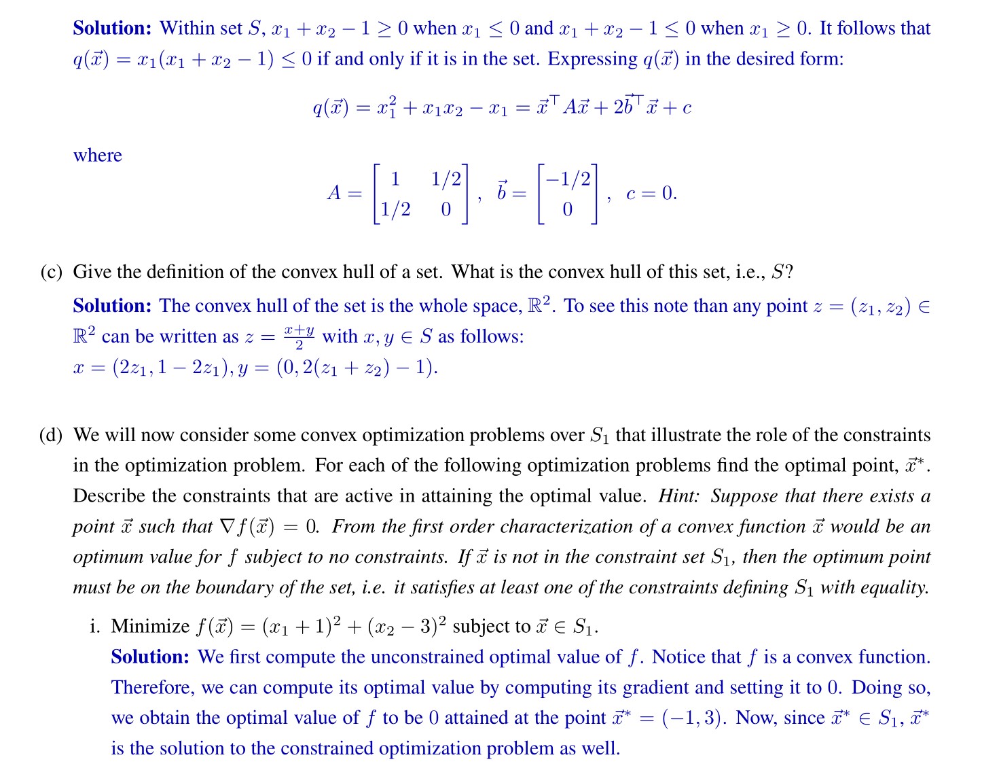

# Weak Duality
## Motivation
> [!motiv] Motivation
> 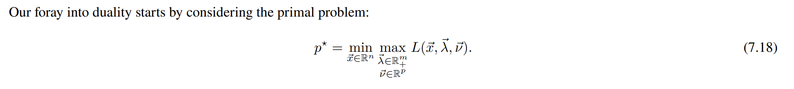

## Dual Problam
### Definition
> [!def]
> 
 

### Properties
> [!property] Concaveness
> 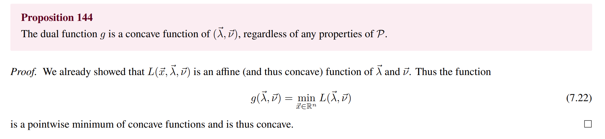

> [!property] Inequality Relationship
> 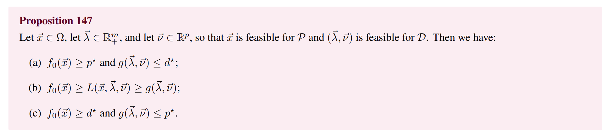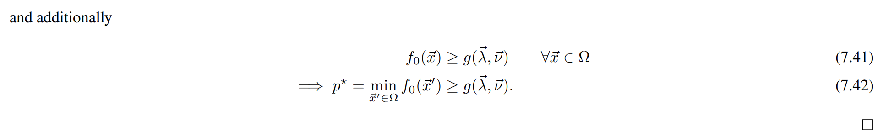

## Deriving Dual Function
### Convex Lagrangian
> [!example] Disc08 P1 Fa22
> 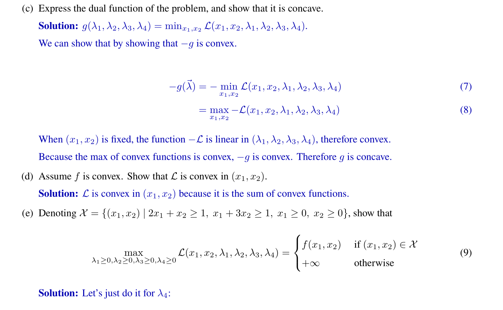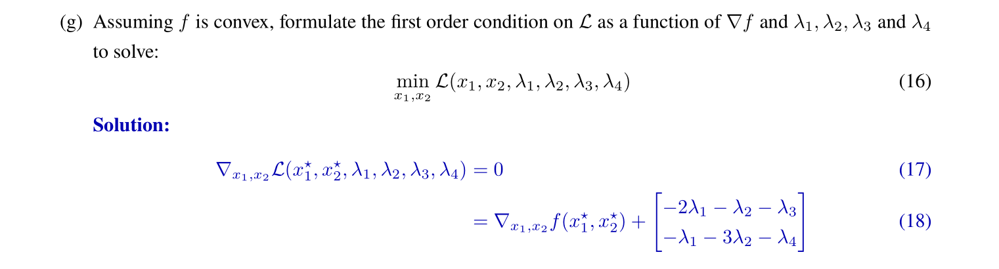

> [!example] Disc08 P2 Fa22
> 

> [!example] Lecture Notes Example Fa23
> 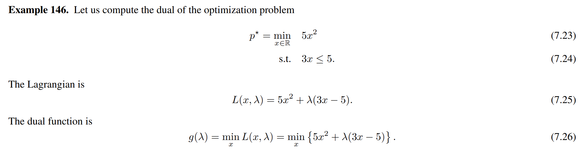

### Unbounded Lagrangian
> [!example] Lecture Note Fa23 Linear Program
> 

> [!example] Lecture Note Fa23 Shadow Price
> 

## Types of Duality
> [!def]
> 

# Minmax Inequality
> [!property] Minimax Inequality
> 
> **We will provide a clearer proof for Proposition 150:**
> For fixed $x_0\in X,y_0\in Y$, we define:
> $$\begin{align}h(y_0)=min_{x\in X}f(x,y_0)\\g(x_0)=max_{y\in Y}f(x_0,y)\end{align}$$
> Then:
> $$h(y_0)=min_{x\in X}f(x,y_0)\leq f(x_0,y_0)\leq max_{y\in Y}f(x_0,y)=g(x_0),\forall x_0,y_0\in X\times Y$$
> So we have:
> $$\forall x_0,y_0\in X\times Y,h(y_0)\leq g(x_0)$$
> Then we know that:
> $$max_{y_0\in Y}h(y_0)\leq min_{x_0\in X}g(x_0)$$
> Finally we conclude that:
> $$max_{y\in Y}min_{x\in X}f(x,y)\leq min_{x\in X}max_{y\in Y}f(x,y)$$
> **Then the proof for Proposition 149 goes as below:**
> 
> 
> **Vector Version of Proposition 150:**
> 
> 证明的核心思想就是如果一个不等式对所有$\vec{x},\vec{y}$均成立，那么对某一个$\vec{x}_0,\vec{y}_0$肯定也成立。

# Certificate of Optimality
> [!important]
> 

# Strong Duality
## Slater's Condition - Theorem
> [!thm]
> **Refined Slater's Conditions:** 当有一些不等式约束是`Affine Functions`时使用。
> 
> **Slater's Condition:**
> 
> 
> Note that Slater's Condition Only Works for Convex Problems.

> [!proof] Proof Sketch
> 

## Slater's Condition - Geometric Interpretation
> 

## Practical Examples
### Recover the Solutions to Primal Problems
> [!example] Lecture Notes
> 

### Changing Constraints to Obtain Strong Duality
#### Strong Duality Doesn't Hold
> [!example] Disc 09 P1 Fa22
> 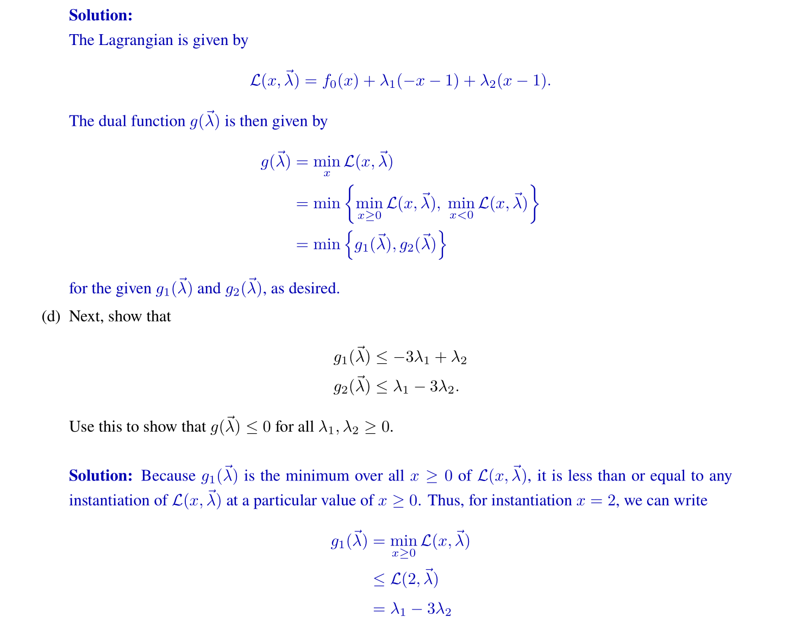

#### Strong Duality Holds
> [!example]
> 

### Convexity Alone doesn't guaratee Strong Duality
> [!example] EECS127 Fa22 HW10 P1
> 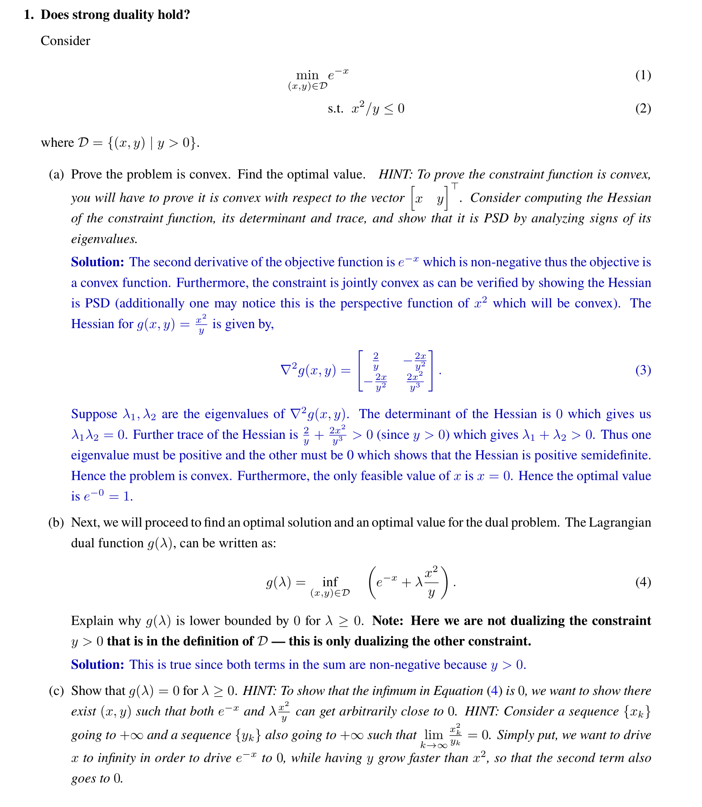

# KKT Conditions
## Main Theorem
> [!thm]
> 
> 其中:
> 1. $\lambda_i>0$ 的时候，表明我们的最优解在边界上。
> 2. $\lambda_i=0$的时候，表明我们的最优解在Critical Points。 

## Some Important Propositions
> [!thm]
> 

> [!thm]
> 
> The key logic is that convexity implies that any variable that fulfills stationary condition is a global minimizer of the primal problem.

> [!corollary]
> 

## Important Summary
> [!summary]
> 

## Practical Examples
> More examples see [Methodology on Optimization](Methodology%20on%20Optimization.md)
### Complementary Slackness
> [!example] Disc 10 P2 Fa22
> 

# Dual of the Dual
## Linear Program
> [!important]
> 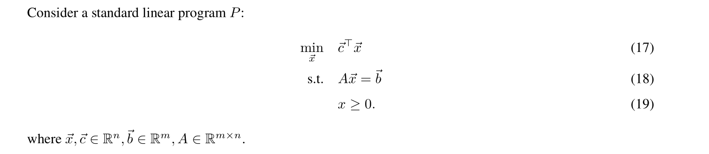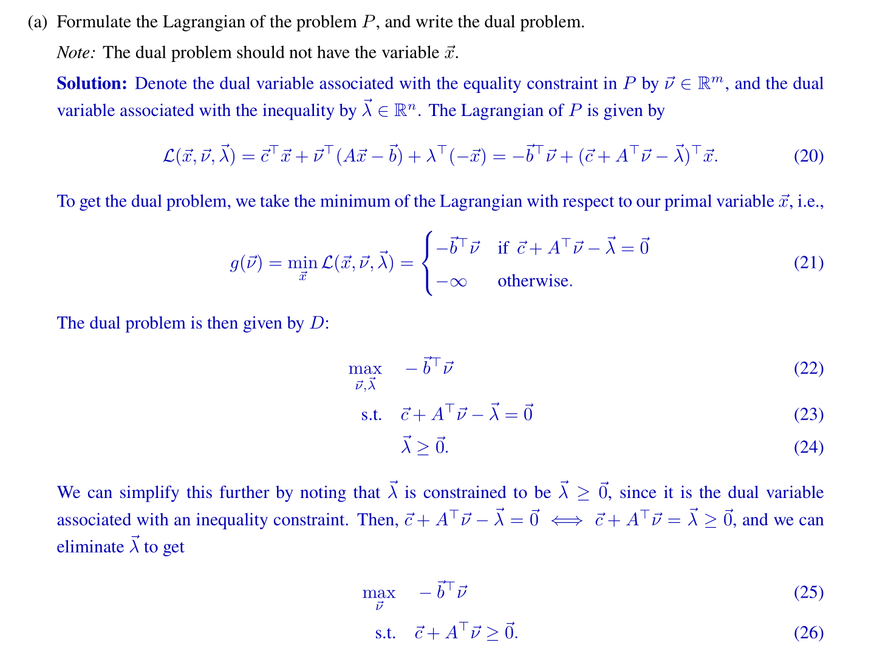

# Duality of Norms
## Dual Norm - Functional Analysis
> [!def]
> In functional analysis, the dual norm is a measure of size for a continuous linear function defined on a normed vector space.
> 

## Duality of L1 and L-inf
> [!example] EECS127 Fa22 Disc11 P1
> 
> This problem makes very clever use of the sign function.

# Code Experiments
## Experiment 1: Comparison between Primal and Dual - Linear Program
> [!example] HW09 Fa22 P3 
> 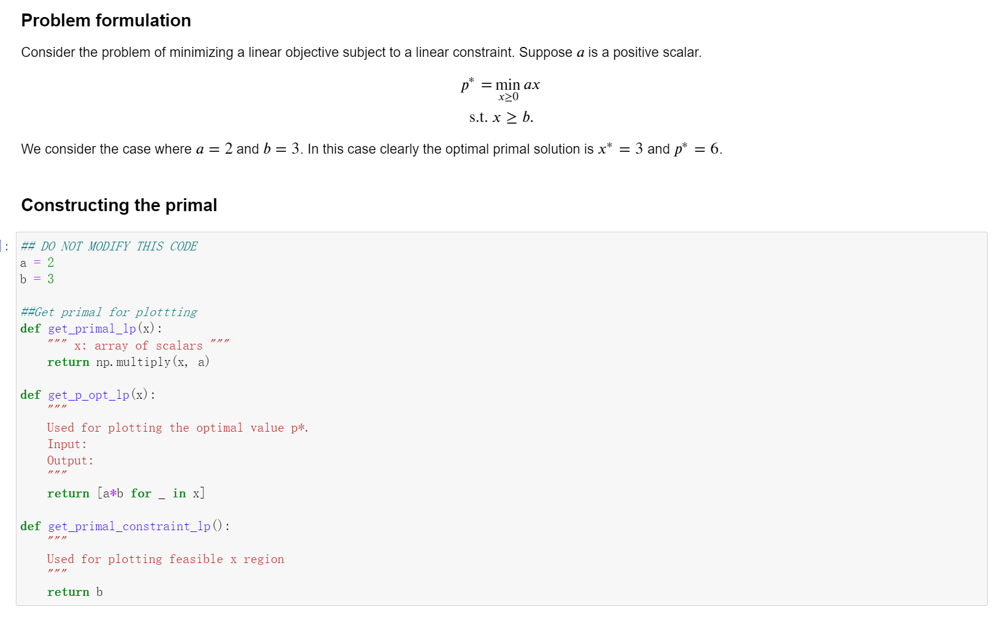

## Experiment 2: Minimzing Exponentials
> [!example] HW09 Fa22 P3
> 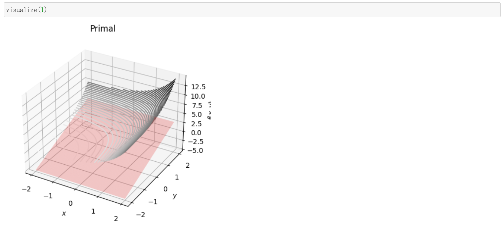

 

