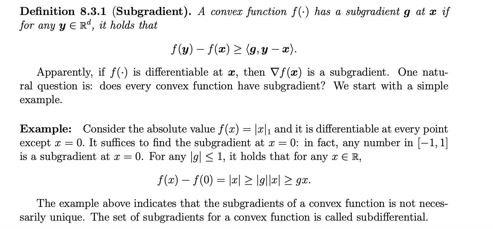
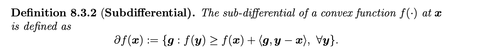
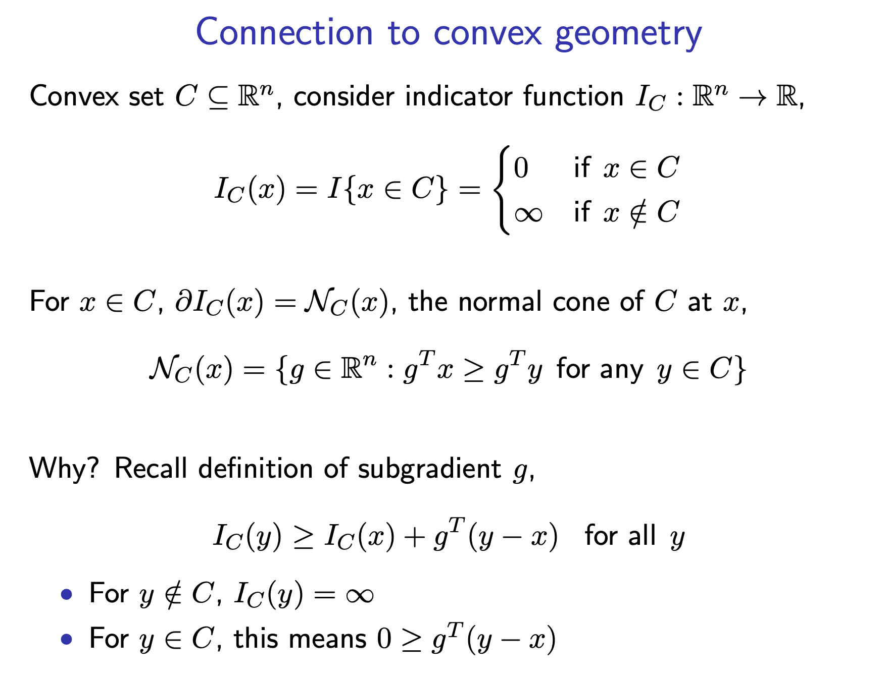
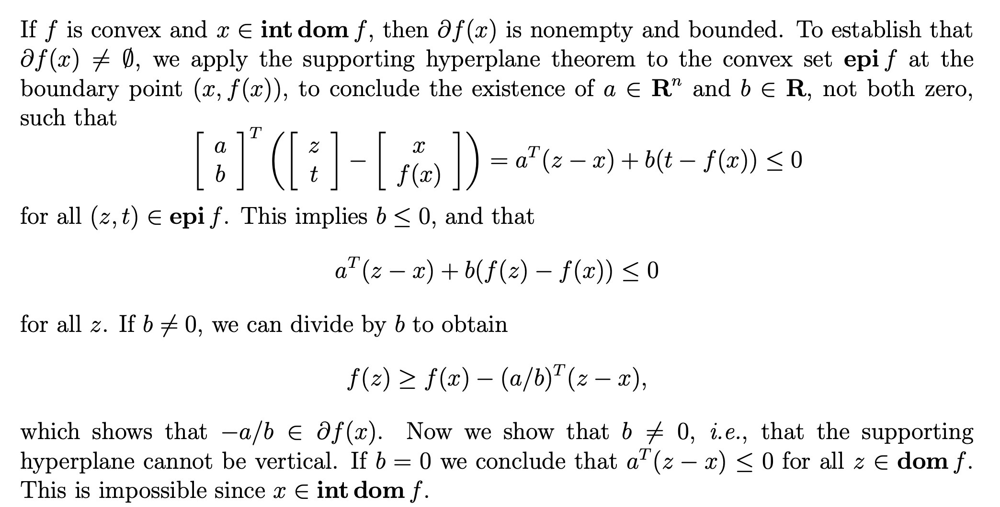
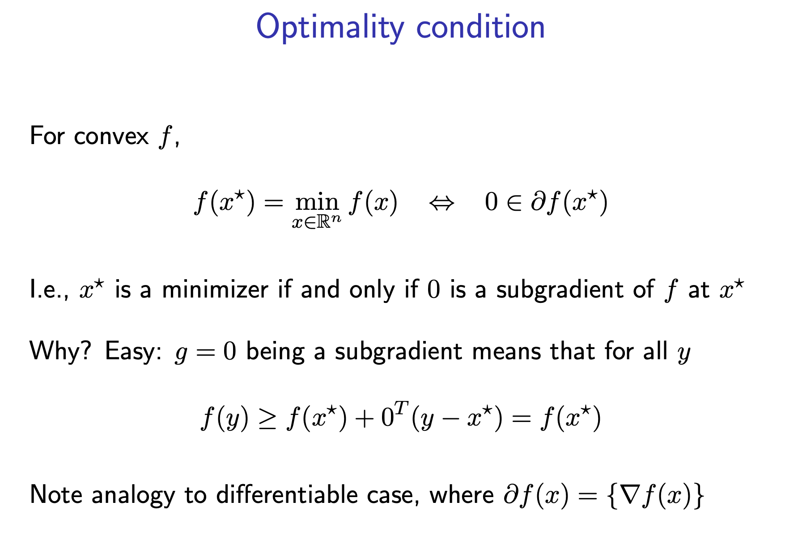

# Subgradient
## Formal Definition
> [!def]
> 
> Several things to note:
> 1. It always exist for convex function.
> 2. If $f$ is differentiable at $\vec{x}$, then $g=\nabla f(\vec{x})$ uniquely.
> 3. For non-convex function, subgradient doesn't necessarily exist.

## Examples
> [!example] $f(\vec{x})=\|\vec{x}\|_1$
> $$\begin{aligned}f(y)=\|y\|_1 & =\sum_{i=1}^n\left|y_i\right|=\sum_{i=1}^n \max _{\left|g_i\right| \leq 1} g_i y_i \\& \geq \sum_{i=1}^n g_i y_i, \quad \forall g:\|g\|_{\infty} \leq 1 .\end{aligned}$$
> Hence, for all $y \in \mathrm{R}^n$ it holds that$$f(y) \geq f(0)+g^{\top}(y-0), \forall g:\|g\|_{\infty} \leq 1 .$$

# Subdifferential
## Formal Definition
> [!def]
> 
> We can think of subdifferential of a convex function as a set that contains all the valid subgradients.

## Properties
### Connection to Normal Cone
> [!property]
> Recall on the definition of [Normal Cones](Convex_Sets.md#Normal%20Cones)
> 

### Existence and Uniqueness
> [!property] 
> 

### Optimality Condition
> [!property] Optimality Condition
> If $\vec{0}\in \partial f(\vec{x})$, then $\vec{x}$ is the global minimizer.
> 

# Subgradient Calculus

