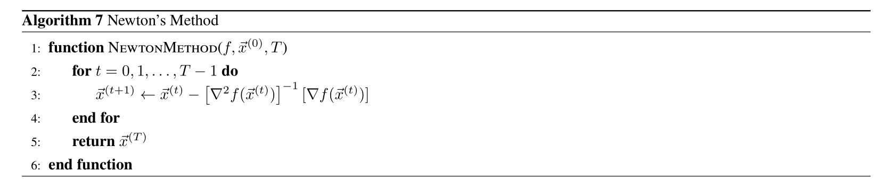
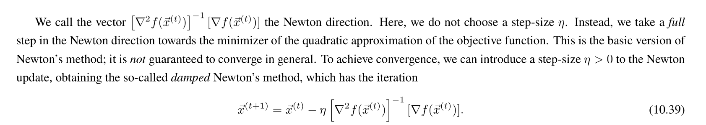
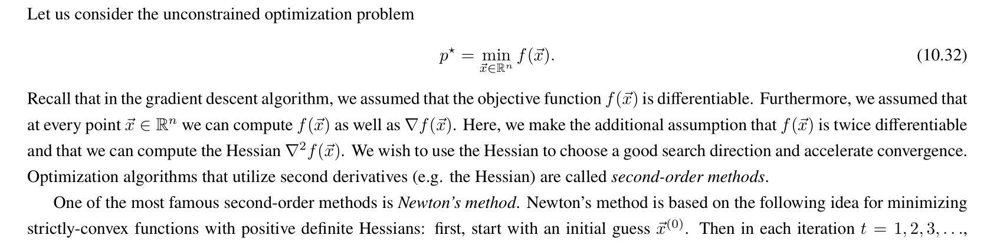
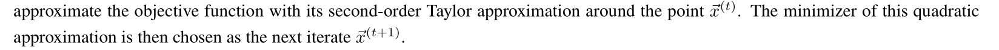
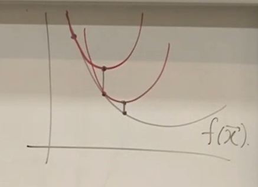
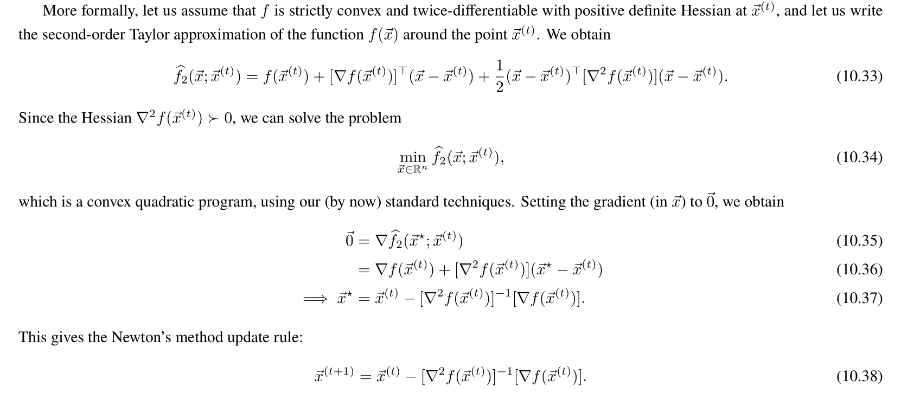
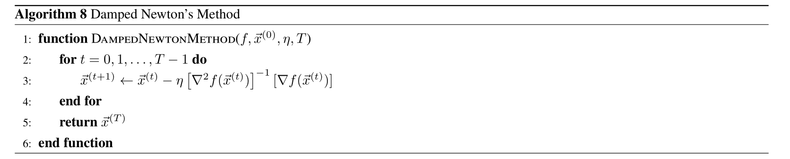
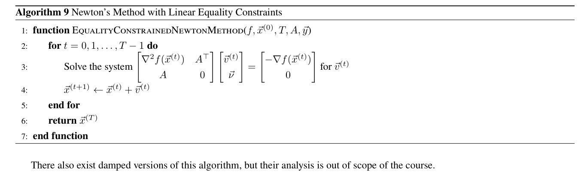

# Newton's Method - Second Order Method
## Newton's Method/Newton's Direction
> [!algo]
> 
> Note that for traditional newton's method, we don't choose step size.

## Theorem - Quadratic Approximation
> [!thm]
> 
> Pictorically we have:
> 
> 
> where we follow the direction connected by dots.
> 
> 
> Also recall in the [Solving Uncontrained Quadratic Programs](../5_Types_of_Optimization_Programs/Quadratic_Programs.md#Solving%20Uncontrained%20Quadratic%20Programs), for an unconstrained quadratic program, we must have the following theorem, if $H\in \mathbb{S}_+$ and $\vec{c}\in\mathcal{R}(H)$, then:
> $$\begin{gathered}\frac{1}{2} \vec{x}^{\top} H \vec{x}+\vec{c}^{\top} \vec{x}+d \\x^*=-H^{-1} \vec{c} .\end{gathered}$$
> 
> So by pattern matching we should have the newton's direction as derived above.

## Convergence Analysis

## Complexity Analysis

## Summary - Pros and Cons
> [!summary]
> Pros:
> 1. Converge faster than G.D.
> 
> Cons:
> 1. Hessian Inversion can be expensive

# Damped Newton's Method
> [!algo]
> 

# Newton's Method with Linear Equality Constraints
> [!motiv] Motivation
> Now suppose we have the following quadratic programs, where $H\in \mathbb{S}_{++}$:
> $$\begin{aligned}& \min \frac{1}{2} \vec{x}^{\top} H \vec{x}+\vec{c}^{\top} \vec{x}+d \\& \text { s.t. } A \vec{x}=\vec{b} .\end{aligned}$$
> Then we compute the Lagrangian of it to transform it into unconstrained form:
> $$L(\vec{x}, \vec{v})=\frac{1}{2} \vec{x}^{\top} H \vec{x}+\vec{c}^{\top} \vec{x}+d+\vec{\nu}^{\top}(A \vec{x}-\vec{b}) .$$
> Now since the problem is convex and strong duality holds, we can compute the KKT conditions as follows:
> $$\begin{aligned}& A \vec{x}^*=\vec{b} \\& H \overrightarrow{x^*}+\vec{c}+A^{\top} \vec{v}^*=0 \end{aligned}\} K K T \cdot \text { (Necessary and Sufficient) }$$
> Then we could transform it into:
> $$\left[\begin{array}{cc}H & A^{\top} \\A & 0\end{array}\right]\left[\begin{array}{c}\vec{x}^* \\\vec{\nu}^*\end{array}\right]=\left[\begin{array}{c}-\vec{c} \\\vec{b}\end{array}\right] \text {. }$$
> then if $\left[\begin{array}{cc}H & A^{\top} \\ A^{\top} & 0\end{array}\right]$ is non-singular, I have a unique solution.

> [!example]
> Since the above objective function is twice differentiable, we would want to use Newton's Method. But traditional newton's method only works without constraints. So we would twick the framework a little bit as follows.
> 
> We will start with some $\vec{x}_0$ such that $A\vec{x}_0=\vec{b}$ and obtain a quadratic approximation of this function and optimize it over $\vec{v}$ :
> $$\begin{aligned} \min \hat{f}\left(\vec{x}_0+\vec{v}\right)&=f\left(\vec{x}_0\right)+\nabla f\left(x_0\right)^{\top} \vec{v}+\frac{1}{2} \vec{v}^{\top} \nabla^2 f\left(\vec{x}_0\right) \vec{v} \\ \text { s.t. } &A\left(\vec{x}_0+\vec{v}\right)=\vec{b} \\& A \vec{v}=\vec{0}\end{aligned}$$
> Then following the same logic in the above example, we have:
> $$\left[\begin{array}{cc}\nabla^2 f(x) \cdot & A^{\top} \\A & 0\end{array}\right]\left[\begin{array}{c}\vec{u} \\\vec{v}\end{array}\right]=\left[\begin{array}{c}-\nabla f\left(x_0\right)^{\top} \\0\end{array}\right]$$
> 
> And we can solve it quickly.
> 
> After that we can obtain the minimizer for each step of the newton's method and progress to the main algorithm.

> [!algo]
> 

# Quasi-Newton's Methods
> [!def]
> All of our discussion thus far has been under the assumption $\nabla^2 f\left(\vec{x}^{(t)}\right) \succ 0$. 
> 
> If the Hessian is not positive definite, one may adaptthe algorithm accordingly, forming a new class of methods called quasi-Newton’s methods.

