[Lecture0A_Jun22_2020.pptx](https://www.yuque.com/attachments/yuque/0/2023/pptx/12393765/1674796897122-5a8182bc-089b-41da-b084-e150f97e3e3d.pptx)
[Written_Notes0.pdf](https://www.yuque.com/attachments/yuque/0/2023/pdf/12393765/1674797055987-99411b9c-312a-467c-92cb-04d4ad027edf.pdf)
[Note0.pdf](https://www.yuque.com/attachments/yuque/0/2023/pdf/12393765/1674796965091-f0ccc31c-bebd-473d-84f5-62eace9755f4.pdf)
[Note1.pdf](https://www.yuque.com/attachments/yuque/0/2023/pdf/12393765/1674797429736-a6e798ce-39aa-4880-865f-36120c85a96b.pdf)
[Written_Notes1.pdf](https://www.yuque.com/attachments/yuque/0/2023/pdf/12393765/1674797430165-4447aef2-a870-4007-aaf4-7ba021c5bd03.pdf)

# 1 Tomography&Imaging Basics
## Definition
:::info
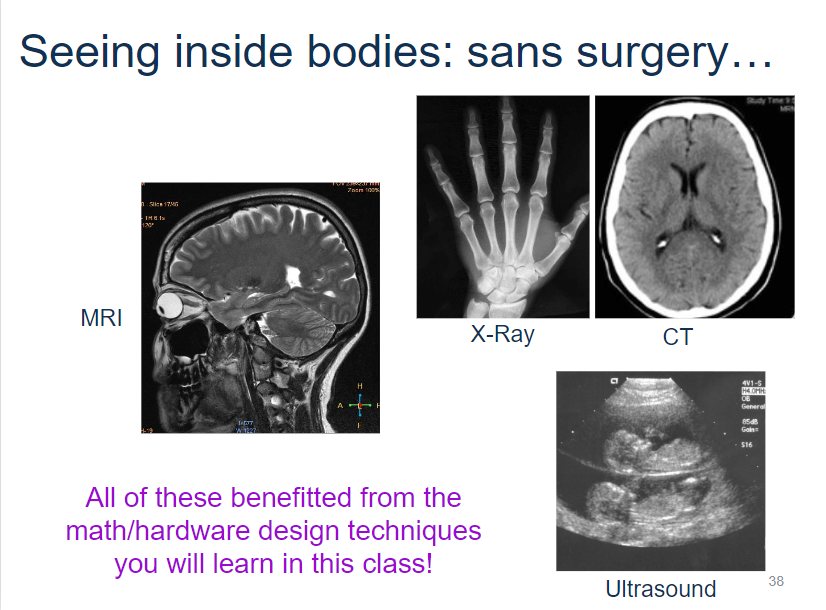
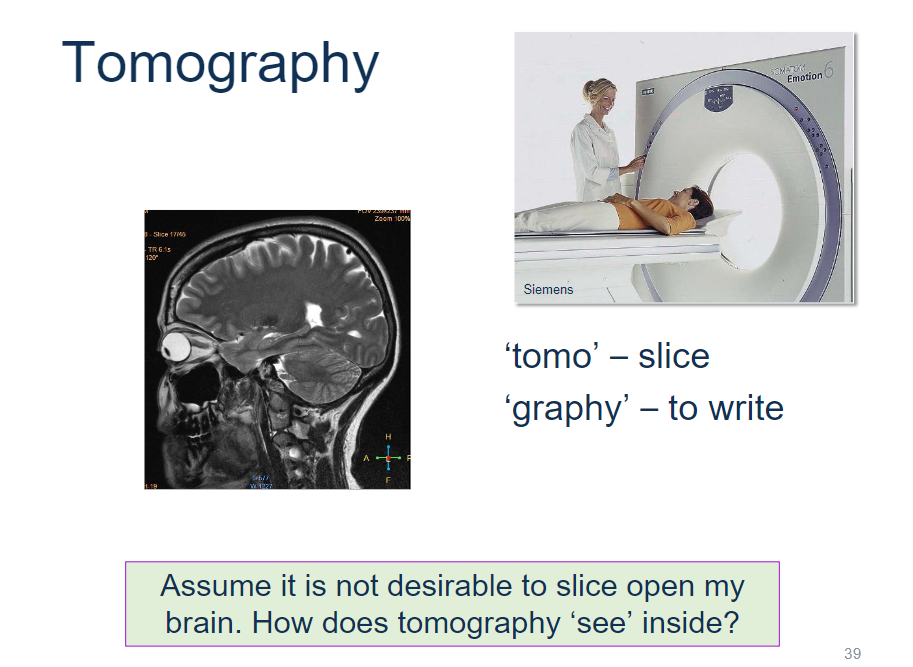
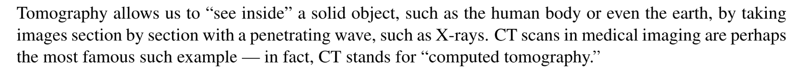
:::

## Tomography Application
> 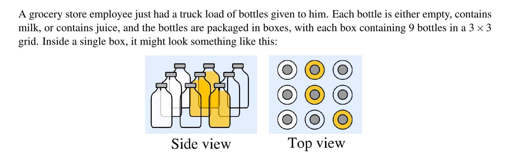

## Example
:::info
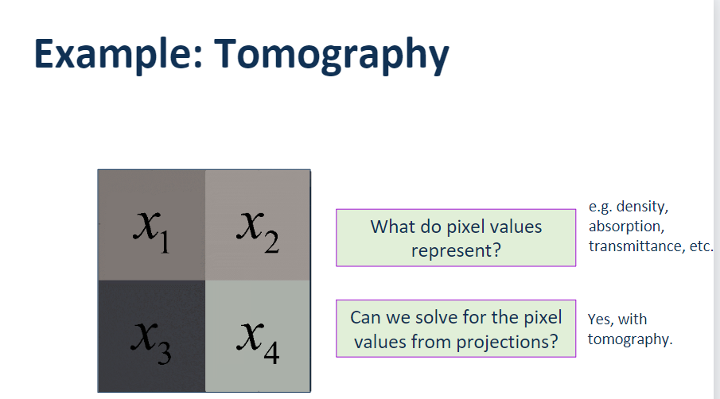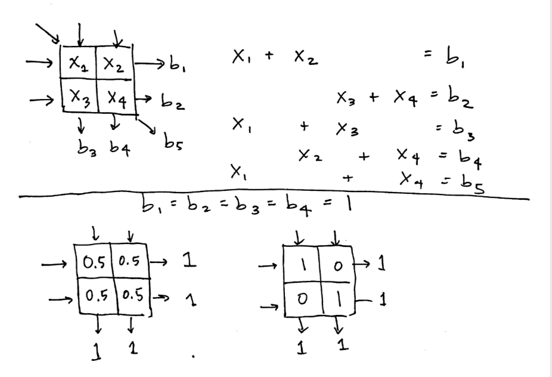
:::

# 2 Linear Equations
## Linear Function
> 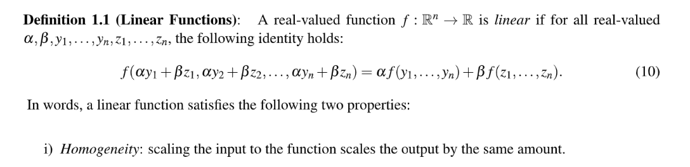

## Theorem
> 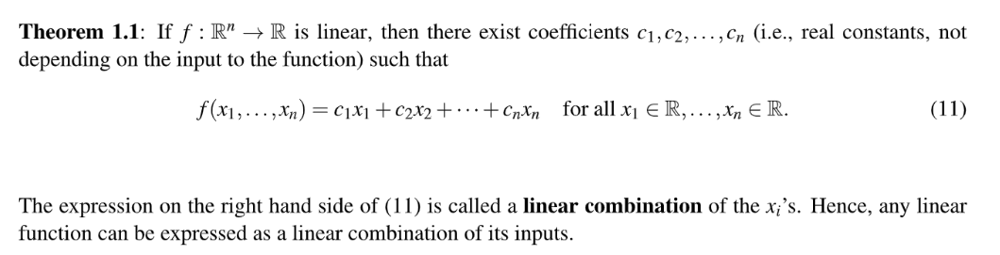

**Proof**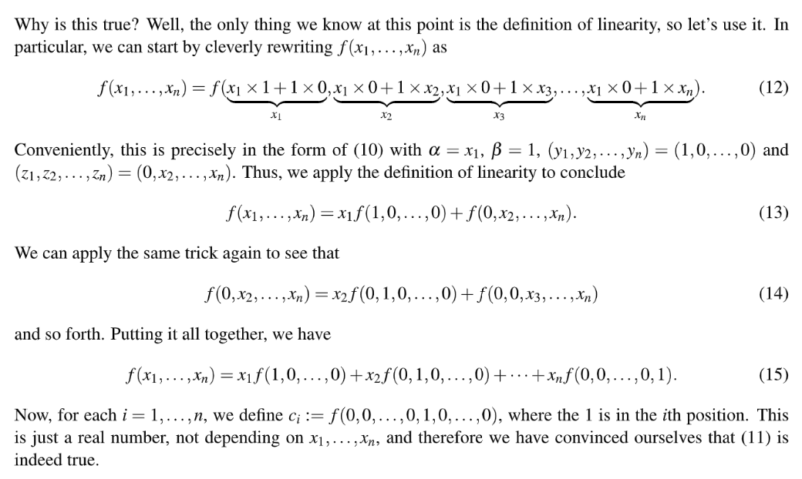

## Linear Equation
> 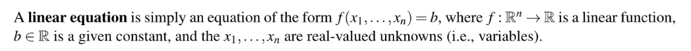

**Example**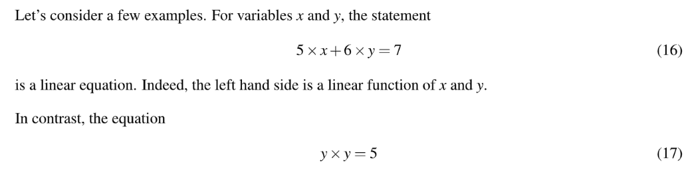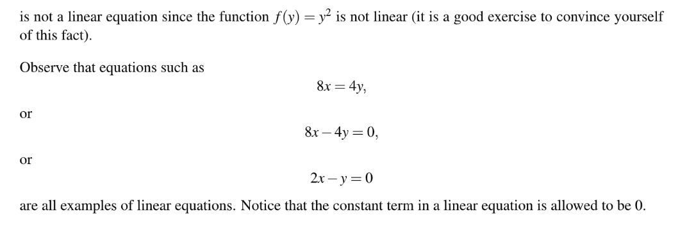

## Affine Functions
### Definition
> 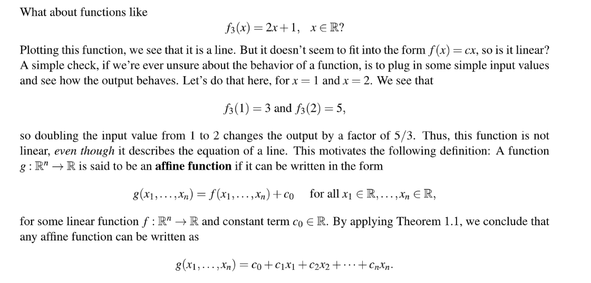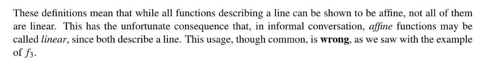

## System of Linear Equations
> 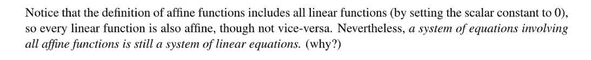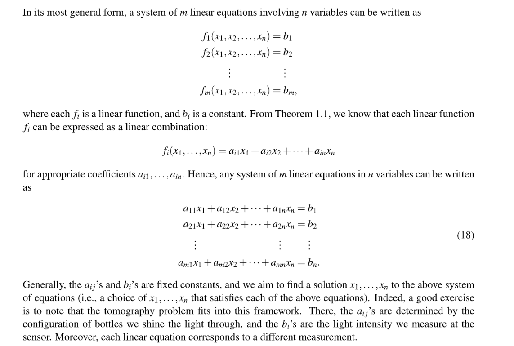

## Augmented Matrix
> 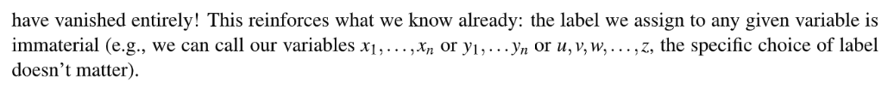

# 3 Gaussian Elimination
## Algorithms
> 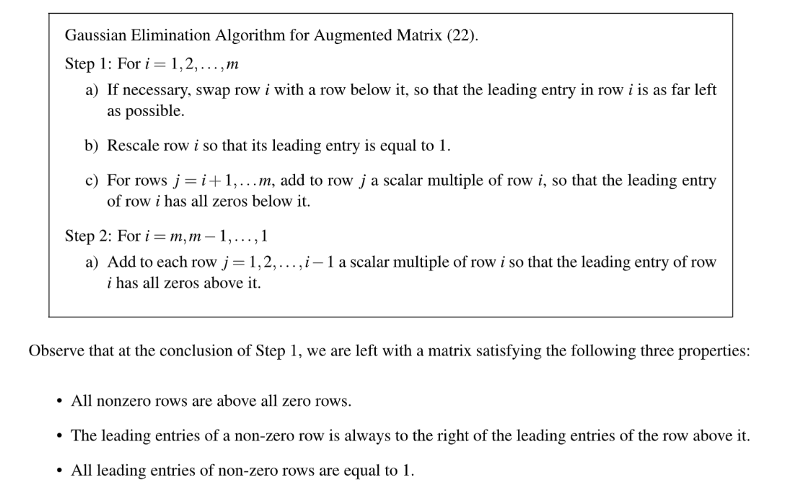

## Step1: REF
> 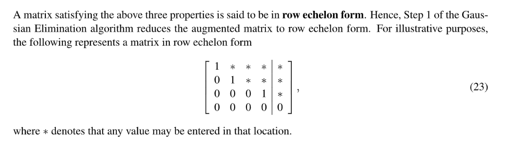

## Step2: Back Substitution - RREF
> 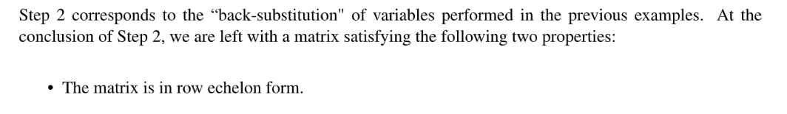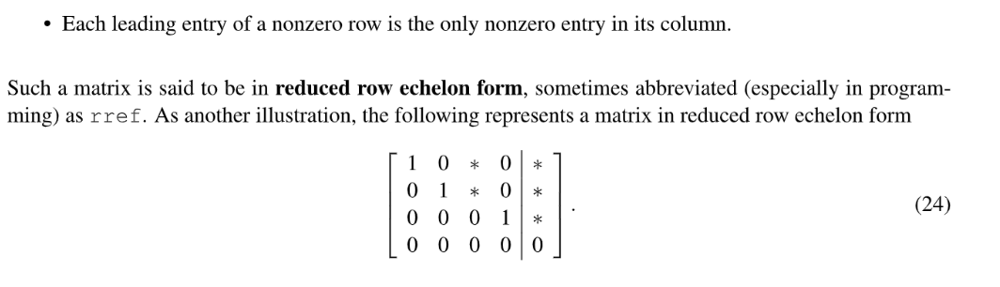

## GE Examples
### Unique Solution
> 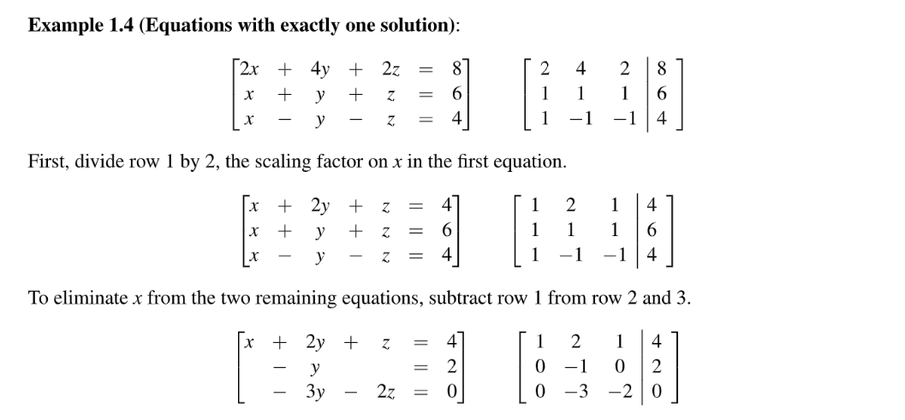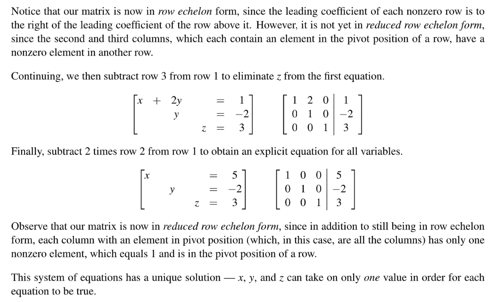

### Infinite Solution
> 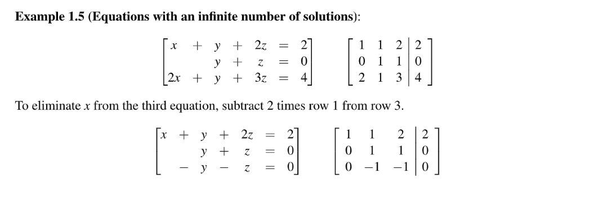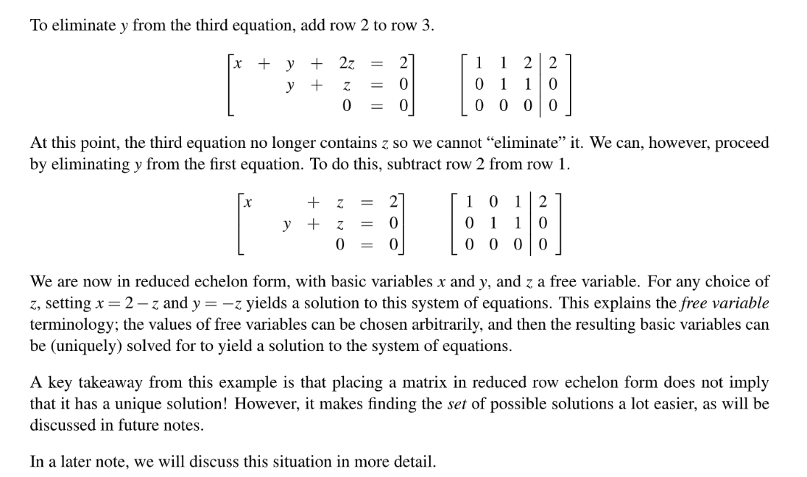

### No Solution
> 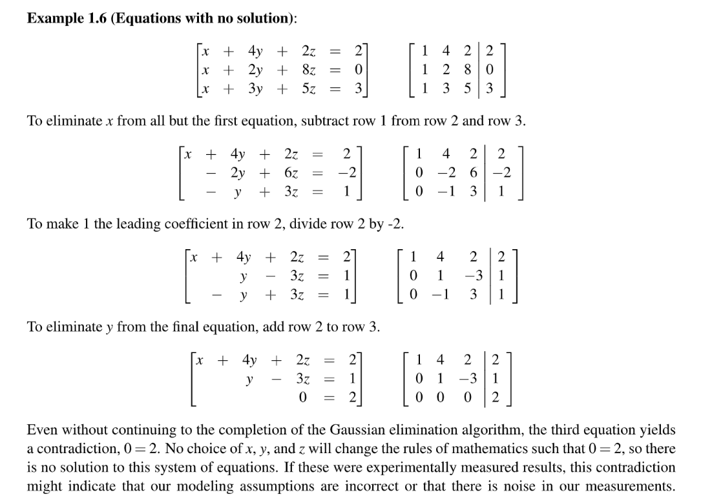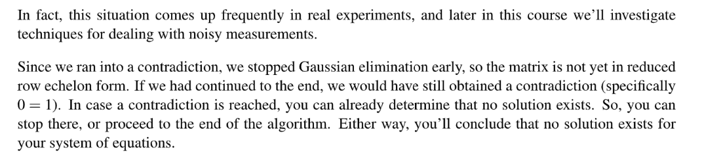

