# Voltage Divider
## Definition
> 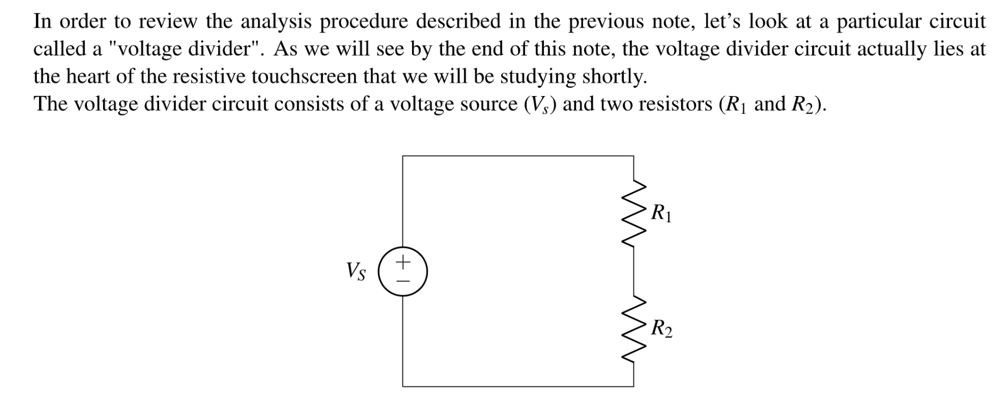
> 本质上`Voltage Divider`会将电压按照电阻值按比例分配。下面进行详细分析。

## Circuit Analysis Algorithm
### Step 1 Pick Reference Node
> 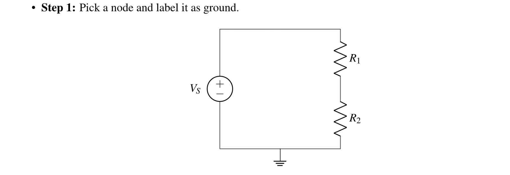
> 首先我们需要选择一个参照物节点，比如`ground`来测量电压。

### Step 2 Nodes Set by Voltage Sources
> 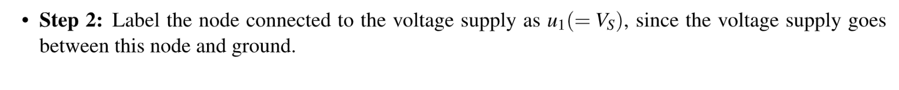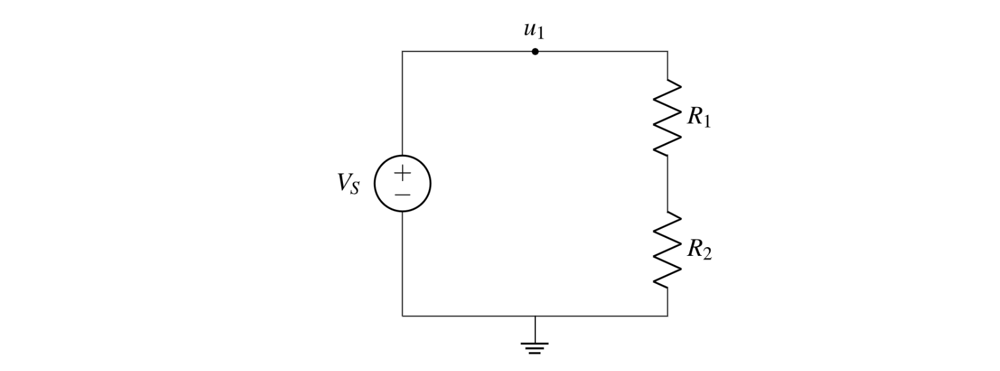
> 本质上是找到通过`Voltage Source`就能确定电压的那些节点。

### Step 3 Remaining Nodes
> 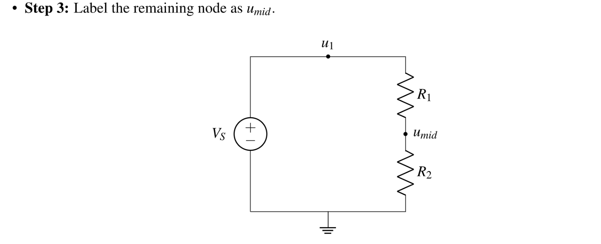
> 标出那些不能通过`Voltage Sources`直接确定的节点。

### Step 4 Label Voltages&Currents
> 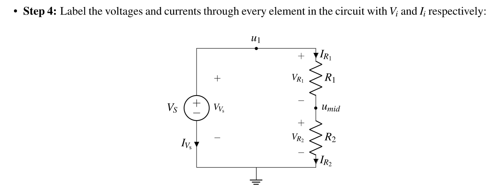

### Step 5 KCL
> 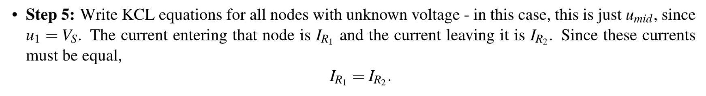

### Step 6 Ohm's Law
> 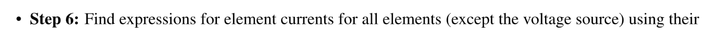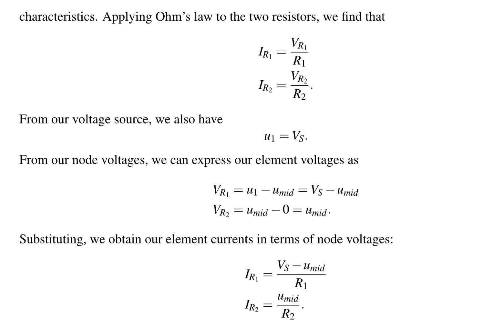

### Step 7 Back Substitution
> 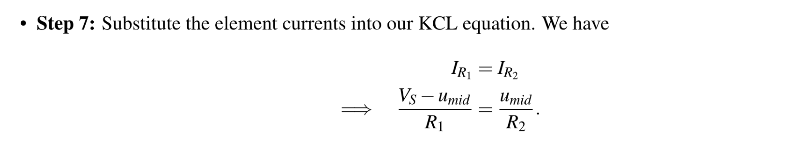

### Step 8 Solving the Equations
> 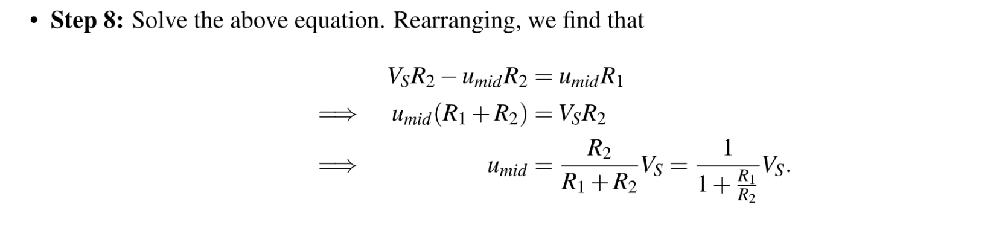

### Summary
> 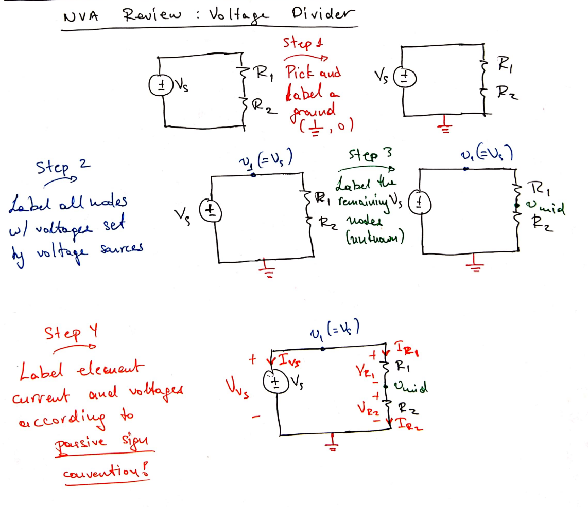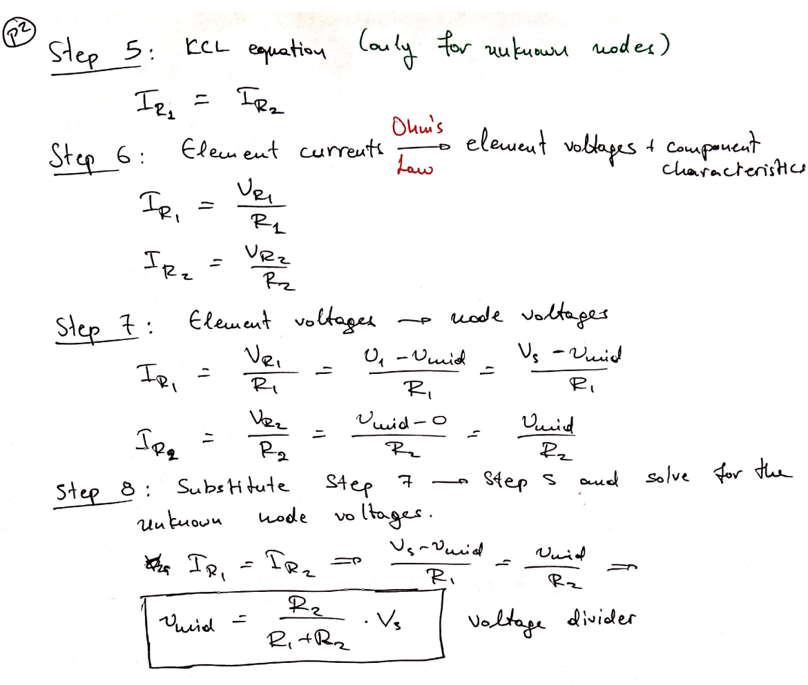
> `Voltage Divider`最有用的地方在于我们可以用他来构造出任何我们想要的电压节点。

# Resistive Touch Screen
## Introduction
> 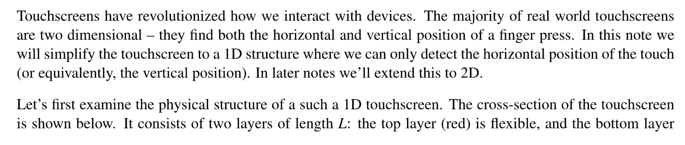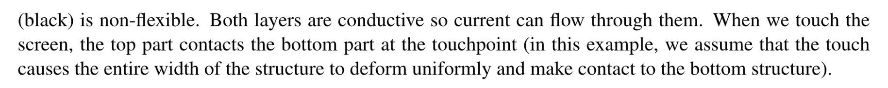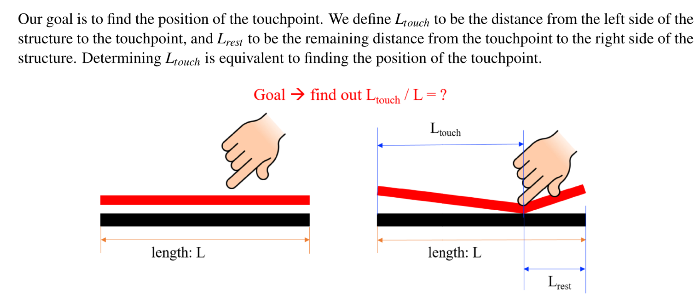
> **How can we measure this physical quantity using an electrical circuit? **
> Next we will introduce some of the physics of circuit components so that we can **convert this physical structure into an electrical model**. Once we have that model, we can connect additional components around it to build a complete circuit which we can then analyze (using the procedure developed in the previous note). 

## Physics of Circuits
### Charge
> 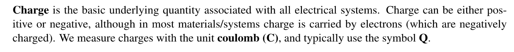

### Current
> 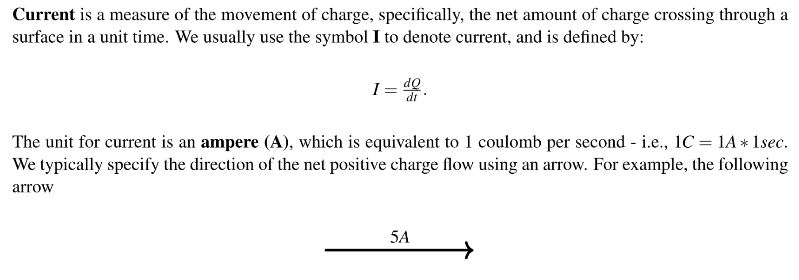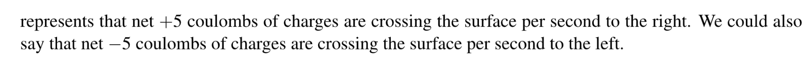
> 注意是`Net amount`(正电荷 - 负电荷的总量)

### Voltage
> 电压被定义为将单位电荷$dQ$ 在两点之间移动所需的能量$dE$, 记为$V$, 计算公式为 $\frac{dE}{dQ}=V$。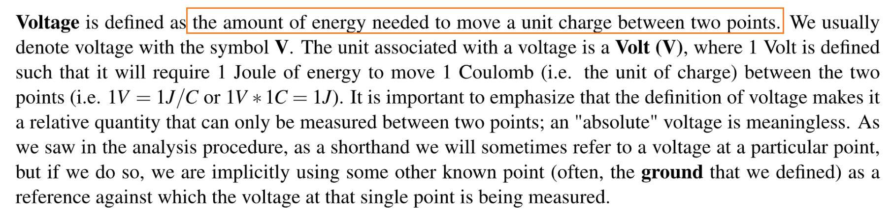

### Resistance
#### Definition
> 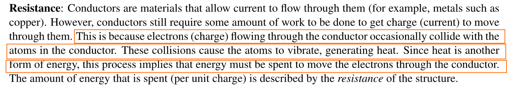

#### Ohm's Law
> 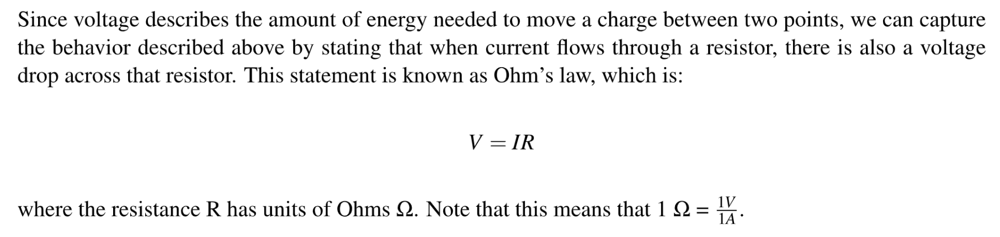

## Modeling a Resistor
> 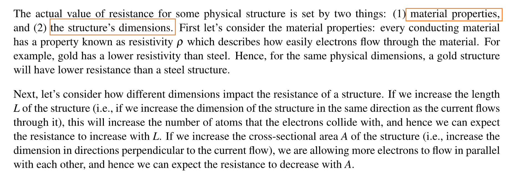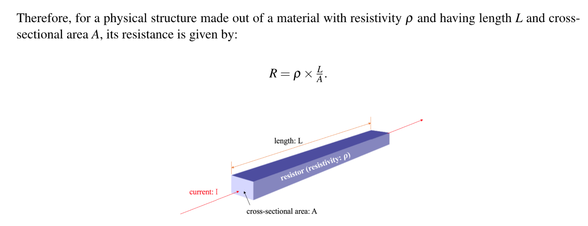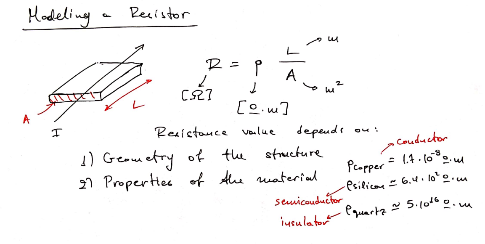

## 1-D Touchscreen's Modeling
### Physical Model
> 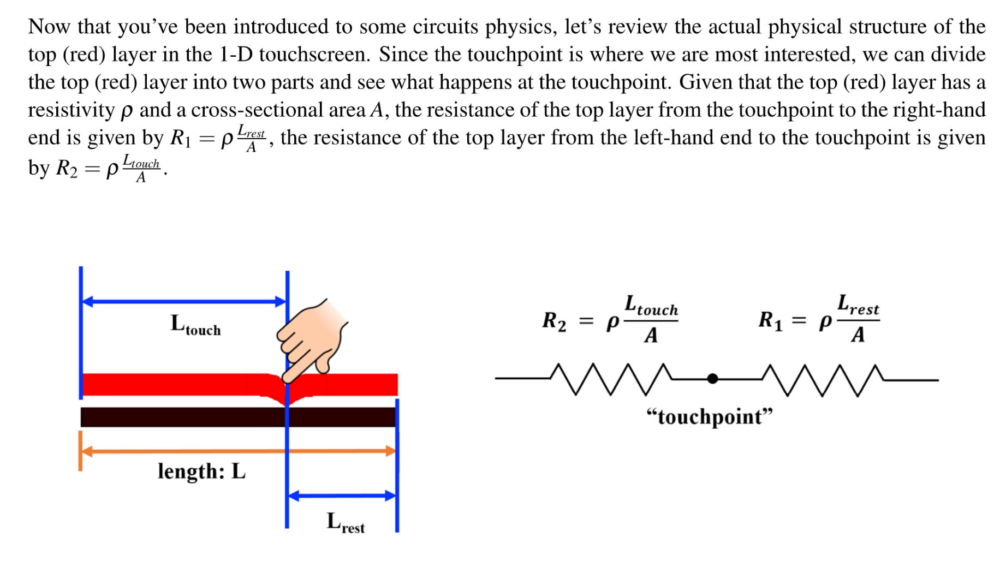

### Circuit Model
> 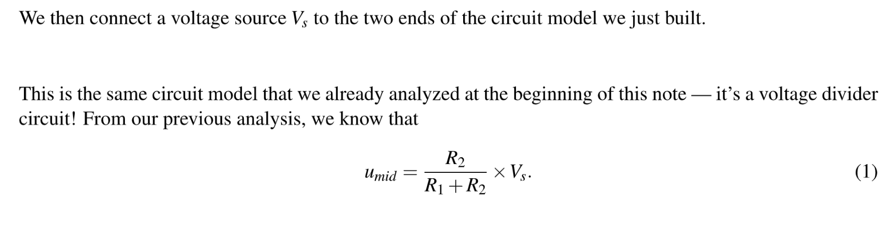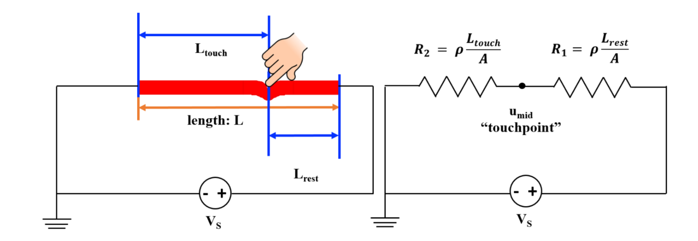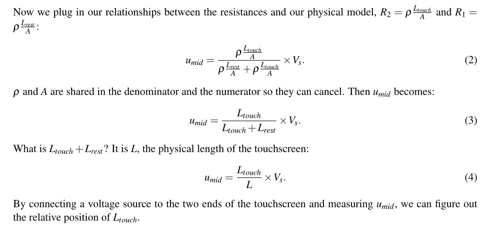

### Model Analysis 
> 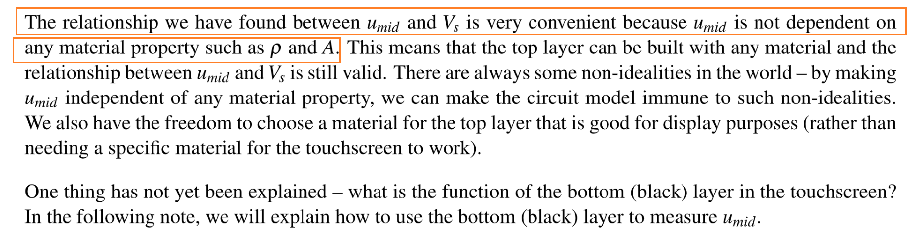

# Resources
[Note12](Typed_notes_pdf/Note12.pdf)
[Written_Notes12](Typed_notes_pdf/Written_Notes12.pdf)
