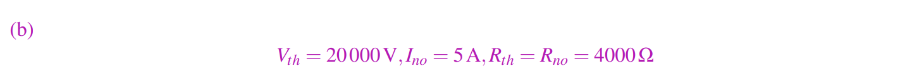

# Circuit Analysis
### Nodal Analysis
> Disc 3A P1
> 
> **Node:** Any point on the circuit where two or more elements intersects. 也可以理解为导线组
> **Branch:** Any circuit element apart from wires and open circuits，也就是除了导线和`Open Circuits`以外的电子元件。
>  

## Circuit Analysis⭐⭐⭐⭐⭐
> Disc 3B P1
> 

> [!answer] 🔔Answer
> 其实我们只要按照[Circuit Analysis Algorithm](2_Modeling_and_Circuit_Elements.md#Circuit%20Analysis%20Algorithm)中的方式得到下面的`Labeled Circuit`:
> 
> 然后我们就可以得到如下的线性方程组:
> $\begin{align}R_3\cdot I_{R_3}+R_4\cdot I_{R_4}&=V_s\\R_1\cdot I_{R_1}-R_2\cdot I_{R_2}&=V_s \\ I_{R_1}+I_{R_2}=I_s\\I_{R_3}-I_{R_4}=I_s \end{align}$
> 解得: $I_{R_1}=\frac{V_s+R_2\cdot I_s}{R_1+R_2}, I_{R_2}=\frac{R_1\cdot I_s-V_s}{R_1+R_2},I_{R_3}=\frac{V_s+R_4\cdot I_s}{R_3+R_4}, I_{R_4}=\frac{V_s+I_s\cdot R_s}{R_3+R_4}$
> 所以$u_1=V_s,u_2=I_{R_4}R_4, u_3=I_{R_1}R_1$

## Complicated Circuit 
> 

> [!example] Question (a)
> 
> 

> [!example] Question (b)
> 
> 

> [!example] Question (c)
> 
> 
> 🔔: 注意，`Current Source`$I_S$不一定要遵守`Passive Sign Convention`, 但是所有的`Resistor`需要遵守`PSC`。上面的只是其中一种可行的标记法，答案不唯一。

> [!example] Question (d)
> 
> 
> 

> [!example] Question (e)
> 
> 

# Circuit Designs
## Analog Signal Processing
> 在这个问题中，我们将探讨如何设计执行一组（任意的）数学运算的电路。(
> 🔔: 注意，所谓的模拟信号处理(`analog signal processing`) 指的是: 通过模拟电路对连续值的电压进行这类数学运算, 这在现实世界的应用中极为普遍。如果没有他们，我们的收音机或传感器基本上都无法实际工作。）具体结构如下图所示:
> 

> [!example] Question (a)
> 
> 

> [!example] Question (b)
> 
> 

> [!example] Question (c)
> 
> 
> 

> [!info] Correct Design
> 

# Dividers
## Voltage Divider
> Disc 3A P3
> 
> 按照[Circuit Analysis Algorithm](2_Modeling_and_Circuit_Elements.md#Circuit%20Analysis%20Algorithm)的步骤可以得到: $V_{out}=\frac{R_2}{R_1+R_2}V_s$

## Current Divider
> Disc 3B P2
> 
> 按照[Circuit Analysis Algorithm](2_Modeling_and_Circuit_Elements.md#Circuit%20Analysis%20Algorithm)的步骤可以得到: $I_{R_1}R_1=I_{R_2}R_2$, 且$I_s=I_{R_1}+I_{R_2}$，于是可以解得$I_{R_2}=\frac{R_1}{R_1+R_2}I_s$

# Power &V/I Measurement
## Power Supply&Disspation I
> 知识点: [Power Disspation/Generation](3_Power_VI_Measurements.md#Power%20Disspation/Generation)
> 
> 我们有下列关系: $i_1+i_2=0, i_2R_1=V_{R_1},P_{V_s}=i_1\cdot V_1, P_{V_{R_1}}=i_2^2\cdot R_1$，代入数据可得，$P_{V_s}=-5J, P_{R_1}=5J$。所以$V_s$产生$5J$能量，$R_1$消耗$5J$能量。
> 
> 🔔: 这里将$V_s$的电流反向，下面我们将会展示电流方向的选取并不会改变`Power Generation/Disspation`的关系。
> 
> 🔔: 我们可以在电路中随意规定`Branches`的正负极，比如上图中的$V_1$, 后续计算电势差的时候我们按照`Passive Sign Convention`, 从我们规定的正极到负极电压减小可知$o-u_1=V_1=-V_s$.

## Power Supply&Disspation II
> 
> 比较简单，总体我们有: $V_1-V_{R_1}-V_{I_s}=0(KVL)$, $I_{V_s}+I_s=0$, $I_s=I_{R_1}=0.5A$, $R_1=5\Omega$, $V_s=5V$。所以$P_{V_s}=-0.5A\cdot 5V=-2.5W$, $P_{R_1}=0.5A^2\cdot R_1=1.25W$, $P_{I_{s}}=0.5A\cdot 2.5V=1.25W$。
> 所以，电压源每秒产生$2.5J$的能量，电阻和电流源每秒消耗$1.25J$的能量。

## Voltmeter&Ammeter
> 

> [!example] Question (a)
> 🔔: 我们本质上要求解$u_a$和$u_b$, 而我们知道任何一个`Linear Circuit`中的未知`Node`的数值都可以表示为已知数值的线性组合，所以本质上`Solving Circuit`就是在解线性方程组。
> 
> 
> 
> 

> [!example] Question (b)
> [Written_Notes13](Typed_notes_pdf/Written_Notes13.pdf)中写到，如果我们要用电流表测量电流，那么理想情况下电流表应该近似于一根导线。如果我们要用电压表测量电压，那么理想情况下电压表应该近似于一个`Open Circuit`。
> 
> 

> [!example] Question (c)
> 🔔：这里电流表就等效为一根导线了。
> 
> 
> 

> [!example] Question (d)
> 🔔：这里电压表就等效为`Open Circuit`了。
> 
> 
> 

# Resistive Touchscreen
## 2D Resistive Touchscreen
> 
> https://www.tinkercad.com/things/dFoIJqRrILt-copy-of-resist-the-touch-1/editel?tenant=circuits

> [!example] Question (a)
> 
> 

> [!example] Question (b)
> 
> 
> 
> 

> [!example] Question (c)
> 
> 

# Superposition⭐⭐⭐⭐⭐
## Problem 1
> 
> 多个电流/电压源的问题。

> [!example] Circuit (a)
> 
> 
> 

> [!example] Circuit (b)
> 
> 
> 

> [!example] Circuit (c) Superposition
> 
> 
> 

## Problem 2
> [!example] Complicated Circuit
> 
> 
> 

# Circuit Equivalence
## Series&Parallel Combinations I
> 
> 

## Thevenin&Norton Equivalence⭐⭐⭐⭐⭐
> [Circuit Equivalence](5_Superposition_and_Equivalence.md#Circuit%20Equivalence)

> [!example] Series Resistors with Voltage Source
>  
> 
> 

> [!example] Series Resistors with Current Source
> 
> 

> [!example] Voltage Source
> 
> 
> 

> [!example] Current Source
> 
> 

> [!example] Parallel Voltage Source with Resistor
> 
> 

> [!example] Series Current Source with Resistor
> 
> 

> [!example] Complicated Circuit I
> 

> [!example] Complicated Circuit II
> 
> 

## Series&Parallel Combinations II
> 

# Industrial Applications
## Bio-Molecule Detector⭐⭐⭐⭐⭐
> 基本原理就是使用一个水管，里面充满特制液体，液体中充满了待检测的分子（橘红色圆柱体表示）。图中绿色的方块代表的是一种特殊的生物分子检测电极子，他的作用是将目标分子Target Molecules困在电极子之间，如图中的橘红色部分所示。最后当我们将液体全部排干净之后，我们看看电极子有没有捕获任何的带检测分子。(disc 3B P3)  

> [!Example] (a)
> 
  本题旨在计算圆柱体的电阻，是需要简单地运用公式即可，但需要注意单位不要忘记转化成标准单位。
  

> [!example] (b)
> 
> 本题旨在计算如果有很多圆柱体竖直卡在两个电极子之间(本质上是横截面积扩大)，那么总电阻是多少:  
> 

> [!example] (c) 
> 本题需要设计一个电路，使得我们电极子在有`5`个分子卡在其中时电压大于$2.5V$
> 
> 
> 

## Cell Phone Battery⭐⭐⭐⭐⭐
> 
> 首先我们可以分析一下量纲，$mAh$的单位是`毫安时`，也就是$mA\cdot h$, , 本质上说的就是能够以多大的电流维持一小时工作不断电。
> 💡: `瓦时` 是电量单位，代表电能做功的量, 用于计算电池能量。
> 💡: `毫安时`是电池容量单位，通常用作电池放电指标。
> 💡: `(毫)安时`和`瓦时`之间可以换算，但必须知道电压。例如一块电池标示3.7V，16.65Wh，可计算16.65÷3.7＝4.5安时=4500毫安时。

> [!example] Question (a) 毫安时的意义
> 
> 由于`Google Pixel Phone`在$3.8V$时的电池容量是$2770mAh$, 也就是说能够以`1000`毫安工作`2.77`小时不用充电。而一般情况(`typical usage`)下，`Pixel Phone`的功率是$0.3W$, 那么在$3.8V$的标准电压下，根据`Power`的公式$P=VI$, 所以$I=\frac{0.3W}{3.8V}=\frac{3}{38}\cdot 1000A$, 于是我们有$1000mA\cdot 2.77=\frac{3}{38}\cdot 1000\cdot h$, 得到$h=35.0866667$, 所以大概可以使用35小时左右，大概一天半。
> 🔔：本质上就是要算出`typical usage`下的工作电流，因为额定功率已经给出，是$0.3W$, 额定电压也有, 是$3.8V$, 所以额定电流很容易求出。

> [!example] Question (b) 库仑和电子的转换
> 
> 首先要求出库仑，库仑的量纲是$A\cdot s$, 而电池的容量是$2700mA\cdot h$, 所以我们简单地对单位进行一些换算可以得到: $mAh=\frac{3600}{1000}A\cdot s=3.6C$， 所以$2770\cdot \frac{3}{6}=9972C$, 因为题干中说每个电子携带$1.602\times 10^{-19}$库仑，于是我们有$\frac{9972}{1.602\times 10^{-19}}\approx6.225\times 10^{22}$个电子。

> [!example] Question (c) 计算电池能量
> 
> 从前文我们知道，电池的能量是$3.8W\cdot 2.77h$, 于是换算成能量单位就是$3.8W\cdot 3600\cdot 2.77s\approx 37.9KJ$

> [!example] Question (d) 计算充电费用
> 
> 前文中我们知道电池的能量是$3.8\cdot 2.77 Wh=10.526Wh=1.0526\times 10^{-2}kWh$
>  所以每次充满电都需要花费$1.0526\times 10^{-2}kWh\times 0.12=1.26312\times 10^{-3}$。所以一个月下来我们要花费$1.26312\times 10^{-3}\times 31\approx 0.039\$$在充电上。

> [!example] Question (e) 电池电路建模 Wall Plug
> 
> $200m\Omega$就是我们的保险丝电阻。
> 
> 

## Printed Electronics⭐⭐⭐⭐⭐
> 
> 所有电子设备都需要电路连接来传导信号。这些连接，或称`Traces`，是通过不同的**沉积方法**(`Deposition Methods`)，如`Physical Vapor Deposition`和`Chemical Vapor Deposition`制造出来的。
> 另一种不太传统的技术是`Printing`。油墨可以由金属纳米颗粒制成，并通过喷墨打印、丝网印刷等方式沉积。使用喷墨打印、丝网印刷和喷雾涂层等方法进行沉积。一种常见的印刷金属墨水是银。下面是手绘的示意图:
> 

> [!example] Question(a) 电阻公式
> 
> 

> [!example] Question (b)
> 
> `Nanoparticle`在不同温度下的电导率不同，导致电阻会在温度不同的情况下变化。
> 

> [!example] Question (c)
> 
> 

> [!example] Question (d)
> 
> 

> [!example] Question (e)
>
>

> [!example] Question (f) ⭐⭐⭐⭐⭐
> 
> 💡: 下面是示意图，本质上我们需要利用积分求解变化的横截面:
> 
> 

# Summary
## Nodal&Circuit Analysis
> 1.  **Nodal Analysis:** 本质上是用于确定`Nodes`和`Branches`，方便后续的电路分析。
> 2. **Circuit Analysis:** 如果电路较为复杂，我们会按照下列公式化的步骤进行分析:
> 	1.  规定一个零电势点，一般会选取电压源的负极所在的 `Node` 作为零电势点。
> 	2. 从零电势点出发，求出其他马上就能确定的 `Node` 的电势，比如中间只有一个 `Voltage Source` 的情况。 
> 	3. 用 `Passive Sign Convention` 标出电流方向。
> 3. **Passive Sign Convention:** The sign convention for passive components is one end of the passive component is positive and the other is negative and current flows from the positive to the negative. 本质上就是说如果我们认为规定了比如说一个电阻的正负极，那么流过这个电阻的电流方向应该是从我们规定的正极流向负极，就是`Passive Sign Convention`的意思，比较重要。另外，它还规定了: 从一个`Branch`的正极到负极，电势是下降的。功率的运算必须符合`Passive Sign Convention`。总的来说，如果电流方向和我们规定的电势下降的方向相反，则我们计算功率的时候需要取一个负号。
> 
> `Voltage/Current Source`（是`Active`的）可以不遵守`Passive Sign Convention`, 但是`Resistors`(`Passive`的)必须遵守`Passive Sign Convention`。

##  Dividers  
> 本练习集中出现的Divider有两种： 
> 1. `Voltage Divider`: 一个电压源+两个串联电阻。
> 2. `Current Divider`: 一个电流源+加两个并联电阻。

## Power Measurements
> 电路中总有电子元件负责产生能量，电子元件负责消耗能量。
> 💡: `Voltmeter`, 理想状况下可以看成一个电阻无限大的电子元件。
> 💡: `Ammeter`, 理想状态下可以看成一个电阻无限小的电子元件。此时可以想象成$R=0$的导线，将其他电阻短路掉。
> 还有一些`Terminology Confusion` :
> 

## Physics Concepts
> `瓦时` 是电量单位，代表电能做功的量。一般用于计算在一定的功率下能够坚持多久或者充电要充多久。
> `毫安时`是电池容量单位，通常用作电池放电指标。
> `毫安时`和`瓦时`之间可以换算，但必须知道电压。例如一块电池标示3.7V，16.65Wh，可计算16.65÷3.7＝4.5安时=4500毫安时。
> `库仑` 是电荷量的国际单位: 一个电子所带电荷量$e=-1.6021892\times 10^{-19}$库仑，即 1库仑相当于 $6.24146\times10^{18}$个电子电子）所带的电荷量。1库仑 ＝ 1安培$\cdot$秒）

## Resistive Touchscreen
> [[4_2D_Touchscreen]]
> 最明显的缺点就是我们不能同时检测多个输入的二维坐标位置。

## Superposition
> 本质上就是将每个`Source`的贡献单独拆开来看，然后最后叠加起来，可以简化电路分析。

## Circuit Equivalence
> 等效电路研究的是：我们在原电路中任取两点`A,B`(一般是两个`Nodes`)，然后试图求出这两点间的`I-V`关系(其实就是求出`xy-intercept`), 因为我们现阶段的讨论仅仅局限于`Linear Circuit`, 所以`I-V Line`的斜率就是`A,B`间的等效电阻$R_{th}=R_{No}$, 具体来说我们有两种方法:
> - 🔔方法一: 利用截距+等效电路/Superposition
> 	💡: 这种`I-V`关系的`x-intercept`(对应$I=0$)可以通过在 `A,B` 间添加一个 `Open Circuit` 然后计算这两点之间的电压得到$V_{th}$。此时我们是需要剔除那些只有一端连接在电路中的电子元件，因为任何和`Open Circuit`单端相连的电子元件上的电流都是零。
> 	💡: 这种`I-V`关系的`y-intercept`(对应$V=0$)可以通过在 `A,B` 间添加一个 `Wire` 然后计算这根导线上的电流得到$I_{No}$
> 	💡: 等效电阻$R_{th}=R_{No}=\frac{V_{th}}{I_{No}}$。
> - 🔔方法二: 注入电压或者电流，zero out
> 	我们可以将所有的`Independent Sources`都等效为其对应的`Open Circuit/Wire`, 然后往电路中注入一个$I_{test}$求$V_{test}$或者在`AB`两端加上$V_{test}$然后求$I_{test}$, 然后通过$R_{th}=R_{No}=\frac{V_{test}}{I_{test}}$。
> 	❗注意
> 		- 这里的`往电路中注入电流`并不是在`AB`两端用导线连接, 而是想要利用`KCL/KVL`对这个节点进行`Circuit Analysis`。
> 		- `在AB两端添加电压`并不是添加一个`Open Circuit`，而只是在`AB`两端规定了一个电势差，也就是说我们是知道$V_{test}$的。
> 
> ⭐: 注意`Circuit Equivalence`仅仅针对的是两个`Terminal`之间的`I-V Relationship Equivalence`，而`Power Equivalence`不一定成立。
> 
> 

# Resources
> [dis3A](Exercises_folder/dis3A.pdf)
> [dis3B](Exercises_folder/dis3B.pdf)
> [dis3C](Exercises_folder/dis3C.pdf)
> [dis3D](Exercises_folder/dis3D.pdf)
> [dis4A](Exercises_folder/dis4A.pdf)
> [ans3A](Exercises_folder/ans3A.pdf)
> [ans3B](Exercises_folder/ans3B.pdf)
> [ans3C](Exercises_folder/ans3C.pdf)
> [ans3D](Exercises_folder/ans3D.pdf)
> [ans4A](Exercises_folder/ans4A.pdf)
> [sp23_prob06](Exercises_folder/sp23_prob06.pdf)
> [sp23_prob07](Exercises_folder/sp23_prob07.pdf) 没做
> [sp23_prob08](Exercises_folder/sp23_prob08.pdf) 没做
> Practice Set 6,7

