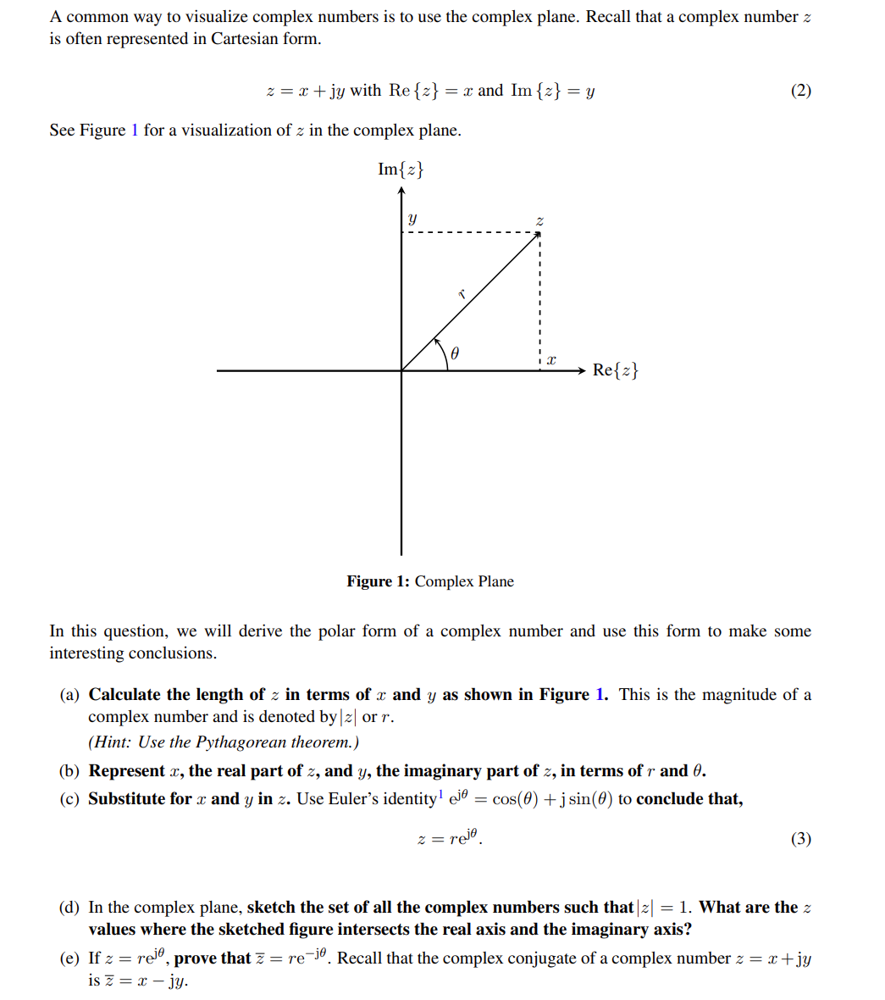
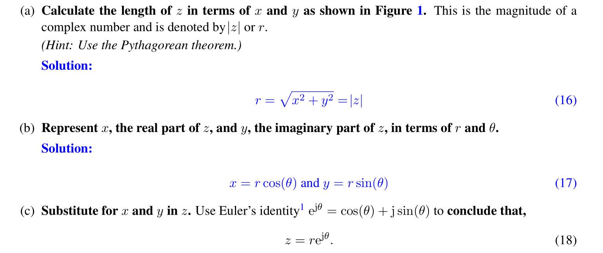
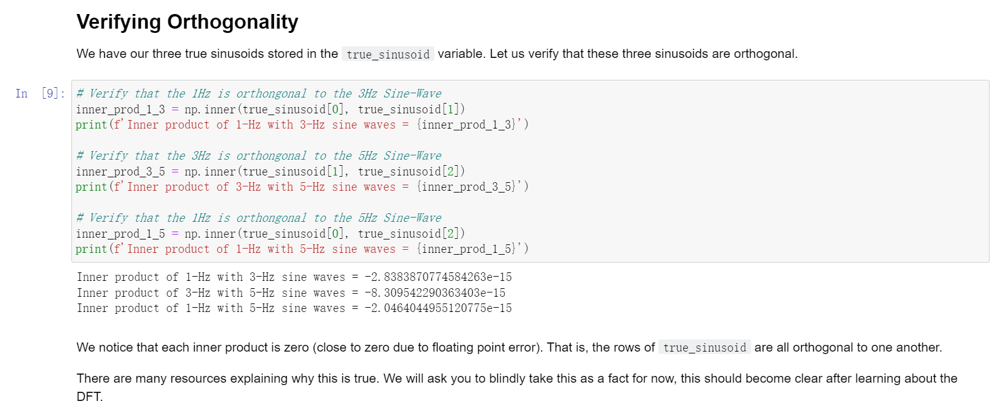
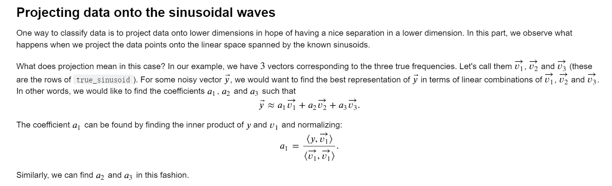

[notej.pdf](https://www.yuque.com/attachments/yuque/0/2023/pdf/12393765/1685521110081-cd360e29-63f3-4609-a92d-1d6a6ed90b37.pdf)

# Complex Number
> 

**Solution**

# Triangle Inequality
> **我们有:**
> $\begin{aligned}|x_i+y_i|^2&=(x_i+y_i)\overline{(x_i+y_i)}\\&= x_i\overline{x}_i+x_i\overline{y}_i+y_i\overline{x}_i+y_i\overline{y}_i\\&=|x_i|^2+2Re(x_i\overline{y}_i)+|y_i|^2\\&\leq |x_i|^2+2|x_i\overline{y_i}|+|y_i|^2\\&=|x_i|^2+2|x_i||\overline{y_i}|+|y_i|^2\\&=|x_i|^2+2|x_i||y_i|+|y_i|^2\\&=(|x_i|+|y_i|)^2\end{aligned}$
> **所以:**
> $|x_i+y_i|\leq |x_i|+|y_i|$

# Classification of Sinusoids
## Orthogonality
> **HW01 Fa21 P5**
> 

## Sinusoidal Projection
> **HW01 Fa21 P5**
> 

