# Transistors
[note0A.pdf](https://www.yuque.com/attachments/yuque/0/2023/pdf/12393765/1685522029074-030fcd08-59bf-44d8-9339-7658a323a4f7.pdf)
[note1.pdf](https://www.yuque.com/attachments/yuque/0/2023/pdf/12393765/1685522029161-7d9f92aa-a383-4132-9359-0b9f14be5967.pdf)
[lecture1B.pdf](https://www.yuque.com/attachments/yuque/0/2023/pdf/12393765/1685522215637-052c8740-3802-45a2-97db-c9cd2e751244.pdf)
[lecture2.pdf](https://www.yuque.com/attachments/yuque/0/2023/pdf/12393765/1685522215721-9d55e9a6-7459-4f44-8fc5-e31c612a485c.pdf)
[lecture3.pdf](https://www.yuque.com/attachments/yuque/0/2023/pdf/12393765/1685522215714-3babaf48-22c8-4992-b08a-6f780890a4de.pdf)
## Introduction
> We can understand computers as a set of blocks that perform digital logic operations, one after the another. You might be familiar with logic in the form of `AND` and `OR` operations in `if` statements while programming. 
> - **Logic gates** are circuits that behave in a manner compatible with those logical operations. For this, high voltages are traditionally used to represent a logical `1` or `TRUE` and low voltages are traditionally used to represent a logical `0` or `FALSE`. These logical gate circuits are constructed out of physical devices called transistors.  
> - **An inverter** takes a boolean input and outputs the logical inverse: a `0` (low) maps to a `1` (high) and a `1` (high) maps to a `0` (low).  
> - **The speed of computers** is related to how quickly logical blocks can change their state and thus perform logic (for example, how quickly an inverter can output a `0` after its input changes to a `1`). 
> 

## Terminals
> **对于一个**`**Transistors**`**æ¥è¯´ï¼Œæœ‰ä¸‰ä¸ª**`**Terminals**`**:**
> 1. `Source Terminal`: 用$S$表示，电压值为$V_S$。
> 2. `Destination Terminal`: 用$D$表示，电压值为$V_D$。
> 3. `Gate Terminal`: 用$G$表示，电压值为$V_G$。$V_G$的电压大å°é—´æŽ¥å†³å®šäº†`Source`å’Œ`Destination Terminal`之间的电路是å¦è¿žé€šã€‚
> 4. `Gate Voltage`: $V_{GS}=V_G-V_S$, 也就是说`Gate`处的电压和`Source`处的电压的差值。

# Basic Transistors
## Delayed Behaviors
> 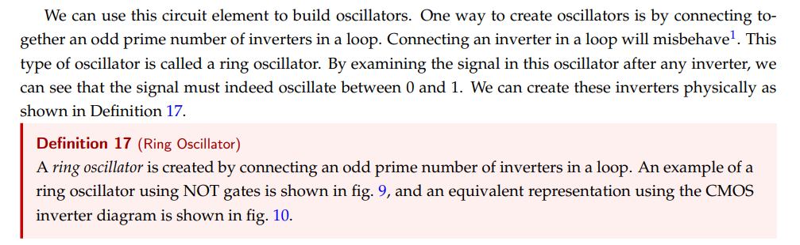
> 为了能够对上述的`Delay`æ¥å»ºæ¨¡ï¼Œæˆ‘们需è¦å¼•å…¥ä¸€ç§æ–°çš„`Transistor`模型，称为`Transistor Resistor-Switch Model`。

## NMOS Transistor
> **Verbal Definition:**
> NMOS transistor is:
> 1. **On** if the gate voltage $V_{GS}$ is greater than some small positive threshold $V_{tn}$. 
> 2. **Off** if the gate voltage $V_{GS}$ is less than some small positive threshold $V_{tn}$. 
> 3. This means that an NMOS transistor is on when the gate voltage is sufficiently higher than the source voltage. The threshold voltage tells us how much higher it needs to be.
> 
**Simple Model(所有**`**Switch**`**在达到阈值æ¡ä»¶æ—¶ç«‹åˆ»å…³é—­æˆ–者开å¯):**
> 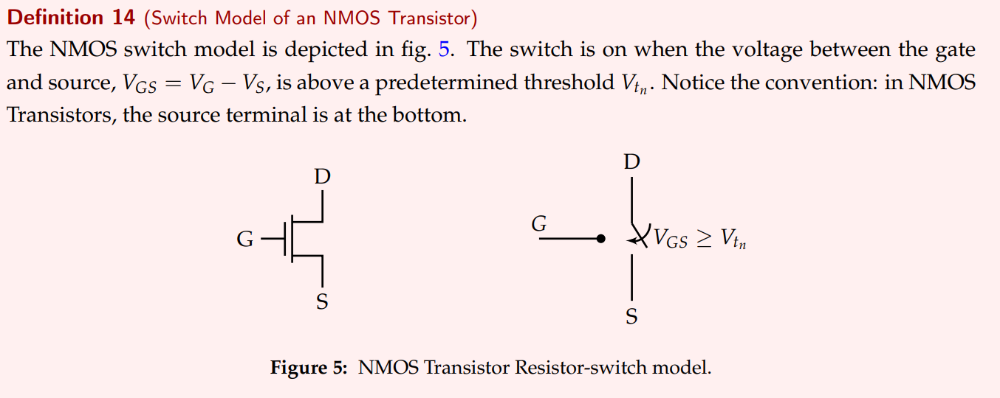
> - 我们一般å‡è®¾$V_{th}$是一个æå‰å†³å®šçš„`Positive Constant`。
> - 当$V_{GS} \geq V_{t_n}$时，`Switch is on`。
> - 当$V_{GS} < V_{t_n}$时，`Switch is off`，此时电路是一个`Open Circuit`（No path from gate to source, no path from gate to destination）。
> 
**Real Model: 我们会用一个电容和电阻表示**`**NMOS**`**æ¥æ¨¡æ‹Ÿ**`**Delayed Behavior**`**:**
> 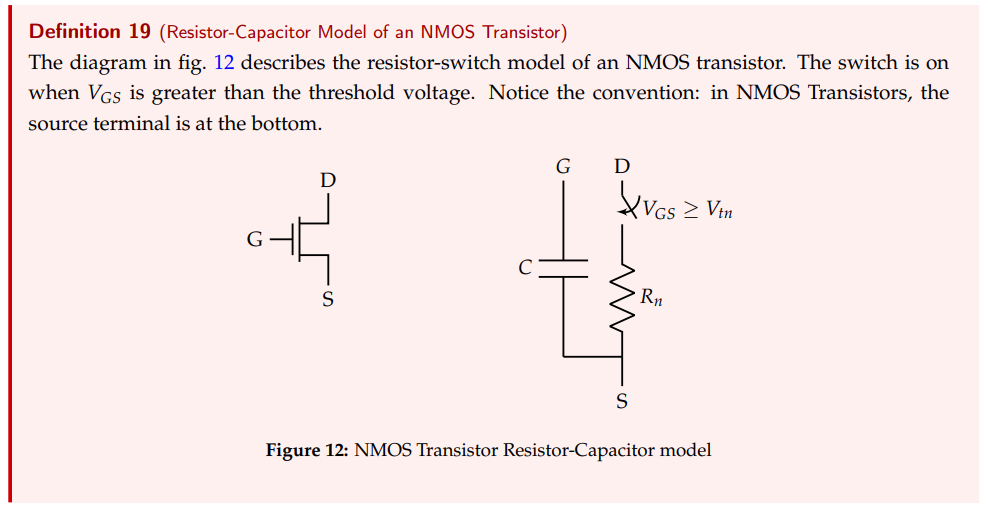

## PMOS Transistor
> **Verbal Definition:**
>  A PMOS transistor is on if the gate voltage $V_{GS}$ is less than a small negative threshold −$|V_{tp}|$. This means that a PMOS transistor is on when the gate voltage is sufficiently lower than the source voltage. The threshold voltage tells us how much lower it needs to be.  
> **Technical Definition:**
> 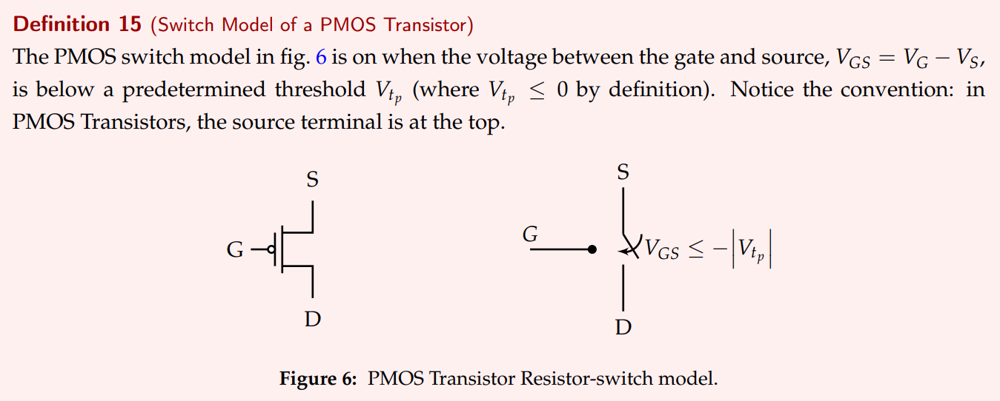
> **我们定义:**
> 1. $V_{GS}=V_G-V_S$
> 2. $V_{SG}=V_S-V_G$
> 
当`Switch is on`:
> $V_{GS}\leq -|V_{t_p}|$or $V_{SG}\geq|V_{t_p}|$
> 当`Switch is off`:
> $V_{GS}> -|V_{t_p}|$or $V_{SG}< |V_{t_p}|$
> **Real Model: 我们会用一个电容和电阻表示**`**PMOS**`**æ¥æ¨¡æ‹Ÿ**`**Delayed Behavior**`**:**
> 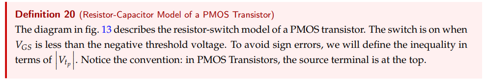

## NMOS vs PMOS
> 简å•ç†è§£:
> `NMOS`:
>  $V_{in}\uparrow$: Closed
>  $V_{in}\downarrow$: Open
> `PMOS`:
>  $V_{in}\uparrow$: Open
>  $V_{in}\downarrow$: Closed

## Charge Puddle Model - Physics
> 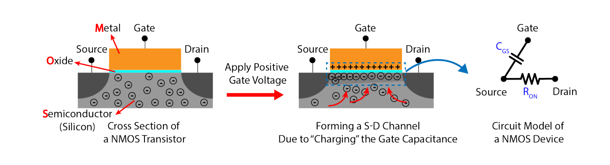

# Logic Gates
## NOT GATE - CMOS
### Definition
> 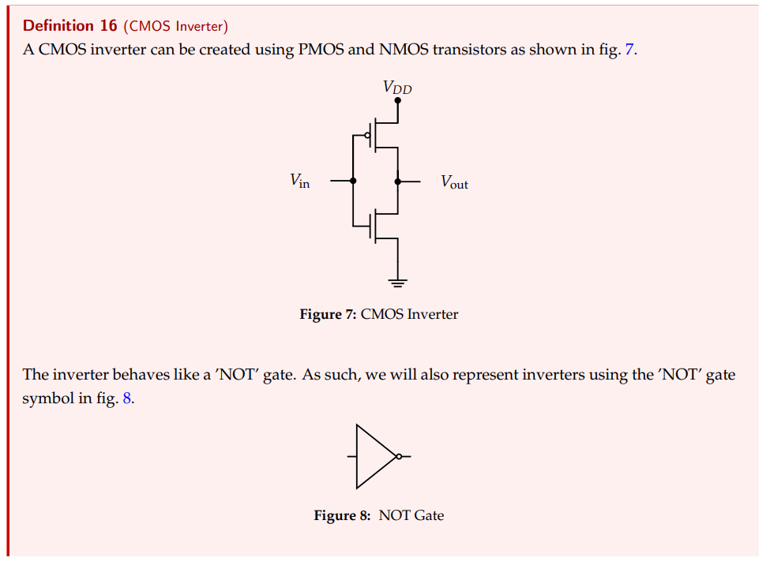
> 🔔在上图中我们有如下的`Notations`:
> - $V_{thn}$表示`NMOS`中的`Threshold`
> - $V_{thp}$表示`PMOS`中的`Threshold`
> - $V_{SS}=0V$表示接地`Terminal` 
> - $V_{dd}$表示最上端的`Terminal`
> 
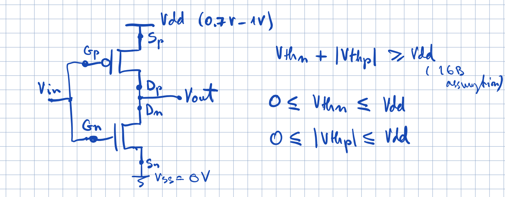
> 🔔我们一般会有以下å‡è®¾:
> 1. $V_{thn}+|V_{thp}|\geq V_{dd}$æ—¶
> 2. $0\leq V_{thn}\leq V_{dd}$
> 3. $0\leq |V_{thp}|\leq V_{dd}$
> 
**当上述三个æ¡ä»¶éƒ½æ»¡è¶³æ—¶ï¼Œå½“左侧输入**$V_{in}$**时有且仅有一个**`**Transistor**`**的电路会被接通**（Also a Sanity Check, 两个通路ä¸èƒ½åŒæ—¶æŽ¥é€šï¼‰ï¼š
> 1. 当输入的电压$V_{in}=0V$(`Logic 0 False`)时，输出的电压$V_{out}=V_{dd}=[0.7V,1.0V]$:
> 
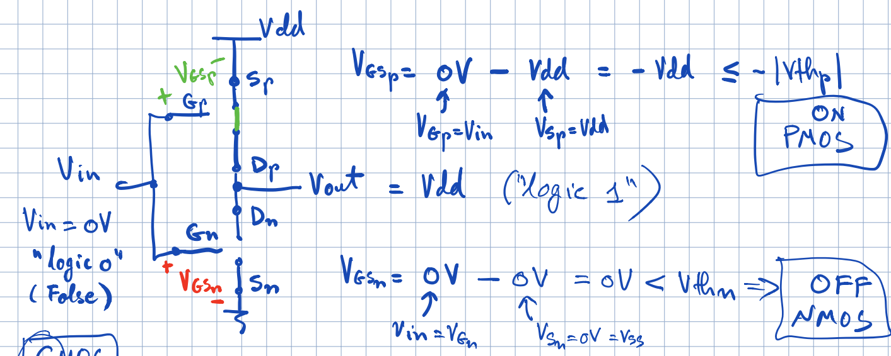
> 2. 当输入的电压$V_{in}=V_{dd}=1V$(`Logic 1，True`)时, 输出的电压是$0V$, 相当于$not~V_{in}$:
> 
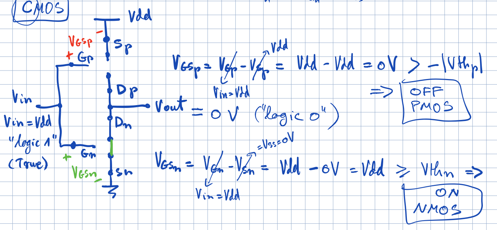
> **Real Model:**
> 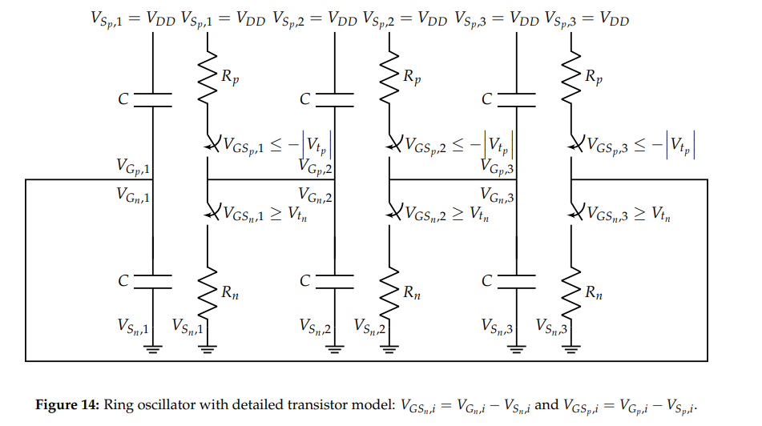

### Circuit Analysis Caveats
> 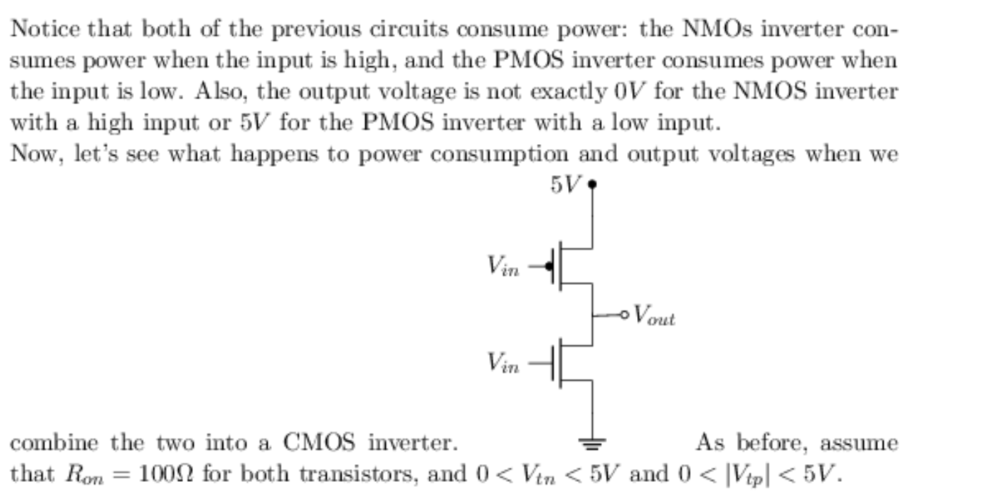
> 如果此时$V_{in}=5V$, 则$V_{GS, P}=V_{in}-V_{DD}=0V$, 所以`PMOS`是`Closed`，而$V_{GS,N}=V_{in}-0V=5V$, 所以`NMOS`是`Open`的。
> 此时è¦æ³¨æ„我们ä¸éœ€è¦æŠŠä¸¤ä¸ªç”µå®¹è€ƒè™‘è¿›æ¥ï¼Œå› ä¸ºè¿™ä¸¤ä¸ªç”µå®¹ä¸¤ç«¯çš„电压都是ä¸å˜çš„，所以电æµå‡ä¸ºé›¶ï¼Œå¯ä»¥çœ‹æˆ`Open Circuit`。
> 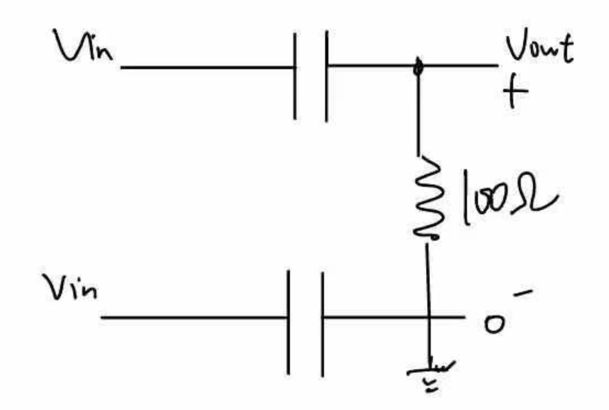
> åªéœ€è¦è€ƒè™‘下é¢çš„模型å³å¯:
> 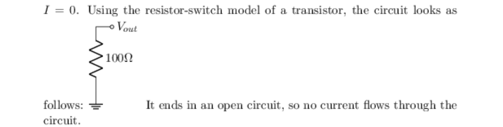

 

## Multi-NOT GATE - Ring Oscillator
> 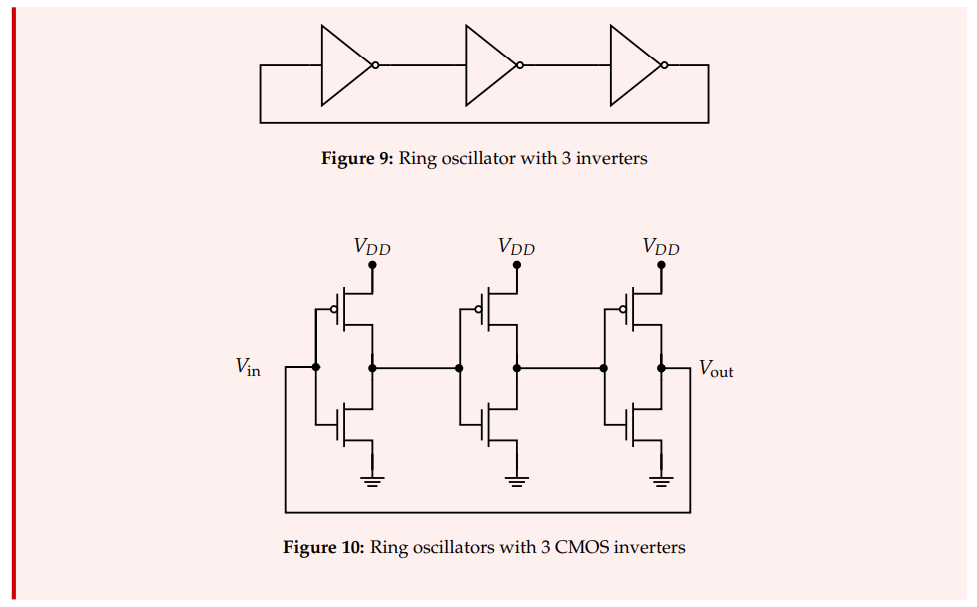
> **Real Model:**
> 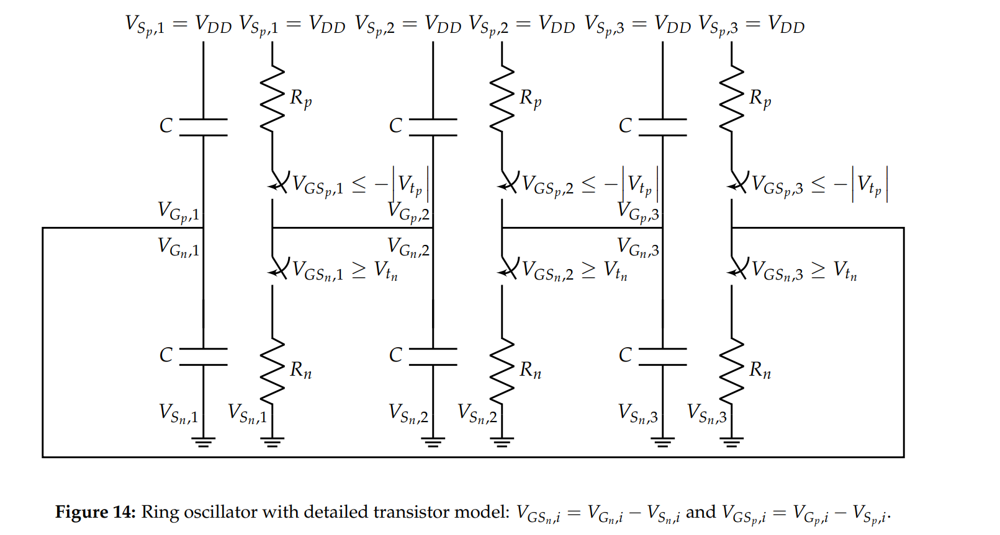

## NAND GATE
> **From Discussion 01A Fa21**
> 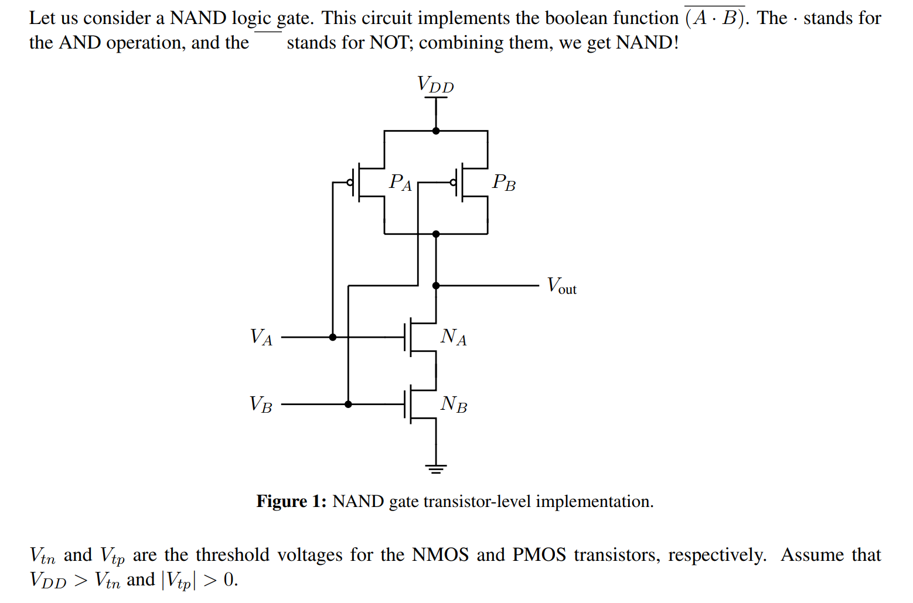

**Proof of Validity**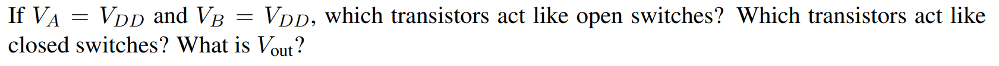

# Cascading Logic
## Example 1 - Low to High
### Circuit Modelâ­â­â­â­â­
> 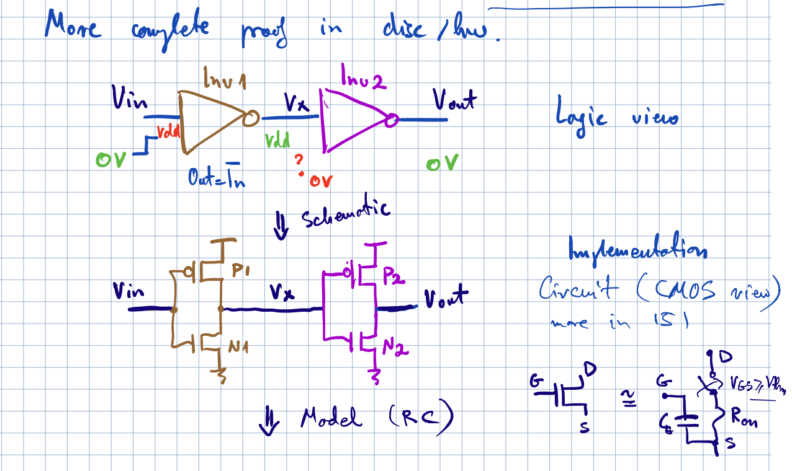
> **â”: 为什么**$V_x(0)=V_{DD}$**?**
> 这涉åŠåˆ°ç”µè·¯ç¨³å®šï¼Œå› ä¸ºåœ¨$V_{in}=0V$ç»è¿‡å¾ˆé•¿æ—¶é—´åŽï¼Œç”µè·¯æœ€ç»ˆä¼šè¶‹äºŽç¨³å®šï¼Œæ­¤æ—¶ç”µè·¯ä¸­ä¸åº”该有电æµï¼Œæ‰€ä»¥ç”µå®¹$C_{GP,2},C_{GN,2}$两端的电压å‡ä¸ºé›¶ï¼Œæ‰€ä»¥$V_x=V_{DD}$。
> 也å¯ä»¥å‚考`Example 2`中的推导。
> **â”：为什么ä¸éœ€è¦è€ƒè™‘左侧电容和å³ä¾§ç”µé˜»ï¼ˆä¸ºä»€ä¹ˆåªè¦è€ƒè™‘三个电å­å…ƒä»¶å°±èƒ½å¾—到目标电压方程）？**
> 因为æµç»å·¦ä¾§ç”µå®¹å’Œå³ä¾§ç”µé˜»çš„电æµä¸ä¼šå¯¹ä¸­é—´çš„电压计算产生影å“。我们的KCLåªéœ€è¦å…³æ³¨ä¸‰ä¸ªç”µå­å…ƒä»¶å³å¯ã€‚
> **几个注æ„点:**
> 1. 一旦开关闭åˆï¼Œå·¦ä¾§ç”µå®¹å°±ä¼šè¢«`shorted`。
> 2. **第二个**`**CMOS**`**的电阻ä¸éœ€è¦è€ƒè™‘（计算**$V_{out}$**的时候åªéœ€è¦è€ƒè™‘三个电å­å…ƒä»¶ï¼‰**

### Circuit Analysis(Solving Differential Equations)
> 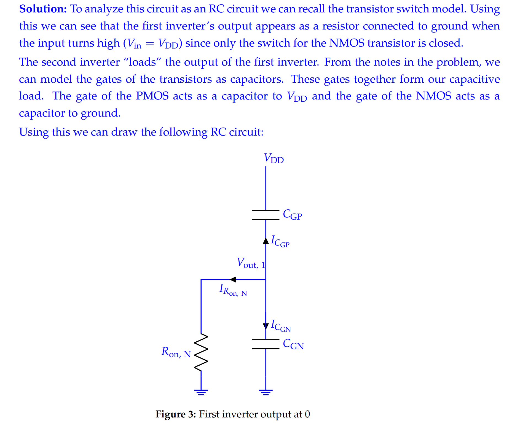

**Set Up DE**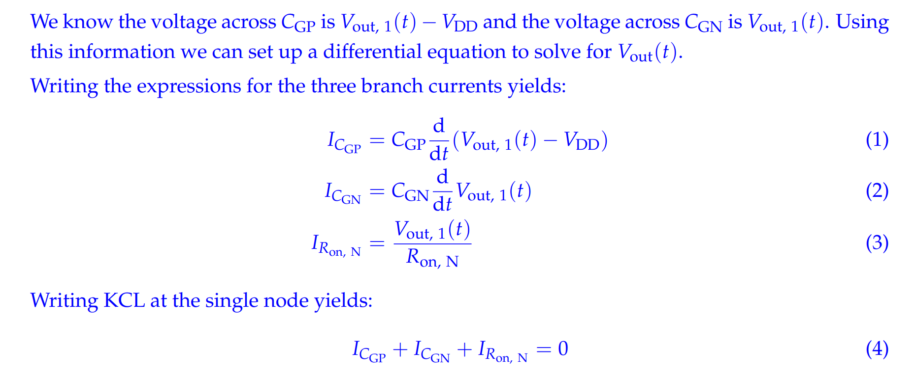
**Solving DE**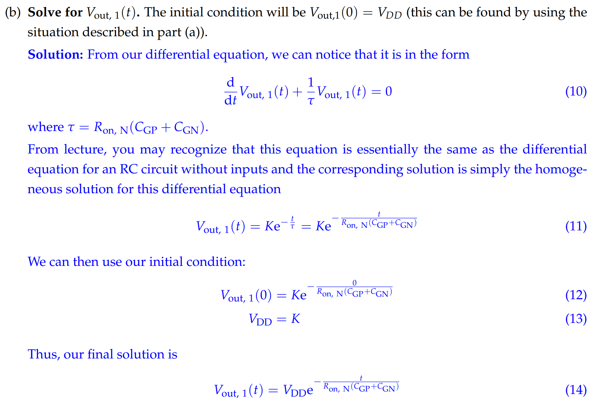
**Sketch the Output**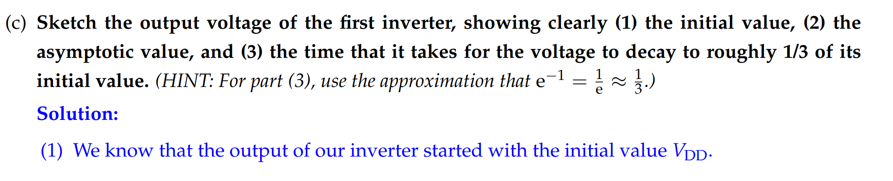
**Comparative Analysis - Different Values of RC**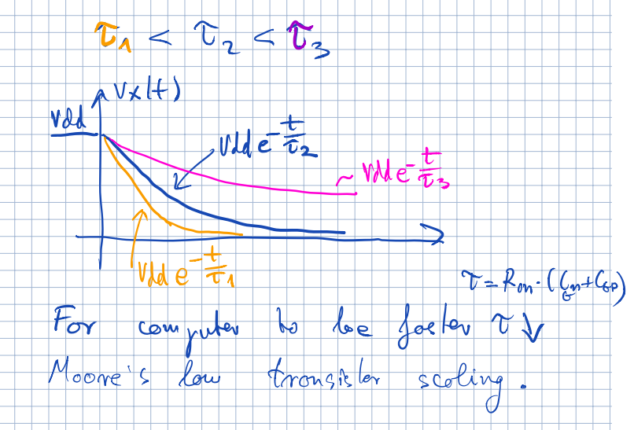

## Example 2 - High to Low
### Circuit Model
> 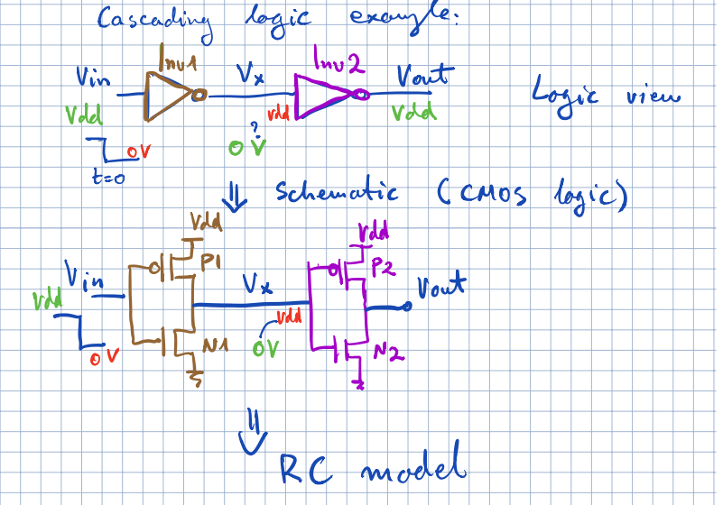

### Circuit Analysis(Solving Differential Equations)
> `KCL`: $I_1+I_2+I_3=0\quad(1)$
> `Elements`: 
> 1. $V_1=I_1\cdot R_{on, n1}=V_x-V_{dd}$, $I_1=\frac{V_1}{R_{on, n1}}$
> 2. $I_2=C_{G_{n2}}\cdot \frac{dV_2}{dt}$, $V_2=V_x$
> 3. $I_3=C_{G_{p2}}\cdot \frac{dV_3}{dt}$, $V_3=V_x-V_{dd}$
> 
将`Elements`代入$(1)$中有:
> 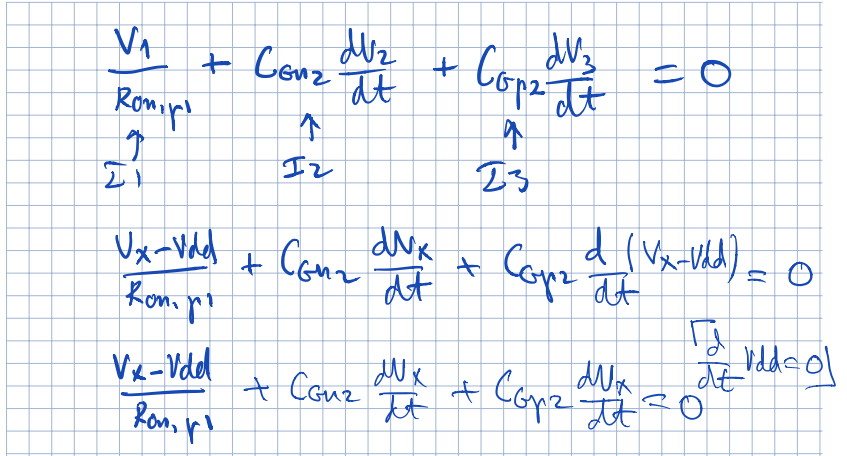

## Equivalent Circuit
> **HW02 Sp23 P4**
> 

**(a) NMOS**
**(b) PMOS**
**(c) CMOS**

## Cascading Circuit
> **HW01 Fa21 P7**
> 

**(a)**
**(b)**
**(c)**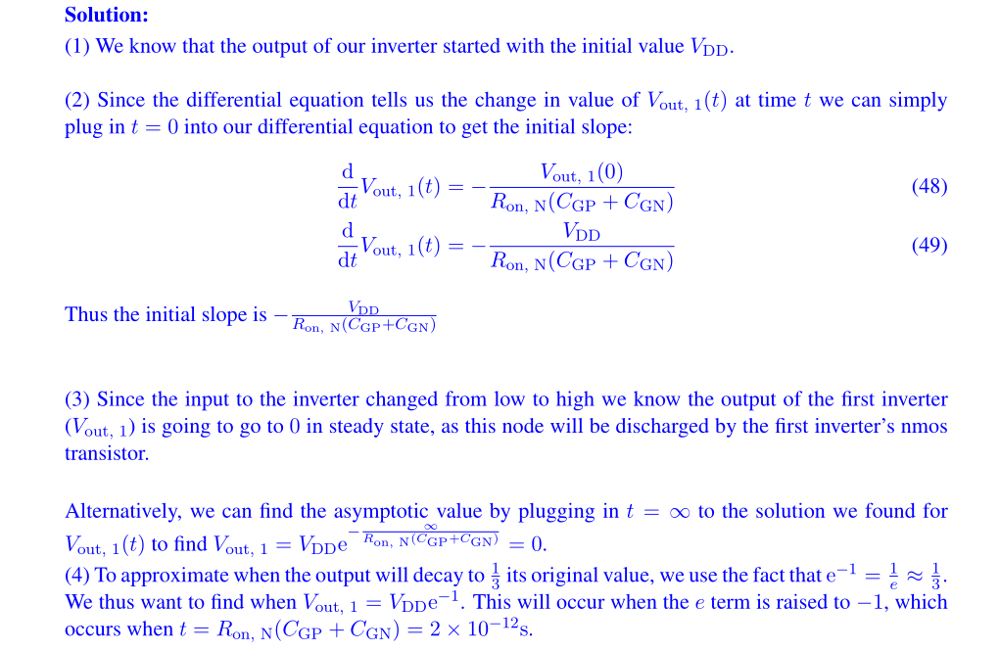
**(d)**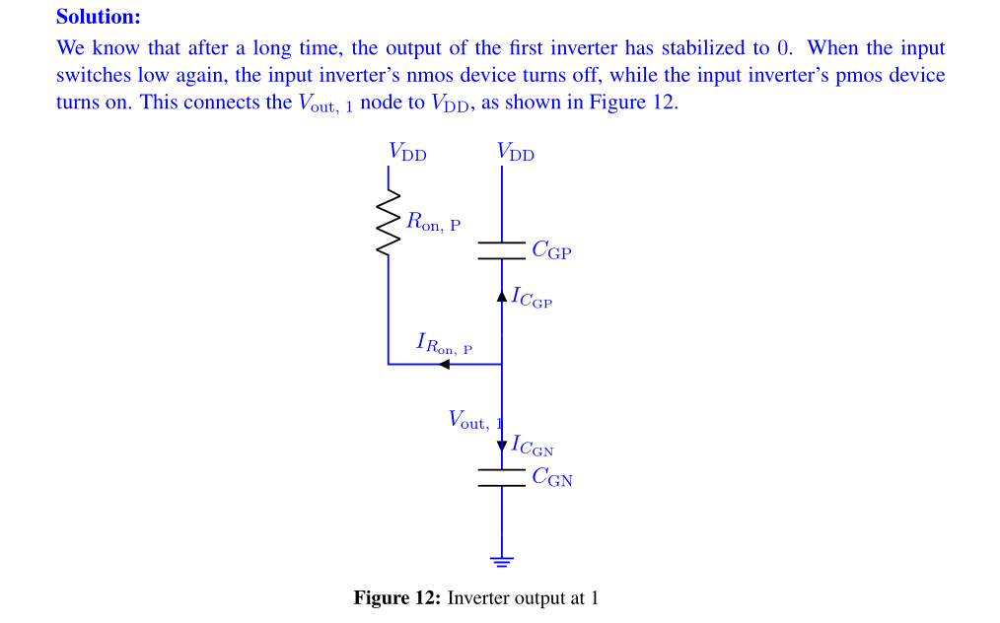

# Transistors with RC Circuit
> **Disc02A Sp23 P1**
> 之å‰çš„`Transistor`模型我们都是å‡è®¾`Gate`是直接和$V_{in}$相连的，所以$V_{in}$çš„å˜åŒ–会立å³å应到$V_G$上，但是本题中我们移除这一å‡è®¾ï¼Œæˆ‘们探究如果$V_{in}$å’Œ`Gate`之间有一个电阻的情况，这其实就是最简å•çš„`RC`电路，如下图所示:
> 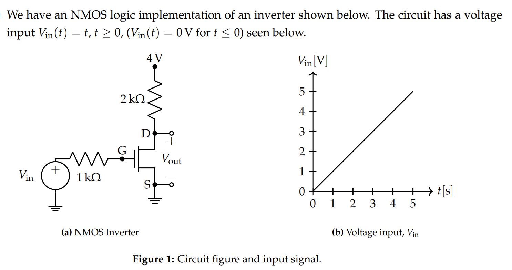
> 我们会探究ä¸åŒçš„`NMOS`模型下$V_{out}$çš„å˜åŒ–情况, 具体有如下四ç§:
> 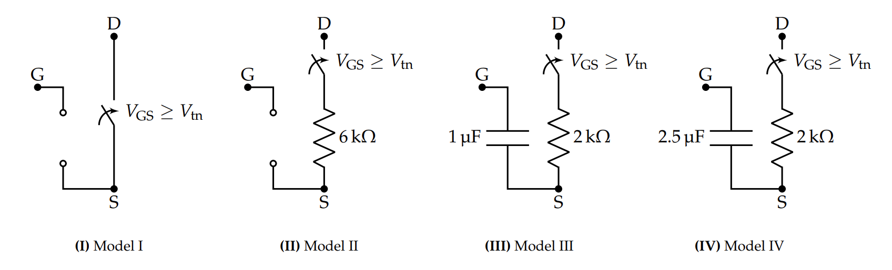

## Model I
> 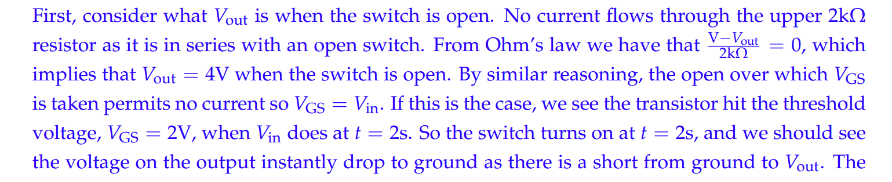

## Model II
> 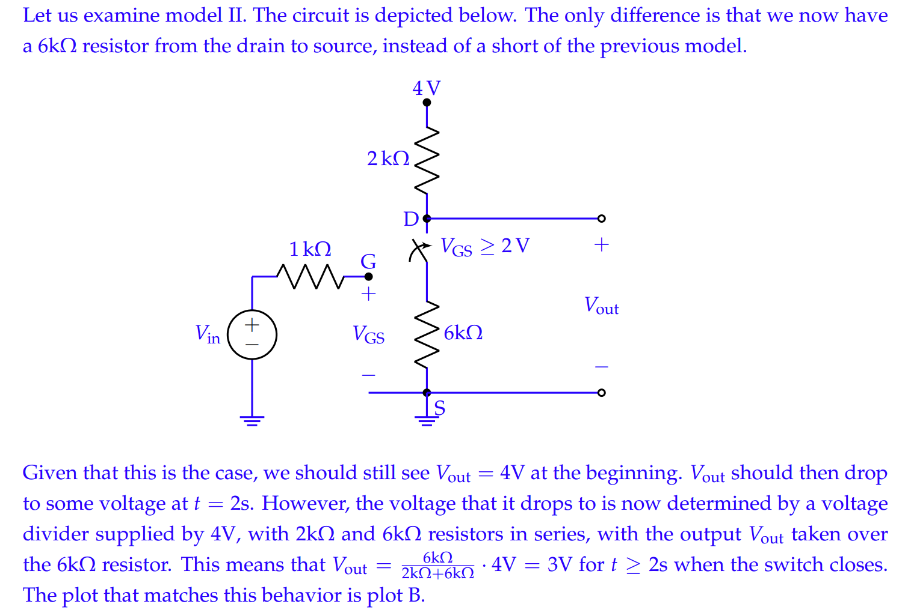

## Model III/ IV: RC Circuit
> `Model III`和`Model IV`其实就是最基本的`RC Circuit`, 如下图所示:
> 

