# Second Order DE to Vector DE
## Method
> 对于一个`Second Order DE`$\frac{\mathrm{d}^2 y(t)}{\mathrm{d} t^2}+a \frac{\mathrm{d} y(t)}{\mathrm{d} t}+b y(t)=0$来说, 我们可以：
> 如果我们令 $x_1(t)=y(t), x_2(t)=\frac{\mathrm{a} y(t)}{\mathrm{d} t}$, 则我们有:
> $\begin{aligned}& \frac{\mathrm{d} x_1(t)}{\mathrm{d} t}=\frac{\mathrm{d} y(t)}{\mathrm{d} t}=x_2(t) \\& \frac{\mathrm{d} x_2(t)}{\mathrm{d} t}=\frac{\mathrm{d}^2 y(t)}{\mathrm{d} t^2}=-a \frac{\mathrm{d} y(t)}{\mathrm{d} t}-b y(t)=-a x_2(t)-b x_1(t)\end{aligned}$
> 于是我们可以将`Second Order DE`转化成如下的`Vector DE`:
> $\frac{\mathrm{d}}{\mathrm{d} t} \vec{x}=\frac{\mathrm{d}}{\mathrm{d} t}\left[\begin{array}{l}x_1 \\x_2\end{array}\right]=\left[\begin{array}{cc}0 & 1 \\-b & -a\end{array}\right]\left[\begin{array}{l}x_1 \\x_2\end{array}\right]$

## Example 1: Transformation
### Solving Vector DE
> **HW03 Fa21 P5**
> 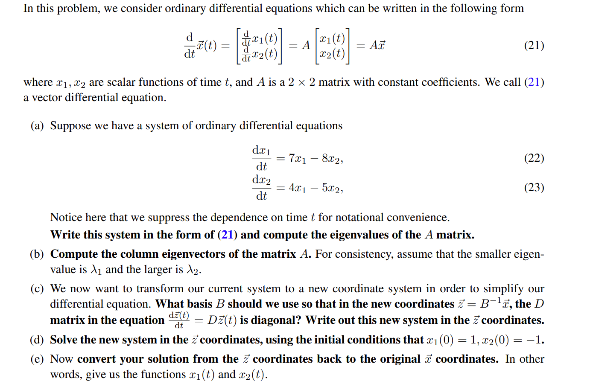

**(a)**$\begin{bmatrix}\frac{dx_1(t)}{dt}\\\frac{dx_2(t)}{dt} \end{bmatrix}=\begin{bmatrix}7&-8\\4&-5 \end{bmatrix}\begin{bmatrix}x_1(t)\\x_2(t) \end{bmatrix}$
我们对$A=\begin{bmatrix} 7&-8\\4&-5\end{bmatrix}$求解特征值：
$(7-\lambda)(-5-\lambda)+32=0$, 所以$\lambda_1=-1,\lambda_2=3$
**(b)**$\lambda_1=-1$, 对应的特征向量是$\begin{bmatrix} 1\\1  \end{bmatrix}$。
$\lambda_2 = 3$，对应的特征向量是$\begin{bmatrix} 2\\1\end{bmatrix}$。
所以`Column Eigenvectors`是$\begin{bmatrix} 1&2\\1&1\end{bmatrix}$。
**(c)**我们只需使用$B=\begin{bmatrix} 1&2\\1&1\end{bmatrix}$作为我们的`New Basis`, 也就是`Eigen Basis`, 此时$D=\begin{bmatrix} -1&0\\0&3\end{bmatrix}$
$\frac{d\vec{z}(t)}{dt}=D\vec{z}(t)$。
**(d)**首先我们需要求出$\vec{z}(0)=B^{-1}\vec{x}(0)=\begin{bmatrix} -1&2\\1&-1\end{bmatrix}\begin{bmatrix} 1\\-1\end{bmatrix}=\begin{bmatrix} -3\\2\end{bmatrix}$
根据一阶线性常系数齐次微分方程，我们有$\vec{z}(t)=\begin{bmatrix} -3e^{-t}\\2e^{3t}\end{bmatrix}$
**(e)**所以$\vec{x}(t)=B\vec{z}(t)=\begin{bmatrix} 1&2\\1&1\end{bmatrix}\begin{bmatrix} -3e^{-t}\\2e^{3t}\end{bmatrix}=\begin{bmatrix}-3e^{-t}+4e^{3t}\\-3e^{-t}+2e^{3t}\end{bmatrix}$

### Converting Second Order to Vector
> 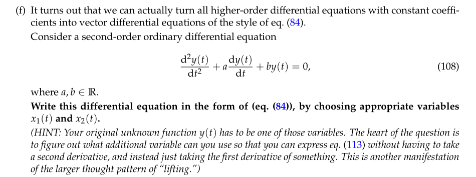
> 注意$(g)$问中的两个特征值必须都是**实数根且不同**才满足上述解的形式。

**(f) Converting from Second Order DE to Vector DE**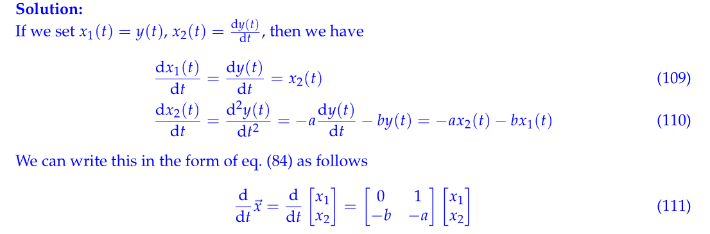
**(g) Solving IVP**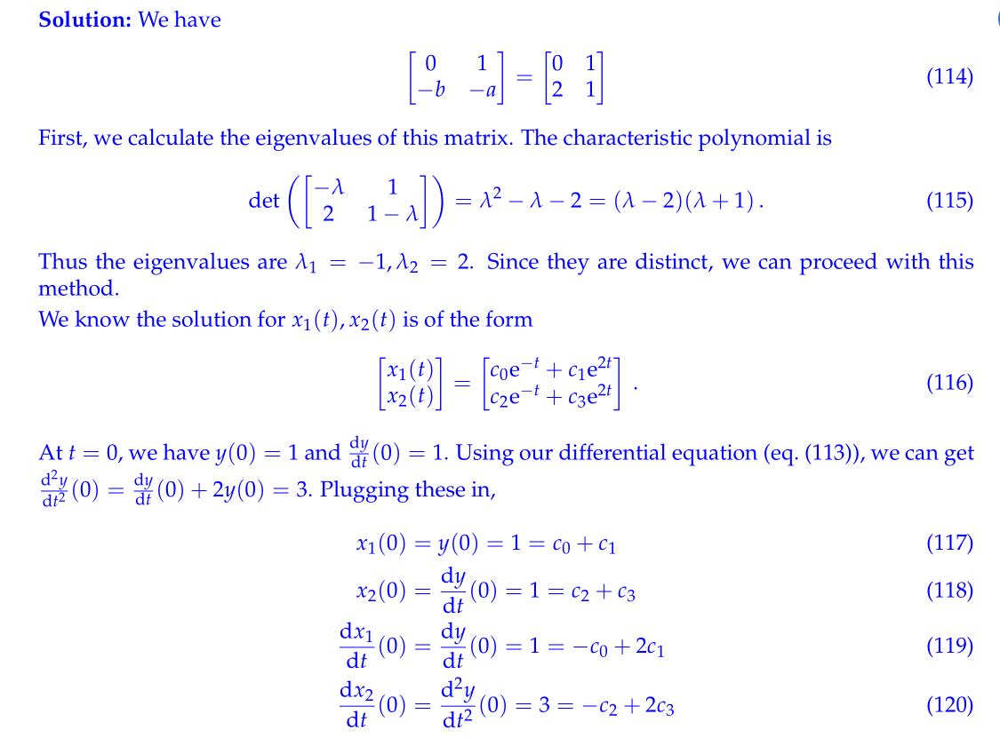

## Example 2: RLC Circuit
> **Hw05 Fa21 P4**
> 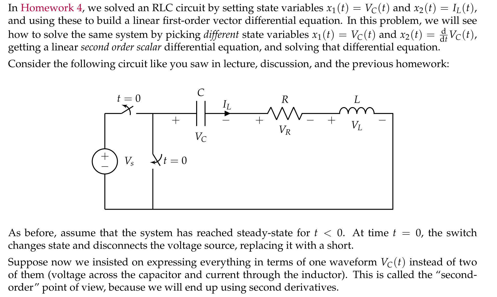

**Set up Second Order DE**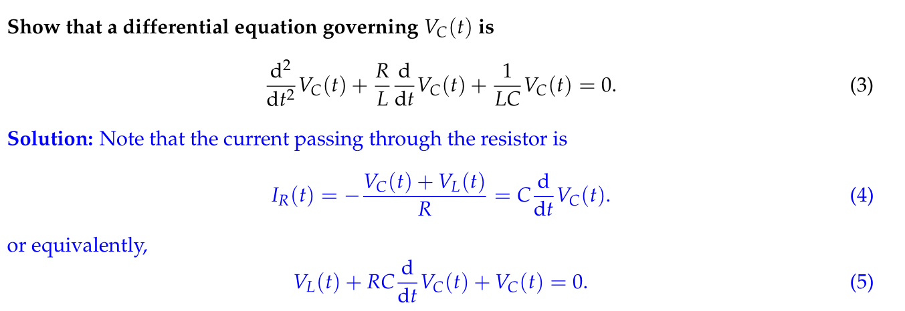
注意这里$I_L(t)$是没有办法化成二阶形式的，所以我们的`Damping Analysis`基本针对于由$V_C(t)$构成的二阶常系数微分方程。
**Convert to Vector DE and Solve**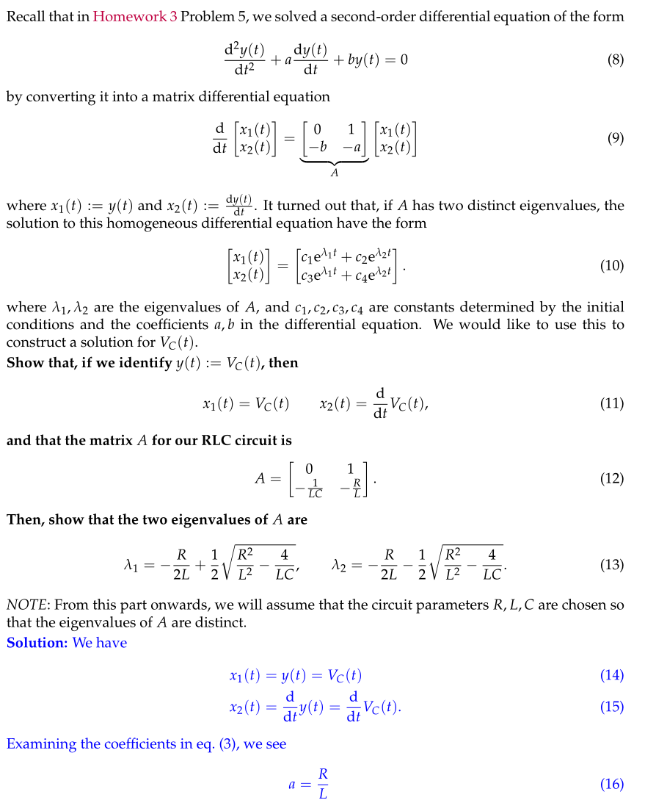
**Solve for Coeffients**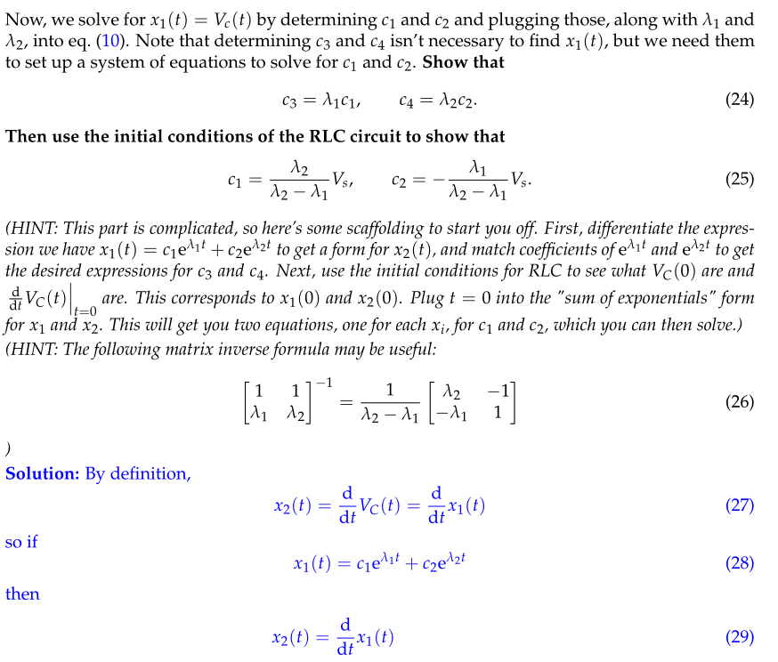
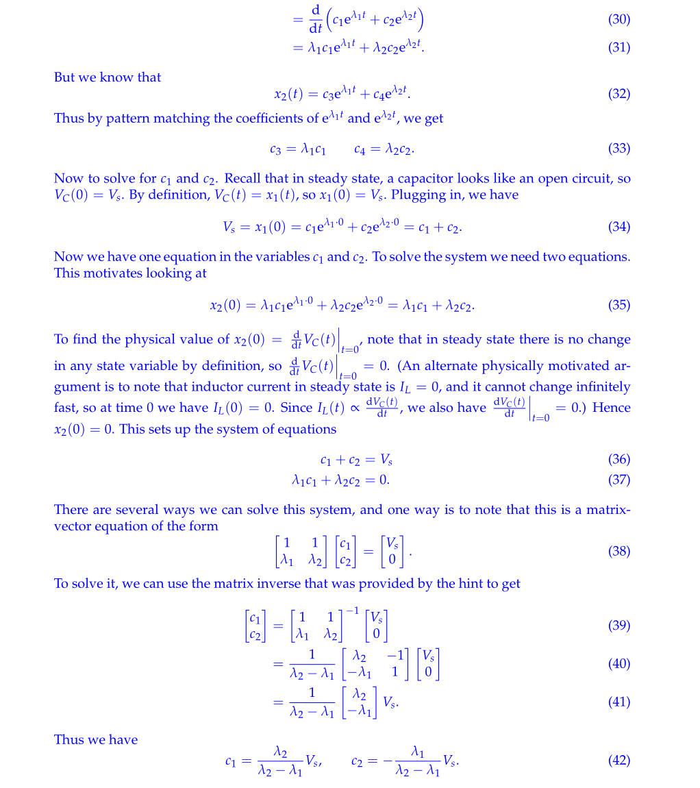

# Second Order DEs
## Second Order DE Analysis
> 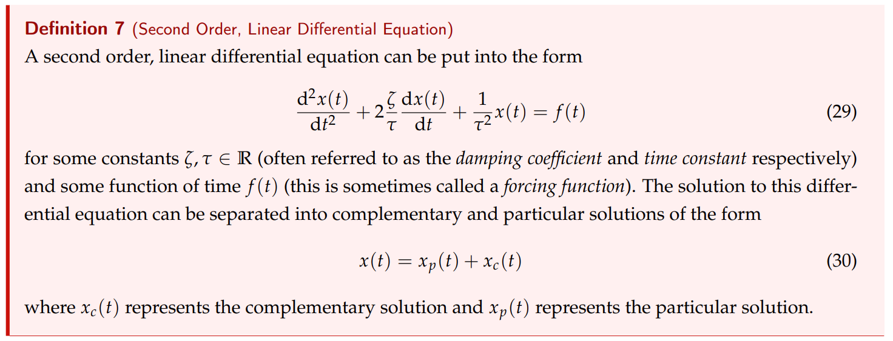
> 🔔注意点:
> 1. $s_1$和$s_2$是$\frac{d^2x(t)}{dt}+2\frac{\zeta}{\tau}\frac{dx(t)}{dt}+\frac{1}{\zeta^2}x(t)=0$的两个根，用$\frac{-b\pm \sqrt{b^2-4ac}}{2a}$求得。
> 2. $K_1$和$K_2$需要通过$\frac{dx(0)}{dt}$和$x(0)$这两个`Initial Conditions`来求出。

## Computing Components
> 一般形式:$\frac{\mathrm{d}^2 x(t)}{\mathrm{d} t^2}+2 \frac{\zeta}{\tau} \frac{\mathrm{d} x(t)}{\mathrm{d} t}+\frac{1}{\tau^2} x(t)=f(t)$/ $\frac{\mathrm{d}^2 x(t)}{\mathrm{d} t^2}+2 \alpha \frac{\mathrm{d} x(t)}{\mathrm{d} t}+w_0^2 x(t)=f(t)$
> `Example RLC Circuit`:$\frac{\mathrm{d}^2 v_C(t)}{\mathrm{d} t^2}+\frac{R}{L} \frac{\mathrm{d} v_C(t)}{\mathrm{d} t}+\frac{1}{L C} v_C(t)=\frac{50}{L C}$
> 我们可以计算一些量:
> 1. $\tau^2=LC$, 即$\tau=\sqrt{LC}$
> 2. $2 \frac{\zeta}{\tau}=\frac{R}{L}$, $\zeta=\frac{R\tau}{2L}=\frac{R\sqrt{LC}}{2L}$, 来判断`Homogeneous Solution`的形式。
> 3. `Eigenvalues/Roots`$s_1:=-\frac{\zeta}{\tau}+\frac{1}{\tau} \sqrt{\zeta^2-1} \text { and } s_2:=-\frac{\zeta}{\tau}-\frac{1}{\tau} \sqrt{\zeta^2-1} \text {. }$`Eigenvalues`是针对`Vector`形式的微分方程组。`Roots`是针对`Second Order DE`的特征方程。
> 4. `Damping Coefficient`: $\alpha = \frac{R}{2L}$
> 5. `Undamped Resonant Frequency`: $w_0=\frac{1}{\sqrt{LC}}=\frac{1}{\tau}$
> 6. `Natural Frequency`: $\omega_n=\sqrt{w_0^2-\alpha^2}$，这个频率是使得我们的特征多项式的解为纯虚数的频率。对于$\frac{\mathrm{d}^2 x(t)}{\mathrm{d} t^2}+2 \alpha \frac{\mathrm{d} x(t)}{\mathrm{d} t}+w_0^2 x(t)=0$来说，如果求根判断   $b^2-4ac<0$，即两根是复数，则$\lambda_{1,2}=\frac{-2\alpha\pm 2j\sqrt{w_0^2-\alpha^2}}{2}=-\alpha\pm j\sqrt{w_0^2-\alpha^2}$ , 此时$j$后面这项称为系统的自然频率，此时是`Underdamped`或者`Undamped Case`(如果$\alpha=0$)。
> 7. `Forcing Function`: $f(t)$

## RLC Circuit Examples
### Example 1: RLC Overdamped⭐⭐⭐
> **HW03 Sp23 P7**
> 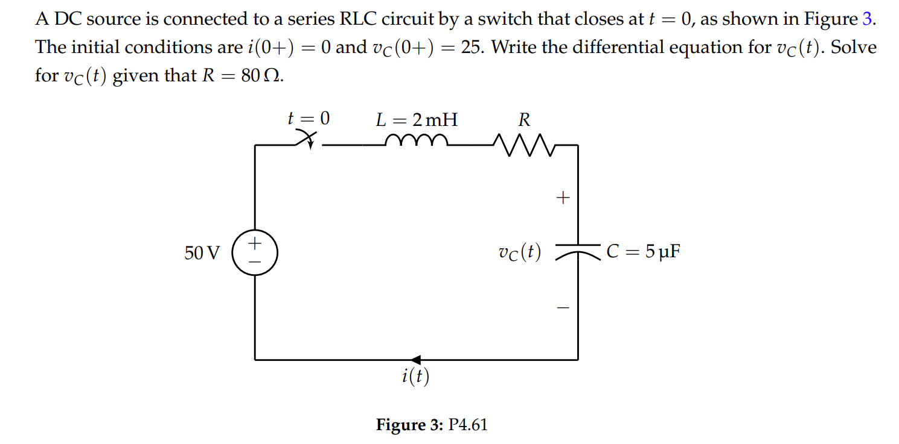
> 首先进行电路分析获得微分方程:
> We can apply KVL to the circuit to obtain:
> $\begin{aligned}50 & =v_L(t)+v_R(t)+v_C(t) \\& =L \frac{\mathrm{d} i(t)}{\mathrm{d} t}+i(t) R+v_C(t) \\& =L \frac{\mathrm{d} i(t)}{\mathrm{d} t}+R C \frac{\mathrm{d} v_C(t)}{\mathrm{d} t}+v_C(t)\end{aligned}$
> Now, we have that $L \frac{\mathrm{d} i(t)}{\mathrm{d} t}=L \frac{\mathrm{d}}{\mathrm{d} t}\left(C \frac{\mathrm{d} v_C(t)}{\mathrm{d} t}\right)=L C \frac{\mathrm{d}^2 v_C(t)}{\mathrm{d} t^2}$. Plugging this in, we get
> $\begin{aligned}& L C \frac{\mathrm{d}^2 v_C(t)}{\mathrm{d} t^2}+R C \frac{\mathrm{d} v_C(t)}{\mathrm{d} t}+v_C(t)=50 \\& \frac{\mathrm{d}^2 v_C(t)}{\mathrm{d} t^2}+\frac{R}{L} \frac{\mathrm{d} v_C(t)}{\mathrm{d} t}+\frac{1}{L C} v_C(t)=\frac{50}{L C}\end{aligned}$
> 留意到右侧的输入`Forcing Function`, 我们要求$v_C(t)=v_{C_h}(t)+v_{C_p}(t)$，因为$R\neq 0$, 所以在$t\to \infty$时，`Transient Part`会衰减到零:
> 1. 将电容等效为`Open Circuit`, 并将电导等效为`Wire`, 我们有$v_{C_p}(t)=50V$。
> 2. 计算$\zeta=\frac{R\tau}{2L}=\frac{R\sqrt{LC}}{2L}=2>1$, 所以是`Overdamped Case`, $v_{C_h}(t)=K_1e^{s_1t}+K_2e^{s_2t}$, $s_1:=-\frac{\zeta}{\tau}+\frac{1}{\tau} \sqrt{\zeta^2-1} \text { and } s_2:=-\frac{\zeta}{\tau}-\frac{1}{\tau} \sqrt{\zeta^2-1} \text {. }$可知$s_1=-2679.49$, $s_2=-37320.5$
> 3. 利用初值条件$v_C(0)=0 \text { and }\left.\frac{\mathrm{d} v_{\mathcal{C}}(t)}{\mathrm{d} t}\right|_{t=0}=\frac{i(0)}{C}=0$求解通解: $v_C(t)=v_{C_P}(t)+v_{C_C}(t)=50+K_1 \mathrm{e}^{s_1 t}+K_2 \mathrm{e}^{s_2 t}$
> 
 $\begin{aligned}&v_C(0)=25=50+K_1+K_2\\&\left.\frac{\mathrm{d} v_C(t)}{\mathrm{d} t}\right|_{t=0}=0=s_1 K_1+s_2 K_2\end{aligned}$
> 得到$K_1=-26.93 \text { and } K_2=1.93$和$v_C(t)=50+(-26.93) \mathrm{e}^{-2679.49 t}+(1.93) \mathrm{e}^{-37320.5 t}$

### Example 2: RLC Overdamped⭐⭐⭐
> **Disc03A Sp23 P1**
> 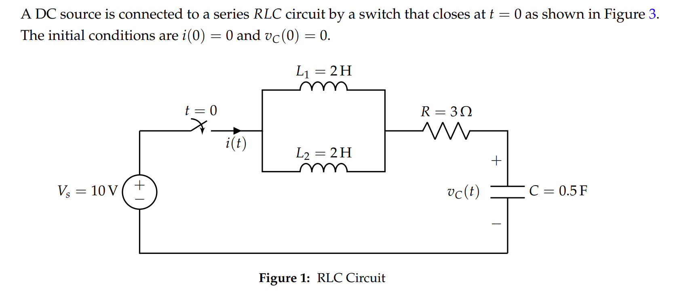

**(a) Find Equivalent Circuit**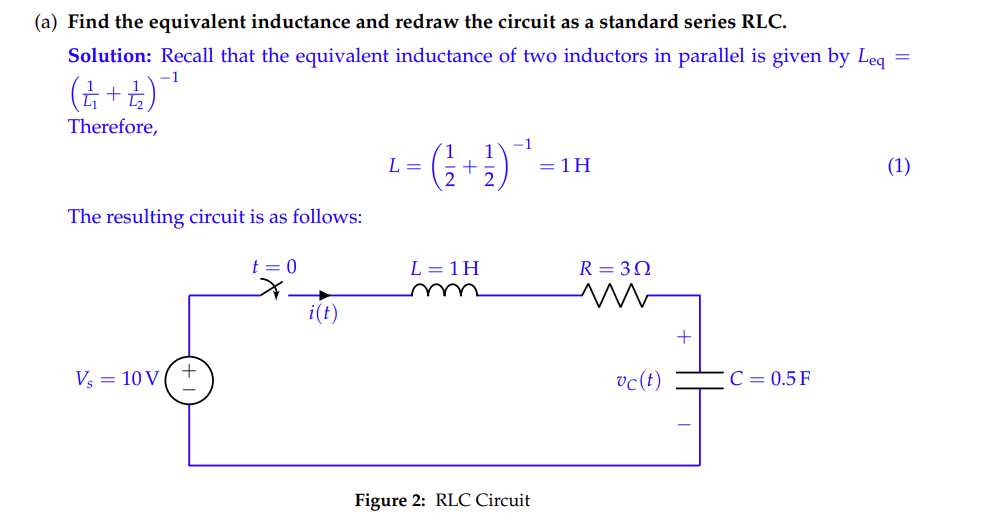
**(b) Set up Differential Equations**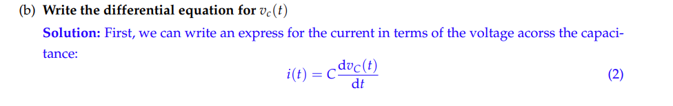
**(c) Solve the Differential Equations⭐⭐⭐**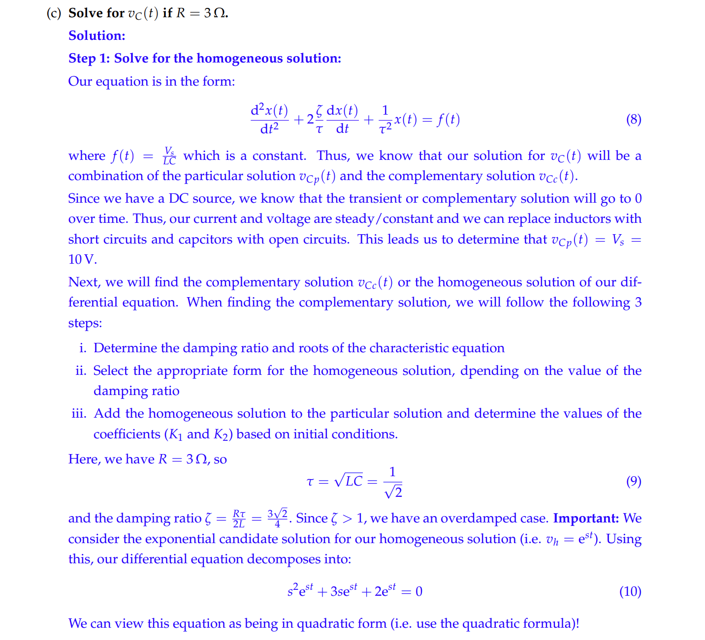
**(d) Circuit in Steady State**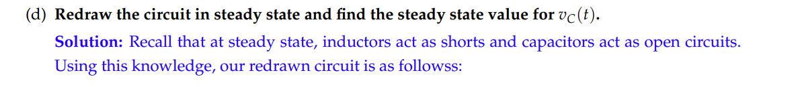
**(e) Plot the Solution**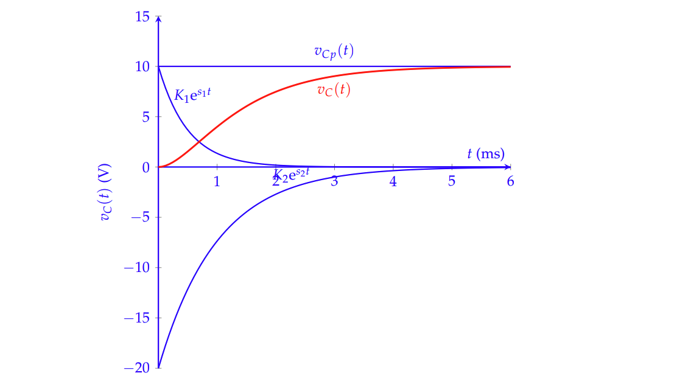

## LC Tank Example
> 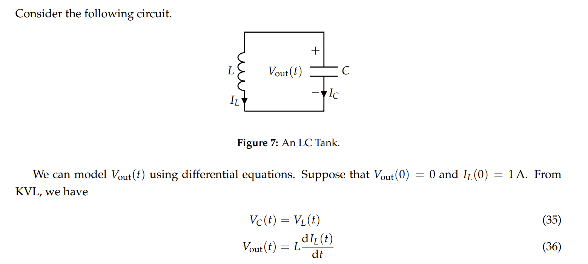

# Resources
> Note 4 from Fa21
> Note 3/4b from Sp23

