# Vector DEs Basics
## RCRC Circuit
> 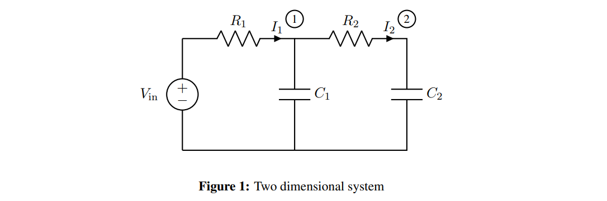
> 下面的系统一般称为`RCRC Circuit`, 也是最常见的二维系统。

### Steady State
> 对于这个系统，稳定状态指的是两个电容两端的电压都不发生变化，即$\frac{dV_{C_1}(t)}{dt}=\frac{dV_{C_2}(t)}{dt}=0$, 即$I_{C_1}=I_{C_2}=0$。同时如果我们对`Node 1`和`Node 2`使用`KCL`的话，我们会得到$I_2=0$, $I_1-I_2=0$, 即$I_1=0$。所以$I_1=I_2=0$。这就意味着电流流过电阻$R_1$和$R_2$时没有电势下降，也就是说$V_{C_1}=V_{C_2}=V_{in}$。
> **所以综上所述：**
> - 如果$V_{in}=0V$且经过了足够长的时间使得系统达到了稳定状态，则$V_{C_1}=V_{C_2}=0V$。
> - 如果$V_{in}=1V$且经过了足够长的时间使得系统达到了稳定状态，则$V_{C_1}=V_{C_2}=1V$。
> 
**简单记忆法，对于**`**RCRC**`**电路来说，**$V_{C_1}$**和**$V_{C_2}$**的稳定状态下的电压值和**$V_{in}$**的电压值一致。**

### Transient State
> 对于这个系统，`Transient State`指的是，输入$V_{in}$发生变化后$V_{C_1}$和$V_{C_2}$以及$I_{C_1}$和$I_{C_2}$相应的变化情况。假设$t<=0$时，$V_{in}=1V$，$t>0$时$V_{in}=0V$, 则假设$t<\infty$, 即电路尚未达到稳定状态，则我们对电路使用`Circuit Analysis`可得:
> $\begin{aligned} I_1&=I_{C_1}+I_{C_2}\\V_{in}(t)-I_1R_1&=V_{C_1}(t)\\V_{C_1}(t)-I_{C_2}R_2&=V_2(t)\end{aligned}$
> 根据电容性质我们有:
> $\begin{aligned}I_{C_1}&=\frac{dV_{C_1}(t)}{dt}C_1\\I_{C_2}&=\frac{dV_{C_2(t)}}{dt}C_2\end{aligned}$
> 最终我们可以得到:
> 

### Vector Differential Equations
> 我们可以把上述二维微分方程写成向量形式, 我们定义$\vec{x}(t)=\begin{bmatrix} V_1(t) \\V_2(t)\end{bmatrix}$: 
> 

### General Case
> 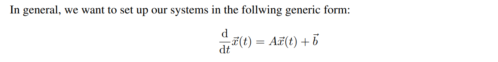
> 当输入电压$V_{in}=0V$时，$\vec{b}=\vec{0}$, 因为没有额外的电压输入系统。

## LC Tank
> 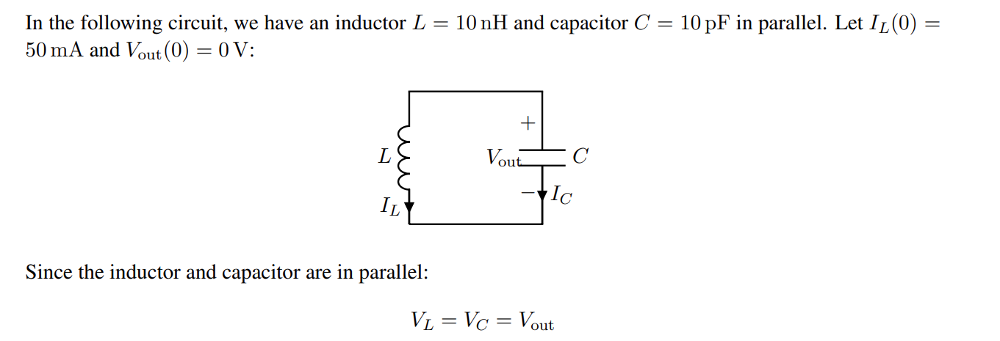

**Current**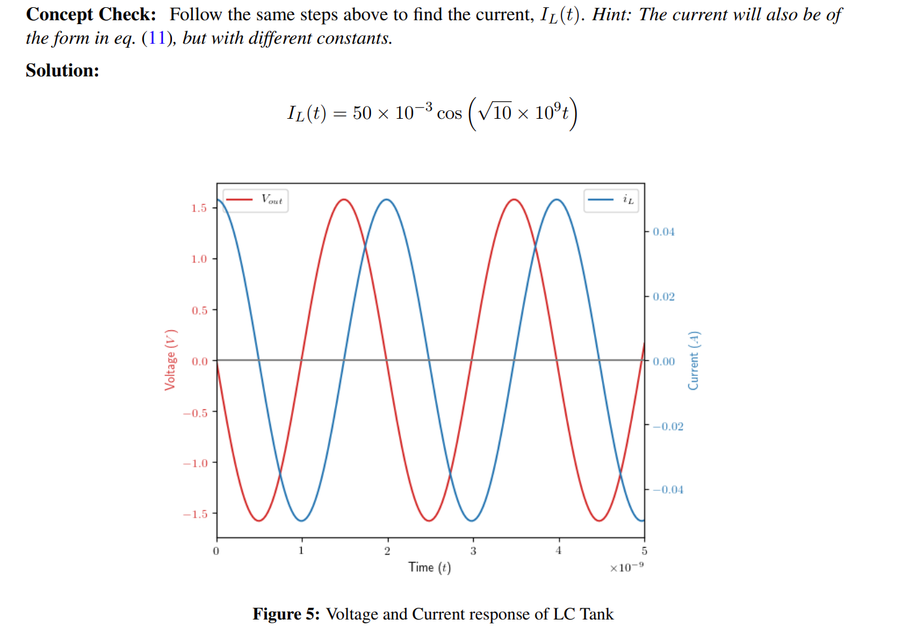
**Energy Stored**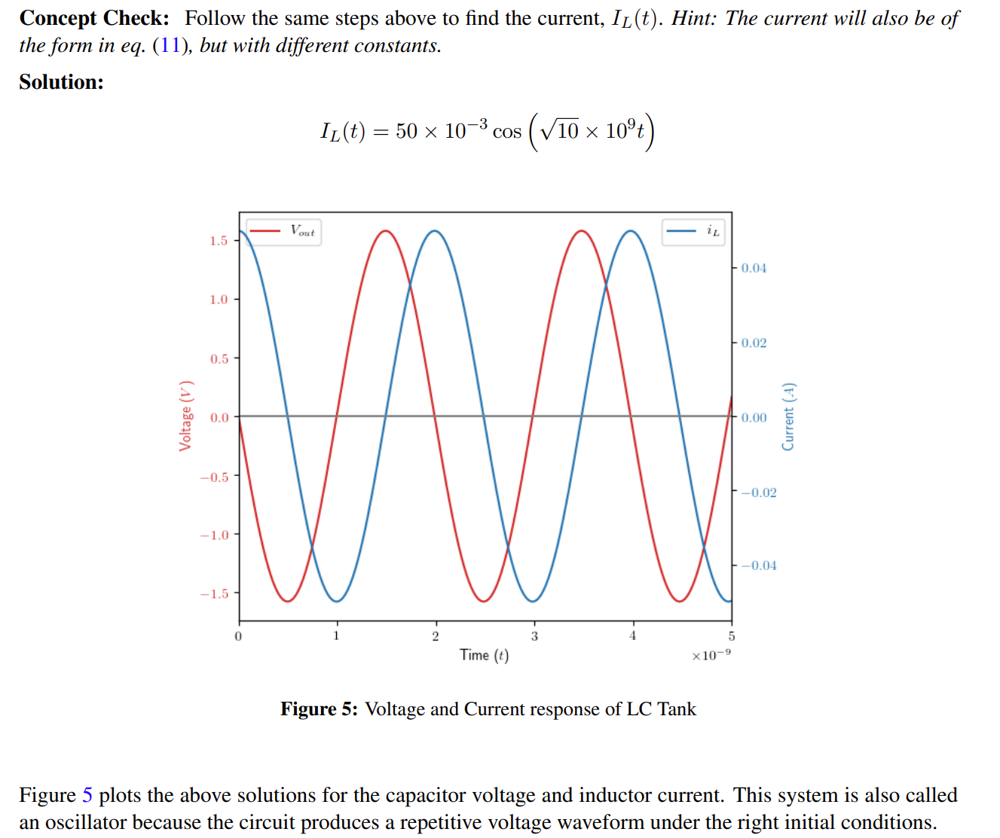

## RLC Circuit - Damping Analysis
### Circuit Damping Analysis
> **HW04 Fa21 P2~P6**
> 
> 首先我们对电路进行`State Space`分析:
> 1. 电路中有电容和电导，分别对应状态量$V_C$和$V_L$, 电阻状态
> 2. 电路中有电压源，是一个`Independent Source`。
> 
假设状态向量是$\vec{x}(t)=\begin{bmatrix}I_L(t) \\V_C(t)\end{bmatrix}$, 我们的目标就是求出一个形如$\frac{d\vec{x}(t)}{dt}=\mathbf{A}\vec{x}(t)+\mathbf{B}\vec{b_s}$的微分方程组
> 1. **首先我们进行电路分析:**
>    1. 对于电容的状态$V_C(t)$来说，我们有$\begin{aligned}I_C(t) & =C \frac{\mathrm{d}}{\mathrm{d} t} V_C(t)=I_L(t) \\\frac{\mathrm{d}}{\mathrm{d} t} V_C(t) & =\frac{1}{C} I_L(t) .\end{aligned}$ 。
>    2. 对于电导的状态$I_L(t)$来说，我们有$V_C(t)+R I_L(t)+L \frac{\mathrm{d}}{\mathrm{d} t} I_L(t)=V_s=0$。
> 
于是整理之后可得:
> $\left[\begin{array}{l}\frac{\mathrm{d}}{\mathrm{d} t} x_1(t) \\\frac{\mathrm{d}}{\mathrm{d} t} x_2(t)\end{array}\right]=\left[\begin{array}{cc}-\frac{R}{L} & -\frac{1}{L} \\\frac{1}{C} & 0\end{array}\right]\left[\begin{array}{l}x_1(t) \\x_2(t)\end{array}\right]$
> 其中$\mathbf{A} = \begin{bmatrix} -\frac{R}{L}&-\frac{1}{L}\\\frac{1}{C}&0\end{bmatrix}$, $\mathbf{B}=\mathbf{0}$。
> 2. **然后我们计算矩阵**$\mathbf{A}$**的特征值和特征向量:**
>    1. **特征方程**是:$\begin{aligned}\operatorname{det}(A-\lambda I) & =\operatorname{det}\left(\left[\begin{array}{cc}-\frac{R}{L}-\lambda & -\frac{1}{L} \\\frac{1}{C} & -\lambda\end{array}\right]\right) \\& =-\lambda\left(-\frac{R}{L}-\lambda\right)+\frac{1}{L C} \\& =\lambda^2+\frac{R}{L} \lambda+\frac{1}{L C}=0 \end{aligned}$
>    2. **特征值**是: $\lambda=-\frac{1}{2} \frac{R}{L} \pm \frac{1}{2} \sqrt{\left(\frac{R}{L}\right)^2-\frac{4}{L C}}$
>    3. **特征向量**相对难求一些, 但是我们可以观察$\mathbf{A}$的形式，留意到矩阵$\mathbf{A}_{22}=0$这表明我们的特征向量的第一项不为零，即特征向量形如$\begin{bmatrix}1\\y \end{bmatrix}$。
> 
如果第一项是零，则$\mathbf{A}\vec{v_{\lambda}}=\mathbf{A}\begin{bmatrix}0\\y\end{bmatrix}=\begin{bmatrix}  -\frac{y}{L}\\0\end{bmatrix}\neq \lambda \begin{bmatrix} 0\\y\end{bmatrix}$，矛盾。
> 因为$\lambda \neq 0$，所以我们通过求解$\begin{bmatrix} -\frac{R}{L}&-\frac{1}{L}\\\frac{1}{C}&0\end{bmatrix}\begin{bmatrix} 1\\y\end{bmatrix}=\lambda\begin{bmatrix} 1\\y\end{bmatrix}$的第二个方程就可以得到$y = \frac{1}{\lambda C}$, 即特征向量是$\begin{bmatrix} 1\\\frac{1}{\lambda_1 C}\end{bmatrix}$和$\begin{bmatrix} 1\\\frac{1}{\lambda_2 C}\end{bmatrix}$。
>    4. `**Eigenbasis**`就是: $V=\begin{bmatrix} 1&1\\\frac{1}{\lambda_1 C}&\frac{1}{\lambda_2 C}\end{bmatrix}$, 如果$\lambda$是虚数，则$\overline{\lambda_1}=\lambda_2$。$V^{-1}=\frac{\lambda_1 \lambda_2 C}{\lambda_1-\lambda_2}\left[\begin{array}{cc}\frac{1}{\lambda_2 C} & -1 \\-\frac{1}{\lambda_1 C} & 1\end{array}\right]=\left[\begin{array}{cc}\frac{\lambda_1}{\lambda_1-\lambda_2} & -\frac{\lambda_1 \lambda_2 C}{\lambda_1-\lambda_2} \\-\frac{\lambda_2}{\lambda_1-\lambda_2} & \frac{\lambda_1 \lambda_2 C}{\lambda_1-\lambda_2}\end{array}\right]$，我们可以留意到，这个矩阵的按行相加可以得到一个`Real-Valued Vector`, 这表明矩阵的第一行和第二行元素是`Complex Conjugate`，我们可以验证一下:
> 
$\left[\begin{array}{cc}\frac{\lambda_1}{\lambda_1-\lambda_2} & -\frac{\lambda_1 \lambda_2 C}{\lambda_1-\lambda_2} \\-\frac{\lambda_2}{\lambda_1-\lambda_2} & \frac{\lambda_1 \lambda_2 C}{\lambda_1-\lambda_2}\end{array}\right]\begin{bmatrix} x\\y\end{bmatrix}=\begin{bmatrix} \frac{\lambda_1}{\lambda_1-\lambda_2}x-\frac{\lambda_1 \lambda_2 C}{\lambda_1-\lambda_2}y\\-\frac{\lambda_2}{\lambda_1-\lambda_2}x+\frac{\lambda_1 \lambda_2 C}{\lambda_1-\lambda_2}y\end{bmatrix}$，假设$x,y$均为实数。
> 则我们对第一行取共轭，$\overline{ \frac{\lambda_1}{\lambda_1-\lambda_2}x-\frac{\lambda_1 \lambda_2 C}{\lambda_1-\lambda_2}y}=\frac{\overline{\lambda_1}}{\overline{\lambda_1}-\overline{\lambda_2}}x-\frac{\overline{\lambda_1}\times \overline{\lambda_2}C}{\overline{\lambda_1}-\overline{\lambda_2}}y=\frac{\lambda_2}{\lambda_2-\lambda_1}x-\frac{\lambda_1\lambda_2C}{\lambda_2-\lambda_1}y$和第二行一样。
> 3. **根据**$R,L,C$**的相对大小关系电路会有四种状态:**
>    1. `Overdamped`: 此时对应特征值为不相等的实数，即$(\frac{R}{L})^2-\frac{4}{LC}>0$, 即$R>2 \sqrt{\frac{L}{C}}$。
>    2. `Undamped`: 此时对应特征值只有虚数部分，即$R=0$, 且$(\frac{R}{L})^2-\frac{4}{LC}<0$。
>    3. `Underdamped`: 此时对应特征值实部和虚部均不是零，即$R\neq 0$, 且$(\frac{R}{L})^2-\frac{4}{LC}<0$
>    4. `Critically Damped`: 此时对应$(\frac{R}{L})^2-\frac{4}{LC}=0$, 即$R=2\sqrt{\frac{L}{C}}$。
> 4. 解的形式，对于一个微分方程组$\frac{d \vec{x}(t)}{dt}=\mathbf{A}\vec{x}(t)$来说，我们对$\mathbf{A}_{2\times 2}$求特征值:
>    1. $\lambda_1\neq \lambda_2$且均为实数，对应`Overdamped Case`, 微分方程的解为$x_{1,2}(t)=K_1e^{\lambda_1 t} + K_2e^{\lambda_2 t}$
>    2. $\lambda_1\neq \lambda_2$且均为纯虚数，对应`Undamped Case`, 微分方程的解为$x_{1,2}(t)=Acos(\lambda t-\phi)$
>    3. $\lambda_1\neq \lambda_2$且均为虚数(实部和虚部均不为零)，对应`Underdamped Case`, 微分方程的解为$x_{1,2}(t)=K_1e^{Re(\lambda_1) t}cos(Im(\lambda_1)t) + K_2e^{Re(\lambda_2) t}sin(Im(\lambda_2)t)$
>    4. $\lambda_1=\lambda_2=\lambda$对应`Critically Damped Case`, $x_{1,2}(t)=(K_1+K_2t)e^{\lambda t}$。
> 
下面我们逐个探究:

 

### Overdamped(Distinct Real)
> 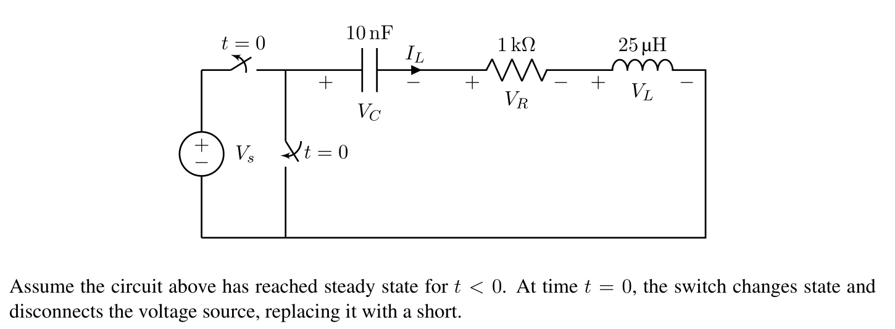
> $\lambda_1=-1.0 \times 10^5, \quad \lambda_2=-4.0 \times 10^7$
> $I_L(t)=-0.001 \mathrm{e}^{-\left(1.0 \times 10^5\right) t}+0.001 \mathrm{e}^{-\left(4.0 \times 10^7\right) t}$
> $V_C(t)=\mathrm{e}^{-\left(1.0 \times 10^5\right) t}-0.0025 \mathrm{e}^{-\left(4.0 \times 10^7\right) t}$
> 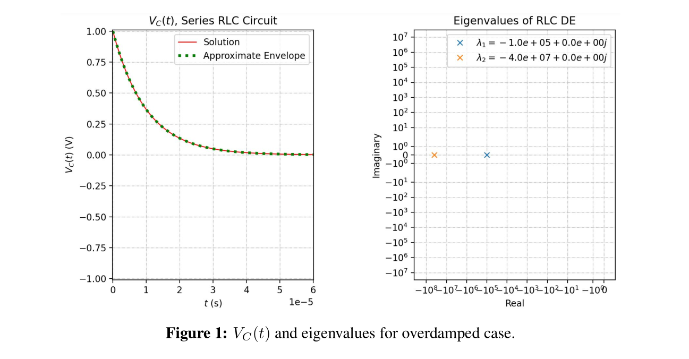
> 表现为图像无震荡。

**Derivations**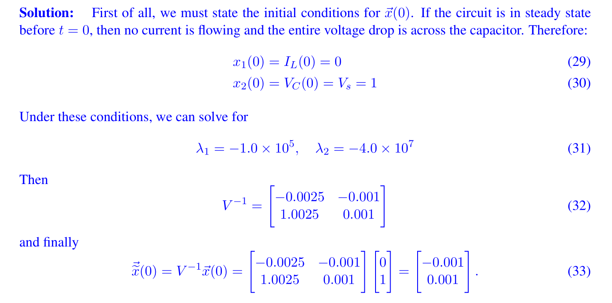

### Undamped(Two Imaginary)
> 
> $\lambda= \pm \mathrm{j} \sqrt{\frac{1}{L C}}= \pm \mathrm{j} \sqrt{\frac{1}{250 \times 10^{-15}}}= \pm \mathrm{j}\left(2 \times 10^6\right) \Longrightarrow \lambda_1=\mathrm{j}\left(2 \times 10^6\right), \quad \lambda_2=-\mathrm{j}\left(2 \times 10^6\right)$
> $I_L(t)=\mathrm{j}(0.01) \mathrm{e}^{+\mathrm{j}\left(2 \times 10^6\right) t}-\mathrm{j}(0.01) \mathrm{e}^{-\mathrm{j}\left(2 \times 10^6\right) t}=-0.02 \sin \left(\left(2 \times 10^6\right) t\right)$
> $V_C(t)=0.5 \mathrm{e}^{+\mathrm{j}\left(2 \times 10^6\right) t}+0.5 \mathrm{e}^{-\mathrm{j}\left(2 \times 10^6\right) t}=\cos \left(\left(2 \times 10^6\right) t\right)$
> 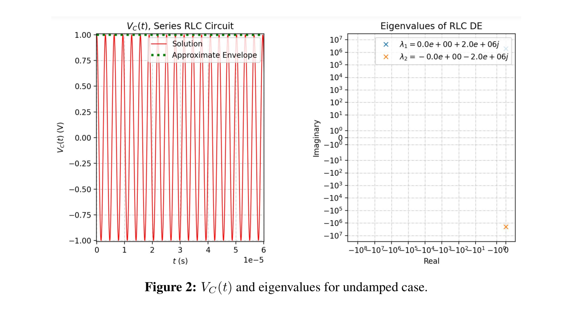
> 图像震荡且振幅不衰减。

**Full Derivations**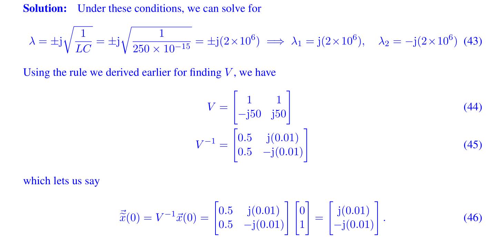

### Underdamped(Two Complex)
> 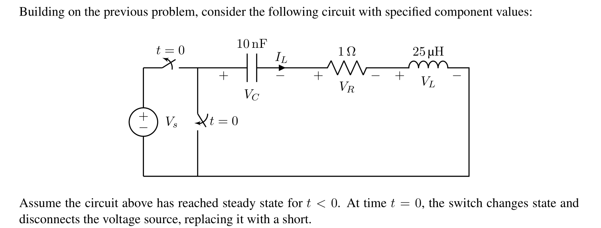
> $\begin{aligned}& \lambda_1=-0.02 \times 10^6+\mathrm{j}\left(2 \times 10^6\right)\\& \lambda_2=-0.02 \times 10^6-\mathrm{j}\left(2 \times 10^6\right)\end{aligned}$
> $\begin{aligned}I_L(t) & =\mathrm{j}(0.01) \mathrm{e}^{\left(-0.02 \times 10^6+\mathrm{j}\left(2 \times 10^6\right)\right) t}-\mathrm{j}(0.01) \mathrm{e}^{\left(-0.02 \times 10^6-\mathrm{j}\left(2 \times 10^6\right)\right) t} \\& =\mathrm{j}(0.01) \mathrm{e}^{-\left(0.02 \times 10^6\right) t} \mathrm{e}^{\mathrm{j}\left(2 \times 10^6\right) t}-\mathrm{j}(0.01) \mathrm{e}^{-\left(0.02 \times 10^6\right) t} \mathrm{e}^{-\mathrm{j}\left(2 \times 10^6\right) t} \\& =\mathrm{e}^{-\left(0.02 \times 10^6\right) t}\left(\mathrm{j}(0.01) \mathrm{e}^{\mathrm{j}\left(2 \times 10^6\right) t}-\mathrm{j}(0.01) \mathrm{e}^{-\mathrm{j}\left(2 \times 10^6\right) t}\right) \\& =-0.02 \mathrm{e}^{-\left(0.02 \times 10^6\right) t} \sin \left(\left(2 \times 10^6\right) t\right)\end{aligned}$ 
> $\begin{aligned}V_C(t) & =(0.5-\mathrm{j}(0.005)) \mathrm{e}^{\left(-0.02 \times 10^6+\mathrm{j}\left(2 \times 10^6\right)\right) t}+(0.5+\mathrm{j}(0.005)) \mathrm{e}^{\left(-0.02 \times 10^6-\mathrm{j}\left(2 \times 10^6\right)\right) t} \\& =(0.5-\mathrm{j}(0.005)) \mathrm{e}^{-\left(0.02 \times 10^6\right) t} \mathrm{e}^{\mathrm{j}\left(2 \times 10^6\right) t}+(0.5+\mathrm{j}(0.005)) \mathrm{e}^{-\left(0.02 \times 10^6\right) t} \mathrm{e}^{-\mathrm{j}\left(2 \times 10^6\right) t} \\& =\mathrm{e}^{-\left(0.02 \times 10^6\right) t}\left((0.5-\mathrm{j}(0.005)) \mathrm{e}^{\mathrm{j}\left(2 \times 10^6\right) t}+(0.5+\mathrm{j}(0.005)) \mathrm{e}^{-\mathrm{j}\left(2 \times 10^6\right) t}\right) \\& =\mathrm{e}^{-\left(0.02 \times 10^6\right) t} \cos \left(\left(2 \times 10^6\right) t\right)+0.01 \cdot \mathrm{e}^{-\left(0.02 \times 10^6\right) t} \sin \left(\left(2 \times 10^6\right) t\right) \end{aligned}$
> 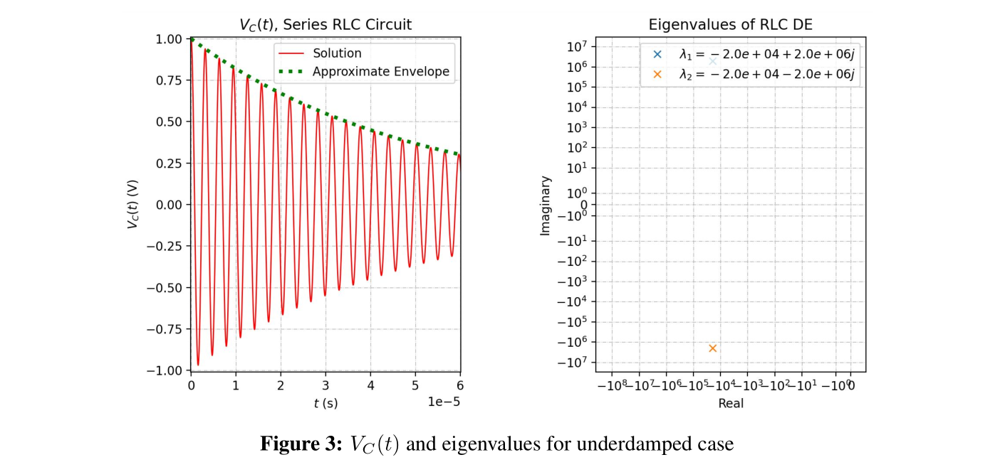
> 表现为图像一边震荡一边衰减。

**Full Derivations**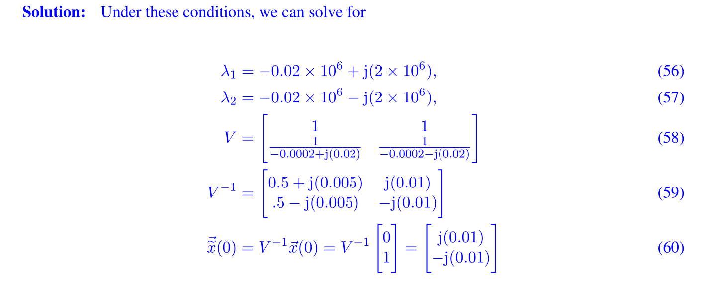

### Critically Damped(相等实根)**⭐⭐⭐⭐⭐**
> 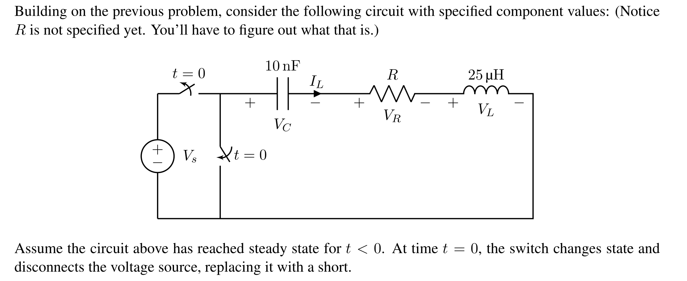

**(a) Figure Out R**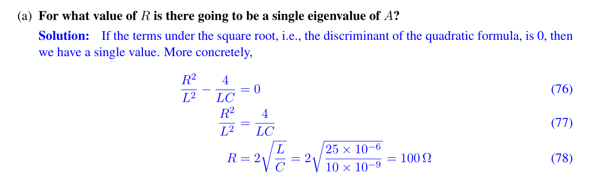
**(b) Deprecated Eigenspace**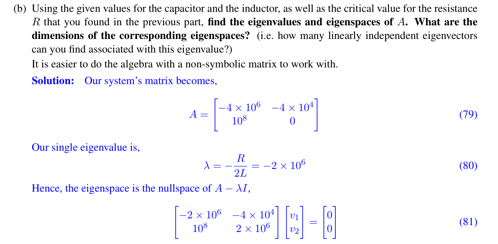
**(c) Complement the Eigenspace⭐⭐⭐**
**(d) Solve x_2(t) tilde**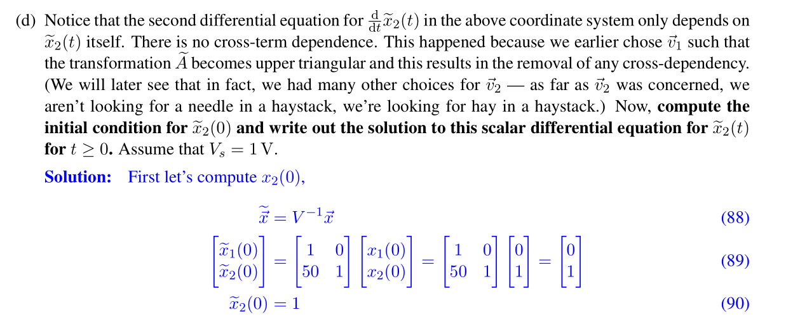
**(e) Establish DE for x_1(t) tilde**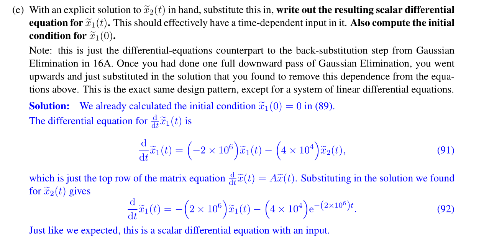
**(f) Solve x_1(t) tilde - Integrating Factor**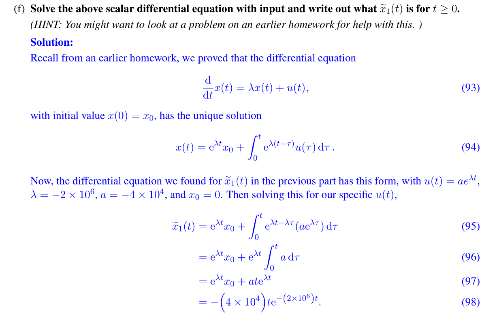
**(g) Solve x_1(t) and x_2(t)**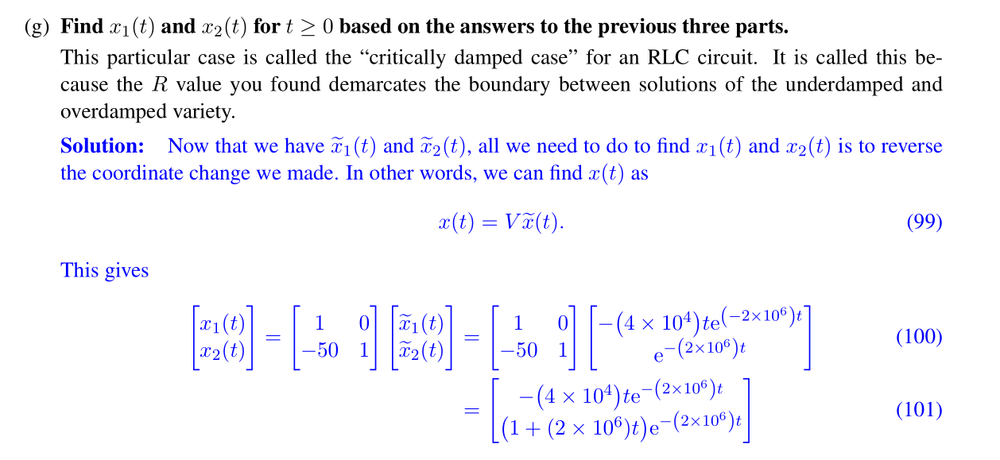
**(h) Graph**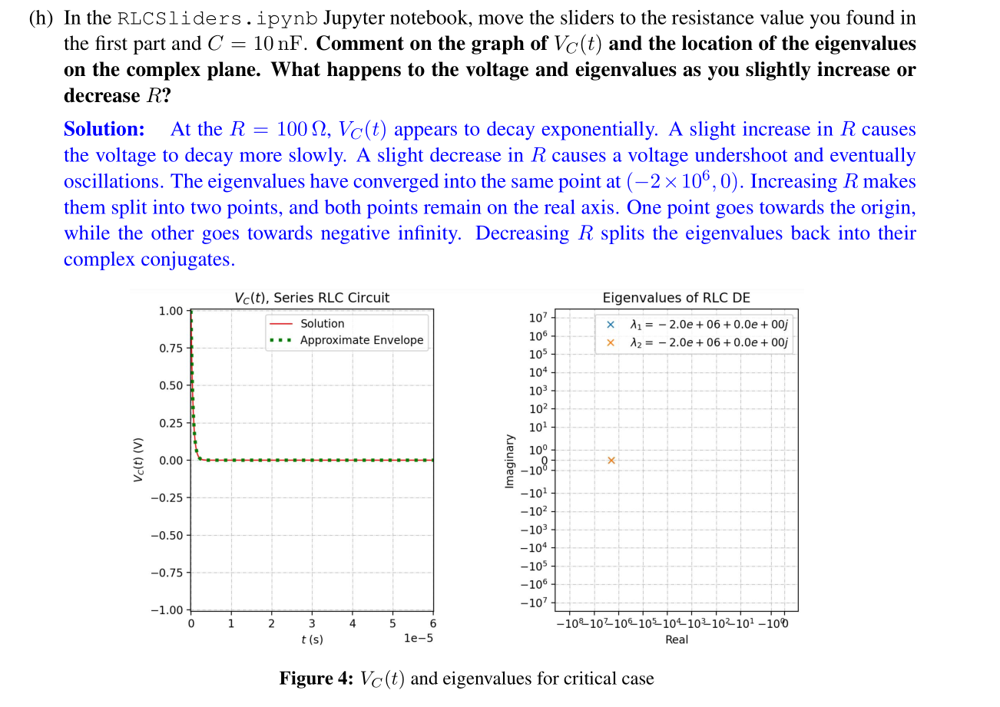
**(i) How to choose complement eiganvectors - Upper Trigularization⭐⭐⭐⭐⭐**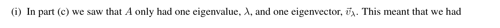
> **HW05 Fa21 P6**
> 对于微分方程组$\frac{d}{dt}\vec{x}(t)=A\vec{x}(t)+\vec{b}u(t)$来说:
> 

# Solving Vector DEs 
## Change of Basis
### Idea
> 

### Example
> **HW03 Fa21 P3 Tracking Terry**
> 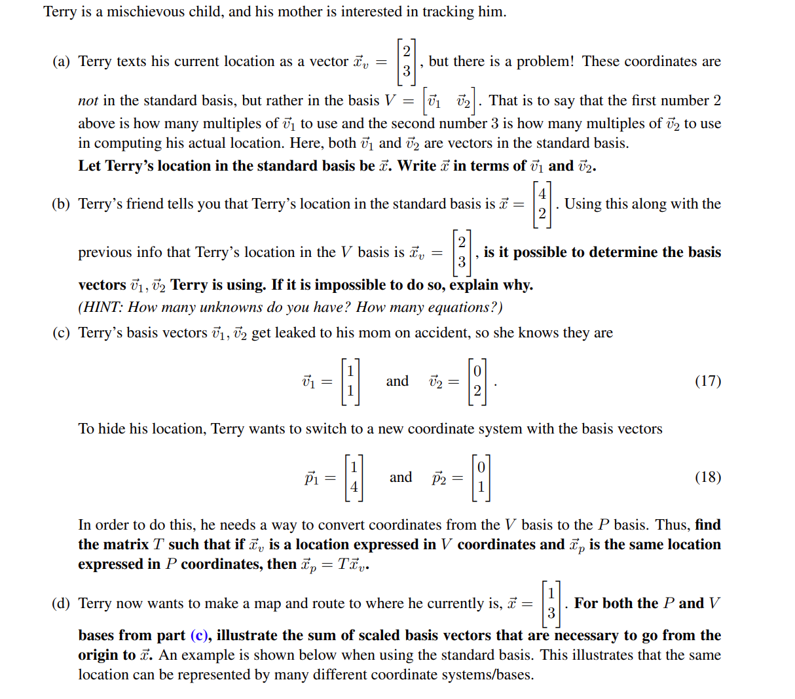

**(a)**
**(b)**本质上我们要求解这样一个线性方程组: $\begin{bmatrix} x_1&x_2\\x_3&x_4\end{bmatrix}\begin{bmatrix}2\\3 \end{bmatrix} =\begin{bmatrix} 4\\2\end{bmatrix}$, 所以我们有四个未知量，但是只有两个方程，所以不存在唯一的解。
**(c)**本质上我们可以将以$V$和$P$作为`Basis`的向量转换到`Standard Basis`中，也就是说我们有: $V\vec{x}_v=P\vec{x}_p$, 所以$\vec{x}_p=P^{-1}V\vec{x}_v$, $P=\begin{bmatrix} 1&0\\4&1\end{bmatrix}$, $P^{-1}=\begin{bmatrix} 1&0\\-4&1\end{bmatrix}$, 所以$P^{-1}V=\begin{bmatrix} 1&0\\-4&1\end{bmatrix} \begin{bmatrix} 1&0\\1&2\end{bmatrix}=\begin{bmatrix}1&0\\-3&2\end{bmatrix}$, 所以$T=\begin{bmatrix}1&0\\-3&2\end{bmatrix}$。
**(d)**我们要求的是使得$P\vec{x}_p=\vec{x}$和$V\vec{x}_v=\vec{x}$的$\vec{x}_p$和$\vec{x}_v$。
所以$\vec{x}_p=P^{-1}\vec{x}=\begin{bmatrix} 1&0\\-4&1\end{bmatrix}\begin{bmatrix}1\\3 \end{bmatrix}=\begin{bmatrix} 1\\-1\end{bmatrix}$, $\vec{x}_v=V^{-1}\vec{x}=\begin{bmatrix} 1&0\\-\frac{1}{2}&\frac{1}{2}\end{bmatrix}\begin{bmatrix}1\\3 \end{bmatrix}=\begin{bmatrix} 1\\1\end{bmatrix}$

## Scalar Vector DE without Input
> 对于一个**齐次微分方程组**$\begin{cases} \frac{dx_1(t)}{dt}=ax_1(t)+bx_2(t)\\\frac{dx_2(t)}{dt}=cx_1(t)+dx_2(t)\end{cases}$, 我们可以将其写成向量形式，$\begin{bmatrix} \frac{dx_1(t)}{dt}\\\frac{dx_2(t)}{dt}\end{bmatrix}=\begin{bmatrix}a&b\\c&d \end{bmatrix}\begin{bmatrix} x_1(t)\\x_2(t)\end{bmatrix}$, 也就是$\frac{d}{dt}\vec{x}(t)=\mathbf{A}\vec{x}(t)$。
> 如果矩阵$\mathbf{A}$是一个对角阵，即$b=c=0$, 则此时我们会得到$\begin{bmatrix} \frac{dx_1(t)}{dt}\\\frac{dx_2(t)}{dt}\end{bmatrix}=\begin{bmatrix} ax_1(t)\\dx_2(t)\end{bmatrix}$, 此时就是两个齐次常数微分方程，直接分别求解即可。
> 如果矩阵$\mathbf{A}$不是对角阵，则我们一般会对矩阵$\mathbf{A}$进行对角化操作(几何重数等于代数重数的时候)，得到$\mathbf{A=V\Lambda V^{-1}}$($\mathbf{\Lambda=V^{-1}AV}$), 此时$\mathbf{V}$是矩阵$\mathbf{A}$的`Eigenbasis`
> 1. **方法一: **我们会令$\vec{y}(t)=\mathbf{V}^{-1}\vec{x}(t)$，这样的话因为我们有$\mathbf{V^{-1}}d\vec{x}(t)=\mathbf{V^{-1}}\mathbf{A}\vec{x}(t)=\mathbf{\mathbf{V^{-1}}V\Lambda V^{-1}}\vec{x}(t)=\mathbf{\Lambda}\vec{y}(t)$, 即$d\vec{y}(t)=\mathbf{\Lambda}\vec{y}(t)$，其中$\mathbf{\Lambda}$为对角矩阵，对角线上的值为矩阵$\mathbf{A}$的`Eigenvalues`。有了对角阵我们就可以很快求出微分方程组的解$\vec{y}(t)$, 然后通过$\vec{x}(t)=\mathbf{V}\vec{y}(t)$就可以得到原微分方程组的解。
> 2. **方法二:** 我们有$\mathbf{V}$的列作为`New Basis`, 有$\vec{x}(t)=\mathbf{V}\vec{y}(t)$, 此时$d\mathbf{V}\vec{y}(t)=\mathbf{AV}\vec{y}(t)$, 然后左右两边同乘以$\mathbf{V^{-1}}$得到$d\mathbf{V^{-1}V}\vec{y}(t)=\mathbf{V^{-1}AV}\vec{y}(t)$，也就是$d\vec{y}(t)=\mathbf{\Lambda} \vec{y}(t)$。
> 
两种方法的本质就是利用$\vec{x}(t)=\mathbf{V}\vec{y}(t)$和$d\vec{y}(t)=\mathbf{\Lambda} \vec{y}(t)$来转化坐标系从而更快求解微分方程组。

## Scalar Vector DE with Input
### Second Order Version
> 对于一个**非齐次常系数微分方程组**$\begin{cases} \frac{dx_1(t)}{dt}=ax_1(t)+bx_2(t)+u_1\\\frac{dx_2(t)}{dt}=cx_1(t)+dx_2(t)+u_2\end{cases}$($u_1$和$u_2$为常数), 我们可以将其写成向量形式，$\begin{bmatrix} \frac{dx_1(t)}{dt}\\\frac{dx_2(t)}{dt}\end{bmatrix}=\begin{bmatrix}a&b\\c&d \end{bmatrix}\begin{bmatrix} x_1(t)\\x_2(t)\end{bmatrix}+\begin{bmatrix} u_1\\u_2\end{bmatrix}$, 也就是$\frac{d\vec{x}(t)}{dt}=\mathbf{A}\vec{x}(t)+\vec{u}$。
> - 如果矩阵$\mathbf{A}$是一个对角阵，即$b=c=0$, 则此时我们会得到$\begin{bmatrix} \frac{dx_1(t)}{dt}\\\frac{dx_2(t)}{dt}\end{bmatrix}=\begin{bmatrix} ax_1(t)+u_1\\dx_2(t)+u_2\end{bmatrix}$, 此时就是两个非齐次常系数微分方程，直接分别求解即可。
> - 如果矩阵$\mathbf{A}$不是对角阵，则和齐次微分方程组的情况一样，我们将$\vec{y}(t)=\mathbf{V}^{-1}\vec{x}(t)$和$\mathbf{A=V\Lambda V^{-1}}$代入微分方程，可以得到:$\frac{d\mathbf{V}^{-1}\vec{x}(t)}{dt}=\mathbf{V^{-1}A(V}\vec{y}(t))+\mathbf{V}^{-1}\vec{u}$, 且$\frac{d\vec{y}(t)}{dt}=\mathbf{\Lambda}\vec{y}(t)+\mathbf{V^{-1}}\vec{u}$。
> 
然后解得$\vec{y}(t)$并利用$\vec{x}(t)=\mathbf{V}\vec{y}(t)$得到原来的微分方程组的解。

### Higher Order Version
> **HW04 Sp23 P3**
> 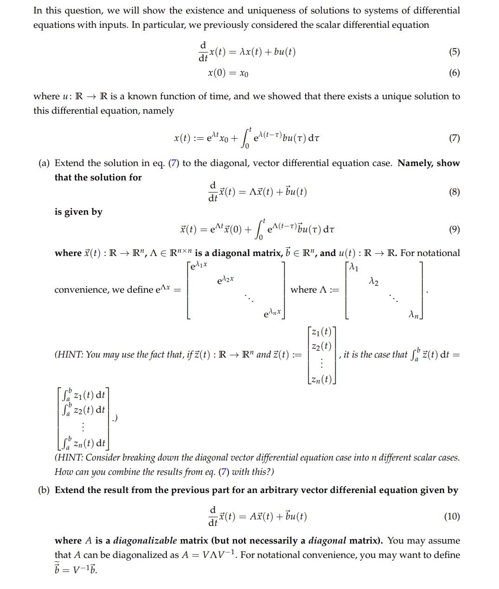

**(a) EigenBasis Solution**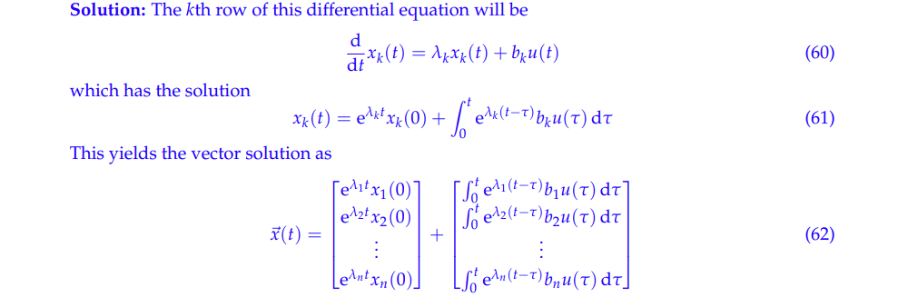
**(b) Extension to General Matrix**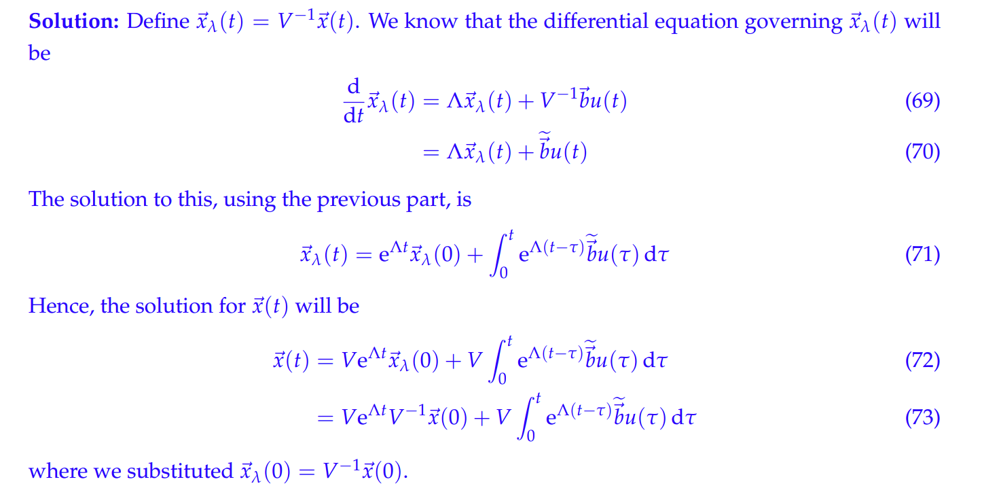

## Summary
> 对于一个微分方程组$\frac{d\vec{x}(t)}{dt}=\mathbf{A}\vec{x}(t)+\mathbf{B}\vec{u}(t)$来说, 我们可以转换一下坐标系，通过对矩阵$\mathbf{A}$求特征值和特征向量。然后将特征向量按列组成一个新的基矩阵$\mathbf{V}$满足$\vec{x}(t)=\mathbf{V}\vec{y}(t)$。
> 然后等式两侧同乘以$\mathbf{V}^{-1}$, 得到$\frac{d\vec{y}(t)}{dt}=\mathbf{V^{-1}AV}\vec{y}(t)+\mathbf{V^{-1}B}\vec{u}(t)=\mathbf{\Lambda}\vec{y}(t)+\mathbf{V^{-1}B}\vec{u}(t)$。
> 其中$\mathbf{\Lambda}$是对角矩阵，$\vec{y}(t)$的初值条件$\vec{y}(0)$可以通过$\mathbf{V^{-1}}\vec{x}(0)$得到。

## RCRC Circuit Example
> **Fall 2021 Disc03B Problem 1 非齐次微分方程组**
> 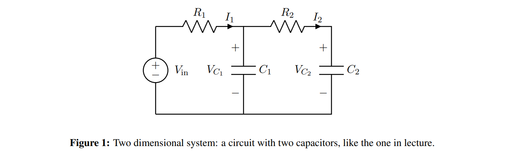

### Write the Differential Equation - 齐次
> 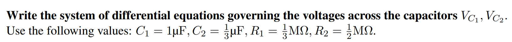
> 🔔: 对于一个电容的微分方程来说，如果我们要建立微分方程$\frac{dV_{C_i}(t)}{dt}=\frac{I_i(t)}{C}$，最快的方法就是将$I_i(t)$表示成$V_{C_1}(t)$和$V_{C_2}(t)$以及$R_1$和$R_2$的组合, 其中$i\in \{1,2\}$。

**Graph**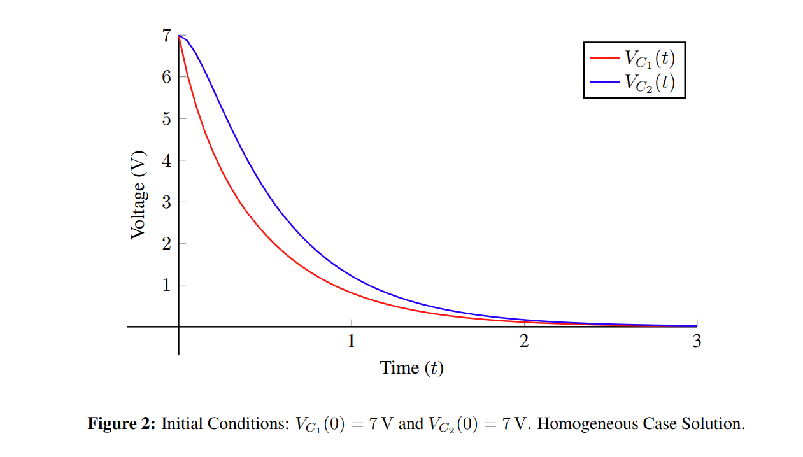

### Solving the Differential Equation - 非齐次
> 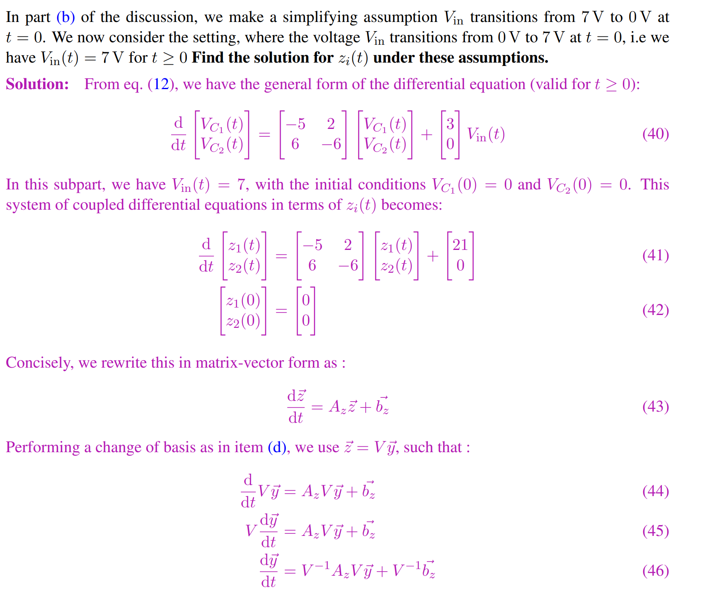

**Graph**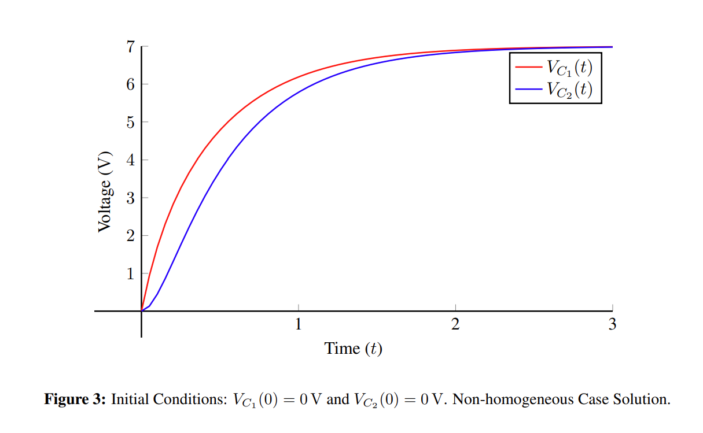

# Uniqueness For Diagonalized Solutions
> **Hw05 Fa21 P9(Modified)**
> 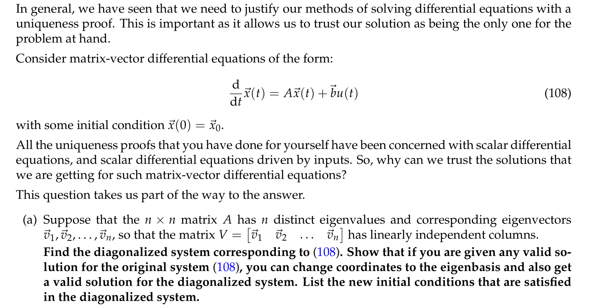

**(a) Change of Basis**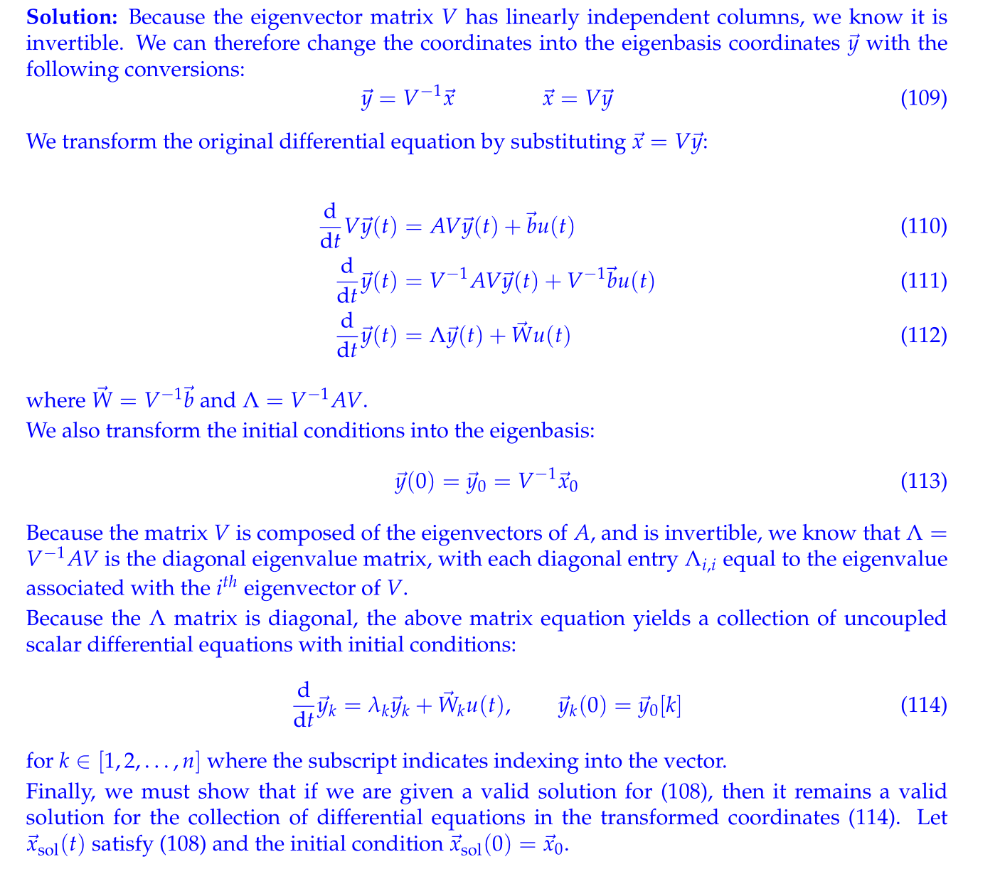
**(b) Proof for Uniqueness**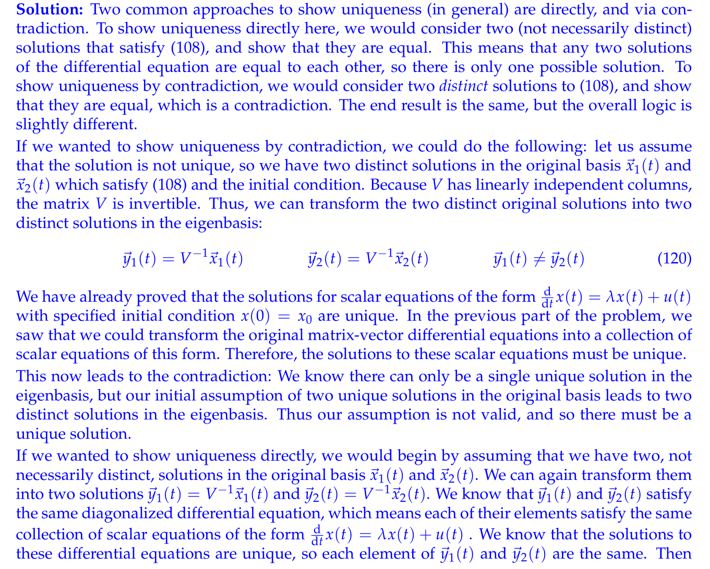

# Math Tips
## Real-Valued Matrix⭐⭐⭐⭐⭐
> 矩阵$A$  的每一项都是实数且初值条件$\vec{x}_0$ 也都是实数, 则微分方程组 $\frac{\mathrm{d}}{\mathrm{d} t} \vec{x}=A \vec{x}$ ，$\vec{x}(0)=\vec{x}_0$的解也是实数, 无论 $A$的特征值是实数，纯虚数还是复数。
> 如果一个矩阵 $A \in \mathbb{R}^{n \times n}$ 有复数根, 那么这些复数根总是会以共轭对的形式出现。另外这些复数特征值对应的特征向量也是以共轭对的形式出现的。
> 回顾一下我们在`Damping Analysis`中的推导，假设我们的特征值是$\lambda_1,\lambda_2$且$\overline{\lambda_1}=\lambda_2$（共轭对），则特征向量矩阵按列为$V=\begin{bmatrix} 1&1\\\frac{1}{\lambda_1 C}&\frac{1}{\lambda_2 C}\end{bmatrix}$, 注意到$V$的第一列和第二列互为共轭向量。
> 令$\vec{x}(t)=V\widetilde{\vec{x}(t)}$, 则$\widetilde{\vec{x}(t)}=V^{-1}\vec{x}(t)$, 此时我们有$\Lambda = V^{-1}AV=\begin{bmatrix} \lambda_1&0\\0&\lambda_2\end{bmatrix}$,$\frac{d}{dt}\widetilde{\vec{x}(t)}=\Lambda \widetilde{\vec{x}(t)}$，即$\frac{d}{dt}\widetilde{\vec{x}(t)}=\begin{bmatrix} \lambda_1&0\\0&\lambda_2\end{bmatrix} \widetilde{\vec{x}(t)}$, 所以$\widetilde{\vec{x}(t)}=\begin{bmatrix}\widetilde{x_1(t)}\\\widetilde{x_2(t)} \end{bmatrix}=\begin{bmatrix}\widetilde{x_1(0)}e^{\lambda_1 t}\\\widetilde{x_2(0)}e^{\lambda_2 t} \end{bmatrix}$。
> 然后对于初值条件来说，我们有$\widetilde{\vec{x}(0)}=V^{-1}\vec{x}(0)=\frac{\lambda_1 \lambda_2 C}{\lambda_1-\lambda_2}\left[\begin{array}{cc}\frac{1}{\lambda_2 C} & -1 \\-\frac{1}{\lambda_1 C} & 1\end{array}\right]\vec{x}(0)=
\left[\begin{array}{cc}\frac{\lambda_1}{\lambda_1-\lambda_2} & -\frac{\lambda_1 \lambda_2 C}{\lambda_1-\lambda_2} \\-\frac{\lambda_2}{\lambda_1-\lambda_2} & \frac{\lambda_1 \lambda_2 C}{\lambda_1-\lambda_2}\end{array}\right]\vec{x}(0)$，如果初值条件为实数向量，则$\widetilde{x_1(0)}$和$\widetilde{x_2(0)}$互为共轭。所以$\widetilde{x_1(0)}e^{\lambda_1 t}$和$\widetilde{x_2(0)}e^{\lambda_2 t}$互为共轭，即$\widetilde{x_1(t)}$和$\widetilde{x_2(t)}$互为共轭。
> 因为$\vec{x}(t)=V\widetilde{\vec{x}(t)}=\begin{bmatrix} 1&1\\\frac{1}{\lambda_1 C}&\frac{1}{\lambda_2 C}\end{bmatrix}\begin{bmatrix}\widetilde{x_1(t)}\\\widetilde{x_2(t)} \end{bmatrix}$, 所以$x_1(t)$和$x_2(t)$均为共轭复数之和，于是$\vec{x}(t)$为实数向量。
> After all, the quantities that we observe in the world are always purely real, so we would expect that the solutions to our models would also be real-valued.

## Matrix Exponentials
> **HW03 Fa21 P4**
> 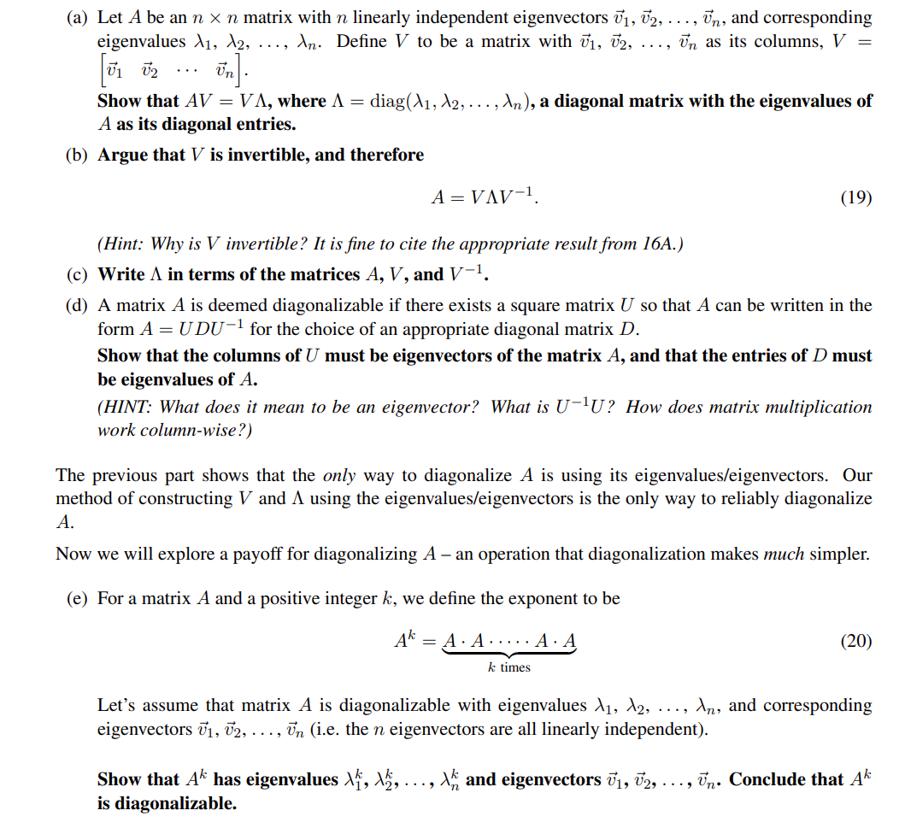

**(a)**根据特征向量的定义，我们有$A\vec{v_1}=\lambda \vec{v_1}\cdots,A\vec{v_n}=\lambda \vec{v_n}$, 将$\vec{v_i}$按列组成矩阵$V$我们有$AV= V\Lambda$
**(b)**因为$\vec{v_1},\cdots, \vec{v_n}$是线性无关的，所以$a_1\vec{v_1}+\cdots+a_n\vec{v_n}=\vec{0}$只有$a_1=a_2=\cdots=a_n=0$的解，也就是说如果$V=\begin{bmatrix} \vec{v_1}&\cdots&\vec{v_n}\end{bmatrix}$，则$V\vec{a}=\vec{0}$只有零解，也就是$V$的零空间只有$\{\vec{0}\}$, 所以$V$可逆。
因为$AV=V\Lambda$, 所以$A=V\Lambda V^{-1}$。
**(c)**$\Lambda=V^{-1}AV$。
**(d)**因为$A=UDU^{-1}$, 所以$U$可逆(因为能够表示成$U^{-1}$)，所以$AU=UD$, 令$U=\begin{bmatrix} \vec{u_1}&\vec{u_2}\cdots&\vec{u_n}\end{bmatrix}$ , $D=\begin{bmatrix} \lambda_1&\cdots&0\\\vdots&\ddots&\vdots\\0&\cdots&\lambda_n\end{bmatrix}$, 所以我们有$A\vec{u_i}=\lambda_i\vec{u_i}$，所以$\vec{u_i}$就是`Eigenvectors`。$D$的对角线上的元素就是`Eigenvalues`。
**(e)**因为$A\vec{v_i}=\lambda_i\vec{v_i}$, 所以$A^k\vec{v_i}=\lambda_i^k\vec{v_i}$, 于是$A^k$的特征值是$\lambda_i^k$, 特征向量是$\vec{v_i}$。
所以$A^kV=VD^k$, 即$A^k=VD^kV^{-1}$, 所以$A^k$是`Diagonalizable`的。

## Diagonalizability&Invertibility
> 1. **Every square matrix that can be diagonalizable is invertible. False.**
> 
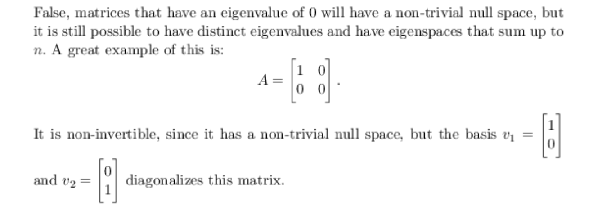
> 2. **Every square matricx that is invertible, can be diagonalized. False.**
> 
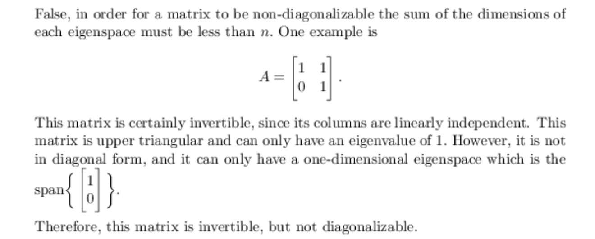

## 

## 

# Resources
> Note 3 Fa21/Note 4 from Sp23
> Disc2B/3A/3B from Fa21
> Hw03 Fa21

