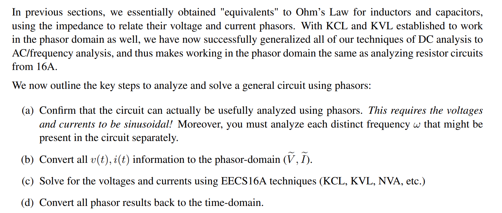
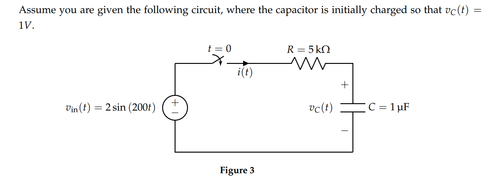

# Circuit Analysis in Phasor Domain
## Principles
> [Open: 6e2960198973c8c5cdcd5108bf1b8105_MD5.png](AC_Circuit_Analysis.assets/6e2960198973c8c5cdcd5108bf1b8105_MD5.png)

## Comparison
> [Open: e248bdd5a737767a8d2f7f4952e690c4_MD5.png](AC_Circuit_Analysis.assets/e248bdd5a737767a8d2f7f4952e690c4_MD5.png)

> 由上文我们知道，$v_C(t)=2 \mathrm{e}^{-200 t}+(\sin (200 t)-\cos (200 t)) \mathrm{V}=2e^{-200t}+\sqrt{2}cos(200t-\frac{3\pi }{4})$
> 于是当$t\to \infty$时，$v_C(t)=\sqrt{2}cos(200t-\frac{3\pi }{4})$, 是电路的稳定状态的解。
> 如果我们使用`Phasor Analysis`呢?
> $v_{in}(t)=2*\frac{e^{j200t}-e^{-j200t}}{2j}=-je^{200t}+je^{-j200t}$, $w=200 \frac{rad}{s}$
> 于是$\widetilde{V_{in}}=-j$, $H(jw)=\frac{\frac{1}{jwC}}{\frac{1}{jwC}+R}=\frac{1}{1+j}$, 于是$\widetilde{V_{out}}=H(jw)\widetilde{V_{in}}=\frac{1}{j-1}=\frac{\sqrt{2}}{2}e^{-j\frac{3}{4}\pi}$, 即$B=\frac{\sqrt{2}}{2}$,$\phi=-\frac{3}{4}\pi$。
> 利用`Inverse Phasor Transform`可得$v_c(t)=2\times\frac{\sqrt{2}}{2}cos(wt+\phi)=\sqrt{2}cos(200t-\frac{3\pi}{4})$。
> 所以使用`Phasor Analysis`得到的结果就是`Steady State Solution of the circuit`。

## Working Examples
### Example 1: Cosine Wave Input
> **This example is from Note 6 Fa21**
> [Open: f6656c10cc182b52eb7b0adfb77e3396_MD5.png](AC_Circuit_Analysis.assets/f6656c10cc182b52eb7b0adfb77e3396_MD5.png)

**Important Footnotes**[Open: bff9c34e25215d5007bb9b6c9e0ba3ba_MD5.png](AC_Circuit_Analysis.assets/bff9c34e25215d5007bb9b6c9e0ba3ba_MD5.png)

### Example 2: Sine Wave Input
> **This example is from disc4B Fa21**
> [Open: 1cf814b56bcaba49d54b399dda09a4c4_MD5.png](AC_Circuit_Analysis.assets/1cf814b56bcaba49d54b399dda09a4c4_MD5.png)

**Step 1: Write Source as Exponentials**[Open: e360bcd8089626dc0318b84b165d5831_MD5.png](AC_Circuit_Analysis.assets/e360bcd8089626dc0318b84b165d5831_MD5.png)

**Step 2: Transform Circuit into Phasor Domain**[Open: 133eb5158302e65b10c67f2d87ed1449_MD5.png](AC_Circuit_Analysis.assets/133eb5158302e65b10c67f2d87ed1449_MD5.png)

**Step 3: Compute Quantities in Phasor Domain**[Open: 8d5c5a68720b927b23b5d460494d9c5a_MD5.png](AC_Circuit_Analysis.assets/8d5c5a68720b927b23b5d460494d9c5a_MD5.png)

**Step 4: Fit in the Values and Solve the Equations**[Open: 5a4da7c1c1880d192cd48f3e19cae6c0_MD5.png](AC_Circuit_Analysis.assets/5a4da7c1c1880d192cd48f3e19cae6c0_MD5.png)

**Step 5: Transform Back to the Time Domain**[Open: 46736197ed401b533aae2db59cbbe86c_MD5.png](AC_Circuit_Analysis.assets/46736197ed401b533aae2db59cbbe86c_MD5.png)

### Example 3: General Input  
> [Open: 17dbe77f95f4edaadd2fb4a0e28e1609_MD5.png](AC_Circuit_Analysis.assets/17dbe77f95f4edaadd2fb4a0e28e1609_MD5.png)

**Solution**[Open: 533894c6710a8dd5a702bf3e52103119_MD5.png](AC_Circuit_Analysis.assets/533894c6710a8dd5a702bf3e52103119_MD5.png)

> 对于任意常数输入，我们也可以将其看作是

# *AC Equivalence
> 

# *AC Power
> 

