# Basic Filters
## Frequency Independent Filter
> 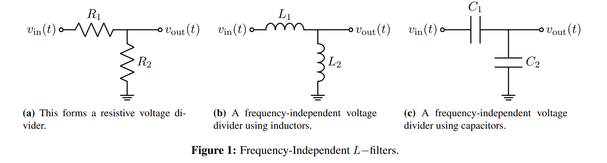
> 1. $R-R$:$H(jw)=\frac{R_2}{R_1+R_2}$, 和$w$无关。 
> 2. $L-L$: $H(jw)=\frac{Z_{L_2}}{Z_{L_1}+Z_{L_2}}=\frac{jwL_2}{jwL_1+jwL_2}=\frac{L_2}{L_1+L_2}$,和$w$无关。 
> 3. $C-C$: $H(jw)=\frac{Z_{C_2}}{Z_{C_1}+Z_{C_2}}=\frac{\frac{1}{jwC_1}}{\frac{1}{jwC_1}+\frac{1}{jwC_2}}=\frac{C_1}{C_1+C_2}$,和$w$无关。$w=0$时，我们的输入$V_{in}(t)$就变成一个恒定的值了，假设为$V_{in}$。
> 
使用`Charge Sharing Argument`可以证明$V_{out}=\frac{C_1}{C_1+C_2}$:
> 因为一开始两个电容都没有充上电，所以`Floating Node`(导线交叉处，$C_1$的右板和$C_2$的上板)的电荷量为零。在接入恒定电压源$V_{in}$之后，交叉处的电荷量总和应该还是零，假设此时$C_1$所携带的电荷量为$Q_1$, $C_2$携带的电荷量为$Q_2$, 所以$Q_1+(-Q_2)=0$, 所以$Q_1=Q_2=Q$, 因为$V_{C_1}=\frac{Q_1}{C_1}, V_{C_2}=\frac{Q_2}{C_2}$, 于是$V_{C_1}+V_{C_2}=V_{in}$, 即$\frac{Q}{C_1}+\frac{Q}{C_2}=V_{in}$, 于是$Q=\frac{C_1C_2V_{in}}{C_1+C_2}$, 所以$V_{C_2}=V_{out}=\frac{C_1}{C_1+C_2}V_{in}$, 所以$H(jw)=\frac{C_1}{C_1+C_2}$仍然成立。


## Low Pass Filter
### Definition
> 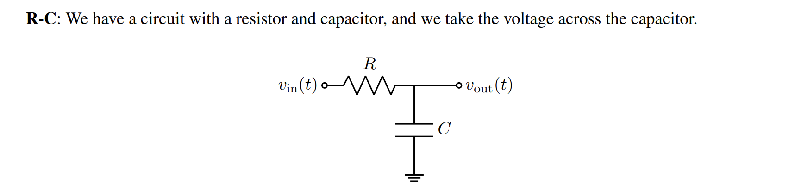
> $H_{\mathrm{LP}}(\mathrm{j} \omega)=\frac{\frac{1}{\mathrm{j} \omega C}}{R+\frac{1}{\mathrm{j} \omega C}}=\frac{1}{1+\mathrm{j} \omega R C}$
> 我们选取$w_c=\frac{1}{RC}$作为基准频率，为什么呢? 因为我们知道$RC$的单位是$s$, 所以$\frac{1}{RC}$的单位是$s^{-1}$(也就是$Hz$), 所以可以作为频率。所以$H_{\mathrm{LP}}(jw)=\frac{1}{1+j\frac{w}{w_c}}$。
> 除了使用`R-C Circuit(测量C的电压)`, 我们还可以使用`L-R Circuit(测量R的电压)`:
> 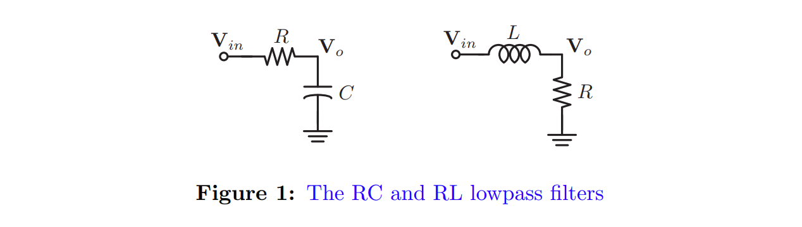
> $H(jw)=\frac{R}{R+jwL}=\frac{1}{1+jw\frac{L}{R}}=\frac{1}{1+j\frac{w}{w_c}}$, 其中$w_c=\frac{R}{L}$。


### Asymptotic Analysis
> 下面我们探究$|H(jw)|$随着$w$变化的变化情况:
> 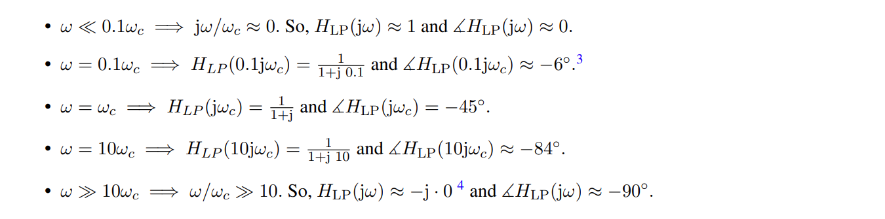
> $\begin{array}{cccc}\hline \omega & H(\mathrm{j} \omega) & |H(\mathrm{j} \omega)| & \measuredangle H(\mathrm{j} \omega) \\ \hline w\ll w_c & \approx 1 & \approx 1 & \approx 0^{\circ}\\ \hline 0.1 \omega_c & \frac{1}{1+\mathrm{j} 0.1} & 0.995 & -6^{\circ} \\ \hline \omega_c & \frac{1}{1+\mathrm{j}} & 0.71 & -45^{\circ} \\ \hline 10 \omega_c & \frac{1}{1+\mathrm{j} 10} & 0.1 & -84^{\circ} \\ \hline w\gg w_c & -j\frac{w_c}{w} & \frac{w_c}{w} & -90^{\circ} \\ \hline \end{array}$  
> 
> 1. 当$w\to 0$时(`Low Frequency`$w\ll w_c$), $\frac{1}{1+\mathrm{j} \frac{\omega}{\omega_c}}\approx \frac{1}{1+0}=1+0j$
> 
$\lim_{w\to 0}H_{LP}(jw)=\lim_{w\to 0}\frac{1}{1+\mathrm{j} \frac{\omega}{\omega_c} }=\frac{1}{1+0}=1=1+0j$, 使得频率为$\omega$的信号能够基本都能通过。
> $\lim_{w\to 0}|H_{LP}(jw)|=\lim_{w\to 0}\frac{1}{\sqrt{1+w^2R^2C^2}}=1$
> $\angle H_{\text{HP}}(jw)\approx arctan(\frac{0}{1})\approx arctan(\infty)\approx 0^{\degree}$
> 2. 当$w\to \infty$时(`High Frequency`$w\gg w_c$), $\frac{1}{1+j\frac{w}{w_c}}\approx \frac{1}{j\frac{w}{w_c}}=-j\frac{w_c}{w}\to 0$, 注意$\frac{w_c}{w}>0$且很小。
> 
$\lim_{w\to \infty}H_{LP}(jw)=\lim_{w\to \infty}\frac{1}{1+\mathrm{j} \frac{\omega}{\omega_c}}=0$ 
> $\lim_{w\to \infty}|H_{\mathrm{LP}}(jw)|=\frac{w_c}{w}\to 0$, 使得频率为$w$的信号无法通过。
> $\angle H_{\text{HP}}(jw)\approx arctan(-\frac{\frac{w_c}{w}}{0})\approx arctan(-\infty)\approx -90^{\degree}$


### Transfer Function Plot
> 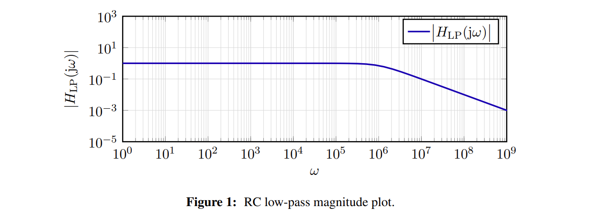
> 在绘制`Transfer Fucntion Plot`的时候，我们一般会选取`Log-log Scale`, 则$log|H_{\mathrm{LP}}(jw)|=log(\frac{w_c}{w})=log(w_c)-log(w)$, 可以看见$log(w)$的斜率是$-1$。换句话说，当$w\gg w_c$时，当$w\to 10w$时，$|H_{\mathrm{LP}}(jw)|\to \frac{1}{10}|H_{\mathrm{LP}}(jw)|$, 对应图像的下降段。
> 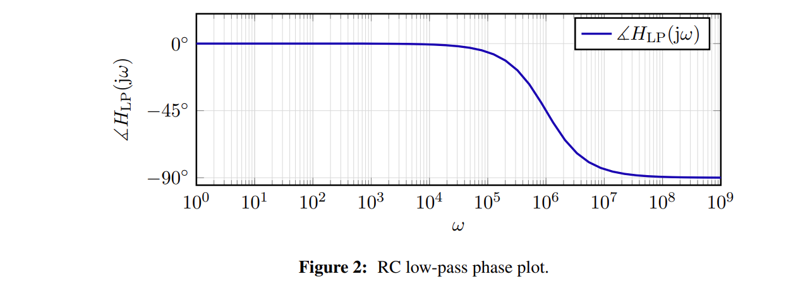
> 所以，这样的电路称为`Low-Pass Filter`, 使得低频信号能够通过，高频信号被拦截。


### Bode Plots
#### Magnitude
> `Bode Plot`旨在对`Transfer Function Plot`进行`Linear Approximation`, 图像的突变点就是我们的`Cutoff Frequency`$w_c$。
> 


#### Phase
> 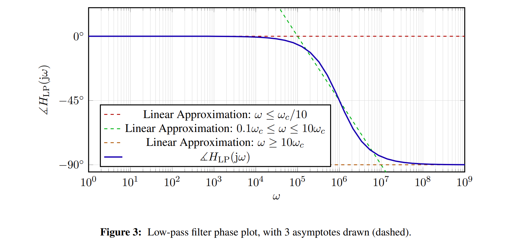


## High Pass Filter
### Definition
> 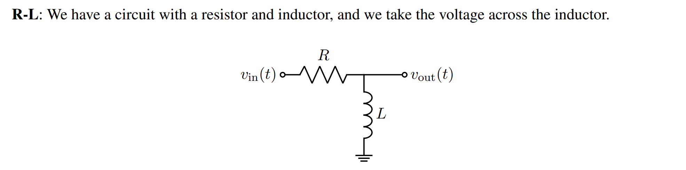
> $H_{\mathrm{HP}}(\mathrm{j} \omega)=\frac{\mathrm{j} \omega L}{R+\mathrm{j} \omega L}=\frac{\mathrm{j} \omega \frac{L}{R}}{1+\mathrm{j} \omega \frac{L}{R}}=\frac{\frac{\mathrm{j} \omega}{\omega_c}}{1+\frac{\mathrm{j} \omega}{\omega_c}}$
> 令$w_c=\frac{R}{L}$, 因为$\frac{L}{R}$的单位是时间，所以$\frac{R}{L}$的单位是频率$Hz$。
> 本质上这个`Filter`就是上面的`Low Pass Filter`的对立面，因为$1-\frac{1}{1+j\frac{w}{w_c}}=\frac{\frac{\mathrm{j} \omega}{\omega_c}}{1+\frac{\mathrm{j} \omega}{\omega_c}}$.
> 除了使用`R-L Circuit(测量L两端的电压)`, 我们还可以使用`C-R Circuit(测量R两端的电压)`
> 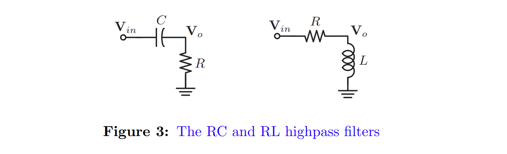
> $H_{\text{HP}}(jw)=\frac{R}{R+\frac{1}{jwC}}=\frac{jwCR}{1+jwCR}=\frac{j\frac{w}{w_c}}{1+j\frac{w}{w_c}}$，其中$w_c=\frac{1}{CR}$。


### Asymptotic Analysis
> 1. 当$w\to 0$($w\ll w_c$)时，$\frac{\mathrm{j} \frac{\omega}{\omega_c} }{1+\mathrm{j}\frac{\omega}{\omega_c}}\approx \frac{\mathrm{j}\frac{\omega}{\omega_c}}{1}=0+\mathrm{j}\frac{\omega}{\omega_c}$,$\lim_{w\to 0}H_{\mathrm{HP}}(\mathrm{j} \omega)=\lim_{w\to 0}\frac{\mathrm{j} \frac{\omega}{\omega_c} }{1+\mathrm{j} \frac{\omega}{\omega_c}}=\frac{\lim_{w\to 0}j\frac{\omega}{\omega_c}}{\lim_{w\to 0}1+j\frac{\omega}{\omega_c}}=\frac{0}{1}=0$	
> 
$\lim_{w\to 0}|H_{\mathrm{HP}}(jw)|=\lim_{w\to 0}\frac{\frac{w}{w_c}}{\sqrt{1+\frac{w^2}{w_c^2}}}=\lim_{w\to 0}\frac{1}{\sqrt{\frac{w_c^2}{w^2}+1}}\to 0$
> $\angle H_{\text{HP}}(jw)\approx arctan(\frac{\frac{w}{w_c}}{0})\approx arctan(\infty)\approx 90^{\degree}$
> 2. 当$w\to \infty$($w\gg w_c$)时,  $\frac{\mathrm{j} \frac{\omega}{\omega_c} }{1+\mathrm{j}\frac{\omega}{\omega_c}}\approx \frac{\mathrm{j}\frac{\omega}{\omega_c}}{\mathrm{j}\frac{\omega}{\omega_c}}=1+0j$
> 
$\lim_{w\to \infty}H_{\mathrm{HP}}(\mathrm{j} \omega)=\lim_{w\to \infty}\frac{\mathrm{j} \frac{\omega}{\omega_c} }{1+\mathrm{j} \frac{\omega}{\omega_c}}=\lim_{w\to \infty}\frac{1}{\frac{w_c}{jw}+1}=1$
> $\lim_{w\to \infty}|H_{\mathrm{HP}}(jw)|=\frac{1}{\sqrt{\frac{w_c^2}{w^2}+1}}\to 1$, 
> $\angle H_{\text{HP}}(jw)\approx arctan(\frac{0}{1})\approx arctan(0)\approx 0^{\degree}$
> 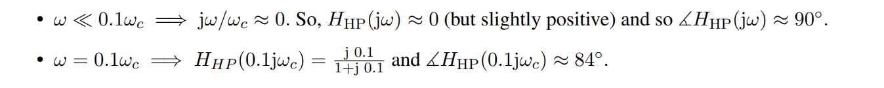


### Transfer Function Plot
> 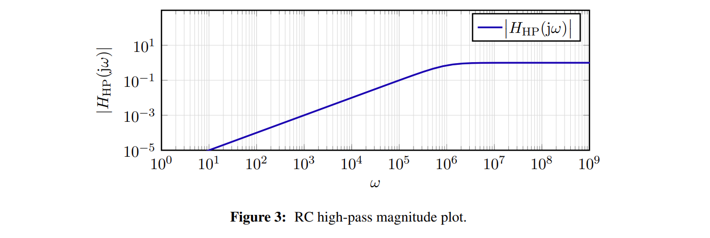
> 所以这样的电路被称为`High-Pass Filter`, 使得高频信号得以通过，低频信号被拦截。


### Bode Plots
> 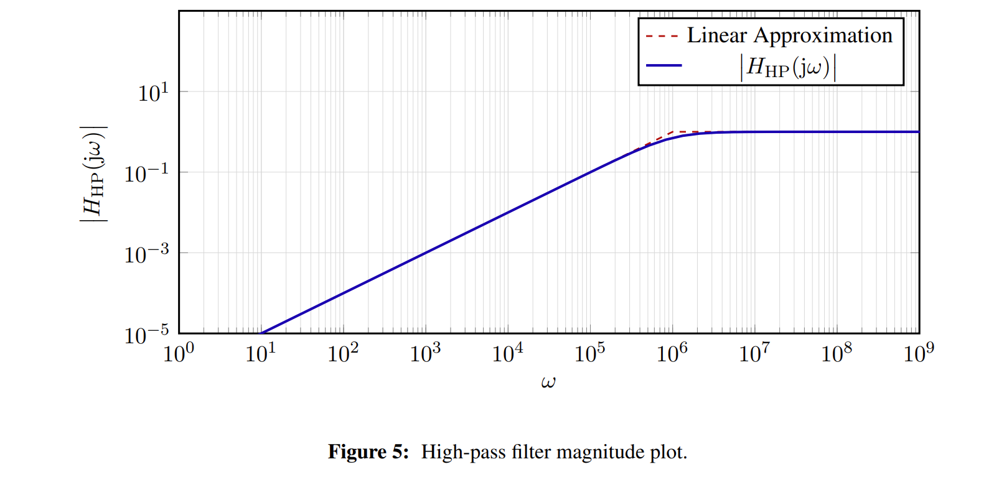


## More Filters
### LC Tank
> 
> $H(\mathrm{j} \omega)=\frac{\frac{1}{\mathrm{j} \omega C}}{\frac{1}{\mathrm{j} \omega C}+\mathrm{j} \omega L}=\frac{1}{1-\omega^2 L C}$
> 1. **At low frequency, frequencies are preserved:**$\lim_{w\to 0}\frac{1}{1-\omega^2 L C}=1$
> 2. **At high frequency, frequencies are filtered out: **$\lim_{w\to \infty}\frac{1}{1-\omega^2 L C}=0$
> 
所以这是一个`Low-Pass Filter`。


## Cutoff Frequency
> 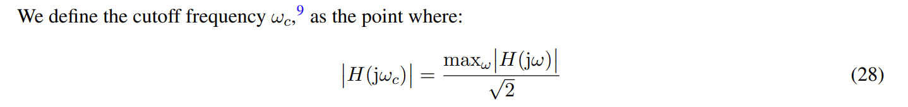
> 1. 对于`RC-Low Pass Filter`来说，我们有$H(jw)=\frac{1}{1+jwCR}$, 我们计算$|H(jw)|=\frac{1}{\sqrt{1+w^2(CR)^2}}$, 然后求解$max_w|H(jw)|=1(w=0)$, 所以$\frac{1}{\sqrt{1+(w_cCR)^2}}=\frac{1}{\sqrt{2}}$, 所以$w_cCR=1$, 即$w_c=\frac{1}{CR}$。
> 2. 对于`RL-Low Pass Filter`来说，我们有$H(jw)=\frac{\mathrm{j} \omega \frac{L}{R}}{1+\mathrm{j} \omega \frac{L}{R}}$, 我们计算$|H(jw)|=\frac{w\frac{L}{R}}{\sqrt{1+\frac{w^2L^2}{R^2}}}=\frac{1}{\sqrt{\frac{R^2}{w^2L^2}+1}}$, 然后求解$max_w|H(jw)|=1(w\to \infty)$, 所以$\frac{1}{\sqrt{\frac{R^2}{w_c^2L^2}+1}}=\frac{1}{\sqrt{2}}$, 所以$\frac{R^2}{w_c^2L^2}=1$, 即$w_c=\frac{R}{L}$。
> 3. `Cutoff Frequency`所代表的频率实际上是一种分界线，远低于这个频率的输入信号和远高于这个频率的输入信号在通过$H(jw)$这个`Filter`之后的`Amplitude`的变化差异十分明显。
>    1. 对于`Low-Pass Filter`来说，如果$w\ll w_c$, 则信号几乎完全通过，如果$w\gg w_c$, 则信号几乎被拦截。
>    2. 对于`High-Pass Filter`来说，如果$w\ll w_c$, 则信号几乎被拦截，如果$w\gg w_c$, 则信号几乎完全通过。


# Higher Order Filters
## Band-Pass Filter
### Definition
> 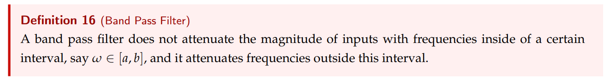


### OpAmp Model
> It is quite common to need to design a filter which selects only a narrow range of frequencies. One example is in **WiFi radios**, it is desirable to select only the 2.4GHz frequency containing your data, and reject information from other nearby cellular or bluetooth frequencies(用于选取特定频段的信号)。
> 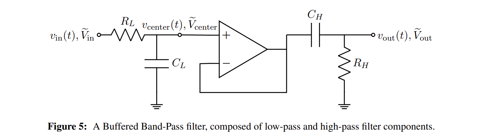
> `Band Pass`实际实际上就是两个`Cutoff Frequency`直接的差值，也就是上图中平坦区域的频率范围。
> 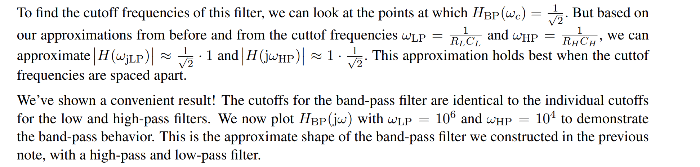


### RLC Model(Codes)⭐⭐⭐⭐⭐
> **HW05 Fa21 P8/HW05 Sp22 P6/Disc05A Fa21 P2**
> 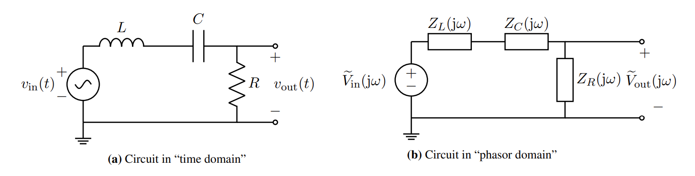
> 1. $Z_{RLC} =Z_L+Z_C+Z_R=jwL+\frac{1}{jwC}+R=R+j\cdot (wL-\frac{1}{wC})=A(w)+jX(w)$, 其中$A(w)$和$X(w)$是两个`Real-Valued Functions`。
> 2. `Asymptotic Analysis`渐进分析:$H(jw)=\frac{\tilde{V}_{out}}{\tilde{V}_{in}}=\frac{Z_{R}}{Z_{RLC}}=\frac{R}{R+j\cdot(wL-\frac{1}{wC})}=\frac{1}{1+j(w\frac{L}{R}-\frac{1}{wRC})}$
>    1. 当$w\to 0$时， $\frac{R}{R+j\cdot(wL-\frac{1}{wC})}\approx \frac{R}{R+j(-\frac{1}{wC})}\approx0$
>    2. 当$w\to \infty$时，$\frac{R}{R+j\cdot(wL-\frac{1}{wC})}\approx \frac{R}{R+jwL}\approx 0$
>    3. 当$wL=\frac{1}{wC}$, 即$w=\sqrt{\frac{1}{LC}}$时，$H(jw)=\frac{R}{R+j\cdot(wL-\frac{1}{wC})}=\frac{R}{R}=1$，这个频率称为`Resonant Frequency`，此时电容和电导导致的虚数部分完全消除。在`Resonant Circuits`一章节中详细介绍这类电路。所以`Resonant Frequency`取决于$L,C$的取值。
> 3. `Magnitude&Phase`:
> 
`Magnitude`相对容易，我们只需要求模即可。
> $\begin{aligned}
|H(\mathrm{j} \omega)| & =\left|\frac{1}{1+\mathrm{j}\left(\omega \frac{L}{R}-\frac{1}{\omega R C}\right)}\right| \\
& =\frac{|1|}{\left|1+\mathrm{j}\left(\omega \frac{L}{R}-\frac{1}{\omega R C}\right)\right|} \\
& =\frac{1}{\sqrt{\left(1+\mathrm{j}\left(\omega \frac{L}{R}-\frac{1}{\omega R C}\right)\right)\left(1-\mathrm{j}\left(\omega \frac{L}{R}-\frac{1}{\omega R C}\right)\right)}} \\
& =\frac{1}{\sqrt{1+\left(\omega \frac{L}{R}-\frac{1}{\omega R C}\right)^2}}
\end{aligned}$
> `Phase`的求法由两种，一种是将$H(jw)$写成$H(jw)=X(w)+jY(w)$, 然后$\angle H(jw)=atan2(Y(w),X(w))$(或者$atan2(\frac{Y(w)}{X(w)},1)$)。另一种是将$H(jw)$看成$\frac{A(jw)}{B(jw)}$, 分别求出$\angle B(jw)$和$\angle B(jw)$, 然后$\angle H(jw)=\angle A(jw)-\angle B(jw)$
> **方法一:**
> $\begin{aligned}H(\mathrm{j} \omega) & =\frac{1}{1+\mathrm{j}\left(\omega \frac{L}{R}-\frac{1}{\omega R C}\right)} \\& =\frac{1}{1+\mathrm{j}\left(\omega \frac{L}{R}-\frac{1}{\omega R C}\right)} \times \frac{1-\mathrm{j}\left(\omega \frac{L}{R}-\frac{1}{\omega R C}\right)}{1-\mathrm{j}\left(\omega \frac{L}{R}-\frac{1}{\omega R C}\right)} \\& =\frac{1-\mathrm{j}\left(\omega \frac{L}{R}-\frac{1}{\omega R C}\right)}{1+\left(\omega \frac{L}{R}-\frac{1}{\omega R C}\right)^2} \\& =\frac{1}{1+\left(\omega \frac{L}{R}-\frac{1}{\omega R C}\right)^2}+\mathrm{j} \frac{-\left(\omega \frac{L}{R}-\frac{1}{\omega R C}\right)}{1+\left(\omega \frac{L}{R}-\frac{1}{\omega R C}\right)^2}\end{aligned}$
> $\begin{aligned}\angle H(\mathrm{j} \omega) & =\operatorname{atan} 2\left(\frac{Y(\omega)}{X(\omega)}, 1\right) \\& =\operatorname{atan} 2\left(\frac{-\frac{-\left(\omega \frac{L}{R}-\frac{1}{\omega R C}\right)}{1+\left(\omega \frac{L}{R}-\frac{1}{\omega R C}\right)^2}}{\frac{1}{1+\left(\omega \frac{L}{R}-\frac{1}{\omega R C}\right)^2}}, 1\right)\\&\begin{aligned}
& =\operatorname{atan} 2\left(\frac{-\left(\omega \frac{L}{R}-\frac{1}{\omega R C}\right)}{1}, 1\right) \\
& =-\operatorname{atan} 2\left(\omega \frac{L}{R}-\frac{1}{\omega R C}, 1\right)
\end{aligned}\end{aligned}$
> **方法二:**
> $\begin{aligned}\angle H(\mathrm{j} \omega) & =\angle 1-\angle\left(1+\mathrm{j}\left(\omega \frac{L}{R}-\frac{1}{\omega R C}\right)\right) \\& =0-\operatorname{atan} 2\left(\omega \frac{L}{R}-\frac{1}{\omega R C}, 1\right) \\& =-\operatorname{atan} 2\left(\omega \frac{L}{R}-\frac{1}{\omega R C}, 1\right)\end{aligned}$
> 4. **在**[**RLC Circuit Analysis**](https://www.yuque.com/alexman/edfboy/phq4yp791xcc8if9#HKhkx)**中我们已经分析过，根据**$R,L,C$**的相对大小关系电路会有四种状态:**
> 
特征值是: $\lambda=-\frac{1}{2} \frac{R}{L} \pm \frac{1}{2} \sqrt{\left(\frac{R}{L}\right)^2-\frac{4}{L C}}$, 则:
>       1. `Overdamped`: 此时对应特征值为不相等的实数，即$(\frac{R}{L})^2-\frac{4}{LC}>0$, 即$R>2 \sqrt{\frac{L}{C}}$。
>       2. `Undamped`: 此时对应特征值只有虚数部分，即$R=0$, 且$(\frac{R}{L})^2-\frac{4}{LC}<0$。
>       3. `Underdamped`: 此时对应特征值实部和虚部均不是零，即$R\neq 0$, 且$(\frac{R}{L})^2-\frac{4}{LC}<0$
>       4. `Critically Damped`: 此时对应$(\frac{R}{L})^2-\frac{4}{LC}=0$, 即$R=2\sqrt{\frac{L}{C}}$。

```python
import numpy as np
import matplotlib.pyplot as plt

# This function will generate the magnitude (and optionally the phase) 
# of the inputed transfer function. 
# Inputs: 
#     H (function) - The transfer function of interest
#     w_range (length 2 tuple) - The function will plot w in [10 ** w_range[0], 10 ** w_range[1]]
#     phase (boolean) - Default is false, optionally plots the phase response
# Outputs:
#     None, just plots the function.
def plot_tf(H, w_range, phase=False):
    w = np.logspace(w_range[0], w_range[1], num=1000)
    
    plt.grid()
    plt.title('Magnitude Plot: $|H(j\omega)|$')
    plt.xlabel('$\omega$')
    plt.ylabel('$|H(j\omega)|$')
    plt.loglog(w, np.abs(H(w)))
    
    if phase:
        plt.figure()
        plt.grid()
        plt.title('Phase Plot: Phase of $H(j\omega)$')
        plt.xlabel('$\omega$')
        plt.ylabel('$\measuredangle H(j\omega)$')
        plt.semilogx(w, np.angle(H(w)) * 180 / np.pi)
```
```python
# Define your transfer function
# Our own H(jw)
def H_example(R, L, C):
    # For plotting
    def H(w):
        return 1 / (1 + 1j * ( w * L / R - 1 / (w * R * C)))
    return H

R = 1e3 
L = 25e-6
C = 10e-9

#Pass in your transfer function and the log range to plot_tf
plot_tf(H_example(R, L, C), (-2, 15), phase=True)
```
**Overdamped Output**$R=1 \mathrm{k} \Omega, C=10 \mathrm{nF}, L=25 \mu \mathrm{H}$
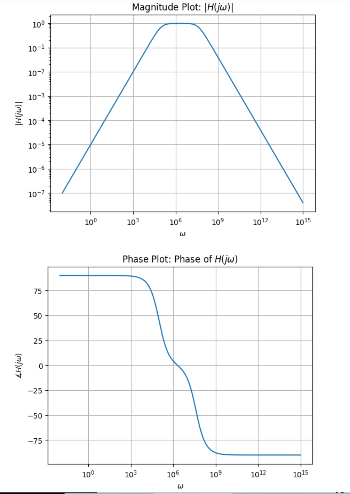
**Underdamped Output**$R=1 \Omega, C=10 \mathrm{nF}, L=25 \mu \mathrm{H}$
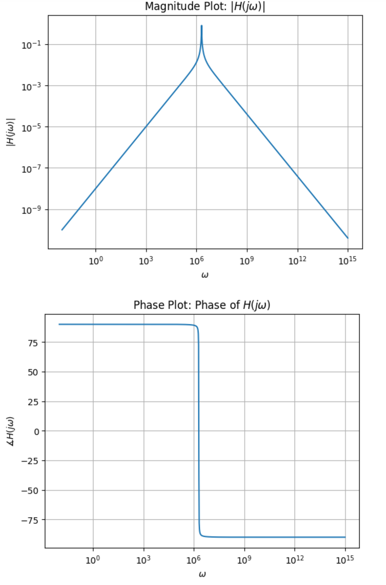
**Critically Damped Output**$R=100 \Omega, C=10 \mathrm{nF}, L=25 \mu \mathrm{H}$
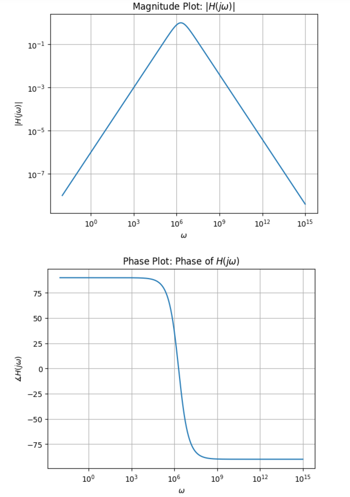
> 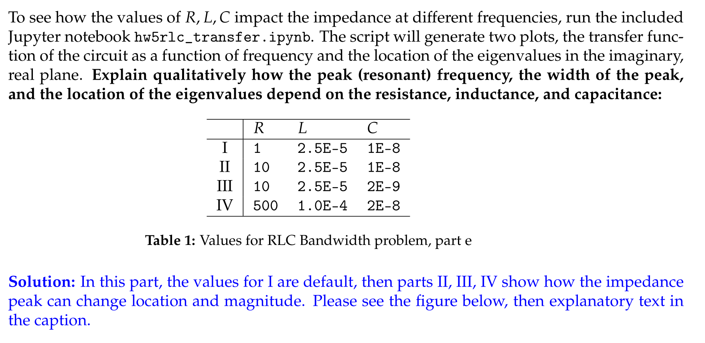


## Notch Filter
### Definition
> 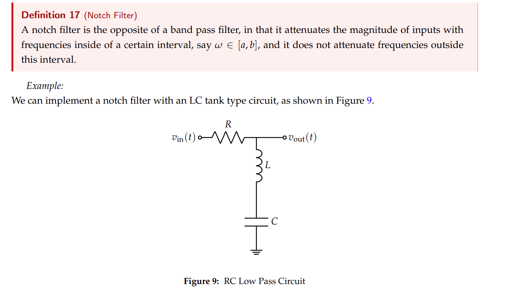


### Transfer Function
> 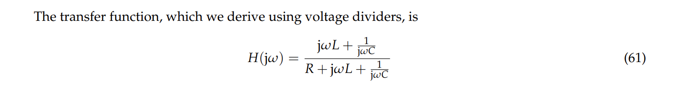
> 当$w\to 0$时，$\lim_{w\to 0}|H(jw)|=\frac{\lim_{w\to 0} 1}{\lim_{w\to 0}\sqrt{1+(\frac{wRC}{1-w^2LC})^2}}=\frac{1}{1}=1$
> 当$w\to \infty$时，$\lim_{w\to \infty}|H(jw)|=\frac{\lim_{w\to \infty} 1}{\lim_{w\to \infty}\sqrt{1+(\frac{wRC}{1-w^2LC})^2}}=\frac{1}{1}=1$


### Graph
> 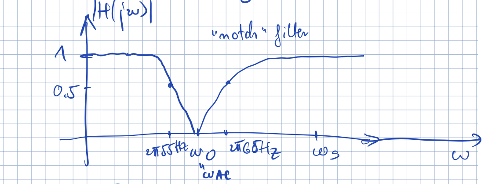


## Higher Order Low Pass Filter
### Notations
> 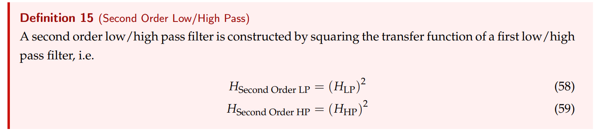


### Second Order
> 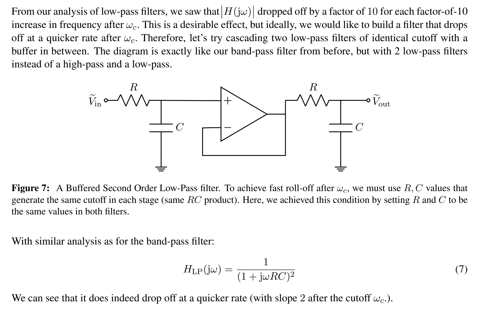
> 假设`Cutoff Frequency`是$w_c=\frac{1}{RC}$, 则当$w\gg w_c$时，$H(jw)=\frac{1}{(1+jwRC)^2}=\frac{1}{(1+j\frac{w}{w_c})^2}\approx\frac{1}{(j\frac{w}{w_c})^2}=-\frac{w_c^2}{w^2}$, 所以$|H(jw)|=\frac{w_c^2}{w^2}$, 此时$log(|H(jw)|)=log(w_c^2)-log(w^2)=log(w_c)-2log(w)$, 可以看到这里的斜率是$-2$，比之前的`First Order Low Pass Filter`对于高频信号的过滤效果更好。


### Higher Order
> 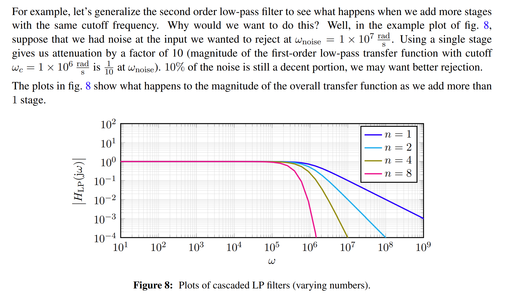

## 

## More Filters
### RCR Circuit
> 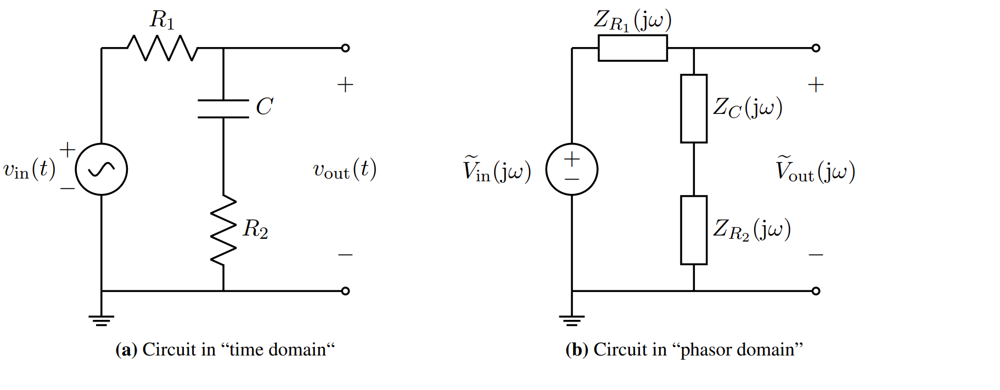
> $H(jw)=\frac{Z_C+Z_{R_2}}{Z_C+Z_{R_1}+Z_{R_2}}=\frac{\frac{1}{jwC}+R_2}{\frac{1}{jwC}+R_1+R_2}=\frac{1+jwCR_2}{1+jwC(R_1+R_2)}$
> 1. **At low frequency, frequencies are preserved:**$\lim_{w\to 0}\frac{\frac{1}{jwC}+R_2}{\frac{1}{jwC}+R_1+R_2}=\frac{1+jwCR_2}{1+jwC(R_1+R_2)}=\frac{\lim_{w\to 0}1+jwCR_2}{\lim_{w\to 0}1+jwC(R_1+R_2)}=1$
> 2. **At high frequency, frequencies are diminished: **$\lim_{w\to \infty} \frac{1+jwCR_2}{1+jwC(R_1+R_2)}=\lim_{w\to \infty}\frac{1}{1+\frac{jwCR_1}{1+jwCR_2}}=\lim_{w\to \infty}\frac{1}{1+\frac{1}{\frac{1}{jwCR_1}+\frac{R_2}{R_1}}}=\frac{R_2}{R_1+R_2}$
> 
This circuit is like **a combination of a low-pass filter and a voltage divider**: low frequency inputs are preserved, and high-frequency signals are diminished.  


# Composition of Transfer Function
## Basic Properties
> 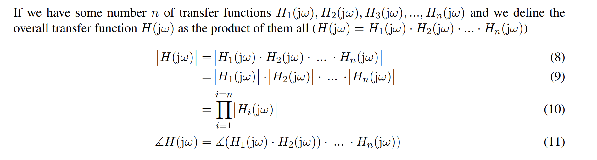


## Choice of Scale for Plots
### Log-Log Scale - Magnitude
> 上文中的`Transfer Function Plot`旨在探究$|H(jw)|$和$w$之间的关系，一般我们会选取`log-scale`进行绘制，即横轴选取$log(w)$, 纵轴选取$log|H(jw)|$。
> 
> 所以尽管横轴上的数值是$10^1, 10^2,\cdots, 10^6$的非等间距数值，但是`log`之后就是等间距排布。
> 选取`log-log scale`的好处就是，我们再进行`Filters`的组合时:
> 如果已经得到了`Filter`各自的`|H(jw)|-w`图，则因为$|H(jw)|=|H_1(jw)|\times|H_2(jw)|$在`log-scale`下就变成了$log|H(jw)|=log|H_1(jw)|+log|H_2(jw)|$，所以纵轴可以直接相加方便作图。


### Semi-Log Scale - Phase
> 
> 横轴上是`log-scale`, 纵轴上是`linear scale`。


### Decibel Scale - Semi-Log
> 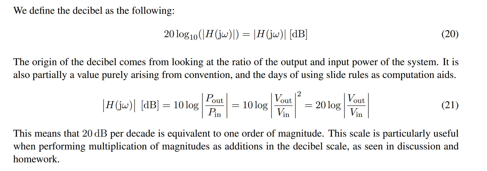
> 🔔: 为什么我们需要使用`Decibel Scale`呢? 好处是什么呢?
> 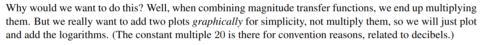


# 


# Resources
> Note 6/7/8 Fa21
> Note 5/6 Sp23

