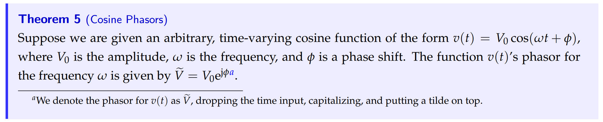
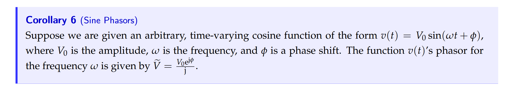

# AC Steady State
## AC input
> `AC Input`和`DC Input`最大的不同就是`AC`输入是一个可变函数。

## Exponential Input
> 1. 对于一个微分方程$\frac{dx(t)}{dt}=\lambda x(t)+u(t)\tag{1}$来说，我们可以使用`Integrating Factor`得到:
> 
$x(t)=x_0e^{\lambda t}+\int_0^t u(\tau) e^{\lambda(t-\tau)}d\tau$
> 当$u(t)=ke^{st}(s\neq \lambda)$时，我们有:
> $\begin{aligned}x(t)&=(x_0-\frac{k}{s-\lambda})e^{\lambda t}+\frac{k}{s-\lambda}e^{st}\end{aligned}$
> 当$Re(\lambda)< 0$时(一般的电路都满足这个条件)，第一项在$t\to \infty$时趋近于零，于是$\lim_{t\to\infty}x(t)\approx \frac{k}{s-\lambda}e^{st}=u_0e^{st}$。
> 第一项被称为`Transient Solution`, 第二项是`Steady State Solution`。
> 2. 对于一个微分方程组$\frac{d\vec{x}(t)}{dt}=\mathbf{A} \vec{x}(t)+\vec{u}(t)\tag{2}$来说, 我们假设$\vec{u}(t)=\vec{u}_0e^{st}$, $\vec{u}_0$是与$t$无关的常数向量。
>    1. 我们先进行坐标转换，利用$\vec{x}(t)=\mathbf{V}\vec{z}(t)$得到新坐标下的微分方程组$\frac{d}{dt}\vec{z}(t)=\mathbf{\Lambda}\vec{z}(t)+\mathbf{V}^{-1}\vec{u}(t)$, 其中$\mathbf{V}$是$\mathbf{A}$的特征向量矩阵，对每一行我们有: $\frac{\mathrm{d}}{\mathrm{d} t} z_i(t)=\lambda_i z_i(t)+\left(V^{-1} \vec{u}_0 \mathrm{e}^{s t}\right)_i=\lambda_i z_i(t)+\left(V^{-1} \vec{u}_0 \right)_i\mathrm{e}^{s t}$
>    2. 然后我们利用$(1)$中的结果，得到$\lim_{t\to \infty}z_i(t)=\alpha_ie^{st}$(令$\left(V^{-1} \vec{u}_0 \right)_i=\alpha_i$), 向量化后得到$\lim_{t\to \infty}\vec{z}(t)=\vec{\alpha}e^{st}$。
>    3. 将$\vec{z}(t)$进行坐标转换为原来的坐标，得到$\lim_{t\to \infty}\vec{x}(t)=V\vec{z}(t)=(V\vec{\alpha})e^{st}=\vec{x_0}e^{st}$(如果$s\neq \lambda_i,\forall i$)
> 3. 将$\begin{cases} \vec{u}(t)=\vec{u}_0e^{st}\\ \lim_{t\to \infty}\vec{x}(t)=\vec{x}_0e^{st}\end{cases}$带入$(2)$中得到: $(s\mathbf{I}-\mathbf{A})\vec{x}_0=\vec{u}_0$, 因为$s\neq \lambda_i$, 所以满足$(s\mathbf{I}-\mathbf{A})\vec{y}=\vec{0}$的$\vec{y}$是不存在的，否则存在$\vec{y}$, 使得$\mathbf{A}\vec{y}=s\vec{y}$, 其中$s$是$\mathbf{A}$的特征值，矛盾，所以我们知道$(s\mathbf{I}-\mathbf{A})$的零空间没有非零解，即$(s\mathbf{I}-\mathbf{A})$可逆，所以$\vec{x}_0=(s\mathbf{I}-\mathbf{A})^{-1}\vec{u}_0$。
> 
于是$\lim_{t\to \infty}\vec{x}(t)=\vec{x_0}e^{st}=(s\mathbf{I}-\mathbf{A})^{-1}\vec{u}_0e^{st}$, 验证这个`Steady State Solution`满足$(2)$:
> 
> **综上所述: **对于$u(t)=\vec{u_0}e^{st}, s\neq \lambda_i$, 我们有$\lim_{t\to \infty}\vec{x}(t)=(s\mathbf{I}-\mathbf{A})^{-1}\vec{u}_0e^{st}$，对于$s\in \mathbb{C}$，有:
> 1. $Re(s)>0$, 则`Steady State Solution`$\vec{x}(t)$explodes to infinity.
> 2. $Re(s)<0$, 则`Steady State Solution`$\vec{x}(t)$decays to zero.
> 3. $Re(s)=0$, 则`Steady State Solution`$\vec{x}(t)$是周期函数, 使用`Euler Formula`可得。

# 
## Sinusoidal Input
> 
> 其实`Sinusoidal Input`就可以看成是两个共轭的`Exponential Input`。

### Ex1: Oscillating Current Input⭐⭐⭐
> **EECS16B sp23 disc 01A P2**
> 

**Solution**

### Ex2: Oscillation Voltage Input
> 

**(a) Set Up Differential Equation**
**(b) Initial Condition**
**(c) Solve the Voltage - Method 1: Definite Integral**

**(c) Solve the Voltage - Method 2: Indefinite Integral**
**我们有如下的推导步骤:**
$\begin{aligned} v(t)&=A^{-\frac{1}{RC}t}+e^{-\frac{1}{RC}t}\int e^{\frac{1}{RC}t}\frac{1}{RC}V_{in}(t)dt\\&=A^{-200t}+e^{-200t}\int e^{200t}\cdot 200\cdot 2sin(200t)dt\\&=Ae^{-200t}+400e^{-200t}\frac{1}{200^2+200^2}e^{200t}(200sin(200t)-200cos(200t))\\&=Ae^{-200t}+(sin(200t)-cos(200t))\end{aligned}$
$v(0)=1$得到$A=2$
所以$v(t)=2e^{-200t}+(sin(200t)-cos(200t))$
**(d) Solve the Current**

# More on Complex Numbers
## Euler Theorem
> 

## Magnitude-Phase Representation
> 

# Phasors
## Definition 1: With 1/2
### Concepts
> **From Note 5/6 Fa21: 这个定义和后续的课程衔接更紧密, 我们选择这个定义。**
> 
> 对于一个三角函数$u(t)=Acos(wt+\phi)$来说，我们有如下定义:
> 1. $A$是`Amplitude`
> 2. $w$是`Angular Frequency`, $T=\frac{2\pi}{w}$是`Period`。要转化为`Frequency`我们可以使用$w=2\pi f$或者$f=\frac{w}{2\pi}$。
> 3. $w$的单位是$\frac{rad}{s}$, $f$的单位是$Hz$。
> 4. $\phi$是`Phasor Shift/Lag`, 表示将和$Acos(wt)$的图像向左平移$\frac{\phi}{w}$秒，表示图像比$Acos(wt)$先出现了$\frac{\phi}{w}$秒。
> 
结合`Euler Formula`, 我们有:
>  $\begin{aligned}Acos(wt+\phi)&=A\frac{e^{j(wt+\phi)}+e^{-j(wt+\phi)}}{2}\\&=\frac{Ae^{j\phi}}{2}e^{jwt}+\frac{Ae^{-j\phi}}{2}e^{-jwt}\end{aligned}$
> 其中:
> 1. $\frac{Ae^{j\phi}}{2}e^{jwt}$和$\frac{Ae^{-j\phi}}{2}e^{-jwt}$互为`Complex Conjugate`, 二者之和为`Real Number`。
> 2. $\frac{Ae^{j\phi}}{2}$被称为$jw-phasor$(`Coefficient of the time dependent exponentials`$e^{jwt}$)。$\frac{Ae^{-j\phi}}{2}$没有什么定义，因为知道了$\frac{Ae^{j\phi}}{2}$之后取一个`Complex Conjugate`就是$\frac{Ae^{-j\phi}}{2}$。

### Phasors As Input
> 对于任意的形如上述三角函数的输入$\vec{u}(t)$(假设$\pm jw$不是$\mathbf{A}$的特征值)，微分方程组$\frac{d\vec{x}(t)}{dt}=\mathbf{A} \vec{x}(t)+\vec{u}(t)$可以写成:
> $\frac{d\vec{x}(t)}{dt}=\mathbf{A} \vec{x}(t)+\vec{u_p}(t)+\overline{\vec{u_p}(t)}$
>  我们使用`Superposision Principle`可知:
> 1. 对于$\frac{d\vec{x}(t)}{dt}=\mathbf{A} \vec{x}(t)+\vec{u_p}(t)$, $\vec{x}(t)=(jw\mathbf{I}-\mathbf{A})^{-1}\frac{\mathbf{A}e^{j\phi}}{2}e^{jwt}$
> 2. 对于$\frac{d\vec{x}(t)}{dt}=\mathbf{A} \vec{x}(t)+\overline{\vec{u_p}(t)}$, $\vec{x}(t)=(-jw\mathbf{I}-\mathbf{A})^{-1}\frac{\mathbf{A}e^{-j\phi}}{2}e^{-jwt}=\overline{(jw\mathbf{I}-\mathbf{A})^{-1}\frac{\mathbf{A}e^{j\phi}}{2}e^{jwt}}$
> 
所以$\vec{x}(t)=(jw\mathbf{I}-\mathbf{A})^{-1}\frac{\mathbf{A}e^{j\phi}}{2}e^{jwt}+\overline{(jw\mathbf{I}-\mathbf{A})^{-1}\frac{\mathbf{A}e^{j\phi}}{2}e^{jwt}}$

### Phase Transform
> 
> `Inverse Phasor Transform`($jw$phasor): $u(t)=\widetilde{W}e^{jwt}+\overline{\widetilde{W}}e^{-jwt}$。
> 注意到`Input`的`Magnitude`被先除以了$2$, 所以在后续`Output`的时候需要乘以$2$。

### Phasor KVL&KCL
> 

## Definition 2: Without 1/2
> **From Note 5 Sp23: 这个定义更便于计算。**
> 

**Proof**
> 

**Example**

## General Idea⭐⭐⭐⭐⭐
### Superposition Principle
> **Disc04B Sp23 P1**
> 
> 这里`Phasor`$\widetilde{V_S},\overline{\widetilde{V_S}}$可以看成系数(因为和$t$无关)，$e^{jwt},e^{-jwt}$可以看成输入, 可以用`Superposition Principle`组合起来。
> $v_s(t)=e^{jwt}$作为电压输入进去的时候，系统的`Steady State Solution`$i_1(t)$的形式就应该是$K_1e^{jwt}$
> $v_s(t)=e^{-jwt}$作为电压输入进去的时候，系统的`Steady State Solution`$i_2(t)$的形式就应该是$K_2e^{-jwt}$。
> 然后使用`Superposition`, 当输入为: $v_s(t)=C_1e^{jwt}+C_2e^{-jwt}$(`Sinusoidal Functions`)时，$i(t)=C_1i_1(t)+C_2i_2(t)=C_1K_1e^{jwt}+C_2K_2$, 其中$C_1$和$C_2$共轭，$K_1$和$K_2$共轭。
> 

### Simple Calculation Method
> If the input to the system is a sinusoidal function with frequency $ω$, the currents and voltages throughout the system in steady state will also be sinusoidal functions of the same frequency $ω$.  
> **简单的解题方法就是:**
> - 如果输入是$Acos(w_1t+\phi_1)$, 则输出是$Bcos(w_2t+\phi_2)$, 函数名对应上即可
> - 如果输入是$Asin(w_1t+\phi_1)$, 则输出是$Bsin(w_1 t+\phi_2)$, 函数名对应上即可
> - $\phi_2=\phi_1+\angle H(jw)$
> - $B=|H(jw)|A$
> 
**证明在**`**Transfer Function**`**小节中给出。**

## Warnings about Definitions
> 

# Phasors and Eigenvalues⭐⭐⭐⭐⭐
> **Hw05 Fa21 P6**
> 
>  首先我们分析一下本题中的假设，即如果输入为$u(t)=\widetilde{U}e^{jwt}+\overline{\widetilde{U}}e^{-jwt}$, 则输出为$\vec{x}(t)=\overrightarrow{\widetilde{X}} \mathrm{e}^{+\mathrm{j} \omega t}+\overline{\overrightarrow{\widetilde{X}}} \mathrm{e}^{-\mathrm{j} \omega t} .$
> 这个结论在我们的`Exponential Input`小节中有分析过，当时我们的结论是，对于微分方程组$\frac{d}{dt}\vec{x}(t)=A\vec{x}(t)+\vec{u}(t)$, 如果$\vec{u}(t)=\vec{b}u(t)$, 则`Steady State Solution`:$\lim_{t\to\infty}\vec{x}(t)=\vec{x_0}e^{st}=(sI-A)\vec{b}e^{st}$。
> 本题中也是类似的思想，我们将解的形式带入原微分方程可得:
> 

# Impedance&Reactance
## Capacitor
> 

## Resistor
> 

## Inductor
> 

## Impedence&Reactance
> **Impedances that are pure imaginary are also called reactances. 比如电容和电导。**

# Impedence in complex plane
> **HW04 Fa21 P7**
> 

**(a) w = 0.5**
**(b) w = 1**
**(c) w = 2**
**(d) Natural Frequency**

# Transfer Function&Gain
> 在`DC`电路中, 我们称$\frac{V_{out}}{V_{in}}$为`Gain`是一个常数。
> , 而在`AC`电路中，我们在`Phasor Domain`中称$\frac{\tilde{V}_{out}}{\tilde{V}_{in}}$为`Transfer Function`，是一个`Complex Function`。
> 
> `Output Phasor`和`Input Phasor`之间的比值$\frac{\tilde{V_{out}}}{\tilde{V_{in}}}$被定义为$H(jw)$。
> 在`Time Domain`中，我们有:
> $\begin{aligned}V_{out}(t)&=\tilde{V}_{out}e^{jwt}+\overline{\tilde{V}_{out}}e^{-jwt}\\&=|\tilde{V}_{out}|e^{j\angle \tilde{V}_{out}}\cdot e^{jwt}+|\tilde{V}_{out}|e^{-j\angle \tilde{V}_{out} }\cdot e^{-jwt}\\&=|\tilde{V}_{out}|e^{i(wt+\angle \tilde{V}_{out})}+|\tilde{V}_{out}|e^{-i(wt+\angle \tilde{V}_{out})}\\&=2|\tilde{V}_{out}|cos(wt+\angle \tilde{V}_{out}) \end{aligned} \tag{1}$
> 另外我们知道: $\tilde{V}_{out}=H(jw)\tilde{V}_{in}$, 所以根据复数的性质，我们有: 
> $\begin{aligned}|\tilde{V}_{out}|e^{j\angle \tilde{V}_{out}}&=|H(jw)|e^{j\angle H(jw)}|\tilde{V}_{in}|e^{j\angle \tilde{V}_{in}}\\&=|H(jw)||\tilde{V}_{in}|e^{j(\angle H(jw)+\angle \tilde{V}_{in})}\end{aligned}$
> 所以$|\tilde{V}_{out}|=|H(jw)||\tilde{V}_{in}|,$$\angle \tilde{V}_{out}=\angle H(jw)+\angle \tilde{V}_{in}$
> 所以代入$(1)$后我们有$V_{out}(t)=2|H(jw)||\tilde{V}_{in}|cos(wt+\angle \tilde{V}_{in}+\angle H(jw))$
> **下面我们代入真实的输入函数:**
> 当$V_{in}(t)=V_{in}cos(wt+\phi)$时，$\tilde{V}_{in}=\frac{V_{in}e^{j\phi}}{2}$, 即$|\tilde{V}_{in}|=\frac{V_{in}}{2}$, $\angle \tilde{V}_{in}=\phi$, 所以:
> $\begin{aligned} V_{out}(t)&=2|H(jw)||\tilde{V}_{in}|cos(wt+\angle \tilde{V}_{in}+\angle H(jw))\\&=|H(jw)|V_{in}cos(wt+\phi+\angle H(jw))\end{aligned}$
> 1. `Transfer Function`$H(jw)$取决于我们的电路结构，通常是用`Impedance`来求出的。
> 2. `Transfer Function`$H(jw)$改变输入的信号强度(`Magnitude`)，改变输入信号的`Phase`($\angle H(jw)$)。

# Resources
> Note 5/6 Fa21

