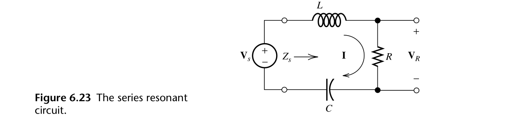
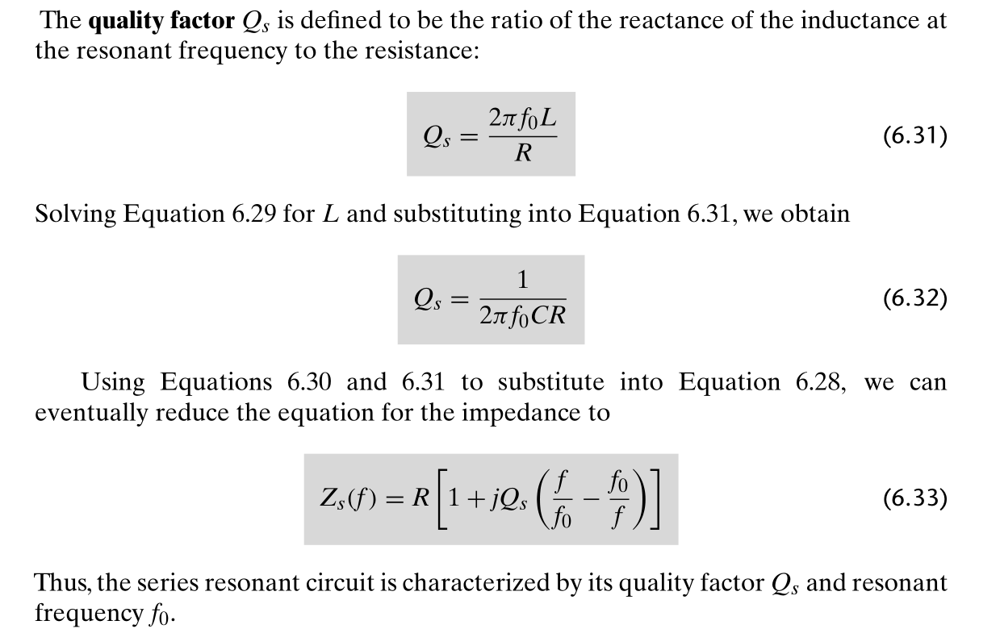
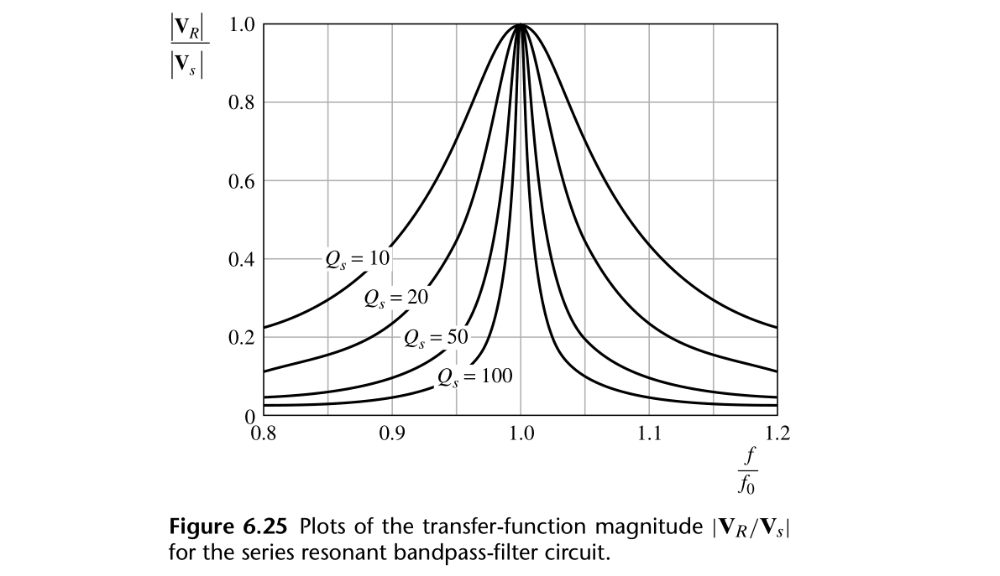
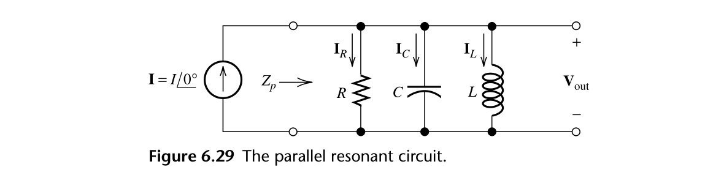
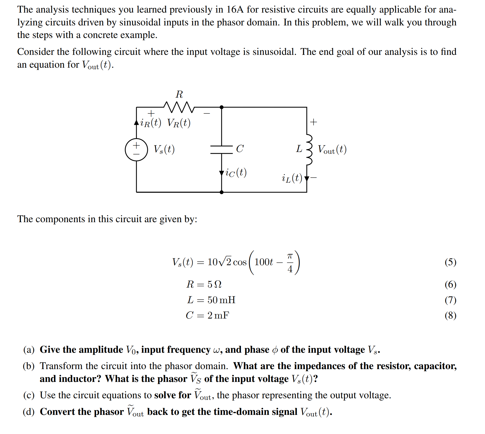
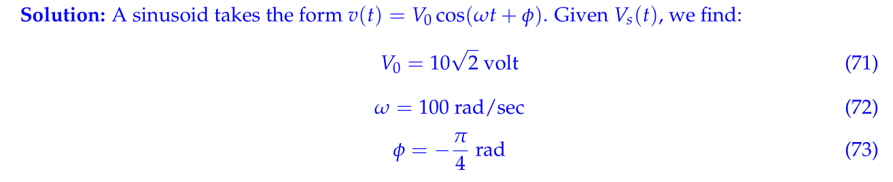
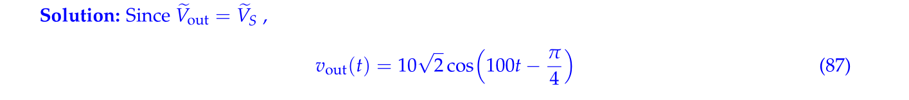
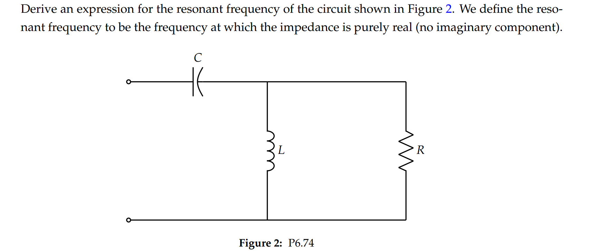
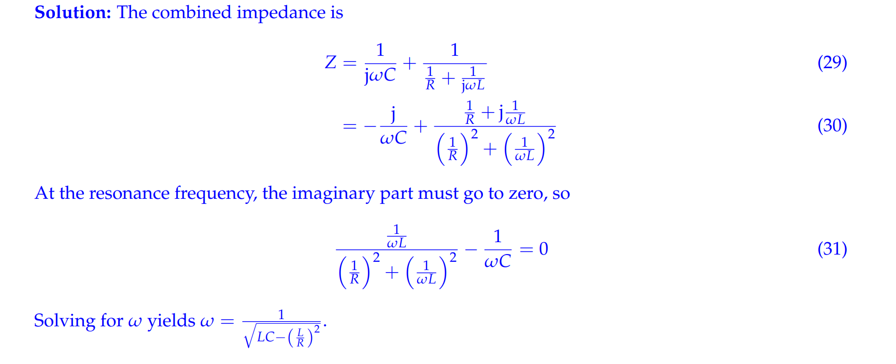

# Series Resonance Circuits
## Resonant Frequency
> 对于这个电路来说:
> 
> 我们有`Total Impedence`:
> $Z(f)=jwL+R+\frac{1}{jwC}=jwL+R-\frac{j}{wC}=j2\pi fL+R-\frac{j}{2\pi fC}$
> 我们**定义**`**Resonant Frequency**`$f_0$为使得`Total Impendence`$Z(f)$为`Purely Resistive`(只含有实数项，即$R$)时候的频率。换句话说，就是使得`Total Reactance`为零的频率。
> 我们零$jwL=\frac{j}{wC}$得到$w=\frac{1}{\sqrt{LC}}$。因为$2\pi f_0=w$, 所以$f_0=\frac{1}{2\pi \sqrt{LC}}$，就是我们的共振频率。

## Quality Factor
> 

## Series Resonant Bandpass Filter
> 还是这个电路:
> 
> 我们有$\widetilde{I}=\frac{\widetilde{V_s}}{Z(f)}=\frac{\widetilde{V_s}}{R\left[1+j Q_s\left(\frac{f}{f_0}-\frac{f_0}{f}\right)\right]}$, $\widetilde{V_{R}}=\widetilde{I}R=\frac{V_s}{1+j Q_s\left(\frac{f}{f_0}-\frac{f_0}{f}\right)}$
> 所以$\frac{\widetilde{V_R}}{\widetilde{V_s}}=\widetilde{I}R=\frac{1}{1+j Q_s\left(\frac{f}{f_0}-\frac{f_0}{f}\right)}$, 我们画$\frac{f}{f_0}-\frac{|\widetilde{V_R}|}{|\widetilde{V_s}|}$图像如下:
> 
> 可以看到，在`Resonant Frequency`的时候输出的电压值最大。

# Parallel Resonance Circuits
## Circuit
> 

## Working Example
### Example 1: Analysis
> **Hw05 Fa21 P7**
> 

**(a)**
**(b) Figure out Input Phasor**
**(c) Resonant Analysis ⭐⭐⭐⭐⭐**
**(d) Convert to time domain**
> 在`Phasor Domain`进行电路分析时，我们可以使用`Circuit Equivalent`, 但是有时候会得到$\infty$的等效结果，这也正常，因为我们的`Impedence`是复数。

### Example 2: Find resonant frequency
> 

**Solution**

# Resources
> Electrical Engineering Principles 6ed Ch6.6/Ch6.7

