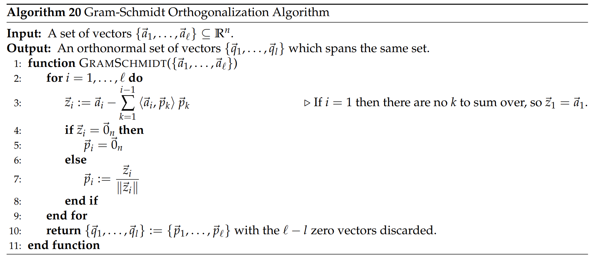

# Overview
> 

# Orthogonality

## Orthogonality of Vectors
> 
> 🔔: 非零正交向量集合中的向量是线性无关的。
> 

**Proof of Theorem 3 - Method 1**假设$S=\{\vec{a}_1,\vec{a}_2,\cdots, \vec{a}_n\}$，其中$\langle \vec{a}_i,\vec{a}_j\rangle=0(i\neq j)$, 且$\langle \vec{a}_i,\vec{a}_i\rangle>0$则我们要证明: $c_1\vec{a}_1+c_2\vec{a}_2+\cdots +c_n\vec{a}_n=0$的系数$c_i$全部为零。 我们**利用**`**Inner Product**`和正交性来证明: 我们有$\begin{aligned}0&=\langle \vec{a}_i,0\rangle=\langle \vec{a}_i,c_1\vec{a}_1+c_2\vec{a}_2+\cdots +c_n\vec{a}_n\rangle\\&=c_1\langle\vec{a}_i,\vec{a_1}\rangle+c_2\langle\vec{a}_i,\vec{a_2}\rangle+\cdots+c_i\langle \vec{a}_i,\vec{a_i}\rangle+\cdots+c_1\langle\vec{a}_i,\vec{a_n}\rangle\end{aligned}$ 因为$\langle \vec{a}_i,\vec{a}_i\rangle>0$, 所以$c_1\langle\vec{a}_i,\vec{a_1}\rangle+c_2\langle\vec{a}_i,\vec{a_2}\rangle+\cdots+c_i\langle \vec{a}_i,\vec{a_i}\rangle+\cdots+c_1\langle\vec{a}_i,\vec{a_n}\rangle=c_1\|\vec{a}_i\|=0$ 所以$c_i=0,~\forall i$, 证毕。
**Proof of Theorem 3 - Method 2**
> 

## Orthogonality of Sets
> 
> ⭐: 注意这里$S_1$和$S_2$(都$\in \mathbb{R}^n$)两个子空间彼此正交并不是说$S_1$和$S_2$各自是正交向量的集合，因为子空间中的向量有无限多个，而正交向量集合的条件由`Corollary 4`可知，是不能超过$n$的。
> 

**Proof of Proposition 6**假设$S_1$的基向量为$B_1=\{\vec{a}_1,\vec{a}_2,\cdots, \vec{a}_m\}$, $S_2$的基向量为$B_2=\{\vec{b}_1,\vec{b}_2,\cdots, \vec{b}_n\}$，注意$B_1$和$B_2$各自不一定是由正交向量列构成，则我们有:

1. 如果$B_1$和$B_2$着两个集合互相正交，则$\forall 1\leq i\leq m, 1\leq j\leq n, \langle\vec{a}_i,\vec{b}_j\rangle=0$, 因为$B_1$是$S_1$的基，所以$\forall \vec{u} \in S_1$, $\vec{u}=c_1\vec{a}_1+c_2\vec{a}_2+\cdots+c_m\vec{a}_m$for some coefficients $c_i$'s。同理$\forall \vec{v} \in S_2$, $\vec{v}=d_1\vec{b}_1+d_2\vec{b}_2+\cdots+d_m\vec{b}_m$，所以$\forall \vec{u}\in S_1,\vec{v} \in S_2$我们有：$\begin{aligned}\langle c_1\vec{a}_1+c_2\vec{a}_2+\cdots+c_m\vec{a}_m ,d_1\vec{b}_1+d_2\vec{b}_2+\cdots+d_m\vec{b}_m \rangle&=\sum_{i=1}^m\sum_{j=1}^n c_id_j\langle\vec{a}_i,\vec{b}_j\rangle=0\end{aligned}$，这说明$\forall \vec{u}\in S_1,\vec{v} \in S_2,\langle\vec{u},\vec{v}\rangle=0$，即$S_1$和$S_2$相互正交。
2. 如果$S_1$和$S_2$着两个集合互相正交，$\forall \vec{u}\in S_1,\vec{v} \in S_2,\langle \vec{u},\vec{v}\rangle=0$。同样我们知道
   - $\forall \vec{u} \in S_1$, $\vec{u}=c_1\vec{a}_1+c_2\vec{a}_2+\cdots+c_m\vec{a}_m$
   - $\forall \vec{v} \in S_2$, $\vec{v}=d_1\vec{b}_1+d_2\vec{b}_2+\cdots+d_n\vec{b}_n$

以及$\langle \vec{u},\vec{v}\rangle=0$。所以我们有$\forall c_i,d_j$:$\begin{aligned}\langle c_1\vec{a}_1+c_2\vec{a}_2+\cdots+c_m\vec{a}_m ,d_1\vec{b}_1+d_2\vec{b}_2+\cdots+d_m\vec{b}_m \rangle&=\sum_{i=1}^m\sum_{j=1}^n c_id_j\langle\vec{a}_i,\vec{b}_j\rangle=0\end{aligned}$ 因为$\forall c_i,d_j, \sum_{i=1}^m\sum_{j=1}^n c_id_j\langle\vec{a}_i,\vec{b}_j\rangle=0$, 所以$\forall i,j,\langle\vec{a}_i,\vec{b}_j\rangle=0$, 这表明$B_1$和$B_2$集合互相正交。 

# Orthonormality

## Normalized Vectors
> 

## Orthonormal Vectors
> 

## Orthonormal Set
> 

## Orthonormal Matrices

### Definition
> 

**Proof of Theorem 11**

### Preserve Length Propoerties
> 

**Proof of Theorem 13**
> 

## Unitary Matrices

### Definition
> 

### Preserve Length Properties
> 

# Projections

## Definition
> 

## Least Squares & Projections
> [!thm]
> 

> [!proof]
> **Proof of Theorem 16**

> [!cor]
> 

> [!proof]
> **Proof of Corollary 17**

> [!thm]
> 

> [!proof]
> **Proof of Theorem 18**我们把$\vec{s}_1, \cdots, \vec{s}_n$放到一个矩阵$M\in \mathbb{R}^{m\times n}$中，这些向量$\vec{s}_i,i\in [1,n]$是互相线性无关的。于是$M$矩阵的形状必须满足$m\geq n$, 然后套用`Corollary 17`即可。 重复上述步骤，使用`Theorem 16`即可。

## Orthogonality Principles
> [!important]
> 

> [!proof]
> **Proof of Theorem 19**$\vec{z}\in S, \vec{y}\in S$，根据子空间的性质(向量的线性组合也在子空间内)，所以$\vec{z}-\vec{y}\in S$。 因为$(ii)$假设$\vec{y}-\vec{x}$与$S$正交, 所以$\vec{y}-\vec{x}$垂直于$S$中的任何一个向量, 当然也包括$\vec{z}-\vec{y}$, 所以$\langle \vec{z}-\vec{y}, \vec{y}-\vec{x}\rangle=0$。
> **证明中出现的非常重要的想法:**
> 1. 如果我们有$\{\vec{v}_1,\vec{v}_2,\cdots,\vec{v}_n\}$这个`Orthogonal Sets`，则我们可以将这个集合以任意的方式平均分成几个子集，这些子集张成的子空间互相正交。
> 2. 对于任意向量$\vec{x}$和一个子空间$S$, $proj_S(\vec{x})$存在且唯一。令其为$\vec{y}=proj_S(\vec{x})\in S$, 则$\forall z\in S$,$\|\vec{z}-\vec{x}\|>\|\vec{y}-\vec{x}\|$, 也就是投影距离$\vec{x}$的端点最近。

# Gram-Schmidt Orthonormalization
## Algorithm
> 

## Proof of Correctness⭐⭐⭐⭐⭐
> 

**Proof about z's**
**Proof about p's**
**Proof of Theorem 21**

## How to Show Span Equivalency

### Method 1 - Set Equivalence
> 

 

### Method 2 -  Induction
> **HW 10 Sp23 P1**
> 

**Proof Outline**

## How to Show Set Orthogonality
> 证明一个集合$\{\vec{v}_1,\vec{v}_2,\cdots, \vec{v}_n\}$中的向量互相正交(`Orthogonal Set`), 我们有两种方法。

### Method 1 - Arbitrary Vector Pair
> 我们任取两个集合中的向量$\vec{v}_i,\vec{v}_j$, 证明$\vec{v}_i^{\top}\vec{v}_j=0$, 但是证明不具有递归性质。

### Method 2 - Induction
> **HW10 Sp23 P1**
> 

**Proof Outline**

## Applying the Algorithm

### 标准正交基的存在性
> 

### 扩展标准正交基
> 

**Example**

## Example
> 

# QR Decomposition
> 

**Proof of Theorem 25**

# Resources
> **Note 13 Sp22**
> **Disc09B Sp22**

