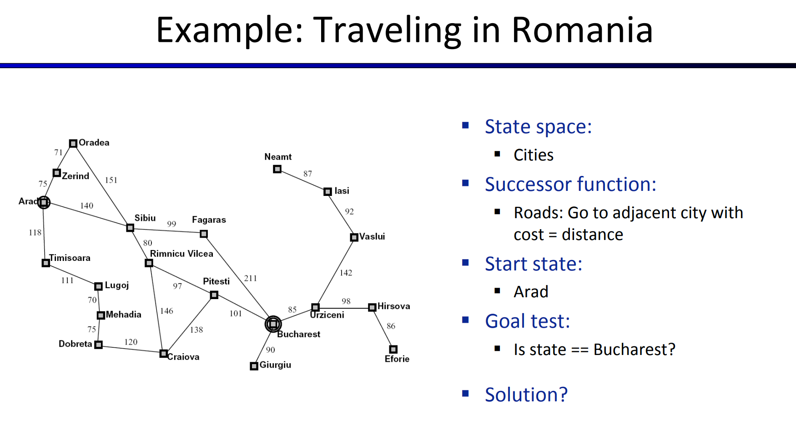

# Search Problems
## Search Problem Formulation
> [!def]
> 
> A search problem consists of the following:
> 
> 
> A path from the start state to the goal state is called a plan(solution to the search problem).

> [!example]
> 

## State Space
> [!def]
> 
> 
> **Note:** So the state space formulation depends on the goal of our problem, which brings about two concepts:
> - **World State:** It contains all the information about a state, whether necessary or not, could be redundant.
> - **Search State:** It contains only the information that is necessary for finding the planning for current problem.

## State Space Size
> [!def]
> Consider the following world:
> 
> The world state could be described by:
> 
> 
> Actually, you can think of the world state as a sequence of variable that each could take a certain amount of value(if the world state space is discrete), here in this example, we can define a variable for each of the state above: $$(P,D,G_1,G_2,F_1,F_2,\cdots,F_{30})$$ where $P\in\{(1,1),(1,2),\cdots, (10,12)\}$, $D\in\{N,E,S,W\}$, $G_1,G_2\in\{(1,1),(1,2),\cdots, (3,4)\}$, $F_i\in\{0,1\},\forall i=1,2,\cdots, 30$.
> Then the world state space size can be computed just by the principle of counting sequence:
> 
> 

> [!example] Hanoi Tower Example
> 
> To formulate a search problem, we construct all of its components:
> 1. **State Space:** One possible state representation would be to store **three lists**, corresponding to which discs are on which peg. If we assume that the N discs are numbered in order of increasing size 1, ..., n, then we can represent each peg as an ordered list of integers corresponding to which discs are on that peg.
> 2. **State Space Size:** We could also image the state space as distributing $N$ discs over three pegs where each disc has 3 pegs to go, so the state space size should be $3^N$. Note that we don't have to consider whether the state is valid or not, (for example if disc 3 is above disc 2), since it will be deferred to transtion model to decide whether we will go into the state.
> 3. **Actions:** For each state, the **valid** operation is to pop the top disc and and it to lay on top of another peg. As long as the popped disc is ok to be added to another peg. (Smaller number than the top of another peg).
> 4. **Transition Model:** $Move(s,a)$ is to update the content of the three lists.
> 5. **Start State:** $([1,2,3,\cdots, N],[],[])$
> 6. **End State:** $([],[],[1,2,3,\cdots, N])$
> 7. **Path Cost:** All path should be equi-weight.

> [!example] 8-puzzle from textbook pp71
> 

## State Space Graphs&Search Trees
> [!def]
> 

> [!example] Sp28 Vitamin 1 Q1
> 
> The answer is 7.
> 
> 

# Tree Search vs Graph Search
> [!algo]
> 
> **Tree Search**
> 1. **Structure**: Tree search operates on a tree structure, which is a special case of a graph with no cycles. Each node (except the root) has exactly one parent, and there are no loops.
> 2. **Repeated States**: Tree search algorithms do not inherently keep track of the states (or nodes) they have already visited. Therefore, if the same state can be reached by multiple paths, it might be explored multiple times. This can lead to inefficiency, especially in large or complex trees.
> 3. **Implementation**: Common tree search algorithms include Depth-First Search (DFS) and Breadth-First Search (BFS). These algorithms are often easier to implement for tree structures since they do not require maintaining a record of visited nodes.
> 4. **Use Case**: Tree search is suitable for problems where you are sure that there are no cycles, and repeated states are either not possible or not a concern. It's commonly used in decision trees, game trees (like chess), and other hierarchical structures.
> 
> **Graph Search**
> 1. **Structure**: Graph search operates on a graph, which may include cycles, multiple paths to the same node, and complex connectivity.
> 2. **Repeated States**: Graph search algorithms typically keep track of visited states. This is crucial to prevent the algorithm from entering infinite loops and to improve efficiency by not revisiting the same state.
> 3. **Implementation**: Graph search also uses algorithms like DFS and BFS, but with modifications to handle cycles and repeated states. This is often achieved using data structures like hash tables or arrays to keep track of which nodes have been visited.
> 4. **Use Case**: Graph search is essential for problems involving complex graphs, such as road networks, social networks, and web page links. It's crucial when the search space has loops or redundant paths.
> 
> **Key Differences**
> 1. **Handling of Repeated States**: The most significant difference is how they handle repeated states. Tree search may repeatedly explore the same state, while graph search avoids this through tracking.
> 2. **Applicability**: Tree search is limited to tree structures or problems where cycles and revisits aren't an issue. Graph search is more general-purpose and can handle complex graph structures with cycles.
> 3. **Efficiency**: Graph search is generally more efficient in terms of time and memory for complex structures, as it avoids redundant exploration of states.

# Data Structure of Search Problem
### Node
> [!important]
> 
> Note that a node could be visited multiple times, but every time a node is visited, it could correspond to a different state. 
> 
> A node is a bookkeeping data structure used to represent the search tree. 
> 
> A state corresponds to a configuration of the world. Thus, nodes are on particular paths, as defined by P ARENT pointers, whereas states are not. Furthermore, two different nodes can contain the same world state if that state is generated via two different search paths.
> 
> **In short:**
> 1. The objects that we expand are nodes, not states.
> 2. The explored set contains the states. In the Dijkstra's algorithm, the state is just the vertices in the graph(i.e. A,B,C,...,G)
> 3. The frontier contains the nodes, and thus indirectly contains states. In the Dijkstra's algorithm, the state is just the vertices in the graph(i.e. (A,5), (B,6), ..., (G, 11)).
> 4. The node data structure has a STATE variable that corresponds to the state(i.e. A,B,C,...,G)
> 5. Different nodes' STATE variables may point to the same state. It's just that different node's PATH_COST, PATH variable are generally different.

## Fringe
> [!important]
> 

# Un-informed Search Strategy
> [!def]
> When we have no knowledge of the location of goal states in our search tree, we are forced to select our strategy for tree search from one of the techniques that falls under the umbrella of uninformed search. We’ll now cover three such strategies in succession: depth-first search, breadth-first search, and uniform cost search. Along with each strategy, some rudimentary properties of the strategy are presented as well, in terms of the following: 
>- The **completeness** of each search strategy - if there exists a solution to the search problem, is the strategy guaranteed to find it given infinite computational resources?
>- The **optimality** of each search strategy - is the strategy guaranteed to find the lowest cost path to a goal state?
>- The **branching factor b** - The increase in the number of nodes on the frontier each time a frontier node is dequeued and replaced with its children is O(b). At depth k in the search tree, there exists $O(b^k)$ nodes.
>- The **maximum depth m**  .
>- The **depth of the shallowest solution s** .

# Depth First Search
> [!def]
> Depth-first search (DFS) is a strategy for exploration that always selects the deepest frontier node from the start node for expansion.
> 
> Depth-first search uses a LIFO queue(stack).

## Tree Search
> [!algo]
> 

> [!property]
> **Completeness** - Depth-first tree search is not complete, even under finite state space. Since if there exist **cycles** in the state space graph, this inevitably means that the corresponding search tree will be infinite in depth. Hence, there exists the possibility that DFS will faithfully yet tragically get "stuck" searching for the deepest node in an infinite-sized search tree, doomed to never find a solution. 
> 
> **Optimality** - Depth-first tree search simply finds the "leftmost" solution in the search tree without regard for path costs, and so is not optimal. 
> 
> **Time Complexity(finite case)** - In the worst case(assuming finite state space), depth first tree search may end up exploring the entire search tree. Hence, given a tree with maximum depth m, the runtime of DFS is $1+b+b^2+\cdots b^m=O(b^m)$(since $b>1$).  But tree search may be foiled by loops, causing infinite run time and stack overflow.
> 
> **Space Complexity(finite case)** - In the worst case, DFS maintains $b$ nodes at each of m depth levels on the frontier. This is a simple consequence of the fact that once $b$ children of some parent are enqueued, the nature of DFS allows only one of the subtrees of any of these children to be explored at any given point in time. Hence, the space complexity of DFS is $O(bm)$.
> 

## Graph Search
> [!algo]
> 

> [!property]
> **Completeness** - Depth-first graph search, on the other hand, is **complete**. Even If there exist cycles in the state space graph, the explored data structure will prevent the search from getting stuck in infinite loops.
> 
> **Optimality** - Depth-first graph search simply finds the "leftmost" solution in the search tree without regard for path costs, and so is not optimal. 
> 
> **Time Complexity(finite case)** - In the worst case, depth first graph search may end up exploring the entire search tree. Hence, given a tree with maximum depth m, the runtime of DFS is $O(b^m)$. 
> 
> **Space Complexity(finite case)** - In the worst case, DFS maintains b nodes at each of m depth levels on the frontier. This is a simple consequence of the fact that once b children of some parent are enqueued, the nature of DFS allows only one of the subtrees of any of these children to be explored at any given point in time. Hence, the space complexity of DFS is $O(bm)$.
> 

> [!example] Sp18 Vitamin 1 Q2
> 

# Breadth First Search
> [!def]
> Breadth-first search is a strategy for exploration that always selects the **shallowest** frontier node from the start node for expansion.
> 
> Breadth-first-search uses a FIFO queue.

## Tree Search
> [!algo]
> 

> [!property]
> **Completeness** - If a solution exists, then the depth of the shallowest node $s$ must be finite, so BFS must eventually search this depth. Hence, it’s complete. If there is at least one solution, then even if there is loops, BFS will still first cover the solution, then get stuck in the loop.
> 
> **Optimality** - BFS is generally not optimal because it simply does not take costs into consideration when determining which node to replace on the frontier. **The special case where BFS is guaranteed to be optimal is if all edge costs are equivalent**, because this reduces BFS to a special case of uniform cost search, which is discussed below. 
> 
> **Time Complexity** - We must search $1+b+b^2 +...+b^s=O(b^s)$ nodes in the worst case, since we go through all nodes at every depth from 1 to $s$. Hence, the time complexity is $O(b^s)$. 
> 
> **Space Complexity** - The frontier, in the worst case, contains all the nodes in the level corresponding to the shallowest solution. Since the shallowest solution is located at depth s, there are $O(b^s)$  nodes at this depth.

## Graph Search
> [!algo]
> 

> [!property]
> **Completeness** - If a solution exists, then the depth of the shallowest node $s$ must be finite, so BFS must eventually search this depth. Hence, it’s complete.
> 
> **Optimality** - BFS is generally not optimal because it simply does not take costs into consideration when determining which node to replace on the frontier. The special case where BFS is guaranteed to be optimal is if all edge costs are equivalent, because this reduces BFS to a special case of uniform cost search, which is discussed below. 
> 
> **Time Complexity** - We must search $1+b+b^2 +...+b^s=O(b^s)$ nodes in the worst case, since we go through all nodes at every depth from 1 to $s$. Hence, the time complexity is $O(b^s)$. 
> 
> **Space Complexity** - The frontier, in the worst case, contains all the nodes in the level corresponding to the shallowest solution. Since the shallowest solution is located at depth s, there are $O(b^s)$  nodes at this depth.

> [!example] Sp18 Vitamin 1 Q3
> 
> **Note:** When we expand node B, we see that node C is in the frontier, but here expanding B add the state S->B->C to the frontier, and the node C already in the frontier has a different state S->C, so we still need to enqueue. This example is an illustration of the difference between node and state.

# Uniform Cost Search(Dijkstra Algorithm)
> [!algo] Algorithm on Graph
> 

> [!property]
> **Description** - Uniform cost search (UCS), our last strategy, is a strategy for exploration that always selects the lowest cost frontier node from the start node for expansion. 
> 
> **Frontier Representation** - To represent the frontier for UCS, the choice is usually a **heap-based priority queue**, where the priority for a given enqueued node v is the path cost from the start node to v, or the backward cost of v. Intuitively, a priority queue constructed in this manner simply reshuffles itself to maintain the desired ordering by path cost as we remove the current minimum cost path and replace it with its children.
> 
> **Completeness** - Uniform cost search is complete **only** given that there is no path with infinite sequence of zero-cost or no negative cycles. Then if a goal state exists, it must have some finite length shortest path; hence, UCS must eventually find this shortest length path. 
> 
> **Optimality** - UCS is also optimal if we assume all edge costs are nonnegative. By construction, since we explore nodes in order of increasing path cost, we’re guaranteed to find the lowest-cost path to a goal state. The strategy employed in Uniform Cost Search is identical to that of **Dijkstra’s algorithm**, and the chief difference is that UCS terminates upon finding a solution state instead of finding the shortest path to all states. Note that having negative edge costs in our graph can make nodes on a path have decreasing length, ruining our guarantee of optimality. (See Bellman-Ford algorithm for a slower algorithm that handles this possibility) 
> 
> **Time Complexity** - Let us define the optimal path cost as $C^∗$ and the minimal cost between two nodes in the state space graph as $ε$. Then, we must roughly explore all nodes at depths ranging from 1 to $\frac{C^*}{\epsilon}$, leading to an runtime of $O(b^{\frac{C^∗}{ε}})$ 
> 
> **Space Complexity** - Roughly, the frontier will contain all nodes at the level of the cheapest solution, so the space complexity of UCS is estimated as $O(b^{\frac{C^∗}{ε}})$ 

> [!example] Textbook pp84
> 

> [!example] Sp18 Vitamin 1 Q5
> Here the state is just the A,B,C,...,G
> 
> The node contains the path from the source and the state.
> 
> The fringe representation is the node representation.

# DFS vs BFS vs UFS
> [!important]
> 

> [!example] Fa23 Discussion 1 P2
> 

# Augmented Search Methods
## Depth Limit Search

## Bidirectional Search

# Chapter Exercises
> [!example] Pacman: Fa23 Exam Prep 1 P1
> 

> [!example] Graph: Fa23 Exam Prep 1 P2
> 
> **Remarks part (b):**
> 
> In part (b), we augment our state to include a  counting array for each state, recording the number of times each nodes have been visited, including the current node visit, so for **graph search, even if the node name is the same across multiple visits, the state is different since the counting array is different.** For example, the first time we visit $A$, the array is $[1,0,0,0,0]$, the second time we visit $A$, the array is $[2,1,1,1,1]$. So if we don't add this array, the graph search will never find the solution since it only has a `visited` array that can only count up to one visit for each node, which results in a false early stop in searching.
> 
> We have the DFS Tree Search procedure as follows, here the front of the frontier is the left most element.
> 

