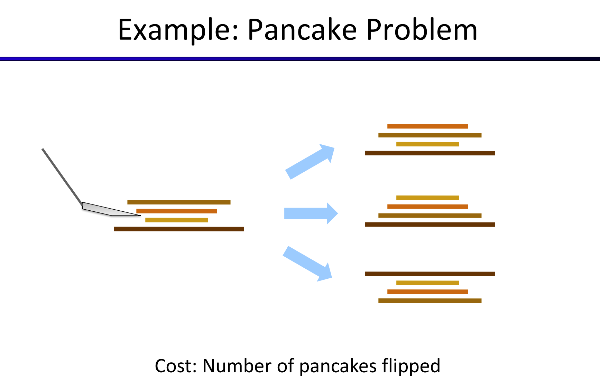
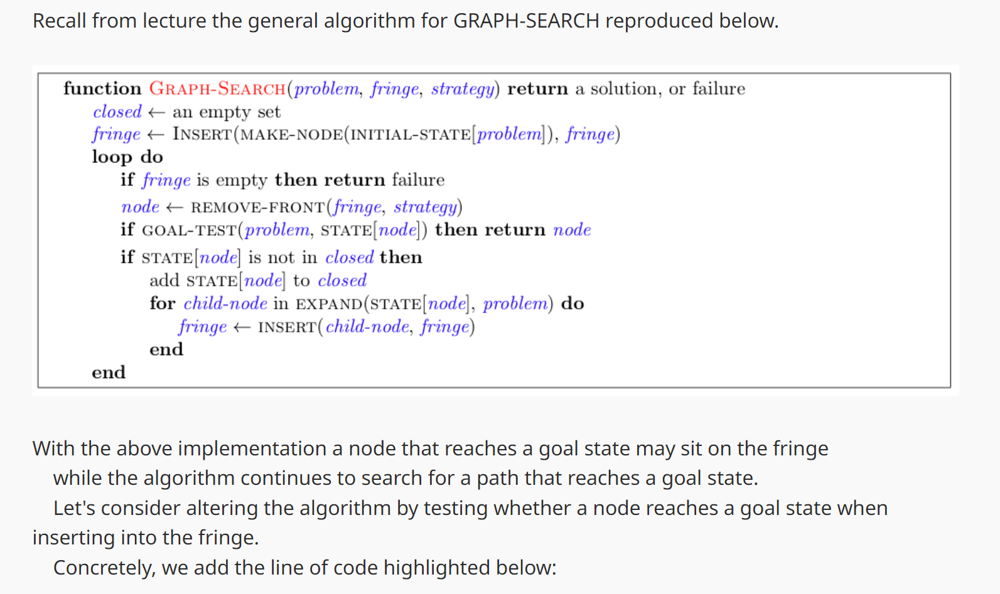
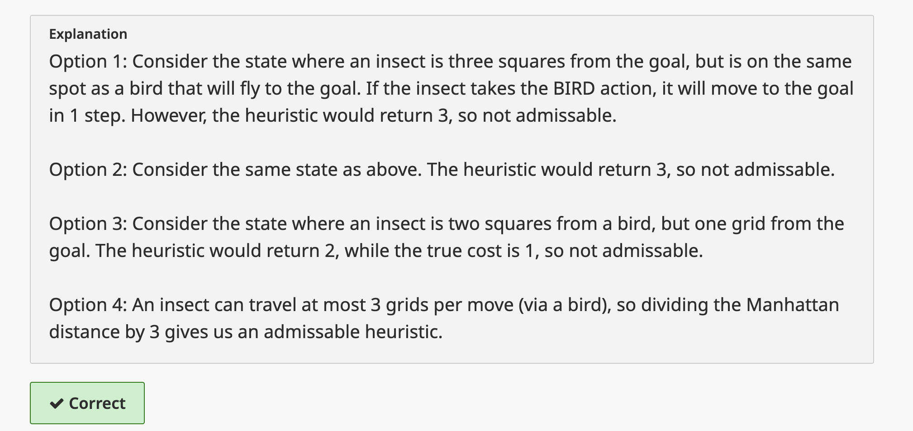

# Search Heuristics
> [!def]
> 

> [!example] Pancake Flipping
> 
> 
> We could come up with several heuristic functions:
> 1. **The number of correctly placed pancakes.** In other words, the number of pancakes that are fixed(not expected to move in th further searching until the goal state). **But usually we measure heuristics as cost(the closer to the goal, the lower output from the heuristic function)**, instead of measuring how many are ordered nicely. Thus we want something like at the goal state the heuristic is zero, instead of 4 in this case.
> 2. **The largest number of pancakes out of place(out of order).** In other words, how deep in the stack you have to to go to fix the wrong order. 
> 	
> 3. **Number of pancakes out of place**. But our cost is defined to be the number of pancake flipped each time, so such heuristic is not accurate enough but it's ok to use.

# Greedy Search
> [!def]
> 

> [!property]
> 

> [!example] Map Distance
> 
> This heuristic function maps a state to the distance between this state and the goal state.
> 
> 
> Here the greedy algorithm gives (Arad, Sibiu, Fagaras, Bucharest) with total cost of 450 instead of the global optimal path (Arad, Sibiu, Rimnicu Vilcea, Pltestl, Bucharest) with cost of 418(which will be given by UCS Search).
 

# A\* Search
## Definition
> [!def]
> 

> [!property] When to terminate
> 

> [!example] Sp18 Vitamin 1 Q4
> 

## Optimality - Admissibility&Consistency
> [!motiv] Optimality Depends on Heuristic
> 
> In this example, we choose the S -> G path instead of the optimal S->A->G path, the heuristic lies to us!
> 

### Priority Queue Ordering
> [!def]
> 

### Admissibility - Tree Search Optimality
> [!property] Admissibility
> 
> **Note 1:** Basically we want to prove that all the ancestor node of $A$ is expanded before $A$, and that if node $A$ is expanded, then we will never expand $A$ again through different path. So that $A$ is the optimal solution.
> 
> **Note 2:** Here optimal and suboptimal goal node is not to say that we are searching for multiple goals, it's just saying that we can reach the same goal state through different path(with different cost).
> 
> **Note 3:** Admissibility only guarantees the optimality of the A tree search. A graph search will ruin the optimality even with admissibility condition.

> [!proof] Proof Sketch - Like a Race
> 
> **B is on the fringe:** Suppose now B is on the fringe, we want to make sure that the algorithm won't pop $B$ out before exploring to the $A$. If I pop $B$ first and declare it to be the solution, that could be a wrong solution. I don't want to pick $B$ that early.
> 
> **Some ancestor n of A is on the fringe:** I would rather pick some ancestor n of $A$ before $B$.
> 
> 
> This shows that the priority of $n$ is always smaller than $A$ given admissibility, so $n$ will always come off before $A$. Now I know that $n$ comes before $A$, but what we want is to make sure all ancestor of $A$(denoted by $n$) comes before $B$ so that we will definitely visit $A$ before $B$.
> 
> 
> 
> Finally, combining 1 and 2 we get 3.

### Consistency - Graph Search Optimality
> [!bug] When admissibility fails in graph search
> 
Graph search is that it tends to ruin the optimality of A star, even under admissible heuristics.

The reason is that tree search will guarantee to visit the optimal state before any suboptimal states since there is literally no restriction on whether a node can be expanded or not. But this is not true for graph search where we may fail to expand the node that has been expanded before, even if that node results in a better solution.

> 
Consider the following simple state space graph and corresponding search tree, annotated with weights and heuristic values:

> 
> 
> In the above example, it’s clear that the optimal route is to follow S → A →C → G, yielding a total path cost of 1+1+3 = 5. The only other path to the goal, S → B →C → G has a path cost of 1+2+3 = 6. However, because the heuristic value of node A is so much larger than the heuristic value of node B, node C is first expanded along the second, suboptimal path as a child of node B. It’s then placed into the "reached" set, and so A* graph search fails to reexpand it when it visits it as a child of A, so it never finds the optimal solution.

> [!property] Consistency
> Hence, to maintain optimality under A* graph search, we need an even stronger property than admissibility, consistency. 
> 
> The central idea of consistency is that we enforce **not only that a heuristic underestimates the total distance** to a goal from any given node, **but also the cost/weight of each edge in the graph**.
> What this condition says is that:
> 
> 1. Along any path to any node $n$, the total cost along that path is non-decreasing.
> 2. Once we expand any node, the optimal path to that node has been found.
> 3. Consistency implies admissibility.
> 

> [!thm] Theorem - Triangle Inequality
> A heuristic $h(n)$ is consistent if, forevery node $n$ and every successor $n'$ of $n$ generated by any action a, the estimated cost of reaching the goal from $n$ is no greater than the step cost of getting to $n'$ plus the estimated cost of reaching the goal from $n'$ ? 
> 
> 

### Consistency => Admissibility
> [!important]
> Consistency is not just a stronger constraint than admissibility, consistency implies admissibility.
> 
> This stems simply from the fact that if no edge costs are overestimates (as guaranteed by consistency), the total estimated cost from any node to a goal will also fail to be an overestimate.
> 

> [!proof] Proof
> The proof of this implication is easy:
> For any node $n$, denote the heuristic of it to be $h(n)$, the estimated cost to the goal. Suppose $n'$ is the parent of $n$(if there is), then by consistency we have:
> $$h(n')-h(n)\leq cost(n',n)$$
> Then by rearranging terms we have:
> $$h(n')\leq h(n)+cost(n',n)$$
> Then we can use mathematical induction to show that if $h(n)$ is admissible, then $h(n')\leq h(n)+cost(n',n)\leq h^*(n)+cost(n',n)=h*(n')$.
> 
> By tracing the path backward we can show that admissibility holds for all nodes in the graph. 

## Applications
> [!example]
> 

# Variants of A\* Graph Search Methods
## Early Goal Checking Graph Search
> [!example] Sp18 Vitamin1 Q12
> **In summary:**
> 
> 1. This method checks the goal before we expand the node.
> 2. It doesn't break the completeness of the algorithm but breaks the optimality since the it stops at the goal before expanding the goal but the optimality is only guaranteed when we expand the node.
> 
> 

## Lookahead Graph Search
> [!example] Sp18 Vitamin1 Q13
> In summary, this algorithm expand the node when first seen during expansion of the parent node. This method also, doesn't break the completeness but break the optimality.
> 
>
> **Note:** In this algorithm, once the state is added to `fringe-closed-set`, we will never add it again to the `fringe`, thus it will only be expanded once.

## Memory Efficient Graph Search - Edition 3 Version
> [!example] Sp18 Vitamin1 Q14
> In summary:
> This method is generally adopted in the 3rd edition of Artificial intelligence. 
> 
> 

## A\*-CSCS Algorithm
> [!example] Sp18 Vitamin1 Q15
> 
> Note: Recall the reason why we need consistency for graph search on top of admissibility is that:
> 1. Admissibility requires that we actually have a chance to get to the optimal solution before suboptimal solution, tree search certainly have a chance, but graph search, due to the special data structure, prevent certain nodes from being revisited, which cancels potential optimal path to be returned.
> 2. Consistency ensures that once we expand a node, it is on the optimal solution path. So even if we cannot expand the same node multiple times, the optimality is guaranteed.
> 3. But in A\*-CSCS Algorithm, admissibility is enough, since even if a state have been added to the `closed set`, if later the same state is popped, as long as it has lower cost, it will be expanded again, this is similar to the tree search behavior. But tree search basically can revisit any node while the A\*-CSCS will only revisit those nodes that can potentially improve the path that we will find in the end.
> 
> 

# Proofs about Heuristic Functions
## Proving Admissibility
> [!example] Fa23 Exam Prep02 P1
> 

## Proving Consistency
> [!example] Fa23 Exam Prep02 P1
> 

# Heuristic Functions Design
## Effective Branching Factor

## Relaxed Problems
> [!example] 8-puzzle problem
> 
>  There is a long history of such heuristics for the 15-puzzle; here are two commonly used candidates:
>  
>  
>  **From (a)**, we can derive $h_2$ (Manhattan distance). The reasoning is that $h_2$ would be the proper score if we moved each tile in turn to its destination.
>  
>   **From (c)**, we can derive $h_1$ (misplaced tiles) because it would be the proper score if tiles could move to their intended destination in one step.

## Semi-Lattice of Heuristics
> [!motiv] Motivation
> 

## Trivial Heuristics, Dominance
> [!def]
> 
> **Dominance** very intuitively captures the idea of one heuristic being better than another - if one admissible/consistent heuristic is dominant over another, it must be better because it will always more closely estimate the distance to a goal from any given state. 
> 
> Additionally, the **trivial heuristic** is defined as $h(n) = 0$, and using it reduces A* search to UCS. 
> 
> All admissible heuristics dominate the trivial heuristic. The trivial heuristic is often incorporated at the base of a semi-lattice for a search problem, at the top right is a dominance hierarchy. **The best heuristic is located closed to the top while the trivial heuristic is always at the bottom.**
> 
> As a general rule, the max function applied to multiple admissible heuristics will also always be admissible. The top heuristic is the exact cost to the goal.

# Design Examples
## Maze and Bugs - Sp18 Vitamin 1
> [!overview]
> 

> [!example] Sp18 Vitamin 1 Q6 Lonely Bug
> 

> [!example] Sp18 Vitamin 1 Q7 Swarm Movements
> 
> **Note that the choice of heuristics are a bit tricky in this example and we analyze each option one by one:**
> 1. **Option 1 is false** and we should always pay extra attention to keyword `sum` since it may trigger problem for multi-object search problem. Here if each insect is only one step right to its target. Then since we can move all the insects simultaneously in one step, the true cost $h^*(n)=1$ but our heuristic $h(n)=1\cdot K=K$, which violates the admissibility condition $\forall n,0\leq h(n)\leq h^*(n)$.
> 2. **Option 2** is false and the reasoning is the same as option 1. In other words, we just need to find a corner case to show it is wrong.
> 3. **Option 3 is true.** The joint true cost to the joint goal could never be less than the cost of the furthest insect to its goal alone(if not obstructed by other insects). The joint true cost could only be bigger when that furthest insect is obstructed since we have to adjust the position of other insects in some cases in order to make the furthest one move.
> 4. **Option 4 is true.** The same reasoning as above.
> 5. **Option 5 is false.** Consider the scenario in case 1 where the heuristic gives K and the true cost is 1.

> [!example] Sp18 Vitamin 1 Q8 Migrating Birds
> 

> [!example] Sp18 Vitamin 1 Q9 Jumping Bugs
> 

> [!example] Sp18 Vitamin 1 Q10 Lost at Night
> 
> **Note 1:** Since we don't know the exact location of the insect, so we cannot rely on the 2d position of the insect to construct goal test and compute the successor. 
> 
> **Note 2:** The reason why we want to iterate through all the grid is that we don't actually know the current position of the insect. So we have to make assumptions about its position. If it is currently at (0,0) or it is currently at (0,1), ..., so for each grid (x,y) we have to assume that the insect is at (x+1, y) previously (because the insect is equally likely to be in any grid at a particular time step), which gives `bool_new[x][y]=bool[x+1][y]`. Moreover, since the insect would stay at the same position if WEST action leads to a wall. In this case, we have to consider if the insect is in the position (x,y) and head into a wall so that `bool_new[x][y]=bool[x][y] and is_wall(x-1,y)`. Connecting these two scenarios we get the final boolean expression.
> 
> 
> **Note:** 
> 1. For the first option: Since we don't know where the bug currently is. So the position is totally random. But no matter where it is, the true cost will never be less than the number of grids(i.e. the number of position that the bug could be).
> 2. For the second option: Because we want to find a planning that guarantees to find a path from start to goal no matter where the bug is initially. So the true cost should at least take into consideration the furtherest location from the goal, which is the maximum manhattan distance. Since the bug may hit the wall, true cost can only increase. So the heuristic is admissible.
> 3. For the third option, the reason is the same as the second one.

## Search and Heuristic - Fa23 Disc02 P1
> [!example] 
> 
> 
> 
> To justify (a), since we are only allowed to turn when our velocity is zero, and each turn action takes one timestep. And the true cost can only be more than that, since we need to accelerate from zero velocity and actually move to the goal.
> 
> 

## Pacmans and Ghosts - Fa23 Disc02 P2
> [!example]
> 
> Note that here we don't need a variable for direction since it doesn't affect our ability to find successors of the current state.
> 
> 
> **(ii),(iii)** can be shown inadmissible by giving the following examples:
> , for example we could have:
> 
> 
> We can easily find the assumption if we consider the next state to be on top of the current state.
> 
> **(iv)** could be proved by first proving consistency, then using consistency -> admissibility we have the `both` conclusion.
> 
> Consistency can be shown in the following way:
> 
> Denote arbitrary state $A$ and $C$, we have $cost(A,C)$ should at least be the number of ghosts eliminated along the way, since for each timestep, there can only be at most one ghosts eliminated. Thus we will always have $h(A) - h(C)\leq cost(A,C)$, which is the criterion for consistency.
> 

