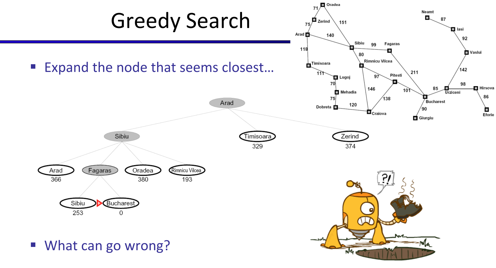
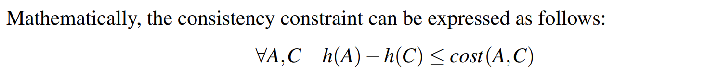

# Search Heuristics
> [!def]
> 

> [!example] Pancake Flipping
> 
> 
> We could come up with several heuristic functions:
> 1. **The number of correctly placed pancakes.** In other words, the number of pancakes that are fixed(not expected to move in th further searching until the goal state). **But usually we measure heuristics as cost(the closer to the goal, the lower output from the heuristic function)**, instead of measuring how many are ordered nicely. Thus we want something like at the goal state the heuristic is zero, instead of 4 in this case.
> 2. **The largest number of pancakes out of place(out of order).** In other words, how deep in the stack you have to to go to fix the wrong order. 
> 	
> 3. **Number of pancakes out of place**. But our cost is defined to be the number of pancake flipped each time, so such heuristic is not accurate enough but it's ok to use.

# Greedy Search
> [!def]
> 

> [!property]
> 

> [!example] Map Distance
> 
> This heuristic function maps a state to the distance between this state and the goal state.
> 
> 
> Here the greedy algorithm gives (Arad, Sibiu, Fagaras, Bucharest) with total cost of 450 instead of the global optimal path (Arad, Sibiu, Rimnicu Vilcea, Pltestl, Bucharest) with cost of 418(which will be given by UCS Search).
 

# A\* Search
## Definition
> [!def]
> 

> [!property] When to terminate
> 

> [!example] Sp18 Vitamin 1 Q4
> 

## Optimality - Admissibility&Consistency
> [!motiv] Optimality Depends on Heuristic
> 
> In this example, we choose the S -> G path instead of the optimal S->A->G path, the heuristic lies to us!
> 

### Priority Queue Ordering
> [!def]
> 

### Admissibility - Tree Search Optimality
> [!property] Admissibility
> 
> **Note 1:** Basically we want to prove that all the ancestor node of $A$ is expanded before $A$, and that if node $A$ is expanded, then we will never expand $A$ again through different path. So that $A$ is the optimal solution.
> 
> **Note 2:** Here optimal and suboptimal goal node is not to say that we are searching for multiple goals, it's just saying that we can reach the same goal state through different path(with different cost).
> 
> **Note 3:** Admissibility only guarantees the optimality of the A tree search. A graph search will ruin the optimality even with admissibility condition.

> [!proof] Proof Sketch - Like a Race
> 
> **B is on the fringe:** Suppose now B is on the fringe, we want to make sure that the algorithm won't pop $B$ out before exploring to the $A$. If I pop $B$ first and declare it to be the solution, that could be a wrong solution. I don't want to pick $B$ that early.
> 
> **Some ancestor n of A is on the fringe:** I would rather pick some ancestor n of $A$ before $B$.
> 
> 
> This shows that the priority of $n$ is always smaller than $A$ given admissibility, so $n$ will always come off before $A$. Now I know that $n$ comes before $A$, but what we want is to make sure all ancestor of $A$(denoted by $n$) comes before $B$ so that we will definitely visit $A$ before $B$.
> 
> 
> 
> Finally, combining 1 and 2 we get 3.

### Consistency - Graph Search Optimality
> [!bug] When admissibility fails in graph search
> 
Graph search is that it tends to ruin the optimality of A star, even under admissible heuristics.
 
Consider the following simple state space graph and corresponding search tree, annotated with weights and heuristic values:

> 
> 
> In the above example, it’s clear that the optimal route is to follow S → A →C → G, yielding a total path cost of 1+1+3 = 5. The only other path to the goal, S → B →C → G has a path cost of 1+2+3 = 6. However, because the heuristic value of node A is so much larger than the heuristic value of node B, node C is first expanded along the second, suboptimal path as a child of node B. It’s then placed into the "reached" set, and so A* graph search fails to reexpand it when it visits it as a child of A, so it never finds the optimal solution.

> [!property] Consistency
> Hence, to maintain optimality under A* graph search, we need an even stronger property than admissibility, consistency. 
> 
> The central idea of consistency is that we enforce not only that a heuristic underestimates the total distance to a goal from any given node, but also the cost/weight of each edge in the graph.
> 

> [!thm] Theorem - Triangle Inequality
> A heuristic $h(n)$ is consistent if, forevery node $n$ and every successor $n'$ of $n$ generated by any action a, the estimated cost of reaching the goal from $n$ is no greater than the step cost of getting to $n'$ plus the estimated cost of reaching the goal from $n'$ ? 
> 
> 

### Consistency => Admissibility
> [!important]
> Consistency is not just a stronger constraint than admissibility, consistency implies admissibility.
> 
> This stems simply from the fact that if no edge costs are overestimates (as guaranteed by consistency), the total estimated cost from any node to a goal will also fail to be an overestimate.
> 

## Applications
> [!example]
> 

# Heuristic Functions Design
## Effective Branching Factor

## Relaxed Problems
> [!example] 8-puzzle problem
> 
>  There is a long history of such heuristics for the 15-puzzle; here are two commonly used candidates:
>  
>  
>  **From (a)**, we can derive $h_2$ (Manhattan distance). The reasoning is that $h_2$ would be the proper score if we moved each tile in turn to its destination.
>  
>   **From (c)**, we can derive $h_1$ (misplaced tiles) because it would be the proper score if tiles could move to their intended destination in one step.

## Semi-Lattice of Heuristics
> [!motiv] Motivation
> 

## Trivial Heuristics, Dominance
> [!def]
> 
> **Dominance** very intuitively captures the idea of one heuristic being better than another - if one admissible/consistent heuristic is dominant over another, it must be better because it will always more closely estimate the distance to a goal from any given state. 
> 
> Additionally, the **trivial heuristic** is defined as $h(n) = 0$, and using it reduces A* search to UCS. 
> 
> All admissible heuristics dominate the trivial heuristic. The trivial heuristic is often incorporated at the base of a semi-lattice for a search problem, at the top right is a dominance hierarchy. **The best heuristic is located closed to the top while the trivial heuristic is always at the bottom.**
> 
> As a general rule, the max function applied to multiple admissible heuristics will also always be admissible. The top heuristic is the exact cost to the goal.

# A\*-CSCS Algorithm
