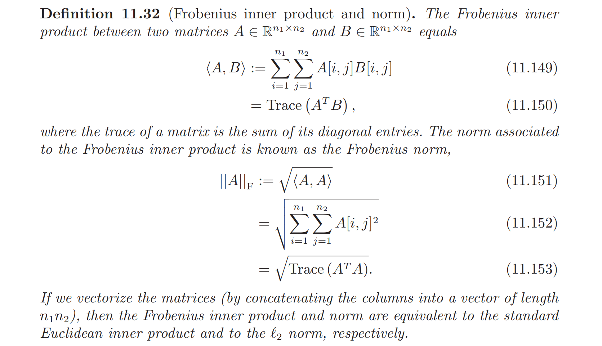
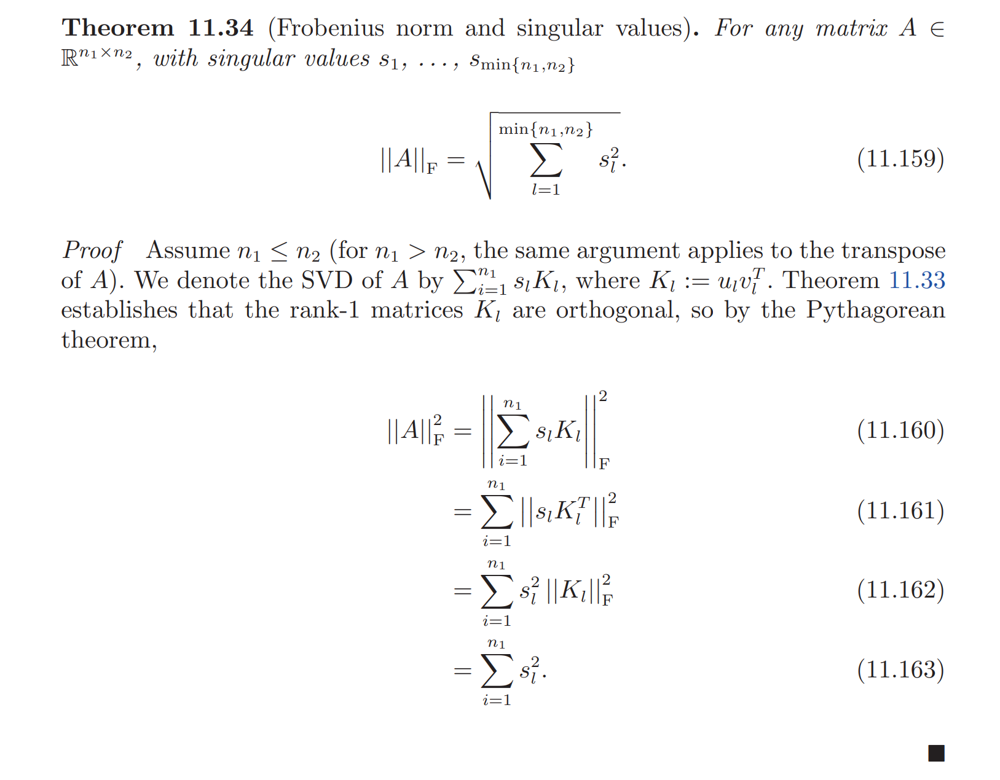
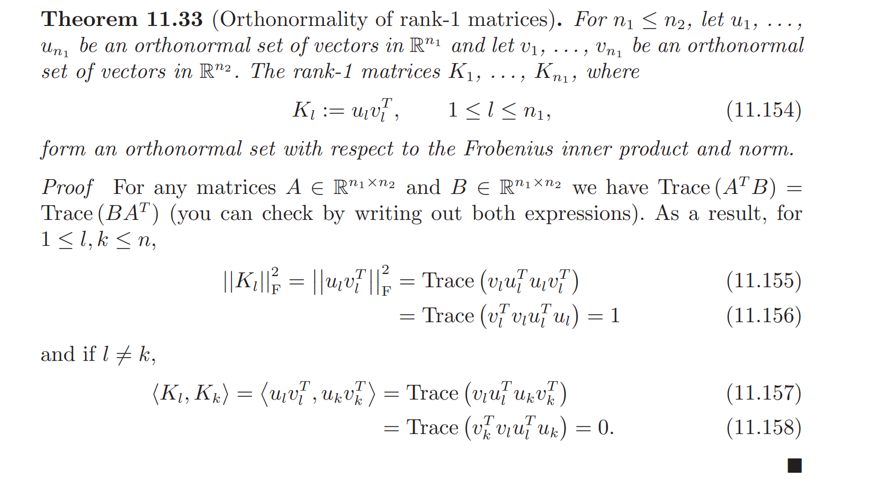
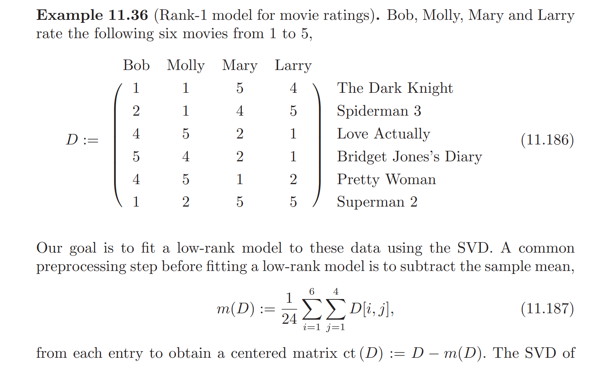
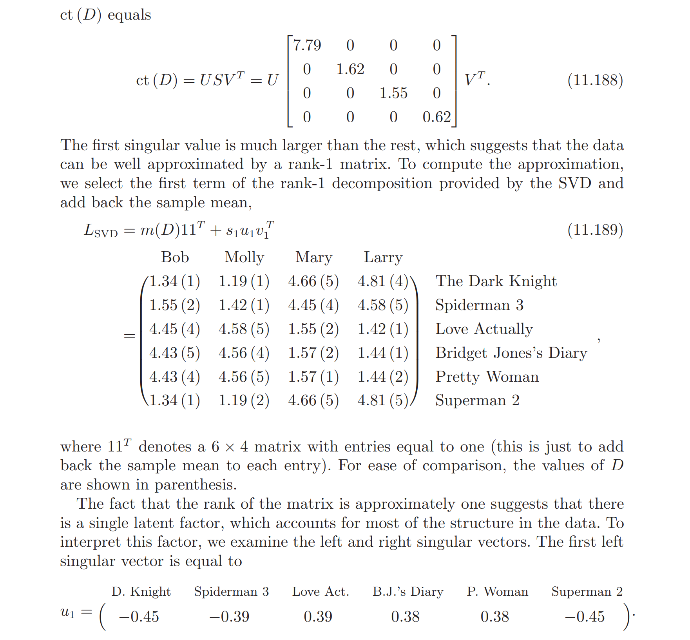
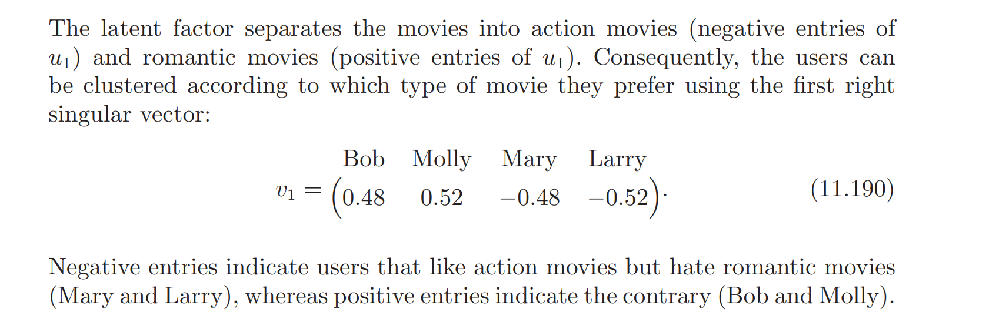
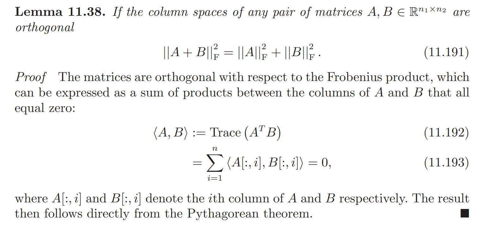
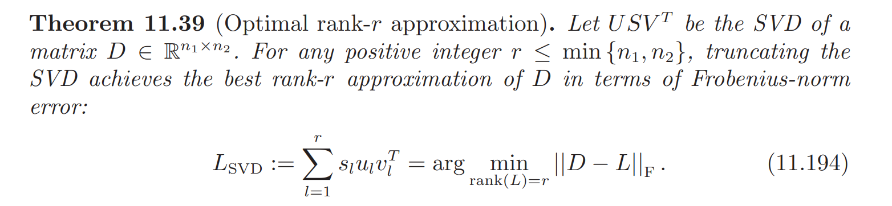

# Frobenius Inner Product
> [!def]
> 

# Frobenius Norm and Singular Values
> [!important]
> 

# Rank-1 Matrices
## Orthogonality
> [!important]
> 

## Rank-1 Model for Movie Rating
> [!example]
> 

# Optimal Low-Rank Matrix Estimation
## Frobenius Lemma
> [!lemma]
> 

## Eckart-Young Theorem
> [!thm] Eckurt-Young
> 
> Proof details see [Eckart-Young-Mirsky Theorem](PCA_Low-rank_Approximation.md#Eckart-Young-Mirsky%20Theorem)

# Matrix Completion
## Problem Statement
> [!def]

