# Reviews
## Limit&Continuity
> 对于一个`Vector Valued Function`$\vec{f}: \mathbb{R}^n \to \mathbb{R}^m$来说，如果:$\lim_{\vec{x}\to \vec{a}}\vec{f}(\vec{x})=L$, 则$L$是$\vec{f}$的`Limit`
> 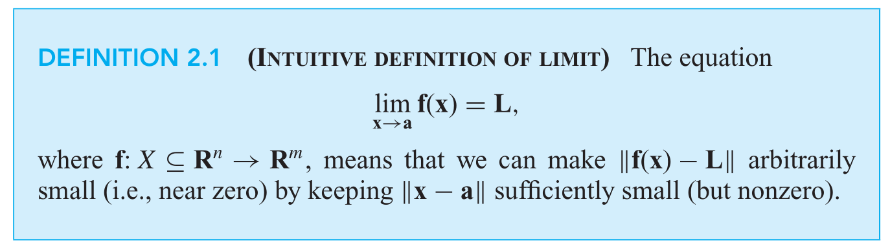

## Derivative&Differentiability
> 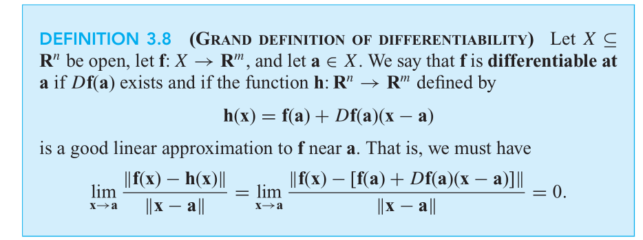
> **注意如果我们要证明**$\vec{f}$**在**$\vec{a}$**处可微，则我们需要:**
> 1. 证明$D\vec{f}(\vec{a})$存在
> 2. 证明上述极限等式成立。
> 
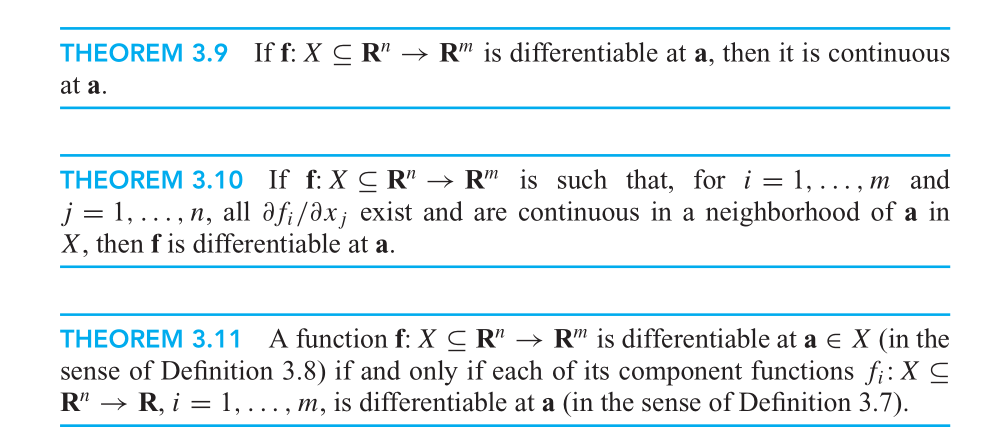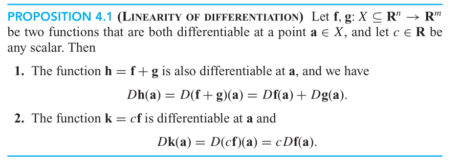

**Proof 4.1**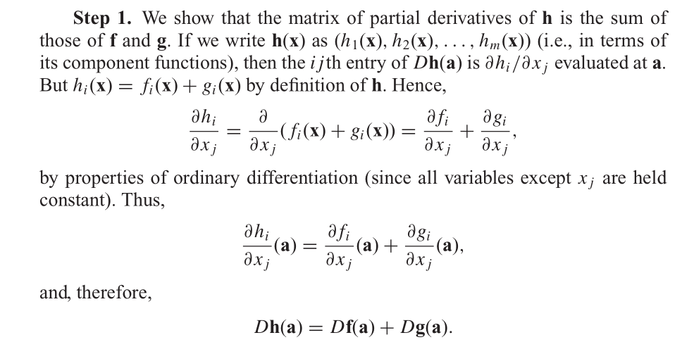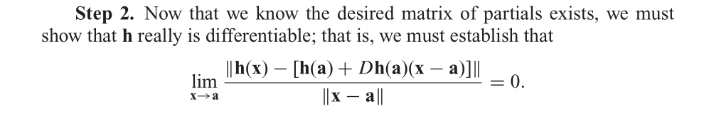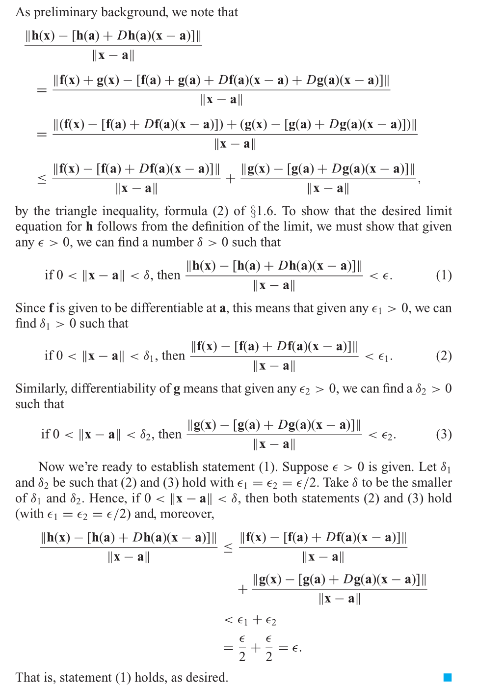

## Chain Rule
> 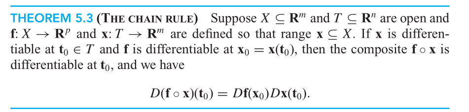

**Proof**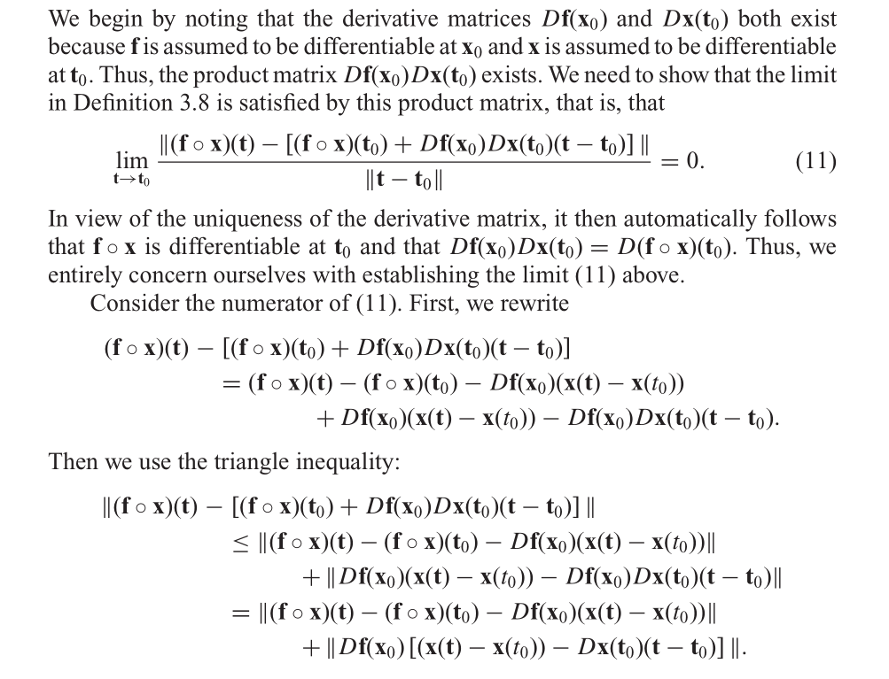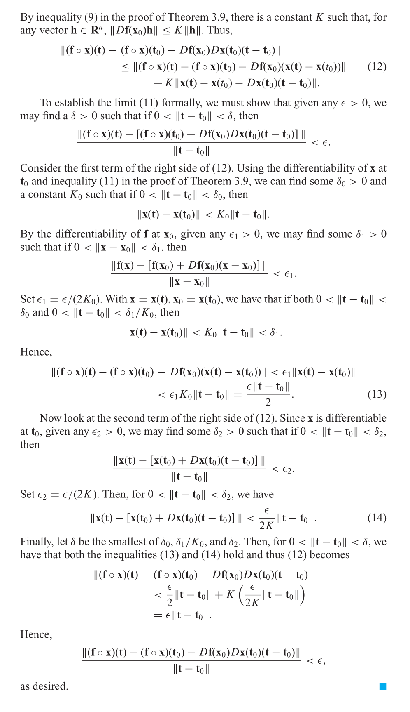

# Vector Derivatives
## Directional Derivative
> [!def]
> 假设有一个函数$f:\mathbb{R}^n\to\mathbb{R}$, 则:
> 其在$\vec{v}$方向上的方向导数定义为$\lim_{t\to 0}\frac{f(\vec{x}+t\vec{v})-f(\vec{x})}{t}$，我们要证明它等于$\nabla f(\vec{x})^{\top}\vec{v}$
> 我们使用函数的角度证明这个等式。我们可以定义这样一个函数$g:\mathbb{R}\to \mathbb{R}$and $dom(g)=\{t\in\mathbb{R}|\vec{x}+t\vec{v}\in dom(f)\}$,and$g(t)=f(\vec{x}+t\vec{v})$，则$\lim_{t\to 0}\frac{f(\vec{x}+t\vec{v})-f(\vec{x})}{t}=\lim_{t\to 0}\frac{g(t)-g(0)}{t-0}=g'(0)$。而我们知道$g'(t)$是一个`Scalar`, 所以`By chain rule`:$g'(t)=D f(\vec{u})D\vec{u}(t)=\begin{bmatrix} \frac{\partial f}{\partial u_1} &  \frac{\partial f}{\partial u_2}&\cdots& \frac{\partial f}{\partial u_n}\end{bmatrix}\begin{bmatrix} \frac{\partial u_1}{\partial t} \\ \frac{\partial u_2}{\partial t}\\\vdots\\ \frac{\partial u_n}{\partial t}\end{bmatrix}=\nabla f(\vec{x}+t\vec{v})^{\top}\vec{v}$。如果我们令$t=0$, 则$g'(0)=\nabla f(\vec{x})^{\top}\vec{v}$。

## Vector Derivatives - 分子布局
> [!def]
> 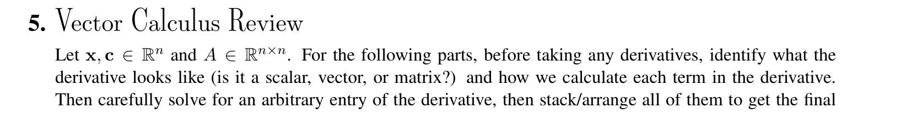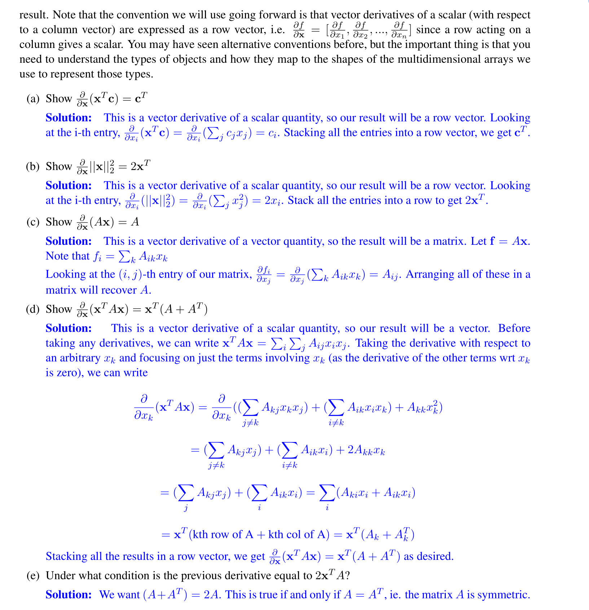

[Vector_Matrix_Differentiation.pdf](https://www.yuque.com/attachments/yuque/0/2023/pdf/12393765/1694016786593-f0c7df8a-f356-4c4e-b552-371107cc5378.pdf)
# Gradients and Hessians
## Definition
> [!def]
> 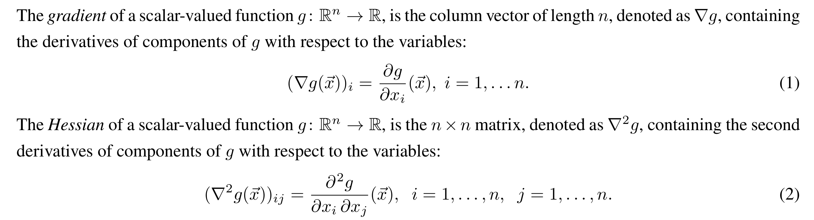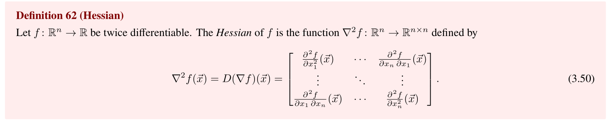

## Quadratic Form Explanations
> [!important]
> 对于$f(\vec{x})=\vec{x}^{\top}A\vec{x}$来说，我们有:
> $f(\vec{x})=\sum_{i}\sum_{j}x_iA_{ij}x_j$
> $\nabla f(\vec{x})=\begin{bmatrix} \frac{\partial f}{\partial x_1}\\\vdots\\\frac{\partial f}{\partial x_n}\end{bmatrix}$，$\frac{\partial f}{\partial x_i}$的求法思路如下:
> 所有含有$x_i$(也包括$x_i^2$)的项是$\sum_j x_iA_{ij}x_j$, $\sum_j x_jA_{ji}x_i$
> 原因是我们可以将$f(\vec{x})$看成三种表达形式:
> 1. $\begin{bmatrix}x_1 &x_2&\cdots&x_n\end{bmatrix}\begin{bmatrix}A_{11}&A_{12}&\cdots&A_{1n}\\A_{21}&A_{22}&\cdots&A_{2n}\\\vdots&\ddots&&\vdots\\\vdots&&\ddots&\vdots\\A_{n1}&\cdots&\cdots&A_{nn}\end{bmatrix}\begin{bmatrix}x_1 \\x_2\\\vdots\\x_n\end{bmatrix}$, 这种形式不太方便于求导运算。
> 2. $\begin{bmatrix}x_1 &x_2&\cdots&x_n\end{bmatrix}\begin{bmatrix}-\vec{a}_1-\\-\vec{a}_2-\\\vdots\\-\vec{a}_n-\end{bmatrix}\vec{x} =\begin{bmatrix}x_1 &x_2&\cdots&x_n\end{bmatrix}\begin{bmatrix}\vec{a}_1^{\top}\vec{x} \\\vec{a}_2^{\top}\vec{x} \\\vdots\\\vec{a}_n^{\top}\vec{x} \end{bmatrix}$, 含有$x_i$的项就是$x_i\cdot (\vec{a}_i^{\top}\vec{x})=\sum_{j}x_iA_{ij}x_j$
> 3. $\vec{x}^{\top}\begin{bmatrix}\vec{a}_1&\vec{a}_2&\cdots\vec{a}_n\end{bmatrix} \begin{bmatrix}x_1 \\x_2\\\vdots\\x_n\end{bmatrix}=\begin{bmatrix}\vec{x}^{\top}\vec{a}_1 &\vec{x}^{\top}\vec{a}_2 &\cdots&\vec{x}^{\top}\vec{a}_n \end{bmatrix}\begin{bmatrix}x_1 \\x_2\\\vdots\\x_n\end{bmatrix}$, 含有$x_i$的项就是$x_i\cdot (\vec{a}_i^{\top}\vec{x})=\sum_{i}x_jA_{ji}x_i$
> 
于是:
> $\begin{aligned}\frac{\partial f}{\partial x_i}&=\sum_{j\neq i}A_{ij}x_j+\sum_{j\neq i}A_{ji}x_i+2x_iA_{ii}\\&=\sum_{j}(A_{ij}+A_{ji})x_j\\&=\sum_jA_{ij}x_j+\sum_{j}A_{ji}x_j\end{aligned}$
> 也就是$A$的第$i$行(用$A_{:,i}$表示)和$A^{\top}$的第$i$行(用$(A_{}^{\top})_{:,i}$表示)和$\vec{x}$的乘积
> 所以:
> $$\nabla f(\vec{x})=\frac{\partial f}{\partial \vec{x}}=(A+A^{\\top})\vec{x}$,$\nabla^2f(\vec{x})=A+A^{\top}$$

## Gradients and Hessian Examples
### Inner Product Examples
> 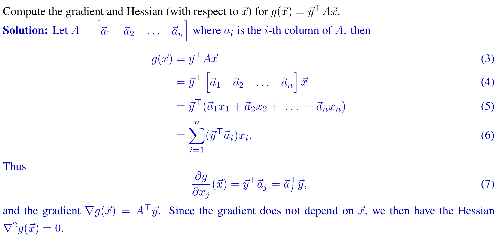
> 其实本题可以令$g(\vec{x})=\vec{y}^{\top}A\vec{x}=\vec{c}^{\top}\vec{x}$, 则$\nabla g(\vec{x})=\vec{c}=A^{\top}\vec{y}$, $\nabla^2 g(\vec{x})=0$

### Log-Function Examples
> [!info]
> 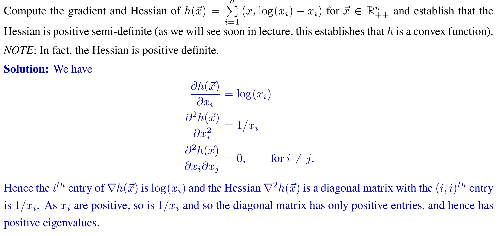

### Exponential Function Examples
> [!success]
> 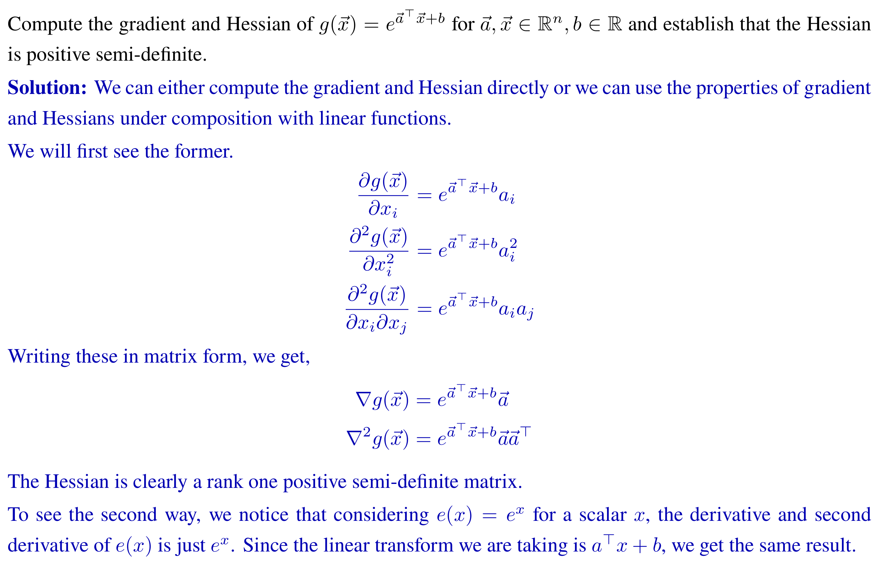

## Gradient of Least Square
:::success
对于$g(\vec{w})=\|X\vec{w}-\vec{y}\|_2^2$来说，我们有:
$\begin{aligned}\nabla g(\vec{w})&=\nabla(X\vec{w}-\vec{y})^{\top}(X\vec{w}-\vec{y})\\&=\nabla(\vec{w}^{\top}X^{\top}X\vec{w}-2\vec{y}^{\top}X\vec{w}+\vec{y}^{\top}\vec{y})\\&=2X^{\top}X\vec{w}-2X^{\top}\vec{y}\\&=2X^{\top}(X\vec{w}-\vec{y})\end{aligned}$
:::

## Gradient of Cross-Entropy Loss
### Gradient of Logistic Function
:::success
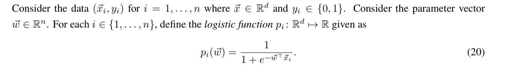
:::
**Solution**

### Gradient of Cross Entropy Loss
#### Single Data Point
:::success
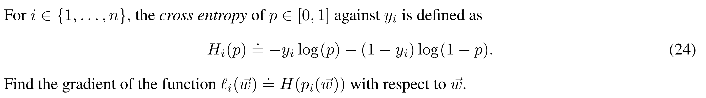
:::
**Solution 1 - Formal Solution**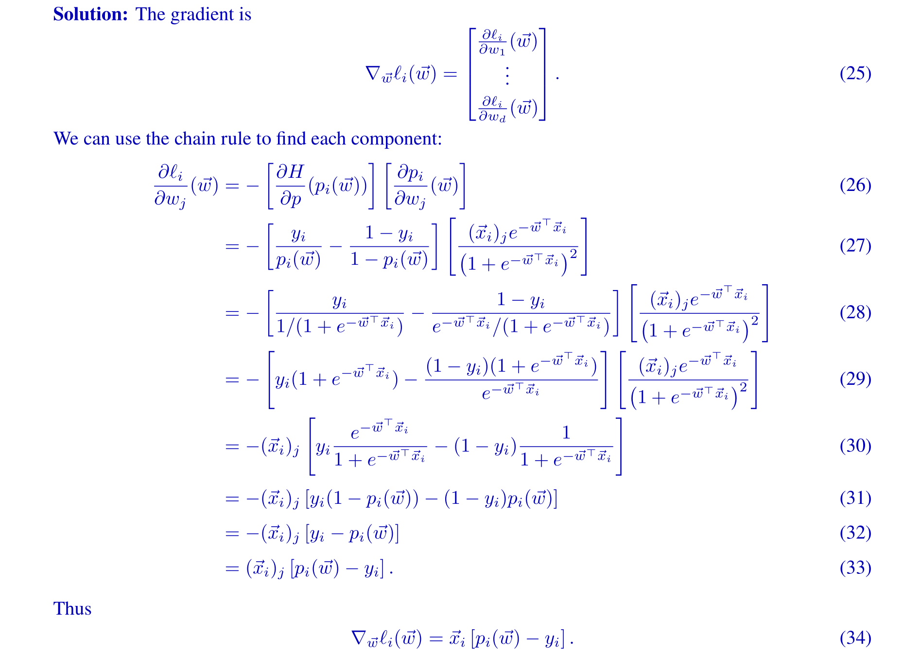
**Solution 2 - Using Previous Results**$\begin{aligned}\frac{\partial l_i(\vec{w})}{\partial \vec{w}}&=-\frac{y_i}{p_i(\vec{w})}\cdot\nabla p_i(\vec{w})-\frac{1-y_i}{1-p_i(\vec{w})}(-\nabla p_i(\vec{w}))\\&=\nabla p_i(\vec{w})(\frac{1-y_i}{1-p_i(\vec{w})}-\frac{y_i}{p_i(\vec{w})})\\&=\vec{x}_i\cdot \frac{e^{-\vec{w}^{\top}\vec{x}_i}}{1+e^{-\vec{w}^{\top}\vec{x}_i}}\cdot \frac{p_i(\vec{w}-y_i)}{p_i(\vec{w})(1-p_i(\vec{w}))}\\&=\vec{x}_i\cdot p_i(\vec{w})(1-p_i(\vec{w})\cdot \frac{p_i(\vec{w}-y_i)}{p_i(\vec{w})(1-p_i(\vec{w}))}\\&=\vec{x}_i[p_i(\vec{w})-y_i]\end{aligned}$

#### Entire Data Set
> [!success]
> 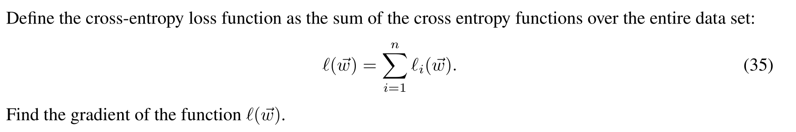
> **Solution**
> 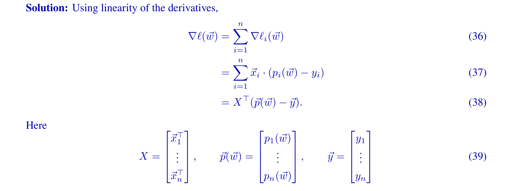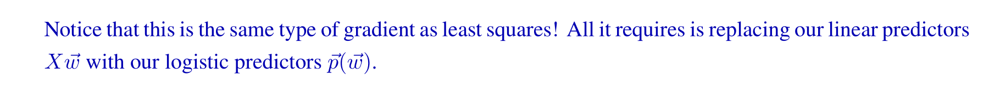

# Gradients w.r.t Matrices
> [!def]
> 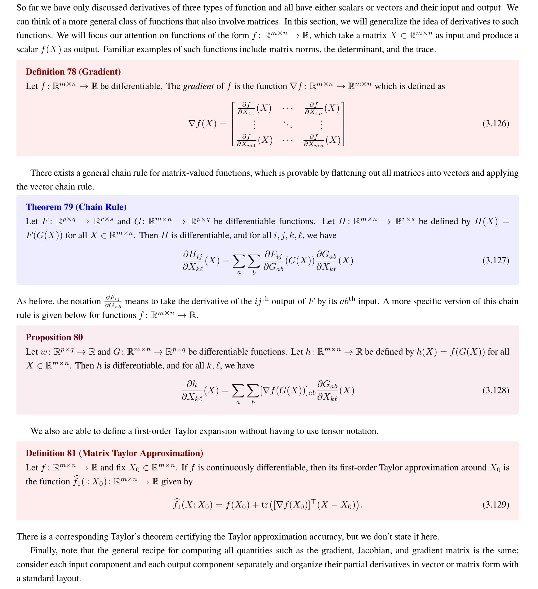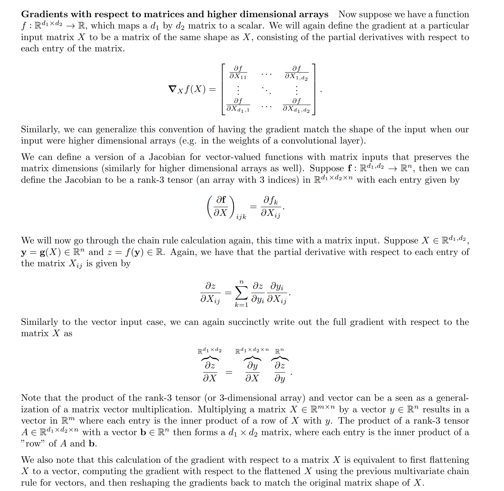

> [!example]
> 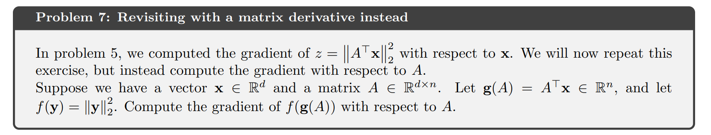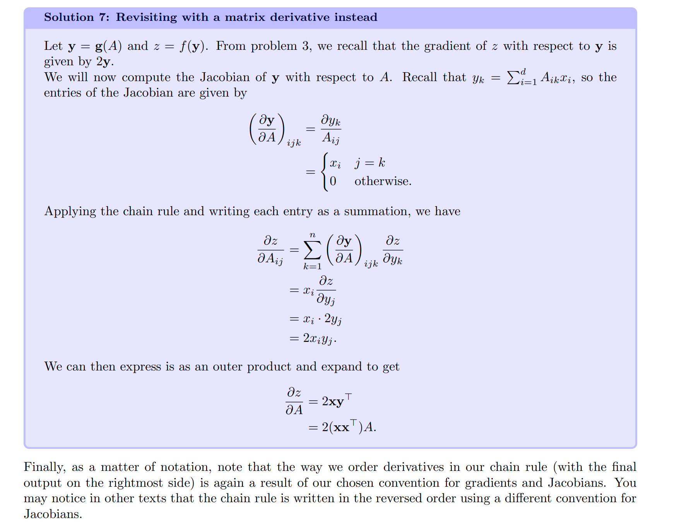

  

# Jacobians 
## Basic Rules of Jacobian
> [!important]
> 
> 1. Linearity: $D((f+g))=Df+Dg$
> 2. Homogeneity: $D(\alpha f)=\alpha Df$
> 3. Product Rule: $D(fg)=Df\cdot g+f\cdot Dg$, 其中$Df$和$D(fg)$的形状要保持一致。
> 
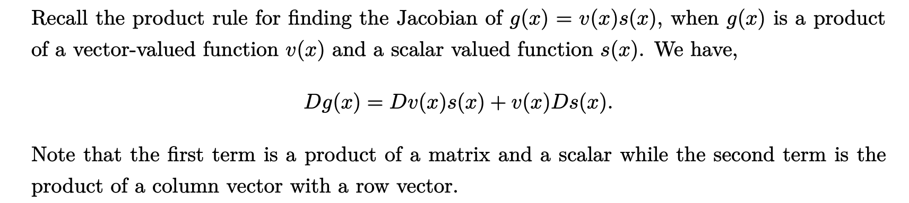
> 4. Chain Rule: $D(f\circ g)=D(f(g))\cdot D(g)$

## Chain Rule for Vector Functions
> [!important]
> 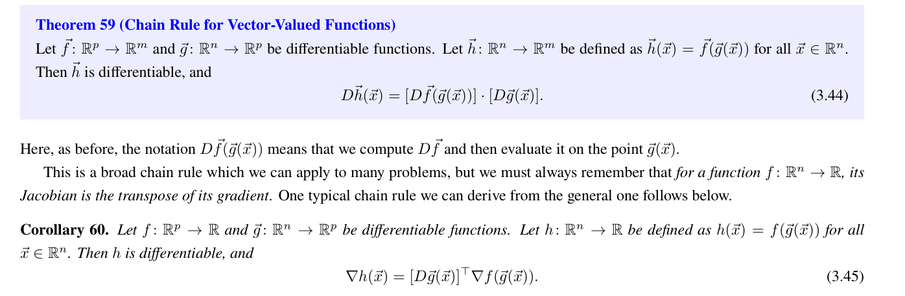

> [!example]
> 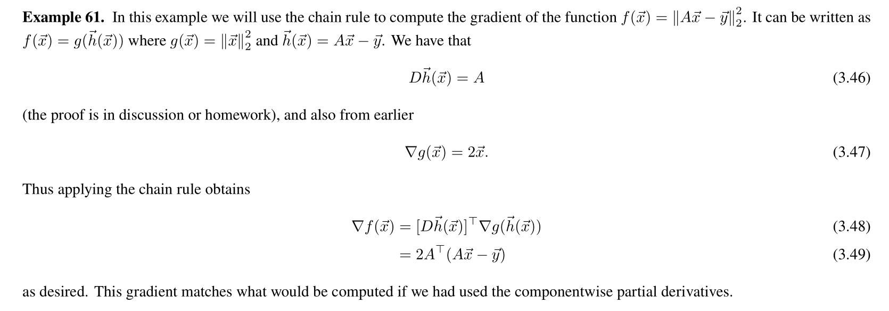

> [!example]
> 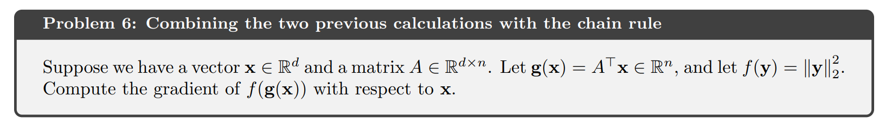
> We use the chain rule, first calculate the $Df(\vec{y})$ then $Dg(\vec{x})$.
> $$Df(\vec{y})=2\vec{y}^{\top}=2(A\vec{x})^{\top}$$
> Then 
> $$Dg(\vec{x})=A^{\top}$$
> So $Df(g(\vec{x}))=2(A^{\top}\vec{x})^{\top}A^{\top}$
> 
> The gradient is just the transpose of it, which is $2AA^{\top}\vec{x}$

## Jacobian of vector-valued functions
> [!def]
> 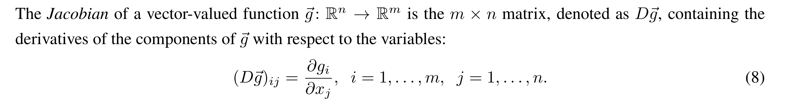

> [!example]
> 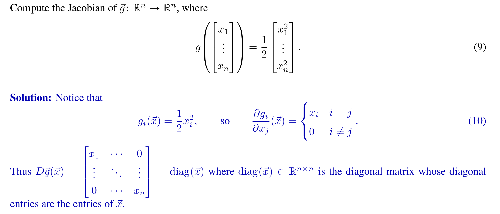

## Jacobian of Matrix Exponential
> [!example]
> 
> 计算$D\vec{f}(\vec{x})$时，除了按照定义将矩阵$D\vec{f}(\vec{x})$的$D\vec{f}(\vec{x})_{ij}$逐个算出以外，我们还可以直接按照列的方向来计算，即$D \vec{f}(\vec{x})=\left[\begin{array}{lll}\frac{\partial \vec{f}}{\partial x_1}(\vec{x}) & \cdots & \frac{\partial \vec{f}}{\partial x_n}(\vec{x})\end{array}\right]$。
> 
> **Solution**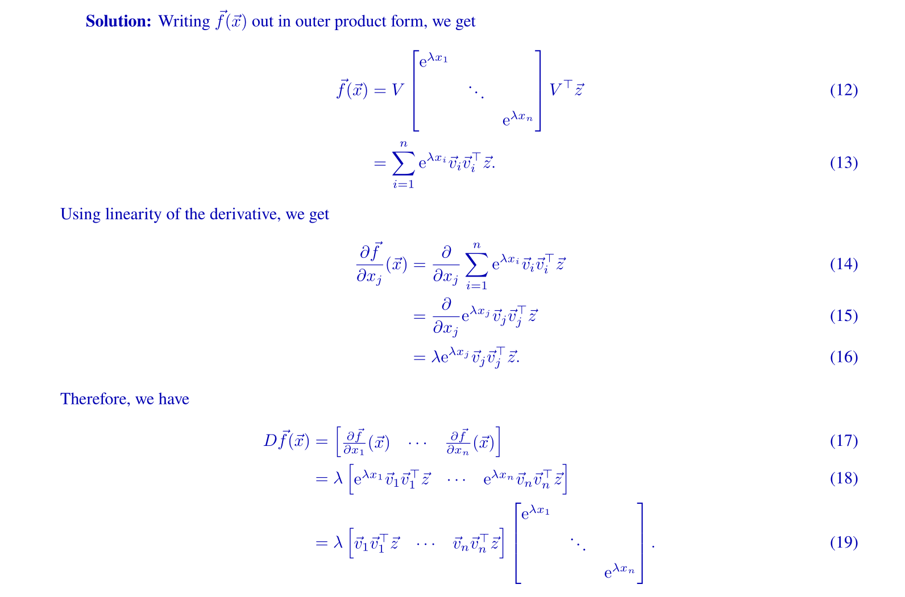

## Jacobian of Linear Maps⭐⭐⭐⭐⭐
> [!important]
> 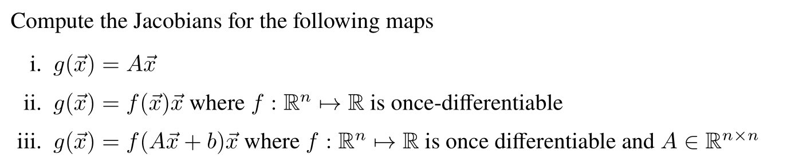
> 一般我们采用的思路就是先分别对$g(\vec{x})$的每一行$g_i(\vec{x})$求$Dg_i(\vec{x})$。
> 
> **Solution i**$g_i(\vec{x})=\vec{a}_i^{\top}\vec{x}$(其中$\vec{a}_i$是$A$的第$i$行)，所以$Dg_i(\vec{x})=\vec{a}_i$, 所以$Dg(\vec{x})=\begin{bmatrix} -\vec{a}_1-\\-\vec{a}_2-\\\vdots\\-\vec{a}_n-\end{bmatrix}=A$
> 
> **Solution ii**$g_i(\vec{x})=f(\vec{x})\cdot x_i$, 于是$Dg_i(\vec{x})=Df(\vec{x})\cdot x_i+f(\vec{x})=\nabla f(\vec{x})^{\top}\cdot x_i+f(\vec{x})$
> 
> 所以$Dg(\vec{x})=\begin{bmatrix} \nabla f(\vec{x})^{\top}\cdot x_1+f(\vec{x})\\\nabla f(\vec{x})^{\top}\cdot x_2+f(\vec{x})\\\vdots\\\nabla f(\vec{x})^{\top}\cdot x_n+f(\vec{x})\end{bmatrix}=\begin{bmatrix} \nabla f(\vec{x})^{\top}\cdot x_1\\\nabla f(\vec{x})^{\top}\cdot x_2\\\vdots\\\nabla f(\vec{x})^{\top}\cdot x_n\end{bmatrix} +\begin{bmatrix}f(\vec{x})\\f(\vec{x})\\\vdots\\f(\vec{x})\end{bmatrix}$
> 
> 即$Dg(\vec{x})=\vec{x}\nabla f(\vec{x})^{\top}+f(\vec{x})I$
> 
> **Solution iii**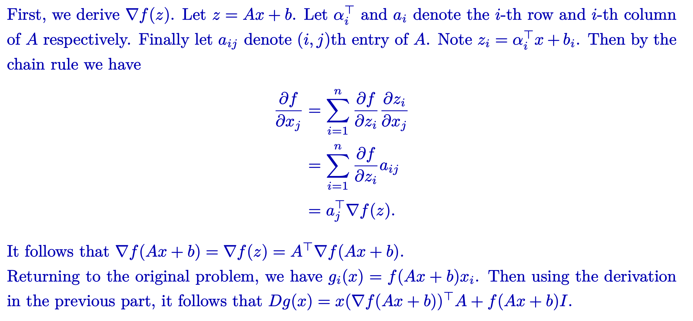
> 
> **我们也可以使用**`**Product Rule**`**:**$\begin{aligned}D(f(A\vec{x}+\vec{b})\vec{x})&=\vec{x}Df(A\vec{x}+\vec{b})+D\vec{x}f(A\vec{x}+\vec{b})\\&=\vec{x}\nabla f(A\vec{x}+\vec{b})^{\top}D(A\vec{x}+\vec{b})+If(A\vec{x}+\vec{b})\\&=\vec{x}\nabla f(A\vec{x}+\vec{b})^{\top}A+If(A\vec{x}+\vec{b})\end{aligned}$

## Concrete Example
> [!example]
> 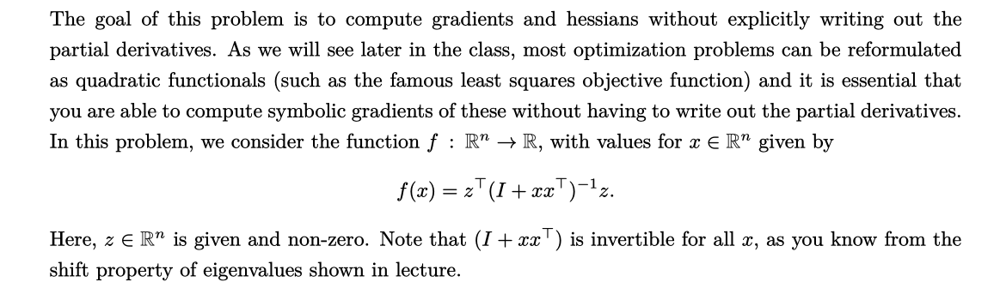
> 
> **P1: Rearranging**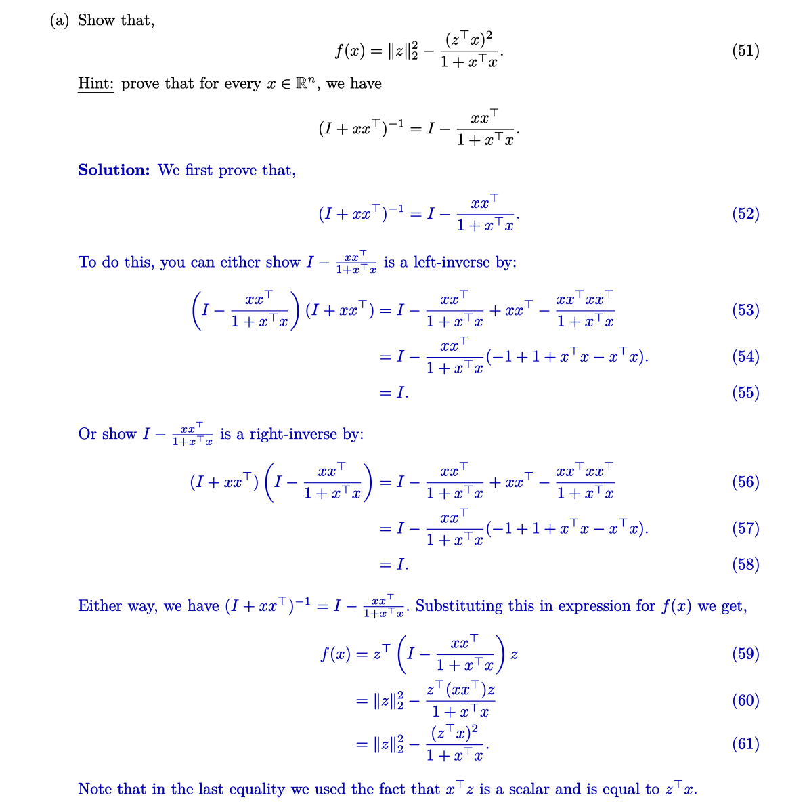
> 
> **P2: Gradient**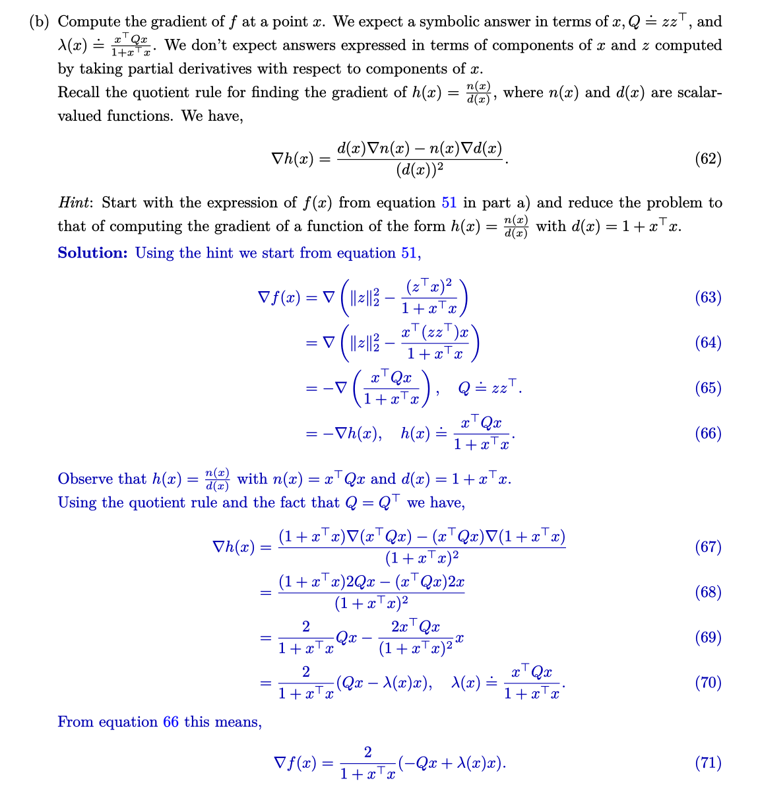
> 
> **P3: Vanishing Gradient**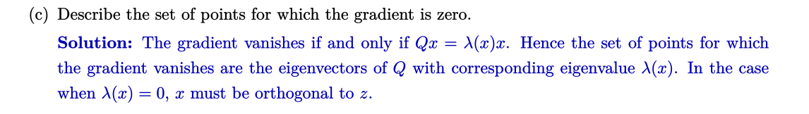
> 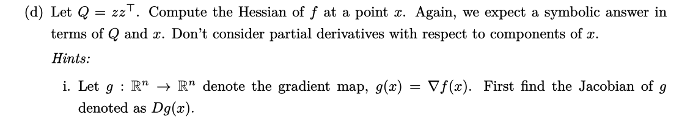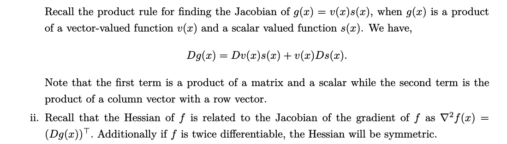
> 
> **P4: Jacobian of the Gradient & Hessian**
