[2_vectors.pdf](https://www.yuque.com/attachments/yuque/0/2023/pdf/12393765/1677164777660-025475a1-f5cb-405c-8c8b-07993c132773.pdf)
# Optimization Basics
## Opt Problems
### Standard Form of Opt
> 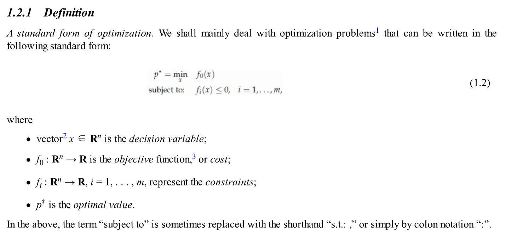

### Problems with Equality Constraints
> 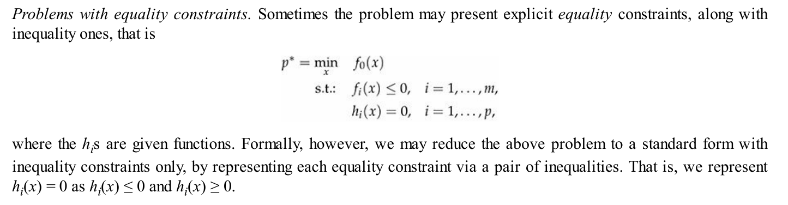

### Problems with Set Constraints
> 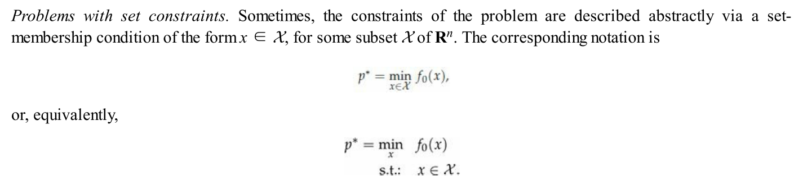

### Problems in Maximization Form
> 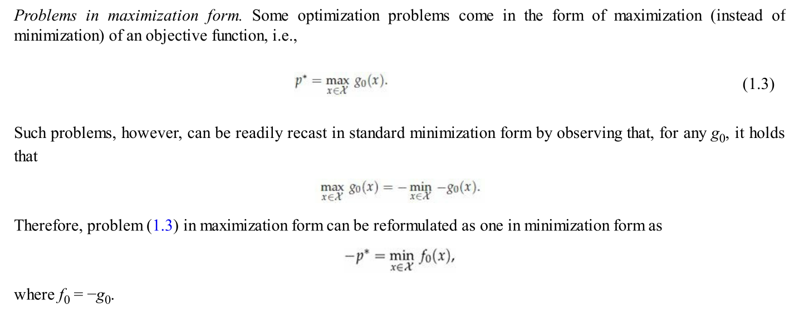

## Feasible Set
> 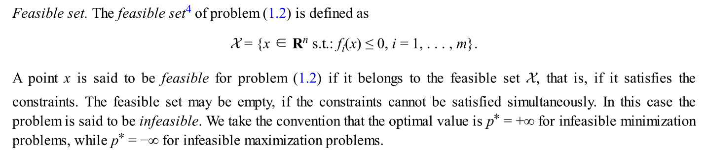

## Feasibility Problems
> 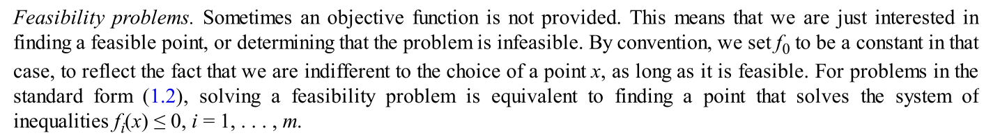

## Optimal Set
> 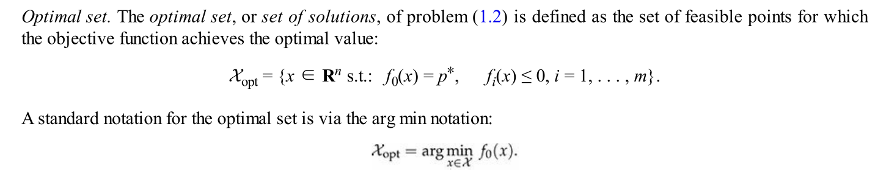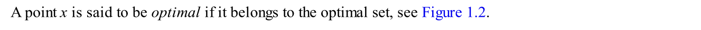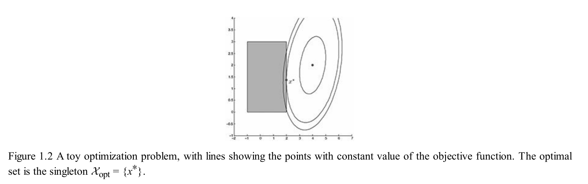

**Empty Optimal Set**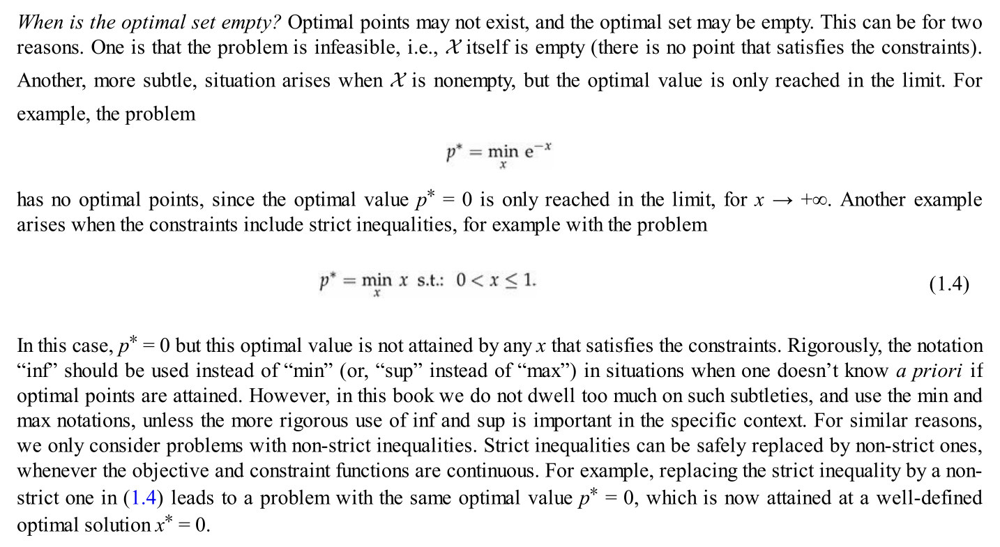

## Affine Sets
> 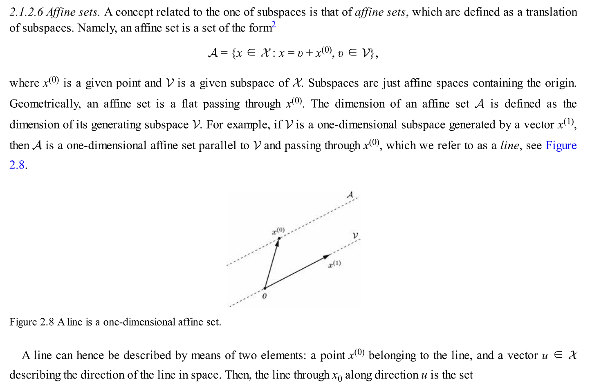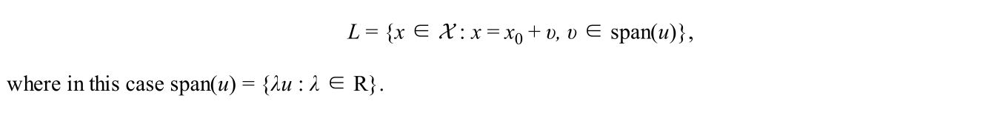

# Norms
## Definition
> 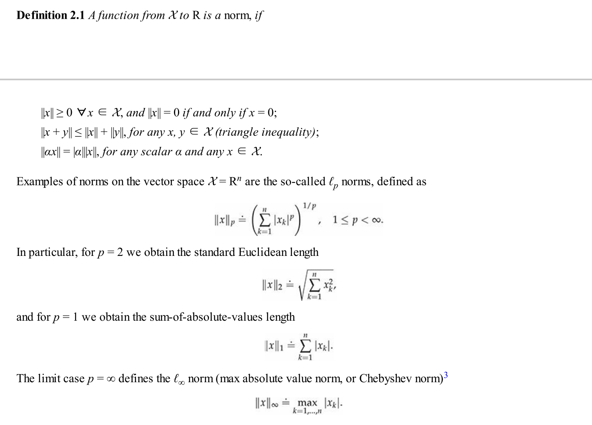
> 其中$\|\vec{x}\|_{\infty}^2=\max_{k=1,\cdots, n}|x_k|^2$
> 我们还有$l_0$norm, 定义为$\vec{x}$的`Number of non-zero elements`，也称为`Cardinality of vector`$\vec{x}$。
> **证明**$\|x\|_p$**满足**`**Norm**`**的三大基本性质(使用Holder's Inequality):**
> 1. **Triangle Inequality:** $\|\vec{x}+\vec{y}\|_p\leq \|\vec{x}\|_p+\|\vec{y}\|_p$
> 
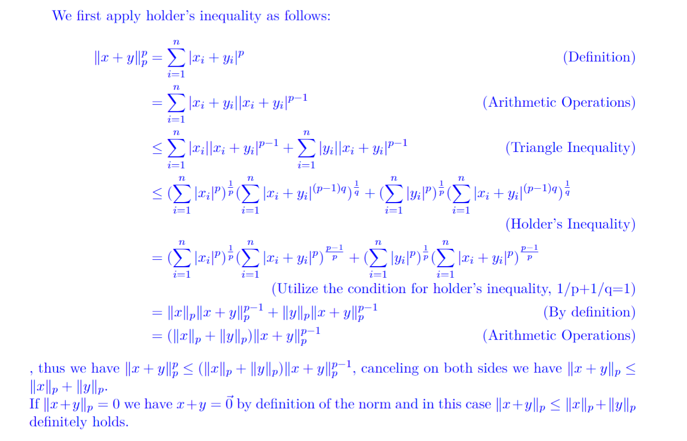
> 2. **Homogenity:** $\|\alpha \vec{x}\|_p=|\alpha|\|\vec{x}\|_p$
> 
This is easy: $(\sum_{i=1}^n |\alpha x_i|^p)^{\frac{1}{p}}=(\sum_{i=1}^n |\alpha|^p|x_i|^p)^{\frac{1}{p}}=|\alpha|(\sum_{i=1}^n|x_i|^p)^{\frac{1}{p}}=|\alpha|\|\vec{x}\|_p$
> 3. **Positive Definiteness: **$\|\vec{x}\|_p\geq 0$and $\|\vec{x}\|_p=0\iff \vec{x}=\vec{0}$
> 
This is again easy: $\|\vec{x}\|_p=(\sum_{i=1}^n|x_i|^p)^{\frac{1}{p}}\geq 0$since $|x_i|^p\geq 0$. When $\|\vec{x}\|_p=0$then we have $(\sum_{i=1}^n|x_i|^p)^{\frac{1}{p}}=0$and that $\sum_{i=1}^n|x_i|^p=0$, thus $|x_i|=0$and $x_i=0$, which implies $\vec{x}=\vec{0}$。

## Cauchy-Schwarz Inequality
> 总的来说，我们有: $|\vec{u}^{\top}\vec{v}|\leq \sum_{i=1}^n|u_i||v_i|\leq \|\vec{u}\|_2\|\vec{v}\|_2,~\vec{u},\vec{v}\in \mathbb{R}^n$成立。

**Proof Method 1**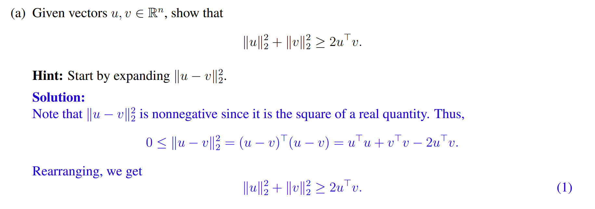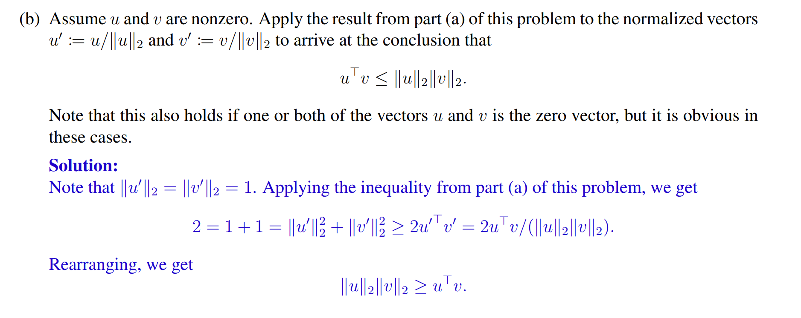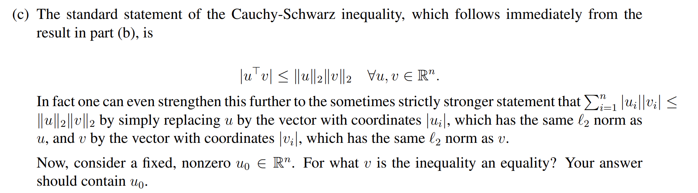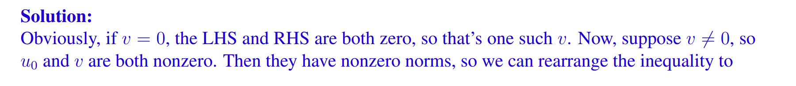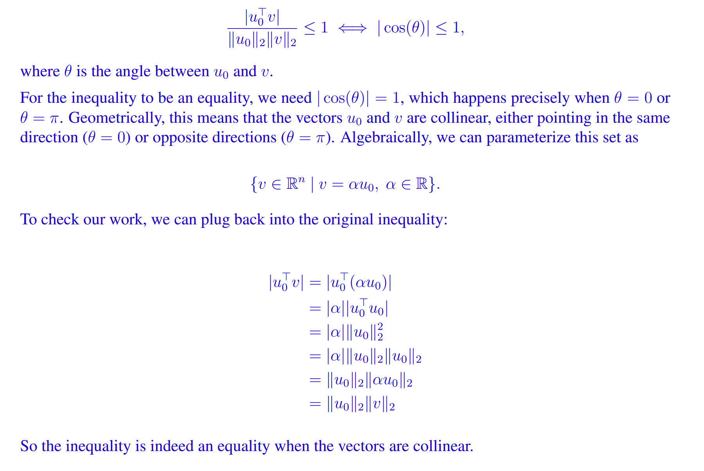
**Proof Method 2**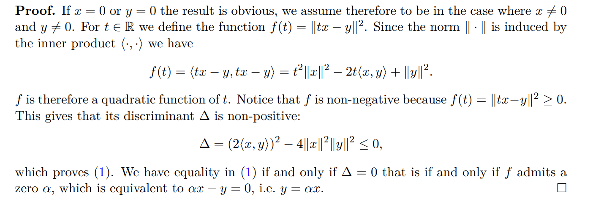

## Holder's Inequality
> **如果**$p,q\geq 1, s.t.~\frac{1}{p}+\frac{1}{q}= 1$**，则: **$\vec{u}^{\top}\vec{v}\leq |\vec{u}^{\top}\vec{v}|\leq \sum_{i=1}^n|u_i||v_i|\leq \|\vec{u}\|_p\|\vec{v}\|_q,~\vec{u},\vec{v}\in \mathbb{R}^n$
> 当$p=q=\frac{1}{2}$时，带入上述不等式可知 $|\vec{u}^{\top}\vec{v}|\leq \sum_{i=1}^n|u_i||v_i|\leq \|\vec{u}\|_2\|\vec{v}\|_2,~\vec{u},\vec{v}\in \mathbb{R}^n$, 所以`Cauchy Schwarz Inequality`是`Holder's Inequality`的特殊情况。

**Proof**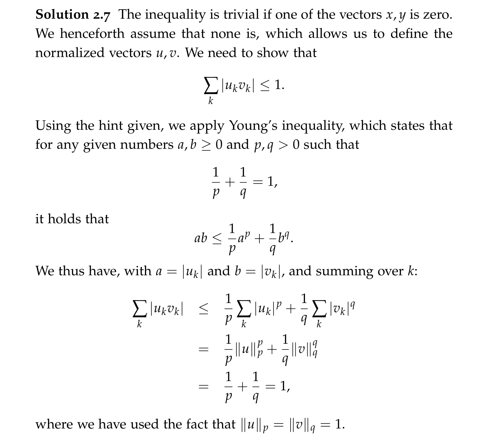

## Norm Balls
> 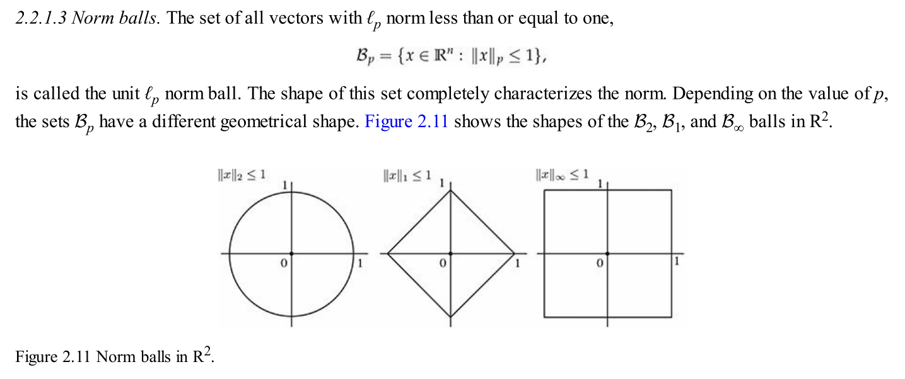

## Monotonicity of Lp Norm
### Definition
> 回顾一下`Lp Norm`的定义如下：
> 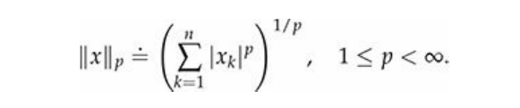
> `Monotonicity`性质说的是: 对于$1\leq q<p<\infty$来说，$\|x\|_p\leq \|x\|_q$。

### Proof of Monotonicity
> **证明分为如下几步:**
> 1. 证明对于$0<m<1$且$a_1,a_2,\cdots, a_n\in \mathbb{R}_{>0}$, $(\sum_{i=1}^n a_i)^m\leq \sum_{i=1}^n a_i^m$且$n\geq 2$时取严格不等式。
> 
**证明: **令$f(a_1,a_2,\cdots, a_n)=(\sum_{i=1}^n a_i)^m- \sum_{i=1}^n a_i^m$
> 当$n\geq 2$时：
> 求$\frac{df}{da_j}=m(\sum_{i=1}^na_i)^{m-1}-ma_j^{m-1}~\forall 1\leq j\leq n$
> 因为$\sum_{i=1}^na_i>a_j$, 且$m-1<0$, 所以$m(\sum_{i=1}^na_i)^{m-1}-ma_j^{m-1}<0~~\forall j$即$\frac{df}{da_j}<0,~~\forall j$。
> 根据多元函数的性质我们有, 沿着$(0,0,\cdots, 0)$到$(a_1,a_2,\cdots,a_n)$直线的方向满足$\begin{aligned}f(a_1,a_2,\cdots, a_n)&=f(0,0,\cdots, 0)+\int_0^1\frac{d}{dt}f(ta_1,ta_2,\cdots, ta_n)dt\\&=\int_0^1\frac{d}{dt}f(ta_1,ta_2,\cdots, ta_n)dt\\&<0\end{aligned}$
> 当$n=1$时:
> $f(a_1,a_2,\cdots, a_n)=(\sum_{i=1}^n a_i)^m- \sum_{i=1}^n a_i^m=a_1^m-a_1^m=0$成立
> 综上$f(a_1,a_2,\cdots, a_n)\leq 0$，即$(\sum_{i=1}^n a_i)^m\leq \sum_{i=1}^n a_i^m$
> 2. 将$0<\frac{q}{p}<1$替换上式中的$m$, $|a_i|^p$替换上式中的$a_i$，得到$(\sum_{i=1}^n |a_i|^p)^{\frac{q}{p}}\leq \sum_{i=1}^n |a_i|^{p\times \frac{q}{p}}$, 即$(\sum_{i=1}^n |a_i|^p)^{\frac{q}{p}}\leq \sum_{i=1}^n |a_i|^{q}$
> 3. 不等式两边同时取$\frac{1}{q}$得到$(\sum_{i=1}^n |a_i|^p)^{\frac{1}{p}}\leq (\sum_{i=1}^n |a_i|^{q})^{\frac{1}{q}}$, 即$\|x\|_p\leq \|x\|_q$
> 
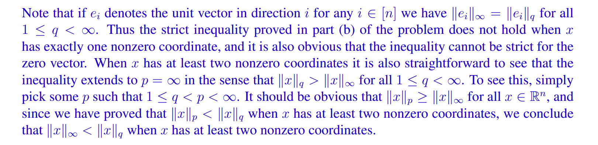

## Optimization over Norm Ball
> 给定$\vec{y}\in \mathbb{R}^n$, 我们考虑下列优化问题:
> $max~ \vec{x}^{\top}\vec{y}\\s.t. \|\vec{x}\|_p\leq 1$
> 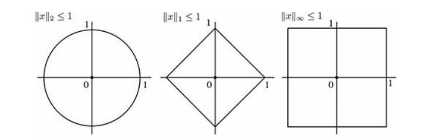

### p=2
> $max~ \vec{x}^{\top}\vec{y}\\s.t. \|\vec{x}\|_2\leq 1$
> 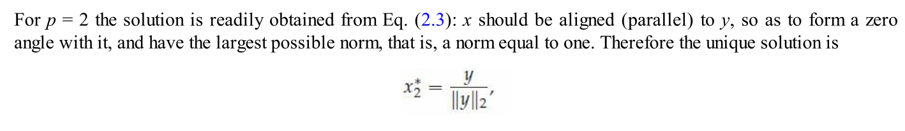

### p=infinity
> $max~ \vec{x}^{\top}\vec{y}\\s.t. \|\vec{x}\|_{\infty}\leq 1$
> 根据`Holder Inequality`, 此时$p=\infty$, 根据$\frac{1}{p}+\frac{1}{q}=1$, $q=1$, 所以我们有:
> $\vec{x}^{\top}\vec{y}\leq \|\vec{x}\|_{\infty} \|\vec{y}\|_{1}\leq \|\vec{y}\|_1=\sum_{i=1}^n|y_i|$
> 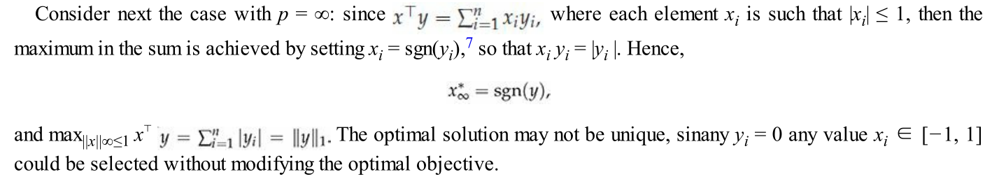

### p=1
> $max~ \vec{x}^{\top}\vec{y}\\s.t. \|\vec{x}\|_{1}\leq 1$
> 根据`Holder Inequality`, 此时$p=1$, 根据$\frac{1}{p}+\frac{1}{q}=1$, $q=\infty$, 所以我们有:
> $\vec{x}^{\top}\vec{y}\leq \|\vec{x}\|_1 \|\vec{y}\|_{\infty}\leq \|\vec{y}\|_{\infty}=|y_{max}|~~\tag{1}$
> 现在我们需要达到这个最大值$\|\vec{y}\|_{\infty}=\max_{1,2,\cdots, n}|y_i|=|y_{max}|$。
> 因为$\vec{x}^{\top}\vec{y}=x_1y_1+x_2y_2+\cdots+x_{max}y_{max}\cdots+x_ny_n$, 所以我们令$x_i=\begin{cases}sgn(y_i)&i=max\\0&otherwise \end{cases},i=1,2,\cdots, n$来为等式$(1)$取到等号。
> 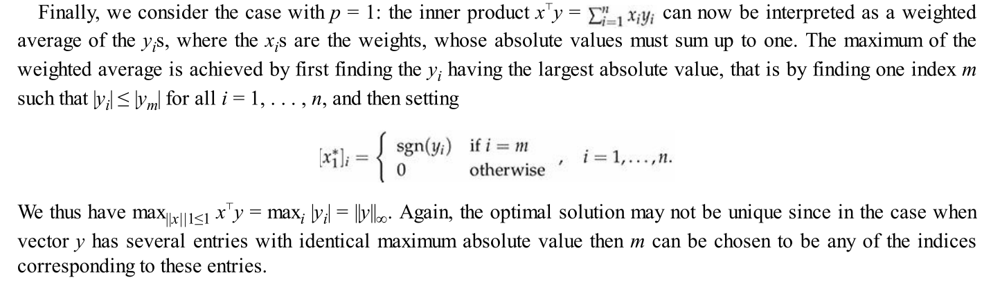
> 另一种视角(三角不等式):
> $\vec{x}^{\top}\vec{y}=\sum_{i=1}^n x_iy_i\leq |\sum_{i=1}^nx_iy_i|\leq \sum_{i=1}^n|x_i||y_i|\leq \sum_{i=1}^n |x_i||y_{max}|=|y_{max}|$
> 然后找到取等条件，步骤和上面一致。

## Optimization over Euclidean Ball
> 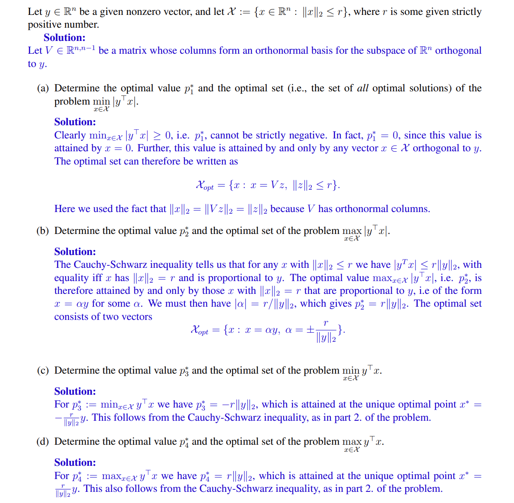

## Norm Inequality Relationship
### Inequality I
> 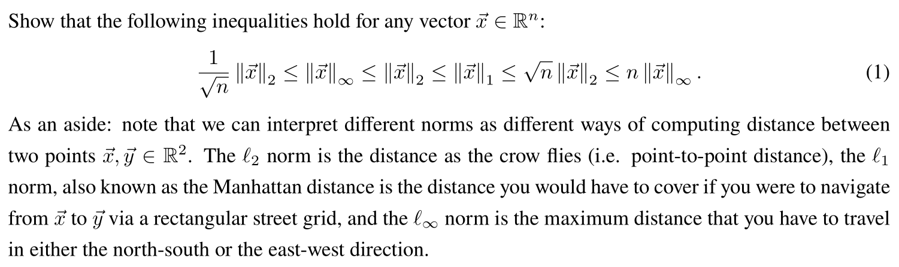
> **我们从左到右开始证明:**
> 1. $\|\vec{x}\|_2^2=\sum_{i=1}^n x_i^2\leq n\cdot \max_{i} x_i^2=n\cdot \|\vec{x}\|_{\infty}^{2}$, 于是$\frac{1}{n}\|\vec{x}\|_2^2\leq \|\vec{x}\|_{\infty}^2$, 即$\frac{1}{\sqrt{n}}\|\vec{x}\|_2\leq \|\vec{x}\|_{\infty}$
> 2. $\|\vec{x}\|_{\infty}^{2}=\max_{i}x_i^2\leq \sum_{i=1}^n x_i^2 =\|\vec{x}\|_2^2$，即$\|\vec{x}\|_{\infty}\leq \|\vec{x}\|_2$
> 3. $\|\vec{x}\|_2^2=\sum_{i=1}^n x_i^2\leq \sum_{i=1}^nx_i^2+\sum_{i\neq j}|x_ix_j|=(\sum_{i=1}^n |x_i|)^2=\|\vec{x}\|_1^2$, 即$\|\vec{x}\|_2\leq \|\vec{x}\|_1$
> 4. $\|\vec{x}\|_1^2=(\sum_{i=1}^n|x_i|)^2\leq (1+1+\cdots 1)\cdot(x_1^2+x_2^2+\cdots+x_n^2)=n\cdot \sum_{i=1}^n x_i^2=n\cdot \|\vec{x}\|_2^2$, 即$\|\vec{x}\|_1\leq \sqrt{n}\cdot \|\vec{x}\|_2$
> 5. $n\cdot \|\vec{x}\|_2^2=n\cdot \sum_{i=1}^n x_i^2\leq n\cdot n\cdot \max_ix_i^2=n^2\|\vec{x}\|_{\infty}^2$, 即$\sqrt{n}\|\vec{x}\|_2\leq n\|\vec{x}\|_{\infty}$
> 
证毕。

### Inequality II
> 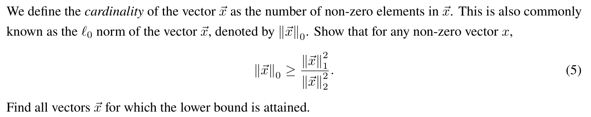
> 我们可以利用柯西不等式$\vec{y}^{\top}\vec{z}\leq |\vec{y}^{\top}\vec{z}|\leq \|\vec{y}\|_2\|\vec{z}\|_2$，这里我们令$\vec{z}=\begin{bmatrix} |x_1|\\|x_2|\\\vdots\\|x_n|\end{bmatrix}$, 令$\vec{y}=\begin{bmatrix}1\\1\\\vdots\\1\end{bmatrix}$，则$(\sum_{i=1}^n |x_i|)^2\leq \|\vec{y}\|_2^2(\sum_{i=1}^nx_i^2)$，而这里$\|\vec{y}\|_2^2$实际上就是$\vec{y}$中非零项的数量。于是令$\|\vec{y}\|_2^2=\|\vec{x}\|_0$, 则我们有$\|\vec{x}\|_1^2\leq \|\vec{x}\|_0\|\vec{x}\|_2^2$, 即$\|\vec{x}\|_0\geq \frac{\|\vec{x}\|_1^2}{\|\vec{x}\|_2^2}$。

## Norms over Random Variables
> 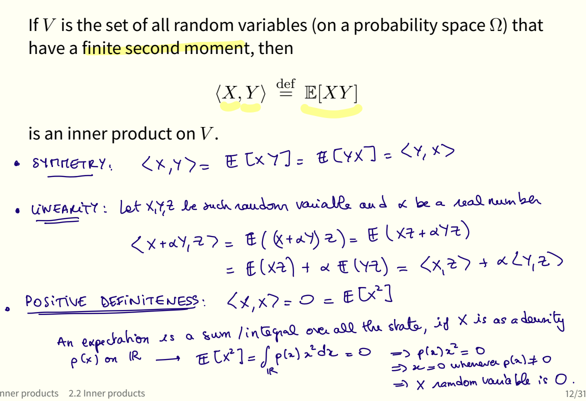

# Sum of Subspaces
> 当我们在处理向量空间的时候，我们一般只对子空间这样的集合感兴趣，而不是随便拿来一个子集来研究。下面我们介绍一个工具: 子集的和`Sum of Subsets`。
> 我们应该都听说过集合的交并补，而对于任意的多个子空间来说，子空间的并一般不是子空间，但是子空间的和却永远是子空间，下面我们将展开说明。

## Sum of subsets
### Definition
> 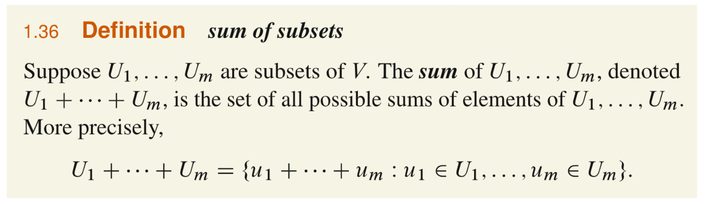

**Example 1**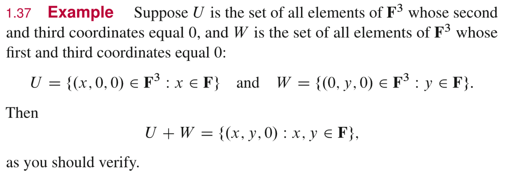

**Example 2**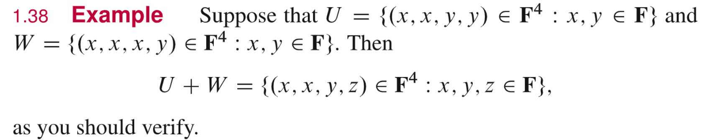

### Smallest Sum of Subspaces
> 

**Proof**
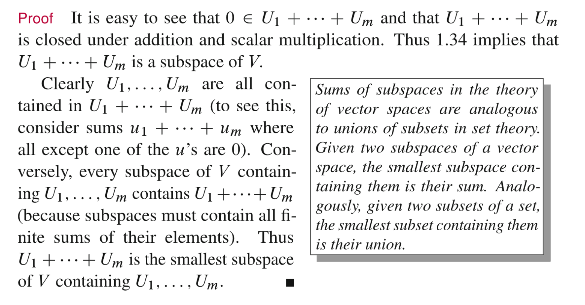

## Directed Sums
### Definition
> 
> 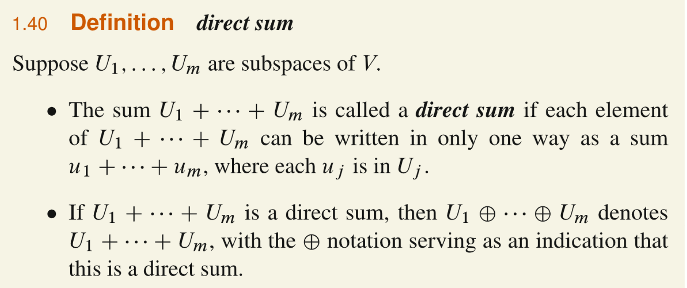

**Example 1**
**Example 2**
**Example 3**
**Proof of Example 3****矩阵视角:**
通过观察$\bf U_1,U_2.U_3$中的向量构成，我们知道，对于$\forall u\in \bf U_1+U_2+U_3$
$u=\begin{bmatrix} 1\\0\\0 \end{bmatrix}a+\begin{bmatrix} 0\\1\\0 \end{bmatrix}b+\begin{bmatrix} 0\\0\\1 \end{bmatrix}c+\begin{bmatrix} 0\\1\\1 \end{bmatrix}d=\begin{bmatrix} anything\\anything\\anything \end{bmatrix}$，于是问题相当于变为$\begin{bmatrix} 1&0&0&0\\0&1&0&1\\0&0&1&1 \end{bmatrix}\begin{bmatrix} a\\b\\c\\d \end{bmatrix}=\begin{bmatrix} t\\z\\w\\q \end{bmatrix}$, 令$\bf A=\begin{bmatrix} 1&0&0&0\\0&1&0&1\\0&0&1&1 \end{bmatrix},x=\begin{bmatrix} a\\b\\c\\d \end{bmatrix},b=\begin{bmatrix} t\\z\\w\\q \end{bmatrix}$
我们发现，其实我们只要求证$\forall \bf b\in \mathbf{F^4}, \bf Ax=b$都只有唯一解就行，不妨令$\bf b=\bf  0$根据矩阵和线性方程的解的性质，矩阵$\bf A$的零空间必须只含有零向量。但是$\bf A$有自由元，所以零空间一定不止零向量，于是我们知道$\bf U_1+U_2+U_3$不是一个`Directed Sum`。反例在第二种视角的证明中给出。分别对应$\begin{cases}  a=0\\b=0\\c=0\\d=0\end{cases}$和$\begin{cases} a=0\\b=1\\c=1\\d=-1\end{cases}$的情况。

**代数视角：**

### Condition for Direct Sum⭐⭐⭐⭐⭐
> 

**Proof****矩阵视角:**
正如我们示例`3`中看到的那样，我们只要找到每个子空间$\bf U_i$的基向量，将他们按列组成一个系数矩阵$\bf A$, 然后判断$\bf A$的零空间的维数是否大于零即可。
**代数视角:**
代数视角使用反证法，如果存在两个不同的表达，则这两个表达一定相同，这种证明思想在数学分析中非常的常用。
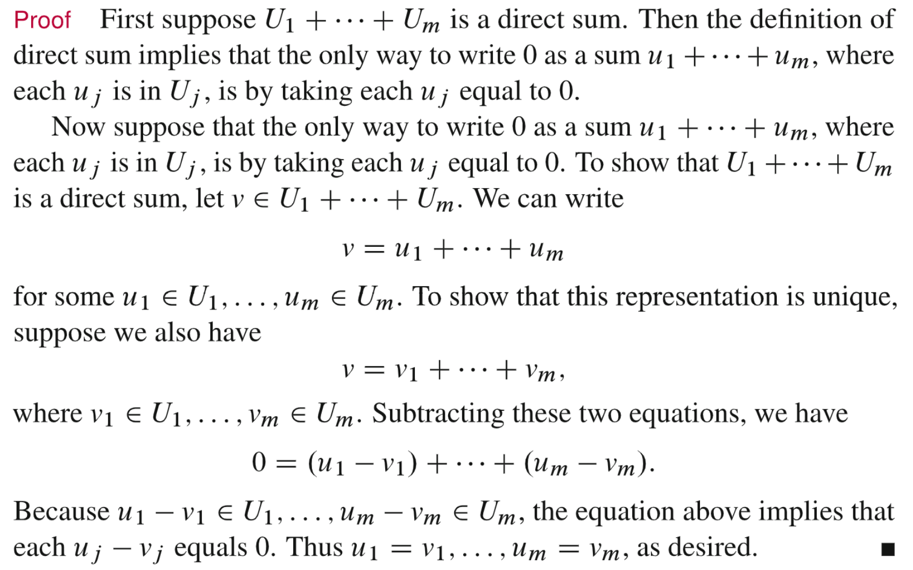

## Direct Sum of two Subspaces
> 

**Proof****矩阵视角:**
如果两个子空间的交集只有$\{0\}$, 说明两个子空间内的任意$u\in \mathbf{U},v\in \bf V$都线性无关，所以$\bf U+W$一定是`Directed Sums`
**代数视角:**

# Orthogonality
## 正交补
### Basic Concepts
> 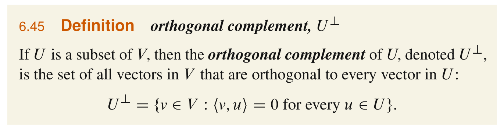
> 1. `Vector is orthogonal to a subspace`: 向量垂直于子空间说的是$\vec{x}$垂直于子空间中所有的向量，数学语言就是$\vec{x}\perp \vec{s}$($\vec{s}\in S$)。
> 2. `Subspaces are orthogonal to each other`: 假设有两个子空间$U,V$, 如果$\forall \vec{u}\in U,\vec{v}\in V$, $\vec{u}\perp \vec{v}$, 则$U\perp V$。

### Basic Properties
> 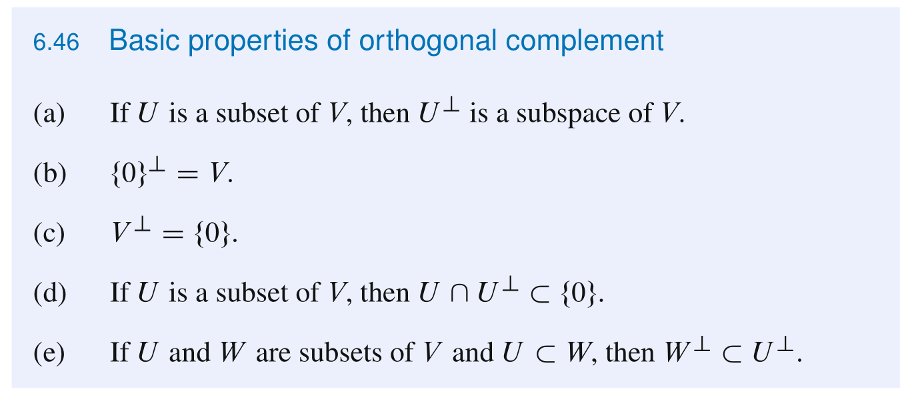

**Proof**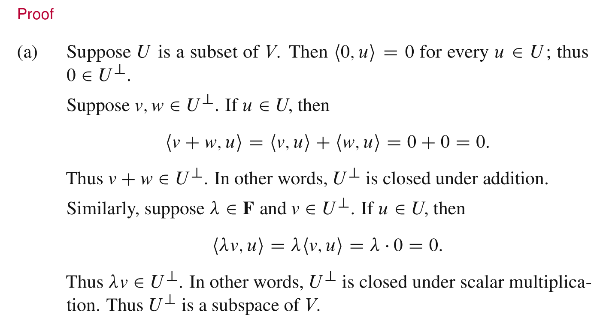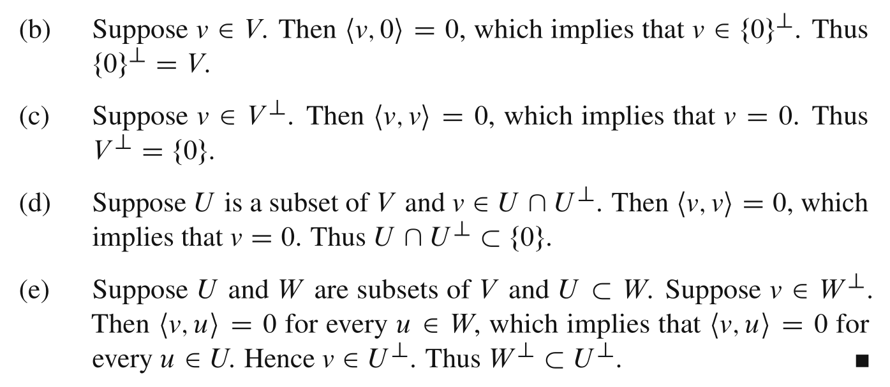

## 正交补的和
> 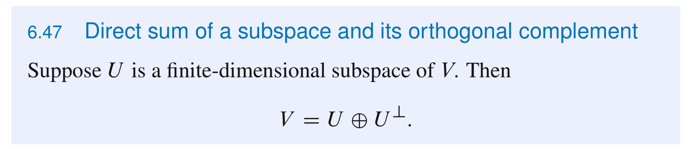

**Proof - Method 1**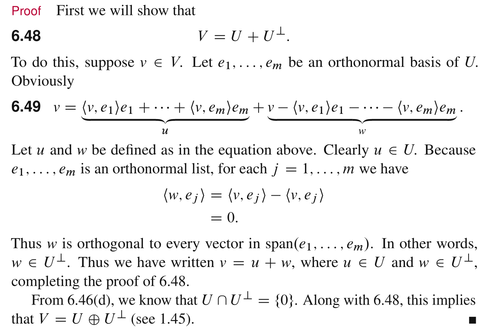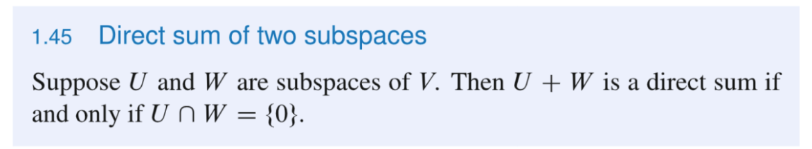
**Proof - Method 2**

## 正交分解定理
> 假设$S\subseteq \mathcal{X}$是一个子空间，则存在$\forall x\in \mathcal{X}$,$\exists! \vec{s}\in S,\vec{r}\in S^{\perp}$, $\vec{x}=\vec{s}+\vec{r}$
> 其中$S^{\perp}=\{\vec{r}|\langle \vec{s},\vec{r}\rangle=0~\forall s\in S\}$。
> 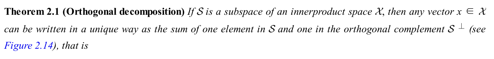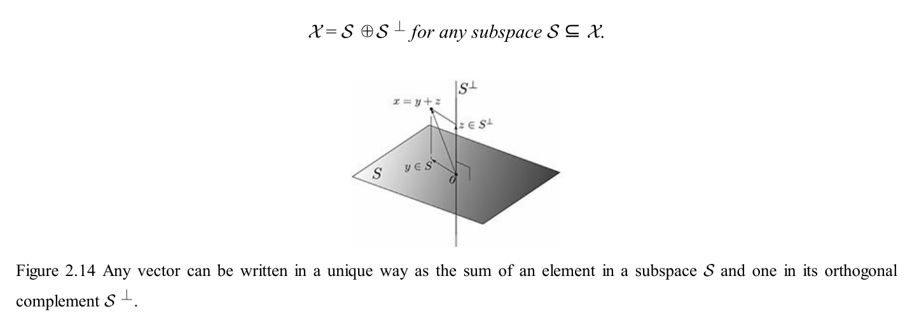

## 正交子空间的直和
> 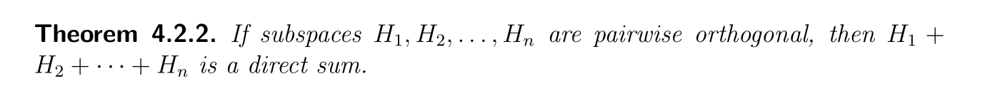

**Proof**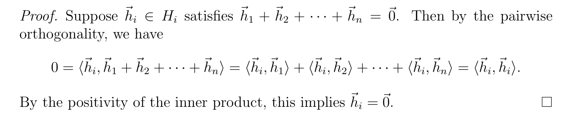
> 同时我们知道$H_1+H_2+\cdots+H_n$是`Direct Sum`<=>$dim(\sum_{i=1}^n H_i)=\sum_{i=1}^n dim(H_i)$

## 正交子空间的维数
> 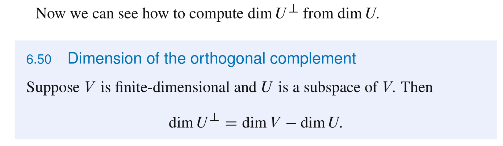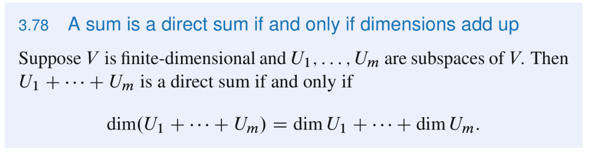

## 正交子空间的正交补
> 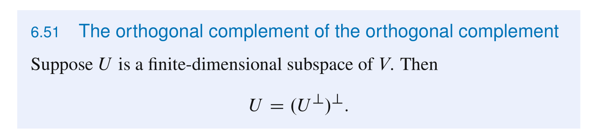

**Proof**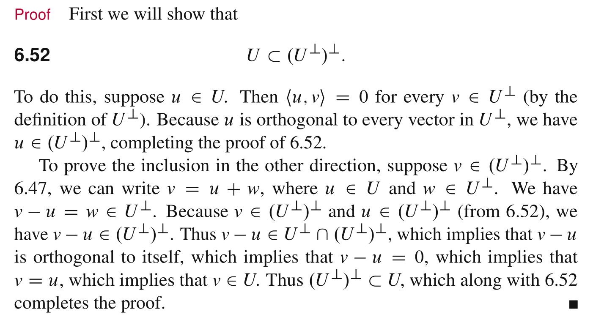

## Parallelogram Law
> 对于$\vec{u}\perp \vec{v}$, 我们有$\|\vec{u}\pm \vec{v}\|_2^2=\|\vec{u}\|_2^2+\|\vec{v}\|_2^2$
> **证明:**
> $\|\vec{u}\pm \vec{v}\|_2^2=\langle \vec{u}\pm\vec{v}, \vec{u}\pm\vec{v}\rangle=\|\vec{u}\|_2^2+\|\vec{v}\|_2^2\pm 2\langle \vec{u},\vec{v}\rangle=\|\vec{u}\|_2^2+\|\vec{v}\|_2^2$

## Pathagoras theorem
> 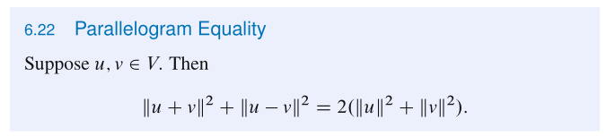
> 注意这里的`Norm`是`L2-Norm`

**Proof**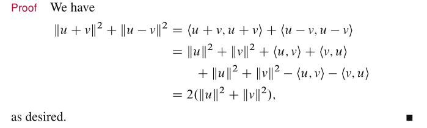
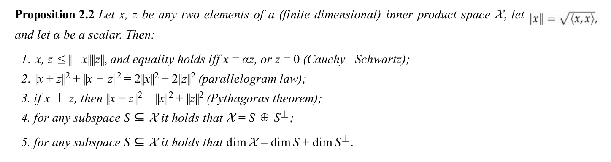

# Dimension of Subspaces
## Subset Relationship
> **If **$U_1$**has basis **$B_{U_1}$**, **$U_2$**has basis **$B_{U_2}$**, then **$Span(\{B_{U_1},B_{U_2}\})\subseteq U_1+U_2$**:**
> 假设$|B_{u_1}|=t_1, |B_{U_2}|=t_2$，$\forall \vec{v}\in Span(\{B_{U_1},B_{U_2}\})$, $\exists \alpha_1,\cdots, \alpha_{t_1},\beta_1,\cdots, \beta_{t_2},~~s.t.~~\vec{v}=\alpha_1\vec{a}_{1}+\cdots+\alpha_{t_1}\vec{a}_{t_1}+\beta_1\vec{b}_{1}+\cdots+\beta_{t_1}\vec{b}_{t_1}$, 其中$\alpha_1\vec{a}_{1}+\cdots+\alpha_{t_1}\vec{a}_{t_1}\in U_1$,$\beta_1\vec{b}_{1}+\cdots+\beta_{t_1}\vec{b}_{t_1}\in U_2$, 于是$\vec{v}\in U_1+U_2$, 证毕。
> **推广到**$n$**个子空间也成立:**
> 如果$U_1, U_2,\cdots, U_m$是$V$的子空间，则$U_1+U_2+\cdots+U_m$包含了$U_1,U_2,\cdots, U_m$。
> 假设$U_i$的基是$\{\vec{u}_{i1},\vec{u}_{i2},\cdots, \vec{u}_{im}\}$, 则$U_i$包含$\{\vec{u}_{i1},\vec{u}_{i2},\cdots, \vec{u}_{im}\}$, 所以$U_1+U_2+\cdots+U_m$包含$\{\vec{u}_{11},\vec{u}_{12},\cdots, \vec{u}_{1m_1},\vec{u}_{21},\vec{u}_{22},\cdots, \vec{u}_{2m_2},\cdots, \vec{u}_{m1},\vec{u}_{m2},\cdots, \vec{u}_{mm_m}\}$。
> 因为$U_1+U_2+\cdots+U_m$是子空间，所以$U_1+U_2+\cdots+U_m$包含$Span(\{\vec{u}_{11},\vec{u}_{12},\cdots, \vec{u}_{1m_1},\vec{u}_{21},\vec{u}_{22},\cdots, \vec{u}_{2m_2},\cdots, \vec{u}_{m1},\vec{u}_{m2},\cdots, \vec{u}_{mm_m}\})$
> 于是$Span(\{\vec{u}_{11},\vec{u}_{12},\cdots, \vec{u}_{1m_1},\vec{u}_{21},\vec{u}_{22},\cdots, \vec{u}_{2m_2},\cdots, \vec{u}_{m1},\vec{u}_{m2},\cdots, \vec{u}_{mm_m}\})\subseteq U_1+\cdots+U_m$。

## Inequality Relationship
> **If **$U_1$**and **$U_2$**are subspaces of a finite-dimensional vector space **$V$**, then:**
> $\max\{dim(U_1),dim(U_2)\}\leq dim(U_1+U_2)\leq dim(V)$**。**
> **证明: **
> 1. **左侧不等式，因为**$U_1\subseteq U_1+U_2$**, **$U_2\subseteq U_1+U_2$**, 所以**$dim(U_1)\leq dim(U_1+U_2)$**, **$dim(U_2)\leq dim(U_1+U_2)$**, 即**$\max\{dim(U_1),dim(U_2)\}\leq dim(U_1+U_2)$**。**
> 2. **右侧不等式，**
> 
首先我们证明$U_1+U_2\subseteq V$, $\forall \vec{u}\in U_1+U_2$, $\exists \vec{u}_1\in U_1,\vec{u}_2\in U_2$, $s.t.~~\vec{u}=\vec{u}_1+\vec{u}_2$, 因为$\vec{u}_1\in U_1\subseteq V$, $\vec{u}_2\in U_2\subseteq V$, 所以$\vec{u}_1+\vec{u}_2=\vec{u}\in V$, 于是$U_1+U_2\subseteq V$。
> 然后我们证明$U_1+U_2$是$V$的一个子空间即可。
>    1. 首先$\vec{0}=\vec{0}+\vec{0}\in U_1+U_2$
>    2. 任取$\vec{n}_1,\vec{n}_2\in U_1+U_2$, $\vec{n}_1=\vec{u}_1+\vec{u}_2$($\vec{u}_1\in U_1,\vec{u}_2\in U_2$), 
> 
$\vec{n}_2=\vec{w}_1+\vec{w}_2$($\vec{w}_1\in U_1,\vec{w}_2\in U_2$) , 则$\vec{n}_1+\vec{n}_2=(\vec{u}_1+\vec{w}_1)+(\vec{u}_2+\vec{w}_2)\in U_1+U_2$
>    3. 任取$\vec{n}_1\in U_1+U_2,\alpha\in \mathbf{F}$, 则$\alpha\vec{n}_1=\alpha\vec{u}_1+\alpha\vec{u}_2$($\vec{u}_1\in U_1,\vec{u}_2\in U_2)\in U_1+U_2$
> 
证毕。

## Equality Relationship
> 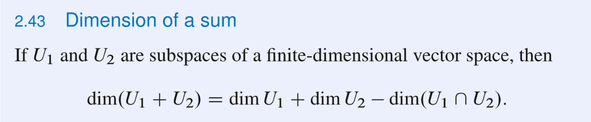

**Proof**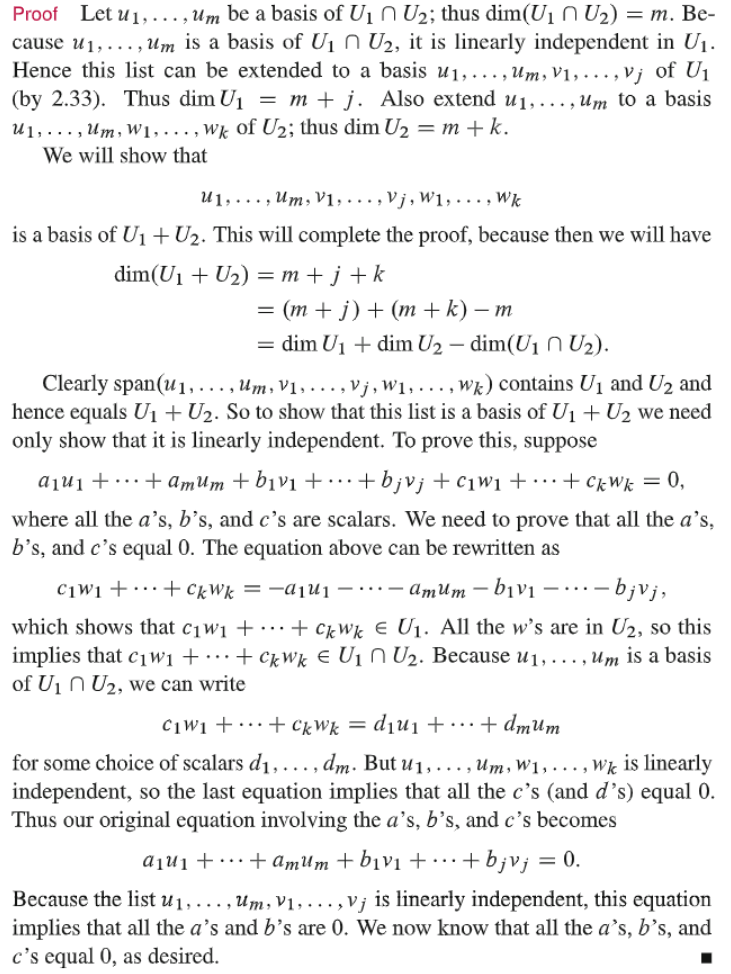

## Applications⭐⭐⭐⭐⭐
> 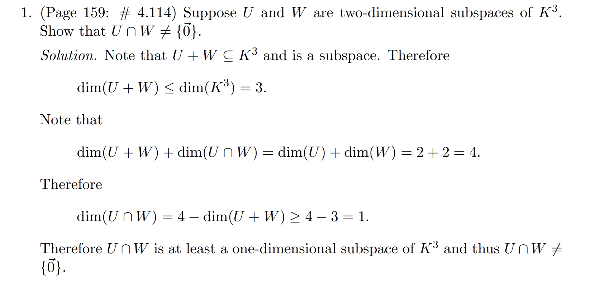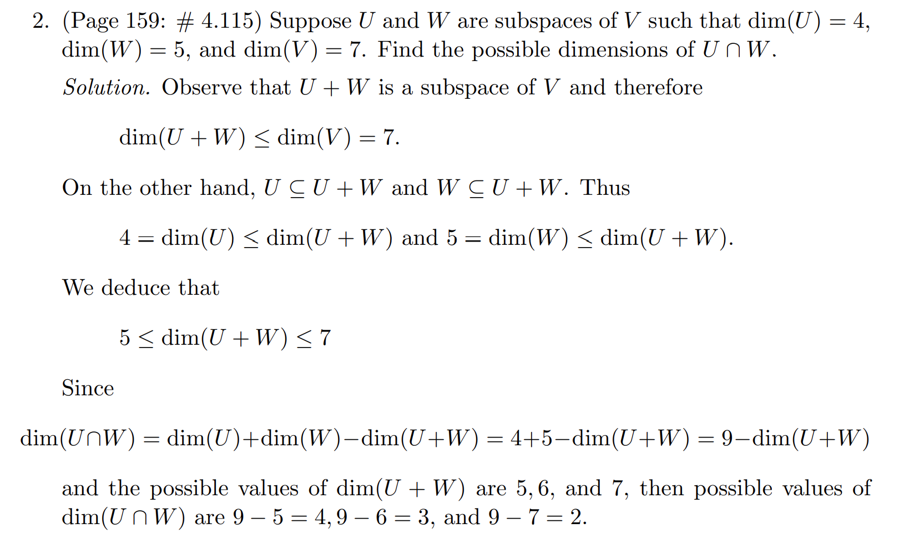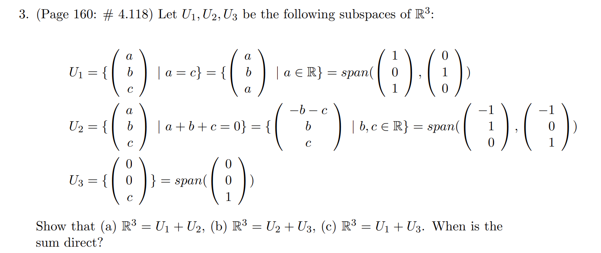

**Proof of 3**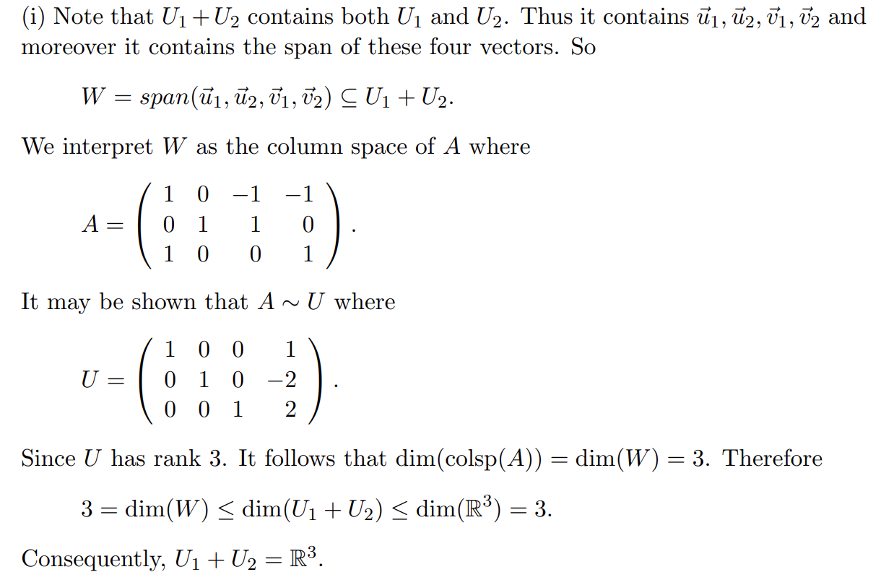       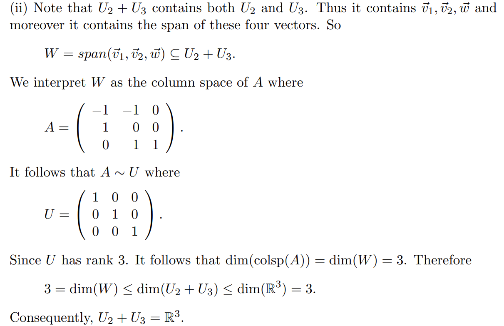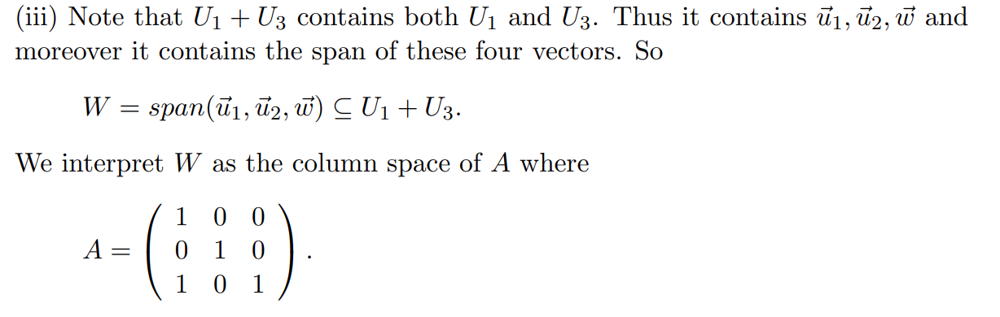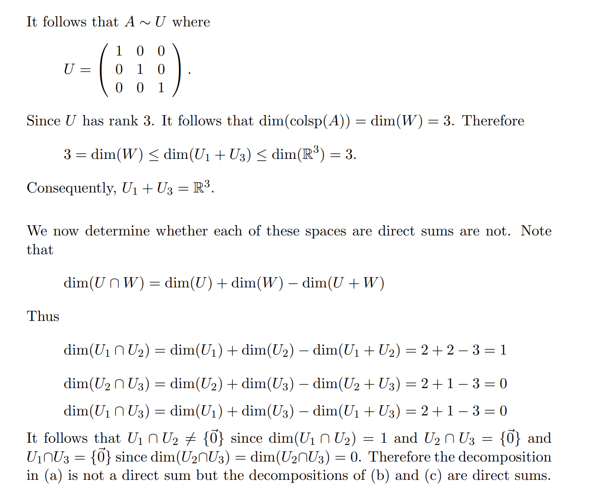

## Summary&Techniques
> **假设我们有**$U_1,U_2$**均为**$V$**的子空间，我们想要证明**$V=U_1+U_2$**且**$U_1+U_2$**是否是**`**Direct Sum**`**:**
> **首先是证明**$V=U_1+U_2$**:**
> 1. 找到$U_1$和$U_2$的`Basis`, $B_{U_1}$和$B_{U2}$。
> 2. 令$W=span(\{B_{U_1}|B_{U_2}\})\subseteq U_1+U_2$, 对$[B_{U_1}|B_{U_2}]$进行高斯消元得到主元的个数，即$dim(W)$。
> 3. 利用不等式$dim(W)\leq dim(U_1+U_2)\leq dim(V)$得到$dim(U_1+U_2)$所有可能的取值。
> 4. 因为$U_1+U_2\subseteq V$, 我们只要证明$dim(U_1+U_2)=dim(V)$是否可能成立即可，能够成立则说明$V=U_1+U_2$.
> 
**然后是证明**$U_1+U_2$**是否是**`**Direct Sum**`**:**
> 1. 上一步中已经得到了$dim(U_1+U_2)$所有可能的取值，则我们只需要验证$dim(U_1+U_2)=dim(U_1)+dim(U_2)$是否成立。如果成立，则$U_1+U_2$是`Direct Sum`。

# Projection Theory
## Projection Definition
> 对于任意`Closed Set`$S\subseteq \mathcal{X}$($\mathcal{X}$为`Inner Product Space`)，我们定义`Projection of`$\vec{x}$`onto`$\mathcal{S}$, 记号为$\Pi_{S}(\vec{x})=\min_{\vec{y}\in S}\|\vec{y}-\vec{x}\|_2$。
> 这里的距离$\|\vec{y}-\vec{x}\|_2$定义为`Euclidean Distance`, 所以`Projection`也称为`Euclidean Projection`

## Projection onto line
> 对于$\vec{x}\in \mathbb{R}^n$和$S_v=\{\lambda \vec{v}:\lambda\in \mathbb{R},\vec{v}\in \mathbb{R}^n\}$($Span(\vec{v})$), 我们要计算$\Pi_{S_v}(\vec{y})=\min_{\vec{x}\in S_v}\|\vec{y}-\vec{x}\|_2$。
> 推导步骤一般从$\|\vec{y}-\vec{x}\|_2$出发:
> 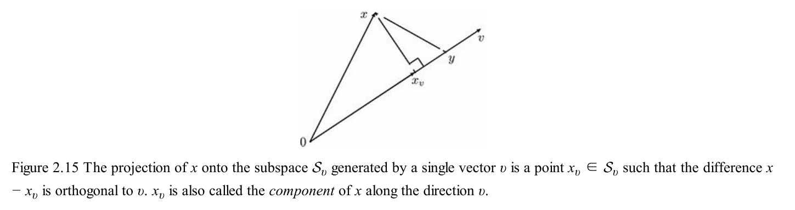
> 令$\vec{x}_v\in S_v$为我们要求的投影(如图所示)，满足$\vec{x}_v=\alpha\vec{v},\alpha\in \mathbb{R}$，则:
> $\begin{aligned}\|\vec{y}-\vec{x}\|_2^2&=\|(\vec{y}-\vec{x}_v)-(\vec{x}-\vec{x}_v)\|_2^2\\&=\|\vec{y}-\vec{x}_v\|_2^2+\|\vec{x}-\vec{x}_v\|_2^2\end{aligned}$
> 所以$\min_{\vec{y}\in S_v}\|\vec{y}-\vec{x}\|_2=\min_{\vec{y}\in S_v}\|\vec{y}-\vec{x}_v\|_2^2+\|\vec{x}-\vec{x}_v\|_2^2$, 后一项和$\vec{y}$无关，所以$\vec{y}^*=\vec{x}_v$, 所以$\vec{x}_v$是我们要找的投影，因为它使得$\|\vec{y}-\vec{x}\|_2$最小化。
> 然后我们求这个$\vec{x}_v$的表达式，使用`Orthogonality Condition`，有$\vec{x}-\vec{x}_v\perp \vec{v}$, 所以$\vec{x}_v=\frac{\langle \vec{x},\vec{v}\rangle}{\|\vec{v}\|_2^2}\vec{v}$

## Projection onto Subspaces
> 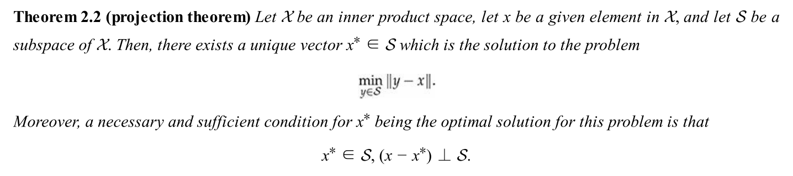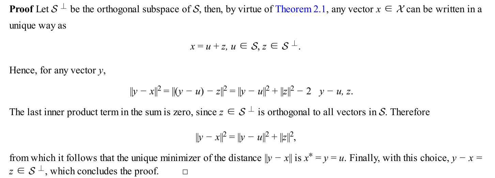

## Projection onto Affine Set
> 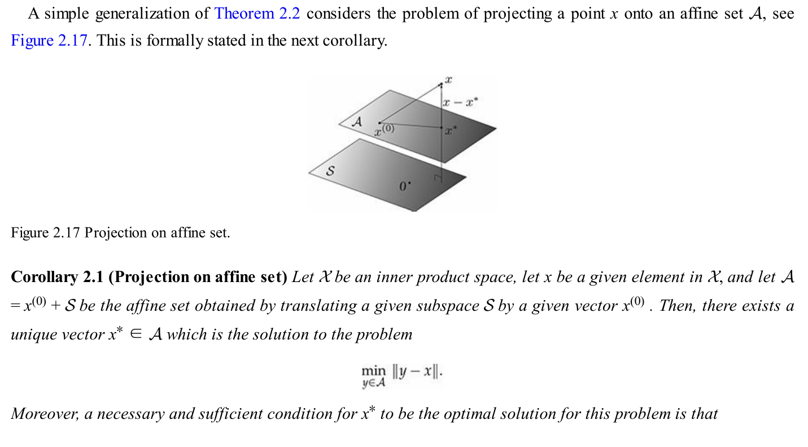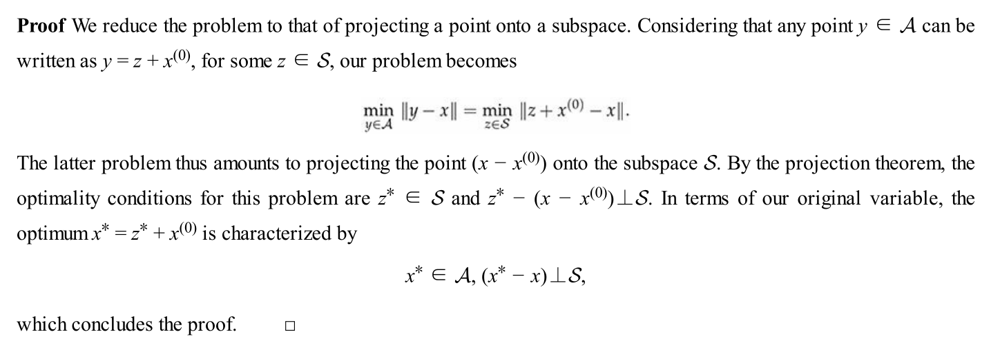

# Optimization Objects
## Hyperplanes
> 超平面的定义为$\mathcal{H}=\{\vec{x}\in \mathbb{R}^n:\vec{a}^{\top}\vec{x}=b\}$, 其中:
> 1. $\vec{a}\neq\vec{0}\in \mathbb{R}^n$称为$\mathcal{H}$的`Normal Direction`。
> 2. $dist(H,\vec{p})$为$\vec{p}\in \mathbb{R}^n$到$\mathcal{H}$的距离。
> 
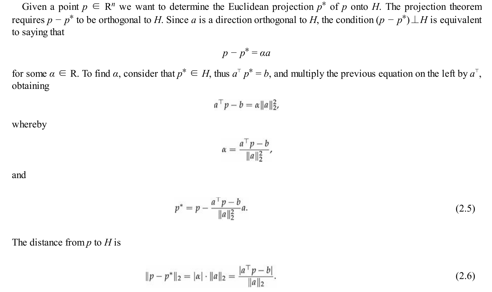
> 3. $b\in \mathbb{R}$称为`Translation of Hyperplane`。
>    1. 如果$b=0$, 则$dim(\mathcal{H})=n-1$, 因为此时$span(\{\vec{a}\})\oplus\mathcal{H}=n$。
>    2. 如果$b\neq 0$, 则当$\|\vec{a}\|=1$时,$|b|$是$\vec{0}$(原点)到$\mathcal{H}$的距离，将$\vec{0}$带入$(2.6)$即可。
> 4. **Alternative Definitions of Hyperplane**
> 
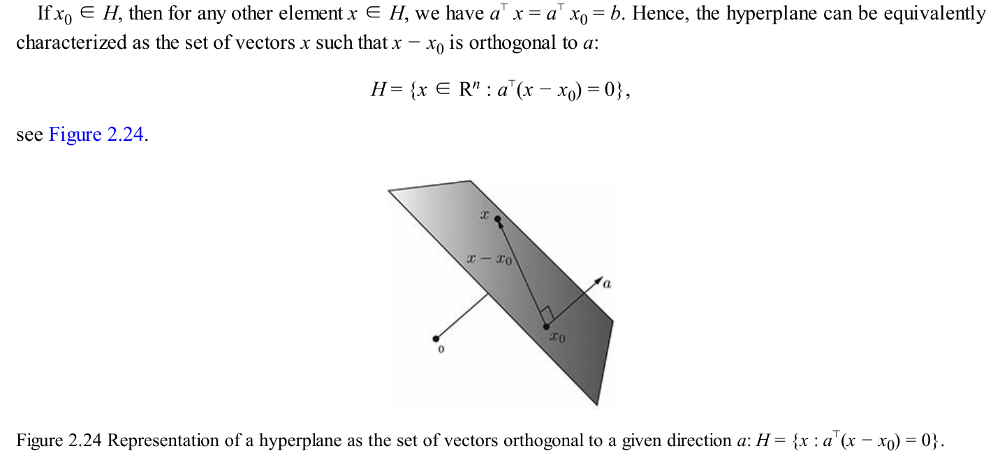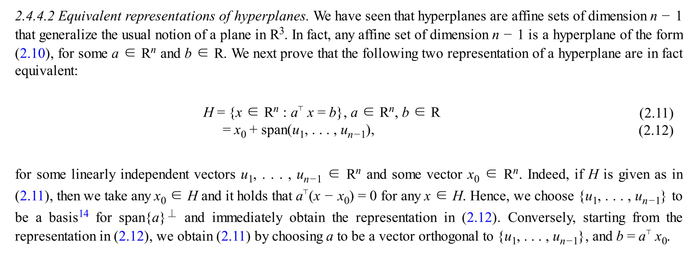

## Half Space
> 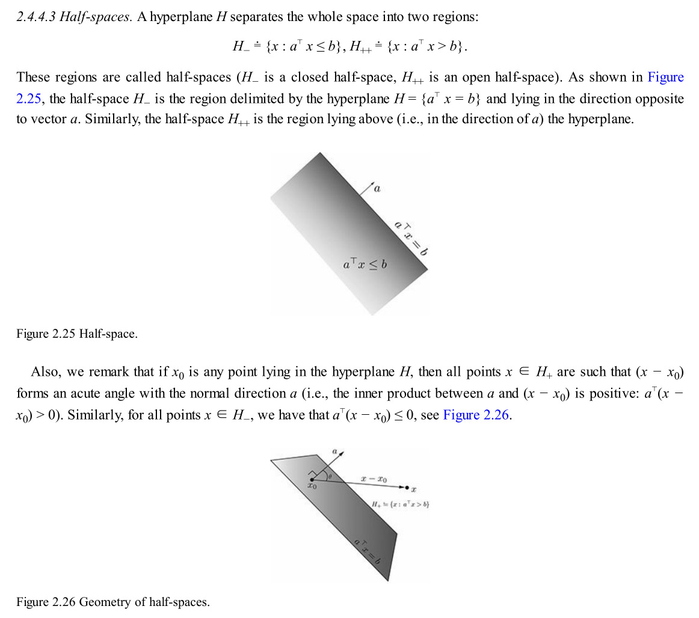

# 

