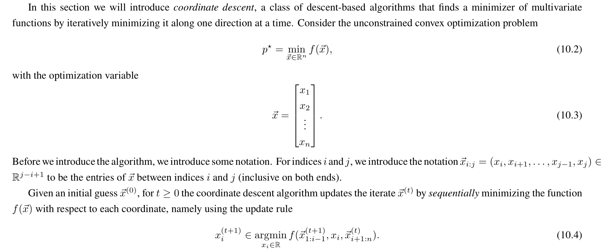
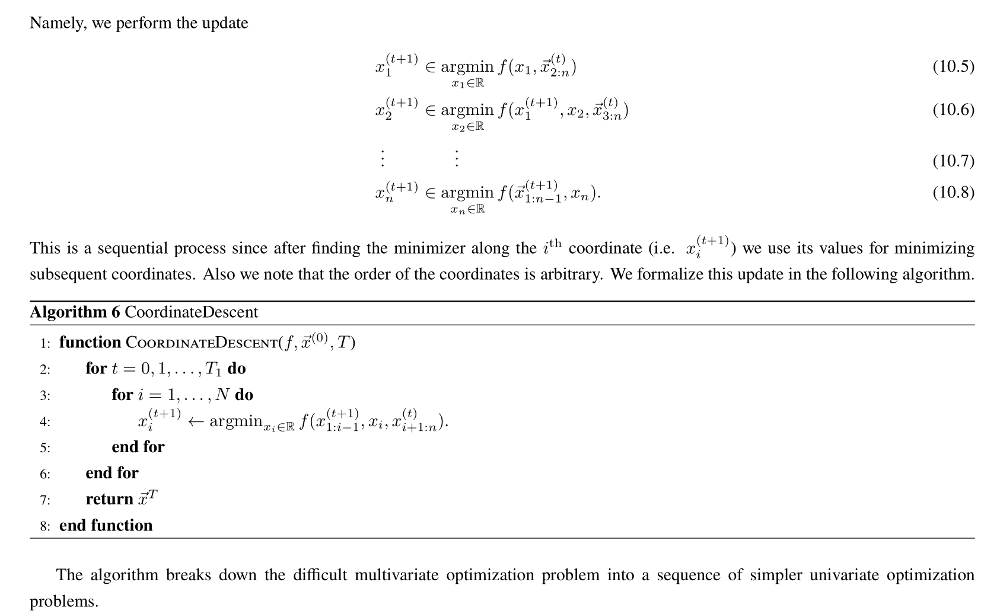
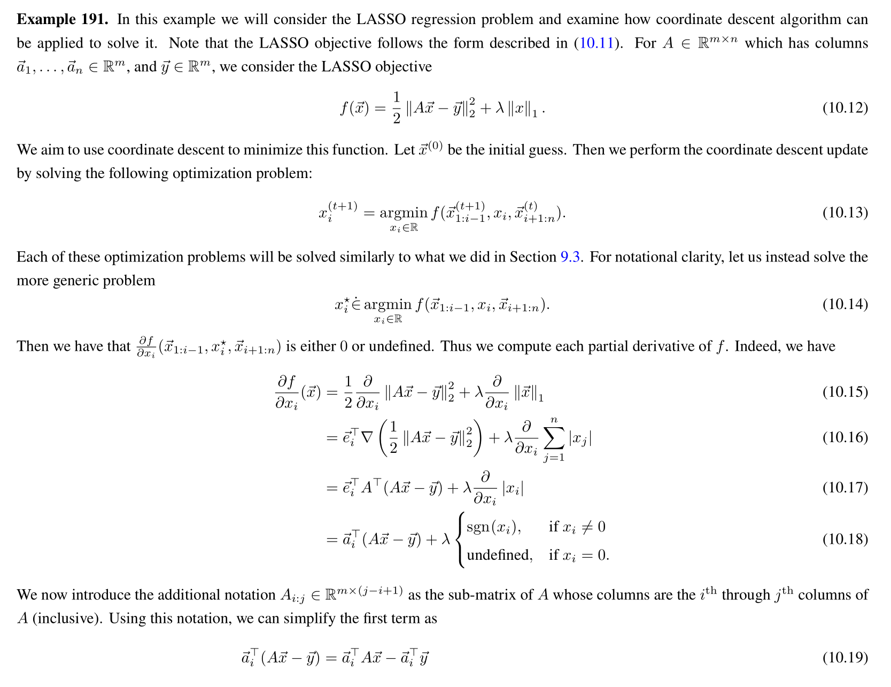
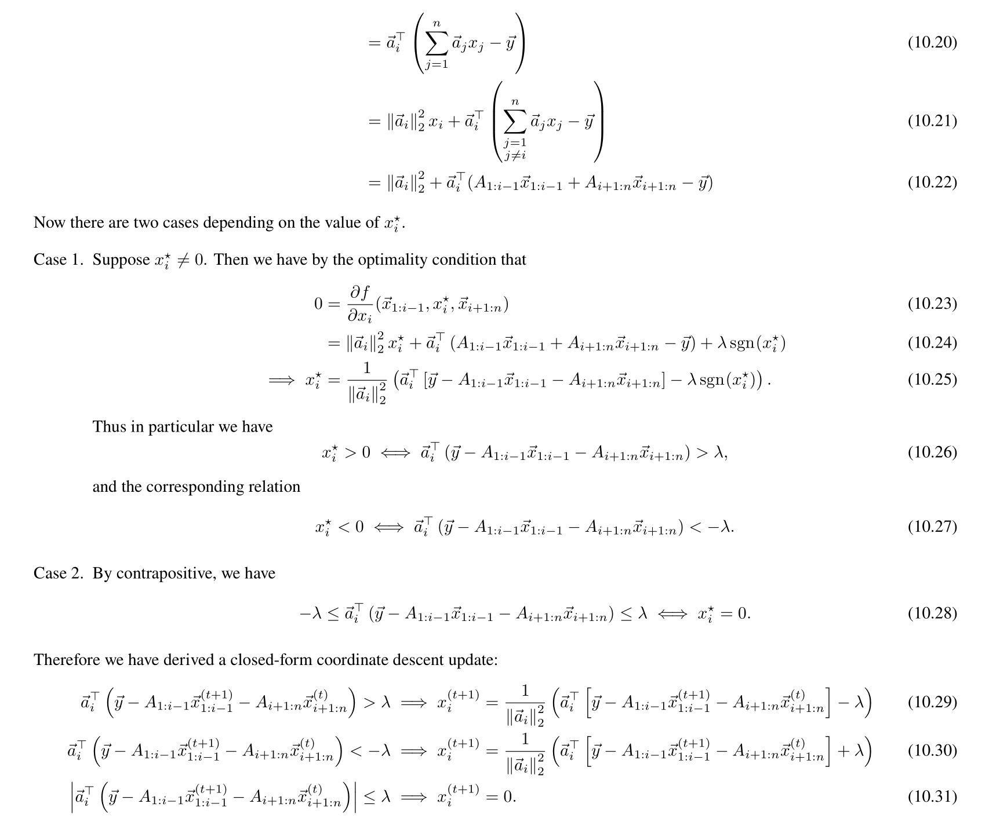

# Basic Setups
> [!def]
> Consider the LASSO Problem as follows:
> $$\min_{\vec{x}\in \mathbb{R}^n}\frac{1}{2}\|A\vec{x}-\vec{b}\|_2^2+\lambda\|\vec{x}\|_1$$
> Since the objective function is not differentiable, we can use any kind of traditional gradient descent method, which typically requires computing the gradient w.r.t $\vec{x}$.
> 
> But for LASSO, if we don't want to solve it using slackness trick as we saw in [Analysis of LASSO Regression - Sparsity](../6_Regularization_Sparsity/Analysis_of_LASSO.md#Analysis%20of%20LASSO%20Regression%20-%20Sparsity) and still optimize it under the gradient descent framework, we could opt to what we call "Coordinate Descent".
> 
> The idea of coordinate desent is as follows:
> 
> The algorithm is very intuitive, instead of computing the gradient w.r.t $\vec{x}$, which is impossible, we compute the gradient of each coordinate of $\vec{x}$, while fixing other coordinates fixed at each step and update just that coordinate (denoted by $N$)
> 
> And at the end of each iteration (denoted by $T$), we would have compute the gradient of all the coordinates of $\vec{x}$ and update them correspondingly.
> 
> Written out clearly we have, at the $k-th$ iteration, we will do the following ==seqentially==:
> $$\begin{aligned}& x_1^{(k)}=\underset{y}{\operatorname{argmin}} f\left(y, x_2^{(k-1)}, \ldots x_n^{(k-1)}\right) \\& x_2^{(k)} \vdots=\underset{y}{\operatorname{argmin}} f\left(x_1^{(k)}, y, x_3^{(k-1)}, \ldots x_n^{(k-1)}\right) \\& \vdots \\& x_n^{(k)}=\underset{y}{\operatorname{argmin}} f\left(x_1^{(k)}, x_2^{(k)} \ldots \ldots, x_{n-1}^{(k)}, y\right)\end{aligned}$$
> 

# Optimizing LASSO Function
> [!example]
> Consider the following LASSO function:
> $$f(\vec{x})=\frac{1}{2}\|A \vec{x}-\vec{y}\|_2^2+\lambda\|x\|_1 .$$
> At the very first step of the first iteration, we will treat it first as a quadratic function of $x_1$ and compute the gradient $\nabla_{x_1}f(x_1)$ holding all the other coordinates $x_{2},\cdots,x_n$ fixed.
> 
> Formally written, we have the following:
> 

# Convergence Analysis
> 