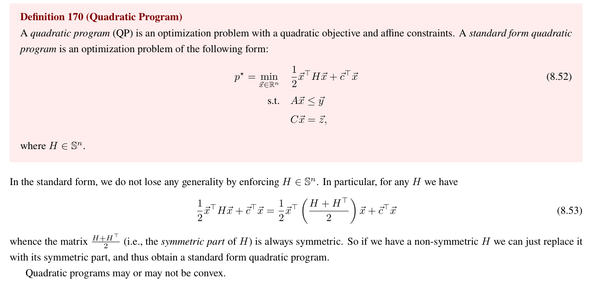
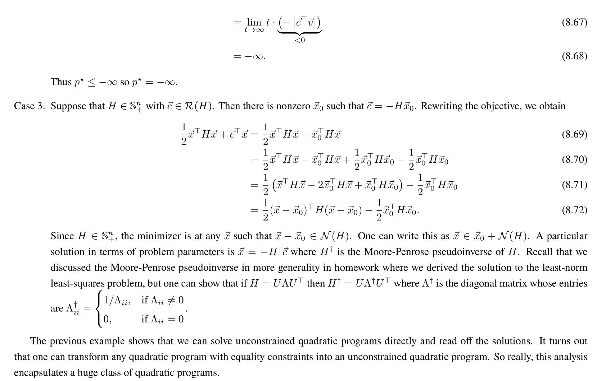
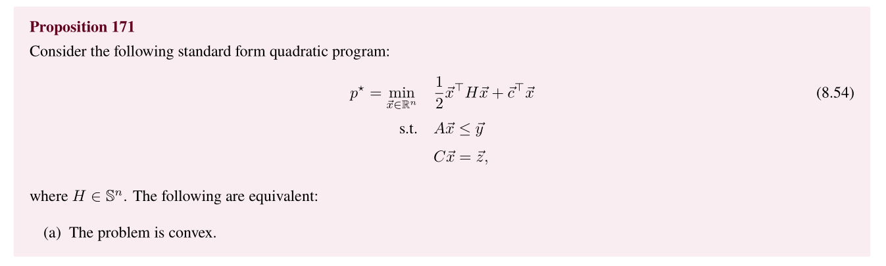
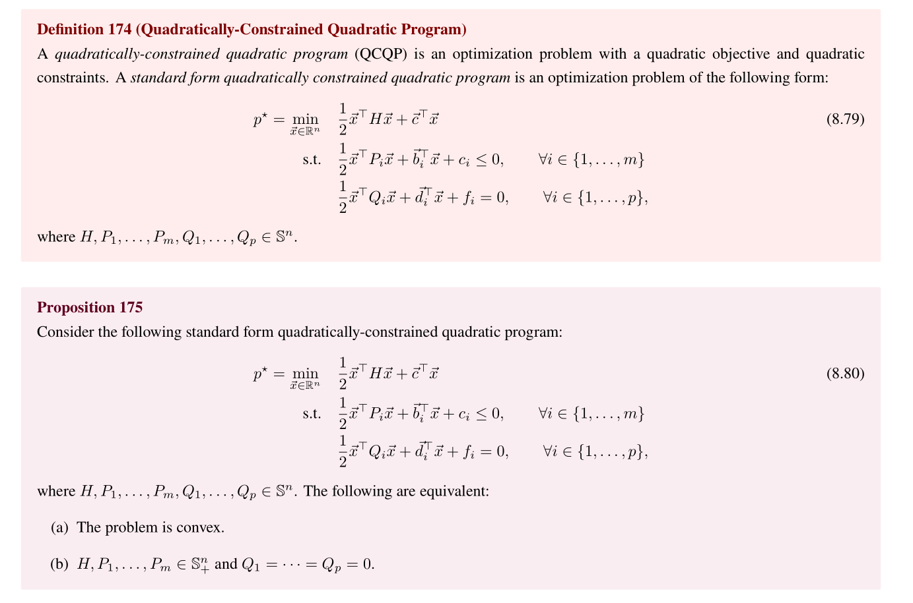
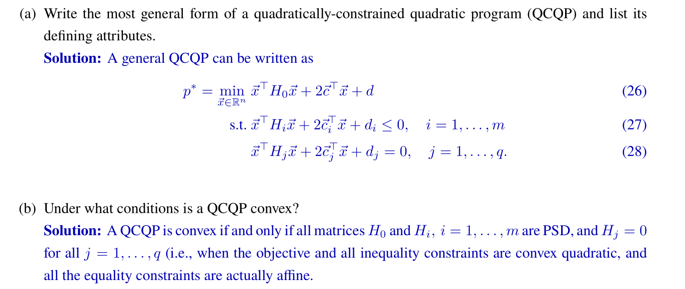

# QP Basics
## Standard Form Definition
> [!def]
> 
> Since $H$ may not be PSD, we know that the problem may not be convex. Because $\nabla^2f=H$ and if $H\succeq 0$, the objective is convex.
> 
> Note that for any quadratic form for non-symmetric matrix $A$, which is $\vec{x}^{\top}A\vec{x}$, we can always transform it into the form of standard form by adding its symmetric counterpart. 

## Solving Uncontrained Quadratic Programs
> [!important]
> 

## Equality Constrained QPs
> [!def]
> 

# QP Properties
## Convexity of QPs
> [!property]
> 

## Duality of QPs
> 

# QCQP Basics
> [!def]
> 

# QCQP Properties
## QCQP Convexity
> [!property]
> 

## QCQP Duality

# Applications
## Linear Control - LQR Problem
> [!def]
> 

