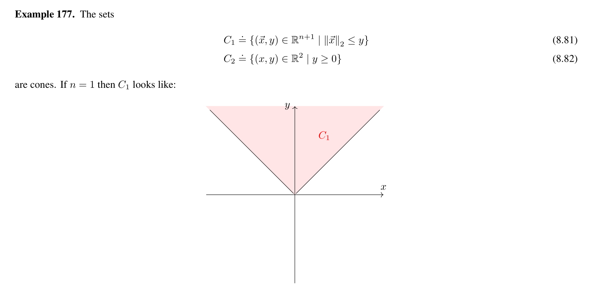
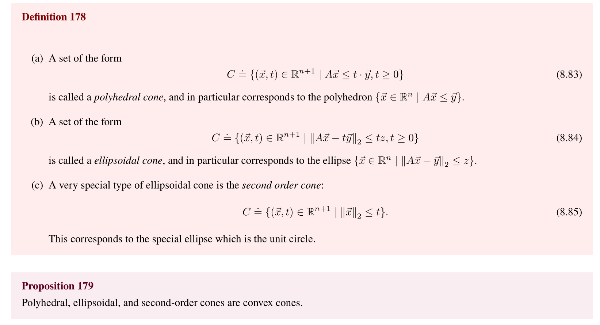
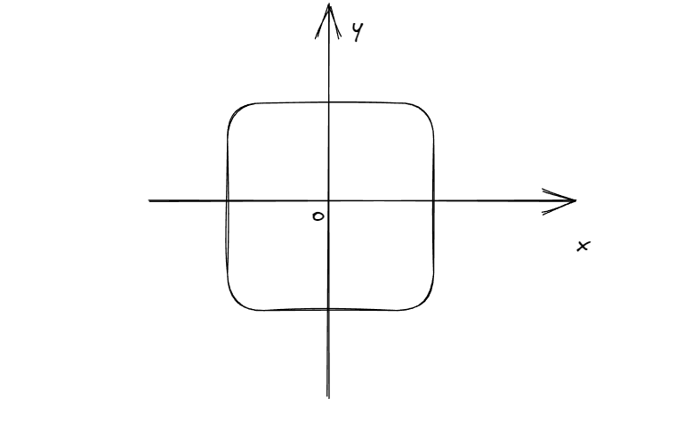
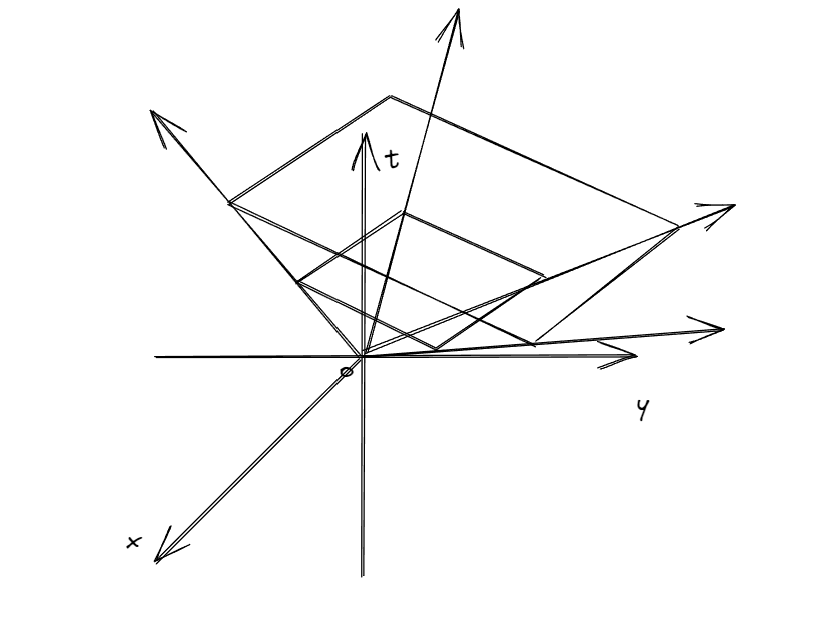
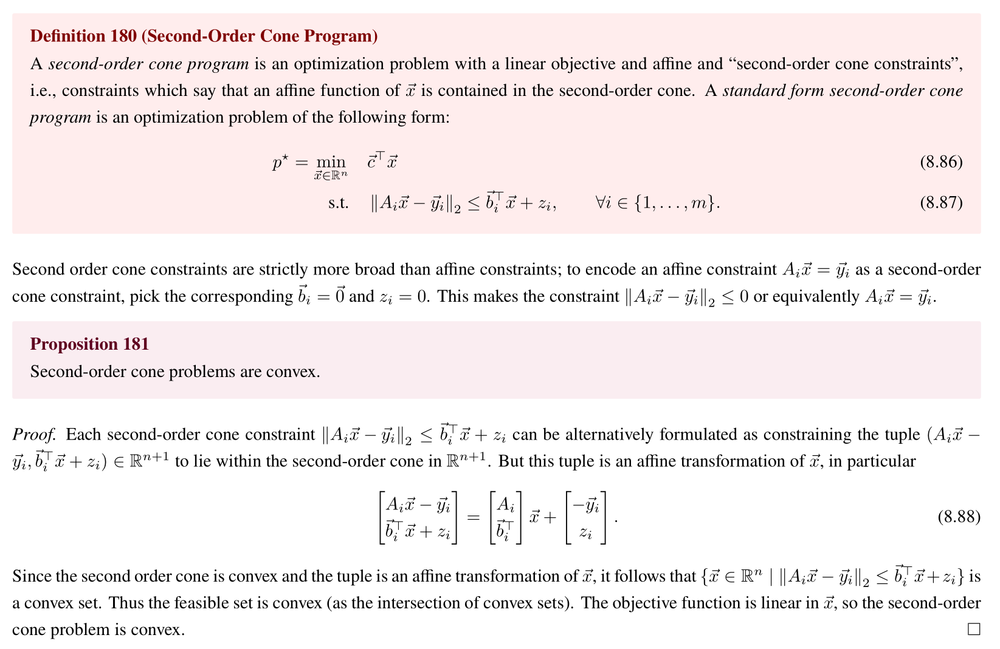
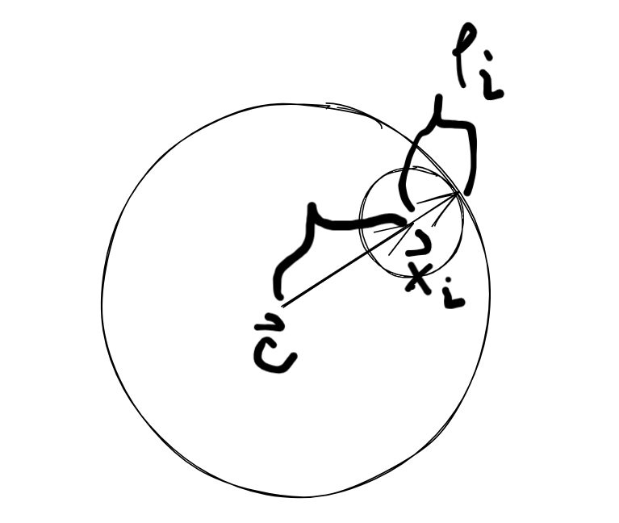
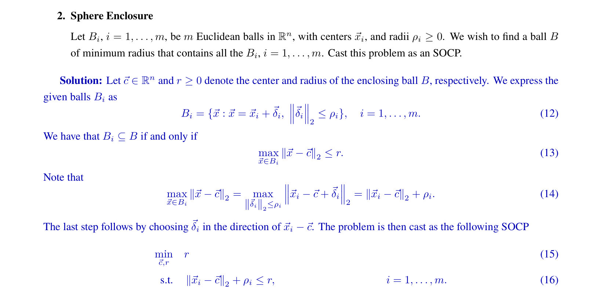
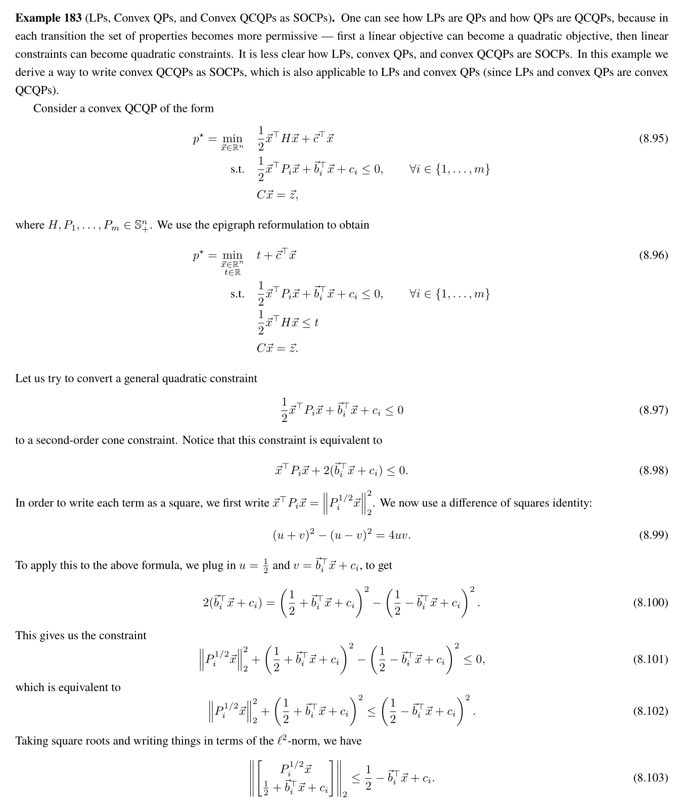
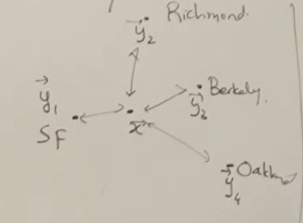

# Cone
## Basic Definition
> [!def]
> 

## Types of Cones
> [!overview]
> There is one more broad class of problems that we consider in this course, called second-order cone programs (SOCPs). They are among the broadest class of problems that we can efficiently solve using algorithms such as the interior point method.
> 

### Polyhedral Cone
> [!def]
> 
> To help you understand what a polyhedral cone looks like, we construct the following examples:
> For example we have the following Polyhedra:
> $$\left\{\begin{aligned}\vec{x} \mid x \leq 2, & x \geqslant-2 ,y  \leqslant 2, y \geqslant-2\end{aligned}\right\} .$$
> We see that this is indeed a polyhedra, which is just the intersection of several halfspaces.
> 
> 
> Now we could define the polyhedra cone on it, which looks like:
>  $$\left\{\begin{aligned}(\vec{x},t) \mid x \leq 2\cdot t, & x \geqslant-2\cdot t , y  \leqslant 2\cdot t,  y \geqslant-2\cdot t\end{aligned}\right\} .$$
>  
>  Just a bunch of parallel polyhedra of different region area with respect to $t$.

> [!property] Polyhedral Cone is always convex
> 

### Ellisoidal Cone
> [!def]
> 
> Recall the definition of an ellipse, originated at $\vec{x}_0$:
> $$\mathcal{E}=\{(\vec{x}-\vec{x}_0)^{\top}P^{-1}(\vec{x}-\vec{x}_0)\leq0\}$$
> We could rewrite the definition to the follow:
> $$x^{\top} P x+q^{\top} x+r \leq 0 \quad P \succ 0$$
> Now consider the following L2 norm defintion, which is, not surprisingly an ellipsoid, as long as $A^{\top}A$ is full rank:
> $$\begin{aligned}& \|A x+b\|_2^2 \leq c^2 \\& x^{\top} A^{\top} A x+2 \vec{b}^{\top} A x+\vec{b}^{\top} b-c^2 \leq 0\end{aligned}$$
> Now back the definition of ellisoidal cone, to see that it is indeed a cone, we go by definition:
> $$\begin{aligned}& \|A(\alpha x)+b(\alpha t)\|_2 \leq c(\alpha t) \\& \alpha\|A x+b t\|_2 \leq \alpha(c \cdot t)\end{aligned}$$
> and we see that $\alpha(x,t)$ in also in $C$ for all $(x,t)$ in $C$.

> [!property] Ellipsoid Cone is always convex
> 
> 

### Second-Order Cone
> [!def]
> 
> A quick example is as follows where $n=2$ as follows:
> 
> 
> As the geometry indicates, this is sometimes called "ice-cream" cone.

> [!property] Second-Order Cones are always convex

# Second Order Cone Program
## Definition
> [!def]
> SECOND-ORDER CONE PROGRAMMING (SOCP) is a generalization of linear and quadratic programming that allows foraffine combinations of variables to be constrained inside a special convex set, called a second-order cone. 
> 
> The SOCP model includes as special cases LPs, as well as problems with convex quadratic objective and constraints. 
> 
> SOCP models are particularly useful in geometry problems, approximation problems, as well as in probabilistic (chance-constrained) approaches to linear optimization problems in which the data is affected by random uncertainty.
> 
> Data uncertainty also motivates the introduction in this chapter of robust optimization models, which enable the user to obtain solutions that are resilient (robust) against the uncertainty that is in practice often present in the description of an optimization problem.
> 

## Standard Form
> [!def]
> 

## Conic Standard Form
> [!def]
> 

## SOCP Reformulation
> [!example] Second Order Cone Reformulation
> 
> One way of reformulating this problem is similar to what we have done in the  [Min L1 Norm](../6_Regularization_Sparsity/Analysis_of_LASSO.md#Min%20L1%20Norm), where we can introduce a slack variable:
> $$\begin{aligned}p^{\star}=\min _{\substack{\vec{x} \in \mathbb{R}^n \\\vec{s} \in \mathbb{R}^m}} & \sum_{i=1}^m s_i \\\text { s.t. } & \left\|A_i \vec{x}-\vec{y}_i\right\|_2 = s_i, \quad \forall i \in\{1, \ldots, m\}\end{aligned}$$
> Note that here we are optimizing both $\vec{x}$ and $\vec{s}$ instead of just $\vec{x}$. The reason is that $\vec{s}$ may be a function of $\vec{x}$ and optimizing $\vec{s}$ considers the dependence between variables.
> 
> In order to proceed, then we can use a common technique that has appeared in this example [Problem Transformations - Relaxing Affine Constraints](../3_Convex_Optimization/Lagrangian_Duality_Theory.md#Problem%20Solving%20Strategy#Problem%20Transformations%20-%20Relaxing%20Affine%20Constraints) and get the following reformulation, which is a second order cone program:
> 
> 
> Why is this reformulation valid, we can think this way:
> Suppose we have an optimization problem $$\begin{align}\min_{\vec{x},\vec{b}\in \mathbb{R}^n}&\vec{b}\\s.t.&A\vec{x}\leq \vec{b}\end{align}$$
> We can reformulate it as follows:
> $$\begin{align}\min_{\vec{x},\vec{b}\in \mathbb{R}^n}&\vec{b}\\s.t.&A\vec{x}+\vec{s}=\vec{b}\\&\vec{s}\geq0\end{align}$$
> The reason why the optimal points is the same as the original one is that we are minimizing the $\vec{b}$, which means if we pick $\vec{s}\geq\vec{0}$, then since $\vec{b}=A\vec{x}+\vec{s}$, we have $\vec{b}\leq A\vec{x}$. Since we are minizing over $\vec{b}$, so taking $\vec{b}$ to be as close as $A\vec{x}$ is more optimal, so the optimal points should be on the boundary.
> 
> Note that this kind of relaxing trick in most cases work but there are still some types of problem where this trick won't work as desired.

## SOCP Properties

## Applications
### Sphere Enclosure
> [!example] Fa22 Disc11 P2
> To formulate an optimization problem, we first need to know the variables that we are optimizing on. Since we want to find a ball, we must find the center(denoted by $\vec{c}$) and the radius(denoted by $r$) of the ball.
> 
> Then, we need to find some constraints on $\vec{c}$ and $r$. And the only constraint here is the fact that the ball parametrized by $(\vec{c},r)$ should contain all the balls parametrized by $(\vec{x}_i,\rho_i)$. 
> 
> So how to connect these information:
> 1. In order for $B_i$ to be inside of the Ball $B$, we have to ensure that all the points inside $B_i$ should be in $B$. At the corner case, when the $B_i$ is perpendicular to $B$, we get that $\|\vec{x}_i-\vec{c}\|_2=r-\rho_i$, as shown in the figure below:
> 
> 
> 2. Given thus we know that the farthest point in the $B_i$ from $\vec{c}$ is the perpendicular point, and we claim that the farthest point in any $B_i$ should be within $B$ in order for $B$ to contain $B_i$.
> 3. The next step is to get the expression for the farthest point of $B_i$ to $\vec{c}$, which is the step shown in the solution.
> 
> 

# LP,QP,QCQP=>SOCP
> [!example]
> 

## LP as SOCP

# SOCP Duality Analysis

# Modeling Applications
## Facility Location Problem
> [!example] Facility Location Problem C.E.G. pp286
> 
> 

## Trilateration/GPS Problem
> [!example] Trilateration/GPS - EECS16A, C.E.G pp287
> 

## Sphere Enclosure
> [!example] EECS127 Fa22 Disc11 P2
> 
