# Min-norm L1 Problem
## Min L1 Norm 
> [!def]
> Consider the following convex optimization problem:
> 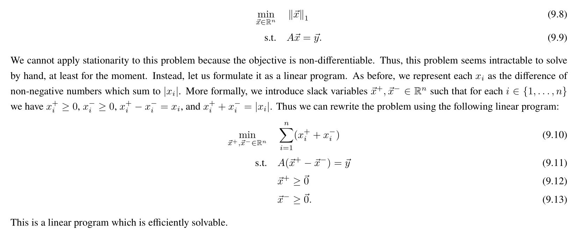
> As shown above, we can easily transform the original program into an LP program and even conic form, which is easy to solve.
> 
> The reason why we want to rewrite the problem in this form is that we want to get rid of the absolute value in our L1-norm definition.
> 
> Here we don't even have to introduce slack variables, becase we only have equality constraints.
> 
> **The next important questions are that:**
> - Why this problem formulation is preventing the solver from choosing something like $\vec{x}_i^+=10$ and $\vec{x}_i^-=3$ and opt to choose something like $\vec{x}_i^+=7$ and $\vec{x}_i^-=0$. 
> - Why is there only one non-zero element? Why will the computer not pop out $\vec{x}_i^+=10$ and $\vec{x}_i^-=3$? 
> 
> The answer is as follows:
> 
> **Claim:** This new program will always choose only one of $\vec{x}_i^+$ or $\vec{x}_i^-$ nonzero. In other words, the program won't allow $\vec{x^*}_i^+>0$ and $\vec{x^*}_i^->0$ to be optimal values that are returned.
> 
> **Proof:** Suppose $\vec{x}_i^+>0$ and $\vec{x}_i^->0$, we want to see whether changing these two values for a little bit will cause some contradiction. So we consider $\vec{x}_i^+-\epsilon$ and $\vec{x}_i^{-}-\epsilon$, where $\vec{x}_i^+>\vec{x}_i^-$ and $\epsilon>0$ without loss of generality. What we are doing here is that we want to shift the $\vec{x}_i^+$ and $\vec{x}_i^-$ the same quantity and still satisfy the constraints. 
> 
> So we could consider $\vec{x}_{i,new}^+=\vec{x}_i^+-\vec{x}_i^-$ and $\vec{x}_{i,new}^-=\vec{0}$, we could consider that both $\vec{x}_i^+$ and $\vec{x}_i^-$ is shifting by $\vec{x}_i^-$ to the left of the axis. Note that now the constraints are still met. 
> 
> Now we focus on the objective function: 
> We have $\vec{x}_{i,new}^++\vec{x}_{i,new}^-=\vec{x}_i^+-\vec{x}_i^-+\vec{0}<\vec{x}_i^++\vec{x}_i^-$, which is indeed a contradiction.
> 
> Therefore, any optimization will satisfy this constraints, any solution to this problem will be the solution to the original problem because we have just proved that any solution that are returned from LP formulation are valid in the original problem.

## L1 Least Square
> [!def]
> 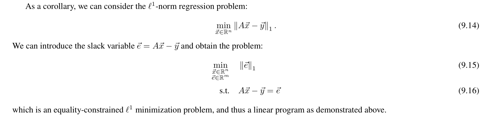
> So this is basically the same trick as above.

## Mean Versus Median
> [!def]
> We first consider the following problem, which computes the mean of a set of data points $\vec{x}_1,\cdots,\vec{x}_k\in\mathbb{R}^n$:
> 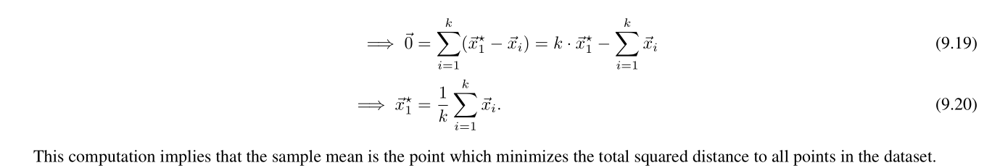
> Now, as the main theme goes, we consider the L1 isotope of it:
> 
> 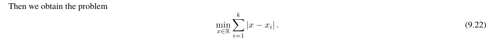
> This seems very familiar to the framework of min L1 norm. But before deriving the LP form of it we consider the following toy example to get you prepared:
> 
> Suppose we have $b_1,\cdots,b_7$, 7 data points in total:
> 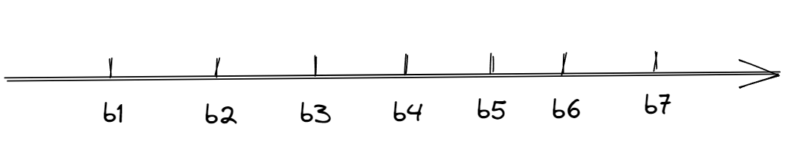
> we then define:
> $$\left|x-b_i\right|= \begin{cases}x-b_i & \text { if } x>b_i \\ b_i-x_i & \text { if } x \leq b_i\end{cases}$$
> The question is that how we can take the derivative of this function $\left|x-b_i\right|$, we break up into three cases:
> $$\frac{d}{d x}\left|x-b_i\right|= \begin{cases}1 & \text { if } x>b_i \\ -1 & \text { if } x<b_i \\ \text { DNE } & \text { if } x=b_1\end{cases}$$
> 
> But this is only for one point, the objective is a sum of such absolute value, formally we want to compute the derivative of :$$\frac{d}{d x}\left(\sum_{i=1}^{7}\left|x-b_i\right|\right)$$
> Now we consider the position of $x$ relative to $b_i,\forall i$:
> $$\frac{d}{d x}\left(\sum_{i=1}^n\left|x-b_i\right|\right)=\left\{\begin{array}{cc}-7 & \text { if } x<b_1 \\-5 & \text{if } b_1<x<b_2 \\\vdots \\7 & \text { if } x>b_7\\DNE & \text { if } otherwise\end{array}\right.$$
> 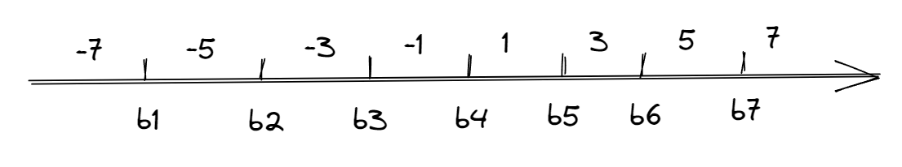
> Considering all the cases above is tedious, but we can actually utilize some symmetry within the summation of absolute value function.
> 
> Notice that what absolute value is doing is actually computing the distance between points, so $\forall x\in(b_3,b_5)$, we should have $|x-b_3|+|x-b_5|$ as a constant, because it is just $|b_5-b_3|$ from the graph.
> 
> Generally, we could write:
> $$\sum_{i=1}^7\left|x-b_i\right|=\left|x-b_4\right|+\sum_{i \neq 4}\left|x-b_i\right|$$
> where the second term is a constant, and we only have to minimize the first term.
> 
> Here, median is "robust" compared to the mean. What does "robust" mean by the way? Because median stays the same if for example you change $b_7$ to positive infinity and mean will change dramatically.
> 
> **The above example however doesn't generalize to the vector cases.**
> 
> Also note that if there are an even number of points, the median cannot be defined as an optimization problem as above because otherwise we have to ensure that the minimizer is the sum of the two middle points, but the optimization formulation will just return any value between the middle points.

# Sparsity Analysis of LASSO Regression
## Sparsity - 1d Case
> [!important]
> In this section we will solve the one-dimensional LASSO problem. The ideas generalize to the vector case directly, through a reduction of the vector LASSO problems to several one-dimensional LASSO problems, as we will show later.
> 
> Now we change to the LASSO case:
> 
> 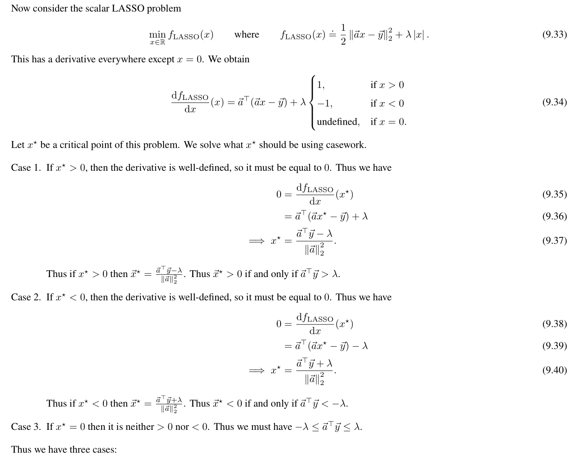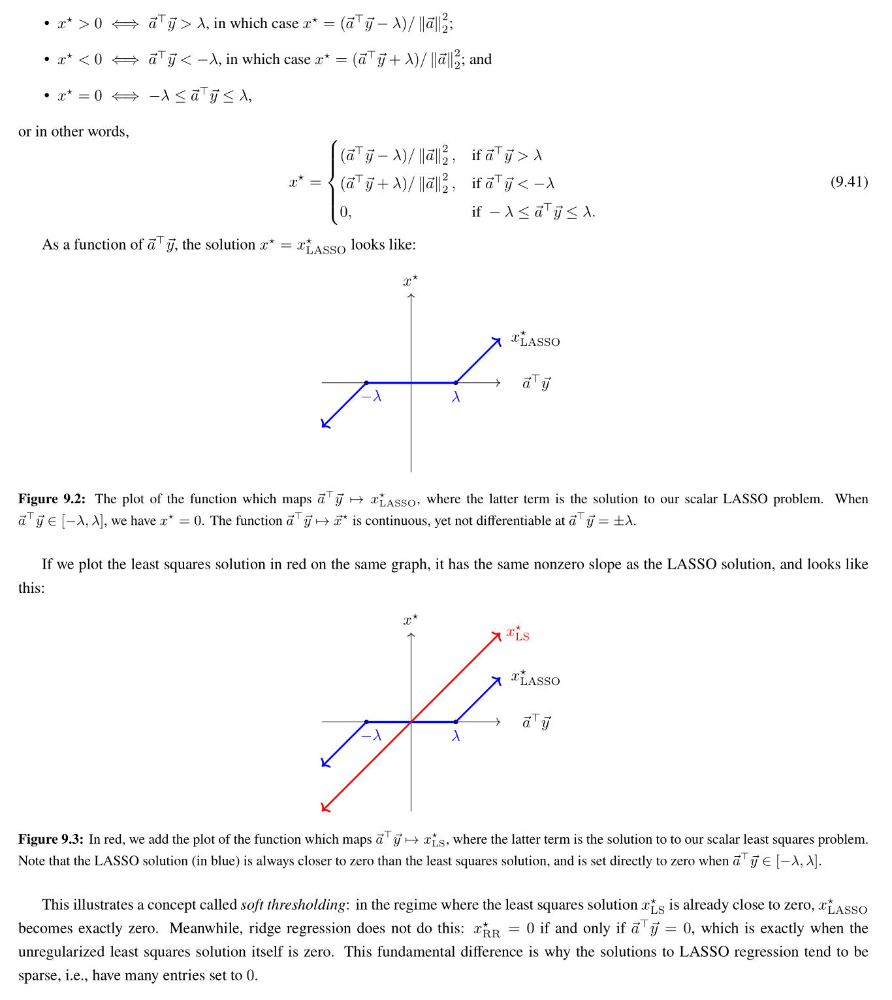

## Sparsity - nd Case
> [!important] EECS189 Fa23 Disc2 P1
> 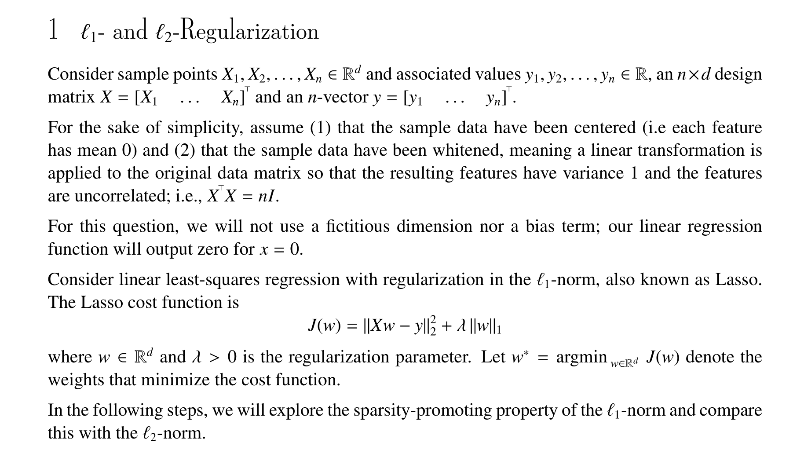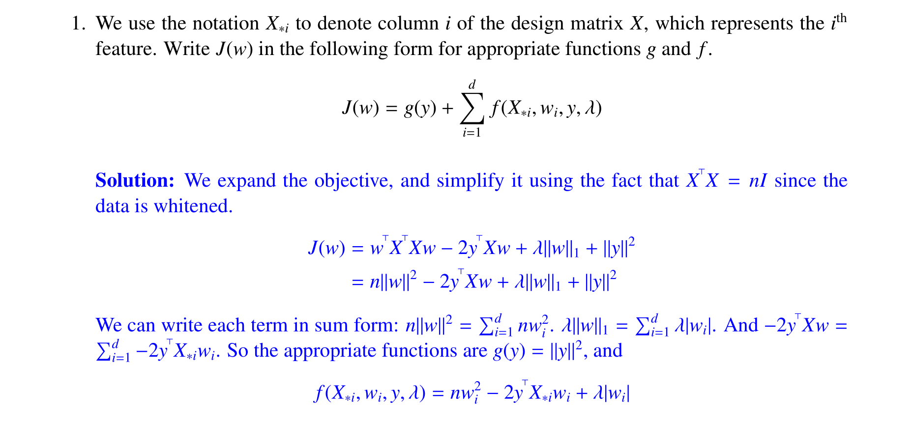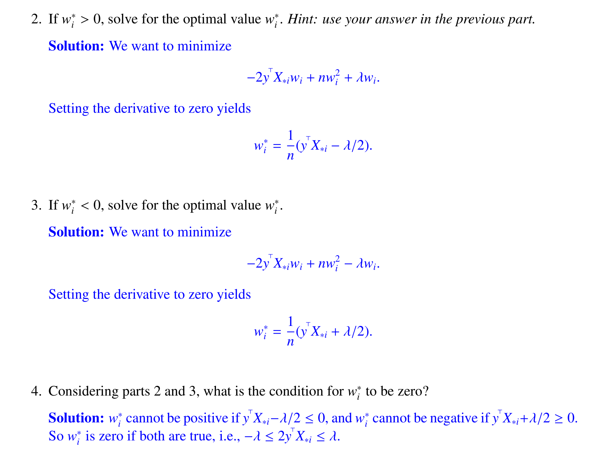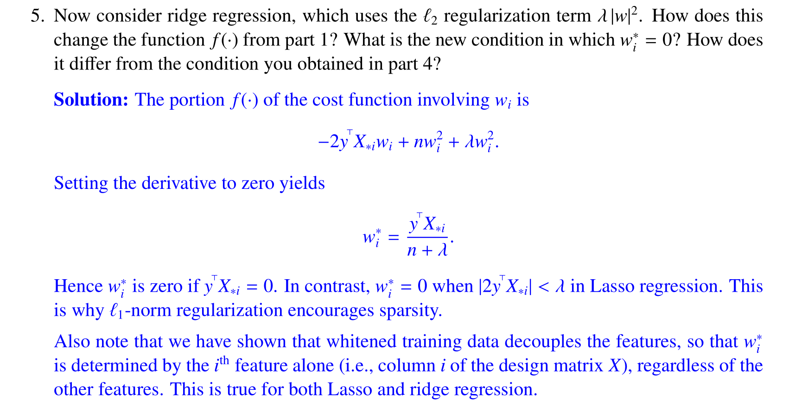

# Geometry of LASSO Regression
> [!important]
> 

