# Characteristic Function Definition
> [!def]
> 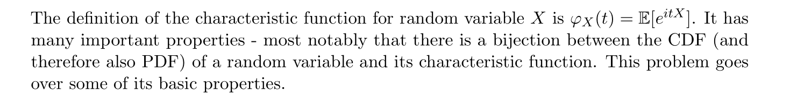

# Character Function Examples
## Rademacher RV
> [!example]
> 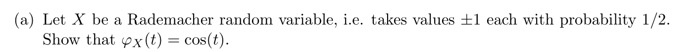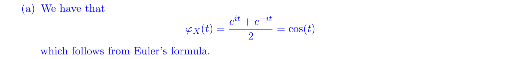

## Uniform RV
> [!example]
> 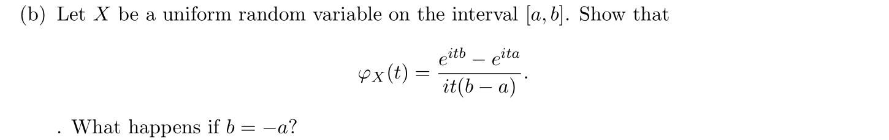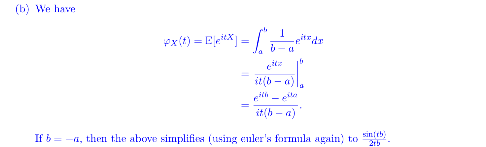

# Properties of CF
## Complex Conjugate
> [!important]
> 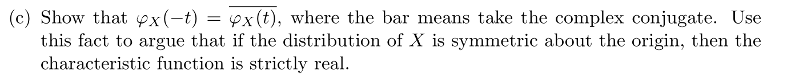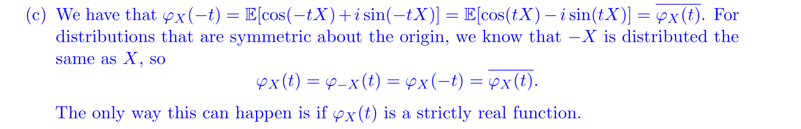
> Here $\varphi_{-X}(t)=\varphi_X(-t)$ is by the change of variable in integral.

## Derivatives are Moments
> [!important]
> 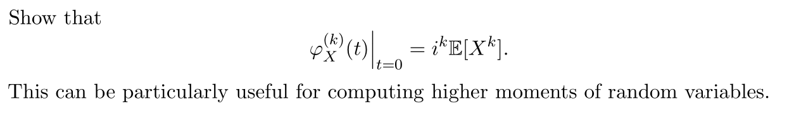
> $$\begin{aligned}\varphi_x(t) & =E\left[e^{i t X}\right] \\& =E\left[\sum_{m=0}^{\infty} \frac{(i X)^m t^m}{m !}\right] \\\varphi_X^{(k)}(t) & =E\left[\sum_{m=0}^{k=1} \cdot 0+\frac{(i X)^k t^0}{k !} \cdot k !+\sum_{m=k+1}^{\infty} p(t)\right] \\\left.\varphi_X^{(k)}(t)\right|_{t=0} & =E\left[(i X)^k\right] \\& =i^k E\left[X^k\right]\end{aligned}$$ where $p(t)$ is a polynomial of $t$ and $p(t)=0$ at $t=0$.

## Independence
> [!def]
> 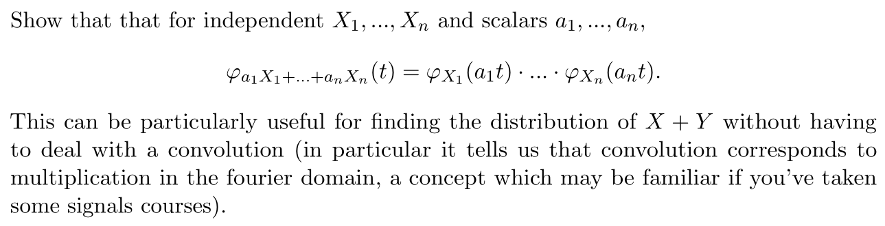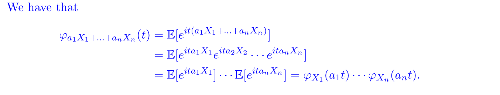

# Rotationally Invariant R.V.
## Definition
> [!def]
> 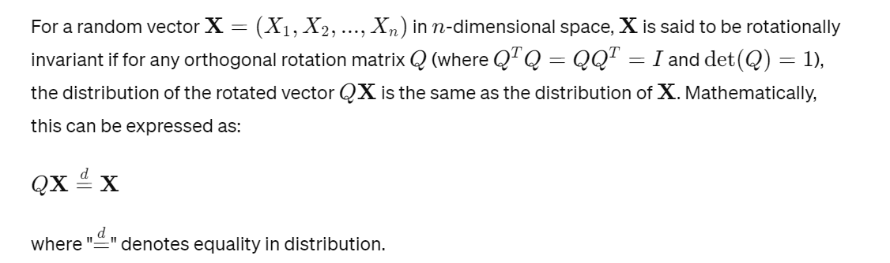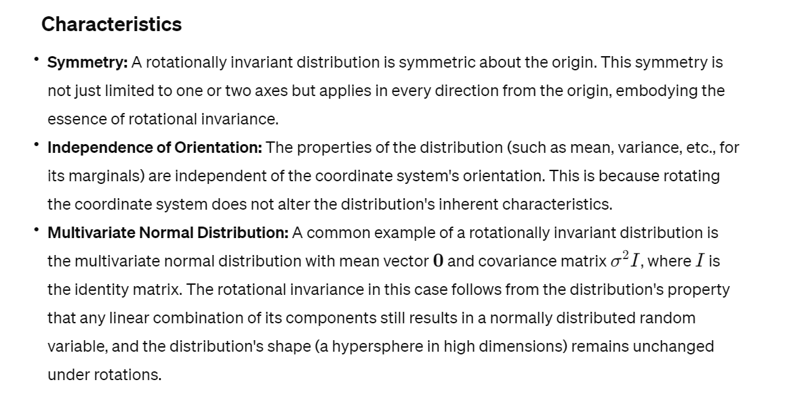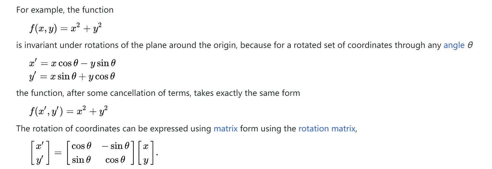

## Properties
> [!property]
> For a random variable $X$, we have the following properties that come in handy in proof:
> 1. $\varphi_{cX}(t)=\varphi_X(ct)$
> 2. $\varphi_{X+Y}(t)=\varphi_X(t)\varphi_Y(t)$ given that $X\perp Y$.

## Gaussian Example
> [!example] Fa21 HW6 P4
> 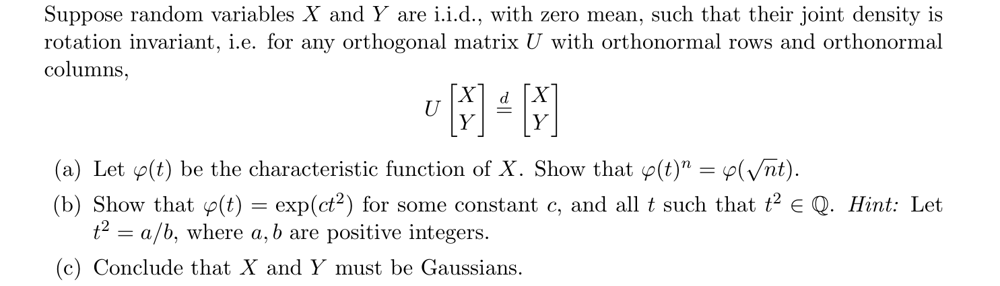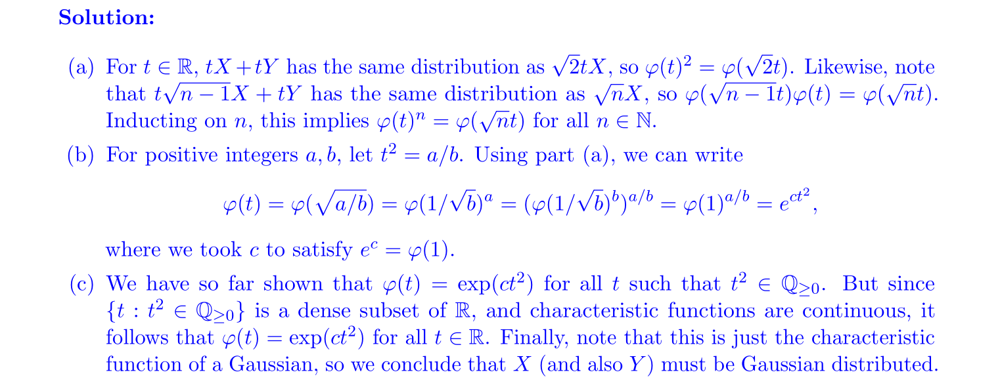
> In question (a), the rotation matrix that we choose could be $$\begin{bmatrix}\frac{1}{\sqrt{n}}&-\frac{\sqrt{n-1}}{\sqrt{n}}\\\frac{\sqrt{n-1}}{\sqrt{n}}&\frac{1}{\sqrt{n}} \end{bmatrix}$$, then we can prove using mathematical induction.
> 
> In question (c), we encounter the concept of [P1 Density of R Q](../../../../Mathematics/Analysis/18_100A_Real_Analysis/L5_L6__Properties_of_Real_Numbers__Sequence_and_Limits__Basic_Topology.md#P1%20Density%20of%20R%20Q), which intuitively means:
> 
> 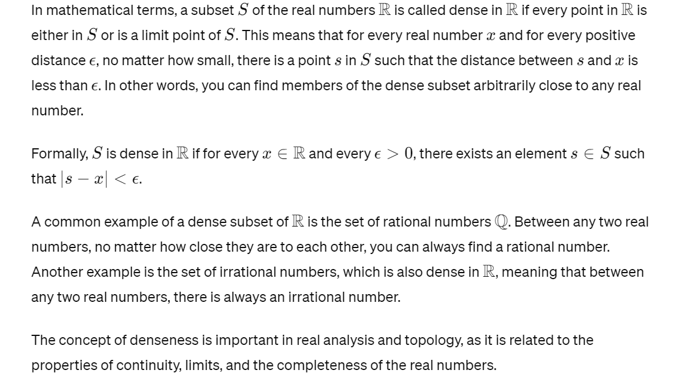
> The reason $\{t:t^{2}\in\mathbb{Q}\}$ is dense is as follows:
> 
> 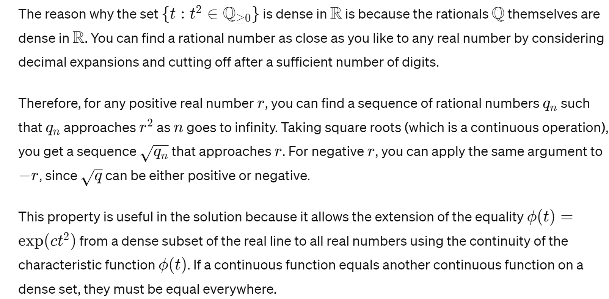
> The reason why the last sentence holds is that:
> 
> 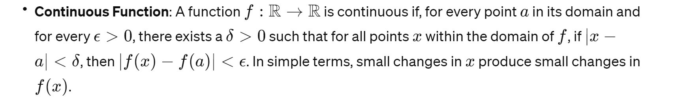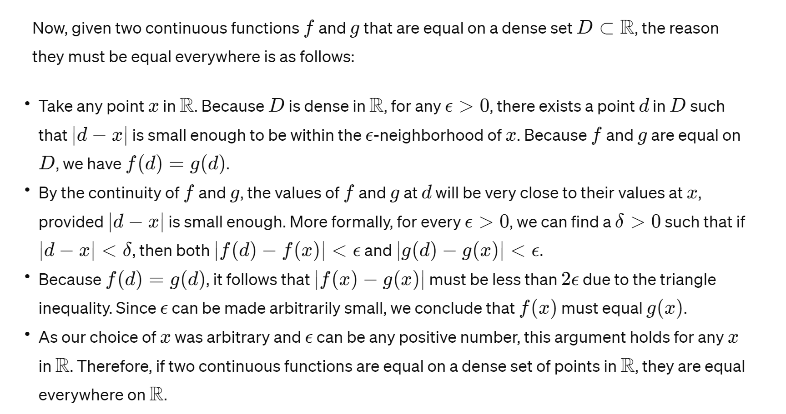

