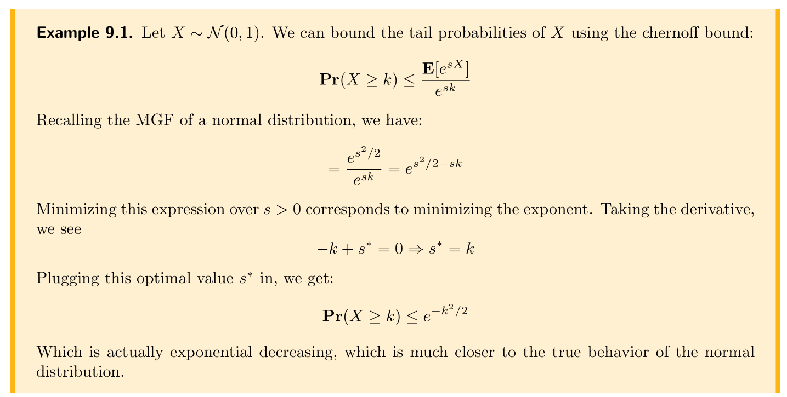
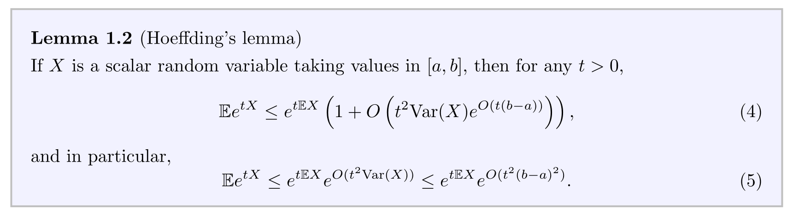

# Laplace Transformation
## Step and Delta Function

## Definition
> [!def]
> 

## Computing Examples
> [!example]
> 

# Moment Generating Function
## Definition
> [!def]
> 

## Examples
> [!example]
> 

# Basic Bounds
## Markov Bound
> [!def]
> 

## Chebyshev's Bound
> [!def]
> 

# Moment Bounds
## Moment Methods
> [!def]
> 

> [!proof] Proof: First Moment

> [!proof] Proof: Second Moment

## Higher-Order Markov Bounds
> [!important]
> 

## Chernoff Moment Bounds
> [!def]
> 

> [!example] Chernoff Mement Bound for Gaussian
> 
> **Derivations for 9.2:** 
> 
> Suppose we know the MGF of $X$, which is $M_x(s)$, then by markov inequality we have:
> $$P\left(e^{-s x} \geqslant e^{s k}\right) \leqslant \frac{E\left[e^{-s x}\right]}{e^{s k}}$$
> $\because f(x)=e^x$ is monotonically increasing.
> 
> $$\begin{aligned}\therefore P(x \leqslant-k) & \leqslant \frac{E\left[e^{-s x}\right]}{e^{s k}} \\& =\frac{M_x(-s)}{e^{s k}} \\& =\frac{e^{\frac{1}{2} s^2}}{e^{s k}}\end{aligned}$$
> 
> Minimizing $g(s)=e^{\frac{1}{2} s^2-k \cdot s}$ we get $g^*(s)=e^{-\frac{1}{2} k^2}$
> $$\begin{aligned}\therefore P(X \leq-k) & \leq e^{-\frac{1}{2} k^2} \\\therefore P(|X| \geqslant k) & =P(X \geqslant k)+P(X \leq-k) \\& =2 e^{-\frac{1}{2} k^2}\end{aligned}$$

# Hoeffding/Chernoff Bounds
## Hoeffding's Lemma
> [!lemma]
> 

> [!proof]
> 

## Hoeffding's for Sub-Gaussian
### Lemma 
> [!lemma]
> 

> [!proof]
> 

### Inequality
> [!important]
> 

> [!proof]
> 

## Hoeffding Bound
> [!def]
> 

# Chernoff Bounds
## Chernoff Bound for Bounded R.V.
> [!def]
> 
> Alternative Representation is:
> 
> 

## Chernoff Bounds for Bernoulli Sum
> [!def]
> 

> [!proof] Proof
> 

> [!example] Coin Tossing
> 

## Chernoff Bounds For Sub-Gaussian
> [!def]
> If $X$ is $\sigma^2$-[sub-gaussian](../../../../Mathematics/NYU_Master_Program/DS-GA-1005/Sub-Gaussian.md) 
> 

