# Types of Convergence 
## Convergence Almost Surely
### Motivation
> [!motiv] Motivation
> Suppose we have a probability space $(\Omega,\mathcal{F},\mathbb{P})$ and a random variable $X:\Omega\to \mathbb{R}$, then almost sure convergence tries to describe whether for all possible discrete outcome $s\in \Omega$ or continuous one$[a,b]\in \Omega$, we have $\lim_{n\to \infty}X_n(s)=X(s)$. (For simplicity we consider the discrete case).
> **Remarks:**
> 1. $X_n(s)$ is a random sequence when the input outcome is $s$.
> 2. $X_n(s_i)$ is usually different for different $s_{i}$.
> 
> **Note:**
> `Convergence almost surely` is also called `Convergence with Probablity 1`

### Main Definition
> [!thm] 
> We say that a random sequence $(X_n)_{n\in \mathbb{N}}$ converges almost surely if:
> 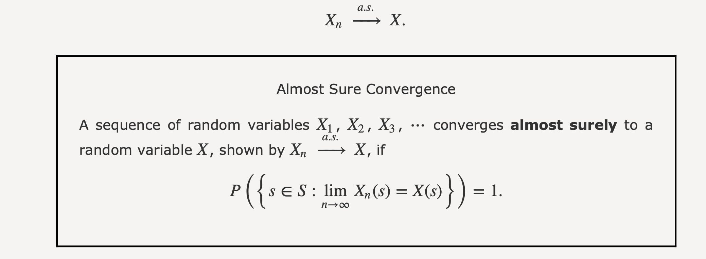

### How to Show?
> [!motiv] Motivation
> Sometimes, going straight from the definition to determine whether a random sequence converge almost surely is difficult. 
> 
> Alternatively, we can utilize the theorem below to determine a.s. convergence:

#### Sufficient Condition
> [!thm]
> 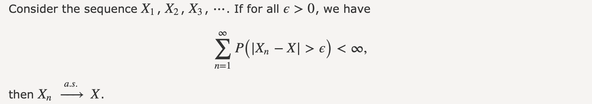

> [!example]
> 

#### Sufficient and Necessary Condition
> [!thm]
> 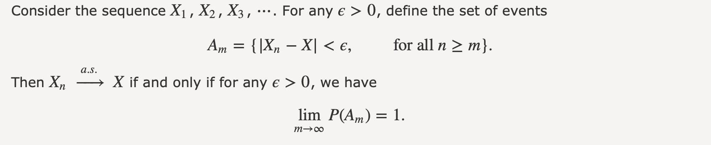

> [!example]
> 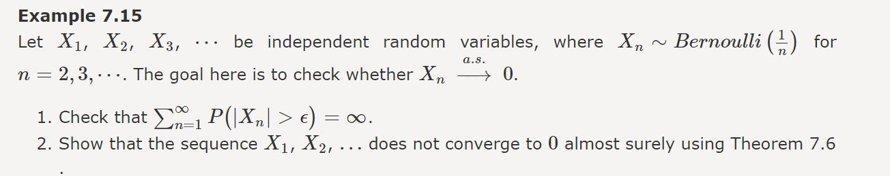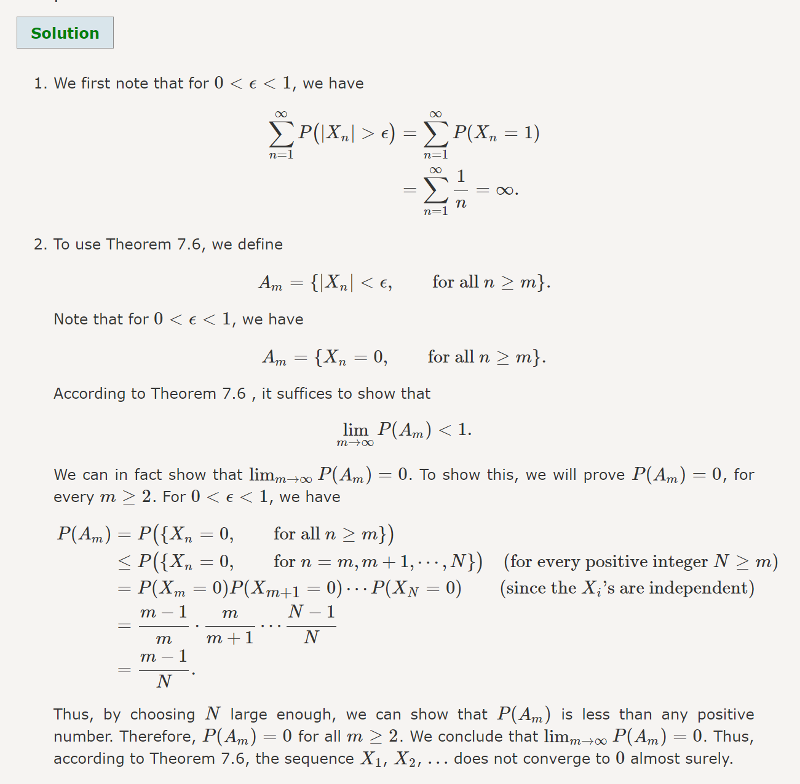

#### Borel-Cantelli Lemma
> [!thm]
> 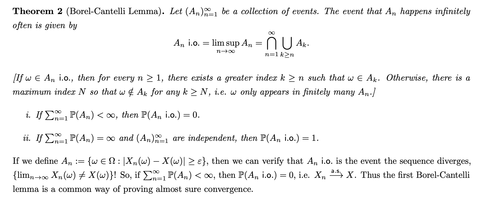

### Examples
#### SLLN
> [!important]
> 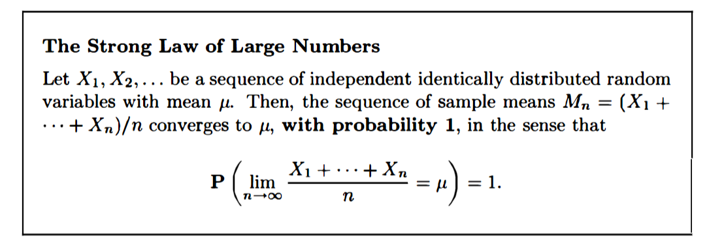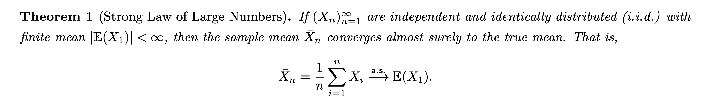
> Borel-Cantelli Lemma is used to show strong law of large number. Proof see [Borel-Cantelli&Strong Law](Probability_Formulas_and_Theorems.md#Borel-Cantelli&Strong%20Law)

#### Discrete Sample Space - Not Convergent
> [!example]
> https://www.probabilitycourse.com/chapter7/7_2_7_almost_sure_convergence.php
> 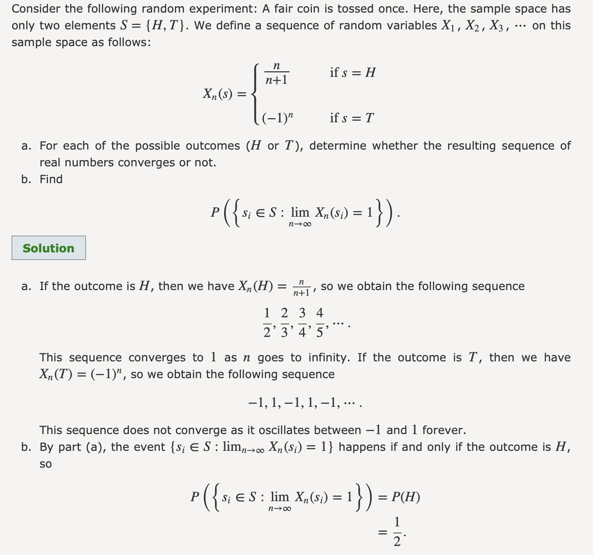

#### Continuous Sample Space - Convergent
> [!example]
> 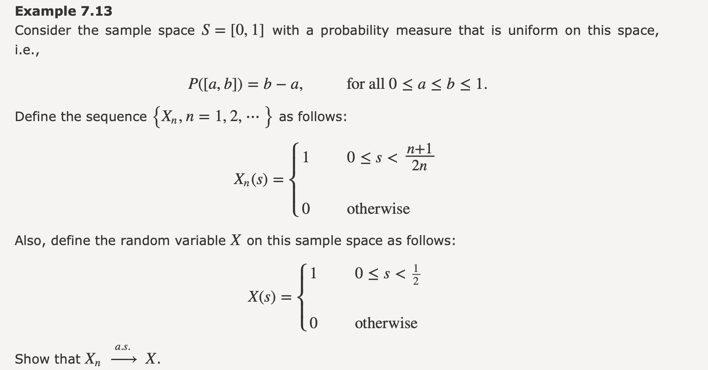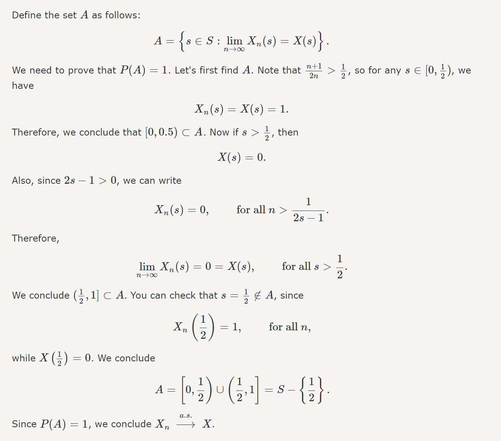

## Convergence in Probability
### Motivation
> [!motiv] Motivation
> 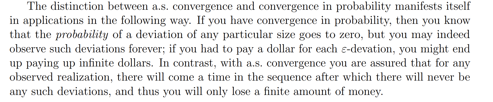
> 总的来说，`Converge Almost Surely`是一个比`Convergence In Probability`更强的条件。
> - 因为对于`Convergence in Probability`来说，他只能保证事件$|X_n-X|>\epsilon$的概率趋近于零，而$0<|X_n-X|<\epsilon$这个事件仍然会发生, 也就是说只要时间足够长我们总能观测到$X_n$偏离$X$的事件。
> - 但是对于`Convergence Almost Sure`来说，他能保证事件$X_n\neq X$ 的概率为零，也就是只要时间足够长，$X_n$就完全不会偏离$X$。

### Main Theorem
> [!thm]
> In particular, for a sequence $X_1, X_2, X_3, \cdots$ to converge to a random variable $X$, we must have that $P\left(\left|X_n-X\right| \geq \epsilon\right)$ goes to 0 as $n \rightarrow \infty$, for any $\epsilon>0$. To say that $X_n$ converges in probability to $X$, we write$$X_n \stackrel{p}{\rightarrow} X$$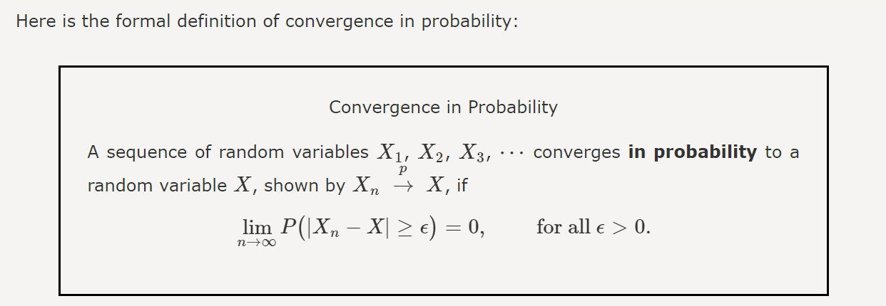

### WLLN
> [!important]
> 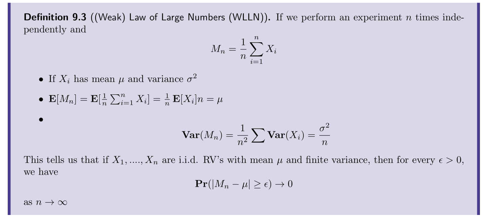

### Examples
#### P Convergence but not A.S. Convergence
> [!important]
> 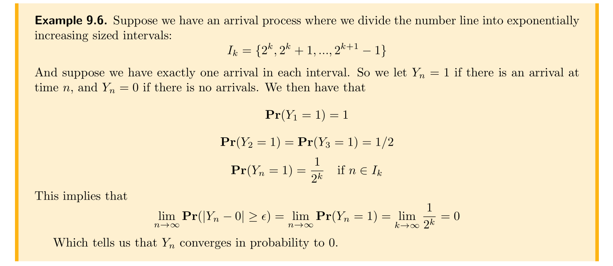
> Note that here we need $\lim_\limits{n\to \infty}P(|Y_n|>\epsilon)=0,\forall\epsilon>0$. If $\epsilon\in(0,1)$, then $P(|Y_n|>\epsilon)=P(Y_n=1)$. If $\epsilon>1$, then $P(|Y_n|>\epsilon)=0$.
> 
> In either case, we have convergence in probabilty.
> 
> 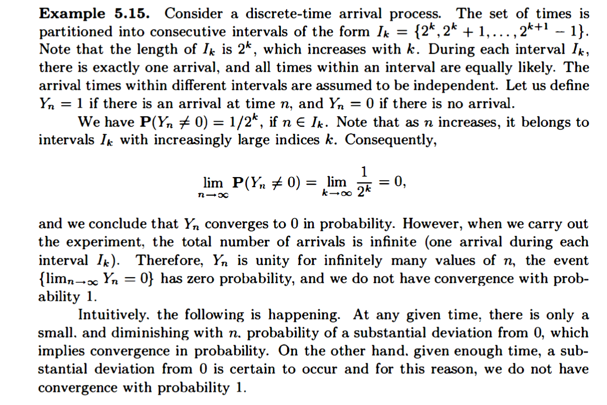

#### Uniform Distribution
> [!example] Uniform Distribution: Fa23 Disc05 P2
> 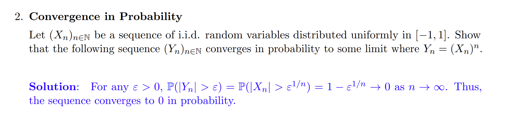
> Here when $\epsilon>1$, we have $P(|X_n|>\epsilon^{\frac{1}{n}})=0$. So we only need to focus on the cases where $\epsilon\in (0,1)$.
> 
> We want to test whether:$$\begin{aligned}\lim _{n \rightarrow \infty} P\left(\left|Y_n-0\right|>\varepsilon\right) & =0 \\\Leftrightarrow \lim _{n \rightarrow \infty} P\left(\left|X_n\right|^n>\varepsilon\right) & =0\end{aligned}$$When $\mathcal{E}>1$, we have:$$\lim _{n \rightarrow \infty} P\left(\left|X_n\right|>\varepsilon^{\frac{1}{n}}\right)=0$$
> 
> When $0<\varepsilon \leqslant 1$, we have$$\begin{aligned}\lim _{n \rightarrow \infty} p\left(\left|x_n\right|>\varepsilon^{\frac{1}{n}}\right) & =\lim _{n \rightarrow \infty} P\left(\varepsilon^{\frac{1}{n}}<x_n<1\right)+P\left(-1<x_n<-\varepsilon^{\frac{1}{n}}\right) \\& =\lim _{n \rightarrow \infty} \frac{1-\varepsilon^{\frac{1}{n}}}{2} \cdot 2 \\& =\lim _{n \rightarrow \infty} 1-\varepsilon^{\frac{1}{n}} \\& =0\end{aligned}$$

## Convergence in Distribution
### Definition
> [!def]
> 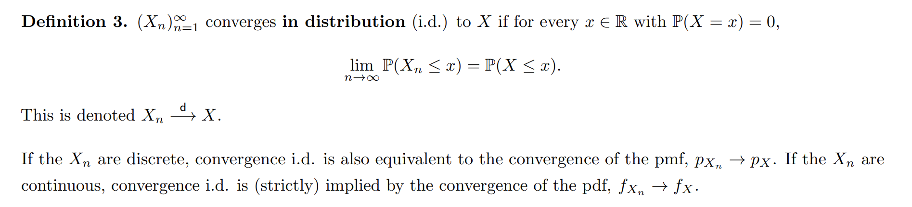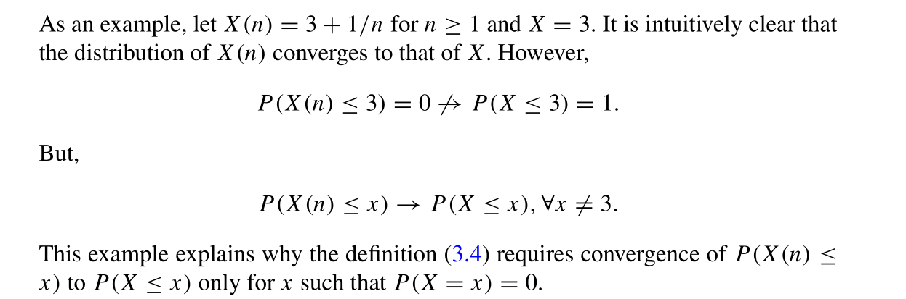

### Converge to a constant
> [!property] Converge in distribution to constant
> 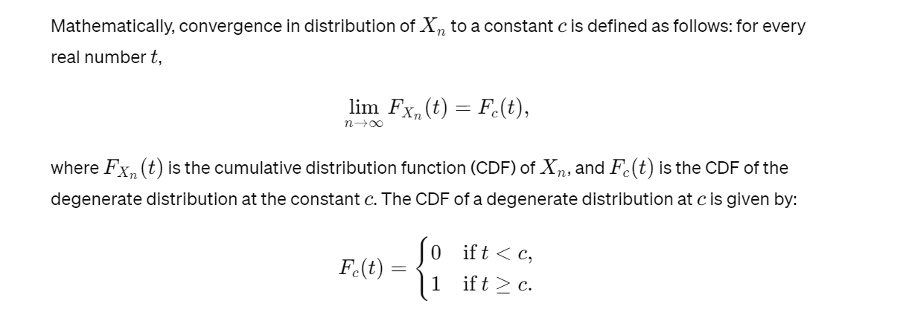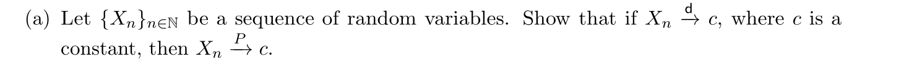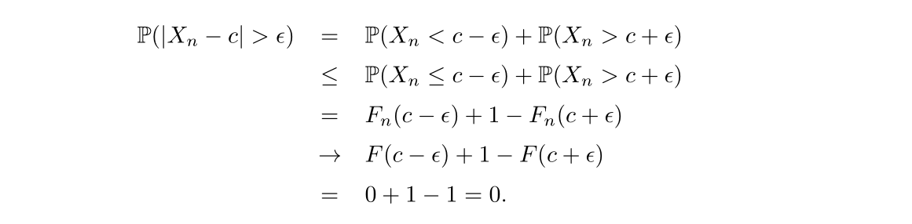
> In simpler terms, as n becomes very large, the probability that $X_n$ takes a value less than any number less than $c$ goes to 0, and the probability that $X_n$ takes a value less than or equal to any number greater than or equal to c goes to 1. Effectively, this means that $X_n$​ "concentrates" around c, and for practical purposes, $X_n$​ can be thought of as becoming the constant c in a probabilistic sense as n approaches infinity. 
> 
> Another way to write this theorem is(from all of statistics):
> 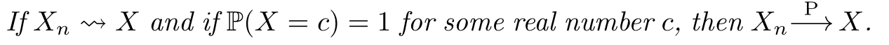

### CL!T -> WLLN
> [!important]
> 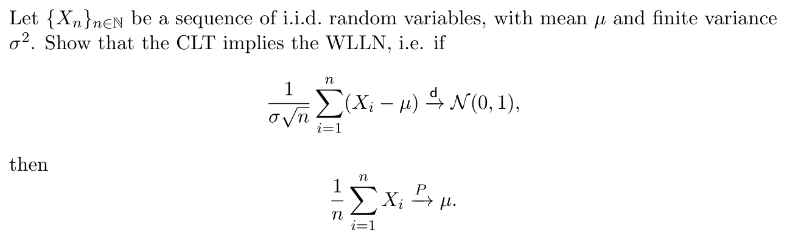
> To prove this, we need to use Slutsky's Theorem:
> 
> 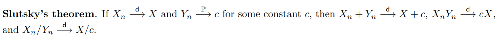
> From CLT we know 
> $$\frac{\sqrt{n}}{\sigma}\left(\frac{1}{n} \sum_{i=1}^n X_i-\mu\right) \xrightarrow{\mathrm{d}} Z \sim \mathcal{N}(0,1)$$
> We let $X_{n}=\frac{\sqrt{n}}{\sigma}\left(\frac{1}{n} \sum_{i=1}^n X_i-\mu\right)$ and $Y_n=\frac{\sigma}{\sqrt{n}}$ where $Y_n \xrightarrow{P} 0$.
> 
> Then by slutsky's theorem we have:
> $$X_nY_n\xrightarrow{d}0\times Z$$
> Thus we have:
> $$\frac{1}{n} \sum_{i=1}^n X_i-\mu \xrightarrow{\mathrm{d}} 0$$
> or stated another way
> $$\frac{1}{n} \sum_{i=1}^n X_i \xrightarrow{\mathrm{d}} \mu$$
> 
> Finally using Part (a) we can conclude that
> $$\frac{1}{n} \sum_{i=1}^n X_i \xrightarrow{P} \mu$$

## Convergence in L1
> [!def]
> 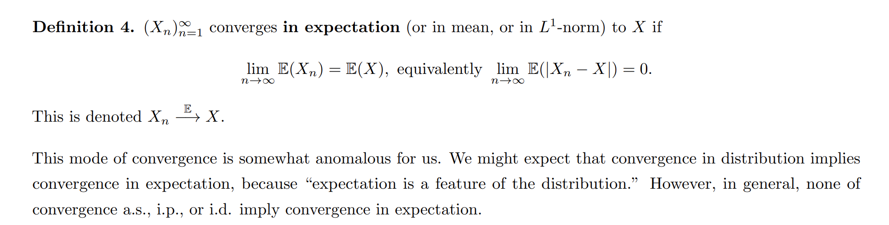

## Convergence in Lp
### Examples
> [!example] Fa23 Disc05 P3
> 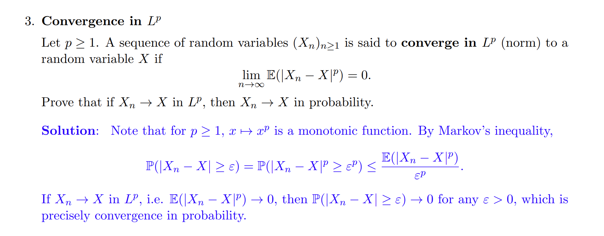

# Relationship Between Convergence
## a.s => p
> [!thm]
> 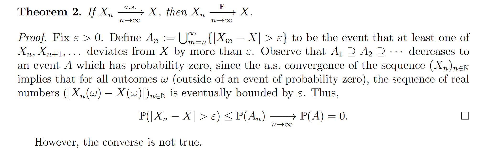

> [!proof] Detailed Proof
> 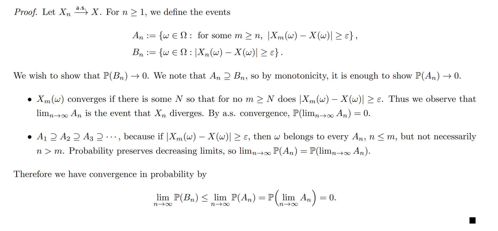

## Lp =>  p
> [!thm]
> 

## p => d
> [!thm]
> 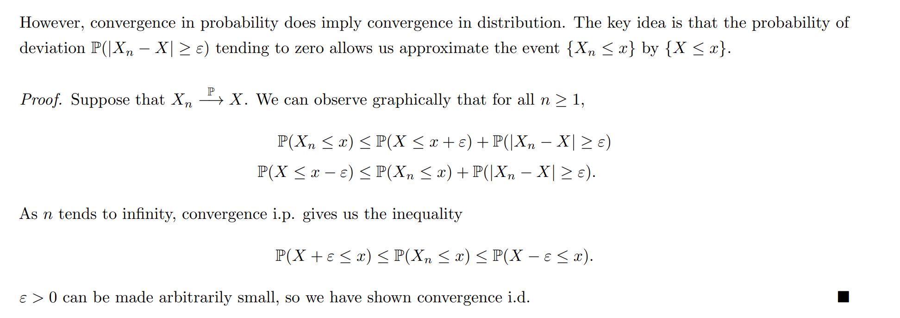

# Integrated Exercises
## On Almost Sure Convergence
> [!example] Fa23 Disc05 P1
> 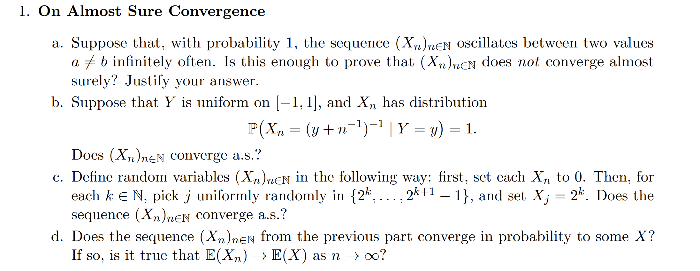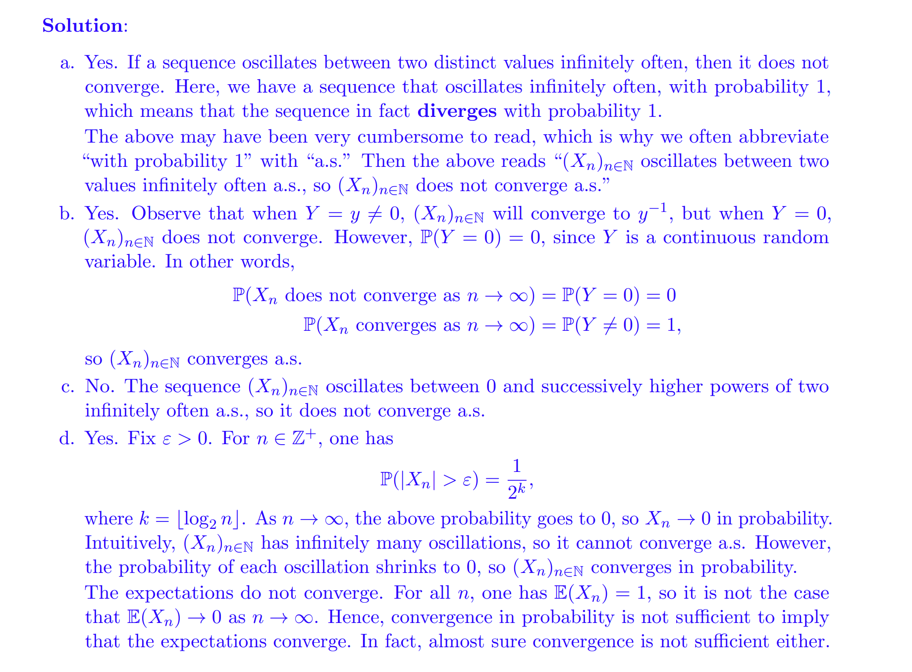

## Confidence Intervals
> [!important] Fa20 HW6 P2
> 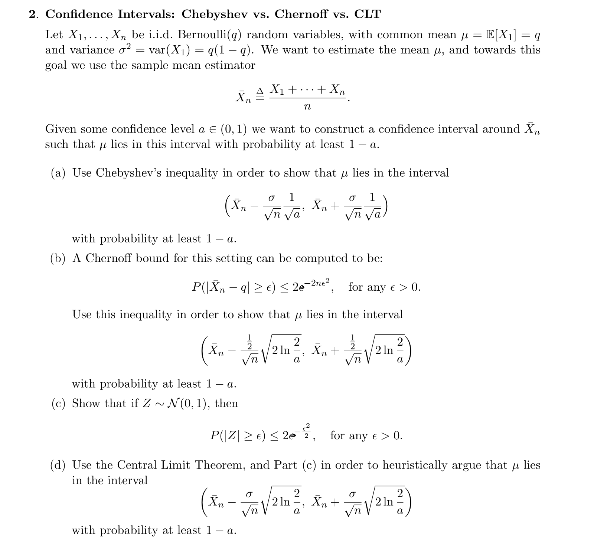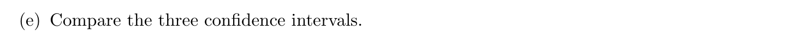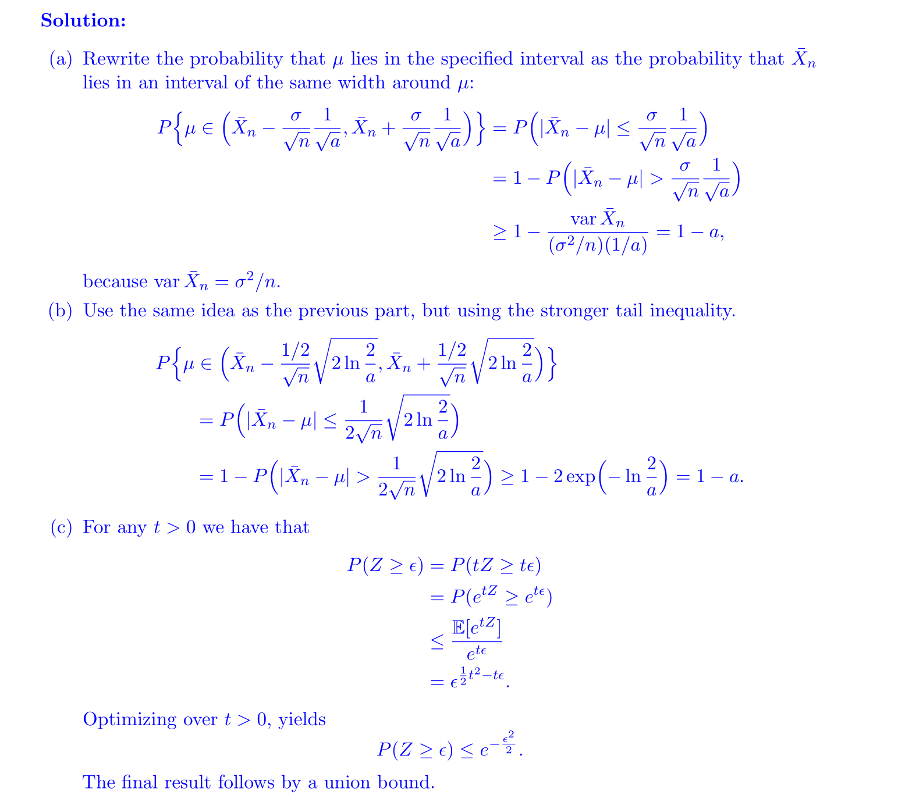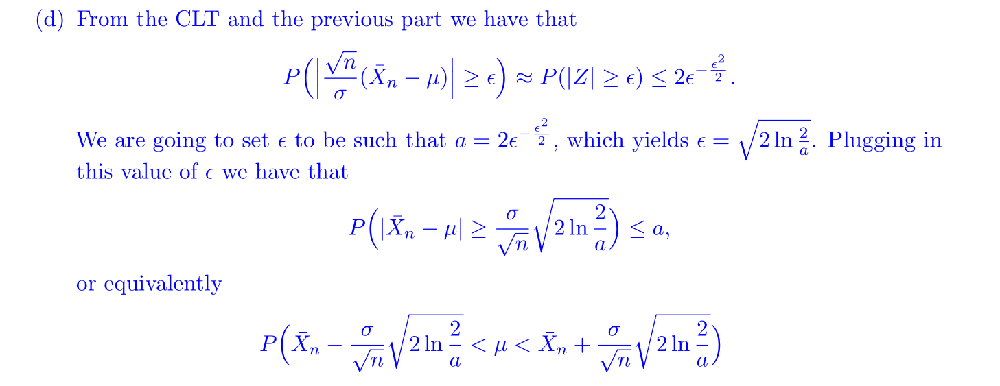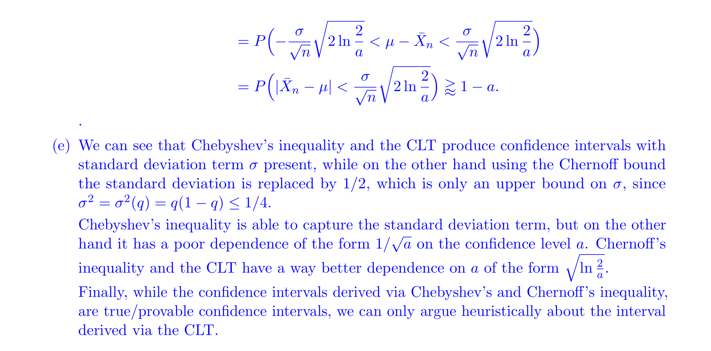

